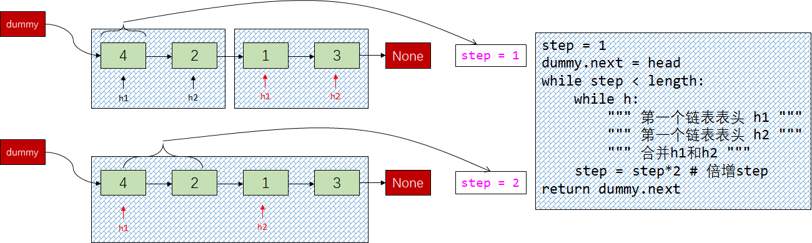
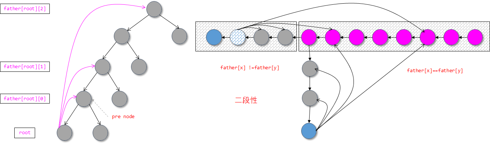

[TOC]

#### 手撕快排

```python
class Solution:
    def sortArray(self, nums: List[int]) -> List[int]:
        def quick_sort(start,end,nums):
            if start >= end: return
            left = start
            right = end
            rand_idx = random.randint(start,end)
            nums[start],nums[rand_idx] = nums[rand_idx],nums[start]
            pivot = nums[start]

            while left < right:
                while left < right and nums[right] >= pivot:
                    right -= 1
                nums[left] = nums[right]
                
                while left < right and nums[left] <= pivot:
                    left += 1
                nums[right] = nums[left]
            
            nums[left] = pivot

            quick_sort(start,left-1,nums)
            quick_sort(left+1,end,nums)

        quick_sort(0,len(nums)-1,nums)
        return nums
```


#### 手撕堆排序

+   构建一个堆的时间复杂度为 $O(n)$，后序每一次调整的时间复杂度为 $O(\log n)$

    自底向上建立堆，该建堆方式是从倒数第二层的节点（叶子节点的上一层）开始，从右向左，从下到上的向下进行调整。

    堆高度为 $h$，假设每层的高度为 $h_i$，每层节点数量为 $n_i$，则建堆复杂度为：
    $$
    T(n) = \sum_{i=1}^{h-1} n_i*h_i
    $$
    基于错位相减法：
    $$
    T(n)=2^h-h-1=n-log(n+1)
    $$
    所以时间复杂度为 $T(n)=n$。

```python
class Heap:
    def __init__(self):
        self.nums = []
    
    def push(self,x):
        self.nums.append(x)
        self.sift_up()
    
    def pop(self):
        size = len(self.nums)
        if size == 0: return -1
        val = self.nums[0]
        self.nums[0] = self.nums[size-1]
        self.nums.pop()
        self.sift_down()
        return val
    
    def sift_down(self):
        pos = 0
        child_pos = pos*2 + 1
        while child_pos < len(self.nums):
            right_pos = child_pos + 1
            if right_pos < len(self.nums) \
                and self.nums[right_pos] < self.nums[child_pos]:
                child_pos = right_pos
            
            if self.nums[pos] > self.nums[child_pos]:
                self.nums[pos],self.nums[child_pos] = \
                    self.nums[child_pos],self.nums[pos]
            else: break
            pos = child_pos
            child_pos = pos*2 + 1
        
    def sift_up(self):
        pos = len(self.nums) - 1
        while pos > 0:
            father = (pos-1) >> 1
            if self.nums[father] > self.nums[pos]:
                self.nums[father],self.nums[pos] = \
                    self.nums[pos],self.nums[father]
            pos = father
```


#### 手撕归并排序 - 递归

```python

class Solution:
    def sortArray(self, nums: List[int]) -> List[int]:      
        def merge_sort(nums):
            if len(nums) <= 1: return
            mid = len(nums) // 2
            nums1 = nums[:mid]
            nums2 = nums[mid:]
            merge_sort(nums1)
            merge_sort(nums2)
            i = j = k = 0
            while i < len(nums1) and j < len(nums2):
                if nums1[i] <= nums2[j]:
                    nums[k] = nums1[i]
                    i += 1
                else:
                    nums[k] = nums2[j]
                    j += 1
                k += 1
            
            while i < len(nums1):
                nums[k] = nums1[i]
                k += 1
                i += 1
            while j < len(nums2):
                nums[k] = nums2[j]
                k += 1
                j += 1
        merge_sort(nums)
        return nums
```


#### 手动实现字典

```python
class MyDict:
    def __init__(self,capacity=16):
        self.capacity = capacity
        self.hash_table = [None]*self.capacity
    
    def put(self,key,value):
        idx = hash(key) % self.capacity
        
        # 使用链地址法解决哈希冲突
        if self.hash_table[idx] == None:
            self.hash_table[idx] = [[key,value]]
        else:
            size = len(self.hash_table[idx])
            for i in range(size):
                if self.hash_table[idx][i][0] == key:
                    self.hash_table[idx][i] = [key,value]
                    return
            self.hash_table[idx].append([key,value])
            
    def get(self,key):
        idx = hash(key) % self.capacity
        if self.hash_table[idx] == None:
            raise ValueError("key does not exists!")
        else:
            size = len(self.hash_table[idx])
            for i in range(size):
                if self.hash_table[idx][i][0] == key:
                    return self.hash_table[idx][i][1]
            raise ValueError("key does not exists!")
```


#### 手动实现并查集

```python
# 684. 冗余连接
class UnionFind:
    def __init__(self,n):
        self.parent = {i+1:-1 for i in range(n)}
        self.rank = {i+1:1 for i in range(n)}

    def find_parent(self,index):
        while self.parent[index] != -1:
            index = self.parent[index]
        return index
    
    def union(self,x,y):
        x_parent = self.find_parent(x)
        y_parent = self.find_parent(y)

        if x_parent != y_parent:
            # 进行合并
            if self.rank[x_parent] >= self.rank[y_parent]:
                self.rank[y_parent] += 1
                self.parent[x_parent] = y_parent
            else:
                self.rank[x_parent] += 1
                self.parent[y_parent] = x_parent
            return True
        else:
            # 拒绝合并
            return [x,y]

class Solution:
    def findRedundantConnection(self, edges: List[List[int]]) -> List[int]:
        n = len(edges)
        uf = UnionFind(n)

        for edge in edges:
            res = uf.union(edge[0],edge[1])
            if res != True:
                return res
```


#### 手动实现计算器

```python
class Solution:
    def calculate(self, s: str) -> int:
        def convert_to_suffix_exp(data):
            """
            将表达式由中缀表达式转换成后缀表达式
            """
            if data[0] in "+-": data = "0" + data
            data = data.replace("(-","(0-")
            data = data.replace("(+","(0+")
            print(data)

            
            expression = {
                "+": lambda a,b: a+b,
                "-": lambda a,b: a-b,
                "*": lambda a,b: a*b,
                "/": lambda a,b: a//b,
            }            
            priority = {"+":1,"-":1,"*":2,"/":2,"(":0,")":3}
            op_set = {"+","-","(",")","*","/"} # 操作符集合
            op_stack = [] # 运算符栈
            exp_stack = [] # 表达式栈
            i = 0
            while i < len(data):
                if data[i] == " ":
                    pass
                elif data[i] in op_set:
                    if data[i] == "(": # 左边自动加入操作符栈
                        op_stack.append(data[i])
                    elif data[i] == ")":
                        while op_stack and op_stack[-1] != "(":
                            b = exp_stack.pop()
                            a = exp_stack.pop()
                            exp_stack.append(expression[op_stack.pop()](a,b))
                        op_stack.pop() # 弹出左括号
                    else:
                        # 针对 7*8+9，
                        # 在遇到+时候
                        # 在操作符栈中：[*]
                        # 在表达式栈中，[7,8]
                        # 这时候优先将: [*]出栈，加入到表达式栈中：[7,8,*],操作符栈：[+]
                        while op_stack and priority[op_stack[-1]] >= priority[data[i]]:
                            b = exp_stack.pop()
                            a = exp_stack.pop()
                            exp_stack.append(expression[op_stack.pop()](a,b))
                        op_stack.append(data[i])
                elif data[i].isdigit():
                    num = 0
                    while i < len(data) and data[i].isdigit():
                        num = num*10 + int(data[i])
                        i += 1
                    i -= 1
                    exp_stack.append(num)
                i += 1
            while op_stack: 
                b = exp_stack.pop()
                a = exp_stack.pop()
                exp_stack.append(expression[op_stack.pop()](a,b))
            return exp_stack

        return convert_to_suffix_exp(s)[0]
s = Solution()
s.calculate("12*899+(12-31)")
```


#### 非递归版本的归并排序 🍉🍉



```python
# 148. 排序链表！归并排序！O(1)空间
class Solution:
    def sortList(self, head: ListNode) -> ListNode:
        h = head
        step = 1
        
        # 获取链表长度
        length = 0
        while h: 
            h, length = h.next, length + 1
        
        
        dummy = ListNode(0)
        dummy.next = head
        while step < length:
            prev, h = dummy, dummy.next
            while h:
                """ 得到需要合并的两个链表头 """
                # 得到第一个链表表头
                h1, i = h, step
                while i and h: 
                    h = h.next
                    i = i - 1
                if i > 0: break
                
                # 得到第二个链表表头
                h2, i = h, step
                while i and h: 
                    h = h.next
                    i = i - 1
                
                # 计算两个链表的长度
                c1, c2 = step, step - i

                # 合并h1和h2
                while c1 > 0 and c2 > 0:
                    if h1.val < h2.val: 
                        prev.next = h1
                        h1 = h1.next
                        c1 = c1 - 1
                    else: 
                        prev.next = h2
                        h2 = h2.next
                        c2 = c2 - 1
                    prev = prev.next
				
                # 最后额外元素的处理
                while c1 > 0 or c2 > 0:
                    if c1 > 0: 
                        prev.next = h1
                        h1 = h1.next
                    elif c2 > 0: 
                        prev.next = h2
                        h2 = h2.next
                    prev = prev.next
                    c1 -= 1
                    c2 -= 1
                    
                prev.next = h # 拼接，合并链表
            step = step*2 
        return dummy.next
```


####  非递归版本的快排

```python
def qs(start,end,nums):
    if start >= end: return []
    left = start
    right = end
    pivot = nums[start]
    while left < right:
        if left < right and nums[right] >= pivot:
            right -= 1
        nums[left] = nums[right]
        if left < right and nums[left] <= pivot:
            left += 1
        nums[right] = nums[left]
    nums[left] = pivot
    return [[start,left],[left+1,end]]

def sort(nums):
    n = len(nums)
    stack = []
    stack.append([0,n-1])
    while stack:
        left,right = stack.pop()
        stack += qs(left,right,nums)
```


#### 十大排序算法


#### Floyd算法


```python
INF = float("inf")
graph = [
    [0  ,   2,  6,  4],
    [INF,   0,  3,INF],
    [  7, INF,  0,  1],
    [  5, INF, 12,  0]
]
def floyd(graph,start,target):
    n = len(graph)
    dp = [[graph[i][j] for j in range(n)] for i in range(n)]
    path = [[j for j in range(n)] for i in range(n)] 
    for k in range(n):
        for i in range(n):
            for j in range(n):
                if dp[i][j] > dp[i][k] + dp[k][j]:
                    dp[i][j] = dp[i][k] + dp[k][j]
                    path[i][j] = path[i][k]
    
    cur = start
    ans = [str(cur+1)]
    while cur != target:
        cur = path[cur][target]
        ans.append(str(cur+1))
    print("short path from {} to {} : {}".format(start+1,target+1,"->".join(ans)))
    print("value: {}".format(dp[start][target]))
floyd(graph,start=1,target=3)
```


#### 倍增LCA



```python
# class TreeNode:
#     def __init__(self, x):
#         self.val = x
#         self.left = None
#         self.right = None
class Solution:
    def lowestCommonAncestor(self, root: TreeNode, p: TreeNode, q: TreeNode) -> TreeNode:
        maxd = 20
        depth_dict = collections.defaultdict(int)
        # fa[u][i]维护的是结点u向上走2 ^ i步后所到的结点
        father = collections.defaultdict(lambda :[0]*maxd)
        

        def dfs(root,pre,depth): # root 表示当前dfs节点，pre表示父节点
            if not root: return 
            father[root][0] = pre # 特殊判断
            depth_dict[root] = depth # 记录每个节点的深度
            
            i = 1
            while depth_dict[root]-(1<<i) >= 0:
                # 当前节点root，向上走2^i步 --> 
                #        当前节点的父节点向上走2^(i-1)步
                father[root][i] = father[father[root][i-1]][i-1]
                i += 1

            dfs(root.left,root,depth+1)
            dfs(root.right,root,depth+1)


        def up(root,d): # 将深度较深的那个节点提升相同深度
            if d == 0: return root
            for i in range(0,maxd):
                if (1<<i) & d: 
                    root = father[root][i]
            return root
                
        def lca(x,y):
            m = depth_dict[x] 
            n = depth_dict[y]
            if m > n:
                x,y = y,x
                m,n = n,m
            y = up(y,n-m) # promote y-val

            if x == y: return x

            for i in range(maxd-1,-1,-1):
                if father[x][i] != father[y][i]:
                    x = father[x][i]
                    y = father[y][i]
            return father[x][0]
        
        dfs(root,None,0)
        return lca(p,q)
```


#### 双向BFS

```python
class Solution:
    def findLadders(self, beginWord: str, endWord: str, wordList: List[str]) -> int:
        dicts = set(wordList)
        if endWord not in dicts: return []

        find_flag = False 
        reverse = False
        visited = {beginWord,endWord}
        q1 = collections.deque([beginWord])
        q2 = collections.deque([endWord])

        # 用来恢复中间序列的
        next_word = {val:set() for val in wordList + [beginWord]}
        
        while q1:
            size = len(q1)
            sub_visited = set()
            for i in range(size):
                cur = q1.popleft()
                for i in range(len(cur)):
                    for j in range(26):
                        w = cur[:i] + chr(97+j) + cur[i+1:]
                        if w not in dicts: continue
                        
                        if w in q2:
                            if reverse: next_word[w].add(cur)
                            else: next_word[cur].add(w)
                            find_flag = True
                            continue
                        if w in visited:
                            continue
                        if reverse: next_word[w].add(cur)
                        else: next_word[cur].add(w)
                        sub_visited.add(w)
                        q1.append(w)
            if find_flag:
                break
            visited.update(sub_visited)
            if len(q1) > len(q2):
                q1,q2 = q2,q1
                reverse = not reverse

        ans = []
        path = [beginWord]
        # print(next_word)
        def backtrace(cur_str,next_word):
            if cur_str == endWord:
                ans.append(path[:])
                return
            for val in next_word[cur_str]:
                path.append(val)
                backtrace(val,next_word)
                path.pop()
        backtrace(beginWord,next_word)
        return ans
```


#### 牛客网处理ACM输入输出

+ python

```python
"""
输入：
15
0 7 7 7
*5#++B+B+++++$3
55#+++++++###$$
###$++++++#+*#+
++$@$+++$$$3+#+
+++$$+++$+4###+
A++++###$@+$++A
+++++#++$#$$+++
A++++#+5+#+++++
+++$$#$++#++++A
+++$+@$###+++++
+###4+$+++$$+++
+#+3$$$+++$##++
+#*+#++++++#$$+
$####+++++++$##
3$+++B++B++++#5
"""

if __name__ == "__main__":
    while True:
        try:
            n = int(sys.stdin.readline().strip())
            pos = [int(val.strip()) for val in sys.stdin.readline().split(" ")]
            matrix = []
            for i in range(n):
                line = sys.stdin.readline().strip()
                matrix.append(list(line))

            s = Solution()
            ans = s.solve(n,pos,matrix)
            print(ans)
        except:
            break
```

+ c语言

```c
#include <math.h>
#include <time.h>
int main() {
    int n;
    scanf("%d",&n);
    int *data = (int *)malloc(sizeof(int)*n);
    for(size_t i = 0; i < n; i++) {
        scanf("%d",&data[i]);
    }
    for(size_t i = 0; i < n; i++) {
        printf("%d ",data[i]);
    }
    printf("\n");
    return 0;
}
```

