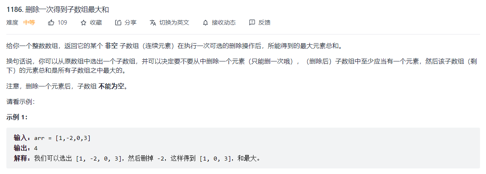
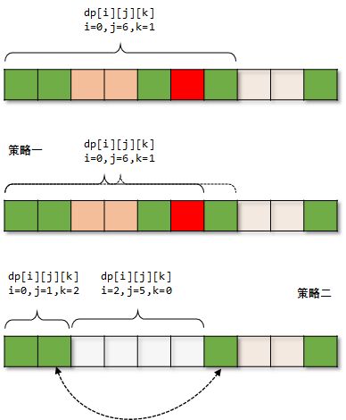
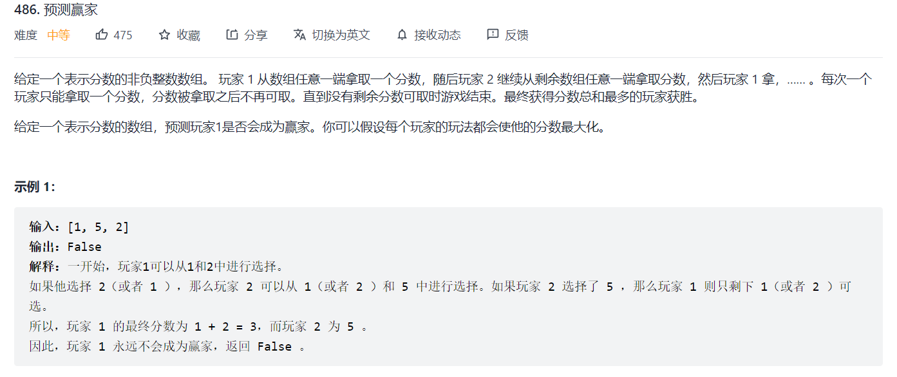

## 1. 动态规划基本流程

#### 1.1 动态规划流程概述

```mermaid
graph LR
A(重叠子问题)-->D(动态规划)
B(最优子结构)-->D(动态规划)
C(状态转移方程)-->D(动态规划)
D-->E(确定base case)
D-->F(确定state)
D-->G(确定action)
D-->H(定义DP数组含义)

1(确定base case)-->2(确定state)-->3(确定action)-->4(定义DP数组含义)
```



**重叠子问题：** 递归树中的节点，自上而下存在重复节点。

**最优子结构：**注意这的`最优` ，比如:shu
$$
dp(n) = \min \{dp(n-coin)+1|coin\in coins\}
$$
**状态转移方程：**从一个状态转移到另一个状态的规则


**base case：** 自底向上，最底下的就是base case，硬币问题中，目标金额为0时，算法返回0。

**state：**原问题和子问题中会变换的变量。比如硬币问题中，唯一的状态就是目标金额`amount`。

**action：**导致状态发生变换的行为。比如选择哪一枚硬币。

**dp函数/数组的含义：** **函数/数组**的**输入/下标**是状态转移过程中会变化的量，也就是上面讲到的状态。而**输出**就是我们需要求解的目标，比如达到$n$需要的最小的硬币数目$\text{dp}(n)=3$；$\Leftrightarrow$ 这个**dp**的定义很重要，定义不清，状态转移方程就写不出来。


#### 1.2 动态规划问题分类


#### 1.3 可做的列表 [🔗](https://leetcode-cn.com/circle/article/NfHhXD/)

>   线性DP

+   最经典单串：300. 最长上升子序列

+   最经典双串：1143. 最长公共子序列

+   经典问题：
```python
120. 三角形最小路径和
53. 最大子序和
152. 乘积最大子数组
887. 鸡蛋掉落（DP+二分）
354. 俄罗斯套娃信封问题
```

+   打家劫舍系列: (打家劫舍3 是树形DP)
```python
198. 打家劫舍
213. 打家劫舍 II
```

+   股票系列:
```python
121. 买卖股票的最佳时机
122. 买卖股票的最佳时机 II
123. 买卖股票的最佳时机 III
188. 买卖股票的最佳时机 IV
309. 最佳买卖股票时机含冷冻期
714. 买卖股票的最佳时机含手续费
```

+ 字符串匹配系列
```python
72. 编辑距离
44. 通配符匹配
10. 正则表达式匹配
```

>   区间DP
```python
312. 戳气球
516. 最长回文子序列
546. 移除盒子
664. 奇怪的打印机
730. 统计不同回文子字符串
1039. 多边形三角剖分的最低得分
```

>   背包问题

```python
416. 分割等和子集 (01背包-要求恰好取到背包容量)
494. 目标和 (01背包-求方案数)
322. 零钱兑换 (完全背包)
518. 零钱兑换 II (完全背包-求方案数)
474. 一和零 (二维费用背包)
```

>   计数型 DP

```python
62. 不同路径
63. 不同路径 II
96. 不同的二叉搜索树 (卡特兰数)
1259. 不相交的握手 (卢卡斯定理求大组合数模质数)
```

>   博弈型DP

```python
策梅洛定理，SG 定理，minimax
# 翻转游戏
293. 翻转游戏
294. 翻转游戏 II

# Nim游戏
292. Nim 游戏

# 石子游戏
877. 石子游戏
1140. 石子游戏 II

# 井字游戏
348. 判定井字棋胜负
794. 有效的井字游戏
1275. 找出井字棋的获胜者
```

>   记忆化搜索

```python
329. 矩阵中的最长递增路径
576. 出界的路径数
```


## 2 线性DP

#### 2.1 基本结构

一维DP的算是比较简单的DP问题（也有例外），因为涉及的状态往往有限。

最直观的解决方法就是二维遍历，暴力解决。

```python
# (1) 暴力法解决
for i in range(n):
    for j in range(i):
        dp[i] = 最值(dp[i],dp[j]+...)
```

而一些变形题就是在空间上或者时间上进行压缩。

#### 2.2 题目

##### 53 最大子序和

思路：基本的思想是判断当前`num[i]`是否可以累加到历史最大和上；而判断标准就是`cur_sum`是否大于0，如果大于0，则继续累加，否则重新开始。这一题实际上和加油站问题类似。

```python
class Solution:
    def maxSubArray(self, nums: List[int]) -> int:
        cur_sum = nums[0]
        ans = cur_sum
        n = len(nums)
        for i in range(1,n):
            if cur_sum >= 0:
                cur_sum += nums[i]
            else:
                cur_sum = nums[i]
            ans = max(cur_sum,ans)
        return ans
```

##### 55 跳跃游戏

>   
>
>   事实上应该是贪心算法。

```python
class Solution:
    def canJump(self, nums: List[int]) -> bool:
        cur_max = 0
        total_max = 0
        n = len(nums)

        for i in range(n):
            if cur_max < i:
                if total_max < i:
                    return False
                cur_max = total_max
            total_max = max(total_max,i+nums[i])
            

        return True


```

##### 1186. 删除一次得到子数组最大和

>   
>
>   思路：类似与买卖股票问题，引入一个额外的状态，表示删除元素的数量

```python
class Solution:
    def maximumSum(self, arr: List[int]) -> int:
        """
        dp[i][0] = arr[i] if dp[i-1][0] < 0 else (dp[i-1][0]+arr[i])

        dp[i][1] = max(dp[i-1][1]+arr[i],dp[i-1][0])
        """
        n = len(arr)
        INF = float("inf")
        dp = [[-INF,-INF] for i in range(n)]
        dp[0] = [arr[0],-INF]
        ans = max(dp[0])
        for i in range(1,n):
            dp[i][0] = (0 if dp[i-1][0] < 0 else dp[i-1][0]) + arr[i]
            dp[i][1] = max(dp[i-1][1]+arr[i],dp[i-1][0])
            ans = max(ans,max(dp[i]))
        return ans

```


##### 134 加油站

>   思路：如果当前的和小于零，则加入历史，然后重新开始；否则将当前数字加入cur_sum。最后比较cur_sum与历史。想要理解这一题一定要明白最优子结构问题。
>
>   比较**最大字段和** 和 **所有负数区间** 的关系。

```python
class Solution:
    def canCompleteCircuit(self, gas: List[int], cost: List[int]) -> int:
        n = len(gas)
        left = [gas[i]-cost[i] for i in range(n)]

        total_neg = 0
        cur_sum = 0
        ans = 0
        for i in range(n):
            if cur_sum < 0:
                ans = i
                total_neg += cur_sum
                cur_sum = left[i]
            else:
                cur_sum += left[i]
        return ans if cur_sum + total_neg >= 0 else -1
```
##### 152 乘积最大子数组

>   思路：这一题和股票买卖的思路有点相似，需要最大正数和最小负数之间进行状态转换。
>   重点🚀：这里`dp[i]`数组的定义是，以数字`nums[i]`为结尾的最大乘积，当然这一题还需要维护一个最小值。

```python
class Solution:
    def maxProduct(self, nums: List[int]) -> int:
        f_max = f_min = nums[0]
        n = len(nums)
        ans = nums[0]
        for i in range(1,n):
            if nums[i] < 0:
                f_max,f_min = f_min,f_max
            f_max = max(f_max*nums[i],nums[i])
            f_min = min(f_min*nums[i],nums[i])
            ans = max(max(f_max,f_min),ans)
        return ans
```


##### 剑指 Offer 60 n个骰子的点数

>   

```python
class Solution:
    def dicesProbability(self, n: int) -> List[float]:
        dp = [[0.0]*(6*n+1) for i in range(n)] 
        start = 1
        end = 6

        for i in range(start,end+1):
            dp[0][i] = 1/6

        for i in range(1,n):
            start += 1
            end += 6
            for j in range(start,end+1):
                begin = j-6 if j > 6 else 1
                dp[i][j] = sum([dp[i-1][k]*(1/6) for k in range(begin,j)])
        
        return dp[n-1][start:end+1]
```


##### 357. 计算各个位数不同的数字个数 🍉

>   思路：按照排列数求解，如果位数位n，那么不同的数字个数为:`n*(n-1)*...`，**但是需要注意，这只是长度为n的数字**，还需要考虑长度为`n-1,n-2,...,1`的数字。

```python
class Solution:
    def countNumbersWithUniqueDigits(self, n: int) -> int:
        """
            dp[i] = dp[i-1] + {10*9*8*...}[i] - {9*8*...}[i-1]
            --> dp[i] = dp[i-1] + {9*9*8*...}[i]
            这里的dp[i-1]表示的含义是i-1位数的各位数不同的数量
        """
        if n == 0: return 1
        def helper(m):
            ans = 1
            for i in range(m): ans *= (9-i)
            return ans
        dp = [0]*(n+1)
        dp[0] = 1        
        for i in range(1,n+1):
            dp[i] = dp[i-1] + helper(i-1)*9
        print(dp)
        return dp[n]
```


##### 300 最长递增子序列

>   思路：这一题是俄罗斯套娃问题的基础题

```python
class Solution:
    def lengthOfLIS(self, nums: List[int]) -> int:
        """
        定义dp[i]为下标为i所能构成的数组的有序集合
        """
        n = len(nums)
        dp = []
        for i in range(n):
            if not dp or dp[-1] < nums[i]:
                dp.append(nums[i])
            else:
                index = bisect.bisect_left(dp,nums[i])
                dp[index] = nums[i]
        
        return len(dp)
```

##### NC 91 最长递增子序列变种题

>   

```python
#
# retrun the longest increasing subsequence
# @param arr int整型一维数组 the array
# @return int整型一维数组
#
import bisect
class Solution:
    def LIS(self , arr ):
        dp = []
        max_lens = []
        n = len(arr)

        for i in range(n):
            if not dp or dp[-1] < arr[i]:
                dp.append(arr[i])
                max_lens.append(len(dp))
            else:
                index = bisect.bisect_left(dp,arr[i])
                dp[index] = arr[i]
                max_lens.append(index+1)
        
        size = len(dp)
        i = len(max_lens) - 1
        ans = []

        while i >= 0:
            if size <= 0: break
            if size == max_lens[i]:
                size -= 1
                dp[size] = arr[i]
            i -= 1
        return dp
```


##### 354. 俄罗斯套娃信封问题

>   思路：将二维问题转化为一维的最长递增子序列问题
>
>   给出一个例子：[[2, 3], [5, 4], [6, 5], [6, 7]]，如果我们只看第二维，那么似乎最长递增子序列等于4，但是发现第三个和第四个由于宽度一样，所以无法套娃。所以引入第二维排序，得到：
>   [[2, 3], [5, 4], [6, 7], [6, 5]]
> 这样就转化成了第二个维度的最长递增子序列问题

```python
class Solution:
    def maxEnvelopes(self, envelopes: List[List[int]]) -> int:
        def lower_bound(nums,key_val,l,r):
            while l < r:
                mid = l + (r-l) // 2
                if nums[mid] == key_val:
                    r = mid
                elif nums[mid] < key_val:
                    l = mid + 1
                else:
                    r = mid
            return l

        if len(envelopes) <= 1: return len(envelopes)
        envelopes.sort(key=lambda x:(x[0],-x[1]))

        dp = [envelopes[0][1]]
        for i in range(1,len(envelopes)):
            if envelopes[i][1] > dp[-1]:
                dp.append(envelopes[i][1])
            else:
                idx = lower_bound(dp,envelopes[i][1],0,len(dp))
                dp[idx] = envelopes[i][1]
        return len(dp)
```


##### 368 最大整除子集

>   思路：和最长递增子序列思路类似，偏暴力。

```python
class Solution:
    def largestDivisibleSubset(self, nums: List[int]) -> List[int]:
        # 定义dp数组
        # dp[i] = (len,index) 表示以i为结尾的集合，最大的整除子集的长度和上一个下标
        nums.sort()
        n = len(nums)
        dp = [[1,-1] for i in range(n)]
        # 二维遍历
        for i in range(1,n):
            for j in range(i-1,-1,-1):
                if nums[i] % nums[j] == 0:
                    if dp[j][0]+1 > dp[i][0]:
                        dp[i][0] = dp[j][0] + 1
                        dp[i][1] = j
        
        # 找到长度最大的下标
        max_len,index = dp[0]
        for i in range(1,n):
            if dp[i][0] > max_len:
                index = i
                max_len = dp[i][0]
        
        # 如果下标为-1，表示最长整除子集为0
        if index == -1: return [nums[0]]
        else:
            # 否者构造答案
            ans = collections.deque()
            while index != -1:
                ans.appendleft(nums[index])
                index = dp[index][1]
            return list(ans)
```

##### 376. 摆动序列

>   

```python
class Solution:
    def wiggleMaxLength(self, nums: List[int]) -> int:
        """
        dp[i][0] 表示以第i个数位结尾的，上升的最长摆动序列
        dp[i][1] 表示以第i个数位结尾的，下降的最长摆动序列
        """
        n = len(nums)
        dp = [[1,1] for i in range(n)]
        for i in range(1,n):
            for j in range(i):
                if nums[j] > nums[i]:
                    dp[i][1] = max(dp[i][1],dp[j][0]+1)
                elif nums[j] == nums[i]:
                    dp[i][1] = max(dp[i][1],dp[j][1])
                    dp[i][0] = max(dp[i][0],dp[j][0])
                else:
                    dp[i][0] = max(dp[i][0],dp[j][1]+1)
        return max(dp[n-1])
```


##### 646. 最长数对链

>   
>
>   思路和最长递增子序列类似，只不过需要做一些额外处理

```python
class Solution:
    def findLongestChain(self, pairs: List[List[int]]) -> int:
        n = len(pairs)
        pairs.sort(key=lambda x:[x[0],-x[1]])
        dp = []
        
        def lower_bound(dp,key):
            left,right = 0,len(dp)
            while left < right:
                mid = left + (right-left) // 2
                if dp[mid][0] >= key[0]:
                    right = mid
                else:
                    left = mid + 1
            return left
        for i in range(n):
            if not dp or pairs[i][0] > dp[-1][1]:
                dp.append(pairs[i])
            else:
                index = lower_bound(dp,pairs[i])
                if index == len(dp): index -= 1
                if dp[index][1] > pairs[i][1]:
                    dp[index] = pairs[i]
        return len(dp)
```

当然也有一般做法：

```python
class Solution:
    def findLongestChain(self, pairs: List[List[int]]) -> int:
        n = len(pairs)
        dp = [0]*(n)
        pairs.sort()
        print(pairs)
        for i in range(n):
            dp[i] = 1
            for j in range(i):
                if pairs[i][0] > pairs[j][1]:
                    dp[i] = max(dp[i],dp[j]+1)
        return dp[n-1]
```


##### 983 最低票价 🍉

>   最重要的思路在于将离散的`days=[1,3,7]` 转化为连续的 `day=[0,1,0,1,0,0,0,1]`

```python
from typing import *
class Solution:
    def mincostTickets(self, days: List[int], costs: List[int]) -> int:
        """
        target = days[-1] 这表示需要访问的最大天数
        dp[i]表示达到当前天数所需要的最小的最小硬币数量 
        """
        target = days[-1]
        last = [1,7,30]
        dp = [0]*(1+target)

        mydays = [0]*(1+target)
        for day in days: mydays[day] = 1
        
        for i in range(1,target+1):
            if mydays[i] == 0:
                dp[i] = dp[i-1]
            else:
                dp[i] = float("inf")
                for j in range(len(last)):
                    k = i-last[j] if i>=last[j] else 0
                    dp[i] = min(dp[k]+costs[j],dp[i])
        return dp[target]
```


最长公共子序列证明：


## 2. 二维DP

#### 2.1 基本结构

+   第一类：暴力法解决

```python
for i in range(n):
    for j in range(m):
        if arr[i] == arr[j]:
            dp[i][j] = dp[i][j] + ...
        else:
            dp[i][j] = 最值(...)
# (3) 第二类，涉及一个字符串，比如最长回文子序列，也称为区间DP
# 这时候DP数组的含义是arr[i...j]范围内的结果
```

+   第二类，涉及两个字符串，比如最长公共序列

 这时候DP数组的含义是arr1[i]和arr2[j]的为结尾的某种含义。

+   第三类，涉及一个字符串，比如最长回文子序列，也称为区间DP

这时候DP数组的含义是arr[i...j]范围内的结果，往往**涉及到dp状态的合并和分解**。


#### 2.2 遍历的三种形式

+   递归形式

```python
# 递归写法
@functools.lru_cache(None)
def helper(i,j):
    if i > j: return 0
    if i == j: return 1
    if s[i] == s[j]:
        return helper(i+1,j-1)
   	else:
        return max(helper(i+1,j),helper(i,j-1))
```

+   自底向上

```python
# 迭代写法,从下到上遍历
i = n - 1
while i >= 0:
    j = i + 1
    while j < n:
        print((i,j),end="")
        j += 1
	print()
    i -= 1

>>> 输出
(3, 4)
(2, 3)(2, 4)
(1, 2)(1, 3)(1, 4)
(0, 1)(0, 2)(0, 3)(0, 4)

```

+   斜向

```python
n = 4
for size in range(1,n+1):
    for i in range(n-size+1):
        j = i + size - 1
        print(i,j)
```


>   参考链接


>   基本设定：

**合并：** 将两个或多个部分进行整合。

**特征：** 能将问题分解为两两合并的形式

**求解：**对整个问题设最有值，枚举合并点，将问题分解为左右两个部分。


#### 2.2 常见二维DP

##### 64. 最小路径和

思路：状态压缩，将二维压缩成一维

```python
class Solution:
    def minPathSum(self, grid: List[List[int]]) -> int:
        m = len(grid)
        n = len(grid[0])

        dp = list(itertools.accumulate(grid[0]))

        for i in range(1,m):
            for j in range(n):
                if j == 0:
                    dp[j] += grid[i][j]
                else:
                    dp[j] = min(dp[j-1],dp[j]) + grid[i][j]
        return dp[n-1]
```


##### 97 交错字符串

>   
>
>   思路：定义一个二维数组即可

```python
class Solution:
    def isInterleave(self, s1: str, s2: str, s3: str) -> bool:
        m = len(s1)
        n = len(s2)
        if m+n != len(s3): return False

        """
        dp[i][j] 表示s1的前i个和s2的前j个是否能够组合在一起构成
        """
        dp = [[False]*(n+1) for i in range(m+1)]
        dp[0][0] = True
        for i in range(1,m+1): 
            dp[i][0] = s1[i-1] == s3[i-1] and dp[i-1][0]

        for j in range(1,n+1): 
            dp[0][j] = s2[j-1] == s3[j-1] and dp[0][j-1]

        for i in range(1,m+1):
            for j in range(1,n+1):
                dp[i][j] = (dp[i-1][j] and s1[i-1] == s3[i+j-1]) or \
                            (dp[i][j-1] and s2[j-1] == s3[i+j-1])
        return dp[m][n]
```


##### 115. 不同的子序列

>   思路：这一题并没有达到困难的程度，思路很简单，定义`dp[i][j]`为长度为`i`的`s`包含长度为`j`的`t`的数量。
>
>   如果当前的`i`和`j`所代表的字符相等，那么可以选择匹配，也可以选择不匹配 `dp[i][j]=dp[i-1][j]+dp[i-1][j-1]`。
>
>   如果当前的`i`和`j`所代表的字符不相等，那么只能选择不匹配 `dp[i][j]=dp[i-1][j-1]`。
>
>   

```python
class Solution:
    def numDistinct(self, s: str, t: str) -> int:
        """
        定义二维dp,
        dp[i][j]表示 s[:i] 字符串 中包含 t[:j] 的个数 
        """
        """
        m,n = len(s),len(t)
        if m == 0 or n == 0: return 0
        dp = [[0]*(n) for i in range(m)]
        dp[0][0] = 1 if s[0] == t[0] else 0
        for i in range(1,m): 
            if s[i] == t[0]: dp[i][0] = dp[i-1][0] + 1
            else: dp[i][0] = dp[i-1][0]

        for i in range(1,m):
            for j in range(1,n):
                if s[i] == t[j]:
                    dp[i][j] = dp[i-1][j-1]
                dp[i][j] += dp[i-1][j]
        return dp[m-1][n-1]
        """
        
        @functools.lru_cache(None)
        def helper(i,j,s,t):
            if i < j: return 0
            if j < 0: return 1
            if i < 0: return 0

            if s[i] == t[j]:
                return helper(i-1,j-1,s,t) + helper(i-1,j,s,t)
            else:
                return helper(i-1,j,s,t)
        m = len(s)
        n = len(t)
        return helper(m-1,n-1,s,t)
```


##### 174 地下城游戏 🍉

>   思路：体现了两种思路，通常我们的思路是从将问题缩小化：`dp[i] = dp[i-1] ... `，而这里实际上是反过来：`dp[i] = dp[i+1] ...`
>
>   定义：`dp[i][j]` 表示这个函数表示骑士从 `(i,j)` **开始**到目标点 需要耗费的最小的生命值
>
>   迭代方程：
>   $$
>   \text{dp}[i][j] + \text{grid}[i][j] = \min(\text{dp}[i+1][j],\text{dp}[i][j+1])
>   $$
>   如果：$\text{dp}[i][j]<0,\text{dp}[i][j]=0$，否则 $\text{dp}[i][j]>=0,\text{dp}[i][j]$。
>
>   而对于`健康点数不能下降到0`这一条件，我们可以在最终结果上加一。
>
>   

```python
class Solution:
    def calculateMinimumHP(self, dungeon: List[List[int]]) -> int:
        """
            # dp[i][j] 这个函数可以算出骑士需要耗费的最小的生命值
            dp[i][j] + dungeon[i][j] = min(f(i+1,j),f(i,j+1))
        """
        m = len(dungeon)
        n = len(dungeon[0])

        @functools.lru_cache(None)
        def helper(i,j):
            if i >= m or j >= n: return float("inf")
            if i == m-1 and j == n-1: return -min(dungeon[i][j],0)
            
            right = helper(i,j+1)
            down = helper(i+1,j)
            require = min(right,down) - dungeon[i][j]
            
            if require < 0: res = 0
            else: res = require
            return res

        return helper(0,0) + 1
```


##### 221. 最大正方形

>   
>
>   思路：动态规划，考虑左边和上面的元素能否帮助构建一个新的正方形。

```python
class Solution:
    def maximalSquare(self, matrix: List[List[str]]) -> int:
        """
        1. dp[i][j]表示以i，j结尾的最大正方形
        2. ...
        3.
        if matrix[i][j] == "1":
            edge = min(dp[i-1][j],dp[i][j-1])
            if matrix[i-edge][[j-edge]] == "1":
                dp[i][j] = edge + 1
        4. 边界考虑一下
        """
        m = len(matrix)
        n = len(matrix[0])
        dp = [[0]*n for _ in range(m)]
        max_edge = 0

        for i in range(m): 
            if matrix[i][0] == "1":
                dp[i][0] = 1
                max_edge = 1
        for i in range(n): 
            if matrix[0][i] == "1":
                dp[0][i] = 1
                max_edge = 1
        
        for i in range(1,m):
            for j in range(1,n):
                if matrix[i][j] == "1":
                    edge = min(dp[i-1][j],dp[i][j-1])
                    dp[i][j] = edge + int(matrix[i-edge][j-edge])
                    max_edge = max(dp[i][j],max_edge)
        
        return max_edge**2
```


##### 583. 两个字符串的删除操作

```python
class Solution:
    def minDistance(self, word1: str, word2: str) -> int:
        m = len(word1)
        n = len(word2)
        dp = [[0]*(n+1) for i in range(m+1)]
        for i in range(1,m+1):
            dp[i][0] = dp[i-1][0] + 1
        for i in range(1,n+1):
            dp[0][i] = dp[0][i-1] + 1
        for i in range(1,m+1):
            for j in range(1,n+1):
                if word1[i-1] == word2[j-1]:
                    dp[i][j] = dp[i-1][j-1]
                else:
                    dp[i][j] = min(dp[i-1][j],dp[i][j-1]) + 1
        return dp[m][n]
```


##### 650. 只有两个键的键盘 🍉

```latex
dp[i] = \min \{dp[i],dp[j]+i/j\}，找到最大质因数
```

```python
class Solution:
    def minSteps(self, n: int) -> int:
        dp = [0]*(n+1)
        for i in range(2,n+1):
            dp[i] = i
            for j in range(1,i//2):
                if i % j == 0:
                    dp[i] = min(dp[i],dp[j]+i//j)
        return dp[n]
```

##### 1143. 最长公共子序列

```python
class Solution:
    def longestCommonSubsequence(self, text1: str, text2: str) -> int:
        """。
        1. dp[i][j]表示的含义是text1中以第i个元素为结尾。text2中以第j个元素为结尾的最长公共子序列
        2. i表示的是第i个元素
        3. 状态转移方程
        dp[i][j] = dp[i-1][j-1] + 1 if t1[i-1] == t2[j-1]
        dp[i][j] = max(dp[i][j-1],dp[i-1][j]) if t1[i-1] != t2[j-1]
        """
        m = len(text1)
        n = len(text2)
        
        dp = [[0]*(n+1) for _ in range(m+1)]

        for i in range(1,m+1):
            for j in range(1,n+1):
                if text1[i-1] == text2[j-1]:
                    dp[i][j] = dp[i-1][j-1] + 1
                else:
                    dp[i][j] = max(dp[i-1][j],dp[i][j-1])
        return dp[-1][-1]
```


#### 2.3 区间DP

##### 887 鸡蛋掉落问题 🍉

>   
>
>   动态规划思想：
>
>   相当与于，我在第i层丢了一个鸡蛋，有两种可能，一种是碎了，一种没碎。
>
>   + 碎了，那么$f$ 肯定在下面，`helper(K-1,i-1)`
>   + 没有碎，那么$f$​​​ 肯定在上面（包含），当前鸡蛋接着用，`helper(K,N-i)`

```python
class Solution:
    def superEggDrop(self, K: int, N: int) -> int:
        @functools.lru_cache(None)
        def helper(K,N):
            """
            @param K: 表示有k个鸡蛋
            @param N: 表示楼层数
            @return: 表示返回的操作数
            """
            if N == 0 or N == 1 or K == 1:
                return N
            minimun = N
            for i in range(1,N+1):
                tMin = max(helper(K-1,i-1),helper(K,N-i))
                minimun = min(minimun,1+tMin) # 加上一代表当前这一次
            return minimun
        
        return helper(K,N)
```

```python
class Solution:
    def superEggDrop(self, K: int, N: int) -> int:
        # dp[k][m]表示k个鸡蛋在m步内可以测出的最多的层数
        # 看成是背包问题，
        dp = [[0]*(N+1) for i in range(K+1)]
        for m in range(1,N+1):
            dp[0][m] = 0
            for k in range(1,K+1):
                dp[k][m] = dp[k][m-1] + dp[k-1][m-1] + 1 # 摔碎了 + 没摔碎 + 当前楼层
                if dp[k][m] >= N: return m

        # print(dp)
        return N
```


##### 5 最长回文子串

>   除了可以用中心扩散算法，还可以用区间DP。定义`dp[i][j]`为是否可以构成以`i`为开始,`j`为结尾的回文子串。

```python
class Solution:
    def longestPalindrome(self, s: str) -> str:
        dp = [[0]*len(s) for _ in range(len(s))]
        for i in range(len(s)):
            dp[i][i] = 1
        
        ans = [0,0]
        max_val = 0
        i = len(s) - 2
        while i >= 0:
            j = i + 1
            while j < len(s):
                if s[i] == s[j]:
                    if i == j-1:
                        dp[i][j] = 2
                    else:
                        dp[i][j] = (dp[i+1][j-1] + 2) if dp[i+1][j-1] > 0 else 0
                else:
                    dp[i][j] = 0
                if max_val < dp[i][j]:
                    ans = [i,j]
                    max_val = dp[i][j]
                j += 1
            i -= 1
        return "" if not ans else s[ans[0]:ans[1]+1]
```


##### 87. 扰乱字符串

>    思路：定义dp数字，`dp[i][j][len]`定义为字符串`s1`从`i`开始，`s2`从`j`开始，后面长度为`len`的字符是否能形成扰乱字符串（互为翻转）。这里需要四层循环，最外层循环用来遍历长度`len`，然后两层循环用来遍历`i`和`j`，最后一层循环用来遍历`k`，用来表示翻转的位置下标。
>
>    

```python
class Solution:
    def isScramble(self, s1: str, s2: str) -> bool:
        @functools.lru_cache(None)
        def helper(s1,s2):
            if len(s1) != len(s2): return False
            if s1 == s2: return True
            if collections.Counter(s1) != collections.Counter(s2): return False
            
            for i in range(1,len(s1)):
                if helper(s1[:i],s2[:i]) and helper(s1[i:],s2[i:]):
                    return True
                
                if helper(s1[:i],s2[-i:]) and helper(s1[i:],s2[:-i]):
                    return True
            
            return False
        
        return helper(s1,s2)
```


##### 312 戳气球

>   思路：dp数组的定义很重要，`dp[i][j]`表示的含义是在不戳破`i`和`j`的情况下，可以获得的最大分数。但是这一题用动态规划做最大的问题是时间复杂度达到了`O(n^3)`，python会超时。
>
>   


```python
class Solution:
    def maxCoins(self, nums: List[int]) -> int:
        """
        dp[i][j]表示不含i和j的最大硬币
        """
        nums = [1] + nums + [1]
        n = len(nums)
        dp = [[0]*(n) for i in range(n)]
        
        for le in range(1,n+1):
            for i in range(0,n-le+1):
                j = i + le - 1
                for k in range(i+1,j):
                    dp[i][j] = max(dp[i][j],dp[i][k]+dp[k][j]+nums[i]*nums[j]*nums[k])
        # for row in dp:
        #     print(row)
        return dp[0][n-1]
```


##### 516. 最长回文子序列

思路：区间DP问题，如果`s[i]==s[j],dp[i][j]=dp[i+1][j-1]+2`；如果`s[i]!=s[j],dp[i][j]=max(dp[i+1][j],dp[i][j-1])`。关键在于区间DP更新的写法。区间类型的问题，可以选择两种遍历方式，一种实现斜着进行遍历（左边），一种是从下到上进行遍历（右边）。

```python
class Solution:
    def longestPalindromeSubseq(self, s: str) -> int:
        """
        子序列不要求连续
        dp[i][j]表示从第i个字符到第j个字符的最长回文子序列
        """
        n = len(s)
        dp = [[0]*n for i in range(n)]
        for i in range(n): dp[i][i] = 1

        for length in range(2,n+1):
            for i in range(n-length+1):
                j = i + length - 1
                if s[i] == s[j]:
                    dp[i][j] = dp[i+1][j-1] + 2
                else:
                    dp[i][j] = max(dp[i+1][j],dp[i][j-1])
        return dp[0][-1]
```


##### 546. 移除盒子 🍉

>   `dp[left][right][k]: ` 从`[left, right]`中移除颜色相同的盒子，`right`右边有 `k` 个和 `boxes[right]` 颜色相同的盒子，所获得的分数



```python
# 依赖于 全部的长度1 及 尾部状态
class Solution:
    def removeBoxes(self, boxes: List[int]) -> int:
        n = len(boxes)
        dp = [[[0]*n for _ in range(n)] for _ in range(n)]
        
        def calculatePoints(boxes,left,right,k):
            """
            dp[left][right][k] 表示的是：
            [left,right]范围内，右边有k个数和nums[right]相等，并且右边其他的数都已选取
            策略一：从[left, right], 我们可以先移除右边的颜色相同的 k + 1 个盒子, 再移除 [left, right - 1] 的盒子
            策略二：
            枚举 i， left <= i <= right - 1, 找到 boxes[i] == boxes[right],
                先移除右半部分[i + 1, right - 1]中的盒子， 为 dp[i + 1][right - 1][0]
                再移除左半部分[left, i]中的盒子， 为 dp[left][i][k + 1]

            """
            if left > right: return 0
            if dp[left][right][k] == 0:
                # 策略1
                dp[left][right][k] = calculatePoints(boxes,left,right-1,0) + (k+1)**2

                # 策略2
                for i in range(left,right):
                    if boxes[i] == boxes[right]:
                        dp[left][right][k] = max(dp[left][right][k],
                            calculatePoints(boxes,left,i,k+1)+
                                            calculatePoints(boxes,i+1,right-1,0))

            return dp[left][right][k]
        return calculatePoints(boxes,0,n-1,0)
```


##### 664 奇怪的打印机 🍉

思路：定义`dp[i][j]`为`i`到`j`的需要打印的最少次数。

```python
第一种情况：s[i] == s[j]，那么打印次数等于子问题，dp[i+1][j]
第二种情况，s[i] != s[j]，那么打印次数等于遍历分裂下标遍历, dp[i][j] = min({dp[i][k],dp[k+1][j]},k=i,...,j-1)
```

```python
class Solution:
    def strangePrinter(self, s: str) -> int:
        if not s: return 0
        N = len(s)
        dp = [[float("inf")]*N for i in range(N)]
        for i in range(N):
            dp[i][i] = 1
        for i in range(N-1,-1,-1):
            for j in range(i+1,N):
                if s[i] == s[j]:
                    dp[i][j] = min(dp[i][j],dp[i+1][j])
                else:
                    for k in range(i,j):
                        dp[i][j] = min(dp[i][j],dp[i][k]+dp[k+1][j])

        return dp[0][-1]
```


##### 730 统计不同回文子序列 🍉🍉

>   
>
>   思路：
>
>   ```latex
>   dp[i][j]定义为在区间i，j内含有多少个回文子串。
>   如果 S[i] == S[j]，这时我们需要判断[i, j]这一段中有多少字符与S[i]不相等
>   	+ 如果中间没有和S[i]相同的字母，例如"aba"这种情况，dp[i][j] = dp[i + 1][j - 1] * 2 + 2;（dp[i][j] = dp[i + 1][j - 1] * 2 代表的dp[i + 1[j - 1]这一段可以独立存在，也可在外层包裹S[i],S[j]，所有需要x2，而2是代表“aa”和“a”）
>   	+ 如果中间只有一个和S[i]相同的字母，就是"aaa"这种情况，dp[i][j] = dp[i + 1][j - 1] * 2 + 1;（x2与上面情况相同，加一单独计算"aa",而“a”在dp[i + 1][j - 1] 中计算过了）
>   	+ 否则中间至少有两个和S[i]相同的字母，就是"aabaa"这种情况，dp[i][j] = dp[i + 1][j - 1] * 2 - dp[left + 1][right - 1];（left、right请见代码注释，dp[left + 1][right - 1]这一段重复计算了）
>   否则dp[i][j] = dp[i][j - 1] + dp[i + 1][j] - dp[i + 1][j - 1];
>   
>   ```


代码

```python
class Solution:
    def countPalindromicSubsequences(self, S: str) -> int:
        n = len(S)
        dp = [[0]*n for _ in range(n)]
        for i in range(n):
            dp[i][i] = 1
        i = n - 1
        while i >= 0:
            j = i + 1
            while j < n:
                if S[i] != S[j]: # 左边字符不等于右边字符，则容斥原理
                    dp[i][j] = dp[i+1][j] + dp[i][j-1] - dp[i+1][j-1]
                else:
                    dp[i][j] = dp[i+1][j-1] * 2
                    l,r = i+1,j-1
                    while l <= r and S[l] != S[i]: l += 1 # 从左向右找到第一个等于s[i]的
                    while l <= r and S[r] != S[i]: r -= 1 # 从右向左找到第一个等于s[i]的

                    if l > r: dp[i][j] += 2 # 说明中间没有等于s[i]的
                    elif l == r: dp[i][j] += 1 # 说明只有一个等于s[i]的
                    else: dp[i][j] -= dp[l+1][r-1] # 说明有两个等于s[i]的
                dp[i][j] %= 1000000007
                j += 1
            i -= 1
        return dp[0][-1]
```


##### 1000. 合并石头的最低成本 🍉🍉

>   
>
>   区间DP

```java
class Solution:
    def mergeStones(self, stones: List[int], K: int) -> int:
        //  动态规划
        //  定义状态: f[i][j][k] 表示将 [i, j] 区间的石头缩小成 k 堆的最小体力花费
        //  合法状态: j-i+1 >= k
        //  最终答案: f[0][n-1][1]
        //  状态转移: 想要把 [i, j] 区间的合并成 1 堆, 那么它的上一个状态一定是 K 堆
        //           f[i][j][1] = f[i][j][K] + sum(i, j)
        //           而对于非 1 的情况, 即 f[i][j][k], 我们需要考虑从 i 开始的多长的区间最终合并成 1 堆f[i][j][k] = min{ f[i][j'][1] + f[j'+1][j][k-1]
        n=len(stones)
        if n < 2: return 0
        if n < K or (n-K)%(K-1): return -1
        prefix=[0]
        for s in stones: prefix.append(prefix[-1]+s)
        
        @lru_cache(None)
        def dp(i,j,m):
            if m == j-i+1: return 0 # 无需合并
            if m == 1: return dp(i,j,K)+prefix[j+1]-prefix[i]
            res = float('inf')
            for ni in range(i,j):
                res=min(res,dp(i,ni,1)+dp(ni+1,j,m-1))
            return res
        return dp(0,n-1,1)

```

##### 1039 多边三角形的最优剖分

>   总结：总的来说就这么一个公式：
>
>   


```python
class Solution:
    def minScoreTriangulation(self, values: List[int]) -> int:
        n = len(values)
        MAX_VAL = float("inf")
        if n == 3: return values[0]*values[1]*values[2]
        dp = [[MAX_VAL]*n for i in range(n)]

        # 处理长度为2的情况
        for i in range(n-1):
            dp[i][i+1] = 0

        # 处理长度为3及以上的情况
        for length in range(2,n+1):
            for i in range(n-length):
                j = i + length
                for k in range(i+1,j):
                    dp[i][j] = min(dp[i][j],dp[i][k]+dp[k][j]+values[i]*values[k]*values[j])
        
        return dp[0][n-1]     
```


##### 486. 预测赢家

>   
>
>   区间 + 博弈DP
>
>   取巧思路，如果元素的个数为偶数个，那么先手必赢。

```python
class Solution:
    def PredictTheWinner(self, nums: List[int]) -> bool:
        n = len(nums)
        dp = [[[0,0] for i in range(n)] for j in range(n)]
        for i in range(n): dp[i][i] = [nums[i],0]

        for size in range(2,n+1):
            for i in range(n-size+1):
                j = i + size - 1
                
                if dp[i][j-1][1]+nums[j] > dp[i+1][j][1]+nums[i]:
                    dp[i][j][0] = dp[i][j-1][1]+nums[j]
                    dp[i][j][1] = dp[i][j-1][0]
                else:
                    dp[i][j][0] = dp[i+1][j][1]+nums[i]
                    dp[i][j][1] = dp[i+1][j][0]
                    
        return dp[0][n-1][0] >= dp[0][n-1][1]
```


## 3. 数学相关 DP


#### 3.2 题目

##### 62. 不同路径 `机器人`

思路：这类题目不要用`dfs`，因为`dfs`很容易爆。


##### 343 整数拆分

>    思路：将一个整数`n`拆分成`a`个小数字，等价于：
>   $$
>   n=n_1\times n_2 \times ... \times n_a
>   $$
>   并使得:
>   $$
>   max(n_1\times n_2 \times \dots \times n_a)
>   $$
>   通过数学推导，可以得到优拆分点为3。
>
>   这一题在于对dp数组递推以及`base-case`的理解：`dp[i]=max{dp[j],max{dp[j]*(i-j),j*(i-j)}`。如果一个数小于等于3，那么对其进行分解，得到的结果一定小于3；所以在计算`dp[i]`的时候，如果`i`被分割成两部分，而某一部分的值是小于等于三的，应该直接用j代替，而不是用dp[j]。而`base-case`就是`dp[1]=1`。

```python
class Solution:
    def integerBreak(self, n: int) -> int:
        if n <= 3: return n-1
        dp = [0]*(1+n)
        dp[:3] = [0,1,2,3]
        for i in range(4,n+1):
            for j in range(1,i//2+1):
                dp[i] = max(dp[i-j]*dp[j],dp[i])
            i += 1 
        return dp[n]
```

除此之外，可以利用数学方法求解：

```python
class Solution:
    def integerBreak(self, n: int) -> int:
        if n <= 3: return n-1
        a,b = n//3,n%3
        if b == 0: return 3**a
        elif b == 1: return 3**(a-1)*4
        else: return 3**a*2
```


## 4 博弈型DP

#### 4.2 题目

#### 877 石子游戏

>   思路：
>
>   ```txt
>   dp[i][j].fir = max(piles[i] + dp[i+1][j].sec, piles[j] + dp[i][j-1].sec)
>   dp[i][j].fir = max(    选择最左边的石头堆     ,     选择最右边的石头堆     )
>   # 解释：我作为先手，面对 piles[i...j] 时，有两种选择：
>   # 要么我选择最左边的那一堆石头，然后面对 piles[i+1...j]
>   # 但是此时轮到对方，相当于我变成了后手；
>   # 要么我选择最右边的那一堆石头，然后面对 piles[i...j-1]
>   # 但是此时轮到对方，相当于我变成了后手。
>   
>   if 先手选择左边:
>       dp[i][j].sec = dp[i+1][j].fir
>   if 先手选择右边:
>       dp[i][j].sec = dp[i][j-1].fir
>   # 解释：我作为后手，要等先手先选择，有两种情况：
>   # 如果先手选择了最左边那堆，给我剩下了 piles[i+1...j]
>   # 此时轮到我，我变成了先手；
>   # 如果先手选择了最右边那堆，给我剩下了 piles[i...j-1]
>   # 此时轮到我，我变成了先手。
>   ```

```python
class Solution:
    def stoneGame(self, piles: List[int]) -> bool:
        n = len(piles)
        dp = [[[0,0] for _ in range(n)] for _ in range(n)]
        for i in range(n):
            dp[i][i] = [piles[i],0] # 分别代表先手和后手所能获得的最大值
        
        for length in range(2,n+1):a
            for i in range(0,n-length+1):
                j = i + length - 1
                left = dp[i+1][j][1]+piles[i] # 当前先手，选取左边
                right = dp[i][j-1][1]+piles[j] # 当前先手，选取右边
                if left > right:
                    dp[i][j][0] = left
                    dp[i][j][1] = dp[i+1][j][0]
                else:
                    dp[i][j][0] = right
                    dp[i][j][1] = dp[i][j-1][0]
        return dp[0][-1][0] > dp[0][-1][1]
```


#### 石子合并


#### 矩阵乘法

## 5. 状态转化DP

#### 5.1 整体结构


#### 5.2 题目

##### 股票系列问题

+   121 买卖股票的最佳时机


+   188 买卖股票的最佳时机 IV

```309 python
class Solution:
    def maxProfit(self, k: int, prices: List[int]) -> int:
        # dp[i][k][u]表示第i天，到这天为止最多进行k次交易，手上有无股票，时的最大收益 
        n = len(prices)
        if n <= 1 or k == 0: return 0

        k += 1# 最多进行k次交易 k取值为0,1,2表示截止到某天最多进行0次 1次 2次时的最大收益
        dp = [[[0,0] for _ in range(k)] for _ in range(n)]
        for i in range(k):# 第0天无论最多进行几次交易，手里分别有股票和没股票的最大利润如下
            dp[0][i][0]=0
            dp[0][i][1]=-prices[0]
            
        for j in range(n):# 任何天，只要是最多交易0次，那么最大收益就是0；手里有股票是不可能的
            dp[j][0][0]=0
            dp[j][0][1]=float('-INF')
        for i in range(1,n):
            for j in range(1,k):
                dp[i][j][0]=max(dp[i-1][j][0],dp[i-1][j][1]+prices[i])
                dp[i][j][1]=max(dp[i-1][j][1],dp[i-1][j-1][0]-prices[i])
        return dp[n-1][k-1][0]
```

+   309 最佳买卖股票时机含冷冻期

    >   


##### 1262. 可被三整除的最大和

思路：这一题可以拓展到`可以被k整除的最大和`，关键还是在于状态的定义，一共有三种可能的状态：

```python
# 以当前数为结尾，可以被1整除的最大和
# 以当前数为结尾，可以被2整除的最大和
# 以当前数为结尾，可以被3整除的最大和
```

这种状态和股票、最大乘积等题目具有类似的含义，关键在于找到所有可能的状态以及对应的状态转换关系。而这一题的的重点之一根据当前数与`k`相余的关系，定义状态与状态之间的转换。

```python
from typing import *
class Solution:
    def maxSumDivThree(self, nums: List[int]) -> int:
        """
        dp[i][0] 表示以第i个数结尾时，余0的最大和
        dp[i][1] 表示以第i个数结尾时，余1的最大和
        dp[i][2] 表示以第i个数结尾时，余2的最大和
        """
        n = len(nums)
        dp = [[0,0,0] for i in range(n+1)]
        dp[0] = [0,float("-inf"),float("-inf")]
        
        for i in range(1,n+1):
            cur = nums[i-1] % 3
            if cur == 0:
                dp[i][0] = max(dp[i-1][0] + nums[i-1],dp[i-1][0])
                dp[i][1] = max(dp[i-1][1] + nums[i-1],dp[i-1][1])
                dp[i][2] = max(dp[i-1][2] + nums[i-1],dp[i-1][2])
            elif cur == 1:
                dp[i][0] = max(dp[i-1][2] + nums[i-1],dp[i-1][0])
                dp[i][1] = max(dp[i-1][0] + nums[i-1],dp[i-1][1])
                dp[i][2] = max(dp[i-1][1] + nums[i-1],dp[i-1][2])
            else: 
                dp[i][0] = max(dp[i-1][1] + nums[i-1],dp[i-1][0])
                dp[i][1] = max(dp[i-1][2] + nums[i-1],dp[i-1][1])
                dp[i][2] = max(dp[i-1][0] + nums[i-1],dp[i-1][2])
        return dp[n][0]
```


##### 1371 每个元音包含偶数次最长子字符串 🍉

>   思路：异或前缀和，`dp[i]=k`的定义是表示的是下标值为`k`的时候，`i`对应的二进制都出现了奇数次
>
>   ` dp[pattern=10] = 8 表示的含义是下标值为8的时候，e和o都出现了奇数次(10=01010)。`

```python
from typing import *
class Solution:
    def findTheLongestSubstring(self, s: str) -> int:
        """
        dp[pattern=10] = 8 表示的含义是下标值为8的时候，e和o都出现了奇数次(10=01010)。
        """
        dp = [float("inf")]*32
        dp[0] = -1 # 边界条件
        n = len(s)
        cur = 0
        ans = 0

        for i in range(n):
            if s[i] == 'a': cur ^= 1
            elif s[i] == 'e': cur ^= 2
            elif s[i] == 'i': cur ^= 4
            elif s[i] == 'o': cur ^= 8
            elif s[i] == 'u': cur ^= 16
            
            if dp[cur] == float("inf"): 
                # 记录第一次出现这种状态的下标
                dp[cur] = i 
            else: 
                # 表示当前下标的状态是cur，第一次状态为cur的下标
                ans = max(ans,i-dp[cur])
        return ans
```


##### 1186. 删除一次得到子数组最大和 🍉

>   
>
>   **设置子数组中可以删除元素数量为：k**

```python
# 如果k=1
class Solution:
    def maximumSum(self, arr: List[int]) -> int:
        """
        设置子数组中可以删除元素数量为：k
        dp[i][0]表示到当前元素位置，没有删除元素获得的最大收益
        dp[i][1]表示到当前元素位置，删除一个元素获得的最大收益
        """
        K = 1
        n = len(arr)
        dp = [[0]*(K+1) for i in range(n)]
       	dp[0] = [0,float("-inf")]
        
        ans = arr[0]
        for i in range(1,n):
            dp[i][0] = max(arr[i],dp[i-1][0]+arr[i])
            dp[i][1] = max(dp[i-1][0], dp[i-1][1] + arr[i])
            ans = max(max(dp[i]),ans)

        return ans
    
# 如果k大于1
class Solution:
    def maximumSum(self, arr: List[int]) -> int:
        """
        设置子数组中可以删除元素数量为：k
        dp[i][0]表示到当前元素位置，没有删除元素获得的最大收益
        dp[i][1]表示到当前元素位置，删除一个元素获得的最大收益
        """
        K = 1
        n = len(arr)
        dp = [[0]*(K+1) for i in range(n)]
        for i in range(K):
            dp[i] = [arr[0]]*((i+1)) + [float("-inf")]*(n-i-1)
        
        ans = arr[0]
        for i in range(1,n):
            dp[i][0] = max(arr[i],dp[i-1][0]+arr[i])
            for k in range(K,0,-1):
                dp[i][k] = max(dp[i-1][k-1], dp[i-1][k] + arr[i])
            ans = max(max(dp[i]),ans)
        
        return ans
```


## 6 树型DP

#### 124 二叉树最大路径和

>   

```python
class Solution:
    def maxPathSum(self, root: TreeNode) -> int:
        self.ans = float("-inf")
        def helper(root):
            if not root: return 0
            left = helper(root.left)
            right = helper(root.right)
            self.ans = max(self.ans,max(left,0) + max(right,0) + root.val)
            return max(max(left,right),0) + root.val
        helper(root)
        return self.ans
```

#### 337. 打家劫舍 III

>   

```python
class Solution:
    def rob(self, root: TreeNode) -> int:

        def helper(root):
            if not root: return 0,0 
            l1,l2 = helper(root.left) # 返回的是打劫和不打劫的收益
            r1,r2 = helper(root.right)
            return root.val+l2+r2,max(l1,l2)+max(r1,r2) # 这一步是关键，可以打劫也可以不打劫
        
        return max(helper(root))
```


## 5. 背包问题

#### 5.1 基本因素

[【宫水三叶】详解完全背包一维空间优化推导（附背包问题攻略）](https://leetcode-cn.com/problems/perfect-squares/solution/gong-shui-san-xie-xiang-jie-wan-quan-bei-nqes/)

+   **物品是否可以重复使用**

可以重复使用，完全背包问题。不可以重复使用，0-1背包问题。

+   **是否考虑放入背包的顺序**

考虑顺序，物品放在内部；不考虑顺序，物品放在外部。

考虑顺序的含义是：`[1,2,2]`和`[2,1,1]`是两个不同的解，而不考虑顺序则表示两者是相同的解。

|                | **可以重复使用** | **不可以重复使用** |
| :------------: | :--------------: | :----------------: |
|  **考虑顺序**  |      **1**       |       **2**        |
| **不考虑顺序** |      **3**       |       **4**        |

+   **1 考虑顺序** & **可以重复使用** 

```java
for(int i = 1; i <= n; i++) { // 总价值
    for(int coin: coins) {    // 商品
        if(i - coin < 0) break;
        dp[i] = (dp[i] + dp[i - coin]) % 1000000007; // 
    }
}
```

 [377. 组合总和 Ⅳ](https://leetcode-cn.com/problems/combination-sum-iv/)，[面试题 08.11. 硬币](https://leetcode-cn.com/problems/coin-lcci/)，

+   **2 考虑顺序** & **不可以重复使用** **🍉暂时没有遇到**

```java

```

+   **3 不考虑顺序 & 可以重复使用**

```python
for i in range(m): # 商品
    dp[i][0] = 1
    for j in range(1,n+1): # 总价值
        if j < coins[i]: dp[i][j] = dp[i-1][j]
            else:
                dp[i][j] = (dp[i-1][j-coins[i]] + dp[i-1][j]) % MAX
```

+   **4 不考虑顺序 & 不可以重复使用**

```python
for i in range(m): # 商品
    dp[i][0] = 1
    for j in range(1,n+1): # 总价值
        if j < coins[i]: dp[i][j] = dp[i-1][j]
            else:
                dp[i][j] = (dp[i-1][j-coins[i]]) % MAX
```


TODO 背包问题

https://leetcode-cn.com/problems/combination-sum-iv/solution/xi-wang-yong-yi-chong-gui-lu-gao-ding-bei-bao-wen-/

https://leetcode-cn.com/problems/coin-change/solution/yi-pian-wen-zhang-chi-tou-bei-bao-wen-ti-sq9n/

#### 1. 组合问题 

+   有顺序，有顺序意味着数据的顺序代表不同答案，比如`[1,1,2]`和`[1,2,1]`表示不同结果，这时候写法一般`target`在外, `nums` 在内。

##### 377. 组合总和 Ⅳ

>   **可以`重复使用`& `考虑顺序`**
>
>   思路：定义dp[i]数组的含义为，和为i的组合总和的数量，由于考虑顺序，所以可以得到：

```python
class Solution:
    def combinationSum4(self, nums: List[int], target: int) -> int:
        n = len(nums)
        dp = [0]*(target+1)
        dp[0] = 1
        for i in range(1,target+1):
            for num in nums:
                if i >= num:
                    dp[i] += dp[i-num]
        return dp[target]
```


+   考虑顺序，意味着顺序不对最终结果产生影响，这时候写法一般`nums`在外, `target` 在内。

##### 518. 零钱兑换 II

>   **可以`重复使用`& `不考虑顺序`**

```python
class Solution:
    def change(self, amount: int, coins: List[int]) -> int:
        n = len(coins)
        dp = [0]*(amount+1)
        dp[0] = 1
        for i in range(1,n+1):
            for j in range(coins[i-1],amount+1):
                dp[j] += dp[j-coins[i-1]]
        return dp[amount]
```


##### 474. 一和零

>   可以`不可重复使用`& `不考虑顺序`
>
>   思路：本质上就是一个0-1背包问题，只不过用了二维的资源而已，这里相当于从`三维`压缩到`二维`。
>
>   

```python
class Solution:
    def findMaxForm(self, strs: List[str], m: int, n: int) -> int:
        def helper(s):
            dicts = collections.Counter(s)
            return [dicts["0"],dicts["1"]]

        dp = [[0]*(n+1) for i in range(m+1)]
        size = len(strs)
        counts = [helper(s) for s in strs]

        for k in range(size):
            for i in range(m,counts[k][0]-1,-1):
                for j in range(n,counts[k][1]-1,-1):
                    dp[i][j] = max(dp[i][j],dp[i-counts[k][0]][j-counts[k][1]]+1)
        
        return dp[m][n]
```


##### 1155 掷骰子的N种方法 🍉

>   
>
>   不考虑顺序

```python
class Solution:
    def numRollsToTarget(self, d: int, f: int, target: int) -> int:
        MAX = 1000000007
        if d*f < target: return 0

        dp = [[0]*(target+1) for i in range(d)] # 注意不能初始化target=0的情况
        for i in range(1,f+1):
            if i <= target:
                dp[0][i] = 1
        
        for i in range(1,d):
            for j in range(1,target+1):
                size = f if j >= f else j
                for k in range(j-1,j-1-size,-1):
                    dp[i][j] = (dp[i][j] + dp[i-1][k]) % MAX
        return dp[d-1][target]
```


##### 139. 单词拆分

>   

```python
class Solution:
    def wordBreak(self, s: str, wordDict: List[str]) -> bool:
        len_set = set()
        for word in wordDict: len_set.add(len(word))
        len_set = list(len_set)
        len_set.sort()
        wordDict = set(wordDict)

        n = len(s)
        dp = [False]*(n+1)
        dp[0] = True # 表示长度为0
        for i in range(1,n+1):
            for length in len_set:
                if i < length: break
                else:
                    if s[i-length:i] in wordDict:
                        dp[i] = dp[i] or dp[i-length]
        return dp[n]
```


##### 140 单词拆分 II

>   思路：这一题只要用回溯即可，对于一些特殊情况，利用139题的代码，判断数据是否可分割即可。
>
>   

```python
class Solution:
    def wordBreak(self, s: str, wordDict: List[str]) -> List[str]:
        # 如果可以拆分，检查答案
        wordSet = set(wordDict)
        self.ans = []
        def helper(start,s,path):
            if start >= len(s): 
                self.ans.append(" ".join(path))
                return
                
            for i in range(start,len(s)):
                if s[start:i+1] in wordSet:
                    helper(i+1,s,path+[s[start:i+1]])
        helper(0,s,[])
        return self.ans
```


##### 279. 完全平方数

>   

```python
class Solution:
    def numSquares(self, n: int) -> int:
        dp = [0]*(n+1)

        for i in range(1,n+1):
            dp[i] = i
            j = 1
            while j*j <= i:
                dp[i] = min(dp[i],dp[i-j*j]+1)
                j += 1
        return dp[n]
```


##### 650. 只有两个键的键盘

>   第一种思路，如果i可以被j复制，那么`dp[i]=dp[j]+i//j`，但是细节问题很麻烦。

```python
import math
class Solution:
    def minSteps(self, n: int) -> int:
        if n == 1: return 0
        dp = [n]*(n+1)
        dp[1] = 0
        for i in range(3,n+1):
            for j in range(1,i):
                if i%j == 0:
                    dp[i] = min(dp[i],dp[j]+i//j)
        return dp[n]
```

>   第二种思路，将i进行因素分解，比如i=20，那么i可以被分解为`i=2*2*5`，所以`dp[i]=9`

```python
import math
class Solution:
    def minSteps(self, n: int) -> int:
        dp = [0]*(n+1)
        for i in range(2,n+1):
            dp[i] = i # 如果这个数是素数，那么`dp[i]=i`
            for j in range(2,i+1):
                if i % j == 0:
                    dp[i] = dp[j] + dp[i//j]
                    break
        return dp[n]
```

>   第三种解法，递归解法
>
>   +   如果 `n` 是素数的话，我们只能通过复制一次A，然后粘贴n-1次的方式才能得到n个A
>   +   如果 `n=i*j`的化，最快得到n的方式是先得到i，复制1次，然后再粘贴j-1次。

```python
import functools
class Solution:
    @functools.lru_cache(None)
    def minSteps(self, n: int) -> int:
        if n == 1:
            return 0
        for i in range(2, n):
            if n % i == 0:
                return self.minSteps(n // i) + self.minSteps(i)
        return n
```


#####  1049. 最后一块石头的重量 II & VIVO运矿石 🍉 🍉

>   这两题的最大差异在于1049题不要求两堆石头的数量最大差一，而VIVO要求两个矿石的差值不能超过一。

+   1049

基本的思想是，dp[i]定义，要求在最大容量为总容量的一半时候，能否放下的最大石头重量。

```python
nowclass Solution:
    def lastStoneWeightII(self, stones: List[int]) -> int:
        total_weight = sum(stones)
        target = total_weight >> 1
        n = len(stones)

        dp = [0]*(target+1) # dp[i]定义容量为i的情况下，能够放下石头的最大重量
        for stone in stones:
            for i in range(target,stone-1,-1):
                dp[i] = max(dp[i],dp[i-stone]+stone)
        return total_weight - 2*dp[target]

```

或者定义`dp[i][j]`表示用了i块石头，是否能达到重量为j; 如果能，那看i是否为总石头数量一半

```python
def solution(data):
    """
    给定一个数组data，将data分为两部分，要求两部分的数量相等，并且差值最小
    例子：
    输入：[3,7,4,11,8,10]
    输出：[3,7,11] & [4,8,10]
    动态规划：
    dp[i][j],表示用了i块石头，是否能达到重量为j; 如果能，那看i是否为总石头数量一半
    """
    total = sum(data)
    n = len(data)
        
    half_n = n >> 1
    half_w = total >> 1
    diff = total + 1 # 最大差值
    
    dp = [[False]*(total+1) for _ in range(n+1)]
    dp[0][0] = True
    weight = 0
    
    for i in range(n): # 
        for j in range(total,data[i]-1,-1):
            for k in range(i-1,-1,-1): # k表示的是数量而非下标
                if dp[k][j-data[i]]:
                    dp[k+1][j] = True
                    if abs(j-half_w) < diff: # 1049，不要求数值差一
                        diff = abs(j-half_w)
                        weight = j
    return abs(total-2*weight)
```


+   VIVO 运矿石

```python
def solution(data):
    """
    给定一个数组data，将data分为两部分，要求两部分的数量相等，并且差值最小
    例子：
    输入：[3,7,4,11,8,10]
    输出：[3,7,11] & [4,8,10]
    动态规划：
    dp[i][j],表示用了i块石头，是否能达到重量为j; 如果能，那看i是否为总石头数量一半
    """
    total = sum(data)
    n = len(data)
        
    half_n = n >> 1
    half_w = total >> 1
    diff = total + 1 # 最大差值
    
    dp = [[False]*(total+1) for _ in range(n+1)]
    dp[0][0] = True
    weight = 0
    
    for i in range(n): # yo
        for j in range(total,data[i]-1,-1):
            for k in range(i-1,-1,-1): # k表示的是数量而非下标
                if dp[k][j-data[i]]:
                    dp[k+1][j] = True
                    if (k+1 == half_n) and abs(j-half_w) < diff:  # vivo 要求数值差一
                        diff = abs(j-half_w)
                        weight = j
    return abs(total-2*weight)
```


##### 689. 三个无重叠子数组的最大和 🍉

>   
>
>   思路：背包问题 + 前缀和


#### 背包系列

[416. 分割等和子集](https://leetcode-cn.com/problems/partition-equal-subset-sum/)

[322. 零钱兑换](https://leetcode-cn.com/problems/coin-change/)

[494. 目标和](https://leetcode-cn.com/problems/target-sum/)


#### 403. 青蛙过河 🍉

>   
>
>   思路：

```python
# 1. 定义动态规划数组：dp[i][k]表示能否在跳跃k个石头后，到达第i个石头
# 2. 下标的含义：跳跃k个石头后，到达第i个石头
# 3. 转移方程：dp[i][k]与dp[j][k-1],dp[j][k],dp[j][k+1]的值有关
# dp[j][k-1]，先是经过k-1的跳跃到达位置j，再在原步长的基础上+1，跳到位置i
# dp[j][k]状态而来：先是经过 k 的跳跃到达位置 j，维持原步长不变，跳到了位置i
# dp[j][k+1]，先是经过 k + 1 的跳跃到达位置 j，再在原步长的基础上 -1，跳到了位置 i。
# 4. 初始化, dp[0][0] = True
```

```python
class Solution:
    def canCross(self, stones: List[int]) -> bool:
        n = len(stones)
        dp = [[0]*n for _ in range(n)]
        dp[0][0] = True

        for i in range(1,n):
            for j in range(i):
                k = stones[i] - stones[j]
                if k <= j+1:
                    dp[i][k] = dp[j][k-1] or dp[j][k] or dp[j][k+1]
        return any(dp[-1])
```


#### 740. 删除并获得点数

思路：打家劫舍


#### 1723. 完成所有工作的最短时间

思路：DFS加上剪枝。或者。状态压缩DP。


#### 1269. 停在原地的方案数

思路：定义dp数组，`dp[steps][index]`，`steps`表示步数，`index`表示下标。


#### 943 最短超级串 🍉

>   
>
>   数位DP，进行`状态压缩`

```python
class Solution {
    /**
     * 类似的思想就是TSP问题。
     * dp[s][i] 表示状态为s，并以i状态为结尾的最短长度。
     * 状态转移方程：
     */
    public String shortestSuperstring(String[] words) {
        int n = words.length;
        int [][] graph = new int[n][n];
        build_graph(graph,words);

        int [][] dp = new int[1<<n][n]; // 第一个维度表示状态，第二个维度表示元素下标
        int [][] path = new int[1<<n][n]; // 表示当前的父节点
        for (int i = 0; i < path.length; i++) Arrays.fill(path[i],-1);
        int min = Integer.MAX_VALUE;
        int last = -1;

        for (int curState = 1; curState < (1<<n); curState++) {
            Arrays.fill(dp[curState],Integer.MAX_VALUE / 2);

            for (int curNode = 0; curNode < n; curNode++) {
                if ((curState&(1 << curNode)) == 0) continue; // 是否访问过
                int prevState = curState ^ (1 << curNode);
                if (prevState == 0) {
                    dp[curState][curNode] = words[curNode].length();
                } else {
                    for (int prevNode = 0; prevNode < n; prevNode++) {
                        if(dp[prevState][prevNode] + graph[prevNode][curNode] < 
                                dp[curState][curNode]) {
                            dp[curState][curNode] = dp[prevState][prevNode] + graph[prevNode][curNode];
                            path[curState][curNode] = prevNode;
                        }
                    }
                }

                if ((curState == (1<<n)-1) && dp[curState][curNode] < min) {
                    min = dp[curState][curNode];
                    last = curNode;
                }
            }
        }

        StringBuilder sb = new StringBuilder();
        int s = (1 << n) - 1;

        while (s > 0) {
            int prevNode = path[s][last];
            if (prevNode == -1) {
                sb.insert(0,words[last]);
            } else {
                sb.insert(0,words[last].substring(words[last].length()-graph[prevNode][last]));
            }

            s = s ^ (1 << last);
            last = prevNode;
        } 
        return sb.toString();
    }

    public void build_graph(int [][] graph, String [] words) {
        for (int i = 0; i < words.length; i++) {
            for (int j = 0; j < words.length; j++) {
                boolean find = false;
                for (int index = 0; index < words[i].length(); index++) {
                    if((words[j]).startsWith(words[i].substring(index))) {
                        graph[i][j] = words[j].length() - (words[i].length() - index);
                        find = true;
                        break;
                    }
                }
                if (!find) {
                    graph[i][j] = words[j].length();
                }
            }
        }
    }
}
```

####

## 1. 0/1 Knapsack, 0/1背包，6个题

0/1 Knapsack，0/1背包问题

Equal Subset Sum Partition，相等子集划分问题

Subset Sum，子集和问题

Minimum Subset Sum Difference，子集和的最小差问题

Count of Subset Sum，相等子集和的个数问题

Target Sum，寻找目标和的问题

## 2. Unbounded Knapsack，无限背包，5个题

Unbounded Knapsack，无限背包

Rod Cutting，切钢条问题

Coin Change，换硬币问题

Minimum Coin Change，凑齐每个数需要的最少硬币问题

Maximum Ribbon Cut，丝带的最大值切法

## 3. Fibonacci Numbers，斐波那契数列，6个题

Fibonacci numbers，斐波那契数列问题

Staircase，爬楼梯问题

Number factors，分解因子问题

Minimum jumps to reach the end，蛙跳最小步数问题

Minimum jumps with fee，蛙跳带有代价的问题

House thief，偷房子问题

## 4. Palindromic Subsequence，回文子系列，5个题

Longest Palindromic Subsequence，最长回文子序列

Longest Palindromic Substring，最长回文子字符串

Count of Palindromic Substrings，最长子字符串的个数问题

Minimum Deletions in a String to make it a Palindrome，怎么删掉最少字符构成回文

Palindromic Partitioning，怎么分配字符，形成回文

## 5. Longest Common Substring，最长子字符串系列，13个题

Longest Common Substring，最长相同子串

Longest Common Subsequence，最长相同子序列

Minimum Deletions & Insertions to Transform a String into another，字符串变换

Longest Increasing Subsequence，最长上升子序列

Maximum Sum Increasing Subsequence，最长上升子序列和

Shortest Common Super-sequence，最短超级子序列

Minimum Deletions to Make a Sequence Sorted，最少删除变换出子序列

Longest Repeating Subsequence，最长重复子序列

Subsequence Pattern Matching，子序列匹配

Longest Bitonic Subsequence，最长字节子序列

Longest Alternating Subsequence，最长交差变换子序列

Edit Distance，编辑距离

Strings Interleaving，交织字符串