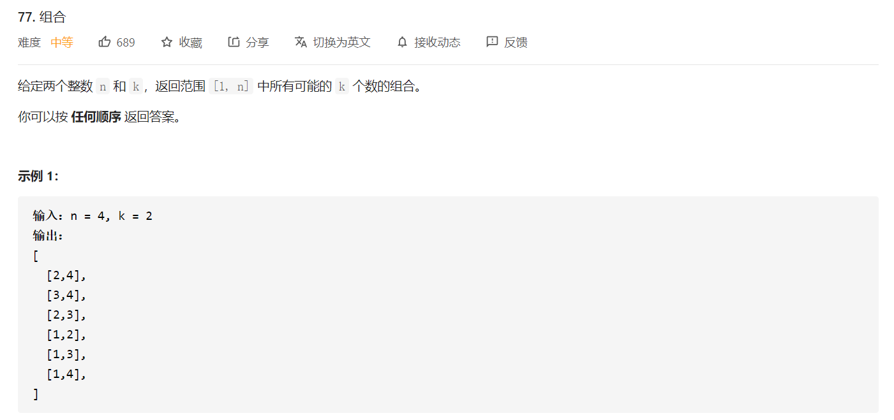
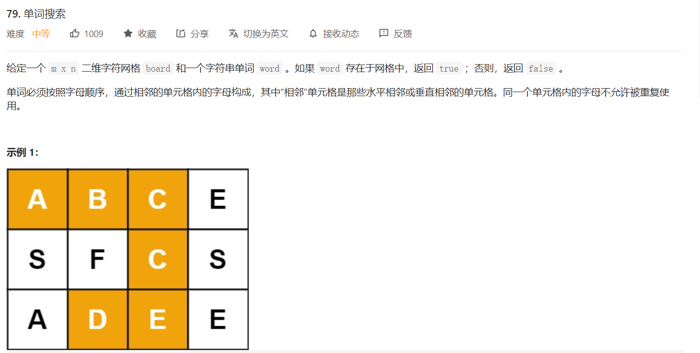
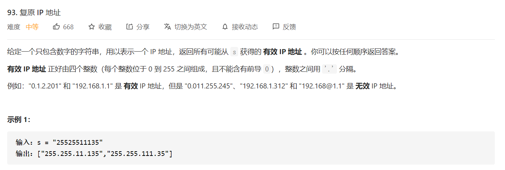
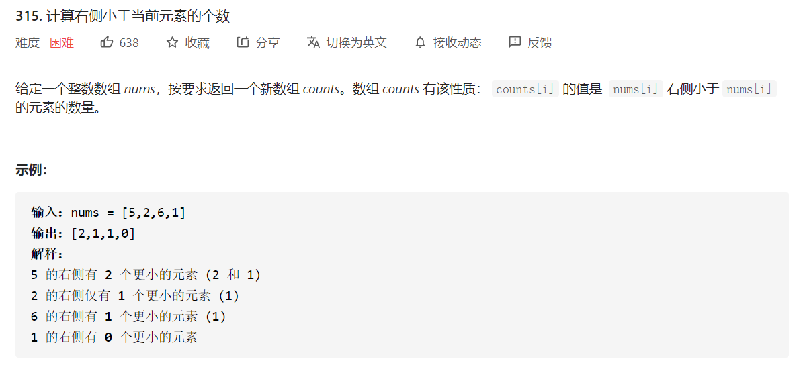
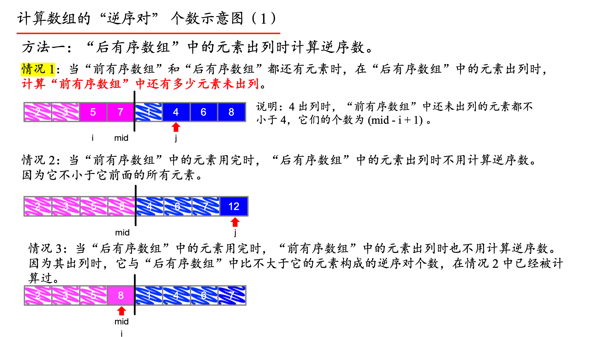
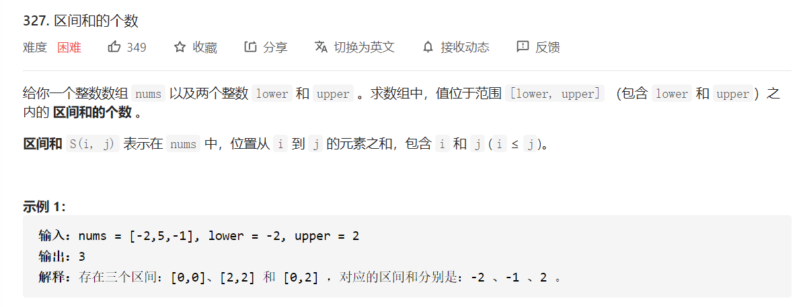

## 回溯算法


$$
回溯算法本质上是横向的搜索和纵向的搜索，横向搜索是对所有叶子节点的遍历，纵向搜索是对所有树深的递归。--- 陈明鑫
$$

#### 1.1 概述

>   常见的条件

是否有重复数字，比如`[1,1,2,2,3]`这样的数据。

数字是否可重复使用，比如`[1,2,3]`，但是`1`可以重复使用。

顺序是否重要，比如`[1,2]`是否和`[2,1]`相同。

>   常见的问题

+   **终止条件**不明确，导致递归无限延伸
+   **下标不明确**，导致数字关系错位

>   常见的类型

+   一类是单条件的回溯，比如长度组合这类问题
+   一类是多条件的回溯，比如长度和目标和，以及一些变种，多条件的回溯，一定要注意只满足单条件情况下的处理。

>   基本框架

一个回溯问题实际上就是一个决策树的遍历过程，我们需要考虑三个因素：

+ 路径
+ 选择列表 **如何控制选择列表很重要**
+ 结束条件

基本的模板如下：

```python
result = []
def backtrace(路径,选择列表):
    if 满足结束条件:
        result.add(路径)
        return
    
    for 选择 in 选择列表:
        做选择
        backtrace(路径,选择列表)
        撤销选择
```

#### 1.2 题目

##### 77 组合

>   
>
>   思路：无顺序，数字不可重复使用，无重复数字，这样解空间树可以。

```python
class Solution:
    def combine(self, n: int, k: int) -> List[List[int]]:
        self.ans = []
        def helper(start,path):
            if len(path) == k:
                self.ans.append(path[:])
                return
            
            for i in range(start,n+1):
                helper(i+1,path+[i])
        
        helper(1,[])
```

##### 39. 组合总和

>   
>
>   思路：不存在重复数字，可以重复使用，无顺序

```python
class Solution:
    def combinationSum(self, candidates: List[int], target: int) -> List[List[int]]:
        """
        无重复，数字可以重复使用，不考虑顺序
        """
        N = len(candidates)
        self.ans = []
        def helper(start,path,target):
            if target == 0:
                self.ans.append(path)
                return 

            for i in range(start,N):
                if target >= candidates[i]:
                    helper(i,path+[candidates[i]],target-candidates[i])
        
        helper(0,[],target)
        return self.ans                

```

##### 40 组合总和II

>   
>
>   思路：存在重复数字；数字不可重复使用，无顺序。

```python
def helper(start,path,target):
    if target == 0:
        ans.append(path[:])
        return 
   	for i in range(start,len(candinates)):
        if i > start and candinates[i] == candinates[i-1]: # candinates[i] == candinates[i-1]是为了剔除重复结果
            continue
        
        if target-candinates[i] >= 0:
            helper(i+1,path+[candinates[i]],target-candinates[i]) # i+1是避免对重复元素的使用
```

##### 216 组合总和III

>   
>
>   思路：需要注意，题目需要同时满足长度为k，并且和为n，关键在于同时，所以需要注意终止条件。

```python
class Solution:
    def combinationSum3(self, k: int, n: int) -> List[List[int]]:
        """
        数字不重复，数字不能重复选择，不考虑顺序
        """
        N = n
        self.ans = []

        def helper(start,path,target):
            if len(path) == k:
                if target == 0:
                    self.ans.append(path[:])
                return
            if start > 9: return

            for i in range(start,9+1):
                if target >= i:
                    helper(i+1,path+[i],target-i)
        
        helper(1,[],n)
        return self.ans
```


##### 46 全排列

>   思路：看重顺序，同一个元素不能重复使用
>
>   

```python
class Solution:
    def permute(self, nums: List[int]) -> List[List[int]]:
        """
        1. 不含重复数字
        2. 数字不能重复使用
        3. 顺序重要，不同顺序代表不同结果
        """
        self.ans = []
        def helper(path,used):
            if len(path) == len(nums):
                self.ans.append(path[:])
                return
            
            for i in range(len(nums)):
                if not used[i]:
                    used[i] = True
                    helper(path+[nums[i]],used)
                    used[i] = False
        
        path = []
        used = [False]*len(nums)
        helper(path,used)
        return self.ans
```


##### 78 子集

>   思路：数字不能重复使用，不考虑顺序
>
>   

```python
class Solution:
    def subsets(self, nums: List[int]) -> List[List[int]]:
        self.ans = []
        def helper(start,path):
            self.ans.append(path[:]) # 相当于加上空格
            for i in range(start,len(nums)):
                helper(i+1,path+[nums[i]])
        
        path = []
        helper(0,path)

        return self.ans
```


##### 79 单词搜索

>   
>
>   思路：**定义DFS传入参数的含义**，`dfs(i,j,idx)`表示的含义是访问`board[i][j]`已经与`word[idx]`匹配，如果`idx==len(word)-1`，这时候就要返回找到

```python
class Solution:
    def exist(self, board: List[List[str]], word: str) -> bool:
        """
        给定一个二维网格和一个单词，找出该单词是否存在于网格中。
        单词必须按照字母顺序，通过相邻的单元格内的字母构成，其中“相邻”单元格是那些水平相邻或垂直相邻的单元格。
        同一个单元格内的字母不允许被重复使用。
        """
        m = len(board)
        n = len(board[0])
        visited = [[0 for j in range(n)]for i in range(m)]
        directions = [[0,1],[0,-1],[1,0],[-1,0]]
        flag = [False]
        def dfs(t,x,y):
            if flag[0]:
                return
            if t == len(word)-1:
                flag[0] = True
                return
            for direction in directions:
                new_x = x + direction[0]
                new_y = y + direction[1]
                if new_x >= 0 and new_x < m and new_y >= 0 and new_y < n:
                    if not visited[new_x][new_y] and t+1 <= len(word) - 1 and board[new_x][new_y] == word[t+1]:
                        visited[new_x][new_y] = 1
                        dfs(t+1,new_x,new_y)
                        visited[new_x][new_y] = 0

        for i in range(m):
            for j in range(n):
                if board[i][j] == word[0]:
                    visited[i][j] = 1
                    dfs(0,i,j)
                    visited[i][j] = 0
        return flag[0]
```


##### 93 复原IP地址

>   
>
>   思路：主要注意和216有点相似，需要满足两个条件回溯才会终止，一个是元素的数量为4，另一个是所有的字符都被用上了。

```python
class Solution:
    def restoreIpAddresses(self, s: str) -> List[str]:
        if len(s) == 0 or len(s) > 12: return []

        ans = []
        path = []

        def helper(s,start,path):
            if len(path) == 4 and start == len(s):
                ans.append(".".join(path))
                return 
            
            if len(path) >= 4 or start >= len(s): return # 满足单条件情况下的处理

            if s[start] == "0":
                helper(s,start+1,path+[s[start:start+1]]) 
            else:
                for size in range(1,4):
                    if int(s[start:start+size]) > 255:
                        break
                    else:
                        helper(s,start+size,path+[s[start:start+size]])
        helper(s,0,path)
        return ans
```


#####  301. 删除无效的括号 🍉🍉

>   
>
>    思路：双条件回溯算法，一个是遍历玩字符串，一个是判断删除的数量是否满足需求。

```python
class Solution:
    def removeInvalidParentheses(self, s: str) -> List[str]:
        """
        抓住一个重点，如果括号有效，左括号的数量一定要大于等于右括号的数量
        """
        self.ans = set()
        def helper(index,l_cnt,r_cnt,l_rmv,r_rmv,path):
            if index == len(s):
                print(l_rmv,r_rmv)
                if l_rmv == 0 and r_rmv == 0:
                    self.ans.add(path[:])
                return
            
            # 递归内部：1. 是否删除当前符号
            if s[index] == "(" and l_rmv > 0:
                # 尝试删除左括号
                helper(index+1,l_cnt,r_cnt,l_rmv-1,r_rmv,path)
                # 回溯不删除左括号
            
            if s[index] == ")" and r_rmv > 0:
                # 尝试删除右括号
                helper(index+1,l_cnt,r_cnt,l_rmv,r_rmv-1,path)
                # 回溯不删除右括号

            # 递归内部：2. 是否添加当前符号
            if s[index] != "(" and s[index] != ")":
                helper(index+1,l_cnt,r_cnt,l_rmv,r_rmv,path+s[index])
            elif s[index] == "(":
                helper(index+1,l_cnt+1,r_cnt,l_rmv,r_rmv,path+s[index])
            elif s[index] == ")":
                if l_cnt > r_cnt:
                    helper(index+1,l_cnt,r_cnt+1,l_rmv,r_rmv,path+s[index])

        """第一步：计算需要删除括号的数量"""
        left_remove,right_remove = 0,0
        for i in range(len(s)):
            if s[i] == "(":
                left_remove += 1
            elif s[i] == ")":
                if left_remove == 0:
                    right_remove += 1
                else:
                    left_remove -= 1
        
        """第二步：回溯求解"""
        helper(0,0,0,left_remove,right_remove,"")
        return list(self.ans)
```


##### 37 解数独 🍉🍉

>   
>
>   这里在进行遍历的时候，首先按列扫描，扫描完一列之后；列下标置为0，j加一，直到扫描完所有的行。
>
>   下标一定要小心！！！

```python
class Solution:
    def solveSudoku(self, board: List[List[str]]) -> None:
        """
        Do not return anything, modify board in-place instead.
        """
        n = 9
        row_dict = {j:{i:False for i in range(1,n+1)} for j in range(1,n+1)}
        col_dict = {j:{i:False for i in range(1,n+1)} for j in range(1,n+1)}
        cell_dict = {j:{i:False for i in range(1,n+1)} for j in range(1,n+1)}
        
        for i in range(n):
            for j in range(n):
                if board[i][j] != ".":
                    val = int(board[i][j])
                    row_dict[i+1][val] = True
                    col_dict[j+1][val] = True
                    cell_i = i // 3
                    cell_j = j // 3
                    cell_idx = cell_i*3 + cell_j
                    cell_dict[cell_idx+1][val] = True

        self.flag = False
        def helper(board,i,j):
            if self.flag: return
            if j == n:
                i += 1
                j = 0
                if i == n:
                    self.flag = True
                    return
            
            if board[i][j] == ".":
                cell_i = i // 3
                cell_j = j // 3
                cell_idx = cell_i*3 + cell_j
                for val in range(1,n+1):
                    if not row_dict[i+1][val] and not col_dict[j+1][val] \
                            and not cell_dict[cell_idx+1][val]:
                        board[i][j] = str(val)
                        row_dict[i+1][val] = True
                        col_dict[j+1][val] = True
                        cell_dict[cell_idx+1][val] = True

                        helper(board,i,j+1)
                        if self.flag: return

                        board[i][j] = "."
                        row_dict[i+1][val] = False
                        col_dict[j+1][val] = False
                        cell_dict[cell_idx+1][val] = False
            else:
                helper(board,i,j+1)
            if self.flag: return
        helper(board,0,0)
```


## 分治算法

#### 2.1 概述

分治法一定是将问题逐步分解，直到一个可以直接求解的范围；然后将分解后的结果进行组合，比如归并排序和快速排序。

+   划分标准 Divide
+   终止条件 Conquer
+   结合 Combine


#### [273. 整数转换英文表示](https://leetcode-cn.com/problems/integer-to-english-words/) 🍉

>   
>
>   

```python
class Solution:
    def numberToWords(self, num: int) -> str:
        digits_20 = "One Two Three Four Five Six Seven Eight Nine Ten Eleven Twelve Thirteen Fourteen Fifteen Sixteen Seventeen Eighteen Nineteen".split(" ")
        digits_100 = "Twenty Thirty Forty Fifty Sixty Seventy Eighty Ninety".split(" ")
        digits_up = "Thousand Million Billion".split(" ")

        def helper(num,index):
            if num == 0: return []
            if num < 20:
                return [digits_20[num-1]]
            elif num < 100:
                return [digits_100[num//10-2]] +  helper(num%10,index)
            elif num < 1000:
                return [digits_20[num//100-1]] + ["Hundred"] + helper(num%100,index)
            else:
                if (num // 1000 < 1000)  or (num // 1000 % 1000 != 0):
                    # 处理两类数据
                    # 1. 小于一百万的数据，这些数据都表示位 `xxx Thousand`，Thousand节权必然保留
                    #    比如：45,400 --> Forty Five Thousand Four Hundred
                    # 2. 大于一百万的数据，但是在百万位权到千位节权中，存在非零数字，这类数据表示为：`xxx Million xxx Thousand`
                    #    比如：1,001,400
                    return helper(num//1000,index+1) + [digits_up[index]] + helper(num % 1000,index)
                else:
                    # 处理一类数据
                    # 1. 大于一百万的数据，并且在百万位权到千位节权中，全部为零
                    #     比如1,000,400 --> One Millon Four Hundred
                    return helper(num//1000,index+1) + helper(num % 1000,index)
        if num == 0: return "Zero"
        data = helper(num,0)
        return " ".join(data)
```

#### 315. 计算右侧小于当前元素的个数

>   
>
>   这一题类似于求解所有逆序对的个数，对数组进行归并排序，在某一次分割中，归并排序左边是有序的，右边也是有序的，如果在合并的时候，左边小于右边的某一个元素，那么左边小于右边的所有元素。
>
>   

```python
class Solution:
    def countSmaller(self, nums: List[int]) -> List[int]:
        dp = []
        n = len(nums)
        left,right = 0,n-1
        while left <= right:
            nums[left],nums[right] = nums[right],nums[left]
            left += 1
            right -= 1
        
        ans = collections.deque()
        for i in range(n):
            if not dp or dp[-1] < nums[i]:
                ans.appendleft(len(dp))
                dp.append(nums[i])
            else:
                idx = bisect.bisect_left(dp,nums[i])
                dp[idx:idx] = [nums[i]]
                ans.appendleft(idx)
        return list(ans)
```

#### [327. 区间和的个数](https://leetcode-cn.com/problems/count-of-range-sum/) 🍉

>
>
>前缀和 + 二分法 + 归并排序

```python
class Solution:
    def countRangeSum(self, nums: List[int], lower: int, upper: int) -> int:
        n = len(nums)
        self.ans = 0
        prefix = [0]
        for i in range(n):
            prefix.append(nums[i] + prefix[-1])
        
        def merge_sort(nums):
            if len(nums) == 1: return nums
            k = len(nums) // 2
            nums1 = nums[:k]
            nums2 = nums[k:]
            
            merge_sort(nums1)
            merge_sort(nums2)
            
            for i in range(k):
                left = nums1[i] + lower
                right = nums1[i] + upper
                idx_l = bisect.bisect_left(nums2,left)
                idx_r = bisect.bisect_right(nums2,right)
                self.ans += (idx_r - idx_l)
            
            i = j = 0
            m = 0
            while i < len(nums1) and j < len(nums2):
                if nums1[i] <= nums2[j]:
                    nums[m] = nums1[i]
                    i += 1
                    m += 1
                elif nums1[i] > nums2[j]:
                    nums[m] = nums2[j]
                    j += 1
                    m += 1
            while i < len(nums1):
                nums[m] = nums1[i]
                m,i = m+1,i+1
            while j < len(nums2):
                nums[m] = nums2[j]
                m,j = m+1,j+1
        merge_sort(prefix)
        return self.ans
```


#### [剑指 Offer 51. 数组中的逆序对](https://leetcode-cn.com/problems/shu-zu-zhong-de-ni-xu-dui-lcof/)

>   

```python
class Solution:
    def reversePairs(self, nums: List[int]) -> int:
        self.ans = 0
        def merger_sort(nums):
            n = len(nums)
            if n <= 1: return
            mid = n // 2
            nums1 = nums[:mid]
            nums2 = nums[mid:]
            merger_sort(nums1)
            merger_sort(nums2)
            i = j = 0
            k = 0
            while i < len(nums1) and j < len(nums2):
                if nums1[i] <= nums2[j]:
                    nums[k] = nums1[i]
                    i += 1
                else:
                    self.ans += (len(nums1)-i)
                    nums[k] = nums2[j]
                    j += 1
                k += 1
            
            while i < len(nums1):
                nums[k] = nums1[i]
                k += 1
                i += 1
            
            while j < len(nums2):
                nums[k] = nums2[j]
                k += 1
                j += 1
        merger_sort(nums)
        return self.ans
```


#### 大数乘法 （Karatsuba算法）

对于两个数：$x=5678,y=1234$；可以将 $x$ 划分成两部分，使得 $a=56,b=78$；将 $y$ 划分成两部分，使得 $c=12,d=34$。可以得到，此时 $n=4$，$x=10^{n/2}a+b,y=10^{n/2}c+d$，可以得到：
$$
x\times y = 10^{n}ac + 10^{n/2}(ad+bc) + bd
$$
对于当前例子：

+   $a\times c=672$
+   $b\times d=2652$
+   $(a+b)\times (c+d)=6164$
+   $ad+bc=6164-672-2652 = 2840$
+   $x\times y = 10^4*(a\times c) + 10^2*(a\times d+b\times c) + b\times d$


#### 染色问题 - TODO

如果是基于图数据的染色问题，并且图数据不一定是强联通的，比如`leetcode-785`；需要两重循环，一重循环是死循环，需要一个`find`函数，每次都要去寻找有效的未填色的图开始节点，直到找不到填充的结点为截止；一重循环是队列循环，在一个联通图内部进行染色。


