#### 分类

+   拓扑排序

    +   拓扑排序，207 课程表

    


+   连通图
    +   如何建图并求连通图的数量，765 情侣牵手 
    +   求连通图的数量，547. 省份数量


+   并查集
    +   NC159 最小生成树
    +   654 冗余连接


## 最短路径问题


#### Floyd 多源最短路径 [🏰](https://www.youtube.com/watch?v=4NQ3HnhyNfQ)

$$
f[k][i][j] = \min\{f[k-1][i][j],f[k-1][i][k]+f[k-1][k][j]\}
$$

>   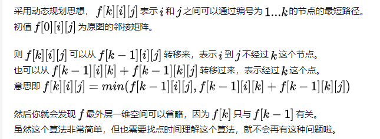
>
>   $k$ 每增加一个，就代表引入了新的节点：
>
>   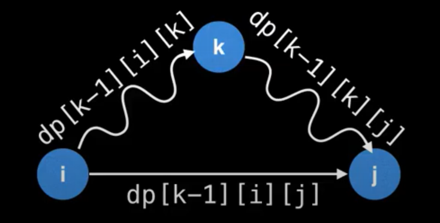

```python
INF = float("inf")
graph = [
    [0  ,   2,  6,  4],
    [INF,   0,  3,INF],
    [  7, INF,  0,  1],
    [  5, INF, 12,  0]
]
def floyd(graph,start,target):
    n = len(graph)
    dp = [[graph[i][j] for j in range(n)] for i in range(n)]
    path = [[j for j in range(n)] for i in range(n)] 
    for k in range(n):
        for i in range(n):
            for j in range(n):
                if dp[i][j] > dp[i][k] + dp[k][j]:
                    dp[i][j] = dp[i][k] + dp[k][j]
                    path[i][j] = path[i][k]
    
    cur = start
    ans = [str(cur+1)]
    while cur != target:
        cur = path[cur][target]
        ans.append(str(cur+1))
    print("short path from {} to {} : {}".format(start+1,target+1,"->".join(ans)))
    print("value: {}".format(dp[start][target]))
floyd(graph,start=1,target=3)
```

#### Dijistra单源最短路径 [🏰](https://www.youtube.com/watch?v=pSqmAO-m7Lk)

```python
INF = float("inf")
graph = [
    [0,    1, 12,INF,INF,INF],
    [INF,  0,  9,  3,INF,INF],
    [INF,INF,  0,INF,  5,INF],
    [INF,INF,  4,  0, 13, 15],
    [INF,INF,INF,INF,  0,  4],
    [INF,INF,INF,INF,INF,  0]
]

def djikstra(graph,start):
    n = len(graph)
    dist = graph[start][:]
    visited = [False]*n
    visited[start] = True
    
    neighbor = collections.defaultdict(list)
    for i in range(n):
        for j in range(n): 
            if graph[i][j] != INF and graph[i][j] != 0:
                neighbor[i].append(j)
    
    size = 1
    while size <= n:
        # 根据visited集合，更新dist数组
        for v in range(n):
            if visited[v]:
                for nxt in neighbor[v]:
                    dist[nxt] = min(dist[nxt],dist[v]+graph[v][nxt])

        # 找到距离visited集合最近的节点
        idx = -1
        min_dist = float("inf")
        for v in range(n):
            if not visited[v] and min_dist > dist[v]:
                idx = v
                min_dist = dist[v]
        
        if idx == -1: break
        # 将最近节点加入visited集合
        visited[idx] = True
        size += 1
    
    return dist

djikstra(graph,0)
```


#### NC159 最小生成树 🍉

>   

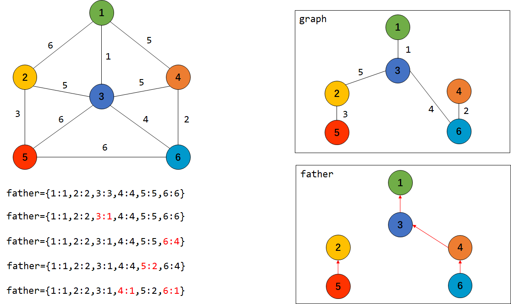

```python
#
# 代码中的类名、方法名、参数名已经指定，请勿修改，直接返回方法规定的值即可
#
# 返回最小的花费代价使得这n户人家连接起来
# @param n int n户人家的村庄
# @param m int m条路
# @param cost int二维数组 一维3个参数，表示连接1个村庄到另外1个村庄的花费的代价
# @return int


# 对于遍历过程的每条边，其都有两个顶点，判断这两个顶点的标记是否一致，如果一致，说明它们本身就处在一棵树

class Solution:
    def miniSpanningTree(self , n , m , cost ):
        # 首先对所有节点进行排序，按照边的权重从低到高
        cost = sorted(cost, key=lambda x:x[2])
        # 定义所有节点的父节点（顶级源节点）
        father = {point:point for point in range(1, n+1)}
        res, sums = [], 0
        
        # 两个节点，以及对应的花费
        for u, v, w in cost:
            print(father,"\n")
            # 两个节点的顶级源节点不相同，说明没有连接在一起
            if father[u] != father[v]:
                # 现在将他们连接在一起，father[v]的父亲
                res.append([u, v, w])
                end = father[v] # 当前v节点的父亲节点
                for point in range(1, n+1):
                    if father[point] == end: 
                        # 如果某一个节点的父亲节点等于v节点的父亲节点
                        # 比如当前节点以及和他拥有相同父亲节点的节点都会被连接起来
                        father[point] = father[u]
                sums += w
                if len(res) == n-1:
                    print(res)
                    return sums
        return sums
```


#### 943 最短超级串 🍉

>   
>
>   **旅行商问题**，数位DP，进行`状态压缩`

```python
class Solution {
    /**
     * 类似的思想就是TSP问题。
     * dp[s][i] 表示状态为s，并以i状态为结尾的最短长度。
     * 状态转移方程：
     */
    public String shortestSuperstring(String[] words) {
        int n = words.length;
        int [][] graph = new int[n][n];
        build_graph(graph,words);

        int [][] dp = new int[1<<n][n]; // 第一个维度表示状态，第二个维度表示元素下标
        int [][] path = new int[1<<n][n]; // 表示当前的父节点
        for (int i = 0; i < path.length; i++) Arrays.fill(path[i],-1);
        int min = Integer.MAX_VALUE;
        int last = -1;

        for (int curState = 1; curState < (1<<n); curState++) {
            Arrays.fill(dp[curState],Integer.MAX_VALUE / 2);

            for (int curNode = 0; curNode < n; curNode++) {
                if ((curState&(1 << curNode)) == 0) continue; // 是否访问过
                int prevState = curState ^ (1 << curNode);
                if (prevState == 0) {
                    dp[curState][curNode] = words[curNode].length();
                } else {
                    for (int prevNode = 0; prevNode < n; prevNode++) {
                        if(dp[prevState][prevNode] + graph[prevNode][curNode] < 
                                dp[curState][curNode]) {
                            dp[curState][curNode] = dp[prevState][prevNode] + graph[prevNode][curNode];
                            path[curState][curNode] = prevNode;
                        }
                    }
                }

                if ((curState == (1<<n)-1) && dp[curState][curNode] < min) {
                    min = dp[curState][curNode];
                    last = curNode;
                }
            }
        }

        StringBuilder sb = new StringBuilder();
        int s = (1 << n) - 1;

        while (s > 0) {
            int prevNode = path[s][last];
            if (prevNode == -1) {
                sb.insert(0,words[last]);
            } else {
                sb.insert(0,words[last].substring(words[last].length()-graph[prevNode][last]));
            }

            s = s ^ (1 << last);
            last = prevNode;
        } 
        return sb.toString();
    }

    public void build_graph(int [][] graph, String [] words) {
        for (int i = 0; i < words.length; i++) {
            for (int j = 0; j < words.length; j++) {
                boolean find = false;
                for (int index = 0; index < words[i].length(); index++) {
                    if((words[j]).startsWith(words[i].substring(index))) {
                        graph[i][j] = words[j].length() - (words[i].length() - index);
                        find = true;
                        break;
                    }
                }
                if (!find) {
                    graph[i][j] = words[j].length();
                }
            }
        }
    }
}
```


#### 847. 访问所有节点的最短路径 🍉

>   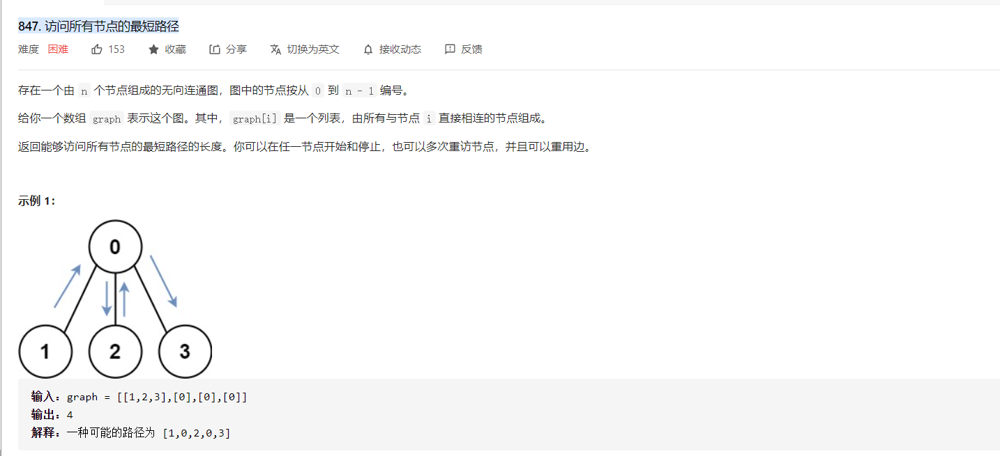
>
>   BFS + 状态压缩

```python
class Solution:
    def shortestPathLength(self, graph: List[List[int]]) -> int:
        n = len(graph)
        explored = set()
        # 初始所有状态
        frontier = collections.deque([(i, 1 << i) for i in range(n)])
        # 目标状态
        goal = (1 << n) - 1
        step = 0

        while frontier:
            size = len(frontier)
            for idx in range(size):
                cur,state = frontier.popleft()
                if state == goal:
                    return step
                
                explored.add((cur,state))
                for other in graph[cur]:
                    successor = (other, 1 << other | state)
                    if successor not in explored:
                        explored.add(successor)
                        frontier.append(successor)
            step += 1    

        return -1
```


#### 765 情侣牵手 🍉

>   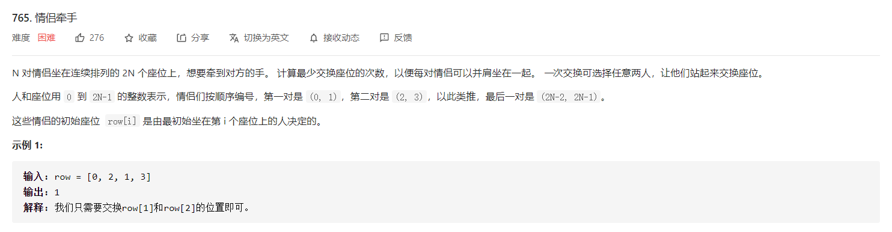

```python
class Solution:
    def minSwapsCouples(self,row):
        # 1. 构建图
        N=len(row)//2
        graph=collections.defaultdict(list) #邻接矩阵
        for i in range(0, len(row), 2):
            # 相邻的两个人各自所属的cp组
            cp_l, cp_r=row[i]//2, row[i+1]//2
            # 将cp组号作为图中的点 每相邻的两个都建立边 (无需讨论是否为cp 因为如果为cp则是同一个点)
            graph[cp_l].append(cp_r)
            graph[cp_r].append(cp_l)
            
        # 2. 下面用广度优先遍历来数联通分量的数目
        visited=[False for _ in range(N)]
        num_group=0
        for i in range(N):
            if not visited[i]:
                visited[i]=True
                queue=collections.deque([i])
                while queue:
                    cur = queue.popleft()
                    for successor in graph[cur]:
                        if not visited[successor]: 
                            # 如果属于同一联通分量 则加入当前联通分量的队列
                            queue.append(successor)                     
                            visited[successor]=True # 且标记遍历过
                num_group += 1 #联通分量数目+1
	    
        # 3. N个情侣，有k个连通分量，则需要交换N-k次
        return N-num_group
```

#### 547. 省份数量

>   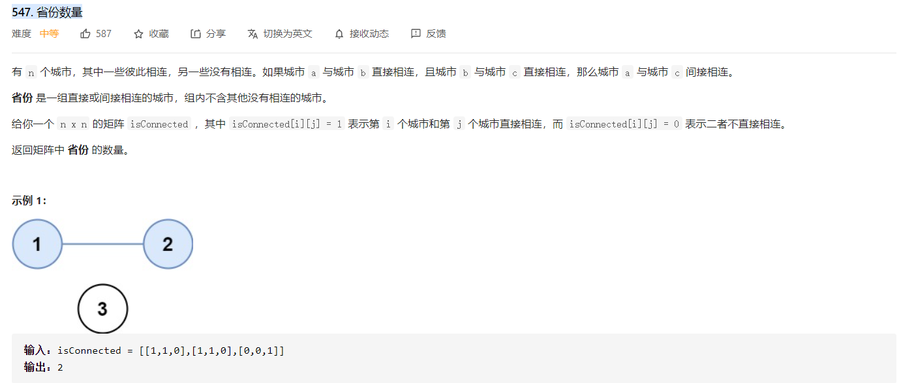
>
>   **求连通图的数量**

```python
class Solution:
    def findCircleNum(self, isConnected: List[List[int]]) -> int:
        n = len(isConnected)
        ans = 0
        visited = [False]*n

        for i in range(n):
            if not visited[i]:
                visited[i] = True
                queue = collections.deque([i])

                while queue:
                    size = len(queue)
                    for i in range(size):
                        cur = queue.popleft()
                        for i in range(n):
                            if isConnected[cur][i] == 1 and not visited[i]:
                                visited[i] = True
                                queue.append(i)
                ans += 1
        return ans

```


#### 329. 矩阵中的最长递增路径 🍉

>   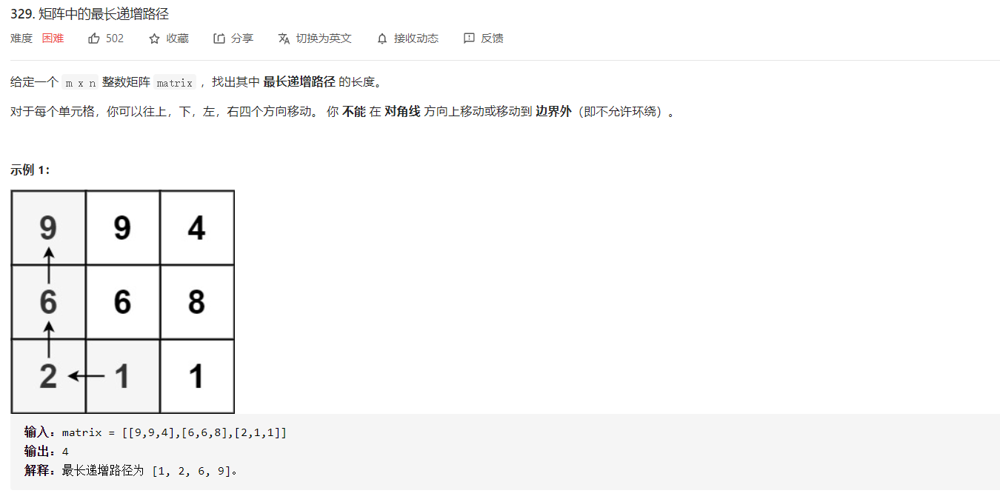
>
>   思路：图搜索问题。
>
>   这一题十分容易弄错，关键在于没有厘清递归函数的作用，递归函数的作用在于找到以`(i,j)`为开始的最长递增序列的长度，所以它应该返回对应的长度，而不应该只是递归。其次，visisted数组有没有必要存在，没有必要，因为能够递归下去一定表示下一个元素大于当前元素，那就不会出现重复访问的问题，当让用visited数组也可以，但是需要利用回溯的规则，进行回溯操作。

```python
class Solution:
    def longestIncreasingPath(self, matrix: List[List[int]]) -> int:
        directions = [[0,1],[0,-1],[1,0],[-1,0]]
        m = len(matrix)
        n = len(matrix[0])

        def helper(i,j):
            if dp[i][j] > 0: return dp[i][j]

            for dirs in directions:
                x = i + dirs[0]
                y = j + dirs[1]
                if x >= 0 and x < m and y >= 0 and y < n:
                    if matrix[i][j] < matrix[x][y]:
                        if dp[x][y] > 0:
                            dp[i][j] = max(dp[i][j],dp[x][y])
                        else:
                            dp[i][j] = max(dp[i][j],helper(x,y))
            dp[i][j] += 1
            return dp[i][j]

        dp = [[0]*n for i in range(m)] # 全局的
        ans = 0
        for i in range(m):
            for j in range(n):
                if dp[i][j] > 0: continue
                ans = max(ans,helper(i,j))
        return ans
```

## 环相关

#### 685. 冗余连接 II 🍉

[【细致解读】一文让你真正读懂本题的思路](https://leetcode-cn.com/problems/redundant-connection-ii/solution/xi-zhi-jie-du-yi-wen-rang-ni-zhen-zheng-du-dong-be/)

如果将树看成图，那么只有根节点 `入度为0，出度为2`，而其余节点`入度为1，出度为1`；当向一棵有向树插入一条额外的边 $u \rightarrow v$ 时，有两种可能：

+   所有节点入度和出度都为1。（利用并查集解决）
+   有一个节点入度为2。

而`入度为2的节点`的两条边中的一条边就是我们要删除的，而两条边的情况如下：

+   一条边在环外，一条边在环内：需要去掉在环内的那条边。
+   两条边都在环内：去除其中一条即可。根据题意，我们要去除后出现的那条。

```python
class UF:
    def __init__(self,nums):
        self.parent = {num:num for num in nums}
    
    def find(self,x):
        while self.parent[x] != x:
            x = self.parent[x]
        return x
    
    def union(self,x,y):
        x_root = self.find(x)
        y_root = self.find(y)
        if x_root != y_root:
            if x_root > y_root:
                self.parent[y_root] = x_root
            else:
                self.parent[x_root] = y_root
        else:
            return [x,y]

class Solution:
    def findRedundantDirectedConnection(self, edges: List[List[int]]) -> List[int]:
        # 除了根节点之外，每一个节点有且只有一个父节点
        n = len(edges)
        indegree = [0]*(n+1)
        outdegree = [0]*(n+1)
        graph = collections.defaultdict(list)
        for edge in edges:
            indegree[edge[1]] += 1
            outdegree[edge[0]] += 1
            graph[edge[1]].append(edge[0])
        
        flag2degree = False
        v = -1
        for i in range(1,n+1):
            if indegree[i] == 2: 
                flag2degree = True
                v = i # 入度为 2 的节点
                break
        
        """ 不存在入度为2的节点 """
        if not flag2degree:
            uf = UF([i+1 for i in range(n)])
            for edge in edges:
                res = uf.union(edge[0], edge[1])
                if res is not None:
                    return edge
        else:
            """ 存在入度为2的节点 """
            points2v = graph[v][::-1]
            for p in points2v:
                if indegree[p] != 0 or outdegree[p] != 0:
                    cur = p
                    while cur in graph:
                        if cur == v:
                            """ 存在环，返回环内的边 """
                            return [p,v]
                        else:
                            cur = graph[cur][0]
            """ 不存在环，任意拆除一条边即可 """
            for p in points2v:
                if indegree[p] != 0 or outdegree[p] != 0:
                    return [p,v]
```


​    


## 并查集

#### 基本框架

```python
import collections
from typing import *

class UnionFind:
    def __init__(self,nums):
        self.parent = {num:num for num in nums}
        self.count = collections.defaultdict(lambda: 1)
    
    def find(self,x):
        while x != self.parent[x]:
            x = self.parent[x]
        return x
    
    def union(self,x,y):
        x_root = self.find(x)
        y_root = self.find(y)

        if x_root == y_root: return
        self.parent[y_root] = x_root
```


#### 684. 冗余连接

>   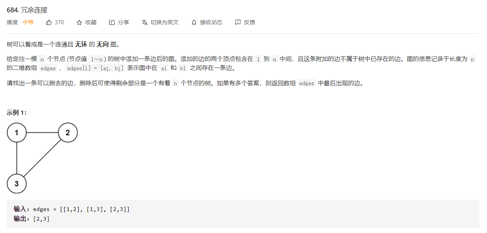
>
>   这一题实际上和最小生成树思路很类似，都是利用**并查集**的思想对图中的元素一一合并

```python
class Solution:
    def findRedundantConnection(self, edges: List[List[int]]) -> List[int]:
        n = len(edges)
        father = {i+1:i+1 for i in range(n)}


        for edge in edges:
            u,v = edge
            if father[u] != father[v]:
                tmp = father[v]
                for i in range(n):
                    if father[i+1] == tmp:
                        father[i+1] = father[u]
            else:
                return edge
            
            
# 并查集
class UnionFind:
    def __init__(self,n):
        self.parent = {i+1:-1 for i in range(n)}
        self.rank = {i+1:1 for i in range(n)}

    def find_parent(self,index):
        while self.parent[index] != -1:
            index = self.parent[index]
        return index
    
    def union(self,x,y):
        x_parent = self.find_parent(x)
        y_parent = self.find_parent(y)

        if x_parent != y_parent:
            # 进行合并
            if self.rank[x_parent] >= self.rank[y_parent]:
                self.rank[y_parent] += 1
                self.parent[x_parent] = y_parent
            else:
                self.rank[x_parent] += 1
                self.parent[y_parent] = x_parent
            return True
        else:
            # 拒绝合并
            return [x,y]


class Solution:
    def findRedundantConnection(self, edges: List[List[int]]) -> List[int]:
        n = len(edges)
        uf = UnionFind(n)

        for edge in edges:
            res = uf.union(edge[0],edge[1])
            if res != True:
                return res
```


#### meituan-002. 小美的仓库整理 🍉

>   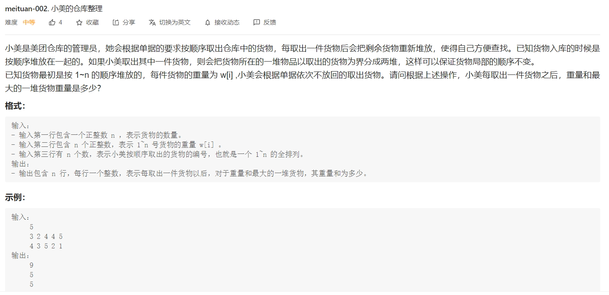

```python
import sys

def solution(n,weight,query):
    # 维护区间和
    s = [0 for i in range(n)]
    # 分别表示当前点的`左边界`和`右边界`
    right_bound = [i for i in range(n)]
    left_bound = [i for i in range(n)]

    ans = []
    cur = 0
    for i in query[::-1]:
        i = i - 1
        ans.append(cur)
        
        """ 第一步，计算得到区间和 """
        s[i] = weight[i] + (s[i-1] if i > 0 else 0) + (s[i+1] if i < n-1 else 0)

        """ 第二步，维护区间左右边界 """
        # 维护当前区间左边界和右边界
        l, r = i, i
        # 右边大于0，说明右边可以联合在一起
        if i < n-1 and s[i + 1] > 0: r = right_bound[i + 1]
        # 左边大于0，说明左边可以联合在一起
        if i > 0 and s[i - 1] > 0: l = left_bound[i - 1]
        right_bound[l] = r # 维护最左边的最右边边界
        left_bound[r] = l # 维护最右边的最左边边界
        s[r] = s[l] = s[i]

        """ 第三步，维护最大区间累加和"""
        cur = max(cur, s[i])
    return ans[::-1]

if __name__ == "__main__":
    try:
        n = int(sys.stdin.readline().strip())
        weight = [int(word) for word in sys.stdin.readline().strip().split()]
        query = [int(word) for word in sys.stdin.readline().strip().split()]
        ans = solution(n,weight,query)
        for val in ans:
            print(val)
    except:
        pass
```


#### [128 最长连续序列 ](https://leetcode-cn.com/problems/longest-consecutive-sequence/solution/tu-jie-yu-dao-jiu-shen-jiu-bing-cha-ji-by-chun-men/)

>   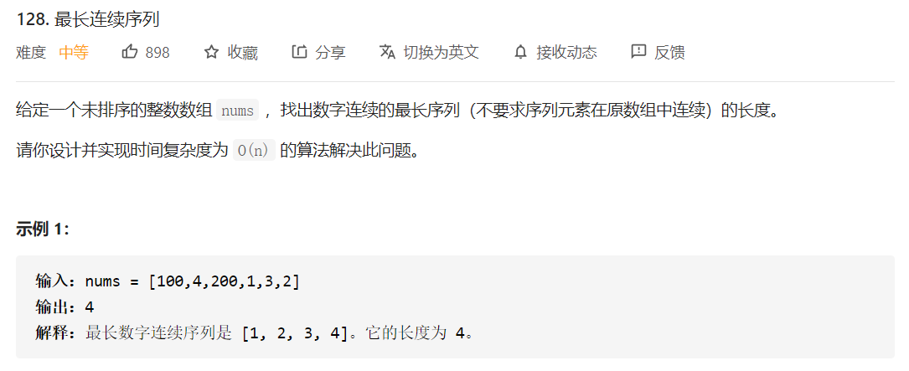

```python
class UF:
    def __init__(self,nums):
        self.parent = {num:num for num in nums}
    
    def find(self,x):
        while self.parent[x] != x:
            x = self.parent[x]
        return x
    
    def union(self,x,y):
        x_root = self.find(x)
        y_root = self.find(y)
        if x_root != y_root:
            if x_root < y_root:
                self.parent[y_root] = x_root
            else:
                self.parent[x_root] = y_root
        
class Solution:
    def longestConsecutive(self, nums: List[int]) -> int:
        uf = UF(nums)
        for num in nums:
            if num+1 in uf.parent:
                uf.union(num,num+1)
        counter = collections.defaultdict(int)
        for k,v in uf.parent.items():
            counter[uf.find(v)] += 1
        
        ans = 0
        for k,v in counter.items():
            ans = max(ans,v)
        return ans
```


## 图搜索问题


#### 785. 判断二分图 🍉🍉🍉

>   两种思路：
>
>   +   第一种，假设只有两种颜料，1和2，先涂颜料1，然后涂颜料2，如果在涂的过程中出现冲突，则不可能二分。
>   +   第二种，有很多种颜料，相邻节点不可涂同样的颜料，全部涂完之后，检查颜料种类的数量。

+   第一种

    ```python
    class Solution:
        def isBipartite(self, graph: List[List[int]]) -> bool:
            n = len(graph)
            if n <= 1: return True
    
            paint = [0]*n
            queue = collections.deque()
    
            for i in range(n):
                if paint[i] == 0:
                    paint[i] = 1
                    queue.append(i)
    
                while queue:
                    cur = queue.popleft()
                    for v in graph[cur]:
                        if paint[v] == 0:
                            paint[v] = 1 if paint[cur] == 2 else 2
                            queue.append(v)
                        else:
                            if paint[cur] == paint[v]: return False
            return True
    ```

+   第二种

```python
class Solution:
    def isBipartite(self, graph: List[List[int]]) -> bool:
        n = len(graph)
        if n <= 1: return True

        paint = [0]*n
        queue = collections.deque()

        for i in range(n):

            if paint[i] == 0:
                queue.append(i)
                while queue:
                    cur = queue.popleft()

                    # 找到可以染色的颜色
                    color_set = set()
                    for v in graph[cur]:
                        if paint[v] != 0:
                            color_set.add(paint[v])
                    color_list = list(color_set)
                    color_list.sort()
                    color = 1
                    for c in color_list:
                        if color == c:
                            color += 1
                        else: break
                    paint[cur] = color

                    # 讲未染色的节点加入
                    for v in graph[cur]:
                        if paint[v] == 0:
                            queue.append(v)
        
        return len(set(paint)) == 2
```


#### 133. 克隆图 🍉

>   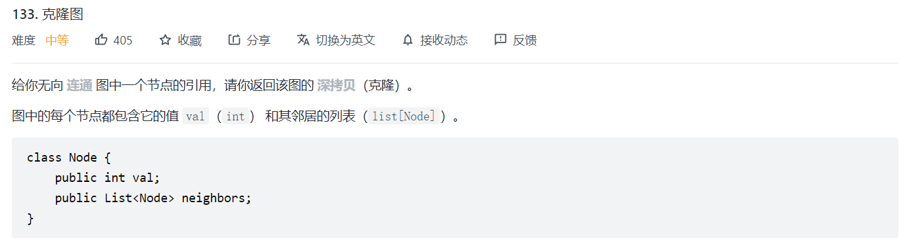
>
>   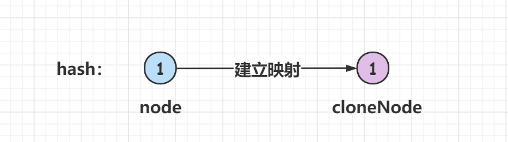

````python
class Solution:
    def cloneGraph(self, node: 'Node') -> 'Node':
        if not node: return node
        queue = collections.deque()
        node_dict = {node.val:Node(node.val)}
        queue.append(node)

        while queue:
            size = len(queue)
            for i in range(size):
                cur = queue.popleft()
                # copy nodes
                for neighbor in cur.neighbors:
                    if neighbor.val not in node_dict:
                        node_dict[neighbor.val] = Node(neighbor.val)
                        queue.append(neighbor)
                    node_dict[cur.val].neighbors.append(node_dict[neighbor.val])
        return node_dict[node.val]
````


#### 332. 重新安排行程


#### 399. 除法求值


#### 947. 移除最多的同行或同列石头


## 拓扑排序

#### 207 课程表

>   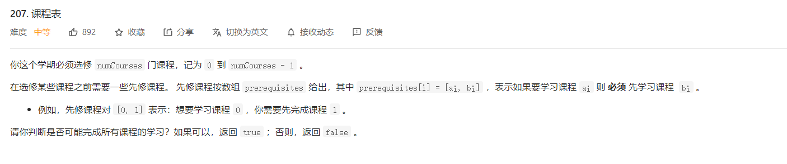
>
>   拓扑排序

```python
class Solution:
    def canFinish(self, numCourses: int, prerequisites: List[List[int]]) -> bool:
        # 构建图和入度表
        graph = [[] for i in range(numCourses)]
        in_degree = [0]*numCourses
        for prerequisite in prerequisites:
            graph[prerequisite[1]].append(prerequisite[0])
            in_degree[prerequisite[0]] += 1
        
        queue = collections.deque()
        visited = [False]*numCourses
        for i in range(numCourses):
            if in_degree[i] == 0:
                queue.append(i)
                visited[i] = True
        
        while queue:
            size = len(queue)
            for i in range(size):
                cur = queue.popleft()
                for next_p in graph[cur]:
                    in_degree[next_p] -= 1

            for i in range(numCourses):
                if not visited[i] and in_degree[i] == 0:
                    visited[i] = True
                    queue.append(i)
        for i in range(numCourses):
            if not visited[i]: return False
        return True
```


#### [210. 课程表 II](https://leetcode-cn.com/problems/course-schedule-ii/)

>   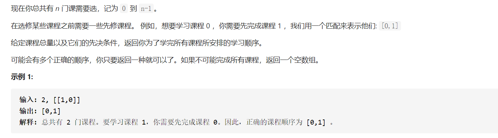

```python
class Solution:
    def findOrder(self, numCourses: int, prerequisites: List[List[int]]) -> List[int]:
        inorder = [0 for i in range(numCourses)]
        graph = {i:[] for i in range(numCourses)}
        ans = []

        for edge in prerequisites:
            inorder[edge[0]] += 1
            graph[edge[1]].append(edge[0])
	    
        # 首先将所有入度为0的节点加入队列
        queue = []
        for i in range(numCourses):
            if inorder[i] == 0:
                queue.append(i)
	    
        # 遍历队列，同时更新入度列表
        while queue:
            top = queue.pop(0)
            ans.append(top)
            for next_ in graph[top]:
                inorder[next_] -= 1
                # 更新的过程中出现入度为0的节点，入队
                if inorder[next_] == 0:
                    queue.append(next_)
                    
        # 所有节点入度都不为0
        for i in range(numCourses):
            if inorder[i] != 0:
                return []

        return ans
```

## 单&双向BFS

#### 815. 公交路线 🍉🍉

>   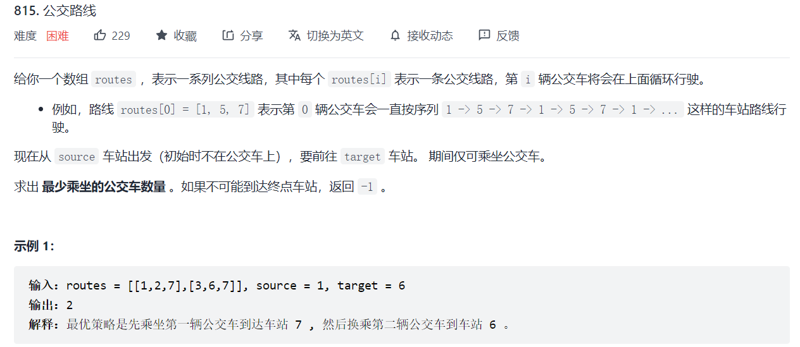

```python
class Solution:
    def numBusesToDestination(self, routes: List[List[int]], source: int, target: int) -> int:
        if source == 0 and target == 100000:
            return -1
        # 构建图 {点：路线，点：路线}
        graph = collections.defaultdict(list)
        for route in routes:
            for v in route:
                graph[v].extend(route)
        if source not in graph or target not in graph:
            return -1
        queue = collections.deque([source])
        visited = {source}
        step = 0
        while queue:
            size = len(queue)
            step += 1
            for i in range(size):
                cur = queue.popleft()
                if cur == target:
                    return step-1
                for v in graph[cur]:
                    if v not in visited:
                        visited.add(v)
                        queue.append(v)
        return -1
```


#### 126. 单词接龙 II 🍉🍉

>   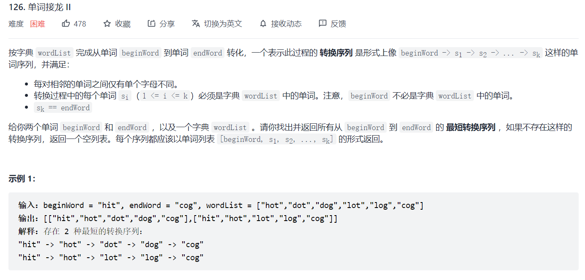
