#### LCP 03. 机器人大冒险 🍉

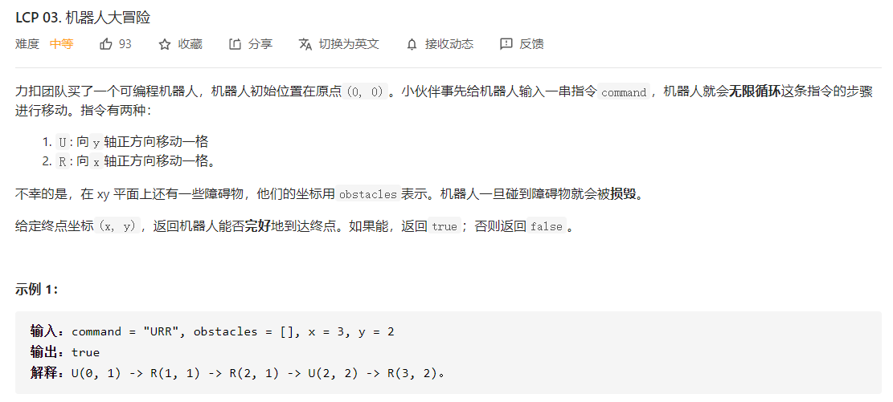

```python
class Solution:
    def robot(self, command: str, obstacles: List[List[int]], x: int, y: int) -> bool:
        directions = {"R":[1,0],"U":[0,1]}
        counter = collections.Counter(command)
        size = len(command)
        
        # 第一遍，先遍历所有的障碍，并将所有的障碍缩减到 `一个遍历的范围内`
        obstacle_set = set()
        for obstacle in obstacles:
            if obstacle[0] > x or obstacle[1] > y: continue # 超过目标值的障碍不予考虑
            r = min(obstacle[0]//counter["R"], obstacle[1]//counter["U"])
            obstacle[0] = obstacle[0]-r*counter["R"]
            obstacle[1] = obstacle[1]-r*counter["U"]
            obstacle_set.add((obstacle[0],obstacle[1]))

        # 先走一遍command，检查是否有可能碰到障碍
        cur = (0,0)
        if cur in obstacle_set: return False
        for i in range(size):
            cmd = command[i]
            d = directions[cmd]
            nxt_x = cur[0] + d[0]
            nxt_y = cur[1] + d[1]
            cur = (nxt_x,nxt_y)
            if cur in obstacle_set: return False

        # 不肯能发生障碍，将目标值映射到 `一个遍历的范围内`
        if x >= counter["R"] and y >= counter["U"]:
            r = min(x // counter["R"], y//counter["U"])
            x,y = x-r*counter["R"],y-r*counter["U"]
            
        cur = (0,0)
        for idx in range(size):
            # 如果到达目标值,结束
            if cur[0] == x and cur[1] == y: return True
            # 读取命令
            cmd = command[idx]
            d = directions[cmd]
            # 更新方向
            nxt_x = cur[0] + d[0]
            nxt_y = cur[1] + d[1]
            cur = (nxt_x,nxt_y)
            # 如果超过范围，终止
            if nxt_x > x or nxt_y > y: break
        return cur[0] == x and cur[1] == y
```


#### 319. 灯泡开关

>   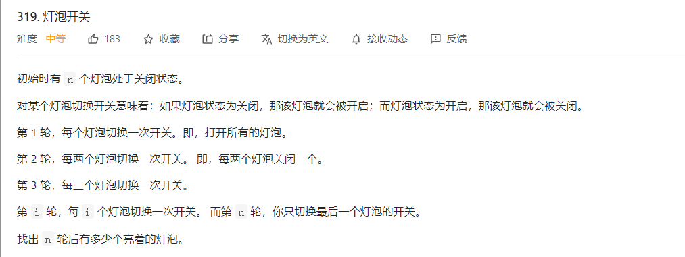
>
>   
>
>   思路：先按照模拟法进行模拟，得到一定的数据，然后尝试归纳结果，比如将前`30` 个结果打印：
>
>   ```text
>   [0, 0, 0, 0, 0, 0, 0, 0, 0, 0, 0, 0, 0, 0, 0, 0, 0, 0, 0, 0, 0, 0, 0, 0, 0, 0, 0, 0, 0, 0]
>   [1, 1, 1, 1, 1, 1, 1, 1, 1, 1, 1, 1, 1, 1, 1, 1, 1, 1, 1, 1, 1, 1, 1, 1, 1, 1, 1, 1, 1, 1]
>   [1, 0, 1, 0, 1, 0, 1, 0, 1, 0, 1, 0, 1, 0, 1, 0, 1, 0, 1, 0, 1, 0, 1, 0, 1, 0, 1, 0, 1, 0]
>   [1, 0, 0, 0, 1, 1, 1, 0, 0, 0, 1, 1, 1, 0, 0, 0, 1, 1, 1, 0, 0, 0, 1, 1, 1, 0, 0, 0, 1, 1]
>   [1, 0, 0, 1, 1, 1, 1, 1, 0, 0, 1, 0, 1, 0, 0, 1, 1, 1, 1, 1, 0, 0, 1, 0, 1, 0, 0, 1, 1, 1]
>   [1, 0, 0, 1, 0, 1, 1, 1, 0, 1, 1, 0, 1, 0, 1, 1, 1, 1, 1, 0, 0, 0, 1, 0, 0, 0, 0, 1, 1, 0]
>   [1, 0, 0, 1, 0, 0, 1, 1, 0, 1, 1, 1, 1, 0, 1, 1, 1, 0, 1, 0, 0, 0, 1, 1, 0, 0, 0, 1, 1, 1]
>   [1, 0, 0, 1, 0, 0, 0, 1, 0, 1, 1, 1, 1, 1, 1, 1, 1, 0, 1, 0, 1, 0, 1, 1, 0, 0, 0, 0, 1, 1]
>   [1, 0, 0, 1, 0, 0, 0, 0, 0, 1, 1, 1, 1, 1, 1, 0, 1, 0, 1, 0, 1, 0, 1, 0, 0, 0, 0, 0, 1, 1]
>   [1, 0, 0, 1, 0, 0, 0, 0, 1, 1, 1, 1, 1, 1, 1, 0, 1, 1, 1, 0, 1, 0, 1, 0, 0, 0, 1, 0, 1, 1]
>   [1, 0, 0, 1, 0, 0, 0, 0, 1, 0, 1, 1, 1, 1, 1, 0, 1, 1, 1, 1, 1, 0, 1, 0, 0, 0, 1, 0, 1, 0]
>   [1, 0, 0, 1, 0, 0, 0, 0, 1, 0, 0, 1, 1, 1, 1, 0, 1, 1, 1, 1, 1, 1, 1, 0, 0, 0, 1, 0, 1, 0]
>   [1, 0, 0, 1, 0, 0, 0, 0, 1, 0, 0, 0, 1, 1, 1, 0, 1, 1, 1, 1, 1, 1, 1, 1, 0, 0, 1, 0, 1, 0]
>   [1, 0, 0, 1, 0, 0, 0, 0, 1, 0, 0, 0, 0, 1, 1, 0, 1, 1, 1, 1, 1, 1, 1, 1, 0, 1, 1, 0, 1, 0]
>   [1, 0, 0, 1, 0, 0, 0, 0, 1, 0, 0, 0, 0, 0, 1, 0, 1, 1, 1, 1, 1, 1, 1, 1, 0, 1, 1, 1, 1, 0]
>   [1, 0, 0, 1, 0, 0, 0, 0, 1, 0, 0, 0, 0, 0, 0, 0, 1, 1, 1, 1, 1, 1, 1, 1, 0, 1, 1, 1, 1, 1]
>   [1, 0, 0, 1, 0, 0, 0, 0, 1, 0, 0, 0, 0, 0, 0, 1, 1, 1, 1, 1, 1, 1, 1, 1, 0, 1, 1, 1, 1, 1]
>   [1, 0, 0, 1, 0, 0, 0, 0, 1, 0, 0, 0, 0, 0, 0, 1, 0, 1, 1, 1, 1, 1, 1, 1, 0, 1, 1, 1, 1, 1]
>   [1, 0, 0, 1, 0, 0, 0, 0, 1, 0, 0, 0, 0, 0, 0, 1, 0, 0, 1, 1, 1, 1, 1, 1, 0, 1, 1, 1, 1, 1]
>   [1, 0, 0, 1, 0, 0, 0, 0, 1, 0, 0, 0, 0, 0, 0, 1, 0, 0, 0, 1, 1, 1, 1, 1, 0, 1, 1, 1, 1, 1]
>   [1, 0, 0, 1, 0, 0, 0, 0, 1, 0, 0, 0, 0, 0, 0, 1, 0, 0, 0, 0, 1, 1, 1, 1, 0, 1, 1, 1, 1, 1]
>   [1, 0, 0, 1, 0, 0, 0, 0, 1, 0, 0, 0, 0, 0, 0, 1, 0, 0, 0, 0, 0, 1, 1, 1, 0, 1, 1, 1, 1, 1]
>   [1, 0, 0, 1, 0, 0, 0, 0, 1, 0, 0, 0, 0, 0, 0, 1, 0, 0, 0, 0, 0, 0, 1, 1, 0, 1, 1, 1, 1, 1]
>   [1, 0, 0, 1, 0, 0, 0, 0, 1, 0, 0, 0, 0, 0, 0, 1, 0, 0, 0, 0, 0, 0, 0, 1, 0, 1, 1, 1, 1, 1]
>   [1, 0, 0, 1, 0, 0, 0, 0, 1, 0, 0, 0, 0, 0, 0, 1, 0, 0, 0, 0, 0, 0, 0, 0, 0, 1, 1, 1, 1, 1]
>   [1, 0, 0, 1, 0, 0, 0, 0, 1, 0, 0, 0, 0, 0, 0, 1, 0, 0, 0, 0, 0, 0, 0, 0, 1, 1, 1, 1, 1, 1]
>   [1, 0, 0, 1, 0, 0, 0, 0, 1, 0, 0, 0, 0, 0, 0, 1, 0, 0, 0, 0, 0, 0, 0, 0, 1, 0, 1, 1, 1, 1]
>   [1, 0, 0, 1, 0, 0, 0, 0, 1, 0, 0, 0, 0, 0, 0, 1, 0, 0, 0, 0, 0, 0, 0, 0, 1, 0, 0, 1, 1, 1]
>   [1, 0, 0, 1, 0, 0, 0, 0, 1, 0, 0, 0, 0, 0, 0, 1, 0, 0, 0, 0, 0, 0, 0, 0, 1, 0, 0, 0, 1, 1]
>   [1, 0, 0, 1, 0, 0, 0, 0, 1, 0, 0, 0, 0, 0, 0, 1, 0, 0, 0, 0, 0, 0, 0, 0, 1, 0, 0, 0, 0, 1]
>   [1, 0, 0, 1, 0, 0, 0, 0, 1, 0, 0, 0, 0, 0, 0, 1, 0, 0, 0, 0, 0, 0, 0, 0, 1, 0, 0, 0, 0, 0]
>   ```
>
>   最后一行有着明显的规律：
>
>   `[1, 0, 0, 1, 0, 0, 0, 0, 1, 0, 0, 0, 0, 0, 0, 1, 0, 0, 0, 0, 0, 0, 0, 0, 1, 0, 0, 0, 0, 0]`
>
>   `0` 的个数表现为：2，4，6，8，10这样的递增顺序。

```python
class Solution:
    def bulbSwitch(self, n: int) -> int:
        if n == 0: return 0
        left = 1
        right = n
        while left <= right:
            mid = left + (right-left) // 2
            val = mid*(mid+2)
            if val == n: right = mid - 1
            elif val < n: left = mid + 1
            else: right = mid - 1
        return left
```


#### 799. 香槟塔 🍉

>   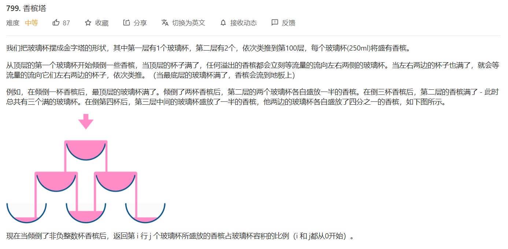

```python
class Solution:
    def champagneTower(self, poured: int, query_row: int, query_glass: int) -> float:
        """ 先假设将所有的香槟一股脑全部放到最上面的杯子中 """
        dp = [[0]*(query_row+2) for i in range(query_row+2)]
        dp[0][0] = poured
        for i in range(0,query_row+1):
            for j in range(0,i+1):
                if dp[i][j] > 1:                    
                    dp[i+1][j] += (dp[i][j]-1) / 2
                    dp[i+1][j+1] += (dp[i][j]-1) / 2
                    dp[i][j] = 1
        return dp[query_row][query_glass]
```


#### 735. 行星碰撞 🍉🍉

>   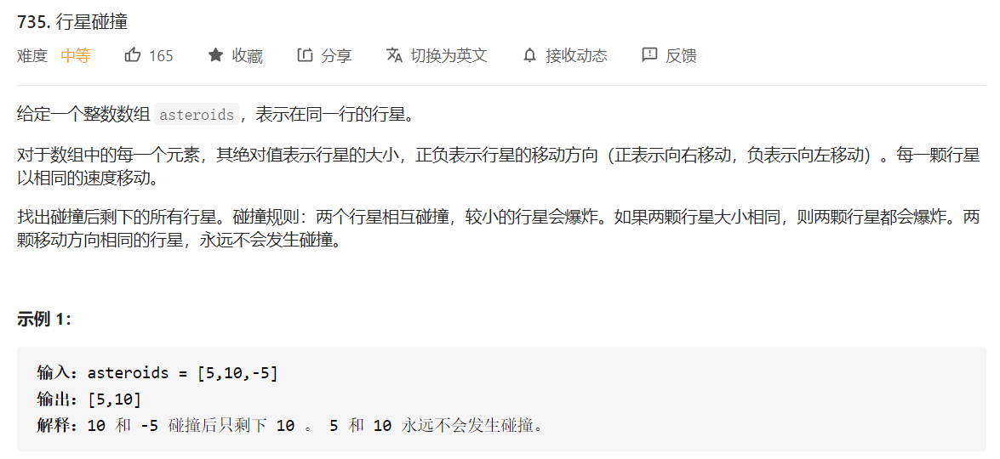
>
>   思路：用栈来模拟，这一题在保证答案正确性时，需要意识到碰撞的单调性，也就是最后的结果一定是：
>
>   +   左边为负数，右边为正数
>   +   全部为负数
>   +   全部为正数
>
>   不会出现交叉情况。

```python
class Solution:
    def asteroidCollision(self, asteroids: List[int]) -> List[int]:
        stack = []
        n = len(asteroids)
        ans = []
        for i in range(n):
            if asteroids[i] > 0:
                stack.append(asteroids[i])
            else:
                if not stack:
                    stack.append(asteroids[i])
                else:
                    while stack and stack[-1] > 0 and stack[-1] + asteroids[i] < 0:
                        stack.pop()    
                    if not stack or stack[-1] < 0:
                        stack.append(asteroids[i])
                    elif stack[-1] + asteroids[i] == 0:
                        stack.pop()
        return stack
```


#### 495. 提莫攻击

>   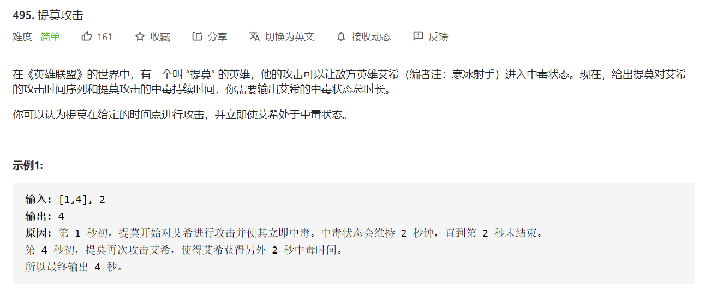
>
>   类似于`跳跃游戏` 那种思路，维护`中毒的时间` 和 `下一个时间序列` 的大小关系。

```python
class Solution:
    def findPoisonedDuration(self, timeSeries: List[int], duration: int) -> int:
        ans = 0
        n = len(timeSeries)
        cur = -1
        for i in range(n):
            if cur >= timeSeries[i]:
                nxt = timeSeries[i] + (duration-1)
                ans += (nxt-cur)
                cur = nxt
            else:
                cur = timeSeries[i] + (duration-1)
                ans += duration
        return ans
```


#### 874. 模拟行走机器人 🍉

>   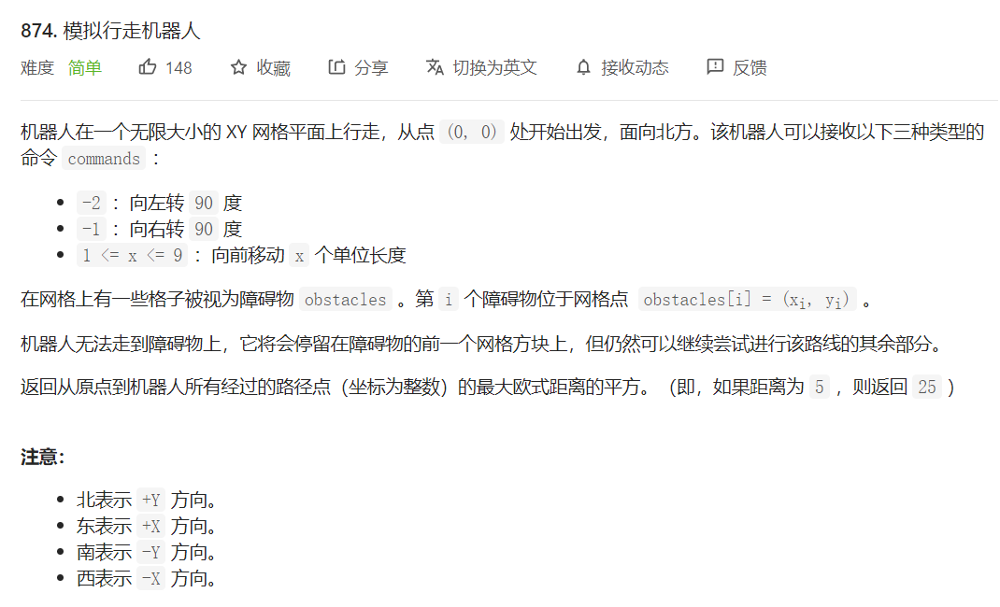
>
>   思路：
>
>   +   用transfer来维护状态转换关系
>   +   用`obstacle_x` 来维护每行或者每列上可能存在的障碍物
>   +   这里计算的是`距离原点的最大值`，而不是最后的值。

```python
class Solution:
    def robotSim(self, commands: List[int], obstacles: List[List[int]]) -> int:
        obstacle_set = set()
        obstacle_x = collections.defaultdict(list)
        obstacle_y = collections.defaultdict(list)

        for obstacle in obstacles:
            obstacle_set.add((obstacle[0],obstacle[1]))
            obstacle_x[obstacle[0]].append(obstacle[1])
            obstacle_y[obstacle[1]].append(obstacle[0])
        
        directions = [[1,0],[-1,0],[0,1],[0,-1]]
        transfer = {
            2:{-1:0,-2:1}, # 当前方向向北，左转和右转
            3:{-1:1,-2:0}, # 当前方向向南，左转和右转
            0:{-1:3,-2:2}, # 当前方向向东，左转和右转
            1:{-1:2,-2:3}, # 当前方向向西，左转和右转
        }

        cur = (0,0)
        ans = 0
        d = 2
        for command in commands:
            if command < 0:
                d = transfer[d][command]
            else:
                x,y = cur
                if d in {0,1}: # 东西方向，判断y
                    val = obstacle_y.get(y,None)
                    if val is None:
                        x = x + directions[d][0]*command
                    else:
                        for i in range(1,command+1):
                            x += directions[d][0]
                            if (x,y) in obstacle_set:
                                x -= directions[d][0]
                                break
                else: # 南北方向，判断y
                    val = obstacle_x.get(x,None)
                    if val is None:
                        y = y + directions[d][1]*command
                    else:
                        for i in range(1,command+1):
                            y += directions[d][1]
                            if (x,y) in obstacle_set:
                                y -= directions[d][1]
                                break      
                cur = (x,y)
                ans = max(ans,x**2+y**2)
        return ans
```


#### [860. 柠檬水找零](https://leetcode-cn.com/problems/lemonade-change/)

>   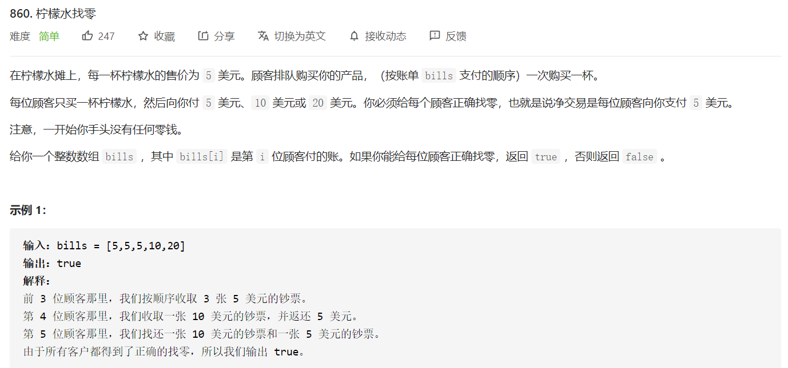

```python
class Solution:
    def lemonadeChange(self, bills: List[int]) -> bool:
        counter = collections.defaultdict(int)
        n = len(bills)
        
        for i in range(n):
            val = bills[i]-5 # 表示应该找给顾客的钱
            if val != 0:
                for money in [20,15,10,5]:
                    if money <= val:
                        freq = min(val // money,counter[money])
                        val = val - money*freq
                        counter[money] -= freq
                    if val == 0: break
                # val不等于0表示没法全部找给用户，结束
                if val > 0: return False
            counter[bills[i]] += 1
        return True
```


#### [1222. 可以攻击国王的皇后](https://leetcode-cn.com/problems/queens-that-can-attack-the-king/)

>   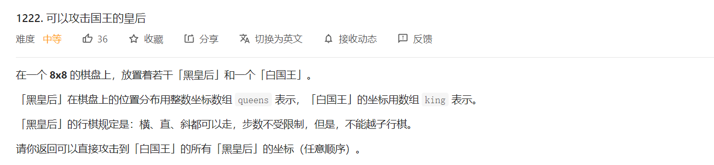
>
>   

```python
class Solution:
    def queensAttacktheKing(self, queens: List[List[int]], king: List[int]) -> List[List[int]]:
        queens_set = set()
        ans = []
        for queen in queens:
            queens_set.add((queen[0],queen[1]))
        
        n = 8
        directions = [[0,1],[0,-1],[1,0],[-1,0],[1,1],[-1,-1],[1,-1],[-1,1]]

        for i in range(len(directions)):
            x,y = king
            while x >= 0 and y >= 0 and x < n and y < n:
                x += directions[i][0]
                y += directions[i][1]
                if (x,y) in queens_set:
                    ans.append([x,y])
                    break
        return ans
```


#### [48. 旋转图像 🍉](https://leetcode-cn.com/problems/rotate-image/)

>   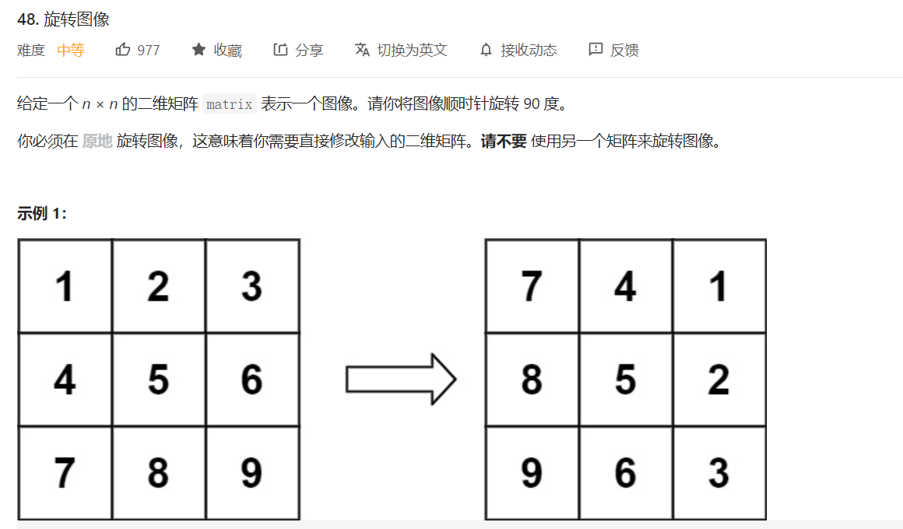

两种思路，一种是按照块来旋转，一种是按照元素旋转。

+   按块填充

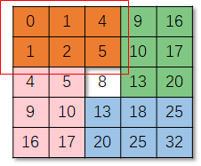

+   按元素填充

    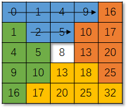

```python
# 按块填充
class Solution:
    def rotate(self, matrix: List[List[int]]) -> None:
        """
        Do not return anything, modify matrix in-place instead.
        """
        N = len(matrix)
        if N == 0: return
        for i in range(N//2):
            for j in range((N+1)//2):
                tmp = matrix[i][j]
                matrix[i][j] = matrix[N-j-1][i]
                matrix[N-j-1][i] = matrix[N-i-1][N-j-1]
                matrix[N-i-1][N-j-1] = matrix[j][N-i-1]
                matrix[j][N-i-1] = tmp

# 按元素填充
class Solution:
    def rotate(self, matrix: List[List[int]]) -> None:
        """
        Do not return anything, modify matrix in-place instead.
        """
        n = len(matrix)
        for x in range(0,n//2):
            for y in range(x,n-x-1):
                matrix[y][n-1-x],matrix[n-1-x][n-1-y],matrix[n-1-y][x],matrix[x][y] =\
                    matrix[x][y],matrix[y][n-1-x],matrix[n-1-x][n-1-y],matrix[n-1-y][x]

```


#### [946. 验证栈序列](https://leetcode-cn.com/problems/validate-stack-sequences/)

>   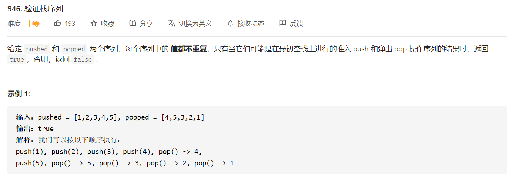
>
>   思路：数据按照先压入后弹出的顺序进行处理，

```python
class Solution:
    def validateStackSequences(self, pushed: List[int], popped: List[int]) -> bool:
        stack = []
        n = len(pushed)
        j = 0
        for i in range(n):
            stack.append(pushed[i])
            while stack and stack[-1] == popped[j]:
                j += 1
                stack.pop()
        return not stack
```


#### [445. 两数相加 II](https://leetcode-cn.com/problems/add-two-numbers-ii/)

```python
class Solution:
    def addTwoNumbers(self, l1: ListNode, l2: ListNode) -> ListNode:
        def reverse(head,prev):
            if not head: return prev
            node = head.next
            head.next = prev
            return reverse(node,head)
        
        l1 = reverse(l1,None)
        l2 = reverse(l2,None)

        dummy = ListNode(-1)
        p = dummy
        p1,p2 = l1,l2
        carry = 0
        while p1 and p2:
            cur = p1.val + p2.val + carry
            p1.val = cur % 10
            carry = cur // 10
            p.next = p1
            p = p.next
            p1 = p1.next
            p2 = p2.next
        
        while p1:
            cur = p1.val + carry
            p1.val = cur % 10
            carry = cur // 10
            p.next = p1
            p = p.next
            p1 = p1.next
        
        while p2:
            cur = p2.val + carry
            p2.val = cur % 10
            carry = cur // 10
            p.next = p2
            p = p.next
            p2 = p2.next
        
        if carry > 0:
            p.next = ListNode(carry)
        
        head = dummy.next
        dummy.next = None
        return reverse(head,None)
```

