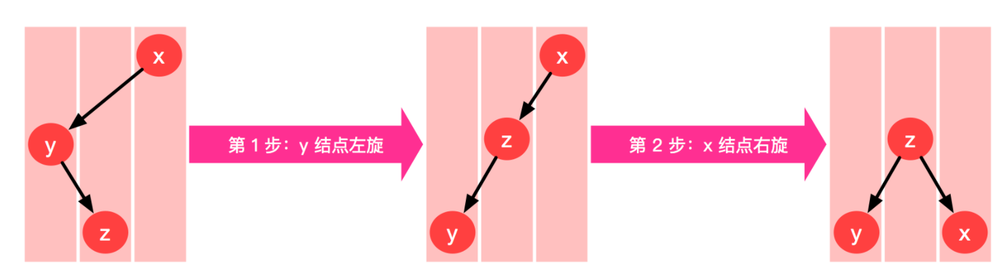
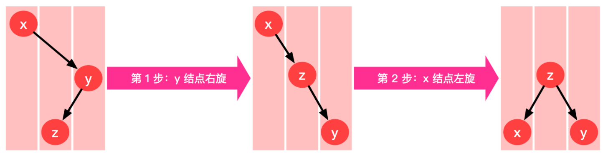

## 操作系统

#### 460 LFU 缓存 🍉

>   

需要两个Hash表一个是`key-value` 哈希表（用来存储`k-v`值），一个是频率哈希表用来存储`Node`双向链表。

```python
class Node(object):
    """
    双链表中的链表节点对象
    """
    def __init__(self,key=None,value=None,freq=0):
        """
        Args:
            key:对应输入的key
            value:对应输入的value
            freq:被访问的频率
            pre:指向前一个节点的指针
            next:指向后一个节点的指针
        """
        self.key = key
        self.value = value
        self.freq = freq
        self.pre = None
        self.next = None
        
class LinkedList(object):
    """
    自定义的双向链表
    """
    def __init__(self):
        """
        Args:
            __head:双向链表的头结点
            __tail:双向链表的尾节点
        """
        self.__head = Node()
        self.__tail = Node()
        self.__head.next = self.__tail
        self.__tail.pre = self.__head
        
    def insertFirst(self,node):
        """
        将指定的节点插入到链表的第一个位置 
        Args:
            node:将要插入的节点    
        """
        node.next = self.__head.next
        self.__head.next.pre = node
        self.__head.next = node
        node.pre = self.__head
        
    def delete(self,node):
        """
        从链表中删除指定的节点 
        Args:
            node:将要删除的节点 
        """
        if self.__head.next==self.__tail:
            return
        node.pre.next = node.next
        node.next.pre = node.pre
        node.next = None
        node.pre = None
        
    def getLast(self):
        """
        从链表中获取最后一个节点
        Returns:
            双向链表中的最后一个节点，如果是空链表则返回None
        """        
        if self.__head.next==self.__tail:
            return None
        return self.__tail.pre
        
    def isEmpty(self):
        """
        判断链表是否为空，除了head和tail没有其他节点即为空链表
        Returns:
            链表不空返回True，否则返回False
        """  
        return self.__head.next==self.__tail

class LFUCache(object):
    """
    自定义的LFU缓存
    """
    def __init__(self, capacity):
        """
        Args:
            __capacity:缓存的最大容量
            __keyMap: key->Node 这种结构的字典
            __freqMap:freq->LinkedList 这种结构的字典
            __minFreq:记录缓存中最低频率
        """
        self.__capacity = capacity
        self.__keyMap = dict()
        self.__freqMap = dict()
        self.__minFreq = 0
        

    def get(self, key):
        """
        获取一个元素，如果key不存在则返回-1，否则返回对应的value
        同时更新被访问元素的频率
        Args:
            key:要查找的关键字
        Returns:
            如果没找到则返回-1，否则返回对应的value
        """
        if key not in self.__keyMap:
            return -1
        node = self.__keyMap[key]
        self.__increment(node)
        return node.value

    def put(self, key, value):
        """
        插入指定的key和value，如果key存在则更新value，同时更新频率
        如果key不存并且缓存满了，则删除频率最低的元素，并插入新元素
        否则，直接插入新元素
        Args:
            key:要插入的关键字
            value:要插入的值
        """
        if key in self.__keyMap:
            node = self.__keyMap[key]
            node.value = value
            self.__increment(node)
        else:
            if self.__capacity==0:
                return
            if len(self.__keyMap)==self.__capacity:
                self.__removeMinFreqElement()
            node = Node(key,value,1)
            self.__increment(node,True)
            self.__keyMap[key] = node
        
    def __increment(self,node,is_new_node=False):
        """
        更新节点的访问频率
        Args:
            node:要更新的节点
            is_new_node:是否是新节点，新插入的节点和非新插入节点更新逻辑不同
        """
        if is_new_node:
            self.__minFreq = 1
            self.__setDefaultLinkedList(node)
        else:
            self.__deleteNode(node)
            node.freq += 1
            self.__setDefaultLinkedList(node)
            if self.__minFreq not in self.__freqMap:
                self.__minFreq += 1
    
    def __setDefaultLinkedList(self,node):
        """
        根据节点的频率，插入到对应的LinkedList中，如果LinkedList不存在则创建
        Args:
            node:将要插入到LinkedList的节点
        """
        if node.freq not in self.__freqMap:
            self.__freqMap[node.freq] = LinkedList()
        linkedList = self.__freqMap[node.freq]
        linkedList.insertFirst(node)
        
    def __deleteNode(self,node):
        """
        删除指定的节点，如果节点删除后，对应的双链表为空，则从__freqMap中删除这个链表
        Args:
            node:将要删除的节点
        """
        if node.freq not in self.__freqMap:
            return
        linkedList = self.__freqMap[node.freq]
        freq = node.freq
        linkedList.delete(node)
        if linkedList.isEmpty():
            del self.__freqMap[freq]
        
    def __removeMinFreqElement(self):
        """
        删除频率最低的元素，从__freqMap和__keyMap中都要删除这个节点，如果节点删除后对应的链表为空，则要从__freqMap中删除这个链表
        """
        linkedList = self.__freqMap[self.__minFreq]
        node = linkedList.getLast()
        linkedList.delete(node)
        del self.__keyMap[node.key]
        if linkedList.isEmpty():
            del self.__freqMap[node.freq]
```


## 二叉树

#### 二叉平衡搜索树（AVL ）

>   基本定义

同样是二分搜索树，右边的二叉树较矮，在进结点查找、添加、删除操作时，都比左边的二叉搜索树要快。


比较矮的二叉树是我们所喜欢的，高的二叉树是性能较差的，最差情况下，退化成链表。

>   BST的等价性

下图的五种二叉搜索树都表示同一颗`BST`，从左到右依次代表了：`LL`，`RR`，`LR`，`RL`，这四种情况都等价于最下面绿色情况。


>   AVL维持自平衡

AVL维持自平衡就是要将上面的四种情况转化成与之等价的平衡的BST树的样子。

`LL`为，右旋：


```python
def rightRotate(node):
    x = node
    y = node.left
    
    w = y.right # 取下右边的结点元素
    
    y.right = x # 旋转
    x.left = w
    
    x.height = max(getHeight(x.left),getHeight(x.right))+1
    y.height = max(getHeight(y.left),getHeight(y.right))+1
    return y
```

`RR`右旋：



```python
def leftRotate(node):
    x = node
    y = x.right
    w = y.left
    y.left = x
    x.right = w
    x.height = max(getHeight(x.left),getHeight(x.right))+1
    y.height = max(getHeight(y.left),getHeight(y.right))+1
    return y
```

`LR` 


`RL`




#### [红黑树](https://zh.wikipedia.org/wiki/%E7%BA%A2%E9%BB%91%E6%A0%91)


## 字典树

#### 421. 数组中两个数的最大异或值

思路：字典树

```python
class Solution:
    def findMaximumXOR(self, nums: List[int]) -> int:
        L = len(bin(max(nums)))-2 # 求出所有数字最大的那个数的二进制长度
        root = dict()
		
        # 建立字典树
        for n in nums:
            node = root
            for i in range(L,-1,-1):
                v = (n >> i) & 1
                if v not in node:
                    node[v] = dict()
                    node = node[v]
                else:
                    node = node[v]
        res = 0
        for n in nums:
            node = root
            total = 0
            for i in range(L,-1,-1): # 求解
                v = (n >> i) & 1
                if 1-v in node:
                    total = (total<<1)|1
                    node = node[1-v]
                else:
                    total = total<<1
                    node = node[v]
            res = max(res,total)

        return res
```
