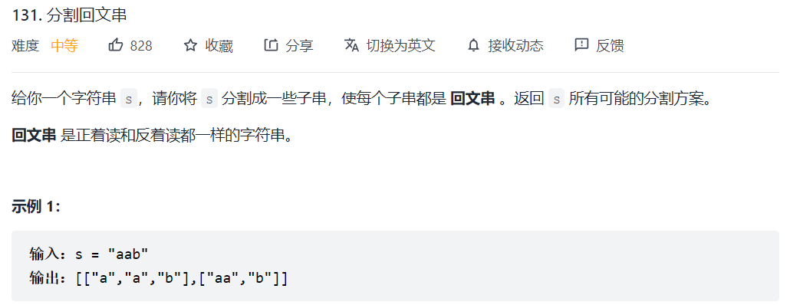
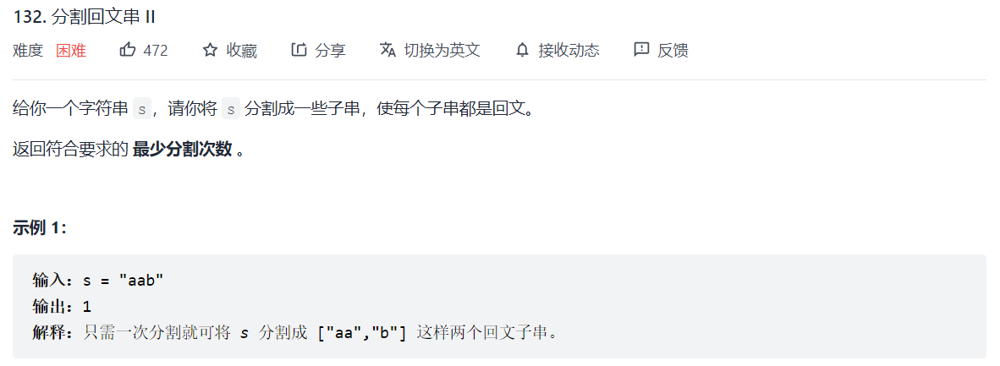

#### 468. 验证IP地址


## 重复

#### 187. 重复的DNA序列

>   
>
>   基本思路很简单，就是对字符串切分，然后利用哈希表统计频次。

```python
class Solution:
    def findRepeatedDnaSequences(self, s: str) -> List[str]:
        s_dict = collections.defaultdict(int)
        n = len(s)
        for right in range(9,n):
            s_dict[s[right-9:right+1]] += 1
        ans = []
        for k,v in s_dict.items():
            if v >= 2:
                ans.append(k)
        return ans
```


## 回文

#### 131 分割回文串

>   
>
>   这一题优化做法是利用动态规划或者哈希表将回文字符串记录下来，加快查询速度。

```python
class Solution:
    def partition(self, s: str) -> List[List[str]]:
        n = len(s)
        self.ans = []
        self.pailset = set()

        def check(s):
            if len(s) == 0: return False
            left,right = 0,len(s)-1
            while left <= right:
                if s[left] != s[right]:
                    return False
                left += 1
                right -= 1
            return True

        def helper(idx,record,path):
            if idx == n:
                if path in self.pailset or check(path):
                    self.pailset.add(path)
                    self.ans.append(record+[path])
                return
            # 不分开
            helper(idx+1,record,path+s[idx])
            # 分开
            if path in self.pailset or check(path):
                self.pailset.add(path)
                helper(idx+1,record+[path],s[idx])
    
        helper(0,[],"")
        return self.ans
```


#### 132. 分割回文串 II 🍉

>   
>
>   思路：首先利用动态规划求出所有可能的回文子串，然后基于双指针遍历计算最少分割次数。

```python
class Solution:
    def minCut(self, s: str) -> int:
        """
        动态规划找到所有的回文串,然后类似区间问题
        """
        n = len(s)
        dp = [[True]*n for i in range(n)]
        for i in range(n): dp[i][i] = True

        for size in range(2,n+1):
            for i in range(0,n-size+1):
                j = i + size - 1
                dp[i][j] = s[i] == s[j] and dp[i+1][j-1]
        
        # 思路比较复杂
        ans= [float("inf")]*len(s)
        for i in range(n):
            if dp[0][i]:
                ans[i] = 0
            else:
                for j in range(0,i):
                    if dp[j+1][i]: 
                        ans[i] = min(ans[i], ans[j]+1)
        return ans[n-1]
```


#### 🚀 面试 字符串 ABABABAB,判断是否存在重复模式，如果有输出 AB4

