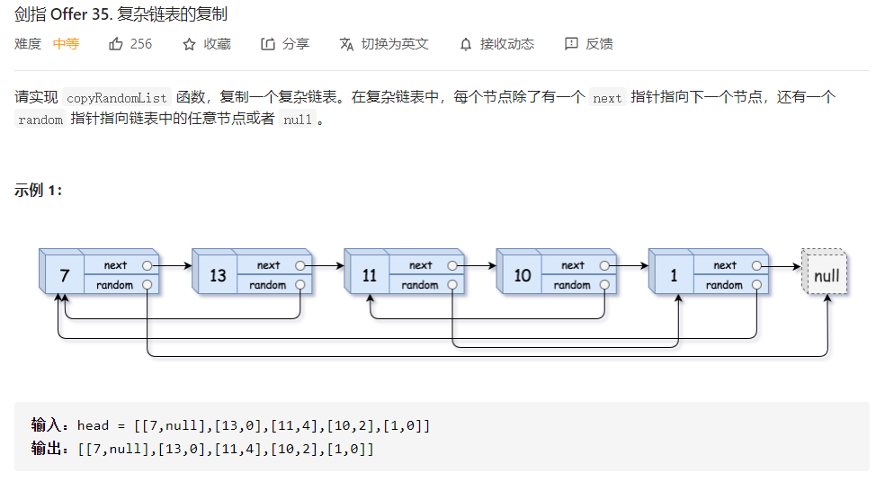

## 简单题

#### 21. 合并两个有序链表

>   
>
>   思路：递归解法。

```python
# Definition for singly-linked list.
# class ListNode:
#     def __init__(self, val=0, next=None):
#         self.val = val
#         self.next = next
class Solution:
    def mergeTwoLists(self, l1: ListNode, l2: ListNode) -> ListNode:
        def helper(l1,l2):
            if not l1: return l2
            if not l2: return l1

            if l1.val <= l2.val:
                l1.next = helper(l1.next,l2)
                return l1
            else:
                l2.next = helper(l1,l2.next)
                return l2
        
        return helper(l1,l2)
```


#### 160 相交链表

>   
>
>   思路：两个指针，走相同的路径，要么相遇，要么为空

```python
class Solution:
    def getIntersectionNode(self, headA: ListNode, headB: ListNode) -> ListNode:
        p1 = headA
        p2 = headB
        while p1 != p2:
            p1 = p1.next if p1 else headB
            p2 = p2.next if p2 else headA
        return p1
```


#### 206 反转链表

>   

```python
def helper(head,prev):
    if not head: return prev
    node = head.next
    head.next = prev
    return helper(node,head)

return helper(head,None)
```

#### [234. 回文链表](https://leetcode-cn.com/problems/palindrome-linked-list/)

>   

```python
# Definition for singly-linked list.
# class ListNode:
#     def __init__(self, val=0, next=None):
#         self.val = val
#         self.next = next
class Solution:
    def isPalindrome(self, head: ListNode) -> bool:
        stack = []
        dummy = ListNode(-1)
        dummy.next = head
        slow = fast = dummy

        while fast and fast.next:
            slow = slow.next
            fast = fast.next.next
            stack.append(slow.val)
        if fast is None: 
            stack.pop()

        slow = slow.next
        
        while slow:
            if slow.val == stack[-1]:
                slow = slow.next
                stack.pop()
            else:
                return False
        return True
```

#### 445. 两数相加 II 🍉

>   
>
>   思路，反转通常要想到栈，先遍历两个链表，将元素加入到两个栈中，然后从栈中依次弹出栈。

```python
# Definition for singly-linked list.
# class ListNode:
#     def __init__(self, val=0, next=None):
#         self.val = val
#         self.next = next
class Solution:
    def addTwoNumbers(self, l1: ListNode, l2: ListNode) -> ListNode:
        p1,p2 = l1,l2
        stack1 = []
        stack2 = []
        while p1: 
            stack1.append(p1.val)
            p1 = p1.next
        while p2:
            stack2.append(p2.val)
            p2 = p2.next
        carry = 0
        ans = None
        while stack1 or stack2 or carry > 0:
            digit1 = stack1.pop() if stack1 else 0
            digit2 = stack2.pop() if stack2 else 0
            cur = digit1 + digit2 + carry
            node = ListNode(cur%10)
            carry = cur // 10
            node.next = ans
            ans = node
        return ans
```


## 复杂题

#### 剑指 Offer 35. 复杂链表的复制 🍉

>   

```python
"""
# Definition for a Node.
class Node:
    def __init__(self, x: int, next: 'Node' = None, random: 'Node' = None):
        self.val = int(x)
        self.next = next
        self.random = random
"""
class Solution:
    def copyRandomList(self, head: 'Node') -> 'Node':
        if not head: return head
        # copy nodes
        h = head
        while h:
            node = Node(h.val)
            node.next = h.next
            h.next = node
            h = node.next

        # copy random
        h = head
        while h:
            if h.random is None:
                h.next.random = None
            else:
                h.next.random = h.random.next
            h = h.next.next
        
        # split
        slow,fast = head,head.next
        ans = fast
        while slow and slow.next:
            node = slow.next.next
            if node is None:
                break
            else:
                fast.next = node.next
                fast = fast.next
                slow.next = node
                slow = slow.next
        return ans
```
