[TOC]

## 1. 双指针类型

#### 1.1 双指针的思想

双指针的基本思想是`二段性`：

+   `（扩充字符串）`：当前的右指针向右边移动的时候，`某种性质`只会增加或者不变。
+   `（缩小字符串）`：当前的左指针向右边移动的时候，`某种性质`会减少或者不变。

双指针的细节：

+   对于最后元素的处理，有可能指针一向右边扩张；然后，需要在最后增加一个额外的处理条件。


#### 1.2 滑动窗口模板

```python
def findSubstring(s):
    N = len(s) # 数组/字符串长度
    left, right = 0, 0 # 双指针，表示当前遍历的区间[left, right]，闭区间
    counter = collections.Counter() # 用于统计 子数组/子区间 是否有效
    res = 0 # 保存最大的满足题目要求的 子数组/子串 长度
    while right < N: # 当右边的指针没有搜索到 数组/字符串 的结尾
        counter[s[right]] += 1 # 增加当前右边指针的数字/字符的计数
        while 区间[left, right]不符合题意：# 此时需要一直移动左指针，直至找到一个符合题意的区间
            counter[s[left]] -= 1 # 移动左指针前需要从counter中减少left位置字符的计数
            left += 1 # 真正的移动左指针，注意不能跟上面一行代码写反
        # 到 while 结束时，我们找到了一个符合题意要求的 子数组/子串
        res = max(res, right - left + 1) # 需要更新结果
        right += 1 # 移动右指针，去探索新的区间
    return res

作者：fuxuemingzhu
链接：https://leetcode-cn.com/problems/longest-repeating-character-replacement/solution/fen-xiang-zhen-cang-de-shuang-zhi-zhen-m-fdsk/
来源：力扣（LeetCode）
著作权归作者所有。商业转载请联系作者获得授权，非商业转载请注明出处。
```


## 题目 ~ 1. 碰撞指针类型

#### 42 接雨水 

>   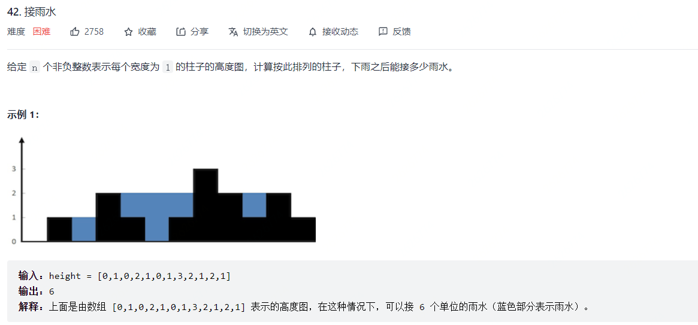
>
>   **双指针 + 短板原理**
>
>   双指针，从两头到中间，同时根据短板原理，在每次选择时候选择较短的下标进行扩展。

```python
class Solution:
    def trap(self, height: List[int]) -> int:
        left,right = 0,len(height)-1

        fill = 0
        while left < right:
            if height[left] >= height[right]:
                if height[right-1] < height[right]:
                    fill += (height[right] - height[right-1])
                    height[right-1] = height[right]
                right -= 1
            else:
                if height[left+1] < height[left]:
                    fill += (height[left] - height[left+1])
                    height[left+1] = height[left]
                left += 1
        return fill
```


#### 658 找到k个最接近的元素 

>   **二分法 + 双指针** 
>
>   +   二分法找到元素下标（因为元素不一定存在，所以需要调整index使得`arr[index]~x`）
>   +   双指针扩展得到满足条件的数据，选取元素时候按照给定的标准。

```python
class Solution:
    def findClosestElements(self, arr: List[int], k: int, x: int) -> List[int]:
        # 二分法快速查找下标
        import bisect
        index = bisect.bisect_left(arr,x)
        n = len(arr)
        if index >= n: return arr[-k:]
        if index <= 0: return arr[:k]

        # 调整一下，二分法查找到的坐标，使得初始下标更接近x
        if (x-arr[index-1]) <= (arr[index]-x):
            index -= 1
        k -= 1
        left,right = index-1,index+1

        # 双指针查找
        while k > 0 and left >= 0 and right < n:
            left_val = x - arr[left]
            right_val = arr[right] - x
            if left_val <= right_val: left -= 1
            else: right += 1
            k -= 1

        # 处理边界情况
        if left == -1: right = right + k
        if right == n: left = left - k
        return arr[left+1:right]
```

#### 125. 验证回文串 

思路：双指针，左开头，右结尾，满足条件就向中间收缩。

```python
class Solution:
    def isPalindrome(self, s: str) -> bool:
        left = 0
        right = len(s) - 1

        while left < right:
            f1 = s[left].isalpha() or s[left].isdigit()
            f2 = s[right].isalpha() or s[right].isdigit()
            if f1 and f2:
                if s[left].lower() == s[right].lower():
                    left += 1
                    right -= 1
                else:
                    return False
            if not f1: left += 1 # 略过空格
            if not f2: right -= 1 # 略过空格
        return True
```


#### 680. 验证回文字符串 Ⅱ 

思路：双指针，左开头，右结尾，满足条件就向中间收缩，遇到不一样，则跳过左边或者右边，然后直接判断剩下的字符是否构成回文串。

```python
class Solution:
    def validPalindrome(self, s: str) -> bool:
        def is_valid(s,l,r):
            while l < r:
                if s[l] != s[r]:
                    return False
                l += 1
                r -= 1
            return True

        left,right = 0,len(s)-1
        while left < right:
            if s[left] != s[right]:
                return is_valid(s,left+1,right) or is_valid(s,left,right-1)
            left += 1
            right -= 1
        return True
```

#### 881. 救生艇 

>   **排序 + 双指针**
>
>   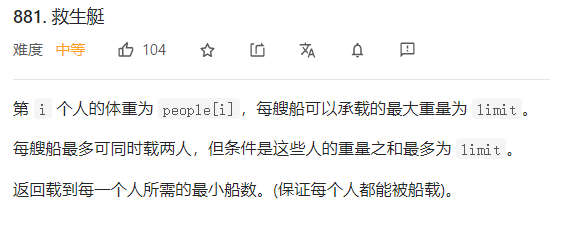
>
>   这一题容易出错，关键点在于每艘船`最多同时载两人`，有了这个条件，问题被简化了很多，贪心思路
>
>   +   对数组进行排序，然后从数组两端。
>   +   双指针，较大的搭配较小的。

```python
class Solution:
    def numRescueBoats(self, people: List[int], limit: int) -> int:
        """
        排序后 + 双指针
        """
        people.sort()
        n = len(people)
        left,right = 0,n-1
        ans = 0

        while people[right] >= limit: 
            ans += 1
            right -= 1
        
        while left < right:
            val = people[left] + people[right]
            if val > limit:
                ans += 1
                right -= 1
            elif val <= limit:
                left += 1
                right -= 1
                ans += 1
        if left == right: ans += 1
        return ans
```


#### 1793. 好子数组的最大分数 

>   思路：双指针做法，第k个下标开始，向两边扩散，定义一个`min_val`维护当前高度的最小值。

```python
class Solution:
    def maximumScore(self, nums: List[int], k: int) -> int:
        i,j = k,k
        ans = 0
        min_val = float("inf")
        while i >= 0 and j < len(nums):
            min_val = min(nums[j],min_val)
            min_val = min(nums[i],min_val)
            ans = max(ans,(j-i+1)*(min_val))
            if i == 0: j+=1
            elif j == len(nums)-1: i -= 1
            elif nums[j+1] > nums[i-1]: j += 1 # 这样，选择右边肯定比选择左边收益大
            else: i -= 1 # 这样，选择左边肯定比选择右边收益大
        return ans
```


## 题目 ~ 2. 滑动窗口类型

>   基本步骤：
>
>   第一步：找到扩张的标准。
>
>   第二步：找到收缩的标准。
>
>   第三步：注意最后一个特例的处理。


#### 3. 无重复字符的最长子串 

>   思路：套上面的框架，先扩充右边，然后判断区间是否正确，选择是移动左边。
>
>   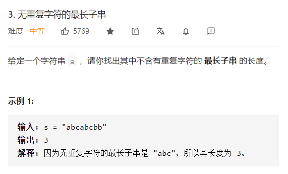
>
>   就存在`二段性`了，也就是：
>
>   +   当前的右指针向右边移动的时候，子串中的字符数量只会增加或者不变。
>   +   当前的左指针向右边移动的时候，子串中的字符数量只会减少或者不变。

```python
class Solution:
    def lengthOfLongestSubstring(self, s: str) -> int:
        n = len(s)
        ans = 0
        left = right = 0
        count = collections.defaultdict(int)

        while right < n:
            if count[s[right]] == 0:
                count[s[right]] += 1
                right += 1
            else:
                ans = max(ans,right-left)
                while s[left] != s[right]:
                    count[s[left]] -= 1
                    left += 1
                count[s[left]] -= 1
                left += 1
        ans = max(ans,right-left)
        return ans
```

#### 76. 最小覆盖子串 🍉

>   思路：同样是右边扩张，左边收缩，但是区别在于是求最小覆盖子串，所以在右边到达边界之后，仍然需要缩小左边边界。
>
>   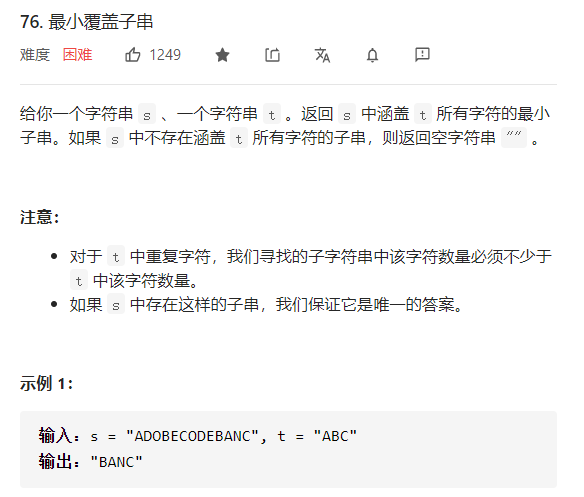
>
>   第一步：找到扩张的标准。【匹配的字符数量是否大于0】
>
>   第二步：找到收缩的标准。
>
>   第三步：注意最后一个特例的处理。

```python
class Solution:
    def minWindow(self, s: str, t: str) -> str:
        count = collections.Counter(t)
        number = len(s)
        ans = [float("inf"),0,0]

        left = right = 0
        while right < len(s):
            if number > 0: # 扩充右边界
                if s[right] in count:
                    if count[s[right]] > 0:
                        number -= 1
                    count[s[right]] -= 1
                right += 1
            else:
                if (right-left) < ans[0]:
                    ans = [right-left,left,right]

                # 越过第一个字符串
                if s[left] in count:
                    if count[s[left]] == 0:
                        number += 1
                    count[s[left]] += 1
                left += 1                    
                
                # 缩小左边界
                while left < right and (s[left] not in count or count[s[left]] < 0):
                    if s[left] in count:
                        count[s[left]] += 1
                    left += 1

        if number == 0:
            while left < right and (s[left] not in count or count[s[left]] < 0):
                if s[left] in count:
                    count[s[left]] += 1
                left += 1
            return s[left:right] if right-left < ans[0] else s[ans[1]:ans[2]]
        else:
            return s[ans[1]:ans[2]]
```

#### 438. 找到字符串中所有字母异位词 

>   思路：和`76`题类似，但是这题不要求最短，而是求出所有的字符异位词，所以应该维护一个固定的滑动窗口。
>
>   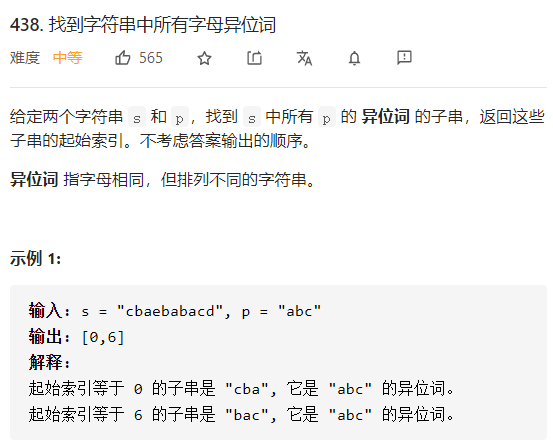

```python
class Solution:
    def findAnagrams(self, s: str, p: str) -> List[int]:
        p_counter = collections.Counter(p)
        counter = collections.defaultdict(int)
        size = len(p)
        n = len(s)
        left = right = 0
        ans = []
        while right < n:
            if s[right] in p_counter:
                counter[s[right]] += 1
                if counter[s[right]] <= p_counter[s[right]]:
                    size -= 1
                    if size == 0: ans.append(left)
                else:
                    while left <= right and counter[s[right]] > p_counter[s[right]]:
                        if counter[s[left]] <= p_counter[s[left]]:
                            size += 1
                        counter[s[left]] -= 1
                        left += 1
                        if size == 0: ans.append(left) # 缩减的时候也需要考虑可能的答案
                right += 1
            else:
                right += 1
                left = right
                size = len(p)
                counter = collections.defaultdict(int)
        return ans
            
```


#### 567. 字符串的排列 

>   思路：与438题类似，利用`Counter`或者字典直接进行碰撞，[解法](https://leetcode-cn.com/problems/permutation-in-string/solution/zhu-shi-chao-xiang-xi-de-hua-dong-chuang-rc7d/)
>
>   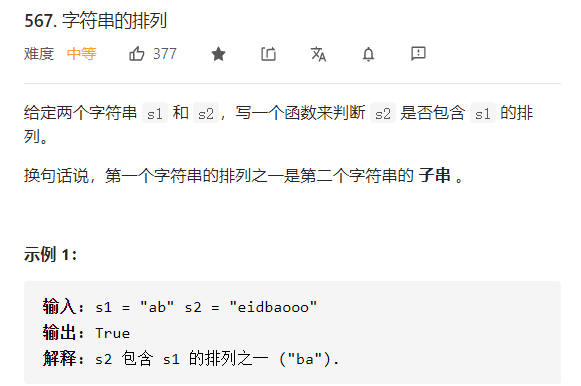

```python
class Solution:
    def checkInclusion(self, s1: str, s2: str) -> bool:
        s1_counter = collections.Counter(s1)
        counter = collections.defaultdict(int)
        size = len(s1)

        left = right = 0
        n = len(s2)
        while right < n:
            if s2[right] in s1_counter:
                counter[s2[right]] += 1
                if counter[s2[right]] <= s1_counter[s2[right]]:
                    size -= 1
                    if size == 0: return True
                else:
                    while left < right and counter[s2[right]] > s1_counter[s2[right]]:
                        if counter[s2[left]] <= s1_counter[s2[left]]:
                            size += 1
                        counter[s2[left]] -= 1
                        left += 1
                right += 1
            else:
                size = len(s1)
                counter = collections.defaultdict(int)
                right += 1
                left = right
        
        return False
```


#### 16 最接近的三数之和 

>   在三数之和上，维护一个diff变量存储当前的最小差值。

```python
class Solution:
    def threeSumClosest(self, nums: List[int], target: int) -> int:
        n = len(nums)
        nums.sort()
        ans = 0
        diff = float("inf")

        for i in range(n):
            left = i + 1
            right = n - 1

            while left < right:
                cur = nums[i] + nums[left] + nums[right]
                if cur == target: 
                    return target
                else:
                    if cur > target: right -= 1
                    else: left += 1
                if abs(cur-target) < diff:
                    diff = abs(cur-target)
                    ans = cur
        return ans
```


#### 209. 长度最小的子数组 

>   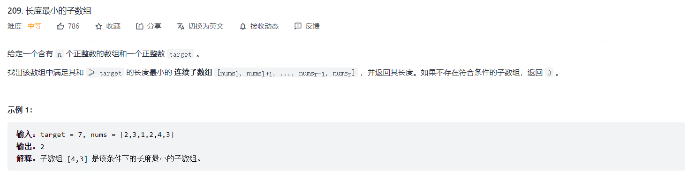
>
>   思路：利用数组元素全部为正的性质，顺序滑动，如果当前和大于等于`target`，则对窗口进行缩小；否者，对窗口进行扩张，`滑动窗口`。

```python
class Solution:
    def minSubArrayLen(self, target: int, nums: List[int]) -> int:
        left = right = 0
        n = len(nums)
        ans = float("inf")
        cur = 0

        while right < n:
            cur += nums[right]

            if cur >= target:
                while cur >= target and left <= right:
                    ans = min(ans,right-left+1)
                    cur -= nums[left]
                    left += 1
            right += 1
        return 0 if  ans == float("inf") else ans
```


#### 424. 替换后的最长重复字符 🍉

>   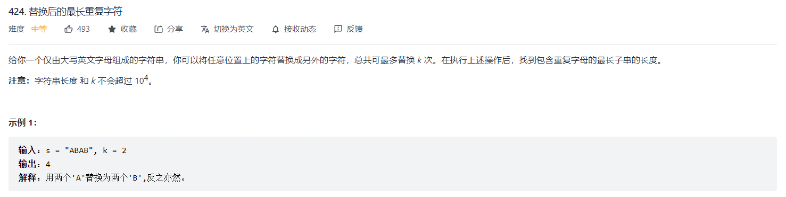
>
>   思路：维护一个`max_n`，表示滑动窗口中数量最多的字符，而`max_n+k`表示了滑动窗口中字符嫩构成的最长字符串（含替换）。

```python
class Solution:
    def characterReplacement(self, s: str, k: int) -> int:
        counter = collections.defaultdict(int)
        left,right = 0,0
        n = len(s)
        max_n = 0
        ans = 0
        while right < n: 
            counter[s[right]] += 1
            max_n = max(max_n,counter[s[right]])
            """
            right-left+1维护的是当前的区间；
            max_n+k维护的是目前最好的结果；
            [left,right]中的元素不一定能是正确的结果，但是对应长度确实最长的。
            """
            while right-left+1 > max_n + k:
                counter[s[left]] -= 1
                left += 1
            ans = max(ans,right-left+1)
            right += 1
        return ans
```


#### 532. 数组中的k-diff数对 🍉

>   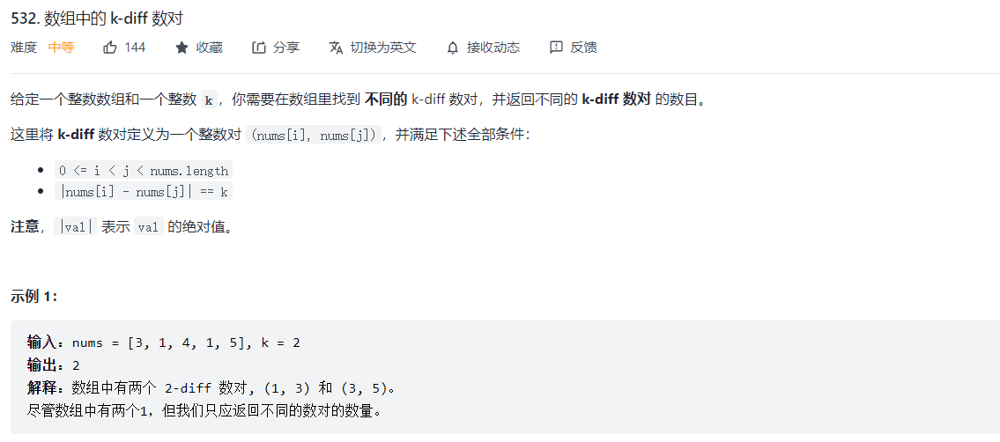

思路：双指针法，难点是需要考虑**重复元素**的剔除。

```java
class Solution:
    def findPairs(self, nums: List[int], k: int) -> int:
        if k == 0:
            return sum([v >= 2 for key,v in collections.Counter(nums).items()])
        n = len(nums)
        nums.sort()
        left = right = 0
        ans = 0
        while right < n:
            diff = nums[right]-nums[left]
            if diff >= k:
                while diff > k and left <= right:
                    left += 1
                    diff = nums[right] - nums[left]
                if diff == k: 
                    ans += 1
                    left += 1
                while left < right and nums[left] == nums[left-1]: left += 1
            right += 1
        
        return ans
https://leetcode-cn.com/problems/k-diff-pairs-in-an-array/solution/pai-xu-bian-li-zhi-xing-yong-shi-4-ms-zai-suo-you-/
```

+   哈希法

    ```python
    class Solution:
        def findPairs(self, nums: List[int], k: int) -> int:
            if k<0:
                return 0
            visited = set()
            diff = set()
            for num in nums:
                if num-k in visited:
                    diff.add((num,num-k)) # 保证唯一性
                if num+k in visited:
                    diff.add((num+k,num))
                visited.add(num)
            return len(diff)
    
    ```

    

-------


#### 713. 乘积小于K的子数组

>   思路：这一题和**209题**类似，只不过这一题是求解乘积，思路是一致的。
>
>   $ans += (right-left+1)$ 表示的含义是 以右边界$right$为结尾的满足条件的数组的个数

```python
# 以输入[10,5,2,6]为例子
# [10]   [5]  [2]   [6]
#    [10,5] [5,2] [2,6]
#           [5,2,6]
class Solution:
    def numSubarrayProductLessThanK(self, nums: List[int], k: int) -> int:
        # nums = [10,5,2,6], k = 100
        left,right = 0,0
        ans = 0
        cur = 1
        while right < len(nums):
            cur = cur * nums[right]
            if cur >= k:
                while left <= right and cur >= k:
                    cur /= nums[left]
                    left += 1
            ans += (right-left+1)
            right += 1
        return ans
```


#### 992 K个不同整数的子数组 🍉

>   **双指针**
>
>   采用`差集`的思想，K个不同整数的子数组的个数大小，可以由两部分的集合相减得到。
>
>   这种两个集合就是一个数组中，子数组中不同整数的个数小于等于`K`的数组数量和子数组中不同整数的个数小于等于`K-1`的数组数量。
>
>   而某一个集合的数组数量的求法等同于713题和424题。
>
>   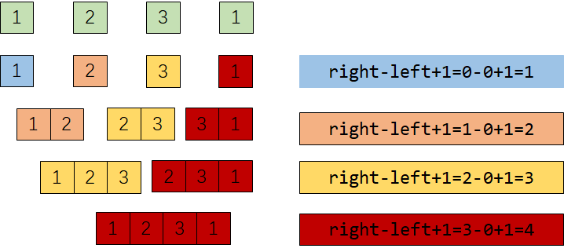

```python
class Solution:
    def subarraysWithKDistinct(self, nums: List[int], k: int) -> int:
        """
            双指针 + 二段性
            右指针向右，字符的数量可能增加或者不变
            左指针向右，字符的数量可能减少或者不变
        """
        def helper(nums,k):
            left = right = 0
            n = len(nums)
            counter = collections.defaultdict(int)
            ans = 0
            cnt = 0
            while right < n:
                if counter[nums[right]] == 0: cnt += 1
                counter[nums[right]] += 1
                while cnt > k:
                    counter[nums[left]] -= 1
                    if counter[nums[left]] == 0: cnt -= 1
                    left += 1
                ans += (right-left+1)
                right += 1
            return ans
        return helper(nums,k) - helper(nums,k-1)
```


#### 2001 最大值减去最小值小于或等于num的子数组数量  🍉🍉

>   给定数组arr和整数num，共返回有多少个子数组满足如下情况：
>
>   $\max(arr[i,\cdots,j])-\min(arr[i,\cdots,j]) <= num$
>
>   思路：
>
>   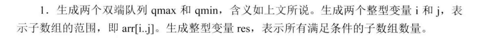
>
>   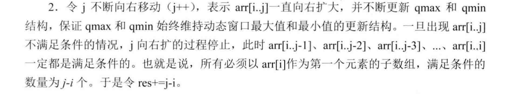
>
>   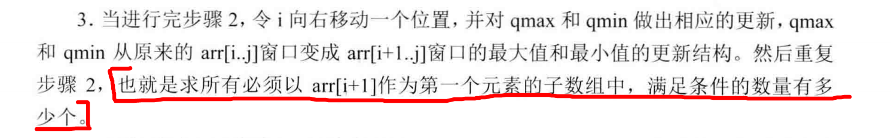
>
>   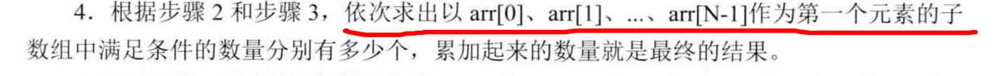

```python
def solution(nums,gap):
    n = len(nums)
    queue_min = collections.deque() # 单调增队列
    queue_max = collections.deque() # 单调减队列
    i = j = 0
    ans = 0
    while i < n:
        while j < n:
            while queue_max and nums[queue_max[-1]] <= nums[j]:
                queue_max.pop()
            queue_max.append(j)
            
            while queue_min and nums[queue_min[-1]] >= nums[j]:
                queue_min.pop()
            queue_min.append(j)
            if nums[queue_max[0]] - nums[queue_min[0]] > gap:
                break
            j += 1
        if queue_min[0] == i:
            queue_min.popleft()
        if queue_max[0] == i:
            queue_max.popleft()
        # 当前的`j-i`保存的是以arr[i]作为开始节点的子数组
        ans += j-i
        i += 1
    return ans

nums = [1,2,4,5,5] 
gap = 2
ans = solution(nums,gap)
print(ans)
```


#### 1004. 最大连续1的个数 III 表

>   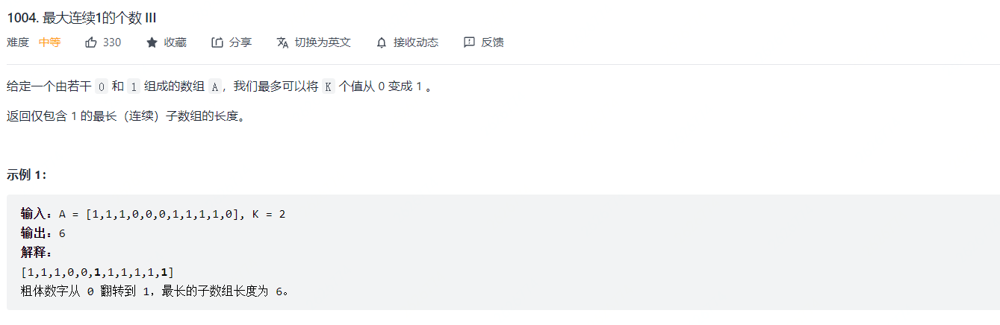
>
>   思路：和424题类似，都是更换K个值后，唯一元素的数量大小。

```python
class Solution:
    def longestOnes(self, nums: List[int], k: int) -> int:
        max_n = 0
        ans = 0
        n = len(nums)
        left = right = 0
        cnt = 0 # 滑动窗口中1的数量
        
        while right < n:
            cnt += nums[right]
            max_n = max(max_n,cnt)
            while right-left+1 > max_n + k:
                cnt -= nums[left]
                left += 1
            ans = max(ans,right-left+1)
            right += 1
        
        return ans
```

#### 1248 统计优美子数组 

>   双指针问题上，可以采用和992题类似的思路，需要求恰好为 `k` 个奇数数字的子数组，可以用所有小于等于k的子数组减去所有小于等于k-1的子数组。

```python
class Solution:
    def numberOfSubarrays(self, nums: List[int], k: int) -> int:
        def findK(nums,k):
            n = len(nums)
            left = right = 0
            odd = 0
            ans = 0
            while right < n:
                odd += nums[right]&1
                while odd > k and left <= right:
                    odd -= nums[left]&1
                    left += 1
                ans += (right-left+1)
                right += 1
            return ans
        
        return findK(nums,k) - findK(nums,k-1)
```


#### 395. 至少有 K 个重复字符的最长子串 🍉🍉

>   **双指针法：**
>
>   `二段性：`也就是假设有长度 `t` 的一段区间满足要求的话，`t + 1` 长度的区间是否「一定满足」或者「一定不满足」呢？
>
>   需要注意：改题用简单的双指针并不可解，因为不存在`二段性`，也就是当：
>
>   +   当前的右指针向右边移动的时候，最长子串既有可能增加，也有可能减少，比如：`aabbb[c]a`
>   +   当前的左指针向右边移动的时候，最长子串既有可能增加，也有可能减少，比如：`a[a]bbbca`
>
>   这一题需要转化一下，考虑子串中字符的数量，这时候就存在`二段性`了，也就是：
>
>   +   当前的右指针向右边移动的时候，子串中的字符数量只会增加或者不变。
>   +   当前的左指针向右边移动的时候，子串中的字符数量只会减少或者不变。

```python
class Solution:
    def longestSubstring(self, s: str, k: int) -> int:
        ans = 0
        n = len(s)

        # p的含义是一个子串中所能包含的子串的个数
        # 遍历每一种（字符串数量）可能的字符串
        for p in range(1,26):
            cnt = [0]*26 # 初始化

            i = j = 0 # i和j表示的是子串字符个数为p的左右下标（包含）
            tot = 0   # 当前子串中字符的数量 
            sum = 0   # 当前子串中达标（数量大于k）字符的数量
            while i < n:
                u = ord(s[i]) - 97 # 右边界字符的下标
                cnt[u] += 1        # 当前字符数量加一

                if cnt[u] == 1: tot += 1 # 字符总数加一
                if cnt[u] == k: sum += 1 # 字符数量达标，加一

                while tot > p: # 字符数量不合法，缩小边界直到合法
                    t = ord(s[j]) - 97   # 左边界字符的下标
                    cnt[t] -= 1          # 当前字符数量减一
                    if cnt[t] == 0: tot -= 1 # 字符总数减一
                    if cnt[t] == k-1: sum -= 1 # 字符数量不达标，减一
                    j += 1

                if tot == sum: ans = max(ans,i-j+1)

                i += 1
        return ans
```

## 题目 ~ 3. 循环不变指针类型

#### 27. 移除元素

思路：维护一个循环不变指针`j`，定义一个循环指针`j`

```python
j = 0
for i in range(len(nums)):
    if condition is fine:
        nums[j] = xx
        j += 1 # 循环不变指针移动
return j
```


#### 80. 删除排序数组中的重复项 II

思路：维护一个循环不变指针`j`，定义一个循环指针`j`，基本思路同27

```python
j = 0
for i in range(len(nums)):
    if j < 2 or nums[i] != nums[j-2]:
        nums[j] = nums[i]
        j += 1
return j

# or

slow = 2
fast = 2
while fast < n:
    if nums[slow-2] != nums[fast]:
        nums[slow] = nums[fast]
        slow += 1
    fast += 1
return slow
```


## 题目 ~ 4. 快慢指针

>   注：这类方法`判环`通常在链表或者数组中比较常见

#### 287. 寻找重复数

>   利用哈希表的性质

```python
class Solution:
    def findDuplicate(self, nums: List[int]) -> int:
        n = len(nums)

        i = 0
        while i < n:
            if nums[i] != i+1:
                if nums[nums[i]-1] == nums[i]:
                    return nums[i]
                else:
                    nums[nums[i]-1],nums[i] = nums[i],nums[nums[i]-1]
            else:
                i += 1
```

>   利用快慢指针判环法：
>
>   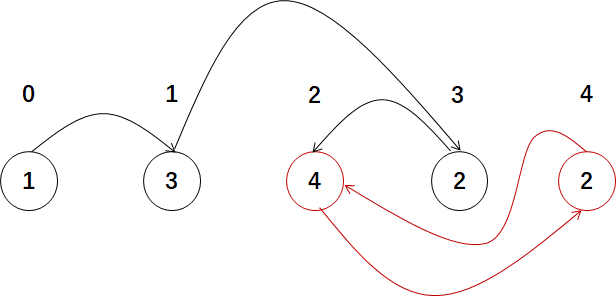

```python
class Solution:
    def findDuplicate(self, nums: List[int]) -> int:
        fast = slow = 0
        while True:
            fast = nums[nums[fast]]
            slow = nums[slow]
            if fast == slow:
                fast = 0
                while slow != fast: # 找到入口处
                    fast = nums[fast]
                    slow = nums[slow]
                return slow # 返回结果
```


#### 457. 环形数组是否存在循环

思路：Floyd判环法

```python
n = len(nums)
nxt = lambda i:(i+nums[i])%n

for i in range(n):
    if nums[i] == 0: continue
    slow = i
    fast = nxt(i)
    while nums[i]*nums[fast] > 0 and nums[nxt(fast)]*nums[i] > 0:
        if slow == fast:
            if slow == nxt(slow): break
            else: return True
        slow = nxt(slow)
        fast = nxt(nxt(fast))
	while nums[i] > 0:
        nxt_i = nxt(i)
        nums[i] = 0
        i = nxt_i
return False
```


## 题目：~ 5. 多数组&多链表&多指针

#### 88. 合并两个有序数组

>   设置三个指针，通过比较大小进行合并

```python
class Solution:
    def merge(self, nums1: List[int], m: int, nums2: List[int], n: int) -> None:
        """
        Do not return anything, modify nums1 in-place instead.
        """
        k = m + n - 1
        i = m - 1
        j = n - 1

        while i >= 0 and j >= 0:
            if nums1[i] > nums2[j]:
                nums1[k] = nums1[i]
                i -= 1
                k -= 1 
            else:
                nums1[k] = nums2[j]
                j -= 1
                k -= 1
        while j >= 0: 
            nums1[k] = nums2[j]
            k -= 1
            j -= 1
```

#### 328. 奇偶链表

>   **双指针**
>
>   利用一个变量 `count=1`, 遍历列表，分开奇链表和偶链表，然后再拼接。

```python
# Definition for singly-linked list.
# class ListNode:
#     def __init__(self, val=0, next=None):
#         self.val = val
#         self.next = next
class Solution:
    def oddEvenList(self, head: ListNode) -> ListNode:
        dummy = ListNode(-1)
        dummy.next = head
        p = head
        count = 1

        odd = ListNode(-1)
        even = ListNode(-1)

        p1 = odd
        p2 = even

        while p:
            if count & 1:
                p1.next = p
                p1 = p1.next
                p = p.next
                p1.next = None
            else:
                p2.next = p
                p2 = p2.next
                p = p.next
                p2.next = None
            count += 1

        p1.next = even.next
        return dummy.next
```

>   **双指针 + 原地操作**
>
>   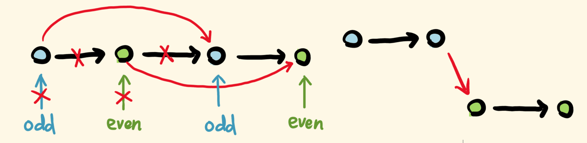

```python
# Definition for singly-linked list.
# class ListNode:
#     def __init__(self, val=0, next=None):
#         self.val = val
#         self.next = next
class Solution:
    def oddEvenList(self, head: ListNode) -> ListNode:
        if not head: return head

        dummy = ListNode(-1)
        dummy.next = head
        odd = head
        cur = even = head.next

        while even and even.next:
            odd.next = odd.next.next # 越过下一个
            even.next = even.next.next # 越过下一个
            odd = odd.next
            even = even.next
        odd.next = cur
        return dummy.next
```


#### 524. 通过删除字母匹配到字典里最长单词 🍉

>   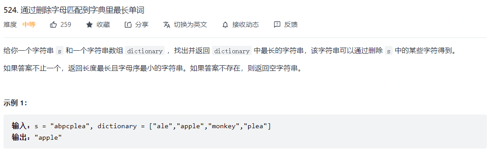
>
>   思路：这一题当然可以用`字典树+DFS`进行匹配，但是肯定超时。正确的解法是采用`排序+双指针`，两个指针分别指向两个字符，然后逐个比较。

```python
class Solution:
    def findLongestWord(self, s: str, dictionary: List[str]) -> str:
        dictionary.sort(key=lambda x:[-len(x),x])

        for word in dictionary:
            i,j = 0,0
            while i < len(word) and j < len(s):
                if word[i] == s[j]:
                    i += 1
                    j += 1
                else:
                    j += 1
            if i == len(word):
                return word
        return ""
```


#### 632. 最小区间 🍉

>   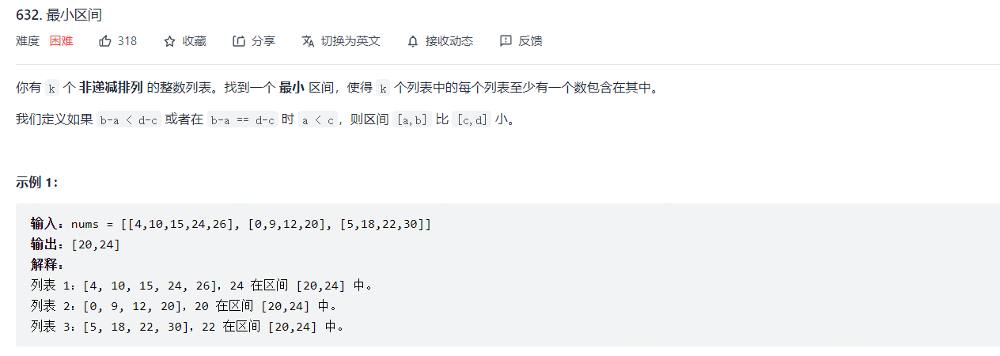
>
>   思路：这一题和`23. 合并K个升序链表`，都是多个数组采用多指针，然后利用优先队列，需要最小值、最大值以及区间的的最小值。

```python
class Solution:
    def smallestRange(self, nums: List[List[int]]) -> List[int]:
        # 当前区间的最小值，最小值对应的数组下标
        import heapq
        heap = []
        MIN = float("-inf")
        right = left = MIN

        for i in range(len(nums)):
            heapq.heappush(heap,[nums[i][0],i,0]) # 进入堆的元素为（第i个区间的第一个元素，区间的下标，元素的下标）
            right = max(nums[i][0],right)
        left = heap[0][0]
        ans = [left,right]
        inter = right-left
        
        while heap:
            cur = heapq.heappop(heap)
            left = cur[0]
            if right-left < inter:
                inter = right-left
                ans[0] = left
                ans[1] = right
            next_i = cur[2] + 1
            if next_i >= len(nums[cur[1]]): break
            next_num = nums[cur[1]][next_i]

            right = max(next_num,right)
            heapq.heappush(heap,[next_num,cur[1],next_i])
        return ans
```

  

#### 面试题 16.06. 最小差

>   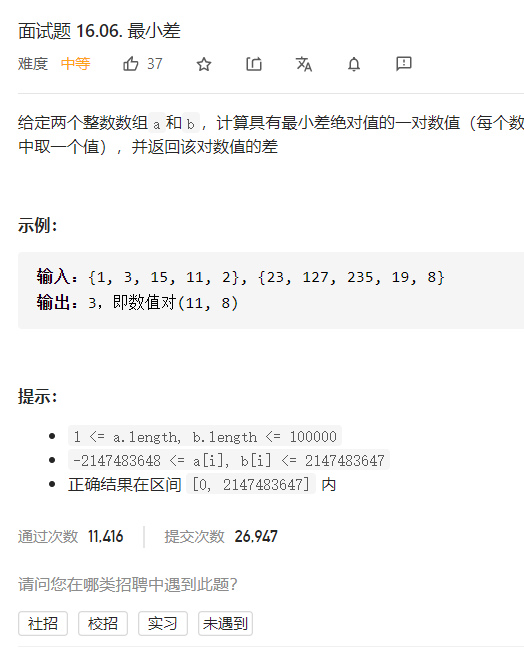
>
>   思路：将两个数组排序之后，利用双指针将两个数组中当前较小的元素加入比较队列，直到一个数组遍历完毕。

```python
class Solution:
    def smallestDifference(self, a: List[int], b: List[int]) -> int:
        i = j = 0
        a.sort()
        b.sort()

        ans = float("inf")

        while i < len(a) and j < len(b):
            val = abs(a[i]-b[j])
            ans = min(ans,val)
            if a[i] <= b[j]:
                i += 1
            else:
                j += 1
        return ans
```


#### 面试题 17.09 第k个数

>   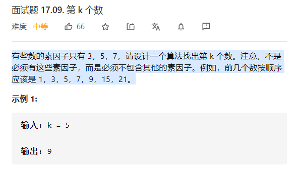
>
>   思路：优先队列（堆）

```python
class Solution:
    def getKthMagicNumber(self, k: int) -> int:
        H = []
        heapify(H)
        heappush(H,[1,0])
        nums = [3,5,7]
        n = len(nums)

        while True:
            cur,start = heappop(H)
            k -= 1
            if k == 0: return cur
            for i in range(start,3):
                heappush(H,[cur*nums[i],i]) # 保证数据按照1,3,5,7,9,15,21,...
```

>   思路：多指针，可以定义三个指针，本质上相当于用了三个优先队列，来存储已生成的丑数。但是因为已生成的丑数是递增的，所以就用普通的队列也就是数组+指针就行了。每次三个队首元素乘上对应因子比较一下，取最小的那个出队，并且三个队列都要入队新丑数。

```python
class Solution:
    def getKthMagicNumber(self, k: int) -> int:
        res = [1] * k
        idx3, idx5, idx7 = 0, 0, 0
        for i in range(1, k):
            res[i] = min(res[idx3]*3, res[idx5]*5, res[idx7]*7)
            if res[i] == res[idx3]*3: idx3 += 1
            if res[i] == res[idx5]*5: idx5 += 1
            if res[i] == res[idx7]*7: idx7 += 1
        return res[k-1]
```


## 题目 ~ 6  需要转换思路的双指针

#### 395. 至少有 K 个重复字符的最长子串 🍉🍉

>   **双指针法：**
>
>   `二段性：`也就是假设有长度 `t` 的一段区间满足要求的话，`t + 1` 长度的区间是否「一定满足」或者「一定不满足」呢？
>
>   需要注意：改题用简单的双指针并不可解，因为不存在`二段性`，也就是当：
>
>   +   当前的右指针向右边移动的时候，最长子串既有可能增加，也有可能减少，比如：`aabbb[c]a`
>   +   当前的左指针向右边移动的时候，最长子串既有可能增加，也有可能减少，比如：`a[a]bbbca`
>
>   这一题需要转化一下，考虑子串中字符的数量，这时候就存在`二段性`了，也就是：
>
>   +   当前的右指针向右边移动的时候，子串中的字符数量只会增加或者不变。
>   +   当前的左指针向右边移动的时候，子串中的字符数量只会减少或者不变。

```python
class Solution:
    def longestSubstring(self, s: str, k: int) -> int:
        ans = 0
        n = len(s)

        # p的含义是一个子串中所能包含的子串的个数
        # 遍历每一种（字符串数量）可能的字符串
        for p in range(1,26):
            cnt = [0]*26 # 初始化

            i = j = 0 # i和j表示的是子串字符个数为p的左右下标（包含）
            tot = 0   # 当前子串中字符的数量 
            sum = 0   # 当前子串中达标（数量大于k）字符的数量
            while i < n:
                u = ord(s[i]) - 97 # 右边界字符的下标
                cnt[u] += 1        # 当前字符数量加一

                if cnt[u] == 1: tot += 1 # 字符总数加一
                if cnt[u] == k: sum += 1 # 字符数量达标，加一

                while tot > p: # 字符数量不合法，缩小边界直到合法
                    t = ord(s[j]) - 97   # 左边界字符的下标
                    cnt[t] -= 1          # 当前字符数量减一
                    if cnt[t] == 0: tot -= 1 # 字符总数减一
                    if cnt[t] == k-1: sum -= 1 # 字符数量不达标，减一
                    j += 1

                if tot == sum: ans = max(ans,i-j+1)

                i += 1
        return ans
```

>   **分治法：**
>
>   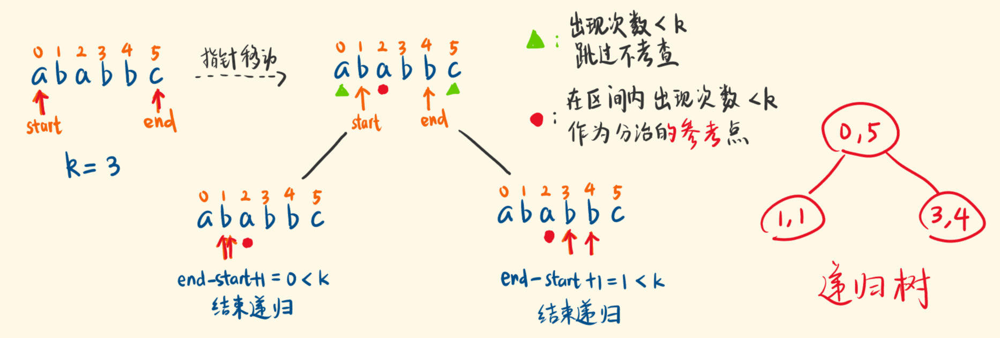
>
>   这一题可以用分治法实现：
>
>   +   如果当前字符串长度小于k，则直接返回0；
>   +   如果当前字符串长度大于k，判断字符串中所有字符的频数
>       +   如果频数大于等于k，则跳过
>       +   如果频数大于等于k，则以k作为分割符，将数据分割为多个子串【因为这些子串是不可能组成满足条件的子串】，然后递归计算最终的结果，并返回最大值。

```python
class Solution:
    def longestSubstring(self, s: str, k: int) -> int:
        def helper(s,k):
            if len(s) < k: return 0
            for key,val in collection.Counter(s).items():
                if val < k:
                    return max([helper(t,k) for t in s.split(val)])
            return len(s)
```


#### 633 平方数之和

>   思路：这题根本上是搜索的问题，目的是找到两个数a和b使得，两个数平方的和等于c。
>
>   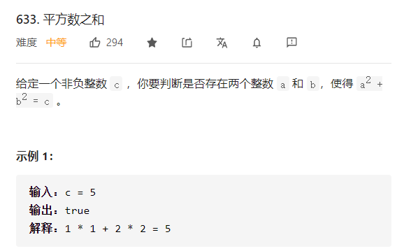


+   首先，确定搜索的范围，$a^2$和$b^2$的非负并且$a^2+b^2=c$，这也就意味着，$a$和$b$的范围在$[0,\sqrt{c}]$中。

+   其次，如何进行搜索。

    +   方法一，让a在$[0,\sqrt{c}]$中进行线性搜索，而对应的$b$应该为$\sqrt{c-a^2}$，如果$b$是整数，则表明搜索到了。

    +   方法二，左右指针搜索，为什么这里左右指针搜索不会错过正确答案，这实际上和二维矩阵搜索类似，从左到右是递增的，从上到下是递增的。

        

```python
class Solution:
    def judgeSquareSum(self, c: int) -> bool:
        left = 0
        right = int(sqrt(c))
        while left <= right:
            cur = left*left + right*right
            if cur == c: return True
            elif cur > c: right -= 1
            else: left += 1
        return False
```
