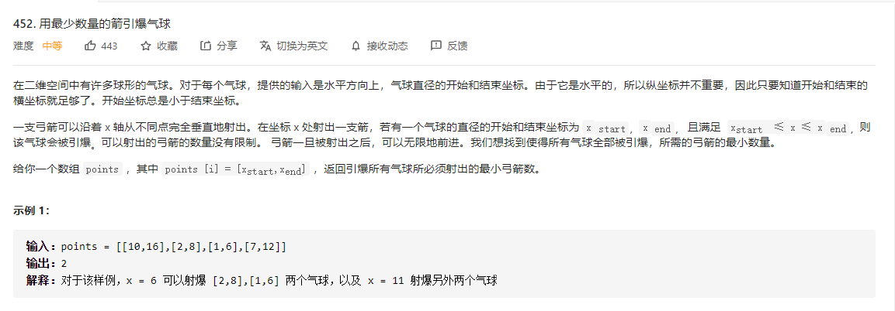
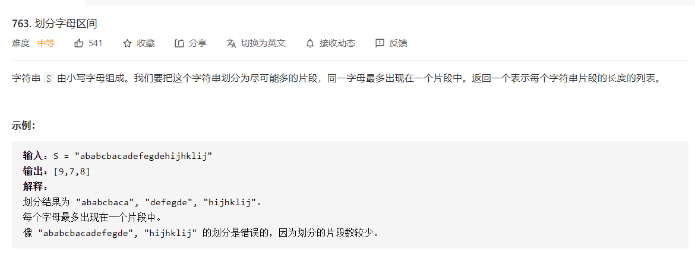
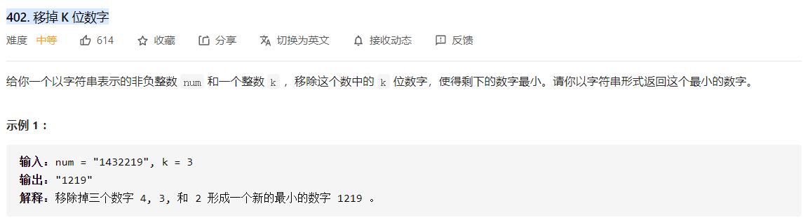

## 第一类：区间问题

#### 55 跳跃游戏

>   
>
>   维护两个变量，一个变量表示当跳`k`次能到达的最大范围，另外一个变量表示跳`k+1`次能达到的最大范围。
>
>   这是最核心的概念：
>
>   局部最优：就是在第k次尽可能地跳远。
>
>   全局最优：就是能跳到最远地位置。

```python
class Solution:
    def canJump(self, nums: List[int]) -> bool:
        cur_max = 0
        total_max = 0
        n = len(nums)
        for i in range(n):
            if cur_max < i:
                if total_max < i:
                    return False
                cur_max = total_max
            total_max = max(total_max,i+nums[i])
        return True
```


#### 45. 跳跃游戏 II

>   设定两个变量，一个是当前能够访问的最长区域，一个是下一跳能访问的最大区域。
>
>   


```python
class Solution:
    def jump(self, nums: List[int]) -> int:
        cur_max = 0
        total_max = 0
        n = len(nums)
        ans = 0
        for i in range(n):
            if cur_max < i:
                if total_max < i:
                    return -1
                ans += 1
                cur_max = total_max

            total_max = max(total_max,i+nums[i])
        return ans
```


#### 56.合并区间

>   

```python
class Solution:
    def merge(self, intervals: List[List[int]]) -> List[List[int]]:
        """
        排序后贪心
        """
        intervals.sort()
        n = len(intervals)
        left,right = intervals[0]
        ans = []
        for i in range(1,n):
            if intervals[i][0] > right:
                ans.append([left,right])
                left,right = intervals[i]
            else:
                right = max(right,intervals[i][1])
                left = min(left,intervals[i][0])
        ans.append([left,right])
        return ans

            
```


#### 435. 非重叠区间问题

>   
>
>   思路：
>
>   局部最优：优先选取右边界小的区间，从左到右遍历，如果两个区间有重叠部分，应该保留结尾小的，留给下一个区间的空间更大，尽量避免交叉；
>
>   全局最优：选取最多的非交叉区间。
>
>   贪心思想：如果已经发生交叉了，那肯定要删除一个区间，那删除哪个区间呢，那贪心的想法肯定保留结尾小的，这样留给下一个区间的空间更大。

```python
class Solution:
    def eraseOverlapIntervals(self, intervals: List[List[int]]) -> int:
       	"""
       	维护一个右边界的变量，按照贪心的思想维护当前的右边界
       	"""
        intervals.sort(key=lambda x:[x[1]])
        right = float("-inf")
        ans = 0
        for interval in intervals:
            if interval[0] >= right:
                right = interval[1]
            else:
                ans += 1
        return ans
```

#### 452 数量的箭射爆气球

>   
>
>   思路：
>
>   局部最优：当气球出现重叠时，一起射；
>
>   全局最优：把所有气球射爆所用弓箭最少。
>
>   贪心思想：按照右区间排序之后，有重叠的区域会集中到一起，这样利用一只箭就可以射爆所有区间内的气球。

```python
class Solution:
    def findMinArrowShots(self, points: List[List[int]]) -> int:
        """
        贪心思想，如果想要箭数最小，一个箭应该射掉尽可能多的气球
        """
        points.sort(key=lambda x:x[1])
        left,right = points[0]
        n = len(points)
        ans = 1
        for i in range(1,n):
            if points[i][0] > right:
                ans += 1
                left,right = points[i]
            else:
                left = points[i][0]
        return ans
```


#### 330. 按照要求补齐数组

>   
>
>   
>
>   局部最优：如果当前的右边界小于`nums[i]`，如果想要填充数字最少，应该选择`cur+1`进行填充，这样是满足条件能覆盖的最大范围。
>
>   全局最优：用最少的数字，填充到范围 `n` 。
>
>   贪心：如果想要填充数字最少，选择`cur+1`进行填充。

```python
class Solution:
    def minPatches(self, nums: List[int], n: int) -> int:
        """
        贪心思路
        当前能描述的范围是：[1,i]
        那么当前的贪心想法是，在原有的集合中加入(i+1)，可以得到范围：[1...,i,...,2*i+1]
        """
        m = len(nums)
        cur = 0
        ans = 0
        i = 0
        while cur < n:
            if (i == m) or (cur < nums[i]-1):
                ans += 1
                cur = 2*cur + 1
            else:
                cur = cur + nums[i]
                i += 1
        return ans
```


#### 252 会议室

>   

```python
class Solution:
    def canAttendMeetings(self, intervals: List[List[int]]) -> bool:
        intervals.sort(key=lambda x:x[1])
        n = len(intervals)
        if n == 0: return True
        right = intervals[0][1]
        for i in range(1,n):
            if intervals[i][0] < right:
                return False
            else:
                right = intervals[i][1]
        return True
```


#### 253 会议室 II

>   

+   优先队列做法

```python
class Solution:
    def minMeetingRooms(self, intervals: List[List[int]]) -> int:
        intervals.sort()
        rooms = []
        heapify(rooms)

        # 初始化，将第一个会议时间段加入
        heappush(rooms,intervals[0][1])
        for i in range(1,len(intervals)):
            if rooms[0] <= intervals[i][0]:
                # 如果堆中会议的最小结束时间是小于下一场会议的开始时间
                # 那么替换掉当前最小会议
                heapreplace(rooms,intervals[i][1])
            else:
                # 如果堆中会议的最小结束时间是大于下一场会议的开始时间
                # 那么新增会议室
                heappush(rooms,intervals[i][1])
        return len(rooms)
```

+   线性扫描做法，需要定义**事件**的概念

```python
class Solution:
    def minMeetingRooms(self, intervals) :
        # 总共的会议数量 - 不重叠的会议数量 + 1(只要不重叠，就可以只用一间会议室)
        count = 0
        ans = 0

        # 设定开会和闭会事件
        n = len(intervals)
        events = []
        for i in range(n):
            events.append([intervals[i][0],1])
            events.append([intervals[i][1],-1])
        events.sort()

        for event in events:
            if event[1] == 1:
                # 开会了
                count += 1
            else:
                # 闭幕了
                count -= 1
            ans = max(ans,count)

        return ans
```

#### 986. 区间列表的交集 🍉

>   
>   可以先进行排序，然后按照左边界排序后更新左右边界，得到最终的结果。
>
>   也可以在$O(N)$的时间复杂度内进行求解

```python
class Solution:
    def intervalIntersection(self, A: List[List[int]], B: List[List[int]]) -> List[List[int]]:
        ans = []
        i = j = 0

        while i < len(A) and j < len(B):
            # Let's check if A[i] intersects B[j].
            # lo - the startpoint of the intersection
            # hi - the endpoint of the intersection
            lo = max(A[i][0], B[j][0])
            hi = min(A[i][1], B[j][1])
            if lo <= hi:
                ans.append([lo, hi])

            # Remove the interval with the smallest endpoint
            if A[i][1] < B[j][1]:
                i += 1
            else:
                j += 1

        return ans
```


#### 406.根据身高重建队列

>   

```python
class Solution:
    def reconstructQueue(self, people: List[List[int]]) -> List[List[int]]:
        people.sort(key=lambda x:[-x[0],x[1]])
        ans = []
        n = len(people)

        for i in range(n):
            if people[i][1] == len(ans):
                ans.append(people[i])
            else:
                ans.insert(people[i][1],people[i])
        return ans
```


## 第二类 模拟类问题

#### 135 分发糖果

>   **贪心法：**
>
>   从左到右，第一次遍历是局部最优；
>
>   从右到左，第二次遍历也是局部最优；
>
>   两次取最大值，得到的就是全局最优。
>
>   

```python
class Solution:
    def candy(self, ratings: List[int]) -> int:
        """
        贪心思路，每次值考虑一部分，先考虑从左到右，然后考虑从右到左
        """
        n = len(ratings)
        ans = [1] * n

        left = 1
        for i in range(1,n):
            if ratings[i] > ratings[i-1]:
                ans[i] = left + 1
                left += 1
            else:
                left = 1
        
        right = 1
        for i in range(n-2,-1,-1):
            if ratings[i] > ratings[i+1]:
                ans[i] = max(ans[i],right+1)
                right += 1
            else:
                right = 1
        
        return sum(ans)
```


#### 455 分发饼干

>   

+   排序后 + 贪心选择

```python
class Solution:
    def findContentChildren(self, g: List[int], s: List[int]) -> int:
        g.sort()
        s.sort()
        i = j = 0
        m = len(g)
        n = len(s)
        while i < m and j < n:
            if g[i] <= s[j]:
                i += 1
            j += 1
        return i
```

+   或者优化一下，利用二分法加速

    ```python
    class Solution:
        def findContentChildren(self, g: List[int], s: List[int]) -> int:
            g.sort()
            s.sort()
            i = j = 0
            m = len(g)
            n = len(s)
    
            while i < m and j < n:
                idx = bisect.bisect_left(s,g[i],j,n)
                if idx >= n: break
                else:
                    i += 1
                    j = idx + 1
            return i
    ```

    


#### 605. 种花问题

>   

+   贪心（能种花就种花）+ 哨兵

```python
class Solution:
    def canPlaceFlowers(self, flowerbed: List[int], n: int) -> bool:
        flowerbed = [0] + flowerbed + [0]
        k = len(flowerbed)
        ans = 0
        for i in range(1,k-1):
            if flowerbed[i-1] == 0 and flowerbed[i] == 0 and flowerbed[i+1] == 0:
                flowerbed[i] = 1
                ans += 1
        return ans >= n
```


#### 621. 任务调度器

>   

```python
class Solution:
    def leastInterval(self, tasks: List[str], n: int) -> int:
        """
        贪心做法
        维护两个变量：
            一个表示有空闲的下限（间隔n个元素），ans
            一个表示没有空闲的上限（所有元素的和），cur
        最后比较ans和cur的大小关系
        """
        counter = collections.Counter(tasks)
        k = counter.most_common(1)[0][1]
        
        ans = (k-1)*(n+1)
        cur = 0
        for key,value in counter.items():
            cur += value
            if value == k:
                ans += 1
        return cur if cur >= ans else ans
```

#### 665. 非递减数列

>   
>
>   列出所有情况，然后遍历即可。

```python
class Solution:
    def checkPossibility(self, nums: List[int]) -> bool:
        """
        一共四种情况：
        高1 --> 低 --> 高2
        高2 --> 低 --> 高1
        低1 --> 高 --> 低2
        低2 --> 高 --> 低1
        """
        n = len(nums)
        cnt = 0
        for i in range(1,n-1):
            if cnt > 1: return False
            if nums[i+1] >= nums[i-1]:
                if nums[i-1] <= nums[i] <= nums[i+1]:
                    continue
                nums[i] = nums[i+1]
                cnt += 1
            elif nums[i+1] < nums[i-1]:
                if nums[i-1] > nums[i] > nums[i+1]:
                    return False
                elif nums[i] <= nums[i+1]:
                    nums[i-1] = nums[i]
                    cnt += 1
                elif nums[i] >= nums[i-1]:
                    nums[i+1] = nums[i]
                    cnt += 1
        return cnt <= 1


```

#### 735.行星碰撞 🍉

>   
>
>   这一题实际上也是模拟题，最重要是意思到最后结果的单调性，也就是：
>
>   +   全部向左
>   +   全部向右
>   +   左边向左，右边向右

```python
class Solution:
    def asteroidCollision(self, asteroids: List[int]) -> List[int]:
        stack = []
        n = len(asteroids)
        ans = []
        for i in range(n):
            if asteroids[i] > 0:
                stack.append(asteroids[i])
            else:
                if not stack:
                    ans.append(asteroids[i])
                else:
                    while stack and stack[-1] + asteroids[i] < 0:
                        stack.pop()
                    if not stack:
                        ans.append(asteroids[i])
                    else:
                        if stack[-1] + asteroids[i] == 0:
                            stack.pop()
                        else:
                            pass   
        if stack and ans:
            if stack[0] > 0: return ans + stack
            elif stack[0] < 0:return stack + ans
        else:
            return stack + ans
```


#### 738. 单调递增的数字

>   

```python
### 利用字符串
class Solution:
    def monotoneIncreasingDigits(self, n: int) -> int:
        """
        贪心
        """
        s = list(str(n)[::-1])
        size = len(s)
        
        for i in range(1,size):           
            if s[i] > s[i-1]:
                s[i] = str(int(s[i])-1)
                s[:i] = ["9"]*i
        return int("".join(s[::-1]))
    
### 或者利用数学运算
class Solution:
    def monotoneIncreasingDigits(self, n: int) -> int:
        """
        贪心
        """
        ans = 0
        prod = 10
        while prod <= n:
            left = n % (prod*10) // (prod//10)
            cur = left // 10
            prev = left % 10
            if cur > prev:
                n = (n//(prod*10))*(prod*10) + cur*prod - 1
            prod *= 10
        return n
```


#### 763. 划分字母区间

>   
>
>   思路：
>
>   局部最优：找到满足条件的最短子字符串。
>
>   全局最优：划分成尽可能多的片段。
>
>   贪心：满足条件的最段子字符串。

```python
class Solution:
    def partitionLabels(self, s: str) -> List[int]:
        counter = collections.Counter(s)
        his_set = set()
        n = len(s)

        ans = []
        left = 0
        for i in range(n):
            if counter[s[i]] == 1:
                counter[s[i]] -= 1
                his_set.discard(s[i])
                if len(his_set) == 0:
                    ans.append(i-left+1)
                    left = i + 1
            else:
                counter[s[i]] -= 1
                his_set.add(s[i])
        return ans
```


#### 781 森林中的兔子

>   
>
>   思路：贪心算法
>
>   对兔子的`answer`进行排序，颜色相同的兔子回答的`answer[i]`肯定相同，只需要计算出真实的兔子数量和回答兔子的数量之差即可，用`total`变量累加记录。最后的结果就是`total+len(answer)`

```python
class Solution:
    def numRabbits(self, answers: List[int]) -> int:
        total = 0
        answers.sort()
        n = len(answers)

        i = 0
        while i < n:
            j = i
            while j < n  and j-i <= answers[i] \
                    and answers[i] == answers[j]:
                j += 1
            # answers[i]+1 表示所有可能的兔子，(j-i) 表示已经出现的兔子
            total += (answers[i]+1)-(j-i)
            i = j
        return total + len(answers)
```


#### 860 柠檬水找零 🍉

>   
>
>   正常贪心法做，当需要找钱的时候，从币值大的开始，类似于装满瓶子，先放石头，再放沙子，最后放水。

```python
class Solution:
    def lemonadeChange(self, bills: List[int]) -> bool:
        counter = collections.defaultdict(int)
        n = len(bills)
        
        for i in range(n):
            val = bills[i]-5
            if val != 0:
                for money in [20,15,10,5]:
                    if money <= val:
                        freq = min(val // money,counter[money])
                        val = val - money*freq
                        counter[money] -= freq
                    if val == 0: break
                if val > 0: return False
            counter[bills[i]] += 1
        return True


```


#### 502 IPO

>   

```python
class Solution:
    def findMaximizedCapital(self, k: int, w: int, profits: List[int], capital: List[int]) -> int:
        """
        贪心做法 + 堆
        """
        n = len(profits)
        project = [[capital[i],i] for i in range(n)]
        project.sort(key=lambda x:x[0]) # 按照启动资本排序

        H = []
        heapify(H)

        i = 0
        while k > 0: # 进行k个项目
            if i < n and w >= project[i][0]:
                # 将当前可以进行的项目全部加入到堆中
                idx = project[i][1]
                heappush(H,[-profits[idx],idx])
                i += 1
            else:
                # 从堆中选出收益最大的项目进行，n
                if not H: break
                cur_profit,idx = heappop(H)
                cur_profit = -cur_profit # 收益
                w += cur_profit
                k -= 1
            
        return w
```


#### 861. 翻转矩阵后的得分

>   
>
>   全局贪心：所有数的和最大
>
>   局部贪心：每个数最大
>
>   贪心策略，将高位首先设置为1，然后比较每列的1和0的数量。

```python
class Solution:
    def matrixScore(self, grid: List[List[int]]) -> int:
        m,n = len(grid),len(grid[0])
        
        # 如果第一列的元素为0，则对该行进行翻转
        for i in range(m):
            if grid[i][0] == 0:
                for j in range(n):
                    grid[i][j] = 1 - grid[i][j]   

        for j in range(n):
            # 计算每一列的和
            col = 0
            for i in range(m): col += grid[i][j]
            if col < ((m-1)//2+1): # 向上取整
                # 翻转
                for i in range(m):
                    grid[i][j] = 1 - grid[i][j]        
       
        def convert(row,n):
            ans = 0
            for i in range(n):
                ans += row[i] << (n-i-1)
            return ans

        return sum([convert(grid[i],n) for i in range(m)])

```


## 第三类 字典序问题

#### 316 去除重复字母 🍉

>   

```python
class Solution:
    def removeDuplicateLetters(self, s: str) -> str:
        """
        字典序 + 哈希表 + 单调栈
        去除重复字母，并保证字典序最小。

        去重怎么解决：利用哈希表来解决。
        怎么保证字典序最小：利用单调递增栈来解决。
        
        因为后面是否还有当前字符对于最终答案的计算十分重要，所以这一题
        的基本思路是：
        1. 首先计算出每个字符的出现频率
        2. 然后遍历字符串：
            如果字符已经在目标串中，则略过当前字符。
            如果字符不再目标串，则进行单调栈处理，保证字典序。
        """
        counter = collections.Counter(s)
        his_set = set()
        n = len(s)
        ans = []
        for i in range(n):
            if s[i] not in his_set:
                while ans and ans[-1] > s[i] and counter[ans[-1]] > 0:
                    his_set.discard(ans.pop())
                his_set.add(s[i])
                ans.append(s[i])
            counter[s[i]] -= 1
        return "".join(ans)
```

#### 402 移掉 K 位数字

>   

```python
class Solution:
    def removeKdigits(self, num: str, k: int) -> str:
        """
        维护单调递增栈
        """
        n = len(num)
        stack = []
        for i in range(n):
            if k == 0: 
                stack += num[i:]
                break

            while stack and k > 0 and stack[-1] > num[i]:
                stack.pop()
                k -= 1
            stack.append(num[i])
        
        ans = "".join(stack).lstrip("0")
        if k > 0: ans = ans[:-k]
        return "0" if not ans else ans
```

#### 321. 拼接最大数 🍉

>   

````python
class Solution:
    def maxNumber(self, nums1: List[int], nums2: List[int], k: int) -> List[int]:
        def getNums(size,nums):
            """ size表示选取的数字的数量，维护单调递减栈 """
            n = len(nums)
            if size >= n: return "".join([str(val) for val in nums])
            dlt = n - size
            stack = []
            for i in range(n):
                if dlt <= 0: 
                    stack += nums[i:]
                    break
                while stack and dlt > 0 and stack[-1] < nums[i]:
                    dlt -= 1
                    stack.pop()
                stack.append(nums[i])
            ans = "".join([str(val) for val in stack]).lstrip("0")
            if dlt > 0: ans = ans[:-dlt]
            return ans

        def merge(nums1,nums2):
            m = len(nums1)
            n = len(nums2)
            i = j = 0
            ans = []
            while i < m and j < n:
                if nums1[i] > nums2[j]:
                    ans.append(nums1[i])
                    i += 1
                elif nums1[i] == nums2[j]:
                    if nums1[i+1:] >= nums2[j+1:]:
                        ans.append(nums1[i])
                        i += 1
                    else:
                        ans.append(nums2[j])
                        j += 1
                else:
                    ans.append(nums2[j])
                    j += 1
            if i == m:
                ans += list(nums2[j:])
            if j == n:
                ans += list(nums1[i:])
            
            return int("".join(ans))
        ans = max([merge(getNums(i,nums1),getNums(k-i,nums2)) for i in range(k+1)])
        return [int(val) for val in str(ans)]
````


## 第四类 序列问题

#### 376 摆动序列 🍉

>   
>
>   

```python
class Solution:
    def wiggleMaxLength(self, nums: List[int]) -> int:
        n = len(nums)
        dp = [[1,1] for i in range(n)]
        for i in range(1,n):
            if nums[i] > nums[i-1]:
                dp[i][1] = dp[i-1][0] + 1
                dp[i][0] = dp[i-1][0]
            elif nums[i] < nums[i-1]:
                dp[i][0] = dp[i-1][1] + 1
                dp[i][1] = dp[i-1][1]
            else:
                dp[i][0] = dp[i-1][0]
                dp[i][1] = dp[i-1][1]
        return max(dp[-1])
```

#### 392 判断子序列

>   

```python
class Solution:
    def isSubsequence(self, s: str, t: str) -> bool:
        i = j = 0
        m = len(s)
        n = len(t)
        while i < m and j < n:
            if s[i] == t[j]:
                i += 1
                j += 1
            else:
                j += 1
        return i == m
```

拓展问题: 可以预先对`t`进行处理, 记录下下一个字符(26个)的位置, 如果不再出现就设为`-1`.

## 总结

按照如下顺序刷力扣上的题目，相信会帮你在学习贪心算法的路上少走很多弯路 [🔗](https://leetcode-cn.com/problems/assign-cookies/solution/dai-ma-sui-xiang-lu-dai-ni-xue-tou-tan-x-6jsc/)
