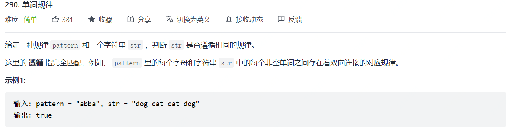

#### 290. 单词规律

>   
>
>   利用两个哈希表建立双向的哈希关系，这样避免在一些例子中出错。

```python
class Solution:
    def wordPattern(self, pattern: str, s: str) -> bool:
        words = s.split()
        if len(pattern) != len(words): return False
        n = len(pattern)
        word_dict = dict()
        pattern_dict = dict()
        for i in range(n):
            if words[i] in word_dict or pattern[i] in pattern_dict:
                if words[i] in word_dict and pattern[i] != word_dict[words[i]]:
                    return False
                if pattern[i] in pattern_dict and words[i] != pattern_dict[pattern[i]]:
                    return False
            else:
                pattern_dict[pattern[i]] = words[i]
                word_dict[words[i]] = pattern[i]
        return True
```

