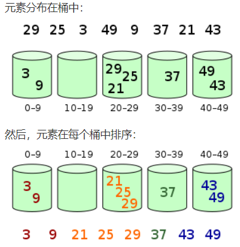

注：

+   插入排序：这里的插入排序应该是从后到前一个一个比较，而不是采用二分法查找，所以时间复杂度为 $O(n^2)$
+   稳定性：排序后两个相等键值的顺序和排序之前他们的顺序相同。
+   选择排序：就是在无序区中找一个最小的元素跟在有序区后面，找到最小元素时间复杂度为 $O(n)$，遍历n个元素时间夫再度为 $O(n)$，所以整体复杂度为 $O(n^2)$。
+   希尔排序：


```python
def shellSort(arr):
    size = len(arr)
    gap = size // 2
    while gap >= 1:
        # 基于插入排序
        for i in range(gap,size):
            temp = arr[i]
            j = i-gap
            while j >= 0 and arr[j] > temp:
                arr[j+gap]=arr[j]
                j-=gap
            arr[j+gap] = temp
        gap = gap // 2
    return arr
```

+   计数排序

    

+   桶排序

    桶排序是计数排序的升级版，它利用了函数的映射关系，高效与否的关键就在于这个映射函数的确定。

    

+   基数排序，先按照个位排序，得到一个新数组；再按照十位排序，得到一个新数组；最后按照百位排序，得到有序数组。

