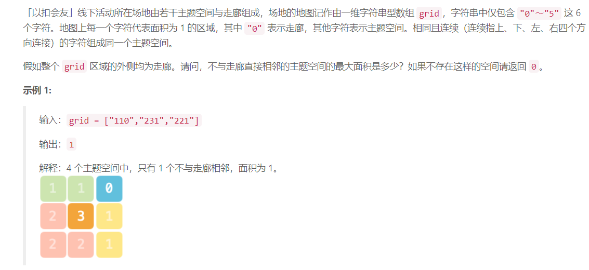
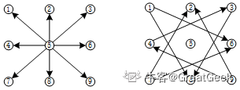

$$
\textbf{DFS 深度优先遍历}
$$

#### 934 最短的桥

思路：先用`dfs`进行洪水填充，只填充一个区域，并将越界的点作为搜索的起点，然后利用`bfs`搜索最短路径。

#### 1000081. 主题空间 [🔗](https://leetcode-cn.com/contest/lc-vscode/problems/YesdPw/)



```python
class Solution:
    def largestArea(self, grid: List[str]) -> int:
        m = len(grid)
        n = len(grid[0])
        self.count = 0
        self.ans = 0
        visited = [[False]*n for i in range(m)]
        directions = [[1,0],[-1,0],[0,1],[0,-1]]
        
        def helper(i,j,marker):
            for direction in directions:
                x = i + direction[0]
                y = j + direction[1]
                if x >= 0 and x < m and y >= 0 and y < n:
                    if marker == "0" and not visited[x][y]:
                        visited[x][y] = True
                        helper(x,y,grid[x][y])
                    if marker == grid[x][                                                                                                                                                                                                                     y] and not visited[x][y]:
                        self.count += 1
                        visited[x][y] = True
                        helper(x,y,marker)
                        
        
        for i in range(m):
            for j in [0,n-1]:
                visited[i][j] = True
                helper(i,j,grid[i][j])
                
        for j in range(n):
            for i in [0,m-1]:
                visited[i][j] = True
                helper(i,j,grid[i][j])
            
        for i in range(1,m-1):
            for j in range(1,n-1):
                if not visited[i][j] and grid[i][j] == "0":
                    visited[i][j] = True
                    helper(i,j,grid[i][j])
                    
        for i in range(1,m-1):
            for j in range(1,n-1):
                if not visited[i][j] and grid[i][j] != "0":                    
                    self.count = 1
                    visited[i][j] = True
                    helper(i,j,grid[i][j])
                    self.ans = max(self.ans,self.count)
#                     print(i,j,self.ans)
        return self.ans
```


#### 1723. 完成所有工作的最短时间

思路：这一题直观的做法就是DFS搜索，但是需要剪枝。

```python
class Solution:
    def minimumTimeRequired(self, jobs: List[int], k: int) -> int:
        self.ans = float("inf")
        self.K = k
        self.n = len(jobs)

        def helper(u,used,sum,max_val):
            if max_val >= self.ans: return
            if u == self.n:
                self.ans = max_val
                return
            if used < self.K:
                sum[used] += jobs[u]
                helper(u+1,used+1,sum,max(sum[used],max_val))
                sum[used] = 0

            for i in range(used):
                sum[i] += jobs[u]
                helper(u+1,used,sum,max(sum[i],max_val))
                sum[i] -= jobs[u]
               
        sum = [0]*self.K
        helper(0,0,sum,0)

        return self.ans
```

#### VIVO-收集屏幕解锁模式

```python
现有一个 3x3 规格的 Android 智能手机锁屏程序和两个正整数 m 和 n ，请计算出使用最少m 个键和最多 n个键可以解锁该屏幕的所有有效模式总数。
其中有效模式是指：
1、每个模式必须连接至少m个键和最多n个键；
2、所有的键都必须是不同的；
3、如果在模式中连接两个连续键的行通过任何其他键，则其他键必须在模式中选择，不允许跳过非选择键（如图）；
4、顺序相关，单键有效（这里可能跟部分手机不同）。

输入：m,n
代表允许解锁的最少m个键和最多n个键
输出：
满足m和n个键数的所有有效模式的总数

```



>   思路：所有能走的方向包括上下左右，八个方向，还有斜下之类的八个方向，如上图所示。
>
>   如果一个点已经访问过了，那么直接将当前方向乘上两倍，查看是否能够越过当前点。

```python
# Python3 dfs
# 所有方向
all_directions = [(1,0), (-1, 0), (0,1),  (0,-1), 
      (1,1), (-1,-1), (1,-1), (-1,1), 
      (1,2), (1, -2), (-1,2), (-1,-2), 
      (2,1), (2, -1), (-2,1), (-2,-1)]
# 可跨一个点的方向
single_directions = [(1,0), (-1,0), (0,1), (0,-1), (1,1), (-1,-1), (1,-1), (-1,1)]
SIZE = 3
check = lambda nx,ny: (nx >= 0 and nx < SIZE and ny >= 0 and ny < SIZE)

def dfs(x, y, visited, count):
    ans = 0
    count -= 1
    if count == 0:
        ans += 1
    else:
        for d in all_directions:
            nx = x+d[0]
            ny = y+d[1]
            if check(nx,ny):
                if visited[nx][ny]:
                    if d in single_directions:
                        nx = x + d[0] * 2
                        ny = y + d[1] * 2
                        if check(nx, ny) and not visited[nx][ny]:
                            visited[nx][ny] = True
                            ans += dfs(nx, ny, visited, count)                       
                            visited[nx][ny] = False
                else:
                    visited[nx][ny] = True
                    ans += dfs(nx, ny, visited, count)
                    visited[nx][ny] = False
    return ans
 
ans = [0] * 10
for count in range(1, 10):
    visited = [[False]*SIZE for _ in range(SIZE)]
    # 从九个点分别开始
    for i in range(3):
        for j in range(3):
            visited[i][j] = True
            ans[count] += dfs(i, j, visited, count)
            visited[i][j] = False

print(ans)
# [0, 9, 56, 320, 1624, 7152, 26016, 72912, 140704, 140704]
```


#### TODO

(BFS 的使用场景总结：层序遍历、最短路径问题)

https://leetcode-cn.com/problems/binary-tree-level-order-traversal/solution/bfs-de-shi-yong-chang-jing-zong-jie-ceng-xu-bian-l/
$$
\textbf{BFS 广度优先遍历}
$$

