[TOC]


## 1. 位运算相关  [🔗](https://oi-wiki.org/math/bit/)

#### 位运算技巧

+ n&(n-1)的作用

`n&(n-1)`的作用在于去除n的二进制串中最后一个1。

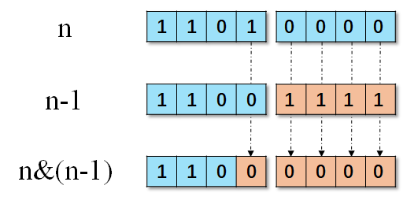

+   n&1的作用

`n&1`的作用在于找到判断最后一位是否为0。

+   判断一个数是不是2的非负整数次幂

```python
judge = lambda n: n>0 and n&(n-1)==0
```

+   获取二进制的某一位，下标从0开始

```python
get_bit = lambda a,b: (a >> b) & 1
```

+   操作二进制的某一位，下标从0开始

```python
set_bit_0 = lambda a,b: a & ~(1<<b) # 将低第b位设置为0
set_bit_1 = lambda a,b: a | (1<<b) # 将低第b位设置为1
set_bit_2 = lambda a,b: a ^ (1<<b) # 将低第b位取反
```

+   取出最右边的1，所代表的数

    ```python
    get_lower_bit = lambda data:data&(-data)
    # 比如 n=0b100[10]
    # 得到 n&(-n)=0b10
    ```

+   原码、反码和补码 [🔗](https://zhuanlan.zhihu.com/p/99082236)

    原码：最高位表示符号位，其他位存放该数二进制的绝对值。会出现$+0$和$-0$ 的情况，无法直接加减运算。
    
    反码：正数的反码等于原码；负数，符号位不变，其余位求反。会出现$+0(0000)$和$-0(1000)$ 的情况，无法直接加减运算。
    
    补码：正数的补码等于原码；负数，补码等于反码 $+1$。
    
    python的`bin`函数的负数输出：`-` + `原码`
    
    python中获取负数32位补码的方式：`b = a&0xffffffff`
    
    python从32补码获取原数的方式：`a=~(b^0xffffffff)`
    
    python在32位补码的负数的无符号表示均大于：$a>0x7fffffff$，因为负数补码符号位均为 $1$ 。


#### 异或运算性质

+   $x\oplus x = 0$
+   $x\oplus y = y \oplus x$
+   $(x\oplus y)\oplus z=x\oplus (y\oplus z)$
+   $x\oplus y \oplus y = x$
+   $(x\& y)\oplus (x\& z) = x \&(y\oplus z)$
+   $(x+a)\oplus(y+b)=x\oplus y+x\oplus b + y \oplus a + a \oplus b$
+   $4i\oplus (4i+1) \oplus (4i+2) \oplus (4i+3)=0$


#### 快速幂计算

```python
def fast(x,n):
    ans = 1
    while n > 0:
        if n&1 == 1: ans *= x
        x *= x
        n >>= 1
    return ans 
```


####  面试题 01.01. 判定字符是否唯一

```python
# 前提一定是所有的字符是小写字母，否者的话用集合判重
class Solution:
    def isUnique(self, astr: str) -> bool:
        mask = 0

        for c in astr:
            move_bits = ord(c) - ord('a')
            if (mask & (1 << move_bits)) != 0:
                return False
            else:
                mask = mask | (1 << move_bits)
        return True
```

#### 面试题 16.01. 交换数字 

思路：这一题利用的是`异或`的一个性质：`A^B^A=B`。

```python
假设存在两个数字：A B,通过异或可以实现不用中间变量完成元素的交换。
0             1
A             B
A^B           B
A^B           B^A^B=A
A^B^A         A
B             A

def swap(A,B):
    A ^= B
    B ^= A
    A ^= B
    return A,B
```


#### 剑指 Offer 56 - I 数组中数字出现的次数 I

>   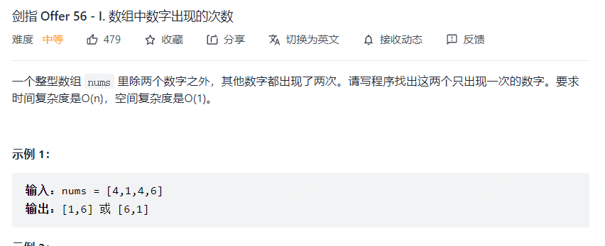
>
>   思路：将所有数据进行异或之后；取出最低位的1所代表的数；然后遍历数组，和刚才的数进行&运算，分别得到两种情况下的结果。

```python
class Solution {
    public int[] singleNumbers(int[] nums) {
        int xor_res = 0;
        for(int num:nums) {
            xor_res ^= num;
        }
        int diff = xor_res&(-xor_res);
        int x=0,y=0;
        for(int num:nums) {
            if((num&diff) == 0) {
                x^=num;
            } else{
                y^=num;
            }
        }
        return new int[]{x,y};
    }
}
```


#### 剑指 Offer 56 - II. 数组中数字出现的次数 II

>   
>
>   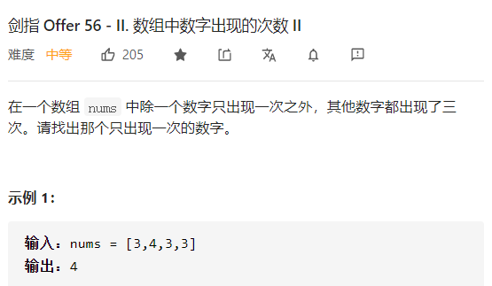

思路：真值表

|  n   | two  | one  | two  | one  |
| :--: | :--: | :--: | :--: | :--: |
|  0   |  0   |  0   |  0   |  0   |
|  0   |  0   |  1   |  0   |  1   |
|  0   |  1   |  0   |  1   |  0   |
|  1   |  0   |  0   |  0   |  1   |
|  1   |  0   |  1   |  1   |  0   |
|  1   |  1   |  0   |  0   |  0   |

得到规律：

```markdown
if two == 0:
    if n == 0:
        one = one
    elif n == 1:
        one = ~one
elif two == 1:
    one = 0

# -->
if two == 0:
    one = one^n
else:
    one = 0

# -->    
one= one ^ n & ~two

# 同理，基于新one，得到two
two = two ^ n & ~one
```

```python
class Solution:
    def singleNumber(self, nums: List[int]) -> int:
        one,two = 0,0
        for n in nums:
            one = one^n&~two
            two = two^n&~one
        return one
    
# or
class Solution:
    def singleNumber(self, nums: List[int]) -> int:
        get_digit = lambda n,i: (n>>(i-1))&1
        digits = [0]*32

        for num in nums:
            for i in range(32):
                digits[31-i] += get_digit(num,i+1)
        
        for i in range(32):
            digits[i]  = str(digits[i] % 3) 
        
        return int("".join(digits),2)
```


#### 剑指 Offer 65. 不用加减乘除做加法 🍉

>   思路：转换成二进制加法，真值表：
>
>   

```python
"""
n = a^b;
carry = (a&b) << 1;
"""
class Soultion {
    public int add(int a,int b) {
        if (b == 0) {
            return a;
        }
        return add(a^b,(a&b)<<1);
    }
}
```

对于Python需要特殊考虑：

```python
class Solution: 
    def add(self, a: int, b: int) -> int:
        a = a&0xffffffff # 截断成32位数字，看出正数
        b = b&0xffffffff

        def helper(a,b):
            if b == 0:
                return a if a <= 0x7fffffff else ~(a^0xffffffff) # 如果为负数，则要还原，将32位以上的位取反，1到32位不变
            return helper(a^b,(a&b)<<1&0xffffffff)
        
        return helper(a,b)
```


#### 7. 整数反转

思路：和下面190题思路类似，只不过这里需要检查范围

```python
class Solution:
    def reverse(self, x: int) -> int:
        MAX_VAL = 2**31 - 1
        MIN_VAL = -2**31
        def check(ans):
            if ans > MAX_VAL or ans < MIN_VAL: return True
            return False

        sign = 1 if x >= 0 else -1
        x = abs(x)

        ans = 0
        while x > 0:
            digit = x % 10
            ans = ans * 10 + digit
            x = x // 10
            if check(sign*ans): return 0
        return sign*ans
```


#### 8. 字符串转换整数 (atoi)

>   输入："  123 4awwq"
>
>   状态转移图：
>
>   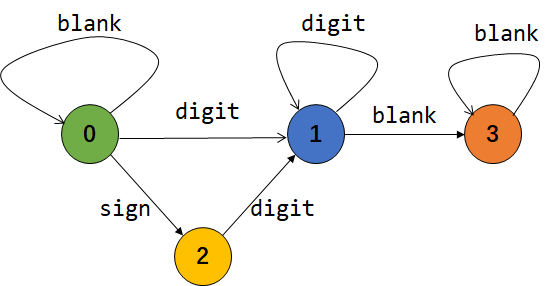

```python
class Solution:
    def myAtoi(self, s: str) -> int:
        MAX_VAL = 2**31 - 1
        MIN_VAL = -2**31

        def check(ans):
            return ans > MAX_VAL or ans < MIN_VAL

        transfer = {
            0:{"blank":0,"sign":2,"digit":1},
            1:{"digit":1,"blank":3},
            2:{"digit":1},
            3:{"blank":3}
        }
        sign_map = {"+":1,"-":-1}

        start = 0
        ans = 0
        sign = 1

        for c in s:
            if c.isdigit(): action = "digit"
            elif c in "+-": action = "sign"
            elif c == " ": action = "blank"
            else: break

            start = transfer[start].get(action,None)
            if start is None: break
            else:
                # 将运算放在这里的原因是：对于"  123 4awwq"
                # 当状态在3时候，此时输入空格还是正常的；
                # 但如果再遇到数字，这时候是不合法的，如果将运算放在上面取得action的时候，得到的结果
                # 是存在问题的
                if action == "digit":
                    ans = ans*10 + int(c)
                    if check(sign*ans):
                        return MAX_VAL if sign == 1 else MIN_VAL
                elif action == "sign":
                    sign = sign_map[c]
            
        return sign*ans
```


#### 9. 回文数

>   思路：除了采用字符串的方式，我们还可以通过反向计算出回文数据，然后判断构造出来的数据与原始数据是否相等的方式来判断。

```java
class Solution {
    public boolean isPalindrome(int x) {
        if(x < 0) return false;
        int data = x;
        int ans = 0;
        while (data > 0) {
            ans = ans*10 + data%10;
            data /= 10;
        }
        return ans == x;
    }
}
```

#### 50. Pow(x, n)

```python
def fast_mul(x,n:int):
    ans = 1
    while n > 0:
        if (n & 1 == 1): 
            ans = ans * x
        x *= x
        n >>= 1
   return ans
```


#### 190 颠倒二进制位

>思路：移位
>
>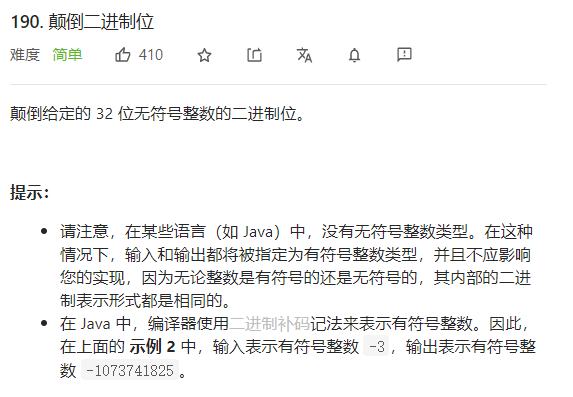

```java
public class Solution {
    // you need treat n as an unsigned value
    public int reverseBits(int n) {
        int res = 0;
        for(int i = 0; i < 32; i++) {
            res = (res << 1) | (n & 1); // res左移一位，然后和n的最后一位或运算
            n >>= 1; // n 往右移动一位
        }
        return res;
    }
}
```

#### 231 检查2的幂

思路：检查一个数是不是2的幂，那么将这个数的二进制最低位1屏蔽之后，检查剩余的数是否为0。

```python
class Solution {
    public boolean isPowerOfTwo(int n) {
        return  (n > 0) && (n&(n-1)) == 0;
    }
}
```

拓展：检查3的幂，4的幂。

```python
# 检查3的幂，int是最大为2^31-1，而对应的3的幂的最大数是3^20
class Solution:
    def isPowerOfThree(self, n: int) -> bool:
        return (n > 0) and (3486784401 % n == 0)
    
    
# 检查4的幂，4的幂必然是2的幂，再判断剩下的数
class Solution:
    def isPowerOfThree(self, n: int) -> bool:
        return (n > 0) and (n&(n-1)) == 0 and n&0xaaaaaaaa
```


#### 421. 数组中两个数的最大异或值🍉

>   思路：字典树将复杂度降到$O(n)$
>
>   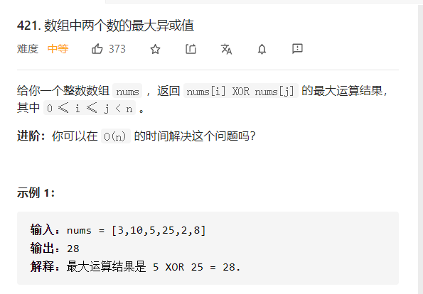

```python
class Solution:
    def findMaximumXOR(self, nums: List[int]) -> int:
        L = len(bin(max(nums)))-2 # 求出所有数字最大的那个数的二进制长度
        root = dict()

        for n in nums:
            node = root
            for i in range(L,-1,-1):
                v = (n >> i) & 1
                if v not in node:
                    node[v] = dict()
                    node = node[v]
                else:
                    node = node[v]
        res = 0

        for n in nums:
            node = root
            total = 0
            for i in range(L,-1,-1):
                v = (n >> i) & 1
                if 1-v in node:
                    total = (total<<1)|1
                    node = node[1-v]
                else:
                    total = total<<1
                    node = node[v]
            res = max(res,total)

        return res
```


#### 1835. 所有数对按位与结果的异或和

>   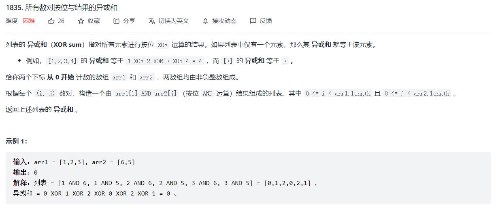
>
>   思路：需要理解`(a&b)^(a&c)=a&(b^c)`

```java
class Solution {
    public int getXORSum(int[] arr1, int[] arr2) {
        int xor_a = 0, xor_b = 0;
        for(int arr:arr1) {
            xor_a ^= arr;
        }
        for(int arr:arr2) {
            xor_b ^= arr;
        }
        return xor_a&xor_b;
    }
}
```

#### 1486 数组异或操作 🍉

思路：利用异或运算。[🔗](https://leetcode-cn.com/problems/xor-operation-in-an-array/solution/shu-xue-tui-dao-shi-jian-fu-za-du-o1de-f-b4kk/)

```java
class Solution {
    public int xorOperation(int n, int start) {
        int s = start >> 1;
        int prefix = xorOper(s-1)^xorOper(s+n-1); // 构造两个是从1开始的序列，从而使用4i^(4i+1)^(4i+2)^(4i+3)=0
        int last = n&start&1; // 多余出来的e
        int ans = prefix << 1 | last;
        return ans;
    }
    
    public int xorOper(int x) {
        int val = x % 4;
        if(val == 0) return x;
        else if(val == 1) return 1;
        else if(val == 2) return x+1;
        else return 0;
    }
}
```


#### 1734. 解码异或后的排列 🍉

>   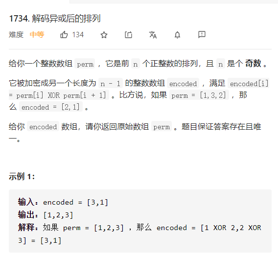

```python
class Solution:
    def decode(self, encoded: List[int]) -> List[int]:
        """
        1. 信息一：perm是n个正整数的排列（所有的数字在1~n之间），{1,2,3,4,5},n=5
        2. 信息二：n是个奇数
        """
        n = len(encoded) + 1
        all_reduce = reduce(operator.xor,[i+1 for i in range(n)])
        odd_reduce = reduce(operator.xor,encoded[1::2])
        first = all_reduce^odd_reduce

        perm = [first]
        for i in range(len(encoded)):
            perm.append(perm[-1]^encoded[i])

        return perm
```


#### 1310. 子数组异或查询

>   思路：前缀和求解。
>
>   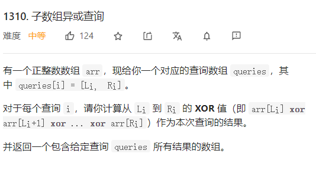

```java
class Solution {
    public int[] xorQueries(int[] arr, int[][] queries) {
        int m = arr.length;
        int n = queries.length;

        int [] xor_arr = new int[m+1];
        xor_arr[0] = 0;
        for(int i = 1; i <= m; i++) {
            xor_arr[i] = arr[i-1]^xor_arr[i-1];
        }

        int [] ans = new int[n];
        for(int i = 0; i < n; i++) {
            ans[i] = xor_arr[queries[i][0]]^xor_arr[queries[i][1]+1];
        }
        return ans;
    }
}
```


#### 810. 黑板异或游戏 🍉

>   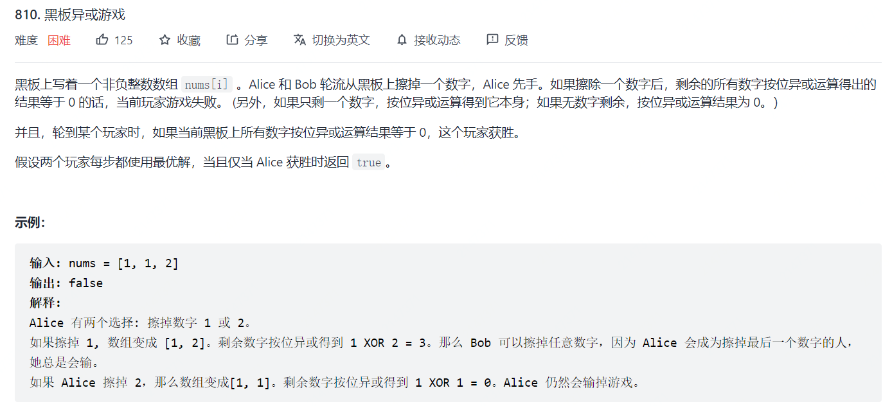
>
>   +   假设此时偶数数组所有数的异或值为0，那么Alice就直接获胜。(规则2)
>   +   如果此时偶数数组所有数的异或值不为0。得到结论：**至少有2个以上的数使其数组的异或值不为0**(记作$a,b$)。Alice会选这两个数中的一个，假设他选了$a$。此时Bob有两种方式：选剩下的$b$, 那么此时数组长度又回到了偶数。情况一：此时数组异或值为0，那么Alice获胜。情况二：数组异或值不为0，那么又回到了步骤2，这一步可以一直到数组的数被选完，然后轮到Alice选，空数组Alice获胜(规则三)。如果Bob不选b，那么轮到Alice选时，他也跳过b，因为 bb 有可能是此时唯一的数选完后数组的异或值为0。详细看图。
>   +   我们知道偶数先选方是一定获胜的！那么对于Bob也是同理，如果Alice是奇数方，然后选去一个数字后数组变为偶数，那么Bob此时一定会获胜。那么此时Alice只有一种情况会赢，那就是在他第一次选的时候，黑板上所有数的异或值就已经为0了(规则二)。

```python
class Solution:
    def xorGame(self, nums: List[int]) -> bool:
        return reduce(operator.xor,nums) == 0 or len(nums) % 2 == 0 
```


## 2. 和  `进位/阶层/求和/相乘/相除/相减`相关

两个数字的求和，在数学运算上是按照从低位到高位的求和过程，需要注意的点有两个：

+   一个是在每位运算的时候，需要注意`进位`和`余数`的计算
+   一个是在最高位计算之后，需要判断是否需要进一步进位，比如`5+5=10`，这种情况下就需要构建一个十位数。

####  向上取整 和 向下取整

```python
# (left+right+1) // 2
data = (left + right + 1) >> 1 

# 向上取整,
def ceil(a,b):
    return (a-1)//b + 1

# 向下取整
def floor(a,b):
    return a // b
```

#### 最大公约数和最小公倍数

```python
def gcd(a,b):
    return a if b == 0 else gcd(b,a%b)

def lcm(a,b):
    return a*b // gcd(a,b)
```


#### 2.两数相加

思路：
+ 1. 定义dummy指针，指向p1
+ 2. 定义prev指针，表示当前指针的前一指针
+ 3. 定义carry表示进位
+ 4. carry不等于0，计算最后一个节点

```java
/**
 * Definition for singly-linked list.
 * public class ListNode {
 *     int val;
 *     ListNode next;
 *     ListNode() {}
 *     ListNode(int val) { this.val = val; }
 *     ListNode(int val, ListNode next) { this.val = val; this.next = next; }
 * }
 */
class Solution {
public ListNode addTwoNumbers(ListNode l1, ListNode l2) {
        ListNode dummy = new ListNode(-1);
        dummy.next = l1;
        ListNode prev = dummy;
        int carry = 0;
        while(l1 != null && l2 != null) {
            l1.val = l1.val + l2.val + carry;
            carry = l1.val / 10;
            l1.val %= 10;
            prev = l1;
            l1 = l1.next;
            l2 = l2.next;
        }
        if (l1==null) {
            prev.next = l2;
            while(l2 != null) {
                l2.val += carry;
                carry = l2.val / 10;
                l2.val %= 10;
                prev = l2;
                l2 = l2.next;
            }
        } else if(l2 == null) {
            while(l1 != null) {
                l1.val += carry;
                carry = l1.val / 10;
                l1.val %= 10;
                prev = l1;
                l1 = l1.next;
            }
        }
        if(carry > 0) prev.next = new ListNode(carry);
        return dummy.next;
    }
}
```


#### 29. 两数相除 🍉

>   思路：
>
>   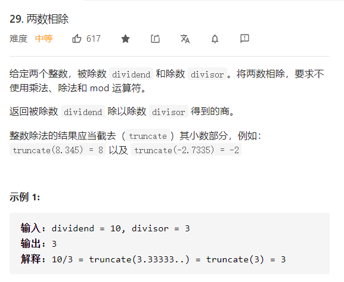

```python
class Solution:
    def divide(self, dividend: int, divisor: int) -> int:
        MAX_VAL = 2147483647
        MIN_VAL = -2147483648
        def fast(x,n): # 计算 x*n
            ans = 0
            while n > 0:
                if n&1: ans += x
                n >>= 1
                x += x
            return ans
        
        sign = 1
        if (dividend > 0 and divisor < 0) or (dividend < 0 and divisor > 0):
            sign = -1
        
        dividend = abs(dividend)
        divisor = abs(divisor)
        left,right = 0,dividend
        while left <= right:
            mid = left + right >> 1
            val = fast(divisor,mid)
            if val < dividend: left = mid + 1
            elif val == dividend:
                left = mid
                break
            else: right = mid - 1
        
        ans = left*sign
        if ans > MAX_VAL  or ans < MIN_VAL: return MAX_VAL
        else: return ans
        

```

#### 69 求解sqrt

```python
# 牛顿法，牛顿法可以向两边搜，所以直接取
class Solution:
    def mySqrt(self, x: int) -> int:
        f = lambda x,num: x*x - num
        f_prime = lambda x: 2*x

        num = x
        start = num / 2

        while abs(f(start,num)) >= 10e-5:
            start = start - (f(start,num)) / (f_prime(start))
        
        return int(start)

# 二分法，精确解，然后取整，二分法在求解的时候需要注意范围，只能在left和right中，所以这个范围要大一点
class Solution:
    def mySqrt(self, x: int) -> int:
        if x <= 1: return x
        left,right = 0,x//2+1 # 确定范围
        ans = 0
        while left <= right:
            mid = (left+right) / 2
            val = mid*mid - x
            if abs(val) < 10e-6:
                ans = int(round(mid,5))
                break
            elif val > 0:
                right = mid
            else:
                left = mid
        return ans
    
class Solution:
    def mySqrt(self, x: int) -> int:
        if x == 0 or x == 1: return x
        l = 1
        r = x
        ans = 0
        while l < r:
            mid = l + (r - l) // 2
            if mid <= x // mid:
                ans = mid
                l = mid + 1
            else:
                r = mid
        return ans
```


#### 172. 阶乘后的零 🍉

>   思路：对于一个阶乘后的数字，末尾的零的个数取决于因子中5的个数，

```java
class Solution {
    public int trailingZeroes(int n) {
        int cnt = 0;
        while(n >= 5) {
            n = n/5;
            cnt += n;
        }
        return cnt;
    }
}
```

#### 172 变形题

>   阶层后，2进制中最后一个1的位置
>
>   思路：等价于求因子中2的个数

```java
public int trailingZeroes(int n) {
    int cnt = 0;
    while (n > 0) {
        n /= 2;
        cnt += n;
    }
    return cnt;
}
```

可以用下面的脚本验证：

```python
data = math.factorial(30)
cnt = int(math.log2(data-(data&(data-1))))
```

#### 233 数字1的个数

>   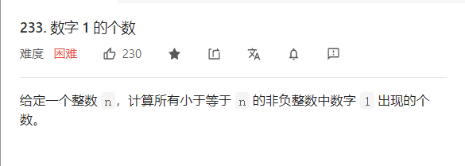
>
>   思路：
>
>   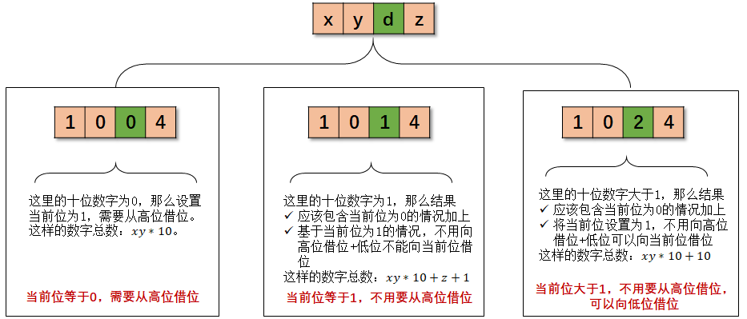

```python
class Solution:
    def countDigitOne(self, n: int) -> int:
        # 截取当前最低位
        ans = 0
        count = 1
        
        while count <= n:
            high = n // (count*10)
            cur = n % (count*10) // count
            low = n % (count*10) % count

            if cur == 0:
                ans += high*count
            elif cur == 1:
                ans += high*count + low + 1
            else:
                ans += high*count + count

            count = count*10
        return ans
```


#### 258 各位相加

>   思路：对于一个数，`abcd`，我们可以写成：
>   $$
>   abcd=a*1000+b*100+c*10+d=(999a+99b+9c)+(a+b+c+d)
>   $$
>   那么，可以得到：
>   $$
>   \begin{align}
>   abcd\%9&=(a+b+c+d)\%9 \\
>   (a+b+c+d)\%9 &= (x+y+z+q) \% 9 \\
>   \cdots &= \cdots \\
>   \cdots &= ans \\
>   \end{align}
>   $$
>   这样也就可以得到下面的等式：
>   $$
>   abcd\%9=(a+b+c+d)\%9=\cdots = ans
>   $$

所以可以可到答案：

```python
class Solution:
    def addDigits(self, num: int) -> int:
        if num == 0: return num
        val = num % 9
        return 9 if val == 0 else val
```

#### 263 丑数

>   思路：
>
>   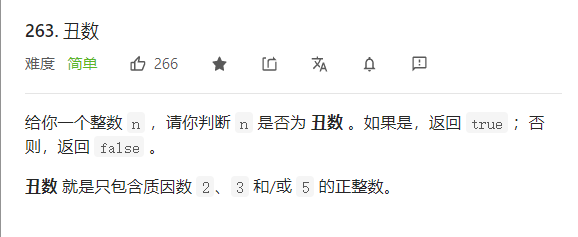

```python
class Solution:
    def isUgly(self, num: int) -> bool:
        if num<1:
            return False
        while num%2==0:
            num/=2
        while num%3==0:
            num/=3
        while num%5==0:
            num/=5
        return num==1
```


#### 264 丑数 II

>   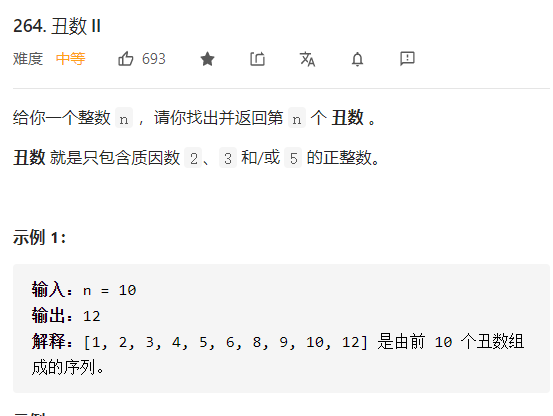

```python
class Solution:
    def nthUglyNumber(self, n: int) -> int:
        k = n
        H = []
        heapify(H)
        heappush(H,[1,0])
        nums = [2,3,5]
        n = len(nums)

        while True:
            cur,start = heappop(H)
            k -= 1
            if k == 0: return cur
            for i in range(start,3):
                heappush(H,[cur*nums[i],i]) # 保证数据按照1,3,5,7,9,15,21,...       
```


#### 991. 坏了的计算器 🍉

>   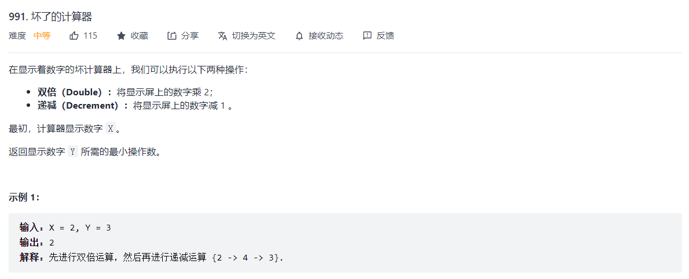
>
>   +   当 `Y` 是偶数，那么可以从两个数得到：$2*T\rightarrow Y$ 或者 $(2*T+1)-1=Y$
>   +   当 `Y` 是奇数，那么只能从: $(Y+1)/2 = X$

```python
class Solution:
    def brokenCalc(self, startValue: int, target: int) -> int:
        """ 数据范围一定要问清楚！！！ """
        x,y = startValue,target
        ans = 0
        while y > x:
            ans += 1
            if y%2: y += 1
            else: y //= 2
        return ans+x-y
```

#### 628. 三个数的最大乘积

>   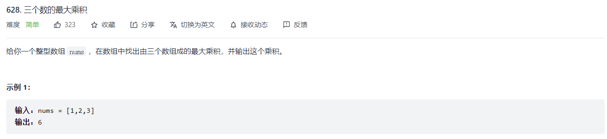
>
>   关键是找到最大的三个数和最小的两个数，可以利用排序算法直接求出，也可以利用简单的比较在 $O(N)$ 的时间内找到答案。

```python
min1 = min2 = float("inf")
max1 = max2 = max3 = -float("inf")
for num in nums:
    if num < min1:
        min2 = min1
        min1 = num
    elif num < min2:
        min2 = num
    
    if num > max1:
        max3 = max2
        max2 = max1
        max1 = num
    elif num > max2:
        max3 = max2
        max2 = num
    elif num > max3:
        max3 = num
print(min1,min2,max3,max2,max1)
```


#### 面试：求解开n次方

```python
def solution(a:float,n:int):
    def fast(x,n):
        ans = 1
        while n > 0:
            if n&1 == 1: ans *= x
            x *= x
            n >>= 1
        return ans
    
    if a == 0 or n == 0: return 0
    if n > 0:
        f = lambda x,n,a:fast(x,n)-a
    elif n < 0:
        f = lambda x,n,a:fast(x,n)-1/a
    n = abs(n)

    right = max(0,a)
    left = min(0,a)
    while left < right:
        mid = left + (right-left)/2
        val = f(mid,n,a)
        if abs(val) < 10e-5:
            break
        elif val > 0:
            right = mid
        else:
            left = mid
    print("ans: {:.3}".format(mid))
```


#### 牛顿法

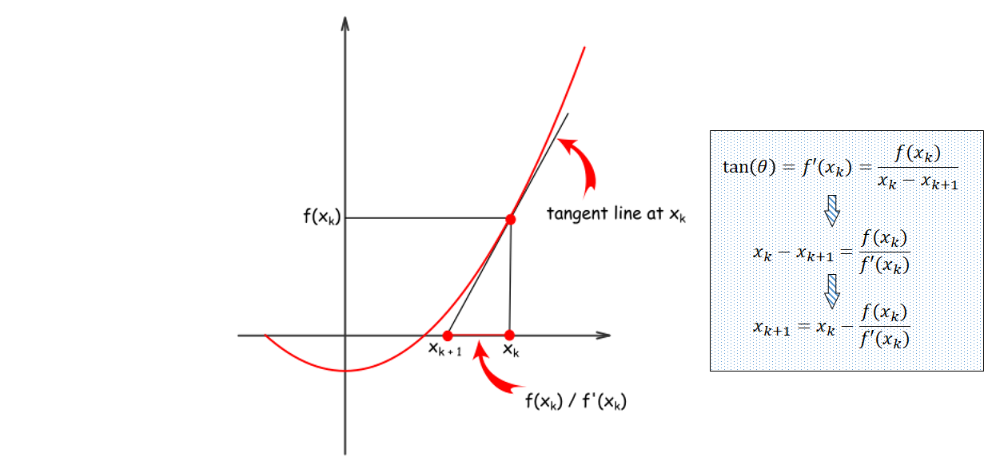

+   确定搜索范围，以及函数的单调性（如果是单调函数，最好是从定义域的中间开始搜索。）

+   目标值迭代。

+   输入：初始值$x_0$，函数$f(x)$，函数的倒数$f'(x)$

+   迭代公式：
    $$
    x_k=x_{k-1}-\frac{f(x_{k-1})}{f'(x_{k-1})}
    $$

+   代码，对于$a^{\frac{1}{n}}=x$，求解$x$。转化成求解$f(x)=x^n-a=0$ 这个问题

    ```python
    /*
    a = 12512142, n = 12541
    */
    import math
    import matplotlib.pyplot as plt
    import numpy as np
    
    def fast(x,n):
        ans = 1
        while n > 0:
            if n&1 == 1: ans *= x
            x *= x
            n >>= 1
        return ans
    
    def solution(a:float,n:int):
        if n > 0: f = lambda x,n,a:fast(x,n)-a
        elif n < 0: f = lambda x,n,a:fast(x,n)-1/a
        else: return 0
        n = abs(n)
        f_prime = lambda x,n:n*fast(x,n-1)
        start = a
        while abs(f(start,n,a)) >= 10e-5:
            start = start - f(start,n,a) / f_prime(start,n)
        print("ans: {:.3}".format(start))
    
    a = 45.124
    n = -3
    solution(a,n)
    ```

+   牛顿法可能遇到的问题，鞍点问题，也就是初始化的时候，遇到导数为0，这样在初始化的时候，导数就等于0，也就无法进行迭代了。所以这里我们定义开始搜索点为$a$，而二分法中更常见的是定义为$[0,a//2]$或者$[a//2,0]$

    
    
    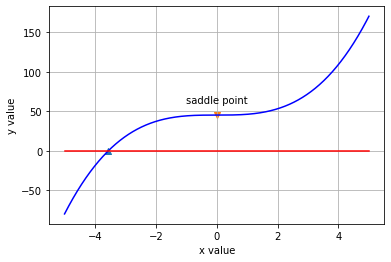


#### 算数基本定理（质因数分解）

任何一个大于1的自然数，都可以被分解为质数的乘积。

一个自然数，被分解成两个数，这两个数一定有一个是小于等于`sqrt(n)`，一个大于`sqrt(n)`。

```python
def divide_primes(num):
    """
    分解质因数
    @think 类似于丑数的计算方式，但是更简单
    """
    ans = []
    a = 2
    while a*a <= num:
        """
            按照2,3,5,7的顺序依次分解，但是4可以被分解为2*2，所以对应的cnt为0。
            一种优化的做法是实现计算出素数：{2,3,5,7,11,...}
        """
        cnt = 0
        while num % a == 0:
            cnt += 1
            num //= a
        ans += [str(a) for i in range(cnt)]
        a += 1
    if num > 1:
        ans += [str(num)]
    return "*".join(ans)
```


#### 254. Factor Combinations 因子组合 🍉

>   质因数求解
>
>   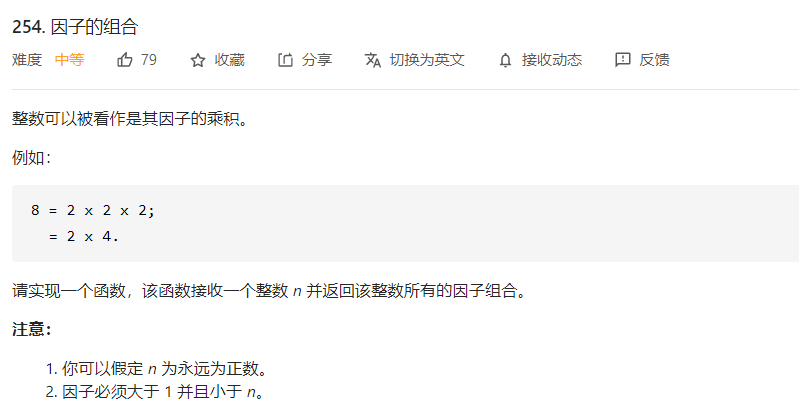
>
>   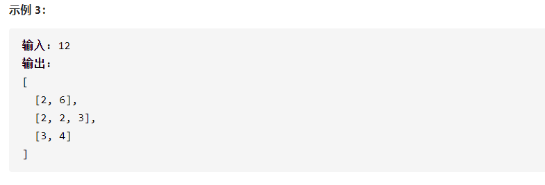

```python
def getFactors(n):
    ans = []
    path = []
    def helper(n,div):
        if n < div: return
        a = div
        while a*a <= n:
            if n % a == 0:
                path.append(a)
                path.append(n//a)
                ans.append(path[:]) # 点到为止，继续拆分
                path.pop()
                helper(n//a,a)
                path.pop()
            a += 1
    helper(n,2)
    return ans
```

#### 素数筛选 🍉

```python
# 埃氏筛选
class Solution:
    def countPrimes(self, n: int) -> int:
        isPrime = [True]*n
        i = 2
        while i*i < n:
            if isPrime[i]:
                j = i*i
                while j < n:
                    isPrime[j] = False
                    j = j + i
            i += 1
        return len([i for i in range(2,n) if isPrime[i]])

```


#### 最大质因数 🍉

```python
def find(k):
    for i in range(k//2,1,-1):
        if k % 1 == 0:
            return i
    return 1
```

## 3. 几何系列 🍉

线性方程有三种表达方式：

+   斜截式：

$$
y=kx+b
$$

+   截距式：

$$
\frac{x}{a} + \frac{y}{b}=1
$$

+   一般式方程：

$$
ax+by+c=0
$$


##### 给定两点坐标，如何确定直线？

+   一般方程式求解公式

$$
\begin{align}
a&=x_2-x_1 \\
b&=-(y_2-y_1) \\
c&=-(y_1*(x_2-x_1)-x_1*(y_2-y_1))
\end{align}
$$

+   归一化

$$
a = \frac{a}{\sqrt{a^2+b^2+c^2}} \\
b = \frac{b}{\sqrt{a^2+b^2+c^2}} \\
c = \frac{c}{\sqrt{a^2+b^2+c^2}}
$$

##### 面试题 16.03. 交点

思路：

+   根据两个点将直线表达出来，然后求出两个直线的交点。（如果两个直线平行，则进入特殊判断）
+   判断交点是否在两个直线上，如果在，则输出交点；否则，表示两个直线不相交。
+   特殊判断：如果两个直线平行，那么这两个线段有几种可能，可能完全相离，可能只有一个交点，可能有多个交点，可能完全内含。这时候只需要对四个顶点进行判断，判断顶点是否存在线条内，然后对在线条内的点进行排序。


#### 149. 直线上最多的点数

>   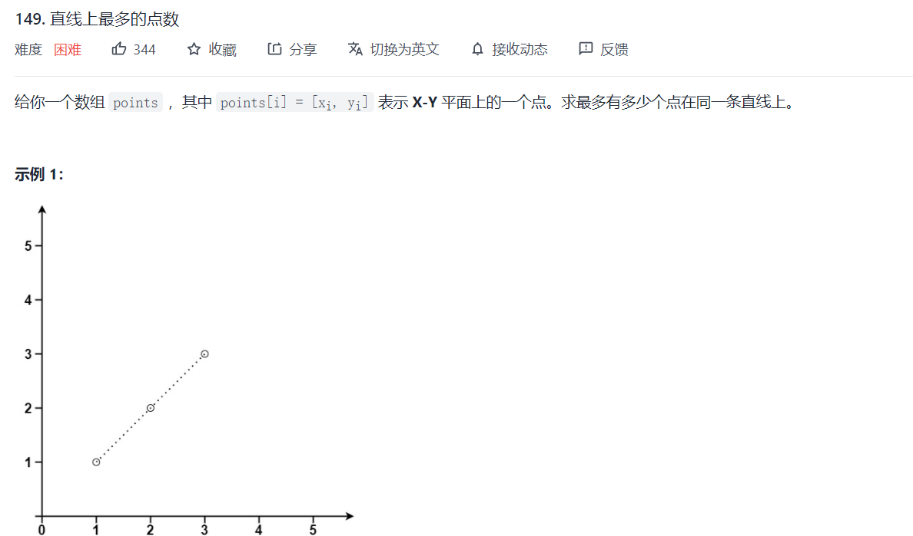
>
>   一般方程式 + 法向量归一化 + 保留小数

```python
class Solution:
    def maxPoints(self, points: List[List[int]]) -> int:
        def getKey(p1,p2):
            x1,y1 = p1
            x2,y2 = p2
            a = x2-x1
            b = -(y2-y1)
            c = -(y1*(x2-x1)-x1*(y2-y1))

            base = math.sqrt(a*a+b*b+c*c)
            digit = 10
            a,b,c = round(a/base,digit),round(b/base,digit),round(c/base,digit)
            if a < 0: a,b,c = -a,-b,-c
            elif a == 0:
                if b < 0: b,c = -b,-c
                elif b == 0:
                    if c < 0: c = -c
            return a,b,c

        n = len(points)
        line_dict = collections.defaultdict(set)
        for i in range(n):
            for j in range(i+1,n):
                a,b,c = getKey(points[i],points[j])
                line_dict[(a,b,c)].add(tuple(points[i]))
                line_dict[(a,b,c)].add(tuple(points[j]))

        ans = 1
        for k,v in line_dict.items():
            ans = max(ans,len(v))
        return ans
```


## 4. 坐标转换类型

#### Floyd判圈法

>   设定，从起点到环起点距离为$a$,从环起点顺时针到相遇点长度为$b$，从相遇点到起点为$c$。

则，慢指针行进的距离$S$如下，
$$
S=a+A(b+c)+b
$$
快指针行进的距离$2S$如下，
$$
2S=a+B(b+c)b
$$
可以得到：
$$
S=(B-A)(b+c)
$$
说明快慢指针行进的距离正好是环长度的倍数，将慢指针移动到起点，然后行进长度为$a$的距离，则快指针行进的距离为
$$
2S+a
$$
考虑到S式环长度的倍数，若以此时快指针正好执行环开始的坐标。


#### 剑指 Offer 29. 顺时针打印矩阵

公式法中，请参考LCP 29的解决方案，这题最快的做法是模拟碰壁法快速求解。

+   java

```java
class Solution {
    public int[] spiralOrder(int[][] matrix) {

        int m = matrix.length;
        if (m == 0) return new int[0];
        int n = matrix[0].length;
        if (n == 0) return new int[0];

        int l = 0, r = n, u = 0, d = m;
        int [] ans = new int[m*n];
        int idx = 0;
        while(true) {
            for(int i = l; i < r; i++) {
                ans[idx++] = matrix[u][i];
            }
            u += 1;
            if (u >= d) break;
            for(int i = u; i < d; i++) {
                ans[idx++] = matrix[i][r-1];
            }
            r -= 1;
            if (l >= r) break;
            for (int i = r-1; i >= l; i--) {
                ans[idx++] = matrix[d-1][i];
            }
            d -= 1;
            if (u >= d) break;
            for (int i = d-1; i >= u; i--) {
                ans[idx++] = matrix[i][l];
            }
            l += 1;
            if (l >= r) break;
        }
        return ans;   
    }
}
```


#### LCP 29. 乐团站位

思路：分为两部分：

+   第一部分是找到外层有多少元素 $\rightarrow$   寻找外层层数 $\rightarrow$ 离四个边界最短的距离
+   第二部分是找到内层有多少元素，按照`上右下左`四个顺序进行计算
+   python

```python
# python
class Solution:
    def orchestraLayout(self, num: int, xPos: int, yPos: int) -> int:
        def get_pos(x,y,m,n):
            """
            x,y是下标从1开始的坐标
            """
            k = min(min(x-1,n-y),min(y-1,m-x)) # 寻找层数
            outer_eles = k*(2*m+2*n-4*k) # 等差数列求和
            inner_eles = get_inner(x-k,y-k,m-2*k,n-2*k) # 
            return outer_eles + inner_eles

        def get_inner(x,y,m,n):
            if x == 1: return y
            if y == n: return x+n-1
            if x == m: return 2*n+m-y-1
            if y == 1: return 2*m+2*n-x-2
            return 0 # default case
        
        pos = get_pos(xPos+1,yPos+1,num,num)

        return 9 if pos%9 == 0 else pos%9
```

+   java 如何处理大数问题 BigInteger

```java
import java.math.BigInteger;
class Solution {
    public int orchestraLayout(int num, int xPos, int yPos) {
        BigInteger pos = get_pos(xPos+1,yPos+1,num,num);
        int val = pos.mod(BigInteger.valueOf(9)).intValue();
        return (val == 0) ? 9 : val;
    }

    public BigInteger get_pos(int x, int y, int m, int n) {
        int k = Math.min(Math.min(x-1, n-y),Math.min(y-1, m-x));
        BigInteger inner_eles = get_inner(x - k, y - k, m - 2*k, n - 2*k);
        BigInteger outer_eles = BigInteger.valueOf(k).multiply(
                BigInteger.valueOf(2).multiply(BigInteger.valueOf(m+n)).subtract(
                        BigInteger.valueOf(4).multiply(BigInteger.valueOf(k)))
                
                );

        return outer_eles.add(inner_eles);
    }
    public BigInteger get_inner(int x,int y,int m,int n) {
        if(x==1) return BigInteger.valueOf(y);
        if(y==n) return BigInteger.valueOf(x+n-1);
        if(x==m) return BigInteger.valueOf(2).multiply(BigInteger.valueOf(n)).add(
                BigInteger.valueOf(m).subtract(BigInteger.valueOf(y+1))
        ); 
        if(y==1) return BigInteger.valueOf(2).multiply(BigInteger.valueOf(m)).add(
                BigInteger.valueOf(2).multiply(BigInteger.valueOf(n)).subtract(
                        BigInteger.valueOf(x+2)
                )
        );
        return BigInteger.valueOf(0);
    }
}
```


#### 循环取余

+   数据在[1,...,n]中，将数据映射到[1,m]中

    ```python
    n = 100
    m = 9
    nums = [i for i in range(1,n+1)]
    data = [(num-1)%m+1 for num in nums]
    print(data)
    ```

+   数据在[0,...,n]中，将数据映射到[0,m]中

    ```python
    n = 100
    m = 9
    nums = [i for i in range(1,n+1)]
    data = [(num)%m for num in nums]
    print(data)
    ```

+   如果想把数据范围控制在[1,3]中，数据是从下标为1开始的

    ```python
    n = 100
    m = 3
    nums = [i for i in range(1,n+1)]
    data = [(num-1)%m+1 for num in nums]
    print(data)
    ```

    

#### 剑指 Offer 44. 数字序列中某一位的数字

```python
class Solution:
    def findNthDigit(self, n: int) -> int:
        import math
        if n < 10: return n 
        N = n + 1 # N表示含义是第N个数，下标从1开始
        start = 1 # 初始化为1，表示012345678910的第一个0
        cnt = 0 # 表示当前的位数
        while N > 0:
            if N - start > 0: N -= start # 表示当前还有余数
            else: break
            # 9 * pow(10,cnt)，9,90,900等表示数字的数量
            # cnt+1表示每个数字的长度整体表示数字的长度
            start = 9 * pow(10,cnt) * (cnt+1) 
            cnt += 1
        # Math.pow(10,cnt-1) 表示基础的数字大小
        # N是剩余的数，除以cnt再减去1之后得到第几个数
        num_int = pow(10,cnt-1) + (math.ceil(N/cnt)-1)
        num_str = str(num_int)
        return int(num_str[(N-1) % cnt])
```


#### 剑指 Offer 62. 圆圈中最后剩下的数字

>   `约瑟夫环`
>
>   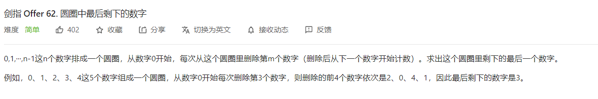
>
>   思路：定义$F(n,m)$为有n个数，隔m个数删除一个，最终剩余的那个数的下标。
>   $$
>   F(n,m)=[F(n-1,m)+m]\%nF(n,m)=[F(n-1,m)+m]\%n
>   $$

```python
class Solution:
    def lastRemaining(self, n: int, m: int) -> int:
        """
        操作一：将当前或者的下标加上m
        操作二：取余，复原，一个反推过程
        """
        pos = 0
        for i in range(2,n+1):
            pos = (pos + m) % i # 一个反推过程
        return pos
```

或者采用模拟法：

```python
def solution(N,M):
    data = [i + 1 for i in range(N)]
    index = 0
    ans = []
    while data:
        index = (index + M - 1) % N
        ans.append(str(data[index]))
        data[index] = -1
        data.remove(-1)
        N -= 1
    return " ".join(ans)
```

#### 剑指offer 66 构建乘积数组 

思路：数组，两次遍历，第一次遍历定义prod为除了当前元素外的左边元素乘积，第二次遍历prod为除了当前元素外的右边元素乘积。


```python
class Solution:
    def constructArr(self, a: List[int]) -> List[int]:
        m = len(a)
        if m == 0: return []

        b = a[:]
        prod = 1
        for i in range(m):
            a[i],prod = prod,prod*a[i]
        
        prod = 1
        for i in range(m-1,-1,-1):
            b[i],prod = prod*a[i],prod*b[i]

        return b
```


#### 457环形数组是否存在循环 🍉

>   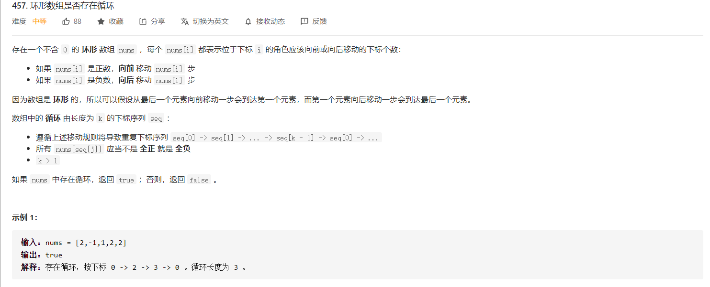

```python
class Solution:
    def circularArrayLoop(self, nums: List[int]) -> bool:
        n = len(nums)
        # x的下一个位置
        nxt = lambda x: (x + nums[x]) % n

        for i in range(n):
            if nums[i] == 0: continue
            slow = i
            fast = nxt(i)
            # 快慢指针
            """符号相同保证是同一个方向移动"""
            while nums[slow] * nums[fast] > 0 and nums[fast] * nums[nxt(fast)] > 0:
                """快指针每次走两步，如果快慢指针相等，说明有环"""
                if slow == fast:
                    """如果是自身环，那么退出循环"""
                    if slow == nxt(slow):
                        break
                    else:
                        return True
                """更新状态，快指针每次走两步"""
                slow = nxt(slow)
                fast = nxt(nxt(fast))
            # 访问过的置0
            """如果上面那轮没有return，说明上面遍历过的元素都不可能成环，为避免再次遍历陷入无效查找，故将查找过的元素置零，再次遍历时直接跳过"""
            while nums[i]*(nums[nxt(i)]) > 0:
                """先找到下一个元素的index"""
                tmp = nxt(i)
                """将当前的元素置零"""
                nums[i] = 0
                """向下走一步"""
                i = tmp
        return False
```


#### 390 消除游戏🍉

>   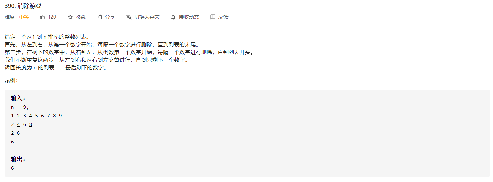
>
>   维护这几个变量，核心为**模拟法**
>
>   +   flag表示当前数组的数量是奇数还是偶数
>   +   res表示当前 **数组中，第一个元素的值（重点）**
>   +   step表示每次删除的间隔数量

```python
class Solution:
    def lastRemaining(self, n: int) -> int:
        remain = n
        flag = True
        res = 1
        step = 1

        while remain > 1:
            if flag or remain % 2 == 1:
                res += step
            flag = not flag
            step *= 2
            remain //= 2
        return res
```


## 4. 概率相关

#### 382. 链表随机节点

>   蓄水池抽样算法
>
>   +   当`k=1`时，以 `1/i` 的概率抛弃掉以前的数（也就是保留当前的数），以  `(i-1)/i` 的概率保留以前的数。
>
>   对于第一个数：
>   $$
>   \begin{align}
>   p(n_1) &= 1 \\
>   p(n_2) &= 1 \times \frac{1}{2} \\
>   p(n_3) &= 1 \times \frac{1}{2} \times \frac{2}{3} \\
>   \cdots \\
>   p(n_N) &= 1 \times \frac{1}{2} \times \cdots \times \frac{N-1}{N} = \frac{1}{N}
>   \end{align}
>   $$
>   同理对于其他的数也是这样
>
>   +   当`k>1`时，首先对于前`k`个元素都放到蓄水池中，对于第`i (i>k)`个数被选中的概率为`k/i`，不被第`i+1`个元素替换的概率
>
>       为 $1-\frac{k}{j+1}\times \frac{1}{k}=\frac{j}{j+1}$，则运行到第`N`步时，被保留的概率=被选中的概率 * 不被替换的概率，即条件概率的连乘，
>       $$
>       \frac{k}{j} \times \frac{j}{j+1} \times \frac{j+1}{j+2} \times \frac{N-1}{N} = \frac{k}{N}
>       $$

```python
class Solution:

    def __init__(self, head: ListNode):
        """
        @param head The linked list's head.
        Note that the head is guaranteed to be not null, so it contains at least one node.
        """
        self.head = head

    def getRandom(self) -> int:
        """
        Returns a random node's value.
        """
        p = self.head
        if not p: return -1
        
        # 初始化
        reserve = p.val
        count = 1

        # 蓄水池算法
        while p:
            prob = random.randint(1,count)
            if prob == count:
                reserve = p.val
            count += 1
            p = p.next
        
        return  
```


#### 384. 打乱数组 

>   洗牌算法 shuffle
>
>   该算法的目的是在n个不同的随机数中随机取出不重复的m个数，那么表示的含义就是在新的数组中，每个元素应该是**被等概率选取**的。
>
>   开始数组中有五个元素；
>   在前五个数中随机选一个数与第五个数进行交换，每个数都有五分之一的概率被交换到最后一个位置；
>   在前四个数中随机选一个数与第四个数进行交换，每个数都有五分之一的概率被交换到第四个位置；
>   在前三个数中随机选一个数与第三个数进行交换，每个数都有五分之一的概率被交换到第三个位置；
>
>   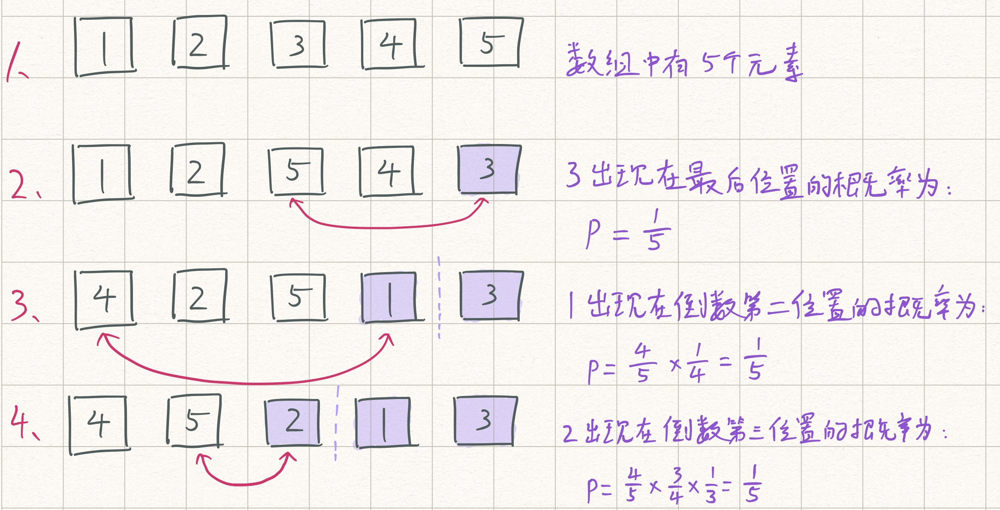

```python
class Solution:

    def __init__(self, nums: List[int]):
        self.nums = nums
        self.record = nums[:]


    def reset(self) -> List[int]:
        """
        Resets the array to its original configuration and return it.
        """
        self.nums = self.record[:]
        return self.nums

    def shuffle(self) -> List[int]:
        """
        Returns a random shuffling of the array.
        """
        n = len(self.nums)
        for i in range(n):
            index = random.randint(i,n-1) # 当i等于1时，代表从[0,n-1]这些元素中任意选取一个，包括当前数
            self.nums[i],self.nums[index] \
                = self.nums[index],self.nums[i]
        return self.nums
```


#### 398. 随机数索引

>   蓄水池抽样算法


>   利用字典进行处理 + 随机函数库进行处理

```python
class Solution:

    def __init__(self, nums: List[int]):
        
        self.nums_dict = collections.defaultdict(list)
        for i in range(len(nums)):
            self.nums_dict[nums[i]].append(i)

    def pick(self, target: int) -> int:
        size = len(self.nums_dict[target])
        return self.nums_dict[target][random.randint(0,size-1)]
```


#### 470. 用 Rand7() 实现 Rand10()

>   $$
>   [randX()-1]*Y + randY()
>   $$
>
>   可以生成范围在`[1,x*y]`之间均匀分布的数据。

```python
class Solution:
    def rand10(self):
        """
        :rtype: int
        res = (rand7()-1)*7 + rand7()
        rand7() 生成 [1,7]的随机数
        rand7()-1 生成 [0,6]的随机数
        (rand7()-1)*7 生成 {0,7,14,21,28,35,42} 的随机数
        (rand7()-1)*7 + rand7() 生成 [1,49] 的随机数
        然后利用拒绝假设来完成最后的结果
        """
        while True:
            res = (rand7()-1)*7 + rand7() # 生成[1,49]的均匀分布的随机数
            if res <= 40:
                return res % 10 + 1
```


#### 腾讯&美团面试题，利用`p,1-p`生成等概率发生器

制作 1 2 发生概率都是 `1/2` 的发生器，连续发生2次，则发生`00,11`的概率为`p*p,(1-p)(1-p)`,发生`10,01`的概率都为`p(1-p)`,在发生10时返回1，发生01时返回2，则发生1，2的概率相等。


## 4. 数据转换系列

#### 状态机

优先状态自动机由：

+   一组状态
+   一个初始状态
+   输入
+   根据输入以及现有状态转换为下一个状态的转移函数

####  剑指 Offer 20. 表示数值的字符串

思路：主站，[65. 有效数字](https://leetcode-cn.com/problems/valid-number/)

+   先定义状态，然后画出状态转移图，最后编写代码

```python
class Solution:
    def isNumber(self, s: str) -> bool:
        """
        0: 开始前的空格，"  12.3", "  .3", "  -4"
        1: 幂符号前的正负号：" -34e3"," 34e3"
            2: 小数点前的数字："  -[43]."
            3: 小数点后的数字: "  -43.[324]"
        4: 当小数点前为空格时的状态："  ."
        5: 遇到幂符号：" +12[e]"
        6: 幂符号后的正负号: " +12e[+]"
            7: 幂符号后的数字: " +12e[342]"
            8: 结尾的空格: " +12e342[  ]"
        合法的结束状态之后2，3，7，8
        """
        transfer = {
            0: {"blank":0,"sign":1,"digit":2,"dot":4},
            1: {"digit":2,"dot":4},
            2: {"digit":2,"dot":3,"blank":8,"e":5},
            3: {"digit":3,"blank":8,"e":5},
            4: {"digit":3},
            5: {"sign":6,"digit":7},
            6: {"digit":7},
            7: {"digit":7,"blank":8},
            8: {"blank":8}
        }

        state = 0
        for c in s:
            if c.isdigit(): action = "digit"
            elif c == " ": action = "blank"
            elif c in "eE": action = "e"
            elif c in "+-": action = "sign"
            elif c == ".": action = "dot"
            else: return False

            state = transfer[state].get(action,None)
            if not state: return False
        
        return state in (2,3,7,8)
```


#### 剑指 Offer 67. 把字符串转换成整数

思路：与主站的第八题相同。

```python
class Solution:
    def strToInt(self, str: str) -> int:
        # 处理空格
        MAX_VAL = 2**31-1
        MIN_VAL = -2**31
        i= 0
        s = str
        n = len(s)
        num = 0
        flag = False # flag 表示的含义是是否遇到+或者-号，从而进入数字运算状态        
        signed = 1 # 正负

        while i < n:
            if s[i] == " ":
                if flag: break
            elif s[i].isdigit():
                num = 0
                while i < n and s[i].isdigit():
                    num = num*10+int(s[i])
                    if num >= MAX_VAL+1:
                        num = MAX_VAL+1
                        break
                    i += 1
                num *= signed
                num = min(num,MAX_VAL)
                num = max(num,MIN_VAL)
                break
            elif s[i] == "+" or s[i] == "-":
                if flag: break # 重复遇到flag,退出
                signed = 1 if s[i] == "+" else -1
                flag = True
            else:
                break
            i += 1
        
        return num
```

除此之外还可以用状态转换机做，需要注意一下，当读取到action的时候，不能立即将数据计算到ans上，因为当前的action可能不合法。

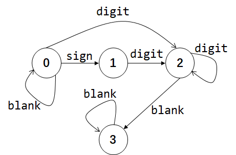

```python
class Solution:
    def myAtoi(self, s: str) -> int:
        MAX_VAL = 2147483647
        MIN_VAL = -2147483648

        def check(ans):
            if ans >= MIN_VAL and ans <= MAX_VAL:
                return False
            return True

        trasnfer = {
            0: {"sign":1,"blank":0,"digit":2},
            1: {"digit":2},
            2: {"digit":2,"blank":3},
            3: {"blank":3}
        }
        sign_dict = {"+":1,"-":-1}

        state = 0
        ans = 0
        sign = 1
        for c in s:
            if c.isdigit():
                action = "digit"
            elif c == " ":
                action = "blank"
            elif c in "+-":
                action = "sign"
            else:
                break
            state = trasnfer[state].get(action,None)
            if state is None: break
            elif action == "digit":
                ans = ans * 10 + int(c)
                if check(sign*ans):
                    return MAX_VAL if sign == 1 else MIN_VAL
            elif action == "sign":
                sign = sign_dict[c]
        return sign*ans
```


#### 12. 整数转罗马数字

思路：贪心算法，每次尽可能用较大的数进行表示。

```python
# 所有可能的进制：[1000,900,500,400,100,90,50,40,10,9,5,4,1]
# 比如对于 2984，拆分成：2*1000 + 1*900 + 1*50 + 3*10 + 1*4
class Solution:
    def intToRoman(self, num: int) -> str:
        mark_one = {
            1:"I",
            10:"X",
            100:"C",
            1000:"M",
            5:"V",
            50:"L",
            500:"D",
            4: "IV",
            9: "IX",
            40: "XL",
            90: "XC",
            400: "CD",
            900: "CM"
        }
        lists = [1000,900,500,400,100,90,50,40,10,9,5,4,1]
        ans = ""
        idx = 0
        while idx < len(lists):
            count = num // lists[idx]
            if count != 0:
                ans += mark_one[lists[idx]]*count
            num = num % lists[idx]
            idx += 1
        return ans
```

#### 13 罗马数字转整数

思路：和12题目反着来

```python
class Solution:
    def romanToInt(self, s: str) -> int:
        mark_one = {
            "I":1,
            "X":10,
            "C":100,
            "M":1000,
            "V":5,
            "L":50,
            "D":500,
            "a":4,
            "b":9,
            "c":40,
            "d":90,
            "e":400,
            "f":900
        }
        s = s.replace("IV","a")
        s = s.replace("IX","b")
        s = s.replace("XL","c")
        s = s.replace("XC","d")
        s = s.replace("CD","e")
        s = s.replace("CM","f")

        idx = len(s)-1
        ans = 0
        for val in s:
            ans += mark_one[val]
        return ans
```


#### 273 整数转英文 🍉

思路：分治法的原理，将数据按照20，100，1000，1000~1000,000，1,000,000 ~ 1,000,000,000

```python
class Solution:
    def numberToWords(self, num: int) -> str:
        digits_20 = "One Two Three Four Five Six Seven Eight Nine Ten Eleven Twelve Thirteen Fourteen Fifteen Sixteen Seventeen Eighteen Nineteen".split(" ") # 小于20的数据
        digits_100 = "Twenty Thirty Forty Fifty Sixty Seventy Eighty Ninety".split(" ") # 小于100的数据
        digits_up = "Thousand Million Billion".split(" ")

        def helper(num,index):
            if num == 0: return []
            if num < 20:
                return [digits_20[num-1]]
            elif num < 100:
                return [digits_100[num//10-2]] +  helper(num%10,index)
            elif num < 1000:
                return [digits_20[num//100-1]] + ["Hundred"] + helper(num%100,index)
            else:
                if (num // 1000 < 1000)  or (num // 1000 % 1000 != 0):
                    # 处理两类数据
                    # 1. 小于一百万的数据，这些数据都表示位 `xxx Thousand`，Thousand节权必然保留
                    #    比如：45,400 --> Forty Five Thousand Four Hundred
                    # 2. 大于一百万的数据，但是在百万位权到千位节权中，存在非零数字，这类数据表示为：`xxx Million xxx Thousand`
                    #    比如：1,001,400
                    return helper(num//1000,index+1) + [digits_up[index]] + helper(num % 1000,index)
                else:
                    # 处理一类数据
                    # 1. 大于一百万的数据，并且在百万位权到千位节权中，不存在非零数字
                    #     比如1,000,400 --> One Millon
                    return helper(num//1000,index+1) + helper(num % 1000,index)
        if num == 0: return "Zero"
        data = helper(num,0)
        return " ".join(data)
```


#### 224. 基本计算器

思路：单栈解法

```python
class Solution:
    def calculate(self, s: str) -> int:
        """
        @Desc 边运行边计算的方法
        res用来存储当前运算表达式的结果。
        如果出现左括号，当前res和sign结果入栈，res和sign重新初始化，用于重新计算。
        如果出现右括号，当前将当前res和栈中的res计算，得到新的结果。
        如果遇到符号，变换当前sign
        遇到数字，累积，并进行计算。
        """
        i = 0
        res = 0
        sign = 1
        stack = [(res,sign)]

        while i < len(s):
            if s[i].isdigit():
                num = 0
                while i < len(s) and s[i].isdigit():
                    num = 10*num + int(s[i])
                    i += 1
                res = res + sign*num # 边运行，边计算
                i -= 1
            elif s[i] == "(":
                # 遇到左括号，res和sign结果入栈，res和sign重新初始化
                stack.append((res,sign))
                res = 0
                sign = 1
            elif s[i] == ")":
                # 遇到右括号，将栈中res和当前res计算
                old_res,old_sign = stack.pop()
                res = old_res + old_sign*res
            elif s[i] == "+":
                sign = 1
            elif s[i] == "-":
                sign = -1
            i += 1
        return res

```


#### 227. 基本计算器 II

>   通用解法：双栈法

```python
class Solution:
    def calculate(self, s: str) -> int:
        def convert_to_suffix_exp(data):
            """
            将表达式由中缀表达式转换成后缀表达式
            """
            if data[0] in "+-": data = "0" + data
            data = data.replace("(-","(0-")
            data = data.replace("(+","(0+")
            print(data)

            
            expression = {
                "+": lambda a,b: a+b,
                "-": lambda a,b: a-b,
                "*": lambda a,b: a*b,
                "/": lambda a,b: a//b,
            }            
            priority = {"+":1,"-":1,"*":2,"/":2,"(":0,")":3}
            op_set = {"+","-","(",")","*","/"} # 操作符集合
            op_stack = [] # 运算符栈
            exp_stack = [] # 表达式栈
            i = 0
            while i < len(data):
                if data[i] == " ":
                    pass
                elif data[i] in op_set:
                    if data[i] == "(": # 左边自动加入操作符栈
                        op_stack.append(data[i])
                    elif data[i] == ")":
                        while op_stack and op_stack[-1] != "(":
                            b = exp_stack.pop()
                            a = exp_stack.pop()
                            exp_stack.append(expression[op_stack.pop()](a,b))
                        op_stack.pop() # 弹出左括号
                    else:
                        # 针对 7*8+9，
                        # 在遇到+时候
                        # 在操作符栈中：[*]
                        # 在表达式栈中，[7,8]
                        # 这时候优先将: [*]出栈，加入到表达式栈中：[7,8,*],操作符栈：[+]
                        while op_stack and priority[op_stack[-1]] >= priority[data[i]]:
                            b = exp_stack.pop()
                            a = exp_stack.pop()
                            exp_stack.append(expression[op_stack.pop()](a,b))
                        op_stack.append(data[i])
                elif data[i].isdigit():
                    num = 0
                    while i < len(data) and data[i].isdigit():
                        num = num*10 + int(data[i])
                        i += 1
                    i -= 1
                    exp_stack.append(num)
                i += 1
            while op_stack: 
                b = exp_stack.pop()
                a = exp_stack.pop()
                exp_stack.append(expression[op_stack.pop()](a,b))
            return exp_stack

        return convert_to_suffix_exp(s)[0]
s = Solution()
s.calculate("12*899+(12-31)")
```


[150. 逆波兰表达式求值](https://leetcode-cn.com/problems/evaluate-reverse-polish-notation/)


## 5. 初等数学系列

#### 求和公式

+   等差数列求和

$$
s = \frac{n*(a_1+a_n)}{2}
$$

#### 换底公式

$$
\log_a b = \frac{\log_c b}{\log_c a}
$$

#### 平方和公式

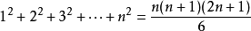

#### 48 旋转图像 `找规律` `数学题`


#### 49 字母异或词分组 `质数`


#### 279. 完全平方数

>   思路：动态规划 或 数学公理


## 7 数学知识

#### 7.1 卡特兰数

[【参考资料-TODO】](https://leetcode-cn.com/circle/article/lWYCzv/)

>   **题目描述**
>
>   n 个元素进栈序列为：`1，2，3，4，...，n`，则有多少种出栈序列

+   常规思路

    我们假定`第一个出栈的序数`是 `k`，第一个出栈的序数`k` 将 `1~n` 的序列分为两部分，其中一个是 `1~k-1`，序列个数为`k-1`；另外一部分是 `k+1~n`，数量为 `n-k`。所有选择 `k`作为第一个出栈的出栈序列个数为

$$
G(k) = G(k-1)*G(n-k)
$$

而 `k` 可以选择的范围是`1~n`，所以最终的结果为：
$$
H(n) = G(0)*G(n-1)+\cdots+G(n-1)*G(0) = C^n_{2n}-C^{n+1}_{2n}=\frac{C_{2n}^{n}}{n+1}
$$

+   非常规思路

    一个元素入栈，我们标志为 `1` ；一个元素出栈，我们标志位 `-1`；那么整体应该有 `2n` 个元素。

    首先，从 `2n` 个元素中选取 `n` 个元素填入 `1` , 剩余的默认填入 `-1`；而不合要求的 `2n` 位数与 `n+1` 个 `0` ，`n-1` 个 `1` 组成的排列一一对应。所以合法的排列数量为：
    $$
    C^n_{2n}-C^{n+1}_{2n}=\frac{C_{2n}^{n}}{n+1}
    $$

#### 7.2 杨辉三角

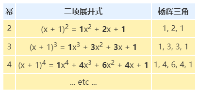

杨辉三角的快速计算公式：
$$
G(n,k) = \C_{n}^{k}=\frac{n!}{k!(n-k)!}
$$
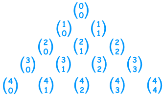

## 了解即可

#### 287 寻找重复数


#### 689. 三个无重叠子数组的最大和 🍉

>   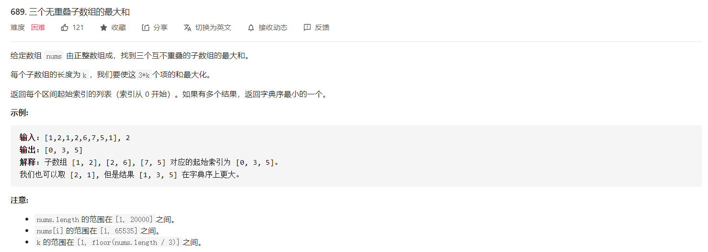


#### 866 回文素数


## 资料

[1] https://blog.csdn.net/weixin_42426714/article/details/109591964

[2] https://www.cnblogs.com/Komnenos/p/11968614.html

