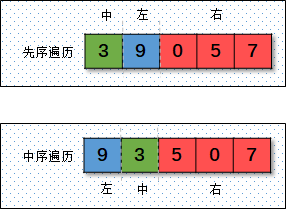
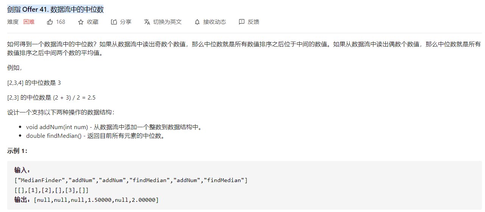
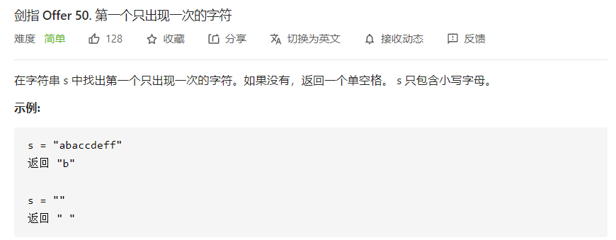
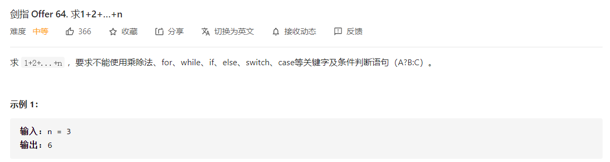
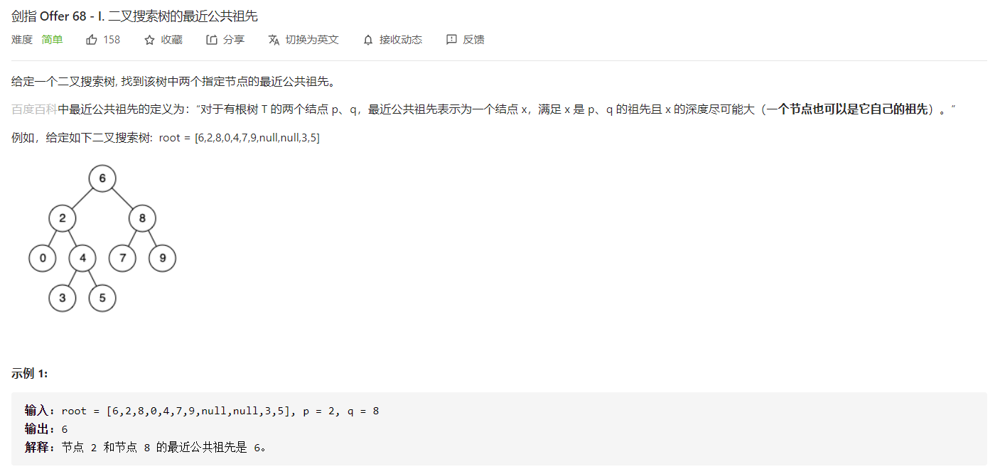

#### 剑指 Offer 03. 数组中重复的数字

>   

重复元素等类似的题目，直接思路就是`哈希表`，但是哈希表需要花费额外空间。而哈希表本质上就是数组，所以可以`通过交换冲突法`解决。

```python
class Solution:
    def findRepeatNumber(self, nums: List[int]) -> int:
        i = 0
        n = len(nums)
        while i < n:
            if nums[i] == i:
                i += 1
            else:
                idx = nums[i]
                if nums[idx] == nums[i]:
                    return nums[i]
                else:
                    nums[idx],nums[i] = nums[i],nums[idx]
```


#### 剑指 Offer 04. 二维数组中的查找

>   

+   将原问题转化成`二叉搜索树`


```python
class Solution:
    def findNumberIn2DArray(self, matrix: List[List[int]], target: int) -> bool:
        m = len(matrix)
        if m == 0: return False
        n = len(matrix[0])
        if n == 0: return False

        i,j = m-1,0
        while i >= 0 and j < n:
            if matrix[i][j] == target: return True
            elif matrix[i][j] > target:
                i -= 1
            else:
                j += 1
        return False
```

+   利用二维的二分查找，代码略。

#### 剑指 Offer 07. 重建二叉树

>   
>
>   找准二叉树的遍历规则即可：
>
>   

```python
class Solution:
    def buildTree(self, preorder: List[int], inorder: List[int]) -> TreeNode:
        inorder_dict = {inorder[i]:i for i in range(len(inorder))} # 中序遍历建立这样一个字典
        def helper(start,end,idx):
            if start >= end: return
            mark = preorder[idx]
            in_idx = inorder_dict[mark] # 快速找到中序字典中对应的下标
            node = TreeNode(preorder[idx]) # 建立节点
            node.left = helper(start,in_idx,idx+1) # 建立左子树
            node.right = helper(in_idx+1,end,idx+(in_idx-start)+1) # 建立右子树
            return node
        
        return helper(0,len(inorder),0)
```

#### 剑指Offer 09 用两个栈实现队列

>   

+   双栈法


```python
class CQueue:

    def __init__(self):
        self.in_stack = []
        self.out_stack = []

    def appendTail(self, value: int) -> None:
        self.in_stack.append(value)

    def deleteHead(self) -> int:
        if not self.out_stack:
            while self.in_stack:
                self.out_stack.append(self.in_stack.pop())
        
        if not self.out_stack: return -1
        else:
            return self.out_stack.pop()
```

#### 剑指 Offer 10- II. 青蛙跳台阶问题

>   
>
>   

```python
class Solution:
    def numWays(self, n: int) -> int:
        if n <= 1: return 1
        dp = [0]*(n+1)
        dp[0] = dp[1] = 1
        MAX = 1000000007

        for i in range(2,n+1):
            dp[i] = (dp[i-2] + dp[i-1]) % MAX
        
        return dp[n]
```


#### 剑指 Offer 11 旋转数组的最小数字

>   

```python
class Solution:
    def minArray(self, numbers: List[int]) -> int:
        """
        假设有重复元素
        """
        n = len(numbers)
        left,right = 0,n-1
        while left <= right and numbers[left] == numbers[right]:
            right -= 1
        
        # 处理特殊情况，1.所有元素相同 或者 2.元素单调递增
        if left > right or numbers[right] > numbers[left]: return numbers[left]

        s,e = left,right
        while left <= right:
            mid = left + (right-left) // 2
            if numbers[mid] >= numbers[s]:
                left = mid + 1
            else:
                right = mid - 1
        return numbers[left]
```

#### 剑指 Offer 12. 矩阵中的路径

>   

```python
class Solution:
    def exist(self, board: List[List[str]], word: str) -> bool:
        m = len(board)
        n = len(board[0])
        directions = [[1,0],[-1,0],[0,1],[0,-1]]
        self.flag = False

        def helper(i,j,idx,visited):
            if self.flag: return

            if idx == len(word):
                self.flag = True
                return 

            for d in directions:
                x = i + d[0]
                y = j + d[1]
                if x >= 0 and x < m and y >= 0 and y < n:
                    if not visited[x][y] and board[x][y] == word[idx]:
                        visited[x][y] = True
                        helper(x,y,idx+1,visited)
                        visited[x][y] = False
                if self.flag: break
        
        visited = [[False]*n for i in range(m)]
        for i in range(m):
            for j in range(n):
                if board[i][j] == word[0]:
                    visited[i][j] = True
                    helper(i,j,1,visited)
                    visited[i][j] = False
                if self.flag: break
            if self.flag: break
        return self.flag
```

#### 剑指 Offer 13. 机器人的运动范围

>   

```python
class Solution:
    def movingCount(self, m: int, n: int, k: int) -> int:
        directions = [[1,0],[-1,0],[0,1],[0,-1]]

        def check(x,y,k):
            str_sum = lambda x:sum([int(val) for val in list(str(x))])
            return str_sum(x) + str_sum(y) <= k

        self.ans = 1
        def helper(i,j,visited):
            for d in directions:
                x = i + d[0]
                y = j + d[1]
                if x >= 0 and x < m and y >= 0 and y < n:
                    if not visited[x][y] and check(x,y,k):
                        visited[x][y] = True
                        self.ans += 1
                        helper(x,y,visited)
        visited = [[False]*n for i in range(m)]
        visited[0][0] = True
        helper(0,0,visited)
        return self.ans
                
```

#### 剑指 Offer 14- I. 剪绳子

>   

```python
class Solution:
    def cuttingRope(self, n: int) -> int:
        dp = [0]*(n+1)
        if n == 2: return 1
        if n == 3: return 2
        dp[1] = 1
        dp[2] = 2
        dp[3] = 3
        for i in range(4,n+1):
            for j in range(1,i):
                dp[i] = max(dp[j]*dp[i-j],dp[i])
        return dp[n]
```

#### 剑指 Offer 14- II. 剪绳子 II

>   

```python
class Solution:
    def cuttingRope(self, n: int) -> int:
        dp = [0]*(n+1)
        if n == 2: return 1
        if n == 3: return 2
        MAX = 1000000007
        dp[1] = 1
        dp[2] = 2
        dp[3] = 3
        for i in range(4,n+1):
            for j in range(1,i):
                dp[i] = max((dp[j]*dp[i-j]),dp[i])
        return dp[n] % MAX
```

#### 剑指 Offer 15. 二进制中1的个数

>   

```python
class Solution:
    def hammingWeight(self, n: int) -> int:
        cnt = 0
        while n > 0:
            n = n&(n-1)
            cnt += 1
        return cnt
```

#### 剑指 Offer 19. 正则表达式匹配

>   

```python
class Solution:
    def isMatch(self, s: str, p: str) -> bool:
        m = len(s)
        n = len(p)
        dp = [[False]*(n+1) for i in range(m+1)]

        dp[0][0] = True
        for i in range(1,n+1):
            if p[i-1] == "*": dp[0][i] = dp[0][i-2]
        
        for i in range(1,m+1):
            for j in range(1,n+1):
                if s[i-1] == p[j-1] or p[j-1] == ".":
                    dp[i][j] = dp[i-1][j-1] or dp[i][j]
                elif p[j-1] == "*":
                    """ 只要等于"*"，必然可以选择略过，也可以选择性匹配 """
                    if j >= 2 and (p[j-2] == "." or p[j-2] == s[i-1]):
                        dp[i][j] = dp[i-1][j] or dp[i][j]
                    dp[i][j] = dp[i][j-2] or dp[i][j]
                    
        return dp[m][n]
```

#### 剑指 Offer 20. 表示数值的字符串

>   

```python
class Solution:
    def isNumber(self, s: str) -> bool:
        transfer = {
            0:{"space":0,"sign":2,"digit":3,"dot":4},
            2:{"digit":3,"dot":4},
            3:{"digit":3,"dot":1,"e":5,"space":9},
            1:{"digit":6,"space":9,"e":5},
            4:{"digit":6},
            5:{"sign":8,"digit":7},
            6:{"digit":6,"e":5,"space":9},
            7:{"space":9,"digit":7},
            8:{"digit":7},
            9:{"space":9}
        }

        start = 0
        for c in s:
            if c in "eE": action = "e"
            elif c in "+-": action = "sign"
            elif c.isdigit(): action = "digit"
            elif c == " ": action = "space"
            elif c == ".": action = "dot"
            else: return False   
            start = transfer[start].get(action,None)
            if start is None: return False        
        return start in {1,3,6,7,9}
        
```


#### 剑指 Offer 21. 调整数组顺序使奇数位于偶数前面

>   

```python
class Solution:
    def exchange(self, nums: List[int]) -> List[int]:
        n = len(nums)
        j = 0
        for i in range(n):
            if nums[i]&1:
                nums[i],nums[j] = nums[j],nums[i]
                j += 1
        return nums
```


#### 剑指 Offer 22. 链表中倒数第k个节点

>   

```python
class Solution:
    def getKthFromEnd(self, head: ListNode, k: int) -> ListNode:
        dummy = ListNode(-1)
        dummy.next = head
        
        ans = dummy
        fast = dummy
        while k > 0:
            fast = fast.next
            k -= 1
        
        while fast:
            ans = ans.next
            fast = fast.next

        return ans
```


#### 剑指 Offer 24. 反转链表

>   

```python
class Solution:
    def reverseList(self, head: ListNode) -> ListNode:
        prev = None
        while head:
            node = head.next
            head.next = prev
            
            prev = head
            head = node
        
        return prev
```

#### 剑指 Offer 25. 合并两个排序的链表

>   

```python
# Definition for singly-linked list.
# class ListNode:
#     def __init__(self, x):
#         self.val = x
#         self.next = None

class Solution:
    def mergeTwoLists(self, l1: ListNode, l2: ListNode) -> ListNode:
        dummy = ListNode(-1)
        p = dummy
        
        while l1 and l2:
            if l1.val <= l2.val:
                p.next = l1
                p = p.next
                l1 = l1.next
            else:
                p.next = l2
                p = p.next
                l2 = l2.next
        p.next = l2 if not l1 else l1
        return dummy.next
```

#### 剑指 Offer 26. 树的子结构

>   
>
>   思路：双重递归，第一层DFS遍历A的所有节点，第二层以A的每个节点作为源节点，判断是否和B结构相同。

```python
class Solution:
    def isSubStructure(self, A: TreeNode, B: TreeNode) -> bool:
        def sameTree(p,q):
            if not p and not q: return True
            if not p: return False
            if not q: return True
            return p.val == q.val and sameTree(p.left,q.left) and sameTree(p.right,q.right)

        self.ans = False
        def helper(A,B):
            if self.ans: return 
            if not A: return 
            if not B: 
                self.ans = False
                return
            if sameTree(A,B):
                self.ans = True
                return
            helper(A.left,B)
            helper(A.right,B)
        
        helper(A,B)
        return self.ans
```

#### 剑指 Offer 27. 二叉树的镜像

>   

```python
class Solution:
    def mirrorTree(self, root: TreeNode) -> TreeNode:
        if not root: return None
        queue = [root]
        while queue:
            cur = queue.pop(0)
            cur.left,cur.right = cur.right,cur.left
            if cur.left: queue.append(cur.left)
            if cur.right: queue.append(cur.right)
        return root
```

#### 剑指 Offer 28. 对称的二叉树

>   

```python
# Definition for a binary tree node.
# class TreeNode:
#     def __init__(self, x):
#         self.val = x
#         self.left = None
#         self.right = None

class Solution:
    def isSymmetric(self, root: TreeNode) -> bool:
        if not root: return True
        
        def helper(p,q):
            if not p and not q: return True
            if not p or not q: return False
            return p.val == q.val and helper(p.left,q.right) and helper(p.right,q.left)
        
        return helper(root.left,root.right)
```

#### 剑指 Offer 29. 顺时针打印矩阵 🍉

>   

```python
class Solution:
    def spiralOrder(self, matrix: List[List[int]]) -> List[int]:
        m = len(matrix)
        if m == 0: return []
        n = len(matrix[0])
        if n == 0: return []
        ans = [0]*(m*n)

        def getCount(i,j,m,n):
            if i == 0: return j+1
            if j == n-1: return n+i
            if i == m-1: return n+(m-1)+(n-j-1)
            if j == 0: return n+(m-1)+(n-1)+(m-i-1)

        def getIndex(i,j):
            """ 给定二维矩阵的坐标，得到对应一维数据的下标 """
            layer = min(min(i,j),min(m-i-1,n-j-1)) # 表示外围有几层
            out_count = (2*(m+n)-4*layer)*layer # 外围的数量
            in_count = getCount(i-layer,j-layer,m-2*layer,n-2*layer)
            return out_count + in_count-1
        
        for i in range(m):
            for j in range(n):
                ans[getIndex(i,j)] = matrix[i][j]
        return ans
```

#### 剑指 Offer 30. 包含min函数的栈

>   

```python
class MinStack:

    def __init__(self):
        """
        栈的属性，只能从右边弹出元素
        所以维护一个单调递减栈，如果元素下降了，说明当前元素不可能作为最大值
        """
        self.stack = []
        self.min_stack = []


    def push(self, x: int) -> None:
        self.stack.append(x)
        if not self.min_stack or self.min_stack[-1] >= x:
            self.min_stack.append(x)
        

    def pop(self) -> None:
        if not self.stack: return -1
        val = self.stack.pop()
        if val == self.min_stack[-1]:
            self.min_stack.pop()
        return val


    def top(self) -> int:
        if not self.stack: return -1
        return self.stack[-1]


    def min(self) -> int:
        if not self.stack: return -1
        return self.min_stack[-1]
```

#### 剑指 Offer 31. 栈的压入、弹出序列

>   
>
>   思路：先将 `pushed` 当前元素入栈，然后再判断是否可以出栈，而出栈的标准是栈顶元素是否等于`popped`当前元素。

```python
class Solution:
    def validateStackSequences(self, pushed: List[int], popped: List[int]) -> bool:
        stack = []
        j = 0
        for i in range(len(pushed)):
            stack.append(pushed[i])
            while stack and stack[-1] == popped[j]:
                stack.pop()
                j += 1    
        return not stack
```

#### 剑指 Offer 33. 二叉搜索树的后序遍历序列 🍉

>   
>
>   找准二叉树的遍历规则即可：
>
>   

+   递归解法

```python
class Solution:
    def verifyPostorder(self, postorder: List[int]) -> bool:
        def helper(postorder,left,right):
            if left >= right: return True
            cur = postorder[right]
            right -= 1
            i,j = left,right

            while i <= right and postorder[i] < cur:
                i += 1
            i -= 1

            while j >= left and postorder[j] > cur:
                j -= 1
            
            return i == j and helper(postorder,left,i) and helper(postorder,i+1,right)
        
        return helper(postorder,0,len(postorder)-1)
```

+   单调栈


```python
class Solution:
    def verifyPostorder(self, postorder: List[int]) -> bool:
        root = float("inf")
        postorder = postorder[::-1]
        n = len(postorder)
        stack = []
        
        for i in range(n):
            if postorder[i] > root: return False
            while stack and stack[-1]  > postorder[i]:
                root = stack.pop()
            stack.append(postorder[i])
        return True
```

#### 剑指 Offer 34. 二叉树中和为某一值的路径

>   
>
>   关键是从**根节点**到**叶节点**的路径数量，所以在添加答案时需要额外判断。
>
>   

```python
# Definition for a binary tree node.
# class TreeNode:
#     def __init__(self, val=0, left=None, right=None):
#         self.val = val
#         self.left = left
#         self.right = right
class Solution:
    def pathSum(self, root: TreeNode, target: int) -> List[List[int]]:
        self.ans = []
        def helper(root,target,path):
            if not root: return 
            if target == root.val:
                if not root.left and not root.right:
                    self.ans.append(path+[root.val])
                
            if root.left:
                helper(root.left,target-root.val,path+[root.val])
            if root.right:
                helper(root.right,target-root.val,path+[root.val])
        
        helper(root,target,[])
        return self.ans
```

#### 剑指 Offer 35. 复杂链表的复制 🍉

>   
>
>   思路：

+   基于哈希表的做法，在于建立 `原节点` 与 `新节点` 之间的对应关系。

```python
class Solution:
    def copyRandomList(self, head: 'Node') -> 'Node':
        self.node_dict = dict()

        def helper(head):
            if not head: return 
            node = Node(head.val)
            self.node_dict[head] = node # 字典记录
            node.next = helper(head.next)
            return node
        ans = helper(head)

        p = head
        while p:
            if not p.random:
                self.node_dict[p].random = None
            else:
                self.node_dict[p].random = self.node_dict[p.random]
            p = p.next
        
        return ans
```

+   类似于数组下标默认的哈希表，指针问题中可以利用 `cur.next` 从而 `O(1)`获取下一个节点。

    ```python
    """
    # Definition for a Node.
    class Node:
        def __init__(self, x: int, next: 'Node' = None, random: 'Node' = None):
            self.val = int(x)
            self.next = next
            self.random = random
    """
    class Solution:
        def copyRandomList(self, head: 'Node') -> 'Node':
            if not head: return None
            
            # create new nodes
            p = head
            while p:
                node = Node(p.val)
                node.next = p.next
                p.next = node
                p = node.next
            
            # copy random node
            p = head
            while p:
                p.next.random = p.random.next if p.random else None
                p = p.next.next
            
            # divide the list
            slow = head
            fast = head.next
            ans = fast
            while slow and slow.next:
                slow.next = fast.next
                slow = slow.next
                if not slow: break
                fast.next = slow.next
                fast = fast.next
            return ans
    ```

    

#### 剑指 Offer 36. 二叉搜索树与双向链表 🍉

>   
>
>   


```python
"""
# Definition for a Node.
class Node:
    def __init__(self, val, left=None, right=None):
        self.val = val
        self.left = left
        self.right = right
"""
class Solution:
    def treeToDoublyList(self, root: 'Node') -> 'Node':
        if not root: return None
        self.head = self.prev = None
        def helper(root):
            if not root: return 
            left = root.left
            right = root.right 

            # 断开当前节点
            root.left = None
            root.right = None

            helper(left)
            if not self.prev:
                # 第一个访问的节点
                self.head = root
            else:
                self.prev.right = root
                root.left = self.prev
            self.prev = root
            helper(right)
        
        helper(root)
        self.prev.right = self.head
        self.head.left = self.prev
        
        return self.head
```

#### 剑指 Offer 37. 序列化二叉树 🍉

>   

```python

class Codec:

    def serialize(self, root):
        """Encodes a tree to a single string.
        
        :type root: TreeNode
        :rtype: str
        """
        if not root: return "[]"
        data = []
        queue = collections.deque([root])
        while queue:
            size = len(queue)
            for i in range(size):
                cur = queue.popleft() 
                if not cur: data.append("null")
                else: 
                    data.append(str(cur.val))
                    queue.append(cur.left)
                    queue.append(cur.right)
        i = len(data)-1
        while data[i] == "null": i -= 1
        data = data[:i+1]
        return "[" + ",".join(data) + "]"
            
    def deserialize(self, data):
        """Decodes your encoded data to tree.
        
        :type data: str
        :rtype: TreeNode
        """
        if data == "[]": return None
        data = data[1:-1].split(",")
        
        idx = 0
        size = len(data)
        root = TreeNode(data[idx])
        queue = collections.deque([root])
        while queue:
            cur = queue.popleft()

            idx += 1
            if idx >= size or data[idx] == "null":
                cur.left = None
            else:
                cur.left = TreeNode(data[idx])
                queue.append(cur.left)

            idx += 1
            if idx >= size or data[idx] == "null":
                cur.right = None
            else:
                cur.right = TreeNode(data[idx])
                queue.append(cur.right)
        return root
```

#### 剑指 Offer 38. 字符串的排列

>   

```python
class Solution:
    def permutation(self, s: str) -> List[str]:
        """
        元素不可重复使用
        考虑顺序
        存在重复元素
        """
        self.ans = []
        s = list(s)
        s.sort()
        n = len(s)
        def helper(path,visited):
            if len(path) == n:
                self.ans.append(path)
                return
            
            for i in range(n):
                if not visited[i]:
                    if i > 0 and not visited[i-1] and s[i] == s[i-1]: continue
                    visited[i] = True
                    helper(path+s[i],visited)
                    visited[i] = False
        visited = [False]*n
        helper("",visited)
        return self.ans
```

#### 剑指 Offer 39. 数组中出现次数超过一半的数字

>   

+   摩尔投票法

    ```python
    class Solution:
        def majorityElement(self, nums: List[int]) -> int:
            candinate = nums[0]
            vote = 1
            n = len(nums)
            for i in range(1,n):
                if nums[i] == candinate:
                    vote += 1
                else:
                    if vote == 0:
                        candinate = nums[i]
                        vote += 1
                    else:
                        vote -= 1
            return candinate
    ```

#### 剑指 Offer 40. 最小的k个数 🍉

>   

```python
class Solution:
    def getLeastNumbers(self, arr: List[int], k: int) -> List[int]:
        def quickSort(left,right):
            
            pivot = arr[left]
            while left < right:
                while left < right and arr[right] >= pivot:
                    right -= 1
                arr[left] = arr[right]
                while left < right and arr[left]  <= pivot:
                    left += 1
                arr[right] = arr[left]
            arr[left] = pivot
            return left
        
        left = 0
        right = len(arr)-1
        if k >= len(arr): return arr
        while left <= right:
            mid = quickSort(left,right)
            if mid == k: return arr[:k]
            elif mid > k: right = mid - 1
            else: left = mid + 1
```


#### 剑指 Offer 41. 数据流中的中位数

>   
>
>   

```python
class MedianFinder:

    def __init__(self):
        """
        initialize your data structure here.
        """
        self.min_heap = []
        self.max_heap = []
        heapify(self.min_heap)
        heapify(self.max_heap)

    def addNum(self, num: int) -> None:
        if len(self.min_heap) == len(self.max_heap):
            """ 长度相同，先放到小根堆中 """
            heappush(self.min_heap,num)
            heappush(self.max_heap,-heappop(self.min_heap))
        else:
            heappush(self.max_heap,-num)
            heappush(self.min_heap,-heappop(self.max_heap))

    def findMedian(self) -> float:
        if len(self.min_heap) == len(self.max_heap):
            return (self.min_heap[0] - self.max_heap[0]) / 2
        else:
            return -self.max_heap[0]
```

#### 剑指 Offer 43. 1～n 整数中 1 出现的次数 🍉

>   
>
>   [链接](https://leetcode-cn.com/problems/1nzheng-shu-zhong-1chu-xian-de-ci-shu-lcof/solution/mian-shi-ti-43-1n-zheng-shu-zhong-1-chu-xian-de-2/)
>
>   +   `cur=0`
>
>   $$
>   high×digit
>   $$
>
>   +   `cur=1`
>
>   $$
>   high*digit+(low+1)
>   $$
>
>   +   `cur>=2`
>
>   $$
>   (high+1)*digit
>   $$
>
>   

```python
class Solution:
    def countDigitOne(self, n: int) -> int:
        num = str(n)
        size = len(num)
        ans = 0
        for i in range(size-1,-1,-1):
            left = (int(num[:i]) if i > 0 else 0) + 1
            if num[i] == "0":
                left -= 1 # 从左边借一位
                right = 10**(size-i-1) # 右边设定为10^{k},k表示为右边的长度
                ans = ans + (left*right) # 当前位为1的个数
            elif num[i] == "1":
                # 先统计，左边不转动，右边转动得到的数字个数
                right = (int(num[i+1:]) if i < size-1 else 0) + 1
                ans = ans + right
                # 再统计，左边转动，右边转动得到的数字个数
                left -= 1
                right = 10**(size-i-1)
                ans = ans + left*right
            else:
                right = 10**(size-i-1)
                ans = ans + (left*right)
        return ans
```

#### 剑指 Offer 44. 数字序列中某一位的数字 🍉

>   

```python
class Solution:
    def findNthDigit(self, n: int) -> int:
        if n <= 9: return n
        
        total = 10
        digit = 2
        num = 10 # num表示的是0,1,2,3,4,5,6,7,8,9,10,11这样的数
        while n >= total:
            count = digit*9*10**(digit-1)
            if n < total + count: break
            num *= 10 
            digit += 1
            total += count
        n -= total
        # 基于num计算数字偏移量
        return int(str(num+n//(digit))[n%(digit)])
```

#### 剑指 Offer 45. 把数组排成最小的数

>   
>
>   （1）自反性：AA = AA，所以 A 等于 A
>
>   （2）对称性：如果 A "小于" B 则 AB < BA，所以 BA > AB 则 B "大于" A
>
>   （3）传递性：传递性的证明稍微有点复杂，大家记得认真阅读。
>
>   传递性的证明：
>
>   ```markdown
>   字符串 xy < yx , yz < zy ，需证明 xz < zx 一定成立。
>   
>   设十进制数 x, y, z 分别有 a, b, c 位，则有：
>   （左边是字符串拼接，右边是十进制数计算，两者等价）
>   xy = x * 10^b + y 
>   yx = y * 10^a + x
>   
>   则 xy < yx 可转化为：
>   x * 10^b + y < y * 10^a + x
>   x (10^b - 1) < y (10^a - 1)
>   x / (10^a - 1) < y / (10^b - 1)     ①
>   
>   同理， 可将 yz < zy 转化为：
>   y / (10^b - 1) < z / (10^c - 1)     ②
>   
>   将 ① ② 合并，整理得：
>   x / (10^a - 1) < y / (10^b - 1) < z / (10^c - 1)
>   x / (10^a - 1) < z / (10^c - 1)
>   x (10^c - 1) < z (10^a - 1)
>   x * 10^c + z < z * 10^a + x
>   ∴  可推出 xz < zx ，传递性证毕
>   ```

```python
class MyStr:
    def __init__(self,x):
        self.x = str(x)
    def __lt__(self,other):
        return self.x + other.x < other.x + self.x    

class Solution:
    def minNumber(self, nums: List[int]) -> str:
        nums = [MyStr(num) for num in nums]
        nums.sort()
        return "".join([num.x for num in nums])
```

#### 剑指 Offer 48. 最长不含重复字符的子字符串

>   

```python
class Solution:
    def lengthOfLongestSubstring(self, s: str) -> int:
        count = collections.defaultdict(int)
        left = right = 0
        n = len(s)
        ans = 0
        while right < n:
            if count[s[right]] == 0:
                count[s[right]] += 1
                right += 1
            else:
                ans = max(ans,right-left)
                while left < right and s[left] != s[right]:
                    count[s[left]] -= 1
                    left += 1
                left += 1
                right += 1
        ans = max(ans,right-left)
        return ans
```

#### 剑指 Offer 49. 丑数

>   

```python
class Solution:
    def nthUglyNumber(self, n: int) -> int:
        if n == 1: return 1
        ugly = [2,3,5]
        k = 3

        H = [[2,0],[3,1],[5,2]]
        heapify(H)
        n -= 1
        while True:
            val,idx = heappop(H)
            n -= 1
            if n == 0:
                return val
            for i in range(idx,k):
                heappush(H,[ugly[i]*val,i])
```

#### 剑指 Offer 50. 第一个只出现一次的字符 🍉

>   
>
>   Python中的 `OrderedDict` 记录的是 `有序字典`，所以从左到右：
>
>   +   如果 `c` 在字典中，则表示是不是第一次遇到，则设置 `OrderedDict[c]=False`
>   +   如果 `c` 不在字典中，则表示是第一次遇到，则设置 `OrderedDict[c]=True`
>
>   而有序字典保证了，遍历字典时，是按照插入顺序遍历的。

```python
class Solution:
    def firstUniqChar(self, s: str) -> str:
        first = collections.OrderedDict()
        for c in s:
            first[c] = c not in first
        
        for key,value in first.items():
            if value: return key
        
        return " "
```

​                                                                                                                                                                                                                                                                                                                                               

#### 剑指 Offer 51. 数组中的逆序对 🍉

>   

+   二分法 + 逆序对

    逆序对肯定与顺序相关，基于二分法可以像最长递增子序列那题的二分法类似，首先逆序当前数组，然后维护一个单调递增的数组，遍历`nums`中的元素，然后二分查找递增数组中的下标，下标也就是逆序对的数量。

    ```python
    class Solution:
        def reversePairs(self, nums: List[int]) -> int:
            nums = nums[::-1]
            data = []
            n = len(nums)
            ans = 0
            for i in range(n):
                if not data:
                    data.append(nums[i])
                else:
                    idx = bisect.bisect_left(data,nums[i])
                    ans += idx
                    data[idx:idx] = [nums[i]] # python 插入元素的方法
            return ans
    ```

+   归并排序，在合并的时候，左边和右边都是有序的，左边在前，右边在后，如果前面元素大于后面元素，则构成逆序对；因为左边是单调递增的，所以当前元素大于后面元素，所以左边剩下的所有元素都大于后面元素。


```python
class Solution:
    def reversePairs(self, nums: List[int]) -> int:
        self.ans = 0
        def merger_sort(nums):
            n = len(nums)
            if n <= 1: return
            mid = n // 2
            nums1 = nums[:mid]
            nums2 = nums[mid:]
            merger_sort(nums1)
            merger_sort(nums2)
            i = j = 0
            k = 0
            while i < len(nums1) and j < len(nums2):
                if nums1[i] <= nums2[j]:
                    nums[k] = nums1[i]
                    i += 1
                else:
                    self.ans += (len(nums1)-i)
                    nums[k] = nums2[j]
                    j += 1
                k += 1
            
            while i < len(nums1):
                nums[k] = nums1[i]
                k += 1
                i += 1
            
            while j < len(nums2):
                nums[k] = nums2[j]
                k += 1
                j += 1
        merger_sort(nums)
        return self.ans
```


#### 剑指 Offer 53 - II. 0～n-1中缺失的数字

>   

+   二分法

```python
class Solution:
    def missingNumber(self, nums: List[int]) -> int:
        # return len(nums)*(1+len(nums))//2 - sum(nums)
        n = len(nums)
        left,right = 0,n-1
        while left <= right:
            mid = left + (right-left) // 2
            if nums[mid] == mid:
                left = mid + 1
            elif nums[mid] > mid:
                right = mid - 1
        return left
```

+   数学法

```python
class Solution:
    def missingNumber(self, nums: List[int]) -> int:
        return len(nums)*(1+len(nums))//2 - sum(nums)
```

#### 剑指 Offer 54. 二叉搜索树的第k大节点

>   

```python
# Definition for a binary tree node.
# class TreeNode:
#     def __init__(self, x):
#         self.val = x
#         self.left = None
#         self.right = None

class Solution:
    def kthLargest(self, root: TreeNode, k: int) -> int:
        self.k = k
        self.ans = None
        def helper(root):
            if self.ans is not None: return
            if not root: return
            helper(root.right)
            if self.k == 1: self.ans = root.val
            self.k -= 1
            helper(root.left)
        helper(root)
        return self.ans
```

#### 剑指 Offer 56 - I. 数组中数字出现的次数

>   

利用异或性质，对 `[1,2,10,4,1,4,3,3]`  异或之后得到的结果等价于 `[2,10]` 进行异或以后得到结果的最后一个二进制 `1` 表示这两个数的不相同处，将这个最低位数取出来。


```python
class Solution:
    def singleNumbers(self, nums: List[int]) -> List[int]:
        n = len(nums)
        diff = 0
        for i in range(n):
            diff = diff ^ nums[i]
        
        diff = diff - (diff&(diff-1))
        ans = [0,0]
        for i in range(n):
            if nums[i]&diff:
                ans[0] ^= nums[i]
            else:
                ans[1] ^= nums[i]
        return ans
```

#### 剑指 Offer 56 - II. 数组中数字出现的次数 II

>   


```python
class Solution:
    def singleNumber(self, nums: List[int]) -> int:
        data = [0]*32
        for num in nums:
            for idx,bit in enumerate(bin(num)[2:][::-1]):
                data[31-idx] += int(bit)
        for i in range(32):
            data[i] = str(data[i] % 3)
        
        data = "".join(data).lstrip("0")
        return int(data,2)
```

#### 剑指 Offer 57 - II. 和为s的连续正数序列 🍉

>   
>
>   这一题务必利用这样一个信息，`正整数序列`，这也就意味者`前缀和`或者`滑动窗口`不断增加而不会减少。

+   前缀和

```python
class Solution:
    def findContinuousSequence(self, target: int) -> List[List[int]]:
        prefix = collections.defaultdict(int)

        ans = []
        prefix[0] = 1
        cur = 0
        for i in range(1,target+1):
            cur += i
            if cur-target in prefix:
                left = prefix[cur-target]
                right = i
                if right > left:
                    ans.append(list(range(left,right+1)))
            prefix[cur] = i+1
        return ans
```

#### 剑指 Offer 58 - II. 左旋转字符串

>   
>
>   原地操作法是基于这样的性质：
>   $$
>   {(A^{-1}B^{-1})}^{-1} = {(B^{-1})}^{-1}{(A^{-1})}^{-1}=BA
>   $$
>   可以先将字符串的**前半部分逆置**，再将**后半部分逆置**，最后再**整体逆置**，就能实现字符串左旋。

```python
class Solution:
    def reverseLeftWords(self, s: str, n: int) -> str:
        s = list(s)
        s.reverse()
        size = len(s)
        left,right = 0,size-n-1
        while left <= right:
            s[left],s[right] = s[right],s[left]
            left += 1
            right -= 1
        
        left,right = size-n,size-1
        while left <= right:
            s[left],s[right] = s[right],s[left]
            left += 1
            right -= 1
        
        return "".join(s)
```

#### 剑指 Offer 59 - I. 滑动窗口的最大值

>   

```python
class Solution:
    def maxSlidingWindow(self, nums: List[int], k: int) -> List[int]:
        """
        维护一个递减双端队列
        """
        n = len(nums)
        if n == 0 or k == 0: return []
        # 初始化队列，将开始的k个元素按照递减性质入栈
        queue = collections.deque([])
        for i in range(k):
            while queue and nums[queue[-1]] < nums[i]:
                queue.pop()
            queue.append(i)
        
        ans = [nums[queue[0]]]
        # 遍历剩下的元素，维护单调性以及长度性质
        for i in range(k,n):
            while queue and nums[queue[-1]] < nums[i]:
                queue.pop()
            queue.append(i)

            while queue and (i-queue[0]) >= k:
                queue.popleft()
            ans.append(nums[queue[0]])
        return ans
```


#### 剑指 Offer 59 - II. 队列的最大值

>   
>
>   

```python
class MaxQueue:
    """ 维护一个单调递减队列，这样当当前元素较大时，会覆盖前面较小的元素，实现动态维护"""
    def __init__(self):
        self.max_queue = collections.deque([])
        self.aux_queue = collections.deque([])

    def max_value(self) -> int:
        if len(self.aux_queue) == 0: return -1
        return self.aux_queue[0]

    def push_back(self, value: int) -> None:
        self.max_queue.append(value)
        while self.aux_queue and self.aux_queue[-1] < value:
            self.aux_queue.pop()
        self.aux_queue.append(value)

    def pop_front(self) -> int:
        if len(self.max_queue) == 0: return -1
        if self.max_queue[0] == self.aux_queue[0]:
            self.aux_queue.popleft()
            return self.max_queue.popleft()
        else:
            return self.max_queue.popleft()


# Your MaxQueue object will be instantiated and called as such:
# obj = MaxQueue()
# param_1 = obj.max_value()
# obj.push_back(value)
# param_3 = obj.pop_front()
```

#### 剑指 Offer 60. n个骰子的点数 🍉🍉

>   
>
>   

```python
class Solution:
    def dicesProbability(self, n: int) -> List[float]:
        """
        dp[i] = sum({dp[i-1],dp[i-2],...,dp[i-6]})
        """
        f = 6
        dp = [0]*(n*f+1)
        for i in range(1,f+1): dp[i] = 1/f
        
        for i in range(2,n+1):
            for j in range(i*f,i-1,-1):
                start = j-f if j-f >= i else i-1
                dp[j] = sum(dp[start:j]) * (1/6)
        
        return dp[n:]
```

#### 剑指 Offer 61. 扑克牌中的顺子 🍉🍉

>   
>
>   类似贪心的思路，对所有的元素排序之后，从小到大遍历，首先统计出等于0的元素数量，这个数量代表者大小王的数量。然后计算最小的牌和最大的牌之间的差值，如果差值大于5的话，说明不可能构成一个连续序列。

```python
class Solution:
    def isStraight(self, nums: List[int]) -> bool:
        nums.sort()
        n = len(nums)
        size = 0

        for i in range(n):
            if nums[i] == 0:
                size += 1
            else:
                if i > 0 and nums[i] == nums[i-1]: return False
        return nums[-1]-nums[size]+1 <= 5
```

#### 剑指 Offer 62. 圆圈中最后剩下的数字

>   
>
>   

```python
class Solution:
    def lastRemaining(self, n: int, m: int) -> int:
        ans = 0
        for i in range(2,n+1):
            ans = (ans + m) % i
        return ans
```

完整解析：


#### 剑指 Offer 64. 求1+2+…+n 🍉

>   
>
>   思路：`n >= 1 and helper(n-1) `利用`and`运算的短路效应，当前面一个条件不成立时，后面递归自然就终止。

```python
class Solution:
    def sumNums(self, n: int) -> int:
        self.ans = 0
        def helper(n):
            n >= 1 and helper(n-1) # 利用`and`运算的短路效应
            self.ans += n
            return self.ans
        
        helper(n)
        return self.ans
```

#### 剑指 Offer 65. 不用加减乘除做加法 🍉

>   
>
>   
>
>   

```java
class Solution {
    public int add(int a, int b) {
        if(b == 0) {
            return a;
        }
        return add(a^b,(a&b)<<1);
    }
}
```

```python
class Solution: 
    def add(self, a: int, b: int) -> int:
        a = a&0xffffffff # 截断成32位数字
        b = b&0xffffffff

        def helper(a,b):
            if b == 0:
                return a if a <= 0x7fffffff else ~(a^0xffffffff) # 如果为负数，则要还原，将32位以上的位取反，1到32位不变
            return helper(a^b,(a&b)<<1&0xffffffff)
        
        return helper(a,b)
```

#### 剑指 Offer 66. 构建乘积数组

>   

```python
class Solution:
    def constructArr(self, a: List[int]) -> List[int]:
        ans = []
        n = len(a)
        if n == 0: return []

        temp = 1        
        for i in range(n):
            ans.append(temp)
            temp *= a[i]
        
        temp = 1
        for i in range(n-1,-1,-1):
            ans[i] = temp*ans[i]
            temp *= a[i]
        return ans
```

#### 剑指 Offer 67. 把字符串转换成整数

>   

```python
class Solution:
    def strToInt(self, s: str) -> int:
        INT_MAX =  2147483647
        INT_MIN = -2147483648

        transfer = {
            0: {"digit":1,"blank":0,"sign":2},
            1: {"digit":1},
            2: {"digit":1}
        }

        def check(value,sign):
            return value*sign > INT_MAX or value*sign < INT_MIN

        ans = 0
        state = 0
        sign = 1
        for c in s:
            if c == " ": action = "blank"
            elif c.isdigit(): action = "digit"
            elif c in "+-": action = "sign"
            else: break

            state = transfer[state].get(action,None)
            if state is None:
                break
            else:
                if action == "sign":
                    sign = 1 if c == "+" else -1
                elif action == "digit":
                    ans = ans*10 + int(c)
                    if check(ans,sign): 
                        if sign > 0: return INT_MAX
                        else: return INT_MIN
        return ans*sign
```

#### 剑指 Offer 68 - I. 二叉搜索树的最近公共祖先]

>   

```python
# Definition for a binary tree node.
# class TreeNode:
#     def __init__(self, x):
#         self.val = x
#         self.left = None
#         self.right = None

class Solution:
    def lowestCommonAncestor(self, root: 'TreeNode', p: 'TreeNode', q: 'TreeNode') -> 'TreeNode':
        def helper(root,p,q):
            if not root: return root
            if (p.val-root.val)*(q.val-root.val) <= 0:
                return root
            if p.val > root.val:
                return helper(root.right,p,q)
            if q.val < root.val:
                return helper(root.left,p,q)
            
        if p.val > q.val: p,q = q,p
        return helper(root,p,q)
```

#### 剑指 Offer 68 - II. 二叉树的最近公共祖先

```python
# Definition for a binary tree node.
# class TreeNode:
#     def __init__(self, x):
#         self.val = x
#         self.left = None
#         self.right = None

class Solution:
    def lowestCommonAncestor(self, root: TreeNode, p: TreeNode, q: TreeNode) -> TreeNode:
        def helper(root,p,q):
            if not root or p == root or q == root: return root
            left = helper(root.left,p,q)
            right = helper(root.right,p,q)
            if not left and not right: return None
            if not left: return right
            if not right: return left
            return root
        
        return helper(root,p,q)
```

