>   二叉树递归三条件：
>
>   1.  递归结束条件：二叉树已空
>   2.  本级递归做的事情：如果当前节点存在于待删除列表中，则将其非空子树存储到forest中，并移除该节点
>   3.  本级递归返回值：移除掉特定节点后的二叉树


## 二叉树遍历问题

遍历问题有三类解法，分别是递归、辅助栈+迭代、Morris遍历（线索二叉树）

### 前&中&后序遍历

#### 145 二叉树后序遍历

```python
# Definition for a binary tree node.
# class TreeNode:
#     def __init__(self, val=0, left=None, right=None):
#         self.val = val
#         self.left = left
#         self.right = right
class Solution:
    def postorderTraversal(self, root: TreeNode) -> List[int]:
        stack = []
        ans = []
        prev = None
        while stack or root:
            while root:
                stack.append(root)
                root = root.left
            
            root = stack.pop()
            if not root.right or root.right == prev:
                ans.append(root.val)
                prev = root
                root = None
            else:
                stack.append(root)
                root = root.right
        return ans
```


#### 653. 两数之和 IV - 输入 BST

思路：二叉搜索树中序遍历+hash集合快速查找。

```python
class Solution:
    def findTarget(self, root: TreeNode, k: int) -> bool:
        self.hash_set = set()
        def find(root):
            if not root: return 
            if find(root.left): return True
            if (k -  root.val) in self.hash_set: 
                return True
            self.hash_set.add(root.val)
            if find(root.right): return True
        return find(root)
```


#### 889. 根据前序和后序遍历构造二叉树 🍉

>   思路：
>
>   前序遍历：中，左，右
>
>   后序遍历：左，右，中
>
>   所以可以利用后序遍历`中`的前面一个节点，是前序遍历`右`的第一个节点，这样就可以进行分治递归。

```python
# Definition for a binary tree node.
# class TreeNode:
#     def __init__(self, val=0, left=None, right=None):
#         self.val = val
#         self.left = left
#         self.right = right
class Solution:
    def constructFromPrePost(self, preorder: List[int], postorder: List[int]) -> TreeNode:
        pre_dict = {preorder[i]:i for i in range(len(preorder))}

        def helper(pre_s,pre_e,post_s,post_e):
            if pre_s > pre_e or post_s > post_e: return None
            node = TreeNode(preorder[pre_s]) # 当前节点
            if post_e == post_s and pre_e == pre_s: return node

            pre_right_s = pre_dict[postorder[post_e-1]] # 4
            pre_right_e = pre_e # 6
            pre_left_e = pre_right_s - 1 # 3
            pre_left_s = pre_s + 1 # 1
            pre_left_len = pre_left_e - pre_left_s + 1 # 3

            post_left_s = post_s # 0
            post_left_e = post_left_s + pre_left_len - 1 # 2
            post_right_s = post_left_s + pre_left_len # 3
            post_right_e = post_e - 1 # 6
            # print(pre_left_s,pre_left_e,post_left_s,post_left_e,"--",pre_right_s,pre_right_e,post_right_s,post_right_e)

            node.left = helper(pre_left_s,pre_left_e,post_left_s,post_left_e) # 左子树
            node.right = helper(pre_right_s,pre_right_e,post_right_s,post_right_e)  # 右子树
            return node

        return helper(0,len(preorder)-1,0,len(preorder)-1)
```


#### 872. 叶子相似的树 🍉

思路：二叉树的遍历。


### 层次遍历

#### 102 二叉树层次遍历 和 103 二叉树的锯齿遍历和 107 二叉树的层次遍历 II

102 二叉树的层次遍历在遍历每一层的时候，可以定义遍历count计算得到当前队列的元素数量，然后依次pop当前队列中的元素。

103 二叉树的锯齿遍历，在遍历每一层时候，在正常访问的同时，利用一个临时变量来确定是从左到右，还是从右到左


#### 199. 二叉树的右视图 🍉

思路：BFS按层遍历，或者DFS引入depth变量，每次访问`depth==len(self.ans)`的元素。


#### 513. 找树左下角的值 🍉

思路：和199题类似。                    


#### 993. 二叉树的堂兄弟节点 🍉

>   思路：转化为求解深度和父节点的问题。

```python
# Definition for a binary tree node.
# class TreeNode:
#     def __init__(self, val=0, left=None, right=None):
#         self.val = val
#         self.left = left
#         self.right = right
class Solution:
    def isCousins(self, root: TreeNode, x: int, y: int) -> bool:
        queue = collections.deque([(root,0,-1)]) # 节点，深度，父亲节点
        xy = []
        while queue:
            size = len(queue)
            for i in range(size):
                cur = queue.popleft()

                if cur[0].val in {x,y}:
                    xy.append((cur[1],cur[2]))
                    if len(xy) == 2: break
                
                if cur[0].left:
                    queue.append((cur[0].left,cur[1]+1,cur[0].val))
                if cur[0].right:
                    queue.append((cur[0].right,cur[1]+1,cur[0].val))
        
        # 深度相同，父亲节点相同
        return len(xy) == 2 and xy[0][1] != xy[1][1] and xy[0][0] == xy[1][0]
```


#### 235. 二叉搜索树的最近公共祖先

>   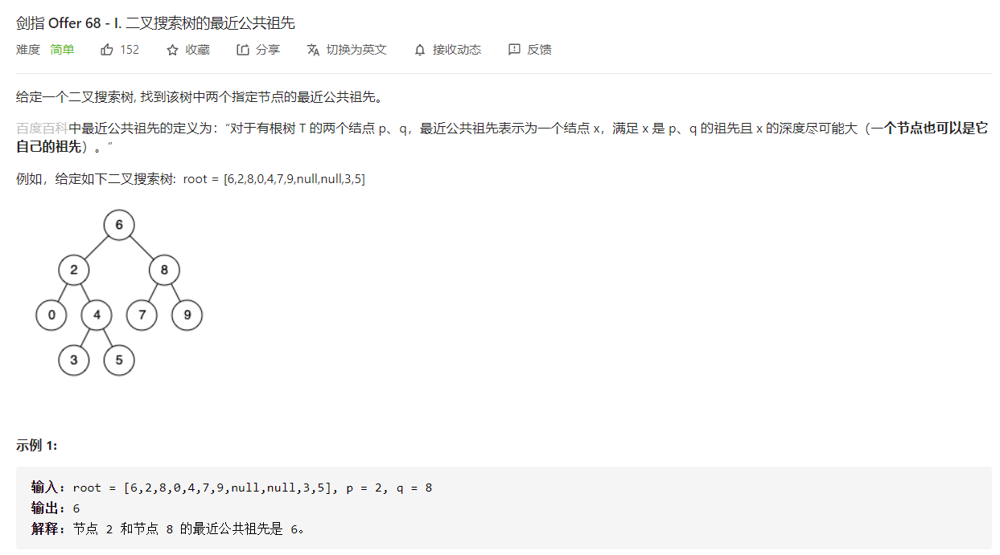

```python
class Solution:
    def lowestCommonAncestor(self, root: 'TreeNode', p: 'TreeNode', q: 'TreeNode') -> 'TreeNode':
        def helper(root,p,q):
            if not root: return
            if p.val == root.val or q.val == root.val: return root
            if p.val < root.val < q.val: return root
            if q.val < root.val: return helper(root.left,p,q)
            if p.val > root.val: return helper(root.right,p,q)
        if p.val > q.val:p,q = q,p
        return helper(root,p,q)
```


#### 236. 二叉树的最近公共祖先

>   $O(n)$ 解法

```python
# Definition for a binary tree node.
# class TreeNode:
#     def __init__(self, x):
#         self.val = x
#         self.left = None
#         self.right = None

class Solution:
    def lowestCommonAncestor(self, root: 'TreeNode', p: 'TreeNode', q: 'TreeNode') -> 'TreeNode':
        def helper(root,p,q):
            if root == p or root == q or not root: return root
            left = helper(root.left,p,q)
            right = helper(root.right,p,q)
            if not left and not right: return None
            if not left: return right
            if not right: return left
            return root
        
        return helper(root,p,q)
```

>   倍增LCA $O(\log n)$

针对的问题是大量查询，用空间换取时间，其中 `father[root][i] = father[father[root][i-1]][i-1]` 等价于：
$$
2^i= 2^{i-1} + 2^{i-1}
$$
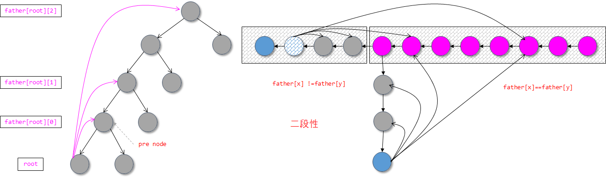

```python
# class TreeNode:
#     def __init__(self, x):
#         self.val = x
#         self.left = None
#         self.right = None
class Solution:
    def lowestCommonAncestor(self, root: TreeNode, p: TreeNode, q: TreeNode) -> TreeNode:
        maxd = 20
        depth_dict = collections.defaultdict(int)
        # fa[u][i]维护的是结点u向上走2 ^ i步后所到的结点
        father = collections.defaultdict(lambda :[0]*maxd)
        

        def dfs(root,pre,depth): # root 表示当前dfs节点，pre表示父节点
            if not root: return 
            father[root][0] = pre # 特殊判断
            depth_dict[root] = depth # 记录每个节点的深度
            
            i = 1
            while depth_dict[root]-(1<<i) >= 0:
                # 当前节点root，向上走2^i步 --> 
                #        当前节点的父节点向上走2^(i-1)步
                father[root][i] = father[father[root][i-1]][i-1]
                i += 1

            dfs(root.left,root,depth+1)
            dfs(root.right,root,depth+1)


        def up(root,d): # 将深度较深的那个节点提升相同深度
            if d == 0: return root
            for i in range(0,maxd):
                if (1<<i) & d: 
                    root = father[root][i]
            return root
                
        def lca(x,y):
            m = depth_dict[x] 
            n = depth_dict[y]
            if m > n:
                x,y = y,x
                m,n = n,m
            y = up(y,n-m) # promote y-val

            if x == y: return x

            for i in range(maxd-1,-1,-1):
                # 从大到小
                if father[x][i] != father[y][i]:
                    x = father[x][i]
                    y = father[y][i]
            return father[x][0]
        
        dfs(root,None,0)
        return lca(p,q)
    
```


#### 1483. 树节点的第 K 个祖先 🍉

>   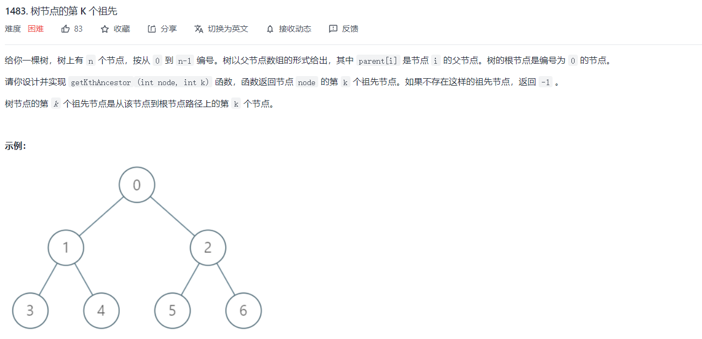
>
>   基本的思想还是利用倍增算法，
>
>   Binary Lifting 的本质其实是 dp。$dp[node][j] $ 存储的是 node 节点距离为 2^j 的祖先是谁。
>
>   根据定义，$dp[node][0]$ 就是 $parent[node]$，即 node 的距离为 1 的祖先是 $parent[node]$。
>
>   状态转移是： $dp[node][j] = dp[dp[node][j - 1]][j - 1]$
>

```python
class Node:
    def __init__(self,val):
        self.val = val
        self.childs = list()

class TreeAncestor:

    def __init__(self, n: int, parent: List[int]):
        self.n = n
        self.father = [[-1]*20 for i in range(n)]
        depth_dict = collections.defaultdict(int)
        
        def build_tree(parent):
            root = Node(0)
            node_map = {0:root}

            for i in range(1,n):
                node = Node(i)
                node_map[i] = node
            
            for i in range(1,n):
                node_map[parent[i]].childs.append(node_map[i])
            return root
        
        def helper(root,pre,depth):
            if not root: return None
            self.father[root.val][0] = pre.val if pre else -1 
            depth_dict[root] = depth

            # update
            i = 1
            while depth_dict[root]-(1<<i) >= 0:
                self.father[root.val][i] = self.father[self.father[root.val][i-1]][i-1]
                i += 1

            for child in root.childs:
                helper(child,root,depth+1)
            
        self.root = build_tree(parent)

        helper(self.root,None,0)

    def getKthAncestor(self, node: int, k: int) -> int:
        bit_arr = "{:b}".format(k)
        cur = node
        size = len(bit_arr)
        index = 0
        while index < size:
            if bit_arr[index] == "1":
                cur = self.father[cur][size-1-index]
            if cur == -1: break
            index += 1
        return cur


# Your TreeAncestor object will be instantiated and called as such:
# obj = TreeAncestor(n, parent)
# param_1 = obj.getKthAncestor(node,k)
```


#### 865. 具有所有最深节点的最小子树 🍉

>   
>
>   两种思路
>
>   +   第一种思路。首先找到这些节点，这些节点都在同一个深度上，那么向上遍历即可，直到所有节点都相同即可。
>
>   +   第二种思路，和递归形式的LCA类似，一遍dfs找到最大深度的节点，然后按照四种情况判断即可。
>   +   第三种思路，将上面两种混合起来，得到最大深度的节点，转化成哈希集合，然后利用LCA模板

+   第一种解法：

```python
# Definition for a binary tree node.
# class TreeNode:
#     def __init__(self, val=0, left=None, right=None):
#         self.val = val
#         self.left = left
#         self.right = right
class Solution:
    def subtreeWithAllDeepest(self, root: TreeNode) -> TreeNode:
        self.max_depth = 0
        depth_dict = collections.defaultdict(int)
        def helper(root,pre,depth):
            if not root: return
            depth_dict[root] = depth
            self.max_depth = max(self.max_depth,depth)
            helper(root.left,root,depth+1)
            helper(root.right,root,depth+1)
        
        def answer(root): # 通用模板
            if not root or depth_dict[root] == self.max_depth: 
                return root
            left = answer(root.left)
            right = answer(root.right)
            if not left and not right: return None
            if not left: return right
            if not right: return left
            return root

        helper(root,None,0)
        return answer(root)
```


+   第二种解法

    ```python
    # Definition for a binary tree node.
    # class TreeNode:
    #     def __init__(self, val=0, left=None, right=None):
    #         self.val = val
    #         self.left = left
    #         self.right = right
    class Solution:
        def subtreeWithAllDeepest(self, root: TreeNode) -> TreeNode:
            self.max_depth = 0
            depth_dict = collections.defaultdict(list)
            def helper(root,pre,depth):
                if not root: return
                root.father = pre
                depth_dict[depth].append(root)
                self.max_depth = max(self.max_depth,depth)
                helper(root.left,root,depth+1)
                helper(root.right,root,depth+1)
            
            def check(dep_nodes):
                first = dep_nodes[0]
                for i in range(1,len(dep_nodes)):
                    if first.val != dep_nodes[i].val: return True
                return False
    
            helper(root,None,0)
            dep_nodes = depth_dict[self.max_depth]
            if len(dep_nodes) == 1: return dep_nodes[0]
    
    
            while check(dep_nodes): # 向上遍历
                for i in range(len(dep_nodes)):
                    dep_nodes[i] = dep_nodes[i].father
            
            return dep_nodes[0]
    ```

    +   第三种思路

    ```python
    # Definition for a binary tree node.
    # class TreeNode:
    #     def __init__(self, val=0, left=None, right=None):
    #         self.val = val
    #         self.left = left
    #         self.right = right
    class Solution:
        def subtreeWithAllDeepest(self, root: TreeNode) -> TreeNode:
            self.max_depth = 0
            depth_dict = collections.defaultdict(list)
            def helper(root,pre,depth):
                if not root: return
                root.father = pre
                depth_dict[depth].append(root)
                self.max_depth = max(self.max_depth,depth)
                helper(root.left,root,depth+1)
                helper(root.right,root,depth+1)
    
            def answer(root): # 通用模板
                if not root or root in dep_nodes: 
                    return root
                left = answer(root.left)
                right = answer(root.right)
                if not left and not right: return None
                if not left: return right
                if not right: return left
                return root
    
            helper(root,None,0)
            dep_nodes = set(depth_dict[self.max_depth])
       
            return answer(root)
    ```

    

#### 987 二叉树的垂序遍历 🍉

>   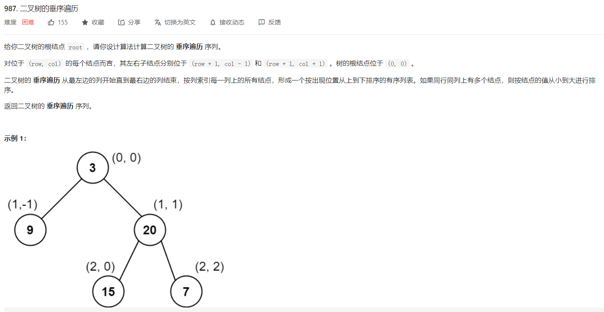
>
>   思路：
>
>   记录所有结点的坐标 (x,y) ，相同 x 的结点放在同一个列表。
>
>   输出时列表按 x 排序。列表中先按 y 排序，最后再按值排序即可。

```python
# Definition for a binary tree node.
# class TreeNode:
#     def __init__(self, val=0, left=None, right=None):
#         self.val = val
#         self.left = left
#         self.right = right
class Solution:
    def verticalTraversal(self, root: TreeNode) -> List[List[int]]:
        if not root: return []
        queue = collections.deque([(root,0,0)])
        ans = []
        while queue:
            size = len(queue)
            for i in range(size):
                cur,x,y = queue.popleft()
                ans.append([x,y,cur.val])
                if cur.left:  queue.append((cur.left,x-1,y+1))
                if cur.right: queue.append((cur.right,x+1,y+1))
        ans.sort(key=lambda x:[x[0],x[1],x[2]])
        
        res = collections.OrderedDict()
        for val in ans:
            if val[0] in res:
                res[val[0]].append(val[2])
            else:
                res[val[0]] = [val[2]]

        return list(res.values())
```


## 二叉搜索树

#### 95.不同的二叉搜索树 II & 96.不同的二叉搜索树 I & 108 将有序数组转成二叉树

+   95.  二叉搜索树可以有很多个，不同的根可以生成不同的二叉搜索树。遍历区间，左边生产左边树，右边生产右边树，然后对两者进行拼接。

```python
class Solution:
    def generateTrees(self, n: int) -> List[TreeNode]:
        def build(start,end):
            if start > end: return [None]
            if start == end: return [TreeNode(start)]
            
            ans = []
            for cur in range(start,end+1):
                left = build(start,cur-1)
                right = build(cur+1,end)

                for l in left: # left leaf value
                    for r in right: # right leaf value
                        root = TreeNode(cur)
                        root.left = l
                        root.right = r
                        ans.append(root)
            return ans
        
        return build(1,n)
```

+   96.  在I中需要注意的是[1,2]和[3,4]这两个区间能够建造的二叉搜索树的数量是一样的。

    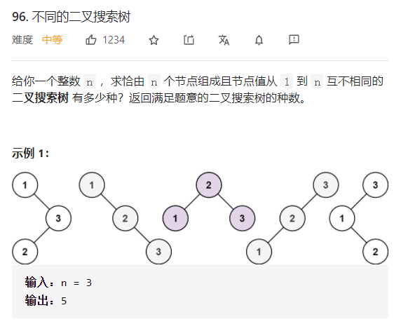

```python
class Solution:
    def numTrees(self, n: int) -> int:
        dp = [1]*(n+1)
        for i in range(1,n+1):
            dp[i] = sum([dp[j]*dp[i-j-1] for j in range(i)])
        return dp[n]
```


#### 剑指 Offer 33. 二叉搜索树的后序遍历序列 🍉

>   思路：这一题是判断某个序列是不是某个二叉搜索树的的后序遍历。扩展问题可以是判断是不是某个二叉搜索树的中序和前序遍历。
>
>   

```python
class Solution:
    def verifyPostorder(self, postorder: List[int]) -> bool:
        def helper(start,end):
            if start >= end: return True
            p = start
            while postorder[p] < postorder[end]:
                p += 1
            m = p
            while postorder[p] > postorder[end]:
                p += 1
            return p == end and helper(start,m-1) and helper(m,end-1)
        
        return helper(0,len(postorder)-1)
```


#### 剑指 Offer 36. 二叉搜索树与双向链表

>   `二叉树转化为链表`
>
>   思路：基于对二叉树进行变换，中序遍历中，利用三个指针，`self.head,self.prev,self.cur`来分别记录二叉树的最左边，上一个节点，以及当前节点。
>
>   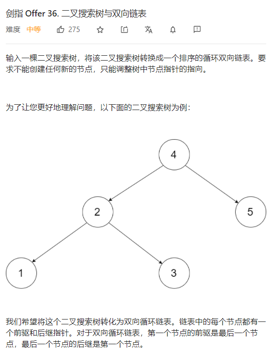

```python
"""
# Definition for a Node.
class Node:
    def __init__(self, val, left=None, right=None):
        self.val = val
        self.left = left
        self.right = right
"""
class Solution:
    def treeToDoublyList(self, root: 'Node') -> 'Node':
        if not root: return root
        # 二叉搜索树的中序遍历
        self.prev = None
        self.head = None

        def dfs(root):
            if not root: return

            dfs(root.left)
            if not self.prev:
                self.head = root
            else:
                self.prev.right = root
                root.left = self.prev
            self.prev = root
            
            dfs(root.right)
        
        dfs(root)
        self.head.left = self.prev
        self.prev.right = self.head

        return self.head
```


#### 230. 二叉搜索树中第K小的元素 

思路：递归或者迭代方法均可。进阶版问题，如果要面对多个查询如何解决。

```python
# Definition for a binary tree node.
# class TreeNode:
#     def __init__(self, val=0, left=None, right=None):
#         self.val = val
#         self.left = left
#         self.right = right
class Solution:
    def kthSmallest(self, root: TreeNode, k: int) -> int:
        # self.n = k
        # def helper(root):
        #     if not root: return None
            
        #     left = helper(root.left)
        #     if left is not None: return left
        #     self.n -= 1
        #     if self.n == 0: return root.val
        #     right = helper(root.right)
        #     if right is not None: return right
        # return helper(root)

        stack = []
        n = k
        while stack or root:
            while root:
                stack.append(root)
                root = root.left
            root = stack.pop()
            n -= 1
            if n == 0:
                return root.val
            root = root.right
```


#### 100 相同的树 & 101 对称二叉树

100 需要判断四种情况，p和q都为空，p为空q不为空，p不为空q为空，p和q都不为空。可以利用递归或者队列实现。

101 和100类似，不过需要判断当前根节点的左右节点是不是对称的。因此同样是上面四种情况，需要注意的是当p和q都不为空的时候且相等时候，需要判断当前左子树.left和右子树.right，这样才能形成对称判断。这里也可以使用迭代实现。

+   100

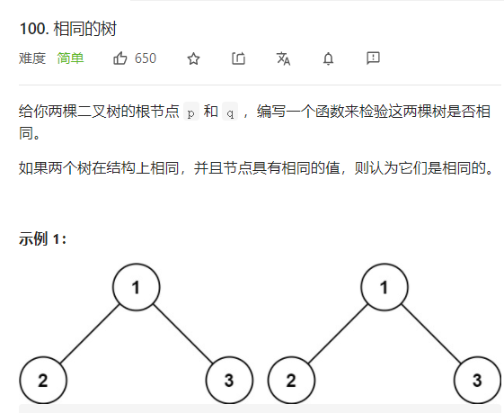

```python
def helper(root):
    queue = [root,root]
    while queue:
        p = queue.pop(0)
        q = queue.pop(0)
        if not p and not q:
            continue
        elif not p or not q:
            return False
        else:
            if p.val != q.val:
            	return False
            # 注意压入栈的顺序
            queue.append(p.left)
            queue.append(p.right)
            queue.append(q.right)
            queue.append(q.left)        
    return True
```

```python
class Solution:
    def isSameTree(self, p: TreeNode, q: TreeNode) -> bool:
        def helper(p,q):
            if not p and not q: return True
            if not p or not q: return False
            return p.val == q.val and \
                    helper(p.left,q.left) and \
                    helper(p.right,q.right)
        return helper(p,q)
```


+   101


```python
# Definition for a binary tree node.
# class TreeNode:
#     def __init__(self, val=0, left=None, right=None):
#         self.val = val
#         self.left = left
#         self.right = right
class Solution:
    def isSymmetric(self, root: TreeNode) -> bool:
        if not root: return True
        def helper(p,q):
            if not p and not q: return True
            if not p or not q: return False
            return p.val == q.val and helper(p.left,q.right) and helper(p.right,q.left)
        
        return helper(root.left,root.right)
```


#### 173. 二叉搜索树迭代器 🍉

>   思路：利用栈实现，将`while`循环中的stack入栈过程拆分出来。

```python
class BSTIterator:
    def __init__(self, root: TreeNode):
        self.stack = []
        self.root = root
        self.helper()

    def helper(self):
        while self.root:
            self.stack.append(self.root)
            self.root = self.root.left
    
    def next(self) -> int:
        self.root = self.stack.pop()
        ans = self.root.val
        self.root = self.root.right
        self.helper()
        return ans
        
    def hasNext(self) -> bool:
        return not (len(self.stack) == 0)
```


#### 105 从前序和中序恢复二叉树 106 从中序后序恢复二叉树

前序遍历的第一个元素可以将中序遍历划分成左子树和右子树，中序遍历的左子树数量可以确定前序遍历下一个index。

+   前序 + 中序

```python
# Definition for a binary tree node.
# class TreeNode:
#     def __init__(self, val=0, left=None, right=None):
#         self.val = val
#         self.left = left
#         self.right = right
class Solution:
    def buildTree(self, preorder: List[int], inorder: List[int]) -> TreeNode:
        inorder_dict = {inorder[i]:i for i in range(len(inorder))}

        def build(start,left,right): # include
            if left > right: return None

            mark = inorder_dict[preorder[start]]
            node = TreeNode(preorder[start])
            node.left = build(start+1,left,mark-1)
            node.right = build(start+(mark-left+1),mark+1,right)
            return node
        
        return build(0,0,len(inorder)-1)
```

+   中序 + 后序

```python
# Definition for a binary tree node.
# class TreeNode:
#     def __init__(self, val=0, left=None, right=None):
#         self.val = val
#         self.left = left
#         self.right = right
class Solution:
    def buildTree(self, inorder: List[int], postorder: List[int]) -> TreeNode:
        inorder_dict = {inorder[i]:i for i in range(len(inorder))}
        def helper(start,end,idx):
            if start >= end or idx < 0: return None
            mark = inorder_dict[postorder[idx]]
            node = TreeNode(inorder[mark])
            node.right = helper(mark+1,end,idx-1)
            node.left = helper(start,mark,idx-(end-mark))
            return node
        return helper(0,len(inorder),len(inorder)-1)
```

+   前序 + 后序

```python
# Definition for a binary tree node.
# class TreeNode:
#     def __init__(self, x):
#         self.val = x
#         self.left = None
#         self.right = None

class Solution:
    def constructFromPrePost(self, pre: List[int], post: List[int]) -> TreeNode:
        post_dict = {post[i]:i for i in range(len(post))}

        def helper(s1,e1,s2,e2):
            if s1 > e1: return None
            if s1 == e1: return TreeNode(pre[s1])
            cur = TreeNode(pre[s1])

            val = pre[s1+1]
            r2_post_idx = post_dict[val] # [4,5,2] 2的idx
            len = r2_post_idx - s2 + 1

            cur.left = helper(s1+1,s1+len,s2,r2_post_idx)
            cur.right = helper(s1+len+1,e1,r2_post_idx+1,e2-1)
            return cur
        
        return helper(0,len(pre)-1,0,len(post)-1)
```


#### 104树的最大深度 & 110 平衡二叉树 & 111$\leftarrow$ 二叉树的最小深度 & 543 二叉树直径 & 124 二叉树最大路径和

+   104  树的最大深度

```python
# Definition for a binary tree node.
# class TreeNode:
#     def __init__(self, val=0, left=None, right=None):
#         self.val = val
#         self.left = left
#         self.right = right
class Solution:
    def maxDepth(self, root: TreeNode) -> int:
        if not root: return 0
        return max(self.maxDepth(root.left),self.maxDepth(root.right))+1
```

+   110 平衡二叉树

```python
# Definition for a binary tree node.
# class TreeNode:
#     def __init__(self, val=0, left=None, right=None):
#         self.val = val
#         self.left = left
#         self.right = right
class Solution:
    def isBalanced(self, root: TreeNode) -> bool:
        def helper(root):
            if not root: return 0
            left = helper(root.left)
            right = helper(root.right)
            if left < 0 or right < 0: return -1
            if abs(left-right) > 1:
                return -1
            
            return max(left,right)+1
        
        return helper(root) >= 0
```


111 二叉树的最小深度 这一题很具有迷惑性，二叉树的深度除了可以用递归方法来做，还可以用迭代的方法来做，并且速度不会更慢。在利用递归方法求解时，需要注意根节点为空和叶子节点的处理。

```python
# Definition for a binary tree node.
# class TreeNode:
#     def __init__(self, val=0, left=None, right=None):
#         self.val = val
#         self.left = left
#         self.right = right
class Solution:
    def minDepth(self, root: TreeNode) -> int:
        if not root: return 0
        def helper(root):
            if not root: return float("inf")
            if not root.left and not root.right: return 1
            left = helper(root.left)
            right = helper(root.right)
            return min(left,right) + 1
        return helper(root)
```


124 最大路径和之类的问题需要注意的是负数问题，如果一个root的路径和（从根节点到叶节点）不能大于0，那么这个子树可以被完全抛弃。需要注意的是，（**计算的结果**）和（**返回的结果**）是两个不同的概念。

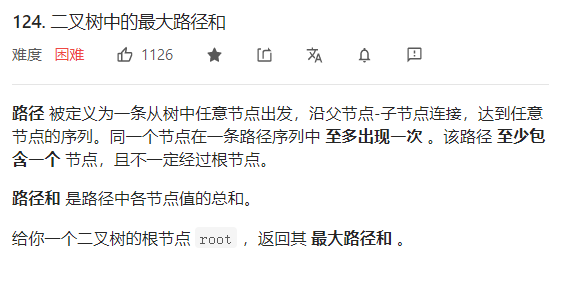

```python
# Definition for a binary tree node.
# class TreeNode:
#     def __init__(self, val=0, left=None, right=None):
#         self.val = val
#         self.left = left
#         self.right = right
class Solution:
    def maxPathSum(self, root: TreeNode) -> int:
        self.ans = float("-inf")
        def helper(root):
            if not root: return 0
            left = helper(root.left)
            right = helper(root.right)
            self.ans = max(self.ans,max(right,0)+max(left,0)+root.val)
            return max(max(left,right),0) + root.val
        helper(root)
        return self.ans
```


#### 112 路径总和 和 113 路径总和II 和 437. 路径总和 III 🍉

+   113 路径总和

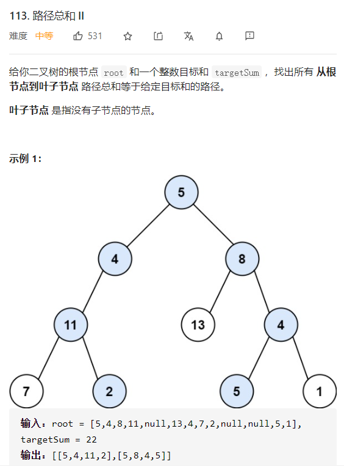

```python
# Definition for a binary tree node.
# class TreeNode:
#     def __init__(self, val=0, left=None, right=None):
#         self.val = val
#         self.left = left
#         self.right = right
class Solution:
    def pathSum(self, root: TreeNode, targetSum: int) -> List[List[int]]:
        self.ans = []
        def helper(root,target,path):
            if not root: return 
            if not root.left and not root.right and target == root.val:
                self.ans.append(path[:] + [target])
            
            helper(root.left,target-root.val,path + [root.val])
            helper(root.right,target-root.val,path + [root.val])
        helper(root,targetSum,[])
        return self.ans
```

+   437 路径总和

>   前缀和 + 哈希表

```python
# Definition for a binary tree node.
# class TreeNode:
#     def __init__(self, val=0, left=None, right=None):
#         self.val = val
#         self.left = left
#         self.right = right
class Solution:
    def pathSum(self, root: TreeNode, targetSum: int) -> int:
        self.hash_set = collections.defaultdict(int)
        self.hash_set[0] = 1 # 预先设置
        self.ans = 0

        def helper(root,pre_sum):
            if not root: return
            pre_sum += root.val
            self.ans += self.hash_set.get(pre_sum-targetSum,0)

            self.hash_set[pre_sum] += 1
            helper(root.left,pre_sum)
            helper(root.right,pre_sum)
            self.hash_set[pre_sum] -= 1
        
        helper(root,0)
        return self.ans
            
```


#### 297 二叉树的序列化和反序列化 

思路：可以采用`DFS`或者`BFS`，如果要求尽可能减少存储空间呢？比如最后面的`None`可以删除。

```python
# Definition for a binary tree node.
# class TreeNode(object):
#     def __init__(self, x):
#         self.val = x
#         self.left = None
#         self.right = None

class Codec:

    def serialize(self, root):
        """Encodes a tree to a single string.
        
        :type root: TreeNode
        :rtype: str
        """
        if not root: return "[]"
        queue = collections.deque([root])
        data = []
        while queue:
            cur = queue.popleft()
            if not cur: 
                data.append("none")
            else:
                data.append(str(cur.val))
                queue.append(cur.left)
                queue.append(cur.right)  
        
        i = len(data)-1
        while data[i] == "none":
            i -= 1
        return "[" + ",".join(data[:i+1]) + "]" 

        
    def deserialize(self, data):
        """Decodes your encoded data to tree.
        
        :type data: str
        :rtype: TreeNode
        """
        if len(data) == 2: return None
        data = data[1:-1].split(",")
        
        idx = 0
        root = TreeNode(data[idx])
        queue = collections.deque([root]) # 这里应该是个队列
        while queue:
            cur = queue.popleft() # popleft
            idx += 1
            if idx >= len(data) or data[idx] == "none":
                cur.left = None
            else:
                cur.left = TreeNode(data[idx])
                queue.append(cur.left)
            
            idx += 1
            if idx >= len(data) or data[idx] == "none":
                cur.right = None
            else:
                cur.right = TreeNode(data[idx])
                queue.append(cur.right)
            

        return root


# Your Codec object will be instantiated and called as such:
# ser = Codec()
# deser = Codec()
# ans = deser.deserialize(ser.serialize(root))
```


## 树节点进行增删改操作

#### 114. 二叉树展开为链表

思路：这一题和`剑指 Offer 36`最大的区别在于`剑指 Offer 36`要求中序遍历，而这一题要求前序遍历。那么问题来了，如果要求后序遍历呢？

```python
# Definition for a binary tree node.
# class TreeNode:
#     def __init__(self, val=0, left=None, right=None):
#         self.val = val
#         self.left = left
#         self.right = right
class Solution:
    def flatten(self, root: TreeNode) -> None:
        """
        Do not return anything, modify root in-place instead.
        """
        self.prev = None
        self.head = None

        def helper(root):
            if not root: return 

            left = root.left
            right = root.right
            if not self.prev:
                self.head = root
                self.prev = root
            else:
                self.prev.right = root
                self.prev.left = None
                self.prev = root

            helper(left)
            helper(right)
        
        helper(root)
        return self.head
```


#### [116. 填充每个节点的下一个右侧节点指针](https://leetcode-cn.com/problems/populating-next-right-pointers-in-each-node/) 🍉

>   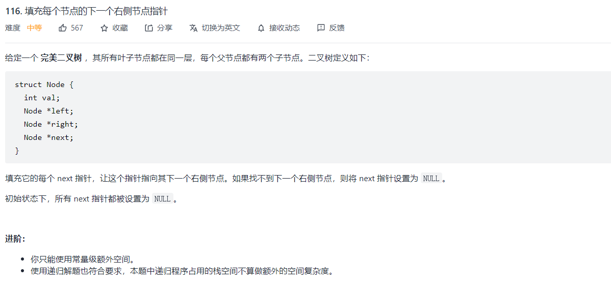
>
>   第一种递归解决方法：
>
>   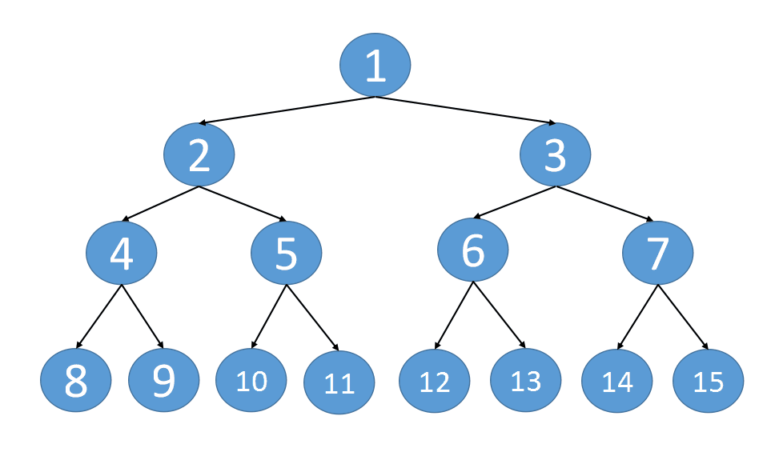
>
>   第二种递归思路：
>
>   ```python
>   """
>   # Definition for a Node.
>   class Node:
>       def __init__(self, val: int = 0, left: 'Node' = None, right: 'Node' = None, next: 'Node' = None):
>           self.val = val
>           self.left = left
>           self.right = right
>           self.next = next
>   """
>   
>   class Solution:
>       def connect(self, root: 'Node') -> 'Node':
>           """ 前提是完美二叉树 """
>           def helper(root):
>               if not root or not root.left: return root
>               root.left.next = root.right
>               if root.next:
>                   root.right.next = root.next.left
>               helper(root.left)
>               helper(root.right)
>   
>           helper(root)
>           return root
>               
>   ```


#### 99 恢复二叉搜索树

关键点在于定义两个mistake变量，用来记录两个被置换的变量。然后进行中序遍历

```python
mistake1,mistake2 = None,None
pre = None
def dfs(root):
    if not root: return
    dfs(root.left)
    if not pre:
        pre = root
    else:
        if pre.val > root.val:
            mistake1 = pre
            mistake2 = root
        else:
            mistake2 = root
            return
        pre = root
    dfs(root.right)
mistake1.val,mistake2.val = mistake2.val,mistake1.val
```


#### 538. 把二叉搜索树转换为累加树

思路：考虑当前的一棵树，应该考虑当前节点的父节点已经累积了多少数

```python
def helper(root,val):
    if not root: return val
    r = helper(root.right,val)
    root.val += r
    l = helper(root.left,root.val)
    return l
```


#### 669. 修剪二叉搜索树

>   思考：考虑某一个节点，如果当前 `root.val<low`，说明当前的`root`和左边的子树都应该被删除；如果当前`root.val>high`，则说明当前的root和右边的子树都应该被删除。这一题应该同样思考到`98. 验证二叉搜索树`，见TODO-list。
>
>   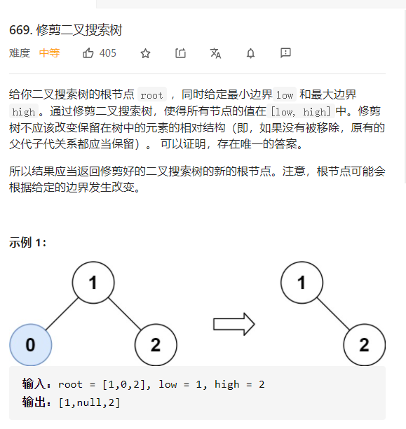


```python
# 第一种情况，抛弃root.val和root.left
	       root.val
          /         \
root.left            root.right
                     [low    high]
    
# 第二种情况，抛弃root.val和root.right
               root.val
              /         \
    root.left            root.right
[low    high]
```

```python
class Solution:
    def trimBST(self, root: TreeNode, low: int, high: int) -> TreeNode:
        def helper(root,low,high):
            if not root: return None
            if root.val > high:
                return helper(root.left,low,high)
            elif root.val < low:
                return helper(root.right,low,high)
            else:
                root.left = helper(root.left,low,root.val)
                root.right = helper(root.right,root.val,high)
                return root
        
        return helper(root,low,high)
```


#### 938. 二叉搜索树的范围和

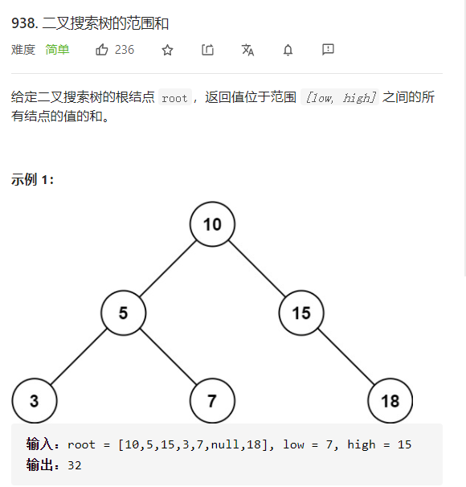

思路：这一题和669类似。

```python
# Definition for a binary tree node.
# class TreeNode:
#     def __init__(self, val=0, left=None, right=None):
#         self.val = val
#         self.left = left
#         self.right = right
class Solution:
    def rangeSumBST(self, root: TreeNode, low: int, high: int) -> int:
        def helper(root,low,high):
            if not root: return 0
            if root.val > high:
                return helper(root.left,low,high)
            if root.val < low: 
                return helper(root.right,low,high)

            left = helper(root.left,low,high)
            right = helper(root.right,low,high)
            return left + right + root.val
        
        return helper(root,low,high)
```


#### 897 递增顺序搜索树

题目：给你一棵二叉搜索树，请你 **按中序遍历** 将其重新排列为一棵递增顺序搜索树，使树中最左边的节点成为树的根节点，并且每个节点没有左子节点，只有一个右子节点。


```python
class Solution:
    def increasingBST(self, root: TreeNode) -> TreeNode:
        self.prev = None
        self.head = None

        def helper(root):
            if not root: return

            helper(root.left)

            if self.prev == None:
                self.head = root
                self.prev = root
            else:
                root.left = None
                self.prev.right = root
                self.prev = root
            
            helper(root.right)
        
        helper(root)
        return self.head
```


#### 1110. 删点为林

>   思路：明确递归三条件。
>
>   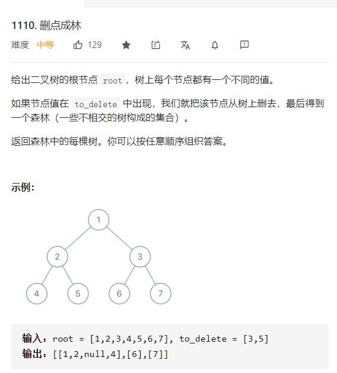

```python
class Solution:
    def delNodes(self, root: TreeNode, to_delete: List[int]) -> List[TreeNode]:
        to_delete = set(to_delete)
        self.ans = []
        def helper(root):
            if not root: return None
            
            root.left = helper(root.left) # 正常地向左边遍历
            root.right = helper(root.right) # 正常地向右边遍历

            if root.val in to_delete: # 如果在待删除地节点中，将左边和右边的节点加入结果中
                if root.left: self.ans.append(root.left)
                if root.right: self.ans.append(root.right)
                return None # 返回None表示删除当前节点
            else:
                return root # 返回root表示不删除，而正常进行

        root = helper(root)
        if root: self.ans.append(root)
        return self.ans
```


#### 450. 删除二叉搜索树中的节点

>    思路：删除二叉搜索树必然涉及到对二叉树节点的调整，为了实现这样的功能，最重要的一个步骤就是进行most_right或者most_left的操作。
>
>    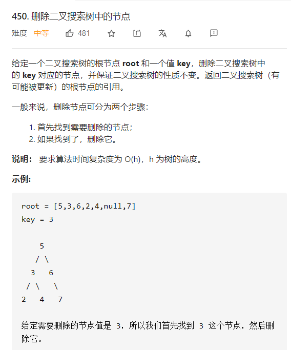
>
>    


```python
class Solution:
    def deleteNode(self, root: TreeNode, key: int) -> TreeNode:
        def helper(root,key):
            if not root: return None
            if root.val > key: 
                root.left = helper(root.left,key)
            elif root.val < key:
                root.right = helper(root.right,key)
            else:
                if not root.left and not root.right: return None
                if not root.left: return root.right
                if not root.right: return root.left
                node = root.right
                while node.left:
                    node = node.left
                node.left = root.left
                root = root.right
            return root
        
        return helper(root,key)
```


#### 124 二叉树最大路径和 & 543 二叉树最大直径

思路：这两题的基本思路一致，一个全局变量记录当前最大值，返回到上一层是当前单向路径的最大值

```python
def helper(root):
    if not root: return 0
    left = helper(root,left)
    right = helper(root.right)
    max_val = max(left+right+1,max_val)
    return max(left,right)+1

def helper(root):
    if not root: return 0
    left = helper(root,left)
    right = helper(root.right)
    max_val = max(left+right+root.val,max_val)
    return max(max(left,right)+root.val,0)    
```


##  双/多重递归

#### 572. 另一个树的子树 🍉

思路：双重搜索，一个dfs遍历每一个节点，然后一个递归，判断两个子树是否相同。能不能有更好的解法，有，将二叉树序列化，然后判断子串是否存在。

```python
class Solution(object):

    def isSubtree(self, s, t):
        """
        :type s: TreeNode
        :type t: TreeNode
        :rtype: bool
        """
        def ser(root):
            if not root:    
                return '#'
            st=' '+str(ser(root.left))+' '+str(ser(root.right))+' '+str(root.val)+' ' #前后加空格，避免[12][1]的情况误判
            return st
        
        return ser(t) in ser(s)
```


#### 863. 二叉树中所有距离为 K 的结点 🍉

>    思路：树转图

```python
class Solution:
    def distanceK(self, root: TreeNode, target: TreeNode, K: int) -> List[int]:
        from collections import defaultdict
        self.visited = defaultdict(lambda: False)
        def dfs(root):
            if not root: return
            self.visited[root] = False
            if root.left: root.left.parent = root
            if root.right: root.right.parent = root
            dfs(root.left)
            dfs(root.right)
            return root
        
        root.parent = None
        dfs(root)

        k = K
        ans = []
        queue = [target]
        self.visited[target] = True
        while queue:
            size = len(queue)
            k -= 1
            for i in range(size):
                curr = queue.pop(0)
                if k == -1: 
                    ans.append(curr.val)
                    continue
                for next_point in [curr.parent,curr.right,curr.left]:
                    if (next_point is not None) and (not self.visited[next_point]):
                        self.visited[next_point] = True
                        queue.append(next_point)
        return ans
```


[j]:
