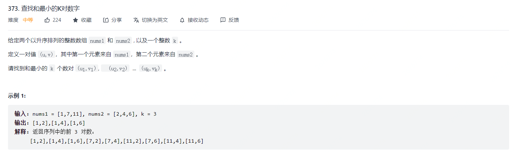
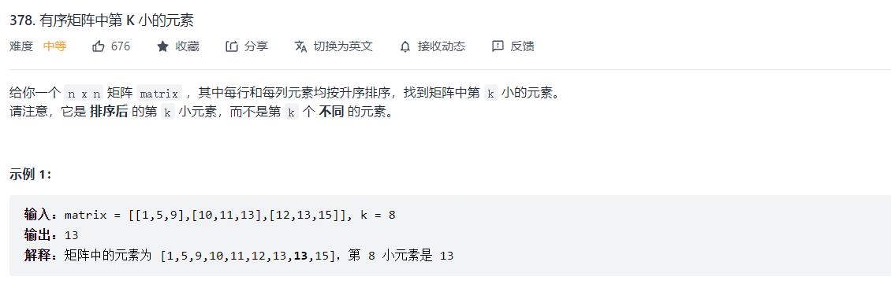
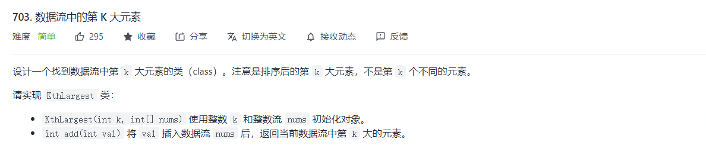
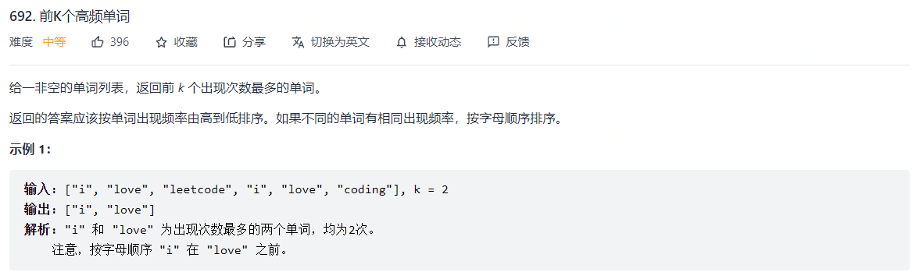
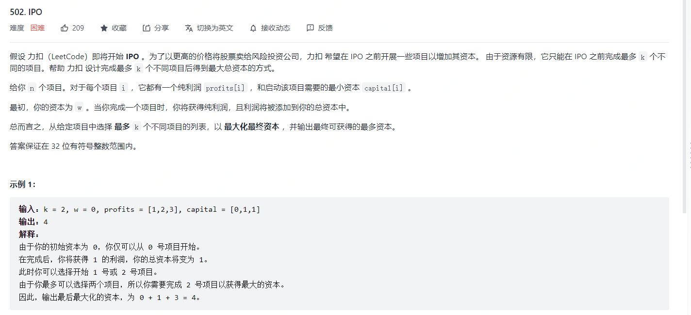
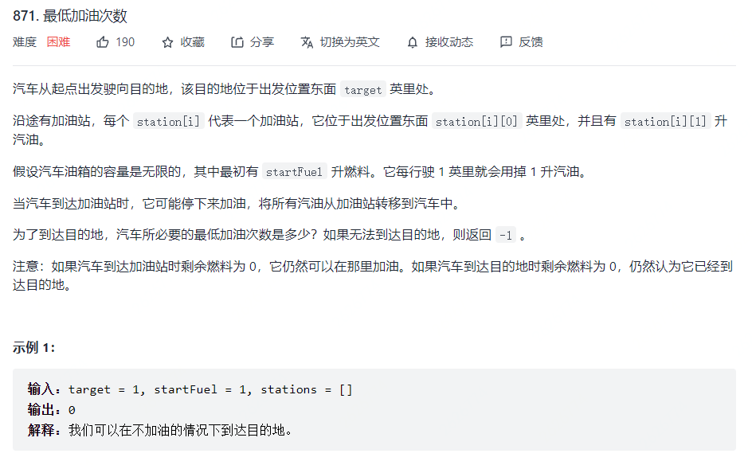
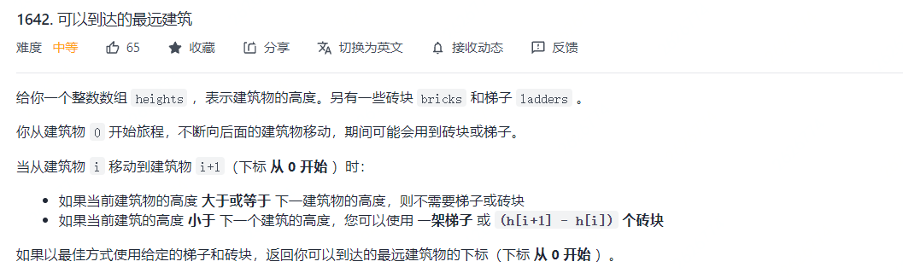
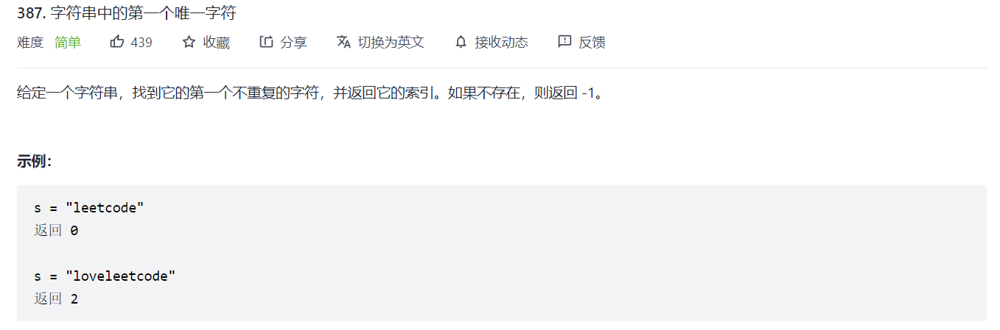
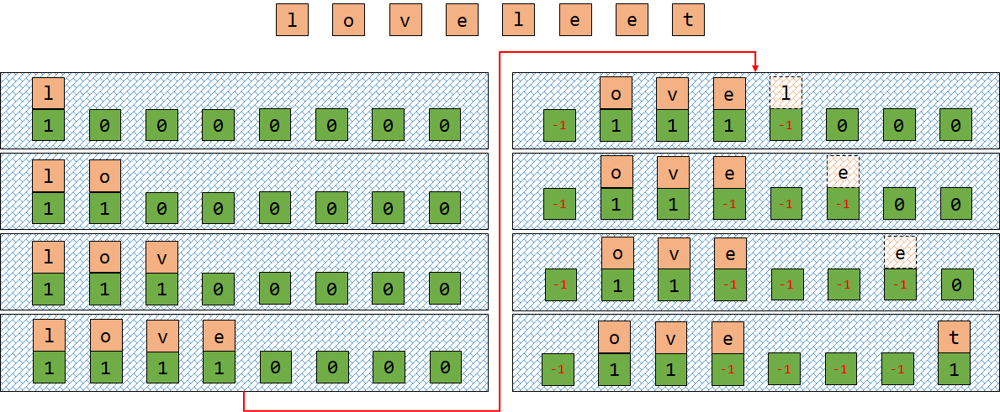

[TOC]


优先队列可以在`O(1)`时间内获取最大值，并且可以在`O(lon(n))`的时间内取出最大值（取出之后需要调整优先队列）或插入任意值。

优先队列常常利用堆`heap`来实现，堆是一个完全二叉树，每个节点的值总大于等于子节点的值，通常利用一个数组而不是指针来实现堆，通常需要注意的是**上浮操作**和**下沉操作**。

python内部可以通过`heapq`来实现，也可以通过`Queue`的`PriorityQueue`来实现，不过`PriorityQueue`本质上也是利用`heapq`来实现的。

## 基础知识系列

#### Python重写对象实现大根堆

```python
class Point:
    def __init__(self,data):
        self.loc = data
        self.dis = math.sqrt(data[0]**2+data[1]**2)
    
    def __gt__(self,other):
        return self.dis < other.dis # 这里需要注意。写的是小于号

```


## TopK系列

#### 剑指 Offer 40. 最小的k个数

思路：利用最小堆实现解决方案。


#### 373. 查找和最小的K对数字 🍉

>   
>
>   思路：利用最小堆加哈希表。

```python
class Solution:
    def kSmallestPairs(self, nums1: List[int], nums2: List[int], k: int) -> List[List[int]]:
        m = len(nums1)
        n = len(nums2)
        i,j = 0,0
        H = [(nums1[i]+nums2[j],i,j)]
        heapify(H)
        K = k
        ans = []
        ans_set = set()
        while H:
            print(H[0],H)
            num,p_i,p_j = heappop(H)
            ans.append([nums1[p_i],nums2[p_j]])
            K -= 1
            if K == 0:  break
            if p_i+1 < m and p_j+1 < n: 
                if (p_i+1,p_j) not in ans_set:
                    ans_set.add((p_i+1,p_j))
                    heappush(H,(nums1[p_i+1]+nums2[p_j],p_i+1,p_j))
                if (p_i,p_j+1) not in ans_set:
                    ans_set.add((p_i,p_j+1))
                    heappush(H,(nums1[p_i]+nums2[p_j+1],p_i,p_j+1))
            elif p_i+1 < m:
                if (p_i+1,p_j) not in ans_set:
                    ans_set.add((p_i+1,p_j))
                    heappush(H,(nums1[p_i+1]+nums2[p_j],p_i+1,p_j))
            elif p_j+1 < n:
                if (p_i,p_j+1) not in ans_set:
                    ans_set.add((p_i,p_j+1))
                    heappush(H,(nums1[p_i]+nums2[p_j+1],p_i,p_j+1))
            else:
                break
        return ans
```


#### 378. 有序矩阵中第 K 小的元素

>   
>
>   思路：
>
>   +   $(1)$ 同373题，利用最小堆加哈希表
>
>   +   $(2)$ 利用值域上的二分法

```python
class Solution:
    def kthSmallest(self, matrix: List[List[int]], k: int) -> int:
        n = len(matrix)
        H = [(matrix[0][0],0,0)]
        heapify(H)
        ans = None
        ans_set = set()
        K = k
        while H:
            num,p_i,p_j = heappop(H)
            ans = num
            K -= 1
            if K == 0:
                break            
            if (p_i + 1 < n) and (p_j + 1 < n):
                if (p_i+1,p_j) not in ans_set:
                    ans_set.add((p_i+1,p_j))
                    heappush(H,(matrix[p_i+1][p_j],p_i+1,p_j))
                if (p_i,p_j+1) not in ans_set:
                    ans_set.add((p_i,p_j+1))
                    heappush(H,(matrix[p_i][p_j+1],p_i,p_j+1))
            elif p_i + 1 < n:
                if (p_i+1,p_j) not in ans_set:
                    ans_set.add((p_i+1,p_j))
                    heappush(H,(matrix[p_i+1][p_j],p_i+1,p_j))
            elif p_j + 1 < n:
                if (p_i,p_j+1) not in ans_set:
                    ans_set.add((p_i,p_j+1))
                    heappush(H,(matrix[p_i][p_j+1],p_i,p_j+1))
            else:
                break
        return ans
```


#### 703. 数据流中的第 K 大元素

>   
>
>   思路：利用最小堆。


#### 692. 前K个高频单词

>   
>
>   思路：和前k个高频字符类似，但是这一题还需要比较单词与单词之间的关系，同时在输出的时候我们需要对堆进行反向输出


## 贪心 + 优先队列系列

#### 264. 丑数 II

思路：丑数的定义是一个数可以被2，3，5中的一个或者多个乘积组成，除此之外1也是丑数。任何一个丑数，乘上`2,3,5`都会是丑数，开始情况下：`{1,2,3,5}`都是丑数，那么`{2*2,2*3,2*5}`是丑数，一个是保证乘积的第一个数是最小的，第二个是避免重复。第一个利用最小堆来实现，第二个里利用if判断语句实现。

```python
# 堆的数据结构：[(2,2),(3,3)]，也就是说每个数只会和比他等级大或者相等的元素相乘，比如会有2*3，但不会有3*2.
H = [(2,2),(3,3),(5,5)]
heapify(H)
for i in range(n-1):
    num,p = heappop(H)
    heappush(H,(num*2,2))
    if p >= 3:
	    heappush(H,(num*3,3))
        if p >= 5:
            heappush(H,(num*5,5))
return num
```

#### 502. IPO

>   
>
>   思路：排序+大根堆


####  871. 最低加油次数

>   
>
>   思路：优先队列+贪心

```python
class Solution:
    def minRefuelStops(self, target: int, startFuel: int, stations: List[List[int]]) -> int:
        W = startFuel # 表示当前拥有的油量
        count = 0
        H = []
        heapify(H)
        idx = 0        
        while W < target:
            while idx < len(stations) and W >= stations[idx][0]:
                heappush(H,-stations[idx][1])
                idx += 1
            if not H: return -1
            else:
                count += 1
                W += -heappop(H)        
        return count
```


#### 1642. 可以到达的最远建筑 `堆+贪心`

>   
>
>   思路：优先队列+贪心，优先使用梯子，如果梯子用完了，那么就从爬过的楼房里面找出高度最小的，用砖块，如果砖块也用完了，则返回。

```python
class Solution:
    def furthestBuilding(self, heights: List[int], bricks: int, ladders: int) -> int:
        H = []
        heapify(H)
        total_bricks = 0
        for i in range(1,len(heights)):
            diff = heights[i] - heights[i-1]
            if diff > 0:
                heappush(H,diff)
                if len(H) > ladders:
                    total_bricks += heappop(H)
                if total_bricks > bricks:
                    return i - 1
        return len(heights)-1
```


#### 253. 会议室 II

```markdow
给你一个会议时间安排的数组 intervals ，每个会议时间都会包括开始和结束的时间 intervals[i] = [starti, endi] ，为避免会议冲突，同时要考虑充分利用会议室资源，请你计算至少需要多少间会议室，才能满足这些会议安排。

输入：intervals = [[0,30],[5,10],[15,20]]
输出：2
```

思路：堆，堆中存放当前需要安排的会议室的结束时间

```python
class Solution:
    def minMeetingRooms(self, intervals: List[List[int]]) -> int:
        intervals.sort()
        rooms = []
        heapify(rooms)

        # 初始化，将第一个会议时间段加入
        heappush(rooms,intervals[0][1])
        for i in range(1,len(intervals)):
            if rooms[0] <= intervals[i][0]:
                # 如果堆中会议的最小结束时间是小于下一场会议的开始时间
                # 那么替换掉当前最小会议
                heapreplace(rooms,intervals[i][1])
            else:
                # 如果堆中会议的最小结束时间是大于下一场会议的开始时间
                # 那么加入当前会议
                heappush(rooms,intervals[i][1])
        return len(rooms)
```


#### 407. 接雨水 II

>   
>
>   思路：利用最小堆加上BFS的思想进行搜索。这一题的思路实际上和`42. 接雨水`思想类似，都是讲最外层看成是围栏，然后从围栏小的地方进行突破。

```python
class Solution:
    def trapRainWater(self, heightMap: List[List[int]]) -> int:
        m,n = len(heightMap),len(heightMap[0])
        hp = []
        visited = [[False]*n for _ in range(m)]
        # 最外围最小堆
        for i in range(m):
            for j in range(n):
                if i == 0 or j == 0 or i == m-1 or j == n-1:
                    heapq.heappush(hp,(heightMap[i][j],i,j))
                    visited[i][j] = True
        
        ans = 0
        directions = [[0,1],[0,-1],[1,0],[-1,0]]
        while hp:
            h,i,j = heapq.heappop(hp)
            for direction in directions:
                x = i + direction[0]
                y = j + direction[1]
                if x >= 0 and x < m and y >= 0 and y < n and not visited[x][y]:
                    if h > heightMap[x][y]: # 围栏比内部高
                        ans += (h-heightMap[x][y])
                    visited[x][y] = True
                    heapq.heappush(hp,(max(h,heightMap[x][y]),x,y))
        return ans

```


## API 设计系列


#### 295. 数据流的中位数  `Hard`

思路：中位数的寻找，基本的思路可以是再每次添加数据的时候，利用二分查找，保证插入数据的顺序性。但是再寻找中位数的过程中，我们并不需要保证数据完全有序。因此可以维护一个大根堆和小根堆：小根堆里面存放较大的数，大根堆存放较小的数。同时为了维护数据的分割性和平衡性，根据数据的奇偶性，进行数据的调整。

```python
class HeapMiddle:
    def __init__(self):
        self.min_heap = []
        self.max_heap = []
    
    def addNum(self,x):
        # 当前数据数量奇偶
        # 1. 奇数，说明小根堆数量较多，因此先将数据添加到小根堆中，然后将小根堆的堆顶弹出，并加入到大根堆中
        # 2. 偶数，说明大小根堆数量一样，因此先将数据添加到大根堆中，然后将大根堆的堆顶弹出，并加入到小根堆中
        if len(self.min_heap) == len(self.max_heap):
            heapq.heappush(self.max_heap,-num)
            heapq.heappush(self.min_heap,-heapq.heappop(self.max_heap))
        else:
            heapq.heappush(self.min_heap,num)
            heapq.heappush(self.max_heap,-heapq.heappop(self.min_heap))
    
    def getMiddle(self):
        # 当前数据数量奇偶
        # 1. 奇数，返回小根堆堆顶计算中位数
        # 2. 偶数，利用大根堆和小根堆堆顶计算中位数
        if len(self.min_heap) == len(self.max_heap):
            return (-self.max_heap[0] + self.min_heap[0]) / 2
        else:
            return self.min_heap[0]
```


#### 剑指 Offer 59 - II. 队列的最大值

>   
>
>   思路：维护一个`单调递减`队列，我们只需记住当前最大值出队后，队列里的下一个最大值即可。

```python
class MaxQueue:

    def __init__(self):
        self.queue = collections.deque([])
        self.aux_queue = collections.deque([])

    def max_value(self) -> int:
        if not self.queue: return -1
        return self.aux_queue[0]

    def push_back(self, value: int) -> None:
        self.queue.append(value)
        while self.aux_queue and self.aux_queue[-1] < value:
            self.aux_queue.pop()
        self.aux_queue.append(value)

    def pop_front(self) -> int:
        if not self.queue: return -1
        val = self.queue.popleft()
        if self.aux_queue[0] == val:
            self.aux_queue.popleft()
        return val
        
# Your MaxQueue object will be instantiated and called as such:
# obj = MaxQueue()
# param_1 = obj.max_value()
# obj.push_back(value)
# param_3 = obj.pop_front()
```


## 延迟删除系列

#### 387. 字符串中的第一个唯一字符 🍉

>    [4 - 数学运算.md](4 - 数学运算.md) 
>
>   利用队列和哈希表试下延迟删除功能。
>
>   

```python
class Solution:
    def firstUniqChar(self, s: str) -> int:
        visited = [0]*26
        queue = collections.deque([])
        n = len(s)

        for i in range(n):
            c = s[i]
            if visited[ord(c)-97] == 0:
                visited[ord(c)-97] = 1
                queue.append((i,c))
            else:
                visited[ord(c)-97] = -1
                while queue and visited[ord(queue[0][1])-97] == -1:
                    queue.popleft()
            
        return -1 if not queue else queue[0][0]
```

