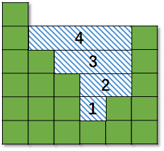
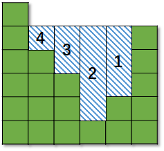
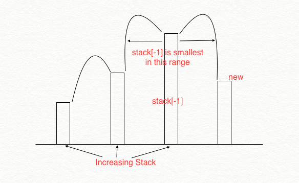

[TOC]

#### 42 接雨水

>   ​    **单调栈（水平填充）：**维护一个单调递减栈。
>
>   ​    如果违反了单调性，意味着我们可以在这个范围内装水，更新结果
>
>   ​    否则，继续。
>
>   

```python
class Solution:
    def trap(self, height: List[int]) -> int:
        stack = []
        n = len(height)
        fill = 0

        for i in range(n):
            while stack and height[stack[-1]] < height[i]:
                lower = stack.pop()
                if not stack: break
                h = min(height[stack[-1]],height[i]) - height[lower]
                w = i - stack[-1] - 1
                fill += (h*w)
            stack.append(i)
        return fill
```

>   **双指针（垂直填充）：** 
>
>   维护左右指针，根据短板原理，优先从较低的位置开始填充。
>
>   

```python
class Solution:
    def trap(self, height: List[int]) -> int:
        left,right = 0,len(height)-1

        fill = 0
        while left < right:
            if height[left] >= height[right]:
                if height[right-1] < height[right]:
                    fill += (height[right] - height[right-1])
                    height[right-1] = height[right]
                right -= 1
            else:
                if height[left+1] < height[left]:
                    fill += (height[left] - height[left+1])
                    height[left+1] = height[left]
                left += 1
        return fill
```


#### 84 柱状图中最大的矩形

>   **单调栈：**
>
>   这一题和42题最大的区别在于，42题是补全，而这一题是从直方图中抠出最大矩形。
>
>   ​    维护单调递增栈。
>
>   ​    如果下一个数据比当前高，那么当前高度不能作为结束条件。
>
>   ​    如果下一个数据比当前低，那么当前高度的最大值可以直接计算，作为结束条件。

```python
class Solution:
    def largestRectangleArea(self, heights: List[int]) -> int:
        stack = []
        heights = [0] + heights + [0] # 技巧一：哨兵
        n = len(heights)
        ans = 0
        for i in range(n):
            while stack and heights[stack[-1]] > heights[i]:
                h = heights[stack.pop()]
                # 技巧二：确定左右边界
                if not stack: left = 0
                else: left = stack[-1] + 1
                w = i - left
                ans = max(ans,w*h)
            stack.append(i)
        
        return ans

```

>   **暴力法：**
>
>   以每一个点开始，进行中心扩散，暴力求解。


#### 239. 滑动窗口最大值

>   **单调队列：**
>
>    维护一个单调递减栈，这样当前的最大值被放置在最左边，因为要求最大值。
>
>   ​      \1. 先将前k个元素入栈，维护单调性。
>
>   ​      \2. 然后依次将后面的数据入栈，并维护单调性。栈的底部作为最大值（所以需要双向队列）
>
>   ​      【如果维护的是单调递增栈，那么如果新来的元素比较小，那么栈顶的元素（大）会被抛弃】

```python
class Solution:
    def maxSlidingWindow(self, nums: List[int], k: int) -> List[int]:
        """
            维护一个单调递减栈，因为要求最大值。
            1. 先将前k个元素入栈，维护单调性。
            2. 然后依次将后面的数据入栈，并维护单调性。栈的底部作为最大值（所以需要双向队列）
            【如果维护的是单调递增栈，那么如果新来的元素比较小，那么栈顶的元素（大）会被抛弃】
        """
        n = len(nums)
        ans = []

        queue = collections.deque()
        for i in range(k):
            while queue and nums[queue[-1]] < nums[i]:
                queue.pop()
            queue.append(i)
        ans.append(nums[queue[0]])

        for i in range(k,n):
            while queue and nums[queue[-1]] < nums[i]:
                queue.pop()
            queue.append(i)

            while i - queue[0] >= k:
                queue.popleft()
            ans.append(nums[queue[0]])
        
        return ans
```


#### 316 去除重复字母

>   ​    **字典序 + 哈希表 + 单调栈:**
>
>   ​    去除重复字母，并保证字典序最小。
>
>   ​    去重怎么解决：利用哈希表来解决。
>
>   ​    怎么保证字典序最小：利用单调递增栈来解决。
>
>   
>
>   ​    因为后面是否还有当前字符对于最终答案的计算十分重要，所以这一题
>
>   ​    的基本思路是：
>
>   ​    \1. 首先计算出每个字符的出现频率
>
>   ​    \2. 然后遍历字符串：
>
>   ​      如果字符已经在目标串中，则略过当前字符。
>
>   ​      如果字符不再目标串，则进行单调栈处理，保证字典序。

```python
class Solution:
    def removeDuplicateLetters(self, s: str) -> str:
        s_count = collections.Counter(s)
        n = len(s)
        visited = set()
        stack = []

        for i in range(n):
            val = s[i]
            if val not in visited:
                while stack and s[stack[-1]] > val and s_count[s[stack[-1]]] > 0:
                    visited.discard(s[stack.pop()])
                stack.append(i)
                visited.add(val)
            s_count[val] -= 1
        return "".join([s[i] for i in stack])
```

#### 321. 拼接最大数

>   ​    基本思路：从num1中选取m个元素，从num2中选取n个元素，然后组合得到最大的那个数。
>
>   ​    🚀 在进行组合的时候：
>
>   ​      如果当前数据有明确的大小比较，则按照较大的在前，较小的在后。
>
>   ​      如果当前数据相等，对于字典序而言，比较方法应该为：比较 s1[i+1:],s2[j+1:]
>
>   ​      比如： 1065和2077，在0相等的时候，应该比较65和77，从而确定下一个数字。

```python
class Solution:
    def maxNumber(self, nums1: List[int], nums2: List[int], k: int) -> List[int]:
        """
        基本思路：从num1中选取m个元素，从num2中选取n个元素，然后组合得到最大的那个数。
        🚀 在进行组合的时候：
            如果当前数据有明确的大小比较，则按照较大的在前，较小的在后。
            如果当前数据相等，对于字典序而言，比较方法应该为：比较 s1[i+1:],s2[j+1:]
            比如： 1065和2077，在0相等的时候，应该比较65和77，从而确定下一个数字。

        """
        def combine(s1,s2):
            m = len(s1)
            n = len(s2)

            ans = ""
            i = j = 0
            while i < m and j < n:
                if s1[i] > s2[j]:
                    ans += s1[i]
                    i += 1
                elif s1[i] < s2[j]:
                    ans += s2[j]
                    j += 1
                else:
                    # 直接取得后面的数进行比较
                    if s1[i+1:] >= s2[j+1:]:
                        ans += s1[i]
                        i += 1
                    else:
                        ans += s2[j]
                        j += 1
            while i < m:
                ans += s1[i]
                i += 1
            while j < n:
                ans += s2[j]
                j += 1
            return int(ans)
        
        def findK(nums,k):
            """维护单调递减栈"""
            stack = []
            n = len(nums)
            k = n - k
            for i in range(n):
                while stack and nums[stack[-1]] < nums[i] and k > 0:
                    stack.pop()
                    k -= 1
                stack.append(i)
            while k > 0:
                stack.pop()
                k -= 1
            return "".join([str(nums[i]) for i in stack])
        
        ans = max([combine(findK(nums1,i),findK(nums2,k-i)) for i in range(k+1)])
        return list(map(int,list(str(ans))))
```


####  402. 移掉K位数字

>   **字典序 + 单调栈**：
>
>   ​    维护一个单调递增栈，结合字典序的概念，当删除的数字数量达到k之后；
>
>   ​    后面的不用判断直接加入
>
>   ​    13 < 14
>
>   ​    123 < 122

```python
class Solution:
    def removeKdigits(self, num: str, k: int) -> str:
        stack = []
        n = len(num)
        for i in range(n):
            while k > 0 and stack and num[stack[-1]] > num[i]:
                stack.pop()
                k -= 1
            stack.append(i)
        
        # 将多余的元素剔除
        while k > 0: 
            k -= 1
            stack.pop()
        
        # 拼接最终结果
        ans = "".join([num[index] for index in stack]).lstrip("0")
        return "0" if ans == "" else ans
```


#### 496. 下一个更大元素 I

>   **暴力解法：**，先定位元素，然后向右边搜索。


>   **单调栈 + 哈希表**
>
>   \1. 建立一个字典，对应：{nums2[i]:下一个较大元素}
>
>   \2. 基于单调栈，求出nums2中下一个较大元素，并存放到字典中
>
>   \3. 将字典中的数据映射到nums1结果中

```python
class Solution:
    def nextGreaterElement(self, nums1: List[int], nums2: List[int]) -> List[int]:
        nums2_dict = collections.defaultdict(lambda:-1)
        n = len(nums2)

        stack = []
        for i in range(n):
            while stack and nums2[stack[-1]] < nums2[i]:
                nums2_dict[nums2[stack.pop()]] = nums2[i]
            stack.append(i)
        
        return [nums2_dict[val] for val in nums1]        
```


#### 503. 下一个更大元素 II

>   **单调栈：**
>
>     第一个难点是：单调栈。
>
>     第二个难点是：循环数组。
>
>     对于第一个，维护一个单调递减栈，记录下标元素。
>
>     对于第二个，再遍历一遍数组

```python
class Solution:
    def nextGreaterElements(self, nums: List[int]) -> List[int]:
        n = len(nums)
        ans = [-1]*n
        stack = []
        n = len(nums)

        for i in range(n):
            while stack and nums[stack[-1]] < nums[i]:
                ans[stack.pop()] = nums[i]
            stack.append(i)

        for i in range(n):
            while stack and nums[stack[-1]] < nums[i]:
                ans[stack.pop()] = nums[i]
            stack.append(i)
        
        return ans
```

#### 581. 最短无序连续子数组

>   **单调栈：**
>
>   ​    维护两个栈，一个是单调递增栈，一个是单调递减栈
>
>   ​    从左到右，单调递增栈
>
>   ​    从右到左，单调递减栈

```python
class Solution:
    def findUnsortedSubarray(self, nums: List[int]) -> int:
        """
        维护两个栈，一个是单调递增栈，一个是单调递减栈
        从左到右，单调递增栈
        从右到左，单调递减栈
        """
        n = len(nums)
        left,right = n-1,0
        
        # 单调递增栈
        stack = []
        for i in range(n):
            while stack and nums[stack[-1]] > nums[i]:
                left = min(left,stack.pop())
            stack.append(i)
        if left == n-1: return 0

        # 单调递减栈
        stack = []
        for i in range(n-1,-1,-1):
            while stack and nums[stack[-1]] < nums[i]:
                right = max(right,stack.pop())
            stack.append(i)
        
        return right-left+1


```


#### 739 每日温度

>   **单调栈：**
>
>   维护一个单调递减栈，如果数据变得更大，就可以计算出对应的结果。
>
>   **数据严格递减**

```python
class Solution:
    def dailyTemperatures(self, temperatures: List[int]) -> List[int]:
        """
        维护一个单调递减栈，如果数据变得更大，就可以计算出对应的结果。
        """
        stack = []
        n = len(temperatures)
        ans = [0]*n

        for i in range(n):
            while stack and temperatures[stack[-1]] < temperatures[i]: # 按照严格递减的写法
                ans[stack.pop()] = i - stack[-1]
            stack.append(i)
        return ans
```


#### 907. 子数组的最小值之和

>   **单调栈：**维护一个`单调递增栈`，栈顶的元素是当前的最大元素。
>
>   

```python
class Solution:
    def sumSubarrayMins(self, arr: List[int]) -> int:
        """
        单调递增栈，栈顶的元素是当前的最大元素
        """
        stack = []
        arr = arr + [0]
        n = len(arr)
        ans = 0
        MAX_VAL = 1000000007

        for i in range(n):
            while stack and arr[stack[-1]] > arr[i]:
                index = stack.pop()
                if not stack: left = 0
                else: left = stack[-1] + 1

                # i-index-1记录的是左边的数据
                # 1 表示当前数据
                # index-left记录的是右边的数据
                # (index-left)*(i-index-1) 记录的是跨左右的数据
                ans = (ans + ((i-index-1) + 1 + (index-left) + (index-left)*(i-index-1)) * arr[index]) % MAX_VAL
            stack.append(i)
        
        return ans
```


#### 1793. 好子数组的最大分数

>   **单调栈：**
>
>   
>
>   ​    类似于最大矩形面积，只不过有了k
>
>   ​    维护一个单调递增栈：
>
>   ​      如果数据变小了，那么以当前数据为最低点的最大分数就可以得到。
>
>   ​      如果数据变大了，那么一当前数据最为最低点的最大分数还可以更新。
>
>   ​    有了k之后做一个判断，排除掉哪些不可能的结果

```python
class Solution:
    def maximumScore(self, nums: List[int], k: int) -> int:
        """
        类似于最大矩形面积，只不过有了k
        维护一个单调递增栈：
            如果数据变小了，那么以当前数据为最低点的最大分数就可以得到。
            如果数据变大了，那么一当前数据最为最低点的最大分数还可以更新。
        有了k之后做一个判断，排除掉哪些不可能的结果
        """
        stack = []
        nums = [0] + nums + [0]
        n = len(nums)

        ans = 0
        for i in range(n):
            while stack and nums[stack[-1]] > nums[i]:
                height = nums[stack.pop()]
                if not stack: left = 0
                else: left = stack[-1] + 1
                width = i - left
                if left <= k+1 <= i-1: # 排除掉其他可能
                    ans = max(ans,height*width)
            stack.append(i)
        return ans

```

#### 字节商业化变现  题目

>   **区间最小数乘区间和的最大值**
>
>   作者：一个搬砖的胖子
>   链接：https://www.nowcoder.com/discuss/599813?type=post&order=time&pos=&page=1&ncTraceId=&channel=-1&source_id=search_post_nctrack&subType=2
>   来源：牛客网
>
>   给定一个数组，要求选出一个区间, 使得该区间是所有区间中经过如下计算的值最大的一个：区间中的最小数 * 区间所有数的和。数组中的元素都是非负数。输入两行，第一行n表示数组长度，第二行为数组序列。输出最大值
>
>   >   输入
>   >   3
>   >   6 2 1
>   >   输出
>   >   36
>   >   解释：满足条件区间是[6] = 6 * 6 = 36;

```python
class Solution:
    def solve(self,nums):
        stack = []
        nums = [0] + nums + [0]
        n = len(nums)
        ans = 0

        prefix_sum = [0] * n
        for i in range(1,n):
            # 前缀和不包含当前元素
            prefix_sum[i] = prefix_sum[i-1] + nums[i-1]
        
        for i in range(n):
            while stack and nums[stack[-1]] > nums[i]:
                height = nums[stack.pop()]
                
                if not stack: left = 0
                else: left = stack[-1] + 1

                ans = max(ans,height*(prefix_sum[i]-prefix_sum[left]))
            stack.append(i)
        return ans
```


#### 单调栈框架

>   单调递减栈，无哨兵
>
>   **42 接雨水**

```python
stack = []
fill = 0
for i in range(len(height)):
    while stack and height[i] > height[stack[-1]]:
        h = heights[stack.pop()]
        if not stack:  break
        fill += (min(height[stack[-1]],height[i]) - h) * (i - stack[-1] - 1)
    stack.append(i)
return fill
```

>   单调递增栈，有哨兵
>
>   **84 最大矩形面积**

```python
heights.append(0)
stack = [-1]
ans = 0 
for i in range(len(heights)):
    while heights[i] < heights[stack[-1]]:
        h = heights[stack.pop()]
        w = i - stack[-1] - 1
        ans = max(ans, h * w)
    stack.append(i)
return ans
```


#### 题集

[@liweiwe](https://leetcode-cn.com/problems/largest-rectangle-in-histogram/solution/bao-li-jie-fa-zhan-by-liweiwei1419/)

| 序号 |                             题目                             |                             题解                             |
| :--: | :----------------------------------------------------------: | :----------------------------------------------------------: |
|  1   | [42. 接雨水（困难）](https://leetcode-cn.com/problems/trapping-rain-water/) | [暴力解法、优化、双指针、单调栈](https://leetcode-cn.com/problems/trapping-rain-water/solution/bao-li-jie-fa-yi-kong-jian-huan-shi-jian-zhi-zhen-/) |
|  2   | [84. 柱状图中最大的矩形](https://leetcode-cn.com/problems/largest-rectangle-in-histogram/) | [暴力解法、栈（单调栈、哨兵技巧）](https://leetcode-cn.com/problems/largest-rectangle-in-histogram/solution/bao-li-jie-fa-zhan-by-liweiwei1419/) |
|  2   | [739. 每日温度（中等）](https://leetcode-cn.com/problems/daily-temperatures/) | [暴力解法 + 单调栈](https://leetcode-cn.com/problems/daily-temperatures/solution/bao-li-jie-fa-dan-diao-zhan-by-liweiwei1419/) |
|  3   | [496. 下一个更大元素 I（简单）](https://leetcode-cn.com/problems/next-greater-element-i/) | [暴力解法、单调栈](https://leetcode-cn.com/problems/next-greater-element-i/solution/bao-li-jie-fa-dan-diao-zhan-by-liweiwei1419-2/) |
|  4   | [ 402. 移掉K位数字](https://leetcode-cn.com/problems/remove-k-digits/) |                                                              |
|  5   | [581. 最短无序连续子数组](https://leetcode-cn.com/problems/shortest-unsorted-continuous-subarray/) |                                                              |
|      |                                                              |                                                              |

[316. 去除重复字母](https://leetcode-cn.com/problems/remove-duplicate-letters/) (困难)|[321. 拼接最大数](https://leetcode-cn.com/problems/create-maximum-number/) (困难)|[402. 移掉 K 位数字](https://leetcode-cn.com/problems/remove-k-digits/) (中等)|[1081. 不同字符的最小子序列](https://leetcode-cn.com/problems/smallest-subsequence-of-distinct-characters/) （中等，同316题）

