[TOC]

## 1. 二分法基础知识

#### 1.1  前提介绍

你是什么时候接触到二分法的？学习数据结构的时候？其实很多时候我们都在使用二分法，记得以前中央二套一个主持人高博主持过一个猜物品价格的节目，每次猜价格的时候都会喊**高了或者低了**，直到猜出价格。

然后中学的时候，我们在近似解一个等式 $f(x)=0$ 的时候，我们会先确定 $x$ 的**范围** $[a,b]$。每次先选取中间点$\text{mid}=\frac{a+b}{2}$，然后判断 $f(a)\times f(\text{mid})>0$ 还是 $f(\text{mid})\times f(b)>0$，接着调整 $a,b$ 的范围。

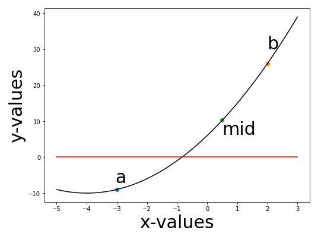

最后，在学习数据结构的时候，在一个**有序数组**中查找某一个数字，也是先确定范围，然后选取中间点，接着调整范围直到结束。

从上面三个例子，其实就是使用二分法的两要素，**范围**、**二段性（单调性）**。

在使用二分法之前，我们需要保证目标数据集合在**指定的范围内具有二段性（单调性）**，比如在第一个例子中，以猜出的价格作为分割点，一段区域要么大于价格要么小于价格；第二个例子，以`mid`作为分界点，一段区域要么都满足边界点乘积大于0，要么小于零。

#### 1.2 二分法适用条件

二分法是适用于解决具有`二段性`(单调性)的问题的方法，通常表现为求解满足某一条件的最大值或者最小值问题。

`二段性：`对某一范围内的数据，存在一个临界点，使得临界点某一侧的所有数据都满足某一性质，另一侧的所有数据都不满足这一性质。

`「二分」`的本质是二段性，并非单调性。只要一段满足某个性质，另外一段不满足某个性质，就可以用`「二分」`。

因此，`bisect_left`找到的是大于等于`target`的下标；`bisect_right`找到的是大于`target`的下标


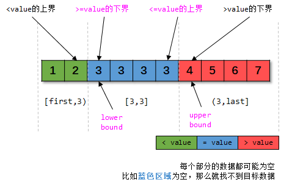

#### 1.3 二分法的三种写法

```python
# 1 左闭右闭写法
while (low <= high) {
    long mid = low + (high - low) / 2;
    long r = mid * mid;
    if (r > x) high = mid - 1;
    else if (r < x) low = mid + 1;
    else return (int) mid;
}
return (int) low - 1;

# 2 左闭右开写法
while (low < high) {
    long mid = low + (high - low) / 2;
    long r = mid * mid;
    if (r > x) high = mid;
    else if (r < x) low = mid + 1;
    else return (int) mid;
}
return (int) low - 1;

# 2 左闭右开写法，mid向上取整写法
while (low < high) {
    long mid = low + (high - low + 1) / 2;
    long r = mid * mid;
    if (r > x) high = mid - 1;
    else if (r < x) low = mid;
    else return (int) mid;
}
return (int) low;
```


#### 1.4 二分法的拓展

通常我们将 `mid` 定义为数组的下标，这种定义可以被看成是标准的二分法。除此之外，我们可以利用`二段性`，将 `mid` 定义为某种资源的值，比如在  `Lintcode-437` 中，我们可以定义 `mid` 为最多的`pages`。

这种思路下，基本的流程仍然是先确定范围，也就是可能的解的范围。比如`Lintcode-437`中，需要的最少`page`是数组中最大的元素，需要最多的`page` 是数字之和。


[李weiwei二分法总结](https://leetcode-cn.com/problems/search-insert-position/solution/te-bie-hao-yong-de-er-fen-cha-fa-fa-mo-ban-python-/)

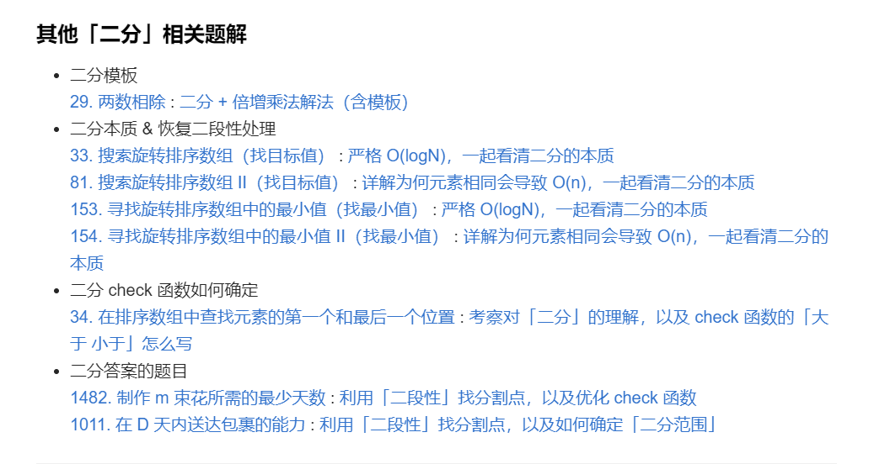


## 2.  题集

#### 2.1 题型一：`定义域上的二分查找`

一般而言数组都是`有序`的，也可能是半有序的（`旋转有序数组` 或者 `山脉数组` ）

##### 33 搜索旋转排序数组

>   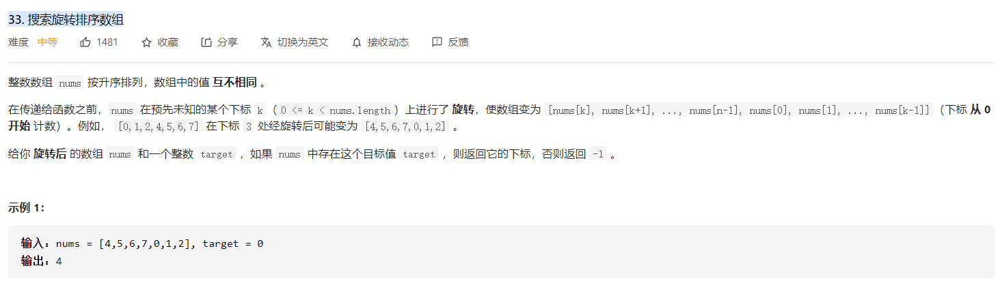
>
>   一定要利用二分场景下的 `二段性` 将数据划分程多个部分。

```python
class Solution:
    def search(self, nums: List[int], target: int) -> int:
        """
        元素互不相同
        """
        n = len(nums)
        left = 0
        right = n - 1

        if nums[left] <= target:
            # target在左边
            while left <= right:
                mid = left + (right-left) // 2
                if nums[mid] == target:
                    return mid

                if nums[mid] < nums[left]:
                    right = mid - 1
                else:
                    if nums[mid] > target:
                        right = mid - 1
                    else:
                        left = mid + 1
        else:
            while left <= right:
                mid = left + (right-left) // 2 
                if nums[mid] == target:
                    return mid

                if nums[mid] > nums[right]:
                    left = mid + 1
                else:
                    if nums[mid] < target:
                        left = mid + 1
                    else:
                        right = mid - 1
            
        return -1
```

##### 34. 在排序数组中查找元素的第一个和最后一个位置

>   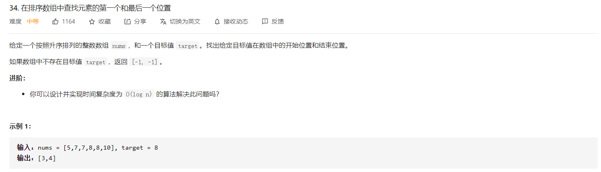

```python
class Solution:
    def searchRange(self, nums: List[int], target: int) -> List[int]:
        n = len(nums)
        left,right = 0,n-1
        flag = True
        while left <= right:
            mid = left + (right-left) // 2
            if nums[mid] <= target:
                left = mid + 1
            else:
                right = mid - 1
        if right < 0 or nums[right] != target: return [-1,-1]
        else:
            i = right
            while i >= 0 and nums[i] == target: i -= 1
            return [i+1,right]
```

##### 74. 搜索二维矩阵

>   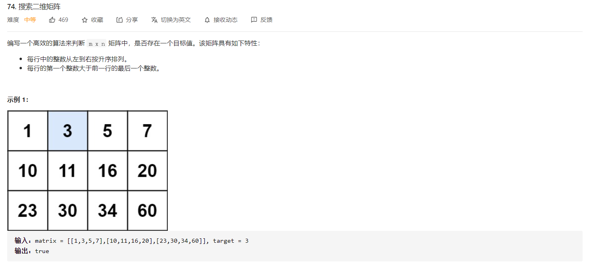
>
>   思路：转化成二分搜索，普通迭代搜索，也可以利用单调性从左下角或者右上角开始搜索。
>
>   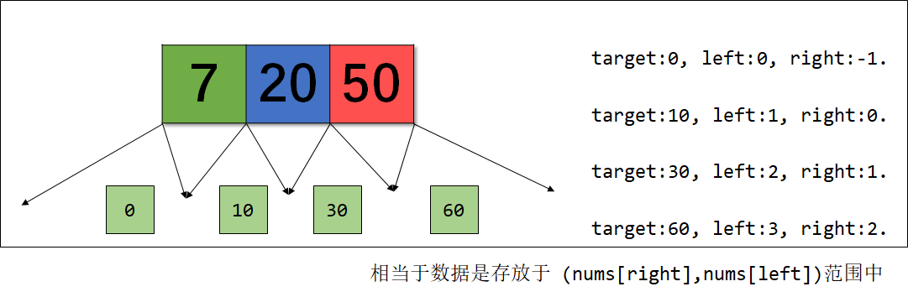

```python
class Solution:
    def searchMatrix(self, matrix: List[List[int]], target: int) -> bool:
        """
        水平是单调递增,纵向是单调递增
        """
        m = len(matrix)
        n = len(matrix[0])

        left = 0
        right = m-1
        while left <= right:
            mid = left + (right-left) // 2
            if matrix[mid][n-1] == target: 
                return True
            elif matrix[mid][n-1] > target:
                right = mid - 1
            else:
                left = mid + 1
        # print(right)
        right += 1
        if right == m: return False

        index = right
        left = 0
        right = n-1
        while left <= right:
            mid = left + (right-left) // 2
            if matrix[index][mid] == target:
                return True
            elif matrix[index][mid] > target:
                right = mid - 1
            else:
                left = mid + 1
        return False
```


##### 240. 搜索二维矩阵 II

>   思路：可以采用二分搜索，递归搜索，也可以利用单调性从左下角或者右上角开始搜索。
>
>   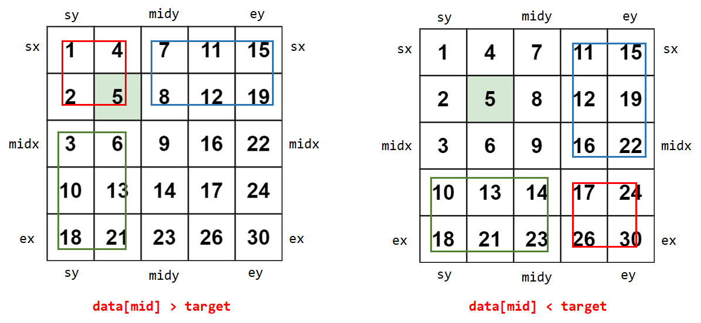

```python
class Solution:
    def searchMatrix(self, matrix: List[List[int]], target: int) -> bool:
        def check(x,y,m,n):
            if x >= 0 and x < m and y >= 0 and y < n: return True
            else: return False

        @functools.lru_cache(None)
        def helper(s_x,s_y,e_x,e_y):
            if s_x <= e_x and s_y <= e_y and \
                check(s_x,s_y,m,n) and check(e_x,e_y,m,n):

                mid_x = s_x + (e_x - s_x) // 2
                mid_y = s_y + (e_y - s_y) // 2

                if matrix[mid_x][mid_y] == target: 
                    return True
                elif matrix[mid_x][mid_y] > target: 
                    return helper(s_x,s_y,mid_x-1,mid_y-1) or \
                            helper(mid_x,s_y,e_x,mid_y-1) or \
                            helper(s_x,mid_y,mid_x-1,e_y)
                elif matrix[mid_x][mid_y] < target: 
                    return helper(mid_x+1,mid_y+1,e_x,e_y) or \
                            helper(mid_x+1,s_y,e_x,mid_y) or \
                            helper(s_x,mid_y+1,mid_x,e_y)

        m = len(matrix)
        n = len(matrix[0])
        start_x = 0
        start_y = 0
        end_x = m-1
        end_y = n-1

        return helper(start_x,start_y,end_x,end_y)
```

##### 153. 寻找旋转排序数组中的最小值

>   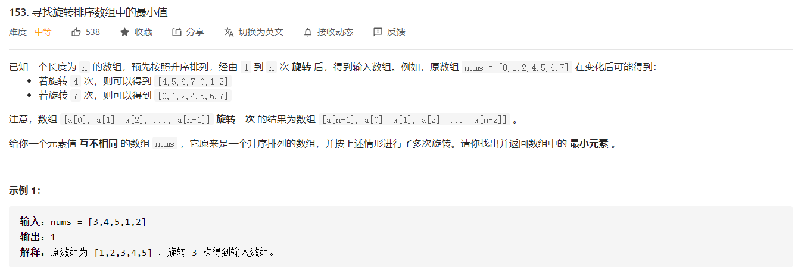
>
>   

```python
class Solution:
    def findMin(self, nums: List[int]) -> int:
        n = len(nums)
        if nums[n-1] >= nums[0]: return nums[0]

        left = 0
        right = n - 1

        while left <= right:
            mid = left + (right-left) // 2
            if nums[mid] >= nums[0]:
                left = mid + 1
            else:
                right = mid - 1
        return nums[left] # 一般情况下，无脑输出left，如果结果不对再进行调整
```

##### 300 最长递增子序列 🍉🍉

>   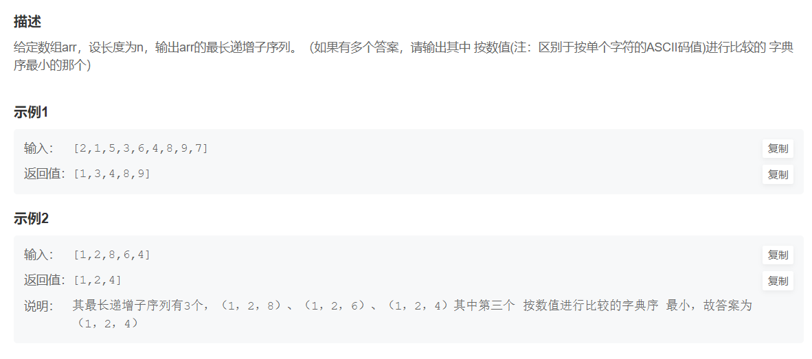
>
>   需要定义两个数组，一个 `dp数组` 表示的含义是到第i个元素最长递增子序列（字典序最小），一个 `ans数组` 表示的含义是到第i个元素为结尾的最长递增子序列的长度。

```python
import bisect
class Solution:
    def LIS(self , arr ):
        dp = []
        ans = []
        n = len(arr)
        for i in range(n):
            if not dp or dp[-1] < arr[i]:
                dp.append(arr[i])
                ans.append(len(dp))
            else:
                idx = bisect.bisect_left(dp,arr[i])
                dp[idx] = arr[i]
                ans.append(idx+1)
        j = len(dp)
        
        for i in range(n-1,-1,-1):
            if j == 0: break
            if ans[i] == j:
                dp[j-1] = arr[i]
                j -= 1
        return dp
```

##### 658. 找到 K 个最接近的元素 🍉🍉

>   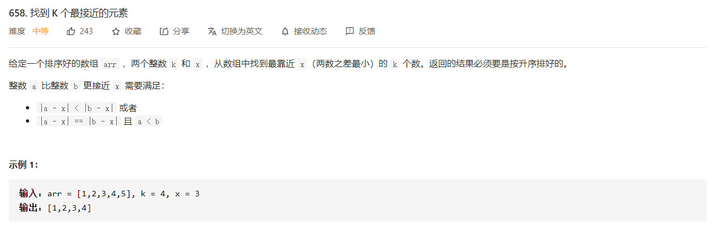

```python
class Solution:
    def findClosestElements(self, arr: List[int], k: int, x: int) -> List[int]:
        n = len(arr)
        idx = bisect.bisect_left(arr,x)
        if k >= n: return arr
        if idx >= n: return arr[-k:]
        if idx <= 0: return arr[:k]

        if arr[idx] != x and arr[idx]-x >= x-arr[idx-1]:
            idx -= 1
        k -= 1
        left = idx - 1
        right = idx + 1
        while k > 0 and left >= 0 and right < n: 
            l = x-arr[left]
            r = arr[right]-x
            if l <= r:
                left -= 1
            else:
                right += 1
            k -= 1
        
        if k > 0:
            if left > 0: left = left - k
            if right < n-1: right = right + k
        return arr[left+1:right] 
```


##### 852. 山脉数组的峰顶索引

>   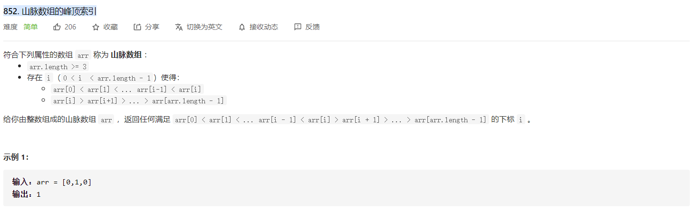

```python
class Solution:
    def peakIndexInMountainArray(self, arr: List[int]) -> int:
        n = len(arr)
        left = 0
        right = n-1
        while left <= right:
            mid = left + (right-left)//2
            if arr[mid] > arr[mid-1]:
                left = mid + 1
            else:
                right = mid - 1
        return right 
```


##### 1095. 山脉数组中查找目标值

>   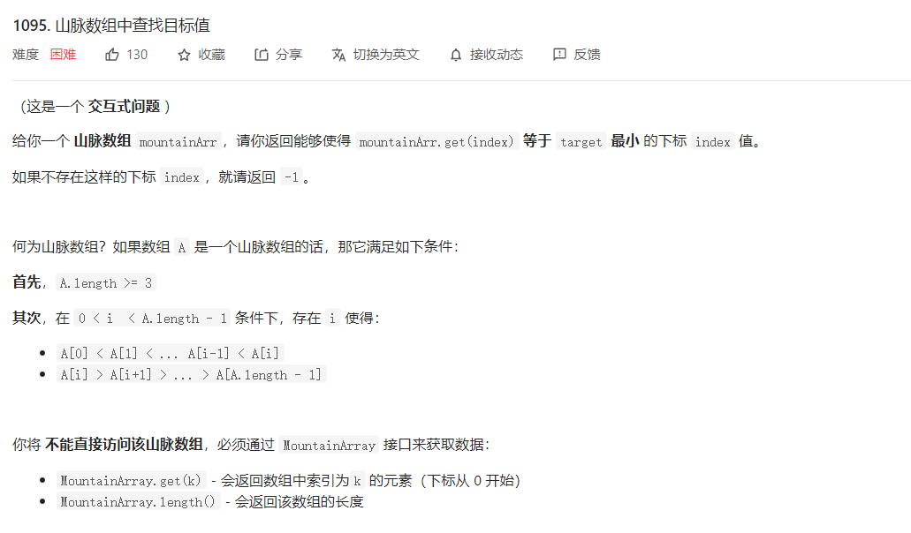
>
>   思路：先按照二分法找到山脉数组的山峰元素，然后利用二分法在上坡和下坡上分别进行二分查找。

```python
# """
# This is MountainArray's API interface.
# You should not implement it, or speculate about its implementation
# """
#class MountainArray:
#    def get(self, index: int) -> int:
#    def length(self) -> int:

class Solution:
    def findInMountainArray(self, target: int, mountain_arr: 'MountainArray') -> int:
        n = mountain_arr.length()
        left,right = 0,n-1
        while left <= right:
            mid = left + (right-left) // 2
            cur = mountain_arr.get(mid)
            if mid > 0: left_val = mountain_arr.get(mid-1) 
            else: left_val = float("-inf")
            if cur > left_val:
                left = mid + 1
            else:
                right = mid - 1
        idx = right
        cur = mountain_arr.get(idx)
        if cur == target: return idx
        if cur < target: return -1
        left,right = 0,idx-1
        while left <= right:
            mid = left + (right-left) // 2
            cur = mountain_arr.get(mid)
            if cur == target: return mid
            if cur < target:
                left = mid + 1
            else:
                right = mid - 1
        
        left,right = idx+1,n-1
        while left <= right:
            mid = left + (right-left) // 2
            cur = mountain_arr.get(mid)
            if cur == target: return mid
            if cur < target:
                right = mid - 1
            else:
                left = mid + 1
        return -1
```

##### 354. 俄罗斯套娃信封问题

>   思路：需要实现一个二分搜索，去查找下确界。
>
>   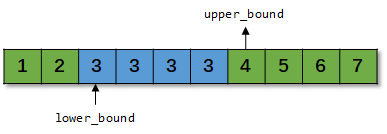
>
>   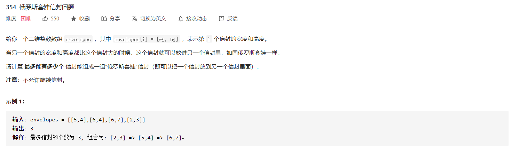

```python
class Solution:
    def maxEnvelopes(self, envelopes: List[List[int]]) -> int:
        def lower_bound(nums,key):
            left,right = 0,len(nums)-1
            ans = left
            while left <= right:
                mid = left + (right-left) // 2
                if nums[mid][1] >= key:
                    ans = mid
                    right = mid - 1
                else:
                    left = mid + 1            
            return ans

        envelopes.sort(key=lambda x:[x[0],-x[1]]) # 按照第一维升序，第二维降序
        dp = []
        n = len(envelopes)

        for i in range(n):
            if not dp or dp[-1][1] < envelopes[i][1]:
                dp.append(envelopes[i])
            else:
                idx = lower_bound(dp,envelopes[i][1])
                dp[idx] = envelopes[i]
        return len(dp)
```

##### 611 有效三角形的个数

>   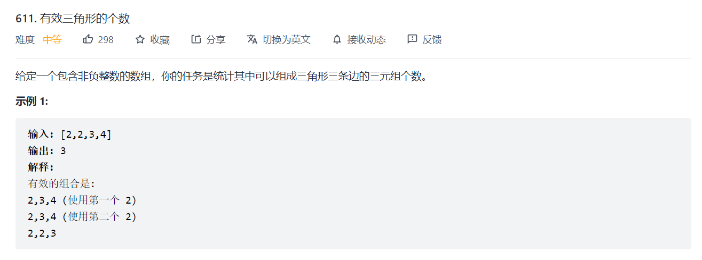
>
>   贪心 + 二分思想

```python
class Solution:
    def triangleNumber(self, nums: List[int]) -> int:
        n = len(nums)
        nums.sort()
        ans = 0
        for i in range(n):
            for j in range(i+1,n):
                cur = nums[i] + nums[j]
                if cur > nums[-1]:
                    ans += (n-j-1)
                else:
                    idx = bisect.bisect_left(nums,cur,j+1,n)
                    ans += idx-j-1
        return ans
```


##### 剑指 Offer 51. 数组中的逆序对

>   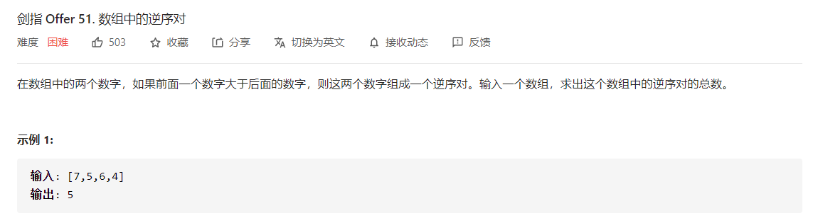

```python
class Solution:
    def reversePairs(self, nums: List[int]) -> int:
        nums = nums[::-1]
        data = []
        n = len(nums)
        ans = 0
        for i in range(n):
            if not data:
                data.append(nums[i])
            else:
                idx = bisect.bisect_left(data,nums[i])
                ans += idx
                data[idx:idx] = [nums[i]] # 可以实现 `O(1)` 的时间效率
        return ans
```


##### 剑指 Offer 53 - II. 0～n-1中缺失的数字 🍉

>   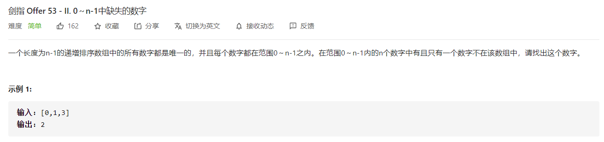
>
>   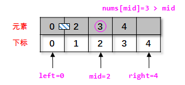

```python
class Solution:
    def missingNumber(self, nums: List[int]) -> int:
        n = len(nums)
        left = 0
        right = n-1
        while left <= right:
            mid = left + (right-left) // 2
            if nums[mid] == mid:
                left = mid + 1
            elif nums[mid] > mid: # 二段性，在左边
                right = mid - 1
        return left
```

##### LCP 28. 采购方案 

>   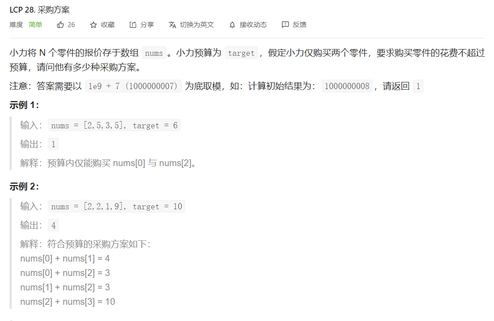

```python
class Solution:
    def purchasePlans(self, nums: List[int], target: int) -> int:
        import bisect
        MAX = 1000000007
        nums.sort()
        n = len(nums)
        
        ans = 0
        for i in range(1,n):
            if target <= nums[i]: break
            idx = bisect.bisect_right(nums,target - nums[i],0,i)
            ans = (ans + idx) % MAX
        return ans
```


#### 2.2 题型二：场景题，`值域上的二分查找`

##### 378. 有序矩阵中第 K 小的元素

>   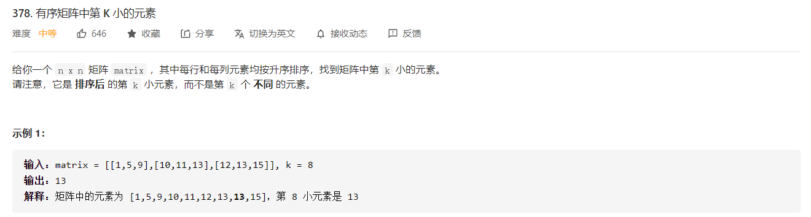
>
>   +   第一个点，由于有重复元素，所以实际上是找 `lower_bound`
>
>   +   第二个点，为了找到小于 `mid` 的元素的数量，需要利用有序矩阵的有序性，从左下角开始搜索
>
>       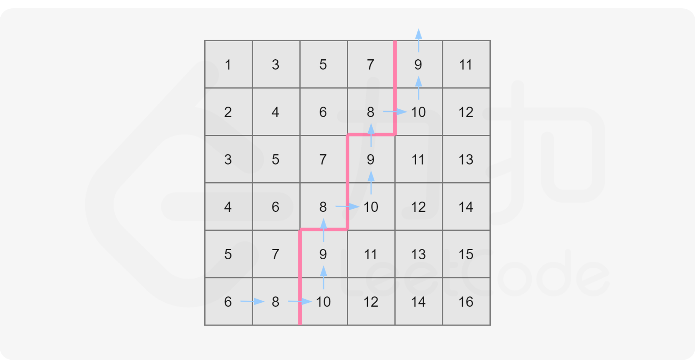

```python
class Solution:
    def kthSmallest(self, matrix: List[List[int]], k: int) -> int:
        n = len(matrix)
        left = matrix[0][0]
        right = matrix[n-1][n-1]
        
        def get_count(matrix,mid):
            x,y = n-1,0
            cnt = 0
            while x < n and x >= 0 and y < n and y >=0:
                if matrix[x][y] <= mid:
                    cnt += (x+1)
                    y += 1
                elif matrix[x][y] > mid:
                    x -= 1
            return cnt

        while left <= right:
            mid = left + (right-left) // 2
            cur = get_count(matrix,mid)
            if cur >= k:
                right = mid - 1
            else:
                left = mid + 1
        return left
```


##### 719. 找出第 k 小的距离对 🍉🍉

>   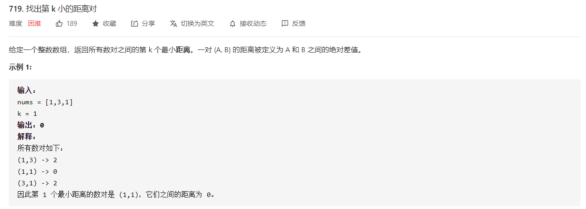
>
>   思路：
>
>   +   第一个是二分法的应用
>   +   第二个是基于双指针统计有序数组中小于 `mid` 的数对数量，利用的是滑动窗口进行统计。

```python
class Solution:
    def smallestDistancePair(self, nums: List[int], k: int) -> int:
        def get_count(dis):
            count = left = 0
            right = 0
            while right < len(nums):
                while left <= right and nums[right]-nums[left] > dis:
                    left += 1
                count += (right-left)
                right += 1
            return count
        
        nums.sort()
        left,right = 0,nums[-1]-nums[0]
        res = -1
        while left <= right:
            mid = left + (right-left) // 2
            if get_count(mid) >= k: # 统计间距小于mid的数对的数量，可能没有恰好为k的，这时候取下界
                res = mid
                right = mid - 1 
            else:
                left = mid + 1
        return res
```


##### 1011. 在 D 天内送达包裹的能力 🍉

>   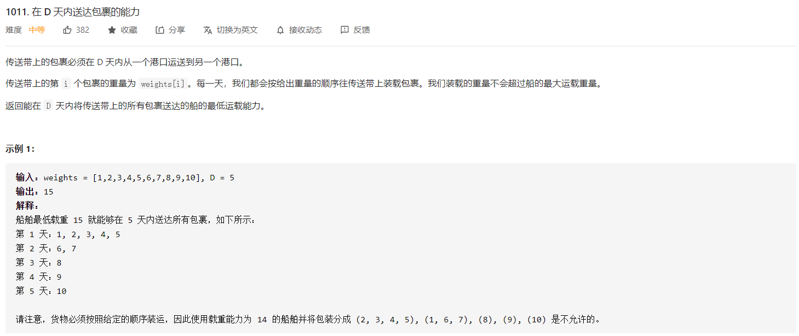
>
>   和 `Lintcode - 437 书籍复印` 思路一致，就是将数据划分成D份，使得D份中最大的那个数最小。

```python
class Solution:
    def shipWithinDays(self, weights: List[int], days: int) -> int:
        """
        1. 就是将数据划分成D份，使得D份中最大的那个数最小。
        2. 货物必须按照给定的顺序装运，这限定了分割时数组必需是连续的
        """
        left = min(weights)
        right = sum(weights)
        n = len(weights)
        
        def get_count(weights,mid):
            cnt = 1
            cur = 0
            for i in range(n):
                cur += weights[i]
                if weights[i] > mid: return float("inf")
                if cur > mid:
                    cnt += 1
                    cur = weights[i]
            return cnt
	    res = -1
        while left <= right:
            mid = left + (right-left) // 2
            cur = get_count(weights,mid) # 统计对应运载量需要的天数，
            if cur <= days:
                res = mid
                right = mid - 1
            else:
                left = mid + 1
        return res
```

##### 875. 爱吃香蕉的珂珂

>   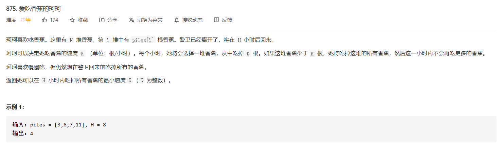
>
>   同样可以被定义为：`最大值最小化问题`
>
>   +   根据题意可以知道：珂珂吃香蕉的速度越小，耗时越多。反之，速度越大，耗时越少，这是题目的 单调性；
>   +   我们要找的是速度。因为题目限制了珂珂一个小时之内只能选择一堆香蕉吃，因此速度最大值就是这几堆香蕉中，数量最多的那一堆。速度的最小值是 11，其实还可以再分析一下下界是多少，由于二分搜索的时间复杂度很低，严格的分析不是很有必要；
>   +   还是因为珂珂一个小时之内只能选择一堆香蕉吃，因此：每堆香蕉吃完的耗时 = 这堆香蕉的数量 / 珂珂一小时吃香蕉的数量。根据题意，这里的 / 在不能整除的时候，需要 上取整。

```python
class Solution:
    def minEatingSpeed(self, piles: List[int], h: int) -> int:
        right = max(piles)
        left = 1

        def get_count(piles,mid):
            cnt = 0
            for pile in piles:
                cnt += ((pile-1) // mid) + 1
            return cnt


        while left <= right:
            mid = left + (right-left) // 2
            cur = get_count(piles,mid)
            if cur <= h:
                right = mid - 1
            else:
                left = mid + 1
        return left
```


##### 410. 分割数组的最大值

>   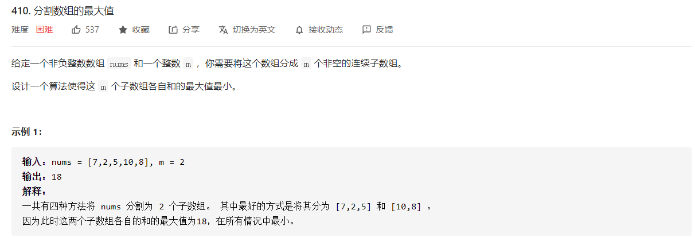
>
>   最小值最大化问题，可以认为是这一列题目的原型题。

```python
class Solution:
    def splitArray(self, nums: List[int], m: int) -> int:
        left = max(nums)
        right = sum(nums)
        n = len(nums)

        def get_count(nums,mid):
            cnt = 1
            cur = 0
            for i in range(n):
                cur += nums[i]
                if cur > mid:
                    cnt += 1
                    cur = nums[i]
            return cnt
                
        while left <= right:
            mid = left + (right-left) // 2
            cur = get_count(nums,mid)
            if cur <= m:
                right = mid - 1
            else:
                left = mid + 1
        return left

```

##### 1482. 制作 m 束花所需的最少天数

>   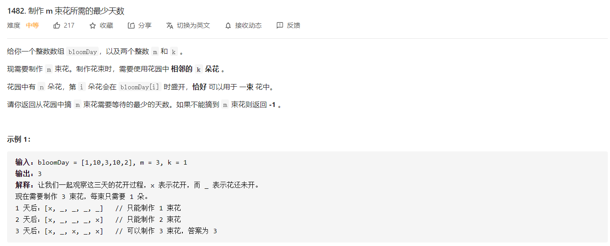

```python
class Solution:
    def minDays(self, bloomDay: List[int], m: int, k: int) -> int:
        """
        值域上的二分法，
        """
        left = 1
        right = max(bloomDay)
        n = len(bloomDay)
        if m*k > len(bloomDay): return -1

        def get_count(mid,bloomDay):
            cnt = 0
            K = k
            for i in range(n):
                if bloomDay[i] <= mid:
                    K -= 1
                    if K == 0:
                        cnt += 1
                        K = k
                else:
                    K = k
            return cnt
        
        while left <= right:
            mid = left + (right-left) // 2
            cur = get_count(mid,bloomDay)
            
            if cur >= m: #  m 束花
                right = mid - 1
            else:
                left = mid + 1
        return left
```

##### Lintcode - 437 书籍复印

>   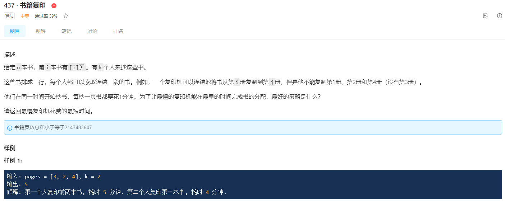

+   二分解法

```python
class Solution:
    """
    @param pages: an array of integers
    @param k: An integer
    @return: an integer
    """
    def copyBooks(self, pages, k):
        # write your code here
        if not pages: return 0
        
        right = sum(pages)
        left = max(pages)
        n = len(pages)

        def get_count(mid,pages): # mid表示时间
            cur = 0
            cnt = 1
            for i in range(n):
                cur += pages[i]
                if cur > mid:
                    cnt += 1
                    cur = pages[i]
            return cnt

        while left <= right:
            mid = left + (right-left) // 2
            cur = get_count(mid,pages)
            if cur <= k:
                right = mid - 1
            else:
                left = mid + 1
        return left
```

+   动态规划解法

```python
class Solution:
    """
    @param pages: an array of integers
    @param k: An integer
    @return: an integer
    """
    def copyBooks(self, pages, k):
        # write your code here
        
        # 前缀和
        prefix = [0]
        n = len(pages)
        for i in range(n):
            prefix.append(pages[i]+prefix[-1])
        
        dp = [[float("inf")]*(k+1) for i in range(n+1)]
        for i in range(k+1): dp[0][i] = 0
        for i in range(1,n+1): dp[i][0] = float("inf")

        # 动态规划方程
        for i in range(1,n+1):
            for j in range(1,k+1):
                for m in range(i,-1,-1): # 表示多少书分配给当前用户
                    dp[i][j] = min(dp[i][j],max(dp[i-m][j-1],prefix[i]-prefix[i-m]))
                
#         for row in dp:
#             print(row)
        return dp[n][k]
```

##### 1552. 两球之间的磁力

>   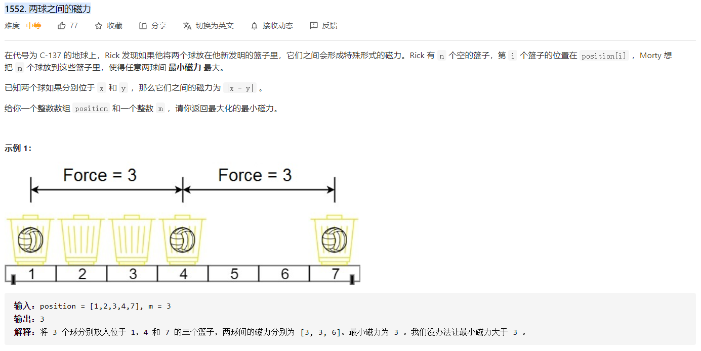
>
>   最小值最大化问题。在二分的时候，相当于求`upper_bound`。

```python
class Solution:
    def maxDistance(self, position: List[int], m: int) -> int:
        """
        值域的二分法
        """
        position.sort()
        n = len(position)
        left = min([position[i]-position[i-1] for i in range(1,n)])
        right = position[-1] - position[0]

        def get_count(position,mid):
            l,r = 0,0
            cnt = 1
            while r < n:
                if position[r] - position[l] >= mid:
                    l = r
                    cnt += 1
                else:
                    r += 1
            return cnt
                    
        while left <= right:
            mid = left + (right-left) // 2
            cnt = get_count(position,mid)
            if cnt >= m:
                left = mid + 1
            else:
                right = mid - 1
        return right
```


##### 1300. 转变数组后最接近目标值的数组和 🍉🍉

>   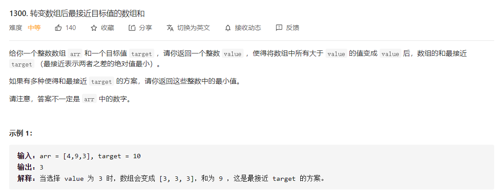
>
>   这里的技巧在于返回的是 `res` 而不是 `left` 或者 `right`，利用的是双重二分查找。

```python
class Solution:
    def findBestValue(self, arr: List[int], target: int) -> int:
        arr.sort()
        n = len(arr)

        # 特例，如果所有元素的和小于target，那么无论如何转变，目标值也不会变得更大
        if sum(arr) <= target: return arr[-1]

        # 计算前缀和
        prefix = [0]
        for i in range(n):
            prefix.append(arr[i]+prefix[-1])          
        
        # 计算翻转后的累加和
        def get_count(arr,mid):
            idx = bisect.bisect_left(arr,mid)
            cur = (prefix[idx]-prefix[0]) + (mid*(n-idx))
            return cur
        
        # 1. 确定查找范围，最小的值可以是0
        left = 0
        right = arr[-1]
        
        diff = float("inf")
        res = None
        while left <= right:
            mid = left + (right-left) // 2
            cur = get_count(arr,mid)
            # 2. 利用二段性质
            if cur == target:
                diff = 0
                res = mid
                right = mid - 1
            elif cur < target:
                if target-cur <= diff:
                    diff = target-cur
                    res = mid
                left = mid + 1
            elif cur > target:
                if cur-target < diff:
                    diff = cur-target
                    res = mid
                right = mid - 1
        return res
```


## 3. 总结

第一类：抠细节的，二分很明确，就是在 `整数的定义域` 上进行二分查找。

第二类：数学题，涉及到高精度问题，是在 `实数的定义域` 上进行二分查找。

第三类：场景题，是在`值域`上进行二分查找。

#### 第一类 整数的定义域上的二分搜索

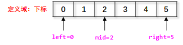

#### 第二类 实数的定义域上的二分搜索

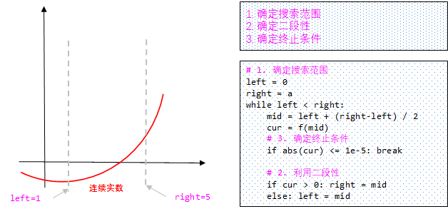

#### 第三类 值域上的二分查找

经常针对`最大值最小化问题`和`最小值最大化问题`。


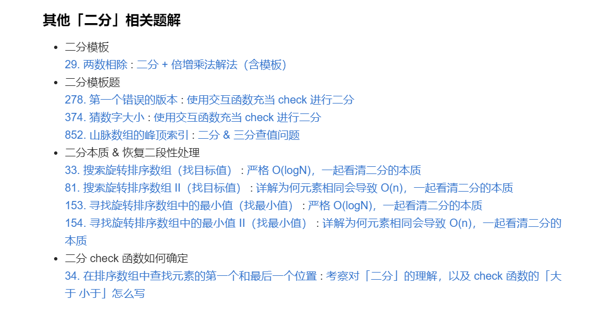

## 引用

```latex
[1] 写对二分查找不能靠模板，需要理解加练习 https://leetcode-cn.com/problems/search-insert-position/solution/te-bie-hao-yong-de-er-fen-cha-fa-fa-mo-ban-python-/
```

