## 数组题注意事项

#### 解题思路

+   注意`给定的条件`，注意`边界情况`。
+   子段和问题注意利用`前缀和`思想。
+   单调栈
+   双指针
+   二分法加快速度


#### 剑指 Offer 29. 顺时针打印矩阵

思路：两种解法，解法一：模拟碰壁法；解法二：公式法。

+   模拟碰壁法

```python
class Solution {
    public int[] spiralOrder(int[][] matrix) {

        int m = matrix.length;
        if (m == 0) return new int[0];
        int n = matrix[0].length;
        if (n == 0) return new int[0];

        int l = 0, r = n, u = 0, d = m;
        int [] ans = new int[m*n];
        int idx = 0;
        while(true) {
            for(int i = l; i < r; i++) {
                ans[idx++] = matrix[u][i];
            }
            u += 1;
            if (u >= d) break;
            for(int i = u; i < d; i++) {
                ans[idx++] = matrix[i][r-1];
            }
            r -= 1;
            if (l >= r) break;
            for (int i = r-1; i >= l; i--) {
                ans[idx++] = matrix[d-1][i];
            }
            d -= 1;
            if (u >= d) break;
            for (int i = d-1; i >= u; i--) {
                ans[idx++] = matrix[i][l];
            }
            l += 1;
            if (l >= r) break;
        }
        return ans;   
    }
}
```

+   公式法

```python
# 公式法
def get_pos(x,y,m,n):
	"""
    x,y是下标从1开始的坐标
    """
    k = min(min(x-1,n-y),min(y-1,m-x)) # 寻找层数
    outer_eles = k*(2*m+2*n-4*k) # 等差数列求和
    inner_eles = get_inner(x-k,y-k,m-2*k,n-2*k) # 
    return outer_eles + inner_eles

def get_inner(x,y,m,n):
    if x == 1: return y
    if y == n: return x+n-1
    if x == m: return 2*n+m-y-1
    if y == 1: return 2*m+2*n-x-2
    return 0 # default case
```


#### 二维数组问题

+   常见思路是将二维问题降低为一维问题，然后基于一维问题进行求解


## 解题方法

### 前缀和 和 子段和

#### 一维前缀和


#### 二维前缀和


#### 304. 二维区域和检索

>   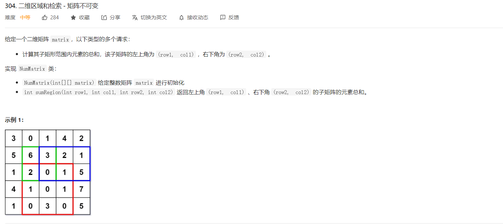
>
>   思路：需要在行维度和列维度上额外多添加一列，这样可以节省很多`edge-case`的判断，其余的思路如下：
>
>   

```python
class NumMatrix:

    def __init__(self, matrix: List[List[int]]):
        m = len(matrix)
        n = len(matrix[0])
        self.sum_matrix = [[0]*(n+1) for i in range(m+1)]

        for i in range(1,m+1):
            for j in range(1,n+1):
                self.sum_matrix[i][j] = self.sum_matrix[i-1][j] + self.sum_matrix[i][j-1] \
                                            - self.sum_matrix[i-1][j-1] + matrix[i-1][j-1]


    def sumRegion(self, row1: int, col1: int, row2: int, col2: int) -> int:
        row1 += 1
        col1 += 1
        row2 += 1
        col2 += 1
        return self.sum_matrix[row2][col2] - self.sum_matrix[row2][col1-1] \
                    - self.sum_matrix[row1-1][col2] + self.sum_matrix[row1-1][col1-1]

```

#### 523. 连续的子数组和

>   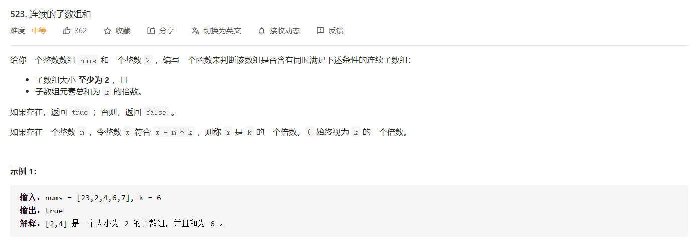
>
>   利用**同余性质**：
>
>   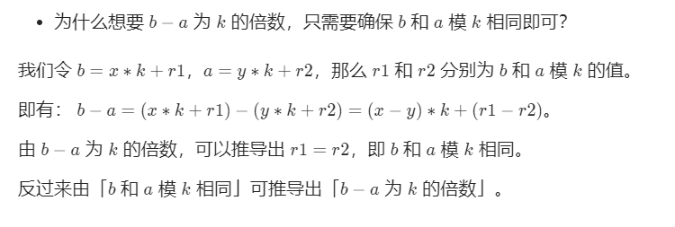
>
>   需要注意四个点：
>
>   第一点：`counter`需要初始化，设置`counter[0]=-1`
>
>   第二点：子数组元素总和为需要为k 的倍数，利用同余定理
>
>   第三点：子数组大小至少为2
>
>   第四点：需要考虑到0的影响，也就是同一和的下标是不需要变化

```python
class Solution:
    def checkSubarraySum(self, nums: List[int], k: int) -> bool:
        counter = collections.defaultdict(int)
        counter[0] = -1
        n = len(nums)

        cur = 0
        for i in range(n):
            cur = (cur + nums[i]) % k
            if cur in counter: # 子数组元素总和为 k 的倍数。
                if i-counter[cur] >= 2: # 子数组大小 至少为 2
                    return True
            else:
               counter[cur] = i
        return False
```


#### 525. 连续数组

>   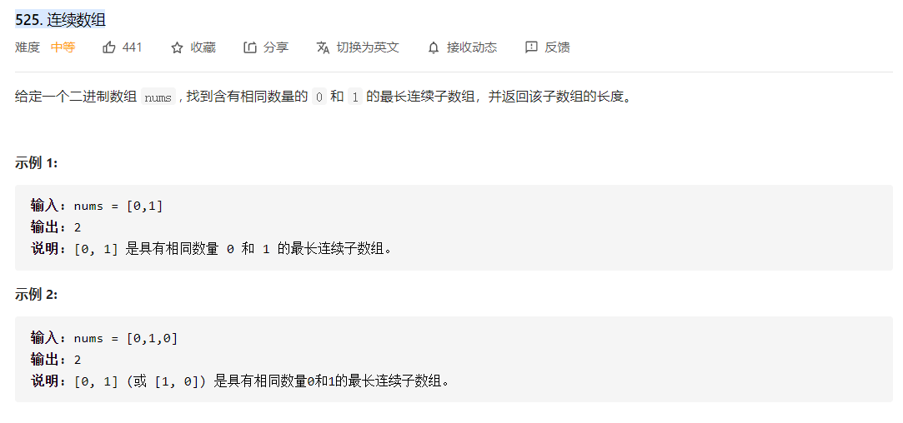
>
>   思路：前缀和 + 哈希表
>
>   ```text
>       1. 初始化cur,作为前缀和遍历的值
>       2. 遇到0减一,遇到1加一
>       3. 利用hash表记录, key=cur, value=i
>       4. 初始化hash表, hash[0]=-1
>   ```

```python
class Solution:
    def findMaxLength(self, nums: List[int]) -> int:
        """
        1. 初始化cur,作为前缀和遍历的值
        2. 遇到0减一,遇到1加一
        3. 利用hash表记录, key=cur, value=i
        4. 初始化hash表, hash[0]=-1
        """
        count = collections.defaultdict(int)
        count[0] = -1
        n = len(nums)
        cur = 0
        ans = 0

        for i in range(n):
            cur += (-1 if nums[i] == 0 else 1)
            if cur in count:
                ans = max(ans,i-count[cur])
            else:
                count[cur] = i
        return ans
```


#### 560. 和为k的子数组

```python
class Solution:
    def subarraySum(self, nums: List[int], k: int) -> int:
        count = collections.defaultdict(int)
        n = len(nums)
        count[0] = 1
        cur = 0
        ans = 0
        for i in range(n):
            cur += nums[i]
            if (cur-k) in count:
                ans += count[cur-k]
            count[cur] += 1
        return ans
```


#### 363. 矩形区域不超过 K 的最大数值和 🍉

>   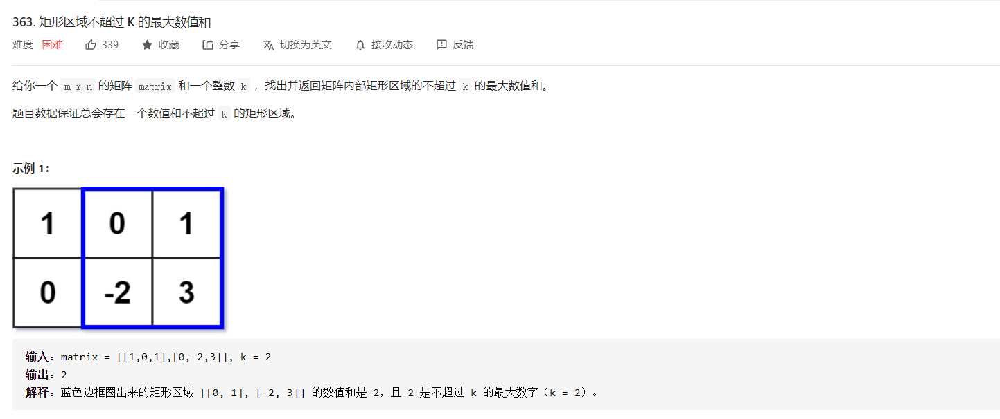

```python
import bisect
from sortedcontainers import SortedList

class Solution:
    def maxSumSubmatrix(self, matrix: List[List[int]], k: int) -> int:
        m,n = len(matrix),len(matrix[0])
        self.sums = [[0]*(n+1) for _ in range(m+1)]
        for i in range(1,len(matrix)+1):
            for j in range(1,len(matrix[0])+1):
                self.sums[i][j] = matrix[i-1][j-1] + self.sums[i][j-1] + self.sums[i-1][j] - self.sums[i-1][j-1]
        
        sumRange = lambda row1,col1,row2,col2: self.sums[row2+1][col2+1] - self.sums[row2+1][col1] - self.sums[row1][col2+1] + self.sums[row1][col1]
            
        
        ans = float("-inf")
        for c1 in range(n):
            for c2 in range(c1,n):
                data = SortedList([0]) # 利用二分法，维护的是一个有序的列表
                for row in range(m):
                    s = sumRange(0,c1,row,c2)
                    lb = data.bisect_left(s-k)
                    if lb != len(data):
                        ans = max(ans,s-data[lb])
                    data.add(s)
        return ans
    
# class Solution:
#     def maxSumSubmatrix(self, matrix: List[List[int]], k: int) -> int:
#         ans = float("-inf")
#         m,n = len(matrix),len(matrix[0])

#         for i in range(m):
#             total = [0]*n # 一维问题的数据
#             for j in range(i,m):
#                 for c in range(n):
#                     total[c] += matrix[j][c] # 第j行的所有元素
                
#                 totalSet = SortedList([0]) # 具有重复的元素的有序
#                 s = 0
#                 for v in total: # 在维数组中寻找答案
#                     s += v
#                     lb = totalSet.bisect_left(s-k) # s-k得到的是浅醉和
#                     if lb != len(totalSet): # 没有超出范围
#                         ans = max(ans,s-totalSet[lb]) # 字段和 s-totalSet[lb]
#                         if ans == k:  return ans 
#                     totalSet.add(s)
#         return ans
# /*~~~~~~~~~~~~~~~~~~~304 二维区域前缀和~~~~~~~~~~~~~~~~~~~~~~~*/
# /*~~~~~~~~~~~~~~~~~~~560 和为k的子数组~~~~~~~~~~~~~~~~~~~~~~~*/
```


+   解法二，

```python
class Solution:
    def maxSumSubmatrix(self, matrix: List[List[int]], k: int) -> int:
        m = len(matrix) # 行数
        n = len(matrix[0]) # 列数
        ans = float('-inf') # 小于等于k的最大子段和
        self.k = k

        def dp_max(arr, k):
            # 一维下的最大子段和
            cur_sum = arr[0]
            cur_max = cur_sum               # cur_max表示最大子段和
            maxnum = float('-inf')          # maxnum表示小于等于k的最大子段和
            size = len(arr)

            # 一维的最大子段和
            for i in range(1,size):
                if cur_sum > 0: cur_sum += arr[i]
                else: cur_sum = arr[i]
                cur_max = max(cur_sum,cur_max)
                    
		   # cur_max表示最大子段和，如果最大子段和小于等于k，直接返回即可
            if cur_max > maxnum and cur_max <= k:
                return cur_max
			
           # 表示 cur_max > k，找到小于等于k的子段和
            for i in range(size):
                cur_sum = 0
                for j in range(i, size):
                    cur_sum += arr[j]
                    if cur_sum > maxnum and cur_sum <= k:
                        maxnum = cur_sum
                        if maxnum == k: return k
            return maxnum
        
        for i in range(n): # 从列开始
            arr = [0]*m
            for j in range(i,n):
                for k in range(m):
                    arr[k] += matrix[k][j]
                ans = max(ans, dp_max(arr, self.k))
                if ans == self.k: return self.k
        return ans
```


### 山脉题 

#### 845. 数组中的最长山脉 🍉

>   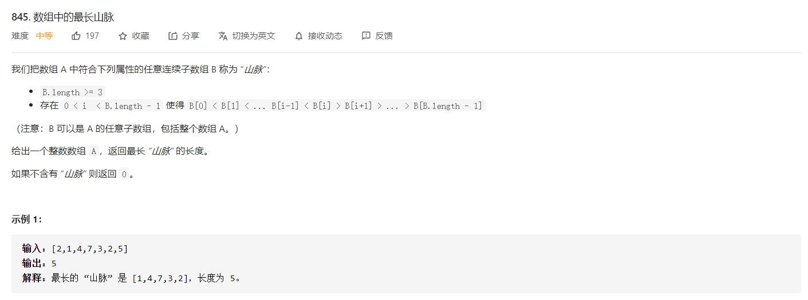

```python
class Solution:
    def longestMountain(self, arr: List[int]) -> int:
        n = len(arr)
        left = [0]*n
        right = [0]*n

        for i in range(1,n):
            if arr[i] > arr[i-1]:
                left[i] = left[i-1] + 1
        
        for i in range(n-2,-1,-1):
            if arr[i] > arr[i+1]:
                right[i] = right[i+1] + 1
        
        return max([left[i]+right[i]+1 if left[i] > 0 and right[i] > 0 else 0 for i in range(n)])
```


#### 852. 山脉数组的峰顶索引 🍉

>   


#### 941. 有效的山脉数组 🍉

>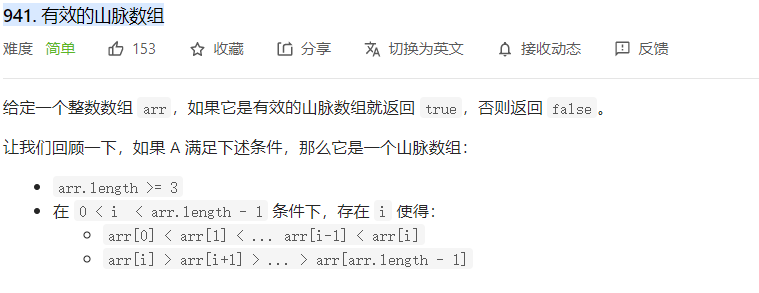
>
>
>
>该题除了可以用双指针，分别从开头和结尾寻找峰值之外，还可以利用`有限状态自动机`来解决。


#### 1095. 山脉数组中查找目标值 🍉

>   


### 重复元素题

#### 41. 缺失的第一个正数

>   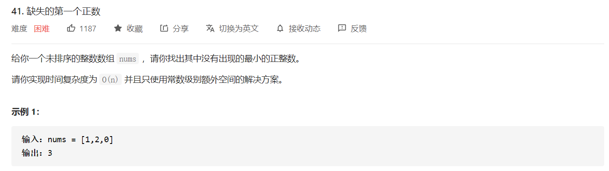

```python
class Solution:
    def firstMissingPositive(self, nums: List[int]) -> int:
        """ 利用数组本身的hash性质 """
        n = len(nums)
        i = 0
        while i < n:
            if nums[i] <= 0 or nums[i] > n: 
                i+=1
            else:
                if nums[i] != i+1 and nums[nums[i]-1] != nums[i]:
                    nums[nums[i]-1],nums[i] = nums[i],nums[nums[i]-1]
                else:
                    i += 1
        
        ans = 1
        for i in range(n):
            if nums[i] == i+1: ans += 1
            else: break
        return ans
```


#### 287. 寻找重复数 🍉

>   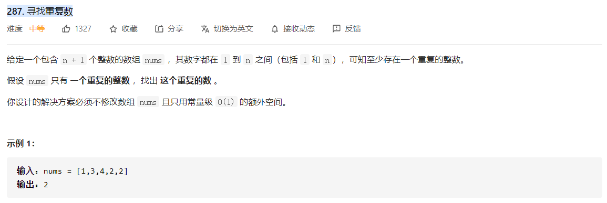

+   交换冲突法 `常规`

```python
class Solution:
    def findDuplicate(self, nums: List[int]) -> int:
        """
        交换冲突法
        """
        i = 0
        n = len(nums)

        while i < n:
            if nums[i] == i + 1:
                i += 1
            else:
                idx = nums[i] - 1
                if nums[idx] == idx+1:
                    return nums[idx]
                else:
                    nums[idx],nums[i] = nums[i],nums[idx]
```

+   快慢指针 + 判环法

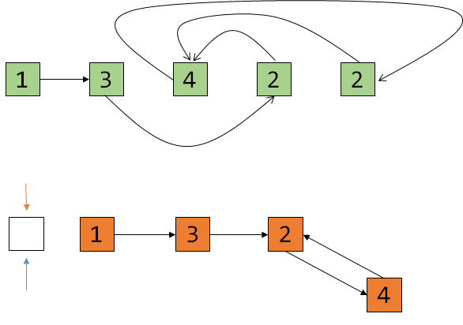

```python
class Solution:
    def findDuplicate(self, nums: List[int]) -> int:
        # 数组，head可以认为是0
        # 所以slow等于nums[0]，fast等于nums[slow]
        slow = nums[0]
        fast = nums[slow]
        while True:
            if slow == fast:
                fast = 0
                while slow != fast:
                    slow = nums[slow]
                    fast = nums[fast]
                return fast
            slow = nums[slow]
            fast = nums[nums[fast]]
```


#### 565. 数组嵌套 🍉

>   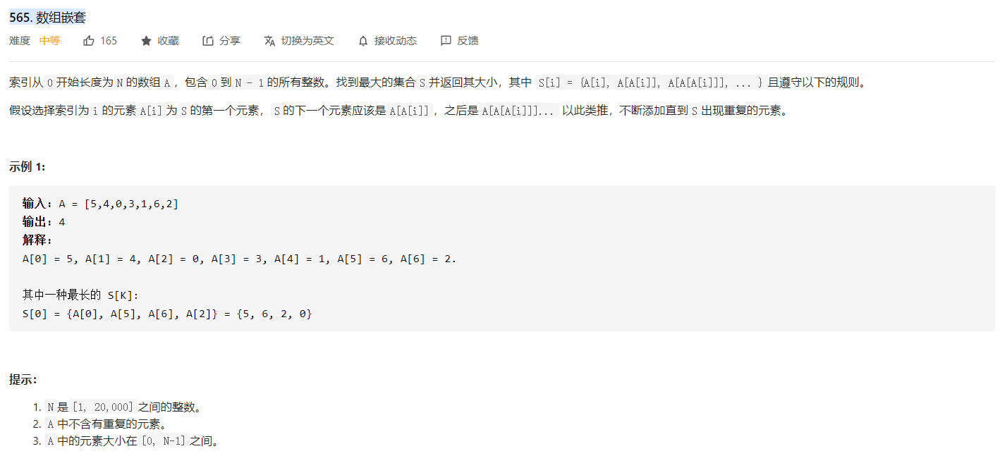
>
>   这一题有两个关键，一个是：
>
>   +   A中不含有重复的元素
>   +   A中的元素大小在[0,N-1]之间
>
>   这两个条件保证了所有的元素必然形成环，而且所有的元素存在于一个环中。

```python
class Solution:
    def arrayNesting(self, nums: List[int]) -> int:
        n = len(nums)
        ans = 0

        for i in range(n):
            if nums[i] == -1: continue

            count = 1
            start = i
            while nums[start] != i:
                nxt = nums[start]
                nums[start] = -1

                count += 1
                start = nxt
            nums[start] = -1  # 边界条件

            ans = max(ans,count)
        return ans
```


#### 剑指 Offer 03. 数组中重复的数字

>   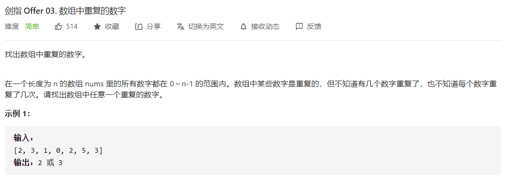

重复元素等类似的题目，直接思路就是`哈希表`，但是哈希表需要花费额外空间。而哈希表本质上就是数组，所以可以`通过交换冲突法`解决。

```python
class Solution:
    def findRepeatNumber(self, nums: List[int]) -> int:
        i = 0
        n = len(nums)
        while i < n:
            if nums[i] == i:
                i += 1
            else:
                idx = nums[i]
                if nums[idx] == nums[i]:
                    return nums[i]
                else:
                    nums[idx],nums[i] = nums[i],nums[idx]
```


#### 剑指 Offer 21. 调整数组顺序使奇数位于偶数前面

>   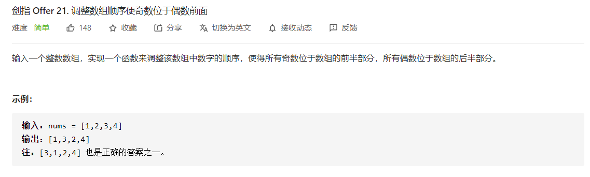

```python
class Solution:
    def exchange(self, nums: List[int]) -> List[int]:
        n = len(nums)
        j = 0
        for i in range(n):
            if nums[i]&1:
                nums[i],nums[j] = nums[j],nums[i]
                j += 1
        return nums
```


#### 442. 数组中重复的数据

>   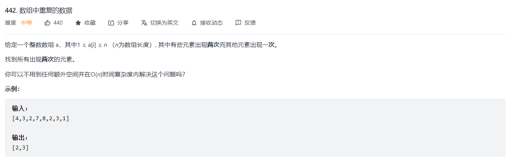
>
>   

### 数组题

#### 41. 缺失的第一个正数 🍉

>   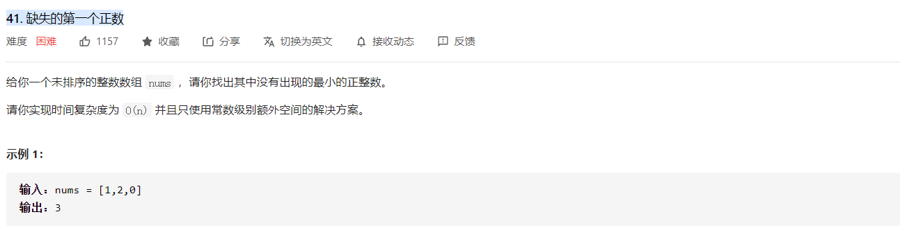


#### 912 排序数组 🍉

+   堆排序

+   归并排序

+   快速排序


#### 485. 最大连续 1 的个数

>   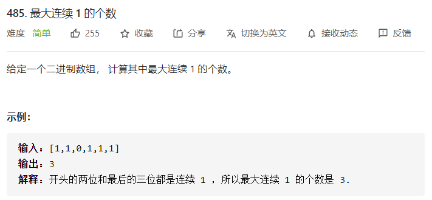

```python
class Solution:
    def findMaxConsecutiveOnes(self, nums: List[int]) -> int:
        left = right = 0
        n = len(nums)
        ans = 0
        while right < n:
            if nums[right] == 1: 
                right += 1
            else:
                ans = max(right-left,ans)
                right += 1
                left = right
        ans = max(right-left,ans)
        return ans
```


#### 915. 分割数组 🍉

>   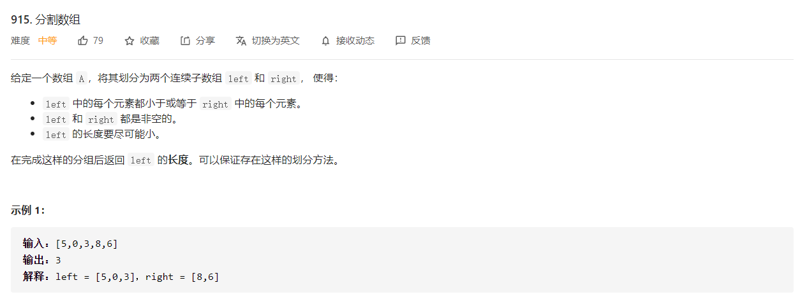

```python
class Solution:
    def partitionDisjoint(self, nums: List[int]) -> int:
        n = len(nums)
        left = 0
        right = n-1
        mark = nums[left]
        
        # 从右到左,找小于nums[0]的第一个下标
        while right > left and nums[right] >= mark:
            right -= 1

        # 从左到右,找到左边中最拔尖的元素
        left_max = nums[left]
        while left <= right:
            left_max = max(left_max,nums[left])
            left += 1
        
        # 从左到右,找到右边小于左边最拔尖元素的下标
        while left < n:
            if nums[left] < left_max:
                right = left
            left += 1
        
        return right + 1
    
    
#### 更简单的做法
"""
1. max存的是[0, i]的最大值，pos是left数组的分界点，leftMax存的是left数组[0, pos]的最大值
2. 当A[i] < leftMax时，为了满足left数组的数必须小于等于right中的数，必须将当前A[i]放入left数组，同时更新leftMax和pos，当A[i] = leftMax时暂时没必要将A[i]放入left数组，因为我们求的是最小的left
3. 如果A[i] >= leftMax，那么A[i]可以暂时放在right数组，若后面有A[j] < leftMax时才必须将A[i]放入left数组
"""
class Solution {
    public int partitionDisjoint(int[] A) {
        int n = A.length;
        int max = A[0];
        int leftMax = A[0];
        int pos = 0;
        for(int i = 0; i < n; i++){
            max = Math.max(max, A[i]);
            if(A[i] >= leftMax) 
                continue;
            leftMax = max;
            pos = i;
        }
        return pos+1;
    }
}
"""
作者：antione
链接：https://leetcode-cn.com/problems/partition-array-into-disjoint-intervals/solution/yi-ci-bian-li-bu-dong-kan-wo-by-antione/
来源：力扣（LeetCode）
著作权归作者所有。商业转载请联系作者获得授权，非商业转载请注明出处。
"""
```


#### 324. 摆动排序 II

>   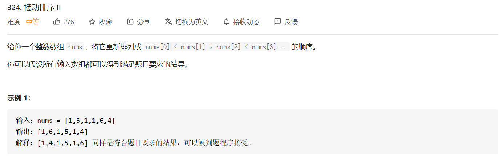
>
>   基本的思路很容易想到，就是将数组排序后将数组从中间位置进行等分，然后将两个数组进行穿插。
>
>   但是这种思路会造成一个问题，那就是对于 `[1,2,2,3]` 这种数据而言，得到的结果仍然是 `[1,2,2,3]`，而基本的思路是对数组进行逆序后再进行穿插。
>
>   除了用 `O(nlog(n))` 的比较排序外，还可以用 `O(n)` 的桶排序。

```python
class Solution:
    def wiggleSort(self, nums: List[int]) -> None:
        """
        Do not return anything, modify nums in-place instead.
        """
        n = len(nums)
        half = n // 2
        sorted_nums = sorted(nums,key=lambda x:-x)
        right_nums = sorted_nums[:half]
        left_nums = sorted_nums[half:]
        
        for i in range(0,n,2):
            nums[i] = left_nums[i//2]
        
        for i in range(1,n,2):
            nums[i] = right_nums[i//2]
```


#### 

>   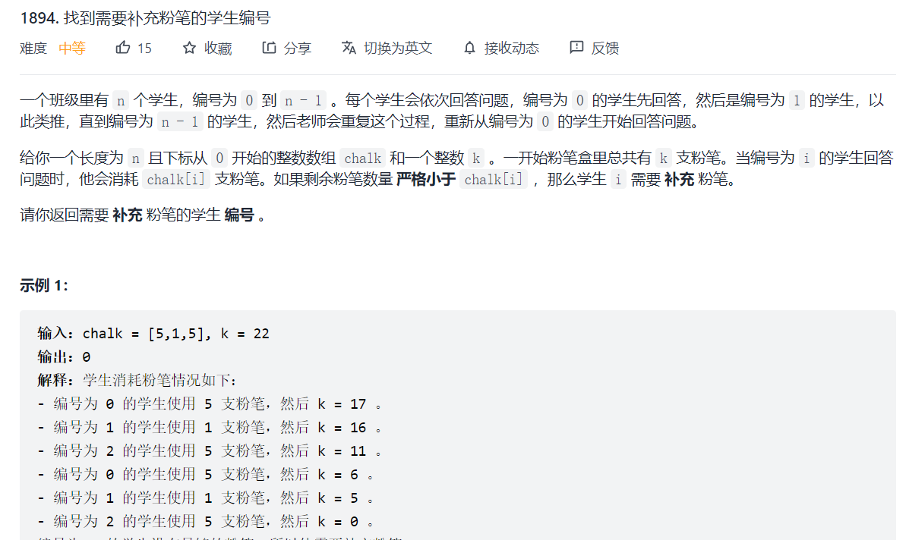

#### 932. 漂亮数组 🍉

#### 1416. 恢复数组 🍉

#### 1420. 生成数组 🍉

