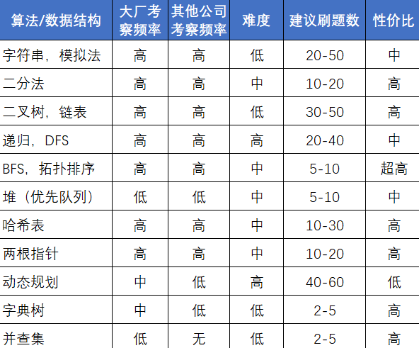


## 顺序100

#### 1. 两数之和 15 三数之和 18 四数之和

1.  两数之和是求下标，可以利用hash_map解决，2和3参考基本框架。

基本框架,考虑**重复元素**，求出所有可能解决：

+   threeSum中需要注意两种重复元素，一种是主穷举元素重复，第二种是双指针x元素重复

```python
class Solution:
    def threeSum(self, nums: List[int]) -> List[List[int]]:
        """
        1. 数组是无序的
        2. 数据是可能重复的
        """
        def twoSum(nums,target,start,end):
            ans = []
            l = start
            r = end
            while l < r:
                cur = nums[l]+nums[r]
                if cur == target:
                    ans.append([nums[start-1],nums[l],nums[r]])
                    r -= 1
                    l += 1
                    while l < r and nums[r] == nums[r+1]: r -= 1
                    while l < r and nums[l] == nums[l-1]: l += 1
                elif cur > target:
                    r -= 1
                    while l < r and nums[r] == nums[r+1]: r -= 1
                else:
                    l += 1
                    while l < r and nums[l] == nums[l-1]: l += 1
            return ans
            
        ans = []
        nums.sort()
        for i in range(len(nums)):
            if i > 0 and nums[i] == nums[i-1]: continue # 关键点：判重
            if nums[i] > 0: break # 关键点：如果当前数大于0，则
            tmp = twoSum(nums,-nums[i],i+1,len(nums)-1)
            if tmp: ans += tmp
        return ans
```


#### 3. 无重复字符的最长子串

思路：双指针，按照自己能最快速理解的模板

```python
class Solution:
    def lengthOfLongestSubstring(self, s: str) -> int:
        from collections import defaultdict
        count = defaultdict(lambda:0)
        
        left,right = 0,0
        ans = 0
        while right < len(s):
            if count[s[right]] == 0: # 1. 扩充右边界
                count[s[right]] += 1
            else:
                ans = max(right-left,ans)
                while left < right and count[s[right]] != 0: # 2. 缩小左边界
                    count[s[left]] -= 1
                    left += 1
                count[s[right]] += 1
            right += 1 
        
        return max(ans,right-left) # 这种写法需要额外多一个判断
```


#### 4. 寻找两个正序数组的中位数 

思路：重点是寻找当前的第k大的元素，注意不是下标，而为了加快搜索，需要每次排除掉k/2个元素。

重点：

+   循环结束条件，两个下标都应该满足条件小于等于数组长度
+   找到第k大的元素，但是在取元素的时候需要 `i+cnt-1`
+   每次循环结束时，需要缩小 $k$

```python
class Solution:
    def findMedianSortedArrays(self, nums1: List[int], nums2: List[int]) -> float:
        def findK(nums1,nums2,m,n,k):
            """
            	这里的k表示的含义是个数
            	而i和j标识的下标，所以cnt=1，指代第一个元素，下标为(i+cnt-1)
            """
            i,j = 0,0
            while i <= m and j <= n: # 结束条件
                if i >= m: return nums2[j+k-1]
                if j >= n: return nums1[i+k-1]

                cnt = k // 2
                if cnt == 0: return min(nums1[i],nums2[j])

                if i + cnt -1 >= m: cnt = m - i
                if j + cnt -1 >= n: cnt = n - j

                if nums1[i+cnt-1] >= nums2[j+cnt-1]:
                    j = j + cnt
                else:
                    i = i + cnt
                
                k -= cnt

        m = len(nums1)
        n = len(nums2)
        if (m + n) & 1:
            return findK(nums1, nums2, m, n, (m+n)//2 + 1) 
        else:
            return (findK(nums1, nums2, m, n, (m+n)//2) + findK(nums1, nums2, m, n, (m+n)//2+1) ) / 2
```


#### 5. 最长回文子串

思路：中心扩散算法。回文字符串有两种，一种是偶数个，一种是奇数个。偶数个就是以当前和下一个为中心点，而奇数个就是以当前为中心点，然后分别向外扩张。

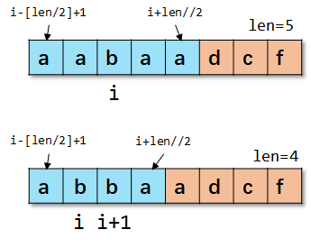

```python
class Solution:
    def longestPalindrome(self, s: str) -> str:
        def expand(s,l,r): # 扩充回文字符串范围
            while l >= 0 and r < len(s) and s[l] == s[r]:
                l -= 1
                r += 1
            return r - l - 1
        
        max_len = 0
        start,end = 0,0 # start和end表示包含了当前元素的坐标
        for i in range(len(s)):
            odd = expand(s,i,i)
            even = expand(s,i,i+1)
            max_cur = max(odd,even)

            # 更新范围边界
            if max_cur > max_len:
                max_len = max_cur
                start = i - (max_cur+1) // 2 + 1 # 这里需要注意臂长的计算
                end = i + (max_cur) // 2
        return s[start:end+1]
```


```python
class Solution:
    def longestPalindrome(self, s: str) -> str:
        dp = [[0]*len(s) for _ in range(len(s))]
        for i in range(len(s)):
            dp[i][i] = 1
        
        ans = [0,0]
        max_val = 0
        i = len(s) - 2
        while i >= 0:
            j = i + 1
            while j < len(s):
                if s[i] == s[j]:
                    if i == j-1:
                        dp[i][j] = 2
                    else:
                        dp[i][j] = (dp[i+1][j-1] + 2) if dp[i+1][j-1] > 0 else 0
                else:
                    dp[i][j] = 0
                if max_val < dp[i][j]:
                    ans = [i,j]
                    max_val = dp[i][j]
                j += 1
            i -= 1
        return "" if not ans else s[ans[0]:ans[1]+1]
```


#### 6 Z 字形变换

思路：关键是找到每个字符所在的行数，一种做法是引入flag变量，z字搜索；另一种是坐标转换。

```python
# 方法一
class Solution:
    def convert(self, s: str, numRows: int) -> str:
        """
        引入一个flag变量，用来表示当前前进的方向
        #   @   x   
        # # @ @ x x
        #   @   x
        """
        if numRows == 1: return s

        ans = ["" for _ in range(numRows)]
        flag = True
        row = 0
        for i in range(len(s)):
            ans[row] += s[i]
            row += (1 if flag else -1)

            if row == numRows-1:
                flag = False
            
            if row == 0:
                flag = True
        
        return "".join(ans)
  
# 方法二
class Solution:
    def convert(self, s: str, numRows: int) -> str:
        def getRow(s,index,numRows):
            """
            #   @   x   
            # # @ @ x x
            #   @   x

            """
            size = 2*numRows - 2 # size表示的是上面#,@或者x的数量
            num = index // size # num表示当前下标属于第几个循环
            left = index % size # left表示剩余几个元素
            if left <= numRows - 1: 
                # 如果剩下的元素比行数小，直接返回
                return left 
            else:
                # 否者计算反向下标
                return size - left

        if numRows == 1: return s
        ans = ["" for i in range(numRows)]
        for i in range(len(s)):
            row = getRow(s,i,numRows)
            ans[row] += s[i]
        
        return "".join(ans)
```


#### 7. 整数反转

思路：和下面190题思路类似，只不过这里需要检查范围

```python
class Solution:
    def reverse(self, x: int) -> int:
        MAX_VAL = 2**31 - 1
        MIN_VAL = -2**31
        def check(ans):
            if ans > MAX_VAL or ans < MIN_VAL: return True
            return False

        sign = 1 if x >= 0 else -1
        x = abs(x)

        ans = 0
        while x > 0:
            digit = x % 10
            ans = ans * 10 + digit
            x = x // 10
            if check(sign*ans): return 0
        return sign*ans
```


#### 8. 字符串转换整数 (atoi)

```python
class Solution:
    def myAtoi(self, s: str) -> int:
        MAX_VAL = 2**31 - 1
        MIN_VAL = -2**31

        def check(ans):
            return ans > MAX_VAL or ans < MIN_VAL

        transfer = {
            0:{"blank":0,"sign":2,"digit":1},
            1:{"digit":1,"blank":3},
            2:{"digit":1},
            3:{"blank":3}
        }
        sign_map = {"+":1,"-":-1}

        start = 0
        ans = 0
        sign = 1

        for c in s:
            if c.isdigit(): action = "digit"
            elif c in "+-": action = "sign"
            elif c == " ": action = "blank"
            else: break

            start = transfer[start].get(action,None)
            if start is None: break
            else:
                # 将运算放在这里的原因是：对于"  123 4awwq"
                # 当状态在3时候，此时输入空格还是正常的；
                # 但如果再遇到数字，这时候是不合法的，如果将运算放在上面取得action的时候，得到的结果
                # 是存在问题的
                if action == "digit":
                    ans = ans*10 + int(c)
                    if check(sign*ans):
                        return MAX_VAL if sign == 1 else MIN_VAL
                elif action == "sign":
                    sign = sign_map[c]
            
        return sign*ans
```


#### 9. 回文数

思路：除了采用字符串的方式，我们还可以通过反向计算出回文数据，然后判断构造出来的数据与原始数据是否相等的方式来判断。

```java
class Solution {
    public boolean isPalindrome(int x) {
        if(x < 0) return false;
        int data = x;
        int ans = 0;
        while (data > 0) {
            ans = ans*10 + data%10;
            data /= 10;
        }
        return ans == x;
    }
}
```


#### 10. 正则表达式匹配

```java
class Solution {
    public boolean isMatch(String s, String p) {
        /*
            s 是待匹配字符串
            p 是模式字符串        
            1. dp[i][j] 表示 s[:i]与p[:j]表示长度为i和长度为j的两个字符串能否匹配
            2. i,j表示字符串的长度
            3. 
            第一层判断: s[i]是否等于p[j]，或者p[j]是否为"."
                Yes: dp[i][j] = dp[i-1][j-1] // 匹配当前字符
                No: 前往第二层判断
            第二层判断：s[i]是否等于p[j-1]，或者p[j-1]是否为"."
                Yes: dp[i][j] = dp[i-1][j]; // 匹配多次 （隐含着可以匹配一次，因为多次就包含了一次）
                No: dp[i][j] |= dp[i][j-2]; // 不匹配，aaa和aac*a，c*就可以不匹配 易错点
        */
        int m = s.length();
        int n = p.length();

        boolean [][] dp = new boolean[m+1][n+1]; // 默认为false

        dp[0][0] = true;
        for(int i = 1; i <= n; i++) {
            if(p.charAt(i-1) == '*') dp[0][i] = dp[0][i-2];
        }

        for(int i = 1; i <= m; i++) {
            for(int j = 1; j <= n; j++) {
                if(p.charAt(j-1) == '.' || p.charAt(j-1) == s.charAt(i-1)) {
                    dp[i][j] = dp[i-1][j-1];
                } else if(p.charAt(j-1) == '*') {
                    dp[i][j]  = dp[i][j-2] || ((p.charAt(j-2) == s.charAt(i-1) || p.charAt(j-2) == '.') && dp[i-1][j]);
                }
            }
        }
        return dp[m][n];
    }
}
```


#### 11. 盛最多水的容器

思路：如果采用暴力法，那就是遍历所有可能的数对，而双指针法则去除那些明显不可能的解（每次从较矮的一端搜索）。

```java
class Solution {    
	public int maxArea(int[] height) {        
        int left = 0,right = height.length-1;        
        int ans = 0;        
        while (left < right) {            
            int w = right - left;            
            int h = Math.min(height[left],height[right]);            
            ans = Math.max(ans,w*h);            
            if(height[left] <= height[right]) left++;
            else right--;        
        }        
        return ans;    
    }
}
```

#### 12 整数转罗马数字

思路：这里需要明白`3994=3000+900+90+4=MMMCMXCIV`，这里会使用三个重复的`M`来表示3000。

```java
class Solution {    
    public String intToRoman(int num) {        
        HashMap<Integer,String> data = new HashMap<>();        
        data.put(1000,"M");        
        data.put(500,"D");        
        data.put(100,"C");        
        data.put(50,"L");        
        data.put(10,"X");        
        data.put(5,"V");        
        data.put(1,"I");        
        data.put(900,"CM");        
        data.put(400,"CD");        
        data.put(90,"XC");        
        data.put(40,"XL");        
        data.put(9,"IX");        
        data.put(4,"IV");        
        StringBuilder ans = new StringBuilder();        
        int []list = new int[]{1000,900,500,400,100,90,50,40,10,9,5,4,1};        
        for(int i = 0; i < list.length && num > 0; i++) {            
            int freq = num / list[i];            
            if(freq > 0) {                
                for(int j = 0; j < freq; j++) ans.append(data.get(list[i]));                
                num = num % list[i];            
            }        
        }        
        return ans.toString();    
    }
}
```

#### 13. 罗马数字转整数

思路：罗马数字中，`MCMXCIV`可以写成`M+CM+XC+IV=1000+900+90+4=1994`

```java
class Solution {    
    public int romanToInt(String s) {        
        HashMap<Character,Integer> data = new HashMap<>();        
        data.put('I',1);        
        data.put('a',4);        
        data.put('V',5);        
        data.put('b',9);        
        data.put('X',10);        
        data.put('c',40);       
        data.put('L',50);        
        data.put('d',90);        
        data.put('C',100);       
        data.put('e',400);       
        data.put('D',500);   
        data.put('f',900);    
        data.put('M',1000);   
        s = s.replace("IV","a");  
        s = s.replace("IX","b");  
        s = s.replace("XL","c");  
        s = s.replace("XC","d");   
        s = s.replace("CD","e");     
        s = s.replace("CM","f");      
        int ans = 0;      
        for(int i = 0; i < s.length(); i++) { 
            ans += data.get(s.charAt(i));       
        }      
        return ans;    
    }
}
```

#### 14. 最长公共前缀

这题一共存在五种思路：

```markdown
1、所求的最长公共前缀子串一定是每个字符串的前缀子串。所以随便选择一个字符串作为标准，把它的前缀串，与其他所有字符串进行判断，看是否是它们所有人的前缀子串。这里的时间性能是O(m*n*m)。
2、列出所有的字符串的前缀子串，将它们合并后排序，找出其中个数为n且最长的子串。时间性能为O(n*m+m*n*log(m*n))
3、纵向扫描：从下标0开始，判断每一个字符串的下标0，判断是否全部相同。直到遇到不全部相同的下标。时间性能为O(n*m)。
4、横向扫描：前两个字符串找公共子串，将其结果和第三个字符串找公共子串……直到最后一个串。时间性能为O(n*m)。
5、借助trie字典树。将这些字符串存储到trie树中。那么trie树的第一个分叉口之前的单分支树的就是所求。
```

```java
// 思路3 纵向扫描
class Solution {    
    public String longestCommonPrefix(String[] strs) {        
        StringBuilder ans = new StringBuilder();        
        int min_len = 201;        
        for(String str: strs) {            
            min_len = Math.min(min_len,str.length()); // 计算出所有字符串的最小长度  
        }        if(min_len == 0) return "";         
        for(int i = 0; i < min_len; i++) { 
            // 比较每个字符串在位置i的字符是否相等           
            char cur = strs[0].charAt(i);          
            for(int j = 1; j < strs.length; j++) {          
                if(cur != strs[j].charAt(i)) { // 如果不相等立即中断输出 
                    return strs[j].substring(0,i);         
                }       
            }    
        }     
        return strs[0].substring(0,min_len); // 否则输出完整结果 
    }
} 
```

```python
# 思路5，字典树
class Solution:    
    def longestCommonPrefix(self, strs: List[str]) -> str:   
        root = {}     
        for data in strs:      
            node = root      
            for i in range(len(data)):      
                c = data[i]         
                if c not in node:          
                    node[c] = {}          
                    node = node[c]       
                    node["$"] = True # 建立字典树，一定要标识当前字符串的结束符       
        ans = ""      
        node = root      
        while len(node)==1: # 只有当前节点只有一个的时候才需要遍历，生成子字符串        
            key = list(node.keys())[0]       
            if key == "$": break # 如果遇到一个字符串的结束符就终止      
            ans += key         
            node = node[key]  
        return ans
```


#### 15 3数之和

```python 
class Solution:
    def threeSum(self, nums: List[int]) -> List[List[int]]:
        """
        1. 数组是无序的
        2. 数据是可能重复的
        """
        def twoSum(nums,target,start,end):
            ans = []
            l = start
            r = end
            while l < r:
                cur = nums[l]+nums[r]
                if cur == target:
                    ans.append([nums[start-1],nums[l],nums[r]])
                    r -= 1
                    l += 1
                    while l < r and nums[r] == nums[r+1]: r -= 1 # 去重
                    while l < r and nums[l] == nums[l-1]: l += 1
                elif cur > target:
                    r -= 1
                    while l < r and nums[r] == nums[r+1]: r -= 1
                else:
                    l += 1
                    while l < r and nums[l] == nums[l-1]: l += 1
            return ans
            
        ans = []
        nums.sort()
        for i in range(len(nums)):
            if i > 0 and nums[i] == nums[i-1]: continue # 关键点：判重
            if nums[i] > 0: break # 关键点：如果当前数大于0，则
            tmp = twoSum(nums,-nums[i],i+1,len(nums)-1)
            if tmp: ans += tmp
        return ans
```


#### 16 最接近的三数之和

```python
class Solution:
    def threeSumClosest(self, nums: List[int], target: int) -> int:
        def twoSumClosest(closest_sum,nums,target,start,end):
            left = start
            right = end
            while left < right:
                val = nums[left] + nums[right] + nums[start-1]
                if val == target:
                    return target
                elif val > target:
                    # 如果当前的数据已经大于target，不能让它再大了
                    # 那么应该减小当前的数据
                    right -= 1
                elif val < target:
                    # 如果当前的数据已经小于target，不能让它再小了
                    # 那么应该增大当前的数据
                    left += 1
                # 单独的操作
                if abs(target - closest_sum) > abs(target-val):
                    closest_sum = val
            return closest_sum
        
        nums.sort() # 对数据进行排序
        closest_sum = float("inf")
        for i in range(len(nums)):
            closest_sum = twoSumClosest(closest_sum,nums,target,i+1,len(nums)-1)
            if closest_sum == target: return target
        return closest_sum
```


#### 17 电话号码的字母组合

思路：直接回溯法orDFS

```python
class Solution:
    def letterCombinations(self, digits: str) -> List[str]:
        ans = []
        if len(digits) == 0: return ans
        digit_dict={"2":"abc","3":"def","4":"ghi","5":"jkl","6":"mno","7":"pqrs","8":"tuv","9":"wxyz"}
        def helper(digits,i,path):
            if i >= len(digits):
                ans.append(path[:])
                return    
            for val in digit_dict[digits[i]]:
                helper(digits,i+1,path+val)
        
        path = ""
        helper(digits,0,path)
        return ans
                

```


#### 18 四数之和

```python
class Solution:
    def fourSum(self, nums: List[int], target: int) -> List[List[int]]:
        def twoSum(nums,target,start,end): # 两数之和
            left,right = start,end
            ans = []
            while left < right:
                val = nums[left] + nums[right]
                if val == target:
                    ans.append([nums[start-1],nums[left],nums[right]])
                    left += 1
                    right -= 1
                    while left < right and nums[left] == nums[left-1]: left+=1
                    while left < right and nums[right] == nums[right+1]: right-=1
                elif val > target:
                    right -= 1
                    while left < right and nums[right] == nums[right+1]: right-=1
                else:
                    left += 1
                    while left < right and nums[left] == nums[left-1]: left+=1
            return ans
        
        def threeSum(nums,target,start,end): # 三数之和
            ans = []
            for i in range(start,end+1):
                if nums[i] > 0 and nums[i] > target: break
                if i > start and nums[i] == nums[i-1]: continue
                val = twoSum(nums,target-nums[i],i+1,end)
                if val: ans = ans + val
            return ans
        
        nums.sort()
        ans = []
        print(nums)
        for i in range(len(nums)):
            if nums[i] > 0 and nums[i] > target: break
            if i > 0 and nums[i] == nums[i-1]: continue
            val = threeSum(nums,target-nums[i],i+1,len(nums)-1)
            if val:
                for ele in val:
                    ans.append([nums[i]]+ele)
        return ans
```


#### 19 删除链表的倒数第N个节点

思路：dummy节点+快慢指针

```python
class Solution:
    def removeNthFromEnd(self, head: ListNode, n: int) -> ListNode:
        dummy = ListNode(-1)
        dummy.next = head
        fast = slow = dummy
        while n > 0:
            fast = fast.next
            n -= 1
        
        while fast.next:
            slow = slow.next
            fast = fast.next
        
        slow.next = slow.next.next

        return dummy.next
```

#### 20 有效的括号

```python
class Solution:
    def isValid(self, s: str) -> bool:
        mark_map = {")":"(","]":"[","}":"{"}
        stack = []
        for c in s:
            if c in "([{":
                stack.append(c)
            else:
                if not stack or stack.pop() != mark_map[c]:
                    return False
        
        return len(stack) == 0

```

#### 21 合并两个有序链表

```python
# 递归解法
class Solution:
    def mergeTwoLists(self, l1: ListNode, l2: ListNode) -> ListNode: 
        def helper(l1,l2):         
            if not l1: return l2        
            if not l2: return l1    
            if l1.val <= l2.val:   
                l1.next = helper(l1.next,l2)              
                return l1       
            else:           
                l2.next = helper(l1,l2.next)          
                return l2           
            return helper(l1,l2)

# 非递归解法
class Solution:   
    def mergeTwoLists(self, l1: ListNode, l2: ListNode) -> ListNode:    
        dummy = ListNode(-1)   
        dummy.next = l1     
        p = dummy    
        while l1 and l2: 
            if l1.val <= l2.val:  
                p.next = l1      
                p = p.next         
                l1 = l1.next        
            else:           
                p.next = l2    
                p = p.next       
                l2 = l2.next    
        if l1: p.next = l1   
        else: p.next = l2 
        return dummy.next
```


#### 22. 括号生成

思路：后面还有一题和这个类似，关键在于保证左边的括号一定大于右边括号数量。

```python
class Solution:    
    def generateParenthesis(self, n: int) -> List[str]:    
        ans = []     
        def helper(idx,path,left,right):  
            if idx == 2*n:         
                if left == right:   
                    ans.append(path[:])        
                return 
            if left >= right:
                helper(idx+1,path+"(",left+1,right) # 加左括号      
                if left > right: # 在保证右括号比左括号少的前提下，加右括号       
                    helper(idx+1,path+")",left,right+1)   
        path = ""      
        left = right = 0    
        helper(0,path,left,right)    
        return ans
```


#### 23. 合并K个升序链表

思路：最小堆。

```python
# Definition for singly-linked list.
# class ListNode:
#     def __init__(self, val=0, next=None):
#         self.val = val
#         self.next = next
class Solution:
    def mergeKLists(self, lists: List[ListNode]) -> ListNode:
        def __lt__(self,other):
            return self.val < other.val
        ListNode.__lt__ = __lt__

        H = []
        heapify(H)
        n = len(lists)

        for i in range(n):
            if lists[i]:
                heappush(H,lists[i])
        
        dummy = ListNode(-1)
        p = dummy
        while H:
            top = heappop(H)
            if top.next:
                heappush(H,top.next)
            p.next = top
            p = p.next
        return dummy.next
```

#### 24 两两交换链表中的节点

思路：按照递归或者迭代交换。

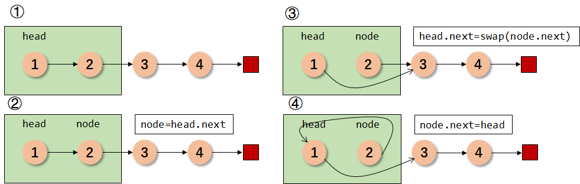

```python
# 递归
class Solution:    
    def swapPairs(self, head: ListNode) -> ListNode:       
        def helper(head):          
            if not head or not head.next: return head         
            node = head.next        
            head.next = helper(node.next)        
            node.next = head           
            return node      
        return helper(head)
    
# 迭代
class Solution:
    def swapPairs(self, head: ListNode) -> ListNode:
        dummy = ListNode(-1)
        dummy.next = head
        p = fast = slow = dummy
        while fast.next and fast.next.next:
            slow = fast.next
            fast = fast.next.next
            

            slow.next = fast.next
            fast.next = slow
            p.next = fast

            p = slow
            fast = slow
        
        return dummy.next
```


#### 25. K 个一组翻转链表

```python
# Definition for singly-linked list.
# class ListNode:
#     def __init__(self, val=0, next=None):
#         self.val = val
#         self.next = next
class Solution:
    def reverseKGroup(self, head: ListNode, k: int) -> ListNode:
        def reverse(slow,fast):
            head = slow
            prev = None
            while head:
                node = head.next
                head.next = prev
                prev = head
                head = node
            return fast,slow
        
        dummy = ListNode(-1)
        dummy.next = head
        
        fast = slow = dummy
        prev = last = dummy
        while fast:
            K = k
            prev = fast
            slow = fast.next
            while K > 0 and fast:
                fast = fast.next
                K -= 1
            if not fast: break
            last = fast.next
            prev.next = None
            fast.next = None

            slow,fast = reverse(slow,fast)
            prev.next = slow
            fast.next = last
            
        return dummy.next
```


#### 26. 删除有序数组中的重复项

思路：定义两个变量，i和j，i用来表示原数组的下标，j用来表示没有重复元素的下标。

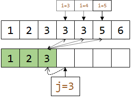

```python
class Solution:
    def removeDuplicates(self, nums: List[int]) -> int:
        j = 0
        for i in range(len(nums)):
            if i < 1 or nums[i] != nums[j-1]: # 下标（小于一）或者（元素不等于倒数第k个元素）
                nums[j] = nums[i]
                j += 1
        return j
```


#### 27 移除元素

思路：26和27在模板上有些类似，这里题有两种思路，一种是覆盖，一种是交换。

```python
# 交换型
class Solution:
    def removeElement(self, nums: List[int], val: int) -> int:
        n = len(nums)
        j = 0
        for i in range(n):
            if nums[i] != val: # 原地移除等于val的元素
                nums[i],nums[j] = nums[j],nums[i]
                j += 1
        return j


# 覆盖型
class Solution:
    def removeElement(self, nums: List[int], val: int) -> int:
        j = 0
        for i in range(0,len(nums)):
            if nums[i] != val:
                nums[j] = nums[i]
                j += 1
        return j
```

#### 28. 实现 strStr() 🍉

KMP算法。


#### 29. 两数相除

```python
class Solution:
    def divide(self, dividend: int, divisor: int) -> int:
        MAX = 2147483647
        MIN = -2147483648
        def fast(x,n): # x*n
            ans = 0
            while n > 0:
                if n&1: ans += x
                x += x
                n >>= 1
            return ans
        
        def check(val):
            if val > MAX or val < MIN: return False
            else: return True

        sign = -1 if (dividend < 0 and divisor > 0)\
                    or (dividend > 0 and divisor < 0) else 1
        dividend = abs(dividend)
        divisor = abs(divisor)
        
        left = 0
        right = dividend
        while left <= right:
            mid = (left + right + 1) >> 1
            val = fast(divisor,mid) 
            if val == dividend:
                return sign*mid if check(sign*mid) else MAX
            elif val > dividend:
                right = mid - 1
            else:
                left = mid + 1
        return sign*right if check(sign*right) else MAX

```

#### 30. 串联所有单词的子串 🍉

```python
class Solution:
    def findSubstring(self, s: str, words: List[str]) -> List[int]:
        
        result = list()
        n_word, n = len(words[0]), len(words)

        for i in range(n_word):
            begin = end = i
                    
            counter  = collections.Counter(words)
            size = len(counter)

            while end < len(s):
                # 对于end的指针指向的对象进行处理
                tmp_end_word = s[end: end + n_word]
                if tmp_end_word in counter.keys():
                    counter[tmp_end_word] -= 1
                    if counter[tmp_end_word] == 0:
                        size -= 1
                    
                end += n_word # 移动 end 指针

                while size == 0:
                    if end - begin == n * n_word:
                        result.append(begin)
                    # 对于 begin 的指针指向的对象进行处理
                    tmp_begin_word = s[begin: begin + n_word]
                    if tmp_begin_word in counter.keys():
                        counter[tmp_begin_word] += 1
                        if counter[tmp_begin_word] > 0:
                            size += 1
                    begin += n_word # 移动 begin 指针
            
        return result
```


#### 31下一个排列

思路：以一个数`12385764`为例，先从后向前找到5，再找到6，再交换，再逆序

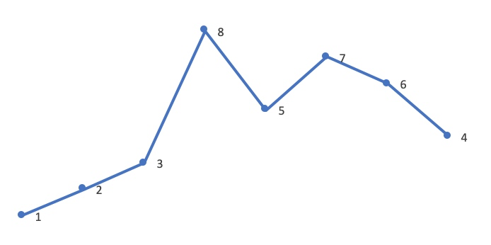

```python
class Solution:   
     def nextPermutation(self, nums: List[int]) -> None:  
        """        
        Do not return anything, modify nums in-place instead.        
        """        
        def swap(nums,l,r):            
            while l <= r:            
                nums[l],nums[r] = nums[r],nums[l]   
                l += 1 
                r -= 1       
        size = len(nums)    
        i = size - 1  
        # 第一步，找到一个峰值        
        while i >= 1 and nums[i] <= nums[i-1]:            
            i -= 1        
        
        # 第二步，交换数        
        if i != 0:            
            j = i - 1            
            k = size - 1           
            while nums[k] <= nums[j] :             
                k -= 1           
                nums[k],nums[j] = nums[j],nums[k] 
         
        # 第三步，逆序数据     
        swap(nums,i,size-1)     
        return nums
```


#### 32 最长有效括号 🍉

思路：此题还可以用栈实现

+   动态规划

```python
class Solution:    
    def longestValidParentheses(self, s: str) -> int:     
        """     
        1. dp[i] 数组定义为以下标为i未结尾的最长有效括号   
        2. i表示数组的下标i     
        3.      
        if i == "(":        
        	dp[i] = 0       
        elif i == ")":        
        	idx = i - dp[i-1] - 1     
          	if idx == "(":        
            	dp[i] = dp[i-1] + 2 + dp[idx-1]        
            else:       
            	dp[i] = 0     
        4. base case            
        	dp[]
        """  
        size = len(s)  
        dp = [0]*(size+1)    
        for i in range(1,size+1): 
            if s[i-1] == ")":        
                idx = i - dp[i-1] - 1       
                if idx >= 1 and s[idx-1] == "(":       
                    dp[i] = dp[i-1] + 2 + dp[idx-1]    
        return max(dp) # 这里需要注意
```

+ 栈
```python
class Solution:
    def longestValidParentheses(self, s: str) -> int:
        stack = [-1]
        n = len(s)
        ans = 0
        for i in range(n):
            if s[i] == "(":
                stack.append(i)
            else:
                stack.pop()
                if not stack:
                    stack.append(i)
                else:
                    ans = max(ans,i-stack[-1])
        return ans

```

+ 双边循环 and 无需额外空间

```python
# 不需要额外空间的做法

class Solution:   
    def longestValidParentheses(self, s: str) -> int:     
        left,right = 0,0     
        i = 0       
        ans = 0    
        while i < len(s): # 1. 从左到右，left < right 置空       
            if s[i] == "(": 
                left += 1      
            else: right += 1      
            if left == right:     
                ans = max(ans,2*right)       
            elif left < right:           
                left = right = 0      
                i += 1           
         left = right = 0      
         i = len(s)-1    
         while i >= 0: # 2. 从右到左，right < left 置空     
            if s[i] == "(": 
                left += 1        
            else: right += 1      
            if left == right:            
                ans = max(ans,2*left)       
            elif left > right:        
                left = right = 0       
                i -= 1       
         
        return ans
```

#### 33 搜索旋转排序数组

思路：考察二分法。**数组中不存在重复元素**。

```python
class Solution:
    def search(self, nums: List[int], target: int) -> int:
        """
        元素互不相同
        """
        n = len(nums)
        left = 0
        right = n - 1

        if nums[left] <= target:
            # target在左边
            while left <= right:
                mid = left + (right-left) // 2
                if nums[mid] == target:
                    return mid

                if nums[mid] < nums[left]:
                    right = mid - 1
                else:
                    if nums[mid] > target:
                        right = mid - 1
                    else:
                        left = mid + 1
        else:
            while left <= right:
                mid = left + (right-left) // 2 
                if nums[mid] == target:
                    return mid

                if nums[mid] > nums[right]:
                    left = mid + 1
                else:
                    if nums[mid] < target:
                        left = mid + 1
                    else:
                        right = mid - 1
            
        return -1
```


#### 34. 在排序数组中查找元素的第一个和最后一个位置

思路：等价于`lower_bound`和`upper_bound`

```python
class Solution:
    def searchRange(self, nums: List[int], target: int) -> List[int]:
        n = len(nums)
        left,right = 0,n
        ans = [-1,-1]
        
        flag = False
        while left < right:
            mid = left + (right-left) // 2
            if nums[mid] == target:
                flag = True
                right = mid
            elif nums[mid] > target:
                right = mid
            else:
                left = mid + 1
        if not flag: return ans
        ans[0] = right

        left,right = 0,n
        while left < right:
            mid = left + (right-left) // 2
            if nums[mid] <= target:
                left = mid + 1
            else:
                right = mid
        ans[1] = left - 1
        return ans
        
```


#### 35. 搜索插入位置

思路：二分法，搜索`lower_bound`

```python
class Solution:
    def searchInsert(self, nums: List[int], target: int) -> int:
        left,right = 0,len(nums)
        while left < right:
            mid = left + (right - left) // 2
            if nums[mid] >= target:
                right = mid
            else:
                left = mid + 1
        return left
```


#### 36. 有效的数独

思路：三个哈希表，分别表示行、列、单元格9个数字是否用过。

```python
class Solution:
    def isValidSudoku(self, board: List[List[str]]) -> bool:
        cols = {i:{j+1:False for j in range(9)} for i in range(9)}
        rows = {i:{j+1:False for j in range(9)} for i in range(9)}
        cells = {i:{j+1:False for j in range(9)} for i in range(9)}

        for i in range(9):
            for j in range(9):
                if board[i][j] != ".":
                    val = int(board[i][j])
                    if rows[i].get(val): return False
                    else: rows[i][val] = True

                    if cols[j].get(val): return False
                    else: cols[j][val] = True
                    
                    cell_index = (i // 3) * 3 + j // 3
                    if cells[cell_index].get(val): return False
                    else: cells[cell_index][val] = True
        return True
```


#### 37 解数独

思路：这种没有方向的搜索，先按照列搜索，`j=j+1`，当列到达边界时，`i=i+1`，行增加，直到行也到达边界。

```python
from typing import *
class Solution:
    def solveSudoku(self, board: List[List[str]]) -> None:
        """
        Do not return anything, modify board in-place instead.
        """
        n = 9

        cols = {i:{j+1:False for j in range(n)} for i in range(n)}
        rows = {i:{j+1:False for j in range(n)} for i in range(n)}
        cells = {i:{j+1:False for j in range(n)} for i in range(n)}

        for i in range(n):
            for j in range(n):
                if board[i][j] != ".":
                    val = int(board[i][j])
                    rows[i][val] = True
                    cols[j][val] = True
                    cell_index = (i // 3) * 3 + (j // 3)
                    cells[cell_index][val] = True

        
        def backtrace(i,j,board):
            if j == 9:
                i += 1
                j = 0
                if i == 9:
                    return True

            if board[i][j] == ".":
                cell_index = (i // 3) * 3 + (j // 3)
                for val in range(1,n+1):
                    if not cols[j].get(val) and not rows[i].get(val) and not cells[cell_index].get(val):
                        board[i][j] = str(val)
                        cols[j][val] = True
                        rows[i][val] = True
                        cells[cell_index][val] = True

                        if backtrace(i,j+1,board): return True

                        board[i][j] = "."
                        cols[j][val] = False
                        rows[i][val] = False
                        cells[cell_index][val] = False
            else:
                if backtrace(i,j+1,board): return True
                    
        backtrace(0,0,board)
```


#### 38. 外观数列

思路：递归来、递归去

```python
class Solution:
    def countAndSay(self, n: int) -> str:
        def helper(n):
            if n == 1: return "1"
            prev = helper(n-1)
            cur = prev[0]
            cnt = 1
            ans = ""
            for i in range(1,len(prev)):
                if prev[i] == cur:
                    cnt += 1
                else:
                    ans += str(cnt) + cur
                    cur = prev[i]
                    cnt = 1
            return ans + str(cnt) + cur

        return helper(n)
```


#### 39 组合总和

```python
class Solution:
    def combinationSum(self, candidates: List[int], target: int) -> List[List[int]]:
        """
        1. 无重复元素
        2. 数字无限制重复被选取
        3. 不能包含重复解
        """
        self.ans = []
        def helper(start,path,target):
            if target == 0:
                self.ans.append(path[:])
                return
            
            for i in range(start,len(candidates)):
                if target >= candidates[i]:
                    helper(i,path+[candidates[i]],target-candidates[i])
        
        start = 0
        path = []
        helper(start,path,target)
        return self.ans        
```


#### 40. 组合总和 II

思路：

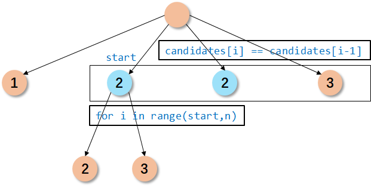

+   `helper(i+1,K-candidates[i],path+[candidates[i]])` 表示在下一次递归中，不再使用当前元素
+   `for i in range(start,len(candidates))`表示最终的答案中，不考虑顺序的前提下，不能由重复项
+   `i > start and candidates[i] == candidates[i-1]` 表示过滤掉数组中的重复元素

```python
class Solution:
    def combinationSum2(self, candidates: List[int], target: int) -> List[List[int]]:
        self.ans = []
        def helper(start,K,path):
            if K == 0:
                self.ans.append(path[:])
                return 
            
            for i in range(start,len(candidates)):
                if i > start and candidates[i] == candidates[i-1]:
                    continue
                else:
                    if K >= candidates[i]:
                        helper(i+1,K-candidates[i],path+[candidates[i]])
                    else: break
        
        candidates.sort()
        path = []
        used = [False]*len(candidates)
        helper(0,target,path)
        return self.ans 
```


#### 41. 缺失的第一个正数

>   思路一：哈希表

将数据转化为哈希表，然后在`[1,n]`的范围内进行遍历，其中n表示数组的长度。

```python
class Solution:
    def firstMissingPositive(self, nums: List[int]) -> int:
        hash_set = set(nums)

        for i in range(1,len(nums)+1):
            if i not in hash_set:
                return i
        return len(nums)+1
        
```

>   思路二：

```python
class Solution:
    def firstMissingPositive(self, nums: List[int]) -> int:
        n = len(nums)
        # 将数据交换到它本来应该的位置
        for i in range(n):
            # 这和利用hash表存在差异
            while nums[i] >= 1 and nums[i] <= n and nums[nums[i]-1] != nums[i]:
                nums[nums[i]-1],nums[i] = nums[i],nums[nums[i]-1]
        
        for i in range(n):
            if nums[i] != i+1:
                return i+1
        return n+1
```


#### 42. 接雨水

思路：

```python
class Solution:
    def trap(self, height: List[int]) -> int:
        """
        维护一个单调递减栈。
        如果违反了单调性，意味着我们可以在这个范围内装水，更新结果
        否则，继续。
        """
        stack = []
        n = len(height)
        fill = 0

        for i in range(n):
            while stack and height[stack[-1]] < height[i]:
                lower = stack.pop()
                if not stack: break
                h = min(height[stack[-1]],height[i]) - height[lower]
                w = i - stack[-1] - 1
                fill += (h*w)
            stack.append(i)
        return fill
```


#### 43 字符串相乘 🍉

思路：乘法转加法


```python
class Solution:
    def multiply(self, num1: str, num2: str) -> str:
        def mul(num1,num2,off):
            """ num1的长度大于num2 """
            n = len(num1)
            carry = 0
            ans = ""
            for i in range(n):
                cur = carry + int(num1[i])*int(num2)
                ans += str(cur % 10)
                carry = cur // 10
            if carry > 0:
                ans += str(carry)
            ans = ("0"*off + ans).rstrip("0")
            return "0" if len(ans) == 0 else ans
        
        def add(num1,num2):
            """ num1的长度大于num2 """
            n = len(num2)
            ans = ""
            carry = 0
            ans = ""
            for i in range(n):
                cur = carry + int(num1[i])+int(num2[i])
                ans += str(cur % 10)
                carry = cur // 10
            
            for i in range(n,len(num1)):
                cur = carry + int(num1[i])
                ans += str(cur % 10)
                carry = cur // 10

            if carry > 0:
                ans += str(carry)
            
            return ans
        
        if len(num1) < len(num2):
            num1,num2 = num2,num1
        
        num1 = num1[::-1]
        num2 = num2[::-1]
            
        sum_arr = []
        for i in range(len(num2)):
            sum_arr.append(mul(num1,num2[i],i))
        ans = sum_arr[0]
        for i in range(1,len(sum_arr)):
            if len(ans) >= len(sum_arr[i]):
                ans = add(ans,sum_arr[i])
            else:
                ans = add(sum_arr[i],ans)
        return ans[::-1]
```


#### 44. 通配符匹配

```python
class Solution:
    def isMatch(self, s: str, p: str) -> bool:
        @functools.lru_cache(None)
        def helper(i,j):
            if i == 0 and j == 0:
                return True
            if i == 0:
                if p[j-1] == "*":
                    return helper(i,j-1)
                else:
                    return False
            elif j == 0:
                return False

            if p[j-1] == "*":
                return helper(i,j-1) or helper(i-1,j)
            elif p[j-1] == s[i-1] or p[j-1] == "?":
                return helper(i-1,j-1)
            return False

        return helper(len(s),len(p))
```


#### 45. 跳跃游戏 II

思路：贪心

```python
class Solution:    
    def jump(self, nums: List[int]) -> int:        
        cur_max = 0 # 当前能够访问的最大范围，初始化只能访问第一个元素        
        max_i = 0 # 当前区域能够访问的最大范围        
        cnt = 0 # 需要跳的次数        
        for i in range(len(nums)):             
            if i <= cur_max: # 如果下标在能够访问的范围内                
                max_i = max(i+nums[i],max_i) # 更新            
            else:                
                cur_max = max_i # 需要跳                
                cnt += 1                
                max_i = max(i+nums[i],max_i) # 更新        
        return cnt
```


#### 46. 全排列

```python
class Solution:
    def permute(self, nums: List[int]) -> List[List[int]]:
        """
        1. 不含重复数字
        2. 数字不能重复使用
        3. 顺序重要，不同顺序代表不同结果
        """
        self.ans = []
        def helper(path,used):
            if len(path) == len(nums):
                self.ans.append(path[:])
                return
            
            for i in range(len(nums)):
                if not used[i]:
                    used[i] = True
                    helper(path+[nums[i]],used)
                    used[i] = False
        
        path = []
        used = [False]*len(nums)
        helper(path,used)
        return self.ans

```


#### 47. 全排列 II

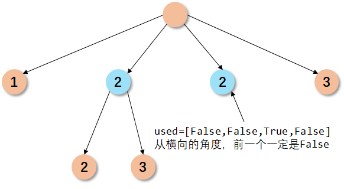

思路：`if i > 0 and not used[i-1] and nums[i] == nums[i-1]`这一步在从横向角度理解，平行的两个元素，前一个元素一定没有用

```python
class Solution:
    def permuteUnique(self, nums: List[int]) -> List[List[int]]:
        """
        包含重复元素，考虑顺序，数字不能重复使用
        """
        n = len(nums)
        nums.sort()
        visited = [False]*n
        self.ans = []

        def helper(start,path):
            if start == n:
                self.ans.append(path[:])
                return
            
            for i in range(n):
                if visited[i]: continue
                if i > 0 and not visited[i-1] and nums[i] == nums[i-1]: continue

                visited[i] = True
                helper(start+1,path+[nums[i]])
                visited[i] = False
        
        helper(0,[])
        return self.ans
```


#### 48. 旋转图像

思路：找到数学规律

```python
class Solution:
    def rotate(self, matrix: List[List[int]]) -> None:
        """
        Do not return anything, modify matrix in-place instead.
        """
        n = len(matrix)
        for x in range(0,n//2):
            for y in range(x,n-x-1):
                matrix[y][n-1-x],matrix[n-1-x][n-1-y],matrix[n-1-y][x],matrix[x][y] =\
                    matrix[x][y],matrix[y][n-1-x],matrix[n-1-x][n-1-y],matrix[n-1-y][x]

```


#### 49 字母异位词

```python
# 哈希思想，关键在于hash表的key的构建
# 思路一：对字符串进行排序，相同的字符串自然具有相同的键
# 思路二：对将质数映射到字母上，通过质数的乘法构成键
# 思路三：统计每个单词中，字母出现的频率，构成键
class Solution:    
    def groupAnagrams(self, strs: List[str]) -> List[List[str]]:        
        primes_map = {'a': 2, 'b': 3, 'c': 5, 'd': 7, 'e': 11, 'f': 13, 'g': 17, 'h': 19, 'i': 23, 'j': 29, 'k': 31, 'l': 37, 'm': 41, 'n': 43, 'o': 47, 'p': 53, 'q': 59, 'r': 61, 's': 67, 't': 71, 'u': 73, 'v': 79, 'w': 83, 'x': 89, 'y': 97, 'z': 101}        
        count = collections.defaultdict(list)        
        def helper(s):            
            val = 1            
            for c in s:                
                val *= primes_map[c]            
            return val                
        values = list(map(helper,strs))        
        for i in range(len(values)):            
            count[values[i]].append(strs[i])                
        return list(count.values())
```


#### 50. Pow(x, n)

>   思路：快速幂，注意n为负数的情况

```python
class Solution:
    def myPow(self, x: float, n: int) -> float:
        sign = True if n < 0 else False
        n = abs(n)
        ans = 1
        while n > 0:
            if n&1: ans = ans*x
            x *= x
            n >>= 1
        return 1/ans if sign else ans
```


#### 51 N皇后

>   思路：回溯，判断每一列和斜对角是否可放置

```python
class Solution:   
    def solveNQueens(self, n: int) -> List[List[str]]:    
        self.ans = []       
        cols = {i:False for i in range(n)}      
        def check(cur_i,cur_j,points):        
            for point in points:                
                if abs(point[0]-cur_i) == abs(point[1]-cur_j):       
                    return False       
            return True         
        
        def backtrace(index,points,board):      
            print(index,points,cols)       
            if index == n:         
                self.ans.append(["".join(board[i]) for i in range(n)])      
                return               
            for i in range(n): # 回溯法自动实现了行的检查       
                if not cols[i] and check(index,i,points): # 列的检查 和 对角线的检查     
                    cols[i] = True               
                    board[index][i] = "Q" #           
                    backtrace(index+1,points+[(index,i)],board)           
                    board[index][i] = "."                
                    cols[i] = False            
                    points = []     
                    board = [list("."*n) for _ in range(n)]    

        backtrace(0,points,board)   
        return self.ans
```


#### 52 N皇后 II

>   思路：回溯法

```python
class Solution:
    def totalNQueens(self, n: int) -> int:
        self.ans = 0

        cols = {i:False for i in range(n)}
        def check(cur_i,cur_j,points):
            for point in points:
                if abs(point[0]-cur_i) == abs(point[1]-cur_j):
                    return False
            return True
        
        def backtrace(index,points):
            if index == n:
                self.ans += 1
                return
            
            for i in range(n):
                if not cols[i] and check(index,i,points):
                    cols[i] = True
                    backtrace(index+1,points+[(index,i)])
                    cols[i] = False
        
        points = []
        backtrace(0,points)

        return self.ans
```


#### 53. 最大子序和

思路：动态规划

```python
class Solution:
    def maxSubArray(self, nums: List[int]) -> int:
        cur_sum = nums[0]
        ans = cur_sum
        n = len(nums)
        for i in range(1,n):
            if cur_sum < 0:
                cur_sum = nums[i]
            else:
                cur_sum += nums[i]
            ans = max(ans,cur_sum)
        return ans
```


#### 54 螺旋矩阵

```python
class Solution:
    def spiralOrder(self, matrix: List[List[int]]) -> List[int]:
        m = len(matrix)
        n = len(matrix[0])
        ans = [0]*(m*n)

        def getCount(i,j,m,n):
            if i == 0: return j+1
            if j == n-1: return n+i
            if i == m-1: return n+(m-1)+(n-j-1)
            if j == 0: return n+(m-1)+(n-1)+(m-i-1)

        def getIndex(i,j):
            """ 给定二维矩阵的坐标，得到对应一维数据的下标 """
            layer = min(min(i,j),min(m-i-1,n-j-1)) # 表示外围有几层
            out_count = (2*(m+n)-4*layer)*layer # 外围的数量
            in_count = getCount(i-layer,j-layer,m-2*layer,n-2*layer)
            return out_count + in_count-1
        
        for i in range(m):
            for j in range(n):
                ans[getIndex(i,j)] = matrix[i][j]
        return ans

```

#### 55 跳跃游戏

```python
class Solution:
    def spiralOrder(self, matrix: List[List[int]]) -> List[int]:
        m = len(matrix)
        n = len(matrix[0])
        ans = [0]*(m*n)

        def getCount(i,j,m,n):
            if i == 0: return j+1
            if j == n-1: return n+i
            if i == m-1: return n+(m-1)+(n-j-1)
            if j == 0: return n+(m-1)+(n-1)+(m-i-1)

        def getIndex(i,j):
            """ 给定二维矩阵的坐标，得到对应一维数据的下标 """
            layer = min(min(i,j),min(m-i-1,n-j-1)) # 表示外围有几层
            out_count = (2*(m+n)-4*layer)*layer # 外围的数量
            in_count = getCount(i-layer,j-layer,m-2*layer,n-2*layer)
            return out_count + in_count-1
        
        for i in range(m):
            for j in range(n):
                ans[getIndex(i,j)] = matrix[i][j]
        return ans

```


#### 56 合并区间

```python
class Solution:
    def merge(self, intervals: List[List[int]]) -> List[List[int]]:
        """
        排序后贪心
        """
        intervals.sort()
        n = len(intervals)
        left,right = intervals[0]
        ans = []
        for i in range(1,n):
            if intervals[i][0] > right:
                ans.append([left,right])
                left,right = intervals[i]
            else:
                right = max(right,intervals[i][1])
                left = min(left,intervals[i][0])
        ans.append([left,right])
        return ans
```


#### 57 插入区间 🍉

>   思路

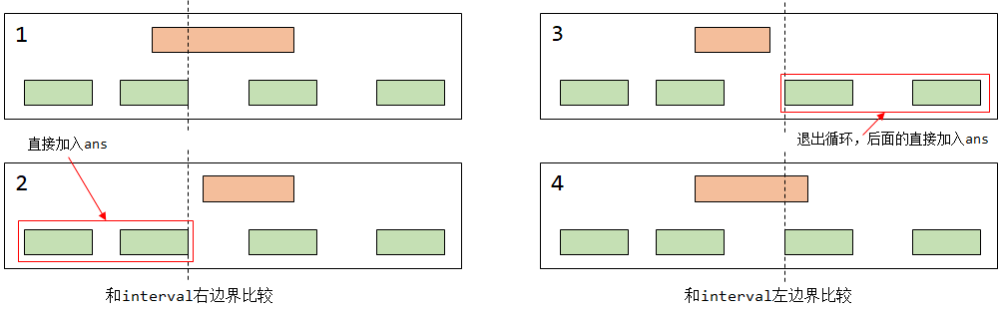

```python
class Solution:    
    def insert(self, intervals: List[List[int]], newInterval: List[int]) -> List[List[int]]:        
        if len(intervals) == 0: 
            return [newInterval]        
        
        left,right = newInterval         
        ans = []        
        i = 0        
        while i < len(intervals):                        
            if newInterval[0] <= intervals[i][1]: # 和右边界比较                
                left = min(intervals[i][0],left)            
            elif newInterval[0] > intervals[i][1]: # 和左边界比较                
                ans.append(intervals[i])                  
            if newInterval[1] < intervals[i][0]:  # 退出循环                
                break            
            elif newInterval[1] >= intervals[i][0]:                
                right = max(right,intervals[i][1])                        
            i += 1                
        ans.append([left,right])        
        ans += intervals[i:]                
        return ans
```

#### 58. 最后一个单词的长度

```python
class Solution:
    def lengthOfLastWord(self, s: str) -> int:
        size = len(s)
        i = size - 1
        while i >= 0 and s[i] == " ": 
            i -= 1
        cnt = 0
        while i >= 0 and s[i] != " ":
            cnt += 1
            i -= 1
        return cnt
```


#### 59. 螺旋矩阵 II

>   思路：公式法

```python
class Solution:
    def generateMatrix(self, n: int) -> List[List[int]]:
        def get_pos(x,y):
            layer = min(min(x-1,n-x),min(y-1,n-y))
            outer = 4*layer*(n-layer)
            inner = get_inner(x-layer,y-layer,n-2*layer)
            return outer + inner

        def get_inner(x,y,edge):
            if x == 1: return y
            if y == edge: return edge-1+x
            if x == edge: return edge*2-2+edge-y+1
            if y == 1: return 3*edge-3+edge-x+1


        matrix = [[0]*n for _ in range(n)]

        for i in range(n):
            for j in range(n):
                matrix[i][j] = get_pos(i+1,j+1)
        
        return matrix
```


#### 60. 排列序列 🍉

>   思路：采用**递归**的思想解决问题，当 `n=4,k=9` 时，第一个数字分别可以是`1,2,3,4`，而每个数字开头对应6种排列。利用 `k=9`，我们得到第一个数 的下标`(k-1)//6=1`，然后剩余的排列数量等于`k-1*6=3`，然后递归求解下一个数字`helper(n-1,k=3)`。

```python
class Solution:
    def getPermutation(self, n: int, k: int) -> str:
        def helper(n,k,used):
            if n == 1: # 如果只剩下一个数未确定，那么返回那个没有选择的数
                for i in range(len(used)):
                    if not used[i]: return str(i+1)
            if  k == 1: # 如果只剩下一个排列，那么按照顺序从小到大拼接未使用的数
                ans = ""
                for i in range(len(used)):
                    if not used[i]:
                        ans += str(i+1)
                return ans
            
            val = math.factorial(n-1) # 第一个数字对应的排列数量，比如n=4对应6 
            index = (k-1) // val # 第一个数字对应第used第几个未使用的下标
            k = k-index*val # 剩余的排列数量
            
            # 找到index所对应的used中未使用的数字的下标
            i = 0
            index += 1
            while i < len(used) and index > 0:
                if not used[i]:
                    index -= 1
                i += 1
                
            used[i-1] = True # 标记使用
            return str(i) + helper(n-1,k,used)
        used = [False]*n
        return helper(n,k,used)
```


#### 61. 旋转链表

>   思路：先将链表连成环，并获得链表长度。利用链表长度和 `k` 计算出旋转后的头结点下标，并通过 `while` 循环得到头结点

```python
# Definition for singly-linked list.
# class ListNode:
#     def __init__(self, val=0, next=None):
#         self.val = val
#         self.next = next
class Solution:
    def rotateRight(self, head: ListNode, k: int) -> ListNode:
        def get_len(head): # 等价于向左移动
            cur = head
            size = 0
            while cur and cur.next:
                size += 1
                cur = cur.next
            return cur,size + 1

        tail,size = get_len(head)
        if k % size  == 0: return head # 特例
        tail.next = head
        left = size - k % size
        pre = None
        while left > 0:
            pre = head
            head = head.next
            left -= 1
        pre.next = None
        return head
```

#### 62. 不同路径

>   思路：动态规划或者排列数，从`m+n-2`中选取`m-1`个向下的路径数。

```python
class Solution:
    def uniquePaths(self, m: int, n: int) -> int:
        return math.factorial(m+n-2) // (math.factorial(m-1)*math.factorial(n-1))
```


#### 63. 不同路径 II

>   动态规划

```python
class Solution:
    def uniquePathsWithObstacles(self, obstacleGrid: List[List[int]]) -> int:
        m = len(obstacleGrid)
        n = len(obstacleGrid[0])
        dp = [[0]*n for _ in range(m)]

        for i in range(n):
            if obstacleGrid[0][i] == 0:
                dp[0][i] = 1
            else:
                break
        
        for i in range(m):
            if obstacleGrid[i][0] == 0:
                dp[i][0] = 1
            else:
                break
        
        for i in range(1,m):
            for j in range(1,n):
                if obstacleGrid[i][j] == 0:
                    dp[i][j] = dp[i][j-1] + dp[i-1][j]
                else:
                    dp[i][j] = 0
        return dp[m-1][n-1]
            

```


#### 64. 最小路径和

```python
class Solution:
    def minPathSum(self, grid: List[List[int]]) -> int:
        m = len(grid)
        n = len(grid[0])

        dp = list(itertools.accumulate(grid[0]))

        for i in range(1,m):
            for j in range(n):
                if j == 0:
                    dp[j] += grid[i][j]
                else:
                    dp[j] = min(dp[j-1],dp[j]) + grid[i][j]
        return dp[n-1]
```


#### 65. 有效数字

```python
class Solution:
    def isNumber(self, s: str) -> bool:
        transfer = {
            0:{"digit":1,"dot":2,"sign":4},
            1:{"digit":1,"dot":5,"e":6},
            2:{"digit":3},
            3:{"digit":3,"e":6},
            4:{"dot":2,"digit":1},
            5:{"digit":3,"e":6},
            6:{"sign":7,"digit":8},
            7:{"digit":8},
            8:{"digit":8}
        }

        start = 0
        for c in s:
            if c in "eE": action = "e"
            elif c.isdigit(): action = "digit"
            elif c in "+-": action = "sign"
            elif c == ".": action = "dot"
            else: return False

            start = transfer[start].get(action,None)
            if start is None: return False
        
        return start in {1,3,5,8}  
```


#### 66. 加一 

```python
class Solution:
    def plusOne(self, digits: List[int]) -> List[int]:
        carry = 1
        for i in range(len(digits)-1,-1,-1):
            digits[i] = carry + digits[i]
            # 注意取carry的顺序
            carry = digits[i] // 10
            digits[i] %= 10
        if carry > 0: return [carry] + digits
        else: return digits
            
```


#### 67. 二进制求和

```python
class Solution:
    def addBinary(self, a: str, b: str) -> str:
        def helper(a,b):
            """
            a 比 b 长
            """
            m = len(a)
            n = len(b)
            carry = 0
            for i in range(n):
                a[m-i-1] = int(a[m-i-1]) + int(b[n-i-1]) + carry
                carry = a[m-i-1] // 2
                a[m-i-1] = str(a[m-i-1]%2)
            
            for i in range(n,m):
                a[m-i-1] = int(a[m-i-1]) + carry
                carry = a[m-i-1] // 2
                a[m-i-1] = str(a[m-i-1]%2)
            
            if carry > 0: return "".join([str(carry)]+a)
            else: return "".join(a)
        
        num1 = list(a)
        num2 = list(b)

        if len(num1) < len(num2):
            num1,num2 = num2,num1
        
        return helper(num1,num2)
            
```


#### 68 文本左右对齐

```python
class Solution:
    def fullJustify(self, words: List[str], maxWidth: int) -> List[str]:
        ans = []
        stack = []
        
        i = 0
        cur = len(words[i])
        stack.append(words[i])
        
        i += 1
        while i < len(words):
            if cur + 1 + len(words[i]) > maxWidth:
                tmp = ""
                if len(stack) == 1:
                    # 1. 如果栈中只有一个元素，左对齐
                    tmp = stack[0]
                    tmp = tmp + " "*(maxWidth-len(tmp))
                    stack.pop()
                else:
                    # 2. 如果栈中有多个元素，左右对齐

                    # 总的空格数量 = (多余的空格) + (单词之间的空格)
                    total = (maxWidth - cur) + (len(stack) - 1)
                        
                    while stack:
                        # 利用栈，实现对空格的填充，
                        # 比如总的空格是total=11，单词为size=4
                        # 那么填充的空格的计算规则：total//(size-1)
                        # 11//(4-1) -->3
                        # 8//(3-1)  -->4
                        # 4//(2-1)  -->4
                        if len(stack) == 1:
                            fill = 0
                        else:
                            fill = total // (len(stack)-1)
                            total -= fill
                        tmp = stack.pop() + tmp
                        tmp = fill*" " + tmp
                ans.append(tmp)

                cur = len(words[i])
                stack.append(words[i])
            else:
                stack.append(words[i])
                cur += len(words[i])+1

            i += 1
        tmp = " ".join(stack)
        ans.append(tmp + " "*(maxWidth-len(tmp)))
        return ans
```


#### 69 x的平方根

```python
class Solution:
    def mySqrt(self, a: int) -> int:
        f = lambda x,a:x*x-a
        f_prime = lambda x:2*x

        cur = a
        while f(cur,a) >= 10e-5:
            cur = cur - f(cur,a)/f_prime(cur)
        return int(cur)
```


#### 70 爬楼梯

```python
class Solution:
    def climbStairs(self, n: int) -> int:
        if n <= 2: return n
        a,b = 1,2
        c = a + b
        for i in range(2,n):
            c = a + b
            a = b
            b = c
        return c
```


#### 71 简化路径

>   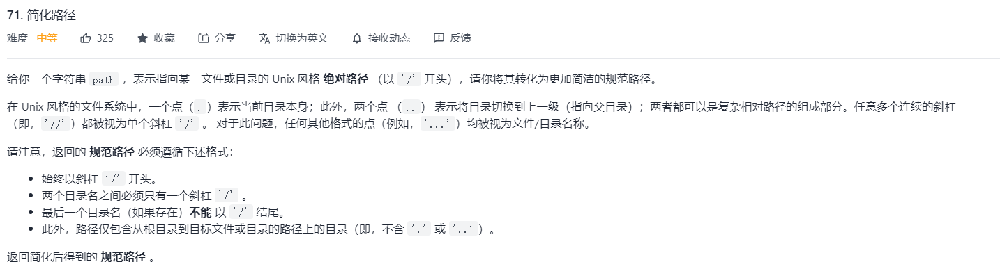
>
>   思路：这一题和版本号比较相似，都是基于栈来解决；同时也可以利用split函数来加快计算。

```python
class Solution:
    def simplifyPath(self, path: str) -> str:
        i = 0
        data = ""
        stack = []
        while i <= len(path):
            if i == len(path) or path[i] == "/":
                if data == "..":
                    if stack: stack.pop()
                elif data in {".",""}:
                    pass
                else:
                    stack.append(data)
                data = ""
            else:
                data += path[i]
            i += 1
        
        return "/" + "/".join(stack)
```


#### 72.  编辑距离

```python
class Solution:
    def minDistance(self, word1: str, word2: str) -> int:
        """
        1. dp[i][j]表示，长度为i的字符转化为长度为j的字符所使用的操作数
        2. 
        3. 
            if s[i-1] == p[j-1]:
                dp[i][j] = dp[i-1][j-1]
            else:
                dp[i][j] = min(dp[i-1][j],dp[i][j-1],dp[i-1][j-1]) + 1
        """

        m = len(word1)
        n = len(word2)

        dp = [[0]*(n+1) for _ in range(m+1)]
        
        # 初始化，是上一次的操作数加上这次的操作数
        for i in range(1,n+1):
            dp[0][i] = dp[0][i-1] + 1
        for i in range(1,m+1):
            dp[i][0] = dp[i-1][0] + 1
        
        for i in range(1,m+1):
            for j in range(1,n+1):
                if word1[i-1] == word2[j-1]:
                    dp[i][j] = dp[i-1][j-1]
                else:
                    dp[i][j] = min(min(dp[i-1][j],dp[i][j-1]),dp[i-1][j-1]) + 1

        return dp[m][n]
```


#### 73 矩阵置零

>   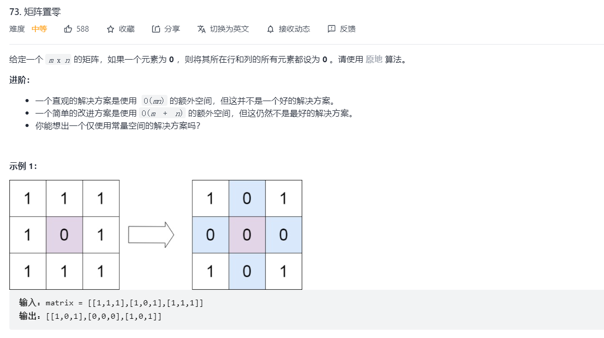

```python
class Solution:
    def setZeroes(self, matrix: List[List[int]]) -> None:
        """
        Do not return anything, modify matrix in-place instead.
        """
        # 首先记录一下，第一行和第一列是否有0
        m = len(matrix)
        n = len(matrix[0])
        row_0 = col_0 = False
        for i in range(m):
            if matrix[i][0] == 0: 
                col_0 = True
                break
        for j in range(n):
            if matrix[0][j] == 0:
                row_0 = True
                break
        
        # 接着，如果某一行（列）有0，就将第一行（列）对应的位置设为0
        for i in range(1,m):
            for j in range(1,n):
                if matrix[i][j] == 0:
                    matrix[i][0] = 0
                    matrix[0][j] = 0
        
        # 然后，将某一列或者某一行设置为0
        for i in range(1,m):
            if matrix[i][0] == 0:
                matrix[i] = [0]*n
        for j in range(1,n):
            if matrix[0][j] == 0:
                for i in range(m):
                    matrix[i][j] = 0
        
        # 最后，处理第一行和第一列
        if row_0: matrix[0] = [0]*n
        if col_0: 
            for i in range(m):
                matrix[i][0] = 0
```


#### 74 搜索二维矩阵

>   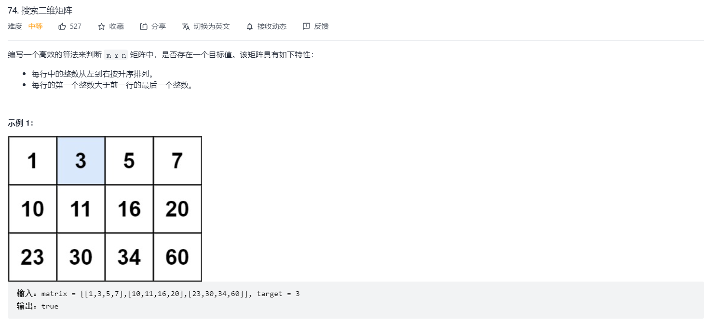
>
>   思路：
>
>   条件一：每行数据，从左到右按照升序排列
>
>   条件二：每行数据的第一个整数大于前一行的最后一个整数 $\rightarrow$ 代表将数据连在一起是单调递增的

```python
class Solution:
    def searchMatrix(self, matrix: List[List[int]], target: int) -> bool:
        m = len(matrix)
        n = len(matrix[0])
        i,j = m-1,0

        while i >= 0 and j <= n-1:
            if matrix[i][j] == target:
                return True
            elif matrix[i][j] > target:
                i -= 1
            elif matrix[i][j] < target:
                j += 1
        
        return False
```


#### 75 颜色分类

```python
class Solution:
    def sortColors(self, nums: List[int]) -> None:
        """
        Do not return anything, modify nums in-place instead.
        """
        j = 0
        k = len(nums) - 1

        for i in range(len(nums)):
            if nums[i] == 0:
                nums[i],nums[j] = nums[j],nums[i]
                j += 1
        
        for i in range(len(nums)-1,j-1,-1):
            if nums[i] == 2:
                nums[i],nums[k] = nums[k],nums[i]
                k -= 1
            

```

#### 76. 最小覆盖子串

```python
class Solution:
    def minWindow(self, s: str, t: str) -> str:
        """
        存在二段性质 
        """
        count = len(t) # 表示目标串的匹配长度，如果匹配长小于count
        left,right = 0,0
        n = len(s)
        t_map = collections.Counter(t)
        ans = [float("inf"),0,n]
        while right < n:
            if count > 0: # 表示当前还未匹配完成
                if s[right] in t_map:
                    t_map[s[right]] -= 1
                    if t_map[s[right]] >= 0:
                        count -= 1
                right += 1
            else:
                if right-left < ans[0]:
                    ans = [right-left,left,right]
                
                if left < right and s[left] in t_map:
                    t_map[s[left]] += 1
                    if t_map[s[left]] > 0:
                        count += 1
                left += 1

                while left < right and (s[left] not in t_map or t_map[s[left]] < 0):                    
                    if s[left] in t_map:
                        t_map[s[left]] += 1
                    left += 1

        if count == 0:
            while count == 0 and left < right and (s[left] not in t_map or t_map[s[left]] < 0):                    
                if s[left] in t_map:
                    t_map[s[left]] += 1
                left += 1
                
            if count == 0 and right-left < ans[0]:
                ans = [right-left,left,right]
        
        return s[ans[1]:ans[2]] if ans[0] != float("inf") else ""
```


#### 77. 组合

```python
class Solution:
    def combine(self, n: int, k: int) -> List[List[int]]:
        """
        无顺序，数字不可重复使用，无重复数字，这样解空间树可以。
        """
        self.ans = []
        def helper(start,path):
            if len(path) == k:
                self.ans.append(path[:])
                return
            
            for i in range(start,n+1):
                helper(i+1,path+[i])
        
        helper(1,[])

        return self.ans
```


#### 78. 子集

```python
class Solution:
    def subsets(self, nums: List[int]) -> List[List[int]]:
        self.ans = []
        def helper(start,path):
            self.ans.append(path[:])
            for i in range(start,len(nums)):
                helper(i+1,path+[nums[i]])
        
        path = []
        helper(0,path)

        return self.ans

```


#### 79. 单词搜索

```python
"""1. 给定一个二维网格和一个单词，找出该单词是否存在于网格中。2. 单词必须按照字母顺序，通过相邻的单元格内的字母构成，其中“相邻”单元格是那些水平相邻或垂直相邻的单元格。3. 同一个单元格内的字母不允许被重复使用。"""、
class Solution:
    def exist(self, board: List[List[str]], word: str) -> bool:
        n = len(word)
        directions = [[1,0],[-1,0],[0,1],[0,-1]]
        rows = len(board)
        cols = len(board[0])

        def dfs(row,col):
            if self.p == n:
                return
            self.visited[row][col] =True
            origin = self.p # 本阶段要找的点
            for direction in directions:
                new_row = row+direction[0]
                new_col = col+direction[1]
                if 0<=new_row<rows and 0<=new_col<cols and not self.visited[new_row][new_col] and board[new_row][new_col]==word[self.p]:
                    self.p+=1
                    dfs(new_row,new_col)
                    if self.p == n:
                        return 
                    self.visited[new_row][new_col] =False
                    self.p = origin
        for row in range(rows):
            for col in range(cols):
                self.p=0
                self.visited = [[False]*cols for _ in range(rows)]
                if board[row][col]==word[self.p]:
                    self.p += 1 
                    dfs(row,col)
                    if self.p == n:
                        return True
        return False
```


#### 80. 删除有序数组中的重复项 II

>   思路：比如对于一个输入 [1,1,1,1,2,2,3]
>
>   `i = 0,j = 0` ,前两个数自动保留, `i=2,j=2`

```python
class Solution:
    def removeDuplicates(self, nums: List[int]) -> int:
        j = 0
        for i in range(len(nums)):
            if i < 2 or nums[i] != nums[j-2]:
                nums[j] = nums[i]
                j += 1
        return j
```


#### 81. 搜索旋转排序数组 II

```python
class Solution:
    def search(self, nums: List[int], target: int) -> bool:
        left,right = 0,len(nums)-1
        while left < right and nums[left] == nums[right]:
            left += 1
        
        if target >= nums[left]:
            while left <= right:
                mid = left + (right-left) // 2
                if nums[mid] < nums[left]:
                    right = mid - 1
                else:
                    if nums[mid] == target:
                        return True
                    elif nums[mid] > target:
                        right = mid - 1
                    else:
                        left = mid + 1
        else:
            while left <= right:
                mid = left + (right-left) // 2
                if nums[mid] > nums[right]:
                    left = mid + 1
                else:
                    if nums[mid] == target: return True
                    elif nums[mid] > target: 
                        right = mid - 1
                    else:
                        left = mid + 1
        return False
            
```


#### 82. 删除排序链表中的重复元素 II

```python
# Definition for singly-linked list.
# class ListNode:
#     def __init__(self, val=0, next=None):
#         self.val = val
#         self.next = next
class Solution:
    def deleteDuplicates(self, head: ListNode) -> ListNode:
        hair = ListNode(-1)
        hair.next = head

        prev = hair
        cur = hair.next

        while cur:
            p = cur
            while p.next and p.next.val == p.val:
                p = p.next

            if p != cur:
                prev.next = p.next
                p.next = None
                cur = prev.next
            else:                
                prev = cur
                cur = cur.next

        return hair.next
```


#### 83. 删除排序链表中的重复元素

>   思路：设置三个变量，一个变量prev用来记录先前节点，一个变量cur用来记录当前节点，一个变量p用来遍历相同的节点。然后就是删除遍历的操作。

```python
# Definition for singly-linked list.
# class ListNode:
#     def __init__(self, val=0, next=None):
#         self.val = val
#         self.next = next
class Solution:
    def deleteDuplicates(self, head: ListNode) -> ListNode:
        hair = ListNode(-1)
        hair.next = head

        prev = hair
        cur = hair.next


        while cur:
            p = cur
            while p.next and p.next.val == cur.val:
                p = p.next
            
            if cur == p:
                prev = cur
                cur = cur.next
            else:
                prev.next = p
                cur = p
        
        return hair.next

```

#### 84. 柱状图中最大的矩形

>    思路：单调栈解法，维护一个单调递增的栈

```python
class Solution:
    def largestRectangleArea(self, heights: List[int]) -> int:
        """
        维护单调递增栈。
        如果下一个数据比当前高，那么当前高度不能作为结束条件。
        如果下一个数据比当前低，那么当前高度的最大值可以直接计算，作为结束条件。
        """
        stack = []
        heights = [0] + heights + [0]
        n = len(heights)
        ans = 0
        for i in range(n):
            while stack and heights[stack[-1]] > heights[i]:
                h = heights[stack.pop()]
                if not stack: left = 0
                else: left = stack[-1] + 1
                w = i - left
                ans = max(ans,w*h)
            stack.append(i)
        
        return ans

```

#### 85 最大矩形

>   思路：单调栈+直方图
>
>   
>
>   

```python
class Solution:
    def maximalRectangle(self, matrix: List[List[str]]) -> int:
        def max_area(nums):
            nums = [0] + nums + [0]
            stack = [0]
            ans = 0
            for i in range(1,len(nums)):
                while stack and nums[stack[-1]] > nums[i]:
                    h = nums[stack.pop()]
                    w = i - stack[-1] - 1
                    ans = max(ans,w*h)
                stack.append(i)
            return ans
        
        m = len(matrix)
        if m == 0: return 0
        n = len(matrix[0])
        if n == 0: return 0

        heights = [0]*n
        ans = 0
        for i in range(m):
            for j in range(n):
                if matrix[i][j] == "0":
                    heights[j] = 0
                else:
                    heights[j] += 1
            ans = max(ans,max_area(heights))
        
        return ans
```

#### 86 分割链表

>   思路：建立两个链表，一个记录比x小的数，一个记录大于等于x的数，然后链接在一起返回。

```python
# Definition for singly-linked list.
# class ListNode:
#     def __init__(self, val=0, next=None):
#         self.val = val
#         self.next = next
class Solution:
    def partition(self, head: ListNode, x: int) -> ListNode:
        dummy1 = ListNode(-1)
        dummy2 = ListNode(-1)

        p1 = dummy1
        p2 = dummy2

        cur = head
        while cur:
            if cur.val >= x:
                p1.next = cur
                p1 = cur
                cur = cur.next

                p1.next = None
            else:
                p2.next = cur
                p2 = cur
                cur = cur.next

                p2.next = None
        p2.next = dummy1.next

        return dummy2.next


```


#### 87 扰乱字符串

>   思路：下面的做法是记忆化递归的做法，记忆化递归能做，说明动态规划也能做，实际上是利用区间动态规划完成。

```python
class Solution:
    def isScramble(self, s1: str, s2: str) -> bool:
        @functools.lru_cache(None)
        def helper(s1,s2):
            if len(s1) == 0 and len(s2) == 0: return True
            if len(s1) != len(s2): return False
            if s1 == s2: return True
            if collections.Counter(s1) != collections.Counter(s2): return False

            n = len(s1)
            for i in range(1,n):
                if helper(s1[:i],s2[:i]) and helper(s1[i:],s2[i:]):
                    return True
                if helper(s1[:i],s2[-i:]) and helper(s1[i:],s2[:-i]):
                    return True
            
            return False
        
        return helper(s1,s2)
```


#### 88 合并两个有序数组

```python
class Solution:
    def merge(self, nums1: List[int], m: int, nums2: List[int], n: int) -> None:
        """
        Do not return anything, modify nums1 in-place instead.
        """
        k = m + n - 1
        i = m - 1
        j = n - 1

        while i >= 0 and j >= 0:
            if nums1[i] > nums2[j]:
                nums1[k] = nums1[i]
                i -= 1
                k -= 1 
            else:
                nums1[k] = nums2[j]
                j -= 1
                k -= 1
        while j >= 0: 
            nums1[k] = nums2[j]
            k -= 1
            j -= 1


```

#### 89 格雷码 🍉

>   思路：关键在于搞清楚格雷码的生成过程，可以用递归或者迭代的方式生成；也可以采用数学规律直接得到结果。

```python
"""        关键是搞清楚格雷编码的生成过程, G(i) = i ^ (i/2);        如 n = 3:         G(0) = 000,         G(1) = 1 ^ 0 = 001 ^ 000 = 001        G(2) = 2 ^ 1 = 010 ^ 001 = 011         G(3) = 3 ^ 1 = 011 ^ 001 = 010        G(4) = 4 ^ 2 = 100 ^ 010 = 110        G(5) = 5 ^ 2 = 101 ^ 010 = 111        G(6) = 6 ^ 3 = 110 ^ 011 = 101        G(7) = 7 ^ 3 = 111 ^ 011 = 100"""# 
class Solution:
    def grayCode(self, n: int) -> List[int]:
        self.ans = []

        def helper(start,num):
            if start > n: return
            self.ans.append(num)
            
            for i in range(start,n):
                helper(i+1,num^(1<<i))
        helper(0,0)
        return self.ans
    
# 数学做法
class Solution:    
    def grayCode(self, n: int) -> List[int]:        
        return [i^(i>>1) for i in range(1<<n)]
```


#### 90 子集 II

```python
class Solution:
    def subsetsWithDup(self, nums: List[int]) -> List[List[int]]:
        """
        1. 包含重复元素
        2. 顺序不重要
        3. 数字不能重复使用
        """
        self.ans = []

        def helper(start,path,used):
            self.ans.append(path)

            for i in range(start,len(nums)):
                if i > 0 and not used[i-1] and nums[i] == nums[i-1]:
                    continue
                used[i] = True
                helper(i+1,path+[nums[i]],used)
                used[i] = False
        
        nums.sort()
        used = [False]*len(nums)
        helper(0,[],used)
        return self.ans

```


#### 91. 解码方法

>   思路：动态规划，重点在于对边界条件的处理。

```python
class Solution:
    def numDecodings(self, s: str) -> int:
        """
        1. dp[i]表示以s[i]为结尾的字符串所能构成的解码综述
        2. i
        3. 
        if s[i] == 0:
            if s[i-1] in {1,2}:
                dp[i] = dp[i-2]
            else:
                dp[i] = 0
                return 0
        else:
            dp[i] = dp[i-1] + (dp[i-2] if 10 <= int(s[i-1:i+1]) <= 26 else 0)
        """
        m = len(s)
        dp = [0]*(m+1)
        dp[0] = 1
        if s[0] == "0": return 0
        else: dp[1] = 1

        for i in range(2,m+1):
            if s[i-1] == "0":
                if s[i-2] in {"1","2"}:
                    dp[i] = dp[i-2]
                else:
                    return 0
            else:
                dp[i] = dp[i-1] + (dp[i-2] if 10 <= int(s[i-2:i]) <= 26 else 0)
        return dp[m]
```

#### 92. 反转链表 II

>   思路：找到左右边界节点，然后找到前驱节点和后继节点，然后断开，然后将中间链表反转，最后再拼接起来。

```python
# Definition for singly-linked list.
# class ListNode:
#     def __init__(self, val=0, next=None):
#         self.val = val
#         self.next = next
class Solution:
    def reverseBetween(self, head: ListNode, left: int, right: int) -> ListNode:
        dummy = ListNode(-1)
        dummy.next = head
        
        def reverse(slow,fast):
            h = slow
            prev = None
            while h:
                node = h.next
                h.next = prev
                prev = h
                h = node
            return fast,slow
        
        prev = dummy
        h = head
        index = 1
        while h:
            if index == left:
                fast = slow = h
                while fast:
                    if index == right: break
                    fast = fast.next
                    index += 1
                tail = fast.next

                prev.next = None
                fast.next = None
                slow,fast = reverse(slow,fast)

                prev.next = slow
                fast.next = tail
                break 
            prev = h
            h = h.next
            index += 1
        return dummy.next
```


#### 93. 复原 IP 地址

>   思路：回溯法即可，关键在于边界条件index范围的处理。

```python
class Solution:
    def restoreIpAddresses(self, s: str) -> List[str]:
        n = len(s)
        self.ans = []
        def helper(start,path):
            if start == n:
                if len(path) == 4:
                    self.ans.append(".".join(path))
                return
            if len(path) >= 4: return 

            if s[start] == "0":
                helper(start+1,path + ["0"])
            else:
                for size in range(1,4):
                    if start+size <= n and int(s[start:start+size]) <= 255:
                        helper(start+size,path + [s[start:start+size]])
        helper(0,[])
        return self.ans

```


#### 94. 二叉树的中序遍历

>   思路，利用栈或者Morris遍历

```python
# Definition for a binary tree node.
# class TreeNode:
#     def __init__(self, val=0, left=None, right=None):
#         self.val = val
#         self.left = left
#         self.right = right
class Solution:
    def inorderTraversal(self, root: TreeNode) -> List[int]:
        stack = []
        ans = []
        while stack or root:
            while root:
                stack.append(root)
                root = root.left
            
            root = stack.pop()
            ans.append(root.val)
            root = root.right
        
        return ans
```


#### 95 不同的二叉搜索树 II

>   思路：这一题思路很简单，但是在Python中有一个易错的点，那就是根节点定义的位置，如果定义在循环体外面的话，那么存在值共享的问题。

```python
# Definition for a binary tree node.
# class TreeNode:
#     def __init__(self, val=0, left=None, right=None):
#         self.val = val
#         self.left = left
#         self.right = right

class Solution:
    def generateTrees(self, n: int) -> List[TreeNode]:
        def build(start,end):
#             print(start,end)
            if start > end: return [None]
            if start == end: return [TreeNode(start)]
            
            ans = []
            for cur in range(start,end+1):
                left = build(start,cur-1)
                right = build(cur+1,end)
                
#                 print(cur,left,[r for r in right])
                
                for l in left: # left leaf value
                    for r in right: # right leaf value
                        root = TreeNode(cur)
                        root.left = l
                        root.right = r
                        ans.append(root)
            return ans
        
        return build(1,n)
```

#### 96. 不同的二叉搜索树

>   思路：`dp[i] = sum([dp[j]*dp[i-j-1] for j in range(i)])`
>
>   卡特兰数：$G(n)=G(0)*G(n-1)+...+G(n-1)*G(0)=\sum_{i=0}^{n-1}[G(i)*G(n-i-1)]$

```python
class Solution:
    def numTrees(self, n: int) -> int:
        fact = lambda x:math.factorial(x)
        return fact(2*n)//(fact(n)*fact(n))//(n+1)
```

#### 97 交错字符串

>   思路：动态规划，定义`dp[i][j]`表示的含义为长度为`i`的字符串`s1[i-1]`和长度为`j`的字符串`s2[j-1]`能够构成交错字符串`s3[i+j-1]`。

```python
class Solution:  
    def isInterleave(self, s1: str, s2: str, s3: str) -> bool:
        """
        dp[i][j]表示的是用s1的前i个字符和s2的前j个字符能否构成s3的前i+j个字符
        dp[i][j] = 
            (dp[i-1][j] and s2[j] == s3[i+j-1]) or (dp[i][j-1] and s2[j] == s3[i+j-1])
        """
        m = len(s1)      
        n = len(s2)    
        k = len(s3)       
        if m+n != k: return False    
        dp = [[False]*(n+1) for _ in range(m+1)]   
        dp[0][0] = True              
        for i in range(1,m+1):           
            if s1[i-1] == s3[i-1]:      
                dp[i][0] = dp[i-1][0] 
                
        for i in range(1,n+1):      
            if s2[i-1] == s3[i-1]:   
                dp[0][i] = dp[0][i-1]       
        
        for i in range(1,m+1):  
            for j in range(1,n+1):   
                dp[i][j] = (dp[i-1][j] and s1[i-1] == s3[i+j-1]) or \
                	(dp[i][j-1] and s2[j-1] == s3[i+j-1])      
        
        return dp[m][n]
```


#### 98 验证二叉搜索树

>   思路：二叉树递归的时候只需要去考虑当前树节点的情况。

```python
# Definition for a binary tree node.
# class TreeNode:
#     def __init__(self, val=0, left=None, right=None):
#         self.val = val
#         self.left = left
#         self.right = right
class Solution:
    def isValidBST(self, root: TreeNode) -> bool:
        def helper(root,left,right):
            if not root: return True
            if left < root.val < right:
                return helper(root.left,left,root.val) and \
                        helper(root.right,root.val,right)
            else:
                return False
        
        return helper(root,float("-inf"),float("inf"))


```

#### 99 恢复二叉搜索树

>   思路：中序遍历，定义两个遍历mistake1和mistake2，在中序遍历的过程中，找到这两个错误的点，然后交换。

```python
# Definition for a binary tree node.
# class TreeNode:
#     def __init__(self, val=0, left=None, right=None):
#         self.val = val
#         self.left = left
#         self.right = right
class Solution:
    def recoverTree(self, root: TreeNode) -> None:
        """
        Do not return anything, modify root in-place instead.
        """
        self.mistake1 = self.mistake2 = None
        self.prev = None
        def helper(root):
            if not root: return

            helper(root.left)
            if not self.prev: 
                self.prev = root
            else:
                if root.val < self.prev.val:
                    if not self.mistake1:
                        self.mistake1 = self.prev
                        self.mistake2 = root
                    else:
                        self.mistake2 = root
                self.prev = root
            helper(root.right)
        
        helper(root)

        self.mistake1.val,self.mistake2.val = \
            self.mistake2.val,self.mistake1.val
```

#### 100 相同的树

>   递归解决

```python
# Definition for a binary tree node.
# class TreeNode:
#     def __init__(self, val=0, left=None, right=None):
#         self.val = val
#         self.left = left
#         self.right = right
class Solution:
    def isSameTree(self, p: TreeNode, q: TreeNode) -> bool:
        def helper(p,q):
            if not p and not q: return True
            if not p or not q: return False
            return p.val == q.val and \
                    helper(p.left,q.left) and \
                    helper(p.right,q.right)
        return helper(p,q)
```


## Top 100

#### 101 对称二叉树

```python
# Definition for a binary tree node.
# class TreeNode:
#     def __init__(self, val=0, left=None, right=None):
#         self.val = val
#         self.left = left
#         self.right = right
class Solution:
    def isSymmetric(self, root: TreeNode) -> bool:
        if not root: return True
        def helper(p,q):
            if not p and not q: return True
            if not p or not q: return False
            return p.val == q.val and helper(p.left,q.right) and helper(p.right,q.left)
        
        return helper(root.left,root.right)
```

#### 102 层次遍历

```python
# Definition for a binary tree node.
# class TreeNode:
#     def __init__(self, val=0, left=None, right=None):
#         self.val = val
#         self.left = left
#         self.right = right
class Solution:
    def levelOrder(self, root: TreeNode) -> List[List[int]]:
        if not root: return []
        queue = collections.deque()
        ans = []

        queue.append(root)
        while queue:
            size = len(queue)
            level = []
            for i in range(size):
                cur = queue.popleft()
                level.append(cur.val)
                if cur.left: queue.append(cur.left)
                if cur.right: queue.append(cur.right)

            ans.append(level)

        return ans
                
        
```


#### 104 二叉树的最大深度

```python
# Definition for a binary tree node.
# class TreeNode:
#     def __init__(self, val=0, left=None, right=None):
#         self.val = val
#         self.left = left
#         self.right = right
class Solution:
    def maxDepth(self, root: TreeNode) -> int:
        if not root: return 0
        return max(self.maxDepth(root.left),self.maxDepth(root.right))+1
```


#### 105 从先序遍历和中序遍历构造二叉树

```python
# Definition for a binary tree node.
# class TreeNode:
#     def __init__(self, val=0, left=None, right=None):
#         self.val = val
#         self.left = left
#         self.right = right
class Solution:
    def buildTree(self, preorder: List[int], inorder: List[int]) -> TreeNode:
        inorder_dict = {inorder[i]:i for i in range(len(inorder))}

        def build(start,left,right): # include
            if left > right: return None

            mark = inorder_dict[preorder[start]]
            node = TreeNode(preorder[start])
            node.left = build(start+1,left,mark-1)
            node.right = build(start+(mark-left+1),mark+1,right)
            return node
        
        return build(0,0,len(inorder)-1)


```


#### 114 二叉树展开为链表

```python
# Definition for a binary tree node.
# class TreeNode:
#     def __init__(self, val=0, left=None, right=None):
#         self.val = val
#         self.left = left
#         self.right = right
class Solution:
    def flatten(self, root: TreeNode) -> None:
        """
        Do not return anything, modify root in-place instead.
        """
        self.prev = self.head = None
        def helper(root):
            if not root: return 
            left = root.left
            right = root.right

            root.left = None
            root.right = None

            if self.prev is None:
                self.head = root
            else:
                self.prev.right = root

            self.prev = root
            
            helper(left)
            helper(right)
        
        helper(root)
        return self.head
    
# Definition for a binary tree node.
# class TreeNode:
#     def __init__(self, val=0, left=None, right=None):
#         self.val = val
#         self.left = left
#         self.right = right
class Solution:
    def flatten(self, root: TreeNode) -> None:
        """
        Do not return anything, modify root in-place instead.
        """
        p = root
        while p:
            if p.left:
                most_right = p.left
                while most_right.right: most_right = most_right.right
                most_right.right = p.right
                p.right = p.left
                p.left = None
            p = p.right
        return root

```

#### 121 买卖股票的最佳时机

```python
class Solution:
    def maxProfit(self, prices: List[int]) -> int:
        prices = prices + [0]
        ans = 0
        min_price = float("inf")
        for i in range(len(prices)):
            min_price = min(prices[i],min_price)
            ans = max(ans,prices[i]-min_price)
        return ans

    
class Solution:
    def maxProfit(self, prices: List[int]) -> int:
        """
        dp[i][k][0]表示的含义在第i天结束之后，前面允许进行k次交易，而此时手里没有股票，所得到的利润
        dp[i][k][1]表示的含义在第i天结束之后，前面允许进行k次交易，而此时手里有股票，所得到的利润
        
        dp[i][k][0] = max{dp[i-1][k][1]+pirce[i],dp[i-1][k][0]}
        dp[i][k][1] = max{dp[i-1][k-1][0]-pirce[i],dp[i-1][k][1]}
        
        k = 1
        """
        size = len(prices)
        dp = [[0,0] for i in range(size)]
        dp[0][1] = -prices[0] # base case
        for i in range(1,size):
            dp[i][0] = max(dp[i-1][1]+prices[i],dp[i-1][0])
            dp[i][1] = max(0-prices[i],dp[i-1][1])
        return dp[-1][0]
            
```


#### 124 二叉树的最大路径和

```python
# Definition for a binary tree node.# class TreeNode:#     def __init__(self, val=0, left=None, right=None):#         self.val = val#         self.left = left#         self.right = rightclass Solution:    def maxPathSum(self, root: TreeNode) -> int:        """        树型DP的典型做法        """        self.ans = -1001        def helper(root):            if not root: return 0            left = helper(root.left) # 左边的最大路径和            right = helper(root.right) # 右边的最大路径和            # 当前节点作为连接节点            self.ans = max(self.ans,max(left,0)+max(right,0)+root.val)             return max(max(left,right),0) + root.val                helper(root)        return self.ans
```


#### 128. 最长连续序列

>    思路：
>
>    +   还可以通过哈希表进行单向查询，也就是只查找数字比当前数字大的。注意需要去重。
>    +   暂时想到的思路是通过DFS进行洪水填充，然后逐步经过多次遍历得到结果。
>    +   并查集写法。

```python
class Solution:    def longestConsecutive(self, nums: List[int]) -> int:        longest_streak = 0        num_set = set(nums)        for num in num_set:            if num-1 not in num_set:                current_num = num                current_streak = 1                while current_num + 1 in num_set:                    current_num += 1                    current_streak += 1                                longest_streak = max(longest_streak,current_streak)        return longest_streak
```

#### 136 只出现一次的数字

>   思路：异或

```python
class Solution:    def singleNumber(self, nums: List[int]) -> int:        from functools import reduce        import operator        return reduce(operator.xor,nums)
```

#### 139. 单词拆分

>   思路：动态规划，定义一维数组即可，优化的做法在于对`wordDict`进行预处理，预先得到所有可能的字符串的长度列表。

```python
class Solution:    def wordBreak(self, s: str, wordDict: List[str]) -> bool:        """        动态规划：        1. dp[i]表示长度为i的字符串能否被字典中的单词表示        2. i表示下标        3.        dp[i] = any([dp[i-size] and s[i-size:i] in wordSet for size in lens])        4.         """        max_len,min_len = -1,float("inf")        wordSet = set(wordDict)        for word in wordDict:            max_len = max(max_len,len(word))            min_len = min(min_len,len(word))                dp = [False]*(len(s)+1)        dp[0] = True        for i in range(min_len,len(s)+1):            for size in range(min_len,max_len+1):                if s[i-size:i] in wordSet: # 遍历做法                    dp[i] = dp[i] or dp[i-size]        print(dp)        return dp[len(s)]
```

#### 141. 环形链表

```python
class Solution:    def hasCycle(self, head: ListNode) -> bool:        dummy = ListNode(-1)        dummy.next = head        slow = fast = dummy        while fast.next and fast.next.next:            fast = fast.next.next            slow = slow.next            if fast == slow:                return True                return False
```

#### 142 环形链表

>   当相遇的时候，是将slow节点移动到dummy节点处

```python
class Solution:    def detectCycle(self, head: ListNode) -> ListNode:        dummy = ListNode(-1)        dummy.next = head        fast = slow = dummy        while fast.next and fast.next.next:            fast = fast.next.next            slow = slow.next            if fast == slow:                slow = dummy                                 while fast != slow:                    fast = fast.next                    slow = slow.next                return fast        return None
```


#### 146. LRU

下面这两幅图都表示了双向链表加上哈希表：


>   需要的辅助函数：
>
>   1.  移除特定节点，但并不删除改节点的内容
>   2.  移除末尾元素，删除该节点内容
>   3.  将一个节点移动到头结点处

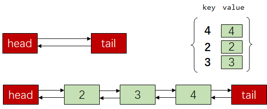

双向链表+Hash表，关键在于在常数时间内将某一节点移动到链表首或者链表尾。

双向链表，队首放的是最近使用的，队尾放的是最不经常使用的。

hash表，键放的是当前元素的键，value放的是双向链表的节点。

比如一个get操作：

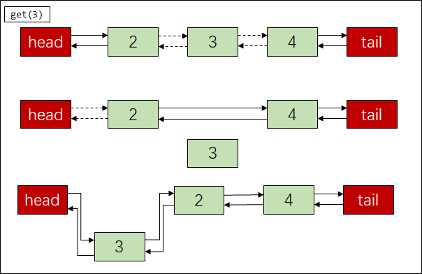


```python
class DLinkedList:
    def __init__(self,key,val):
        self.val = val # 注意：需要同时存储k-v值
        
        self.key = key
        self.prev = None
        self.next = None

class LRU:
    def __init__(self,capacity):
        self.capacity = capacity
        self.cache = dict()
        self.head = DLinkedList(-1)
        self.tail = DLinkedList(-1)
        self.head.next = self.tail
        self.tail.prev = self.head
    
    def get(self,key):
        if key not in self.cache: return -1
        node = self.cache[key]
        # 1. 从双向链表中删除当前节点
        self.remove_node(node)
        
        # 2. 将当前节点加到链表头部
        self.move_to_head(node)
        
        return node.val
    
    def put(self,key,value):
        if key in self.cache:
            node = self.cache[key] # O(1)
            node.val = value
            # 1. 从双向链表中删除当前节点
            self.remove_node(node)

            # 2. 将当前节点加到链表头部
            self.move_to_head(node)
        else:
            if self.capacity <= 0:
                # 1. 从双向链表中删除末尾的节点
                # 2. 从cache中删除对应的k-v
                self.delete_tail()
                self.capacity += 1
            
            node = DLinkedList(key,value)
            self.cache[key] = node
            
            # 1. 将新节点加入到双向链表中
            self.move_to_head(node)
            # 2. 容量减一
            self.capacity -= 1
    
    def remove_node(self,node):
        node.prev.next = node.next
        node.next.prev = node.prev
    
    def move_to_head(self,node):
        node.next = self.head.next
        self.head.next.prev = node
        
        self.head.next = node
        node.prev = self.head
    
    def delete_tail(self):
        node = self.tail.prev
        self.cache.pop(node.key)
        self.remove_node(node)
        del node
        
```

#### 148. 排序链表

>   三要素：
>
>   第一要素：merge 双路归并
>
>   第二要素：cut(head,size)，切出一个长度为size的链表，并返回下一个链表的头结点。需要注意size长度超过链表的情况。
>
>   第三要素：dummy大法好

```python
class Solution:    def sortList(self, head: ListNode) -> ListNode:        def cut(head,size):            """            将链表 head 切掉前 size 个节点，并返回后半部分的链表头            """            dummy = ListNode(-1)            dummy.next = head            p = dummy                        while p.next and size > 0:                p = p.next                size = size - 1            node = p.next            p.next = None            return node        def merge(p1,p2):            """            双路归并            """            dummy = ListNode(-1)            p = dummy            while p1 and p2:                if p1.val < p2.val:                    p.next = p1                    p = p1                    p1 = p1.next                else:                    p.next = p2                    p = p2                    p2 = p2.next            p.next = p2 if not p1 else p1            return dummy.next        def get_length(head):            p = head            length = 0            while p: p,length = p.next,length+1            return length        dummy = ListNode(-1)        dummy.next = head        length = get_length(head)                size = 1        while size < length:            current = dummy.next            tail = dummy            while current:                left = current                right = cut(current,size)                current = cut(right,size)                tail.next = merge(left,right)                while tail.next: tail = tail.next            size = size << 1        return dummy.next
```

#### 152. 乘积最大子数组 [🔗](https://leetcode-cn.com/problems/maximum-product-subarray/solution/dong-tai-gui-hua-li-jie-wu-hou-xiao-xing-by-liweiw/)

>   定义`dp[i]`数组的含义定义为以`nums[i]`为结尾的连续子数组的最大值。
>
>   类似的定义还有子序列、子数组。

```python
class Solution:
    def maxProduct(self, nums: List[int]) -> int:
        """
        fmax,fmin = 1,1
        if nums[i] < 0:
            fmax,fmin = fmin,fmax
        fmax = max(fmax*nums[i],nums[i])
        fmin = min(fmin*nums[i],nums[i])
        """
        n = len(nums)
        fmax = fmin = nums[0]
        ans = nums[0]
        for i in range(1,n):
            if nums[i] < 0:
                fmax,fmin = fmin,fmax
            fmax = max(fmax*nums[i],nums[i])
            fmin = min(fmin*nums[i],nums[i])
            ans = max(ans,fmax)
        return ans
```


#### 155 最小栈

```python
class MinStack:    def __init__(self):        """        initialize your data structure here.        """        self.stack = []        self.min_stack = []    def push(self, val: int) -> None:        self.stack.append(val)        if not self.min_stack or val <= self.min_stack[-1]:            self.min_stack.append(val)    def pop(self) -> None:        if not self.stack: return -1        if self.stack.pop() == self.min_stack[-1]:            self.min_stack.pop()    def top(self) -> int:        if not self.stack: return -1        return self.stack[-1]    def getMin(self) -> int:        if not self.min_stack: return -1        return self.min_stack[-1]
```


#### 160. 相交链表

```python
# Definition for singly-linked list.
# class ListNode:
#     def __init__(self, x):
#         self.val = x
#         self.next = None

class Solution:
    def getIntersectionNode(self, headA: ListNode, headB: ListNode) -> ListNode:
        p1 = headA
        p2 = headB
        while p1 != p2:
            p1 = p1.next if p1 else headB
            p2 = p2.next if p2 else headA
        return p1
```


#### 169 多数元素

思路：摩尔投票法，不同，同归于尽；相同，拉帮结派。

```python
class Solution:    def majorityElement(self, nums: List[int]) -> int:        candinate = nums[0]        count = 1        for i in range(1,len(nums)):            if nums[i] != candinate:                if count == 0:                    candinate = nums[i]                    count = 1                else:                    count -= 1            else:                count += 1                return candinate
```


#### 198. 打家劫舍

```python
class Solution:    def rob(self, nums: List[int]) -> int:        """        dp[i] = max(nums[i]+dp[i-2],dp[i-1])        """        n = len(nums)        dp = [0]*n        dp[0] = nums[0]        if n == 1: return dp[n-1]        dp[1] = max(nums[0],nums[1])        if n == 2: return dp[n-1]        for i in range(2,len(nums)):            dp[i] = max(nums[i]+dp[i-2],dp[i-1])                return dp[n-1]
```


#### 200 岛屿的数量

思路：典型的DFS或者BFS，需要注意的点

+   **DFS的终止条件**
+   **visited数组的含义**，避免重复访问，导致内存错误

```python
class Solution:    def numIslands(self, grid: List[List[str]]) -> int:        m = len(grid)        n = len(grid[0])        visited = [[False]*n for _ in range(m)]        directions = [[1,0],[-1,0],[0,1],[0,-1]]        def helper(i,j,visited):            for direction in directions:                x = i + direction[0]                y = j + direction[1]                if x >= 0 and x < m and y >= 0 and y < n:                    if not visited[x][y] and grid[x][y] == "1":                        visited[x][y] = True                        helper(x,y,visited)                ans = 0        for i in range(m):            for j in range(n):                if not visited[i][j] and grid[i][j] == "1":                    visited[i][j] = True                    ans += 1                    helper(i,j,visited)        return ans
```

#### 206 反转链表

```python
class Solution:    def reverseList(self, head: ListNode) -> ListNode:        def helper(head,prev):            if not head: return prev            node = head.next            head.next = prev            return helper(node,head)                prev = None        return helper(head,prev)
```


#### 207 课程表

思路：本质就是判断一个有向图中是否存在环，最简单的方法就是利用拓扑排序。重点有两个：一个是利用字典构建临接表，一个是记录每个节点入度表，最后判断是否存在入度不为零的节点

```python
class Solution:    def canFinish(self, numCourses: int, prerequisites: List[List[int]]) -> bool:        from collections import defaultdict        course_dict = defaultdict(list)        indgree = defaultdict(lambda: 0)        # 构建临接表和入度表        for prerequisite in prerequisites:            course_dict[prerequisite[1]].append(prerequisite[0])            indgree[prerequisite[0]] += 1                # 初始化，将所有入度位0的节点加入        queue = deque()        for course in range(numCourses):            if indgree[course] == 0:                queue.append(course)                # 拓扑排序        while queue:            top = queue.popleft()            for next_course in  course_dict[top]:                indgree[next_course] -= 1                if indgree[next_course] == 0:                    queue.append(next_course)		# 检查搜索答案        for course in range(numCourses):            if indgree[course] != 0:                return False        return True    
```

#### 208 实现Trie 字典树

```python
class Trie:    def __init__(self):        """        Initialize your data structure here.        """        self.root = {}    def insert(self, word: str) -> None:        """        Inserts a word into the trie.        """        node = self.root        for c in word:            if c in node:                node = node[c]            else:                node[c] = {}                node = node[c]        node["$"] = True                    def search(self, word: str) -> bool:        """        Returns if the word is in the trie.        """        node = self.root        for c in word:            if c in node:                node = node[c]            else:                return False        return "$" in node    def startsWith(self, prefix: str) -> bool:        """        Returns if there is any word in the trie that starts with the given prefix.        """        node = self.root        for c in prefix:            if c in node:                node = node[c]            else:                return False        return True
```


#### 215 数组中的第k个最大的元素

>   最小堆做法

```python
class Solution:    def findKthLargest(self, nums: List[int], k: int) -> int:        H = []        heapify(H)        for i in range(k):            heappush(H,nums[i])                for i in range(k,len(nums)):            if nums[i] > H[0]:                heapreplace(H,nums[i])                return H[0]
```

>   快排做法

```python
class Solution:    def findKthLargest(self, nums: List[int], k: int) -> int:        def quick_sort(nums,start,end):            left = start            right = end            rand_index = random.randint(start,end)            nums[start],nums[rand_index] = nums[rand_index],nums[start]            pivot = nums[start]            while left < right:                while left < right and nums[right] >= pivot:                    right -= 1                nums[left] = nums[right]                while left < right and nums[left]  <= pivot:                    left += 1                nums[right] = nums[left]            nums[left] = pivot            return left                K = len(nums) - k        start = 0        end = len(nums) - 1        while start <= end:            index = quick_sort(nums,start,end)            if index == K:                return nums[index]            elif index > K:                end = index - 1            else:                start = index + 1
```

#### 221 最大正方形

```python
class Solution:
    def maximalSquare(self, matrix: List[List[str]]) -> int:
        """
        1. dp[i][j]表示以i，j结尾的最大正方形
        2. ...
        3.
        if matrix[i][j] == "1":
            edge = min(dp[i-1][j],dp[i][j-1])
            dp[i][j] = edge + int(matrix[i-edge][[j-edge]])
                
        4. 边界考虑一下
        """
        m = len(matrix)
        n = len(matrix[0])
        dp = [[0]*n for _ in range(m)]
        max_edge = 0

        for i in range(m): 
            if matrix[i][0] == "1":
                dp[i][0] = 1
                max_edge = 1
        for i in range(n): 
            if matrix[0][i] == "1":
                dp[0][i] = 1
                max_edge = 1
        
        for i in range(1,m):
            for j in range(1,n):
                if matrix[i][j] == "1":
                    edge = min(dp[i-1][j],dp[i][j-1])
                    dp[i][j] = edge + int(matrix[i-edge][j-edge])
                    max_edge = max(dp[i][j],max_edge)
        
        return max_edge**2
```


#### 226. 翻转二叉树

```python
# Definition for a binary tree node.
# class TreeNode:
#     def __init__(self, val=0, left=None, right=None):
#         self.val = val
#         self.left = left
#         self.right = right
class Solution:
    def invertTree(self, root: TreeNode) -> TreeNode:
        
        def helper(root):
            if not root: return root
            root.left,root.right = root.right,root.left
            root.left = helper(root.left)
            root.right = helper(root.right)
            return root
        
        return helper(root)
        

        
```


#### 234. 回文链表

```python
class Solution:    def isPalindrome(self, head: ListNode) -> bool:        dummy = ListNode(-1)        dummy.next = head        fast = slow = dummy        size = 0        stack = []        while fast.next and fast.next.next:            fast = fast.next.next            slow = slow.next            stack.append(slow.val)            size += 1        if fast.next: # 长度为奇数            p = slow.next.next        else:            p = slow.next                while stack:            if stack.pop() != p.val: return False            else:                p = p.next        return True
```

#### 236 二叉树最近公共祖先

```python
class Solution:    def lowestCommonAncestor(self, root: 'TreeNode', p: 'TreeNode', q: 'TreeNode') -> 'TreeNode':        def helper(root,p,q):            if root == p or root == q or not root: return root            left = helper(root.left,p,q)            right = helper(root.right,p,q)            if not left and not right: return None            if not left: return right            if not right: return left            return root                return helper(root,p,q)
```


#### 238 除本身外的乘积

思路：分别计算从左到右的乘积和从右到左乘积，然后最后依次计算结果。

```python
class Solution:    def productExceptSelf(self, nums: List[int]) -> List[int]:        res = []        p,q = 1,1        for i in range(len(nums)):            res.append(p)            p = p * nums[i]                for j in range(len(nums)-1,-1,-1):            res[j] = res[j] * q            q = q * nums[j]                return res
```


#### 239 滑动窗口的最大值

```python
class Solution:    def maxSlidingWindow(self, nums: List[int], k: int) -> List[int]:        # 单调递减        # 如果采用单调递增，那么[3,2,1]这种数据，1和2就会被抛弃，错误        queue = collections.deque()        for i in range(k):            while queue and nums[queue[-1]] < nums[i]:                queue.pop()            queue.append(i)                ans = [nums[queue[0]]]        for i in range(k,len(nums)):            while queue and nums[queue[-1]] < nums[i]:                queue.pop()            queue.append(i)            while queue and i-queue[0] >= k:                queue.popleft()                        ans.append(nums[queue[0]])        return ans
```


#### 240. 搜索二维矩阵 II `类似设定：滑雪问题`

思路：二维的二分查找，基本思想是将矩阵格划分成几个区域，这里是很容易出现错误的，边角区域需要考虑到。

```python
class Solution:    def searchMatrix(self, matrix: List[List[int]], target: int) -> bool:        def check(x,y,m,n):            if x >= 0 and x < m and y >= 0 and y < n: return True            else: return False        @functools.lru_cache(None)        def helper(s_x,s_y,e_x,e_y):            if s_x <= e_x and s_y <= e_y and \                check(s_x,s_y,m,n) and check(e_x,e_y,m,n):                mid_x = s_x + (e_x - s_x) // 2                mid_y = s_y + (e_y - s_y) // 2                if matrix[mid_x][mid_y] == target:                     return True                elif matrix[mid_x][mid_y] > target:                     return helper(s_x,s_y,mid_x-1,mid_y-1) or \                            helper(mid_x,s_y,e_x,mid_y-1) or \                            helper(s_x,mid_y,mid_x-1,e_y)                elif matrix[mid_x][mid_y] < target:                     return helper(mid_x+1,mid_y+1,e_x,e_y) or \                            helper(mid_x+1,s_y,e_x,mid_y) or \                            helper(s_x,mid_y+1,mid_x,e_y)        m = len(matrix)        n = len(matrix[0])        start_x = 0        start_y = 0        end_x = m-1        end_y = n-1        return helper(start_x,start_y,end_x,end_y)
```


#### 253. 会议室 II

>   题目：   
>
>   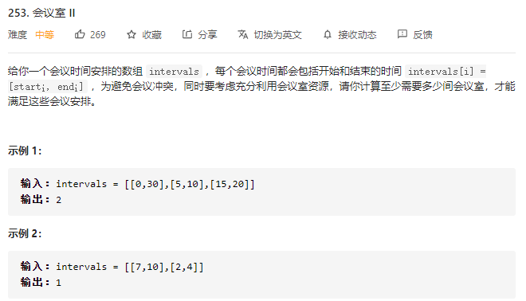
>
>   思路：
>
>   维护一个最小堆，对会议按照开始时间进行排序，堆中存储会议的结束时间。

```python
class Solution:    
    def minMeetingRooms(self, intervals: List[List[int]]) -> int:        
        H = []         
        heapify(H)        
        ans = 0        
        intervals.sort()        
        for i in range(len(intervals)):            
            if not H or intervals[i][0] < H[0]:                
                heappush(H,intervals[i][1])                
                ans = max(ans,len(H))            
            else:                
                heapreplace(H,intervals[i][1])        
        return ans
```


#### 279 完全平方数

```python
class Solution:    def numSquares(self, n: int) -> int:        """        1. dp[i]表示的含义是对于正整数i，将其表示成完全平方数所需要的数量        2.         3.         dp[i] = min({dp[i-1]+1,dp[i-4]+1,...,dp[i-i]+1})        """        dp = [0] + [1 for i in range(n)]        for i in range(2,n+1):            m = int(sqrt(i))            dp[i] = min([dp[i-j*j]+1 for j in range(1,m+1)])        return dp[n]
```


#### 283. 移动零

```python
class Solution:    def moveZeroes(self, nums: List[int]) -> None:        """        Do not return anything, modify nums in-place instead.        """        n = len(nums)        j = 0        for i in range(n):            if nums[i] != 0:                nums[i],nums[j] = nums[j],nums[i]                j += 1
```


#### 287 寻找重复的数

思路：这一题和以前做过的一题思路很像，因为只有一个数字重复，并且在`1~n`中，因此直接的思路是找到每个位置应该存放的位置，如果该位置已经存放的是正确的数，则说明找到重复数字。

**注意：这一题最好用while来写**

```python
class Solution:    def findDuplicate(self, nums: List[int]) -> int:        """        注意：数字都在1到n之间        """        i = 0        while i < len(nums):            if nums[i] != i + 1:                if nums[nums[i]-1] == nums[i]:                    return nums[i]                else:                    # 需要这么写的原因在于如果nums[i]的值回发生变动                    nums[nums[i]-1],nums[i] = nums[i],nums[nums[i]-1]            else:                i += 1
```


#### 257 二叉树的序列化和反序列化

```python
# Definition for a binary tree node.# class TreeNode(object):#     def __init__(self, x):#         self.val = x#         self.left = None#         self.right = Noneclass Codec:    def serialize(self, root):        """Encodes a tree to a single string.                :type root: TreeNode        :rtype: str        """        if not root: return "[]"        data = []        queue = collections.deque([root])        while queue:            cur = queue.popleft()            if not cur:                data.append("none")            else:                data.append(str(cur.val))            if cur:                queue.append(cur.left)                queue.append(cur.right)        return "["+",".join(data)+"]"                def deserialize(self, data):        """Decodes your encoded data to tree.                :type data: str        :rtype: TreeNode        """        if len(data) == 2: return None        data = data[1:len(data)-1].split(",")        print(data)        index = 0        root = TreeNode(int(data[index]))        queue = collections.deque([root])        while queue:            cur = queue.popleft()            index += 1            if data[index] == "none":                cur.left = None            else:                cur.left = TreeNode(int(data[index]))                queue.append(cur.left)                        index += 1            if data[index] == "none":                cur.right = None            else:                cur.right = TreeNode(int(data[index]))                queue.append(cur.right)        return root        # Your Codec object will be instantiated and called as such:# ser = Codec()# deser = Codec()# ans = deser.deserialize(ser.serialize(root))
```


#### 300 最长递增子序列

```python
class Solution:    def lengthOfLIS(self, nums: List[int]) -> int:        """        定义dp[i]为下标为i所能构成的数组的有序集合        """        n = len(nums)        dp = []        for i in range(n):            if not dp or dp[-1] < nums[i]:                dp.append(nums[i])            else:                index = bisect.bisect_left(dp,nums[i])                dp[index] = nums[i]                return len(dp)
```


#### 301. 删除无效的括号

>   DFS思路：
>
>   1.  先求出需要删除的括号数量，左括号或者右括号
>   2.  递归回溯，可能有重复元素，set去重

```python
class Solution:
    def removeInvalidParentheses(self, s: str) -> List[str]:
        """
        抓住一个重点，如果括号有效，左括号的数量一定要大于等于右括号的数量
        """
        self.ans = set()
        def helper(index,l_cnt,r_cnt,l_rmv,r_rmv,path):
            if index == len(s):
                print(l_rmv,r_rmv)
                if l_rmv == 0 and r_rmv == 0:
                    self.ans.add(path[:])
                return
            
            # 递归内部：1. 是否删除当前符号
            if s[index] == "(" and l_rmv > 0:
                # 尝试删除左括号
                helper(index+1,l_cnt,r_cnt,l_rmv-1,r_rmv,path)
                # 回溯不删除左括号
            
            if s[index] == ")" and r_rmv > 0:
                # 尝试删除右括号
                helper(index+1,l_cnt,r_cnt,l_rmv,r_rmv-1,path)
                # 回溯不删除右括号

            # 递归内部：2. 是否添加当前符号
            if s[index] != "(" and s[index] != ")":
                helper(index+1,l_cnt,r_cnt,l_rmv,r_rmv,path+s[index])
            elif s[index] == "(":
                helper(index+1,l_cnt+1,r_cnt,l_rmv,r_rmv,path+s[index])
            elif s[index] == ")":
                if l_cnt > r_cnt:
                    helper(index+1,l_cnt,r_cnt+1,l_rmv,r_rmv,path+s[index])

        """第一步：计算需要删除括号的数量"""
        left_remove,right_remove = 0,0
        for i in range(len(s)):
            if s[i] == "(":
                left_remove += 1
            elif s[i] == ")":
                if left_remove == 0:
                    right_remove += 1
                else:
                    left_remove -= 1
        
        """第二步：回溯求解"""
        helper(0,0,0,left_remove,right_remove,"")
        return list(self.ans)
```


#### 309 最佳买卖股票实际含冷冻期

```python
class Solution:
    def maxProfit(self, prices: List[int]) -> int:
        """
            dp[i][0] 表示第i天手里没有股票
            dp[i][1] 表示第i天手里有股票
        """
        m = len(prices)
        dp = [[0,0] for i in range(m)]
        dp[0] = [0,-prices[0]]
        for i in range(1,m):
            dp[i][0] = max(dp[i-1][0],dp[i-1][1]+prices[i])
            if i == 1:
                dp[i][1] = max(dp[i-1][1],-prices[i])
            else:
                dp[i][1] = max(dp[i-1][1],dp[i-2][0]-prices[i])
        return dp[m-1][0]

```


#### 312 戳气球

```python
class Solution:    def maxCoins(self, nums: List[int]) -> int:        """        dp[i][j]表示不含i和j的最大硬币，一定是不包含这两个元素的        比如：        dp[0][0] = 0        dp[0][1] = 0        dp[0][2] = nums[0]*nums[1]*nums[2]        """        nums = [1] + nums + [1]        n = len(nums)        dp = [[0]*(n) for i in range(n)]                for i in range(n-3,-1,-1):            for j in range(i+1,n):                for k in range(i+1,j):                    dp[i][j] = max(dp[i][j],dp[i][k]+dp[k][j]+nums[i]*nums[j]*nums[k])        return dp[0][n-1]
```


#### 322. 零钱兑换

>   完全背包问题

```python
"""写法一：coins在外面，amount在里面"""class Solution:    def coinChange(self, coins: List[int], amount: int) -> int:        dp = [amount+2]*(1+amount)        dp[0] = 0        for i in range(1,len(coins)+1):            tmp = dp[:]            for j in range(amount+1):                if j >= coins[i-1]:                    dp[j] = min(dp[j-coins[i-1]]+1,tmp[j])        return -1 if dp[amount] == amount + 2 else dp[amount]   """写法二：coins在里面，amount在外面"""class Solution:    def coinChange(self, coins: List[int], amount: int) -> int:        dp = [amount+2 for i in range(amount+1)]        dp[0] = 0        for i in range(1,amount+1):            for coin in coins:                if i >= coin:                    dp[i] = min(dp[i-coin]+1,dp[i])        return -1 if dp[-1] == amount + 2 else dp[-1]
```


#### 337 打家劫舍 III

>   思路：树型dp，对于当前节点，有两种选择，一种是抢，一种是不抢。
>
>   1.  抢，那么左右节点就不能抢
>   2.  不抢，那么应该返回左右节点中得到的最大值（在左右节点抢或者不抢中进行判断）

```python
# Definition for a binary tree node.# class TreeNode:#     def __init__(self, val=0, left=None, right=None):#         self.val = val#         self.left = left#         self.right = rightclass Solution:    def rob(self, root: TreeNode) -> int:        def helper(root):            if not root: return 0,0            l1,l2 = helper(root.left) # 分别表示（偷取左节点）和（不偷取左节点）的收入            r1,r2 = helper(root.right) # 分别表示（偷取右节点）和（不偷取右节点）的收入            return root.val+l2+r2,max(l1,l2)+max(r1,r2)        return max(helper(root))
```


#### 338. 比特位计数

```python
class Solution:    def countBits(self, n: int) -> List[int]:        """        动态规划        """        ans = [0]*(n+1)        for i in range(1,n+1):            ans[i] = ans[i>>1] + (i&1)        return ans
```


#### 347 前k个高频元素

>   思路一：堆
>
>   思路二：桶排序，将频率作为数组下标，从小到到大输出即可。

```python
class Solution:    def topKFrequent(self, nums: List[int], k: int) -> List[int]:        """堆"""        count = collections.Counter(nums)        H = []        heapify(H)        keys = list(count.keys())        for i in range(k):            heappush(H,(count[keys[i]],keys[i]))                for i in range(k,len(keys)):            if count[keys[i]] > H[0][0]:                heapreplace(H,(count[keys[i]],keys[i]))                return [H[i][1] for i in range(k)]    class Solution:    def topKFrequent(self, nums: List[int], k: int) -> List[int]:        """        桶排序        """        count = collections.defaultdict(lambda :0)        max_val = 0        for num in nums:            count[num] += 1            max_val = max(max_val,count[num])                bucket = [[] for i in range(max_val+1)]        for key,val in count.items():            bucket[val].append(key)                ans = []        for i in range(max_val,0,-1):            if bucket[i] == 0: continue            else:                if k >= len(bucket[i]):                    ans += bucket[i]                    k -= len(bucket[i])                else:                    ans += bucket[i][:k]                    k = 0                if k == 0:  break        return ans
```


#### 394. 字符串解码

```python
class Solution:
    def decodeString(self, s: str) -> str:
        stack = []
        n = len(s)
        i = 0
        res = ""
        while i < n:
            if s[i].isdigit():
                num = 0
                while s[i].isdigit():
                    num = num*10 + int(s[i])
                    i += 1
                i -= 1
            elif s[i].isalpha():
                res += s[i]
            elif s[i] == "[":
                stack.append((res,num))
                res = ""
                num = 0
            elif s[i] == "]":
                old_res,old_num = stack.pop()
                if old_num == 0: old_num = 1
                res = old_res + old_num*res
            i += 1
        return res
```

#### 399 除法求值

```python
class Solution:
    def calcEquation(self, equations: List[List[str]], values: List[float], queries: List[List[str]]) -> List[float]:
        graph = collections.defaultdict(dict)
        n = len(equations)
        for i in range(n):
            graph[equations[i][0]][equations[i][1]] = values[i]
            graph[equations[i][1]][equations[i][0]] = 1/values[i]
        
        ans = []
        for q in queries:
            if q[0] not in graph or q[1] not in graph:
                ans.append(-1)
            else:
                flag = False
                queue = collections.deque([])
                queue.append([q[0],1.0])
                visited = dict(zip(graph.keys(),[False for i in range(len(graph))]))
                visited[q[0]] = True
                while queue:
                    cur,val = queue.popleft()
                    for next_p in graph[cur]:
                        if next_p == q[1]:
                            flag = True
                            ans.append(val*graph[cur][next_p])
                            break
                        else:
                            if not visited[next_p]:
                                visited[next_p] = True
                                queue.append([next_p,val*graph[cur][next_p]])
                    if flag: break
                if not flag: ans.append(-1)
        return ans
```


+   并查集做法

```python
class UnionFind:    def __init__(self):        """        记录每个节点的父节点        记录每个节点到根节点的权重        """        self.father = {}        self.value = {}        def find(self,x):        """        查找根节点        路径压缩        更新权重        """        root = x        # 节点更新权重的时候要放大的倍数        base = 1        while self.father[root] != None:            root = self.father[root]            base *= self.value[root]                while x != root:            original_father = self.father[x]            ##### 离根节点越远，放大的倍数越高            self.value[x] *= base            base /= self.value[original_father]            #####            self.father[x] = root            x = original_father                 return root        def merge(self,x,y,val):        """        合并两个节点        """        root_x,root_y = self.find(x),self.find(y)                if root_x != root_y:            self.father[root_x] = root_y            ##### 四边形法则更新根节点的权重            self.value[root_x] = self.value[y] * val / self.value[x]    def is_connected(self,x,y):        """        两节点是否相连        """        return x in self.value and y in self.value and self.find(x) == self.find(y)        def add(self,x):        """        添加新节点，初始化权重为1.0        """        if x not in self.father:            self.father[x] = None            self.value[x] = 1.0            class Solution:    def calcEquation(self, equations: List[List[str]], values: List[float], queries: List[List[str]]) -> List[float]:        uf = UnionFind()        for (a,b),val in zip(equations,values):            uf.add(a)            uf.add(b)            uf.merge(a,b,val)            res = [-1.0] * len(queries)        for i,(a,b) in enumerate(queries):            if uf.is_connected(a,b):                res[i] = uf.value[a] / uf.value[b]        return res
```


+   Floyd算法

```python
class Solution:
    def calcEquation(self, equations: List[List[str]], values: List[float], queries: List[List[str]]) -> List[float]:
        graph = collections.defaultdict(dict)
        n = len(equations)
        array = set()
        for i in range(n):
            graph[equations[i][0]][equations[i][1]] = values[i]
            graph[equations[i][1]][equations[i][0]] = 1/values[i]
            array.add(equations[i][0])
            array.add(equations[i][1])
        

        array = list(array)
        for k in array:
            for i in array:
                for j in array:
                    if graph[i].get(k,None) and graph[k].get(j,None):
                        graph[i][j] = graph[i][k]*graph[k][j]
        
        res = []
        for x,y in queries:
            if graph[x].get(y,None):
                res.append(graph[x][y])
            else:
                res.append(-1)
        return res
```


#### 406 根据身高重建队列

>   思路：高个子站前面
>
>   ```latex
>   输入: [[7,0], [4,4], [7,1], [5,0], [6,1], [5,2]]输出:[[7, 0]][[7, 0], [7, 1]][[7, 0], [6, 1], [7, 1]][[5, 0], [7, 0], [6, 1], [7, 1]][[5, 0], [7, 0], [5, 2], [6, 1], [7, 1]][[5, 0], [7, 0], [5, 2], [6, 1], [4, 4], [7, 1]]
>   ```

```python
class Solution:    def reconstructQueue(self, people: List[List[int]]) -> List[List[int]]:        """        贪心做法：先按照身高降序排列，然后按照数量升序排序        """        people.sort(key=lambda x:[-x[0],x[1]])        n = len(people)        res = []        for i in range(n):            if people[i][1] >= len(res):                res.append(people[i])            else:                res.insert(people[i][1],people[i])        return res
```


#### 416. 分割等和子集

```python
class Solution:    def canPartition(self, nums: List[int]) -> bool:        sum_val = sum(nums)        if sum_val&1 == 1: return False        target = sum_val>>1        dp = [False]*(target+1)        dp[0] = True        for i in range(len(nums)):            tmp = dp[:]            for j in range(1,target+1):                if j >= nums[i]:                    dp[j] = tmp[j] or tmp[j-nums[i]] # 注意这里的写法，是tmp[j]和tmp[j-nums[i]]而不是dp                else:                    dp[j] = tmp[j]        return dp[target] 
```


#### 437 路径总和

```python
"""
前缀和
"""
class Solution:
    def pathSum(self, root: TreeNode, targetSum: int) -> int:
        self.hash_set = collections.defaultdict(int)
        self.hash_set[0] = 1
        self.ans = 0
        
        def helper(root,pre_sum):
            if not root: return
            pre_sum += root.val
            self.ans += self.hash_set.get(pre_sum-targetSum,0)

            self.hash_set[pre_sum] += 1
            helper(root.left,pre_sum)
            helper(root.right,pre_sum)
            self.hash_set[pre_sum] -= 1
        
        helper(root,0)
        return self.ans
```

+   如何找到相对应的路径

```python
"""
双重递归
"""
class Solution:
    def pathSum(self, root: TreeNode, targetSum: int) -> int:
        self.ans = []
        def dfs(root):
            if not root: return
            helper(root,targetSum-root.val,[root.val])
            dfs(root.left)
            dfs(root.right)
        
        def helper(root,targetSum,path):
            if not root: return
            if targetSum == 0: 
                self.ans.append(path[:])
            if root.left:
                helper(root.left,targetSum-root.left.val,path+[root.left.val])
            
            if root.right:
                helper(root.right,targetSum-root.right.val,path+[root.right.val])
        dfs(root)
        
        return ans
```


#### 438. 找到字符串中所有字母异位词

```python
class Solution:
    def findAnagrams(self, s: str, p: str) -> List[int]:
        ans = []
        p_count = collections.Counter(p)
        p_size = len(p)
        
        size = 0
        s_count = collections.defaultdict(int)
        left = right = 0
        while right < len(s):
            if s[right] not in p_count: # 对于不在p中的字符，直接抛弃
                s_count = collections.defaultdict(int)
                right += 1
                left = right
                size = 0 # 这种循环变量的置零一定注意
            else: 
                s_count[s[right]] += 1
                size += 1
                if size == p_size:
                    if p_count == s_count:
                        ans.append(left)
                    s_count[s[left]] -= 1
                    size -= 1
                    left += 1
                    right += 1
                else:
                    right += 1
        return ans
```


#### 448 找到所有消失的数字

```python
class Solution:
    def findDisappearedNumbers(self, nums: List[int]) -> List[int]:

        n = len(nums)
        i = 0
        while i < n:
            if nums[i] == i+1: i += 1
            else:
                if nums[nums[i]-1] == nums[i]:
                    i += 1
                else:
                    nums[nums[i]-1],nums[i] = nums[i],nums[nums[i]-1]
        
        ans = []
        for i in range(n):
            if nums[i] != i+1:
                ans.append(i+1)
        return ans
                
```


#### 461 汉明距离

```python
class Solution:
    def hammingDistance(self, x: int, y: int) -> int:
        n = x^y
        ans = 0
        while n > 0:
            ans += 1 
            n = n&(n-1)
        return ans
```


#### 497 目标和

思路：背包问题，动态规划

```python
1. dp[i][j]表示的含义是，前i个元素，和为j的组合数量
2. i表示元素的下标，j表示累加的和
3. 递归方程：
dp[i][j] = dp[i-1][j-nums[i]] + dp[i-1][j+nums[i]] # -1000 <= j-nums[i] <= j+nums[i] <= 1000
4. base-case
dp[0][nums[0]] += 1
dp[0][-nums[0]] += 1
```

```python
class Solution:
    def findTargetSumWays(self, nums: List[int], target: int) -> int:
        s = sum(nums) # dp数组申请的大小
        if s < abs(target): return 0 #  判断极端情况
        dp = [0]*(2*s+1)
        # base case
        dp[nums[0]] += 1
        dp[-nums[0]] += 1 
        
        for i in range(1,len(nums)):
            tmp = dp[:]
            for j in range(-s,s+1):
                dp[j] = tmp[j-nums[i]] + tmp[j+nums[i]]
        return dp[target]
```


#### 538 把二叉搜树转化为累加树

```python
class Solution:
    def convertBST(self, root: TreeNode) -> TreeNode:
        def helper(root,val):
            if not root: return val
            right = helper(root.right,val)
            root.val += right
            return helper(root.left,root.val)
        helper(root,0)
        return root
```


#### 543. 二叉树的直径

```python
class Solution:
    def diameterOfBinaryTree(self, root: TreeNode) -> int:
        self.ans = 0
        def helper(root):
            if not root: return 0
            left = helper(root.left)
            right = helper(root.right)
            self.ans = max(self.ans,left+right+1)
            return max(left,right) + 1
        helper(root)
        return self.ans-1
```


#### 560 和为k的子数组

思路：前缀和加哈希表优化，思路和437题思路类似，都是利用前缀和思想。 

```python
class Solution:
    def subarraySum(self, nums: List[int], k: int) -> int:
        """
        1. 和为k
        2. 连续
        思路：前缀和
        """
        n = len(nums)
        hash_set = collections.defaultdict(int)
        hash_set[0] = 1
        ans = 0
        cur_sum = 0
        for i in range(n):
            cur_sum += nums[i]
            ans += hash_set.get(cur_sum-k,0)
            hash_set[cur_sum] += 1
        return ans
```


#### 581 最短无序连续子数组

```python
"""
用栈来解决：
从左到右，单调递增栈，记录出栈的最小下标
从右到左，单调递减栈，记录出栈的最大下标
"""
class Solution:
    def findUnsortedSubarray(self, nums: List[int]) -> int:
        """
        1. 连续
        2. 子数组
        """
        n = len(nums)
        left = n
        right = -1
        stack = []
        for i in range(n):
            while stack and nums[stack[-1]] > nums[i]:
                left = min(stack.pop(),left)
            stack.append(i)
        
        stack = []
        for i in range(n-1,left-1,-1):
            while stack and nums[stack[-1]] < nums[i]:
                right = max(stack.pop(),right)
            stack.append(i)
        
        if left == n and right == -1: return 0
        else: return right - left + 1
```

#### 617 合并二叉树

```python
class Solution:
    def mergeTrees(self, root1: TreeNode, root2: TreeNode) -> TreeNode:
        def helper(root1,root2):
            if not root1 and not root2: return None
            if not root1: return root2
            if not root2: return root1
            root1.val += root2.val
            root1.left = helper(root1.left,root2.left)
            root1.right = helper(root1.right,root2.right)
            return root1
        return helper(root1,root2)
```

#### 621 任务调度器

```python
class Solution:
    def leastInterval(self, tasks: List[str], n: int) -> int:
        task_dict = collections.Counter(tasks)
        freq_sum = sum(task_dict.values())
        max_freq = task_dict.most_common(1)[0][1]
        ans = (max_freq-1)*(n+1)
        for freq in task_dict.values():
            if max_freq == freq:
                ans += 1
        # ans如果大于freq_sum，表示任务中有空闲
        # ans如果小于freq_sum，表示小任务很密集
        # 所有频率不是最大的任务都可以插在频率大的任务中间，没有必要在任务后面追加
        return ans if ans >= freq_sum else freq_sum
```


#### 647. 回文子串

>   思路：
>
>   1.  中心扩散，和5的基本思路一致，注意的是每扩张一次就可以得到一个回文子串。
>   2.  动态规划，`dp[i][j]`数组的定义是`s[i:j+1]`能否构成回文串，然后遍历二维数组，确认有哪些为true。

```python
class Solution:
    def countSubstrings(self, s: str) -> int:
        def expand(left,right):
            cnt = 0
            while left >= 0 and right < len(s) and s[left] == s[right]:
                cnt += 1
                left -= 1
                right += 1
            return cnt
        
        ans = 0
        for i in range(len(s)):
            ans += expand(i,i)
            ans += expand(i,i+1)
        return ans
```


#### 739 每日温度

思路：维护一个栈，如果当前元素比栈顶元素大，那就把栈顶元素出栈；否者，就把当前元素入栈。

```python
class Solution:
    def dailyTemperatures(self, temperatures: List[int]) -> List[int]:
        n = len(temperatures)
        ans = [0]*(n) # c
        stack = []
        for i in range(n):
            while stack and temperatures[stack[-1]] < temperatures[i]:
                index = stack.pop()
                ans[index] = i - index
            stack.append(i)
        return ans
```
