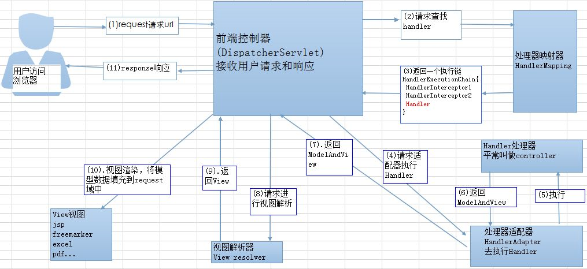
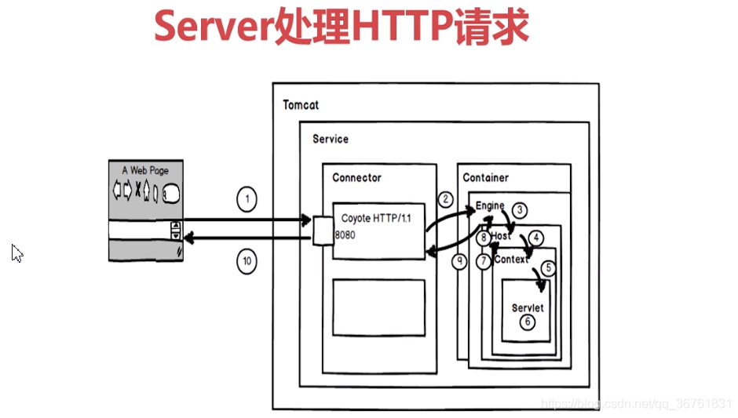

#### 目录

[TOC]

#### 谈谈对于Spring IOC和AOP

+   IOC 控制反转

```
角色一：应用程序
角色二：IoC容器
角色三：对象
```


1.  IOC就是控制反转，是一种设计思想，就是将原本在程序中手动创建对象的控制权，交给Spring框架管理。
2.  **控制反转IoC(Inversion of Control)是说创建对象的控制权进行转移，以前创建对象的主动权和创建时机是由自己把控的，而现在这种权力转移到第三方**，比如转移交给了IoC容器，它就是一个专门用来创建对象的工厂，你要什么对象，它就给你什么对象，有了 IoC容器，依赖关系就变了，原先的依赖关系就没了，它们都依赖IoC容器了，通过IoC容器来建立它们之间的关系。
3.  **IoC容器的一个初始化过程就是**：先定位并加载配置文件，然后解析配置文件中的bean节点，接着生成bean对象，最后进行依赖注入。
4.  **依赖注入DI(Dependency Injection)，组件之间依赖关系**由容器在运行期决定，形象的说，即**由容器动态地将某个依赖关系注入到组件之中**。


+   AOP 切面编程

    1.  AOP（Aspect-Oriented Programming，面向切面编程）能够将那些与业务无关，却为业务模块所共同调用的逻辑或责任（例如事务处理、日志管理、权限控制等）封装起来，便于减少系统的重复代码，降低模块间的耦合度。
    2.  常用的AOP框架分为Spring AOP和AspectJ，Spring AOP是属于运行时增强，而AspectJ是编译时增强。Spring AOP基于代理（Proxying），而AspectJ基于字节码操作（Bytecode Manipulation）。
    3.  Spring中AOP是通过动态代理实现的，如果要被代理类实现了某个接口，那么Spring AOP就会使用JDK动态代理去创建代理对象；而对于没有实现接口的对象，Spring AOP使用CGlib动态代理生成一个被代理对象的子类来作为代理。
    4.  基本原理：通过反射机制实现
    5.  动态代理（JDK）的核心是：动态代理的核心是 InvocationHandler 接口和 Proxy 类。
    
    


#### 谈谈Spring 中的bean吧

+   Bean的声明周期

    Bean的声明周期关键点为4个，分别是：**对象的创建，属性的注入，对象的初始化，对象的销毁**。而其他的声明周期都可以看成是扩展点。
    
    ```java
    // 实例化BeanFactoryPostProcessor实现类
    public class MyBeanFactoryPostProcessor implements BeanFactoryPostProcessor {
        // postProcessBeanFactory
    }
    
    
    // 四个注入点
    public class Person implements BeanFactoryAware, BeanNameAware,
            InitializingBean, DisposableBean {     
    	// BeanFactoryAware --> setBeanFactory
    	// BeanNameAware --> setBeanName
        // InitializingBean --> afterPropertiesSet
        // DisposableBean --> destory
                
    	// init-method
    	// destory-method
    }
    
    // 实例化InstantiationAwareBeanPostProcessorAdapter实现类
    class MyInstantiationAwareBeanPostProcessor extends
            InstantiationAwareBeanPostProcessorAdapter {
    	// postProcessBeforeInstantiation
        // postProcessAfterInitialization
        
        // postProcessPropertyValues
    }
    
    // 实例化BeanPostProcessor实现类
    public class MyBeanPostProcessor implements BeanPostProcessor {
        // postProcessAfterInitialization
        // postProcessBeforeInitialization
    }
    ```
    
    
    
    


+ Bean的作用域类型？

    1.  singleton单例，默认作用域
    2.  prototype原型，每次创建一个新对象
    3.  request请求，每次http创建一个新对象
    4.  session同一个会话共享一个实例
    5.  global-session全局会话，所有会话共享一个实例

+ Bean的状态

    1.  有状态的Bean可以认为是有实例变量的对象，可以保存数据，是非线程安全的。
    2.  无状态的Bean就是没有实例变量的对象，是线程安全的

+ Bean是线程安全的嘛？

    对于有状态的单例Bean不是线程安全的，而Spring官方提供的bean一般提供ThreadLocal解决线程安全的问题，ThreadLocal为每个线程保存线程私有的数据，比如`RequestContextHolder`类中。
    
    如果在类中没有成员变量，只有成员方法的话，就肯定不存在线程安全问题，因为每个线程有独立的栈空间。所以，可以尽量不要使用成员变量；然后还可以通过threadlocal，把变量放在threadlocal中，这样每个线程都有自己独立的变量副本；还可以在类上加注解
    
+ Bean是如何解决循环依赖的？

  什么是循环依赖：循环依赖就是多个Bean互相引用，最终形成闭环。
  
  如何解决循环依赖：通过三级缓存解决循环依赖。
  
  +   singletonObjects 一级缓存
  
  +   earlySingletonObjects 二级缓存（半成品）
  
  +   singletonFactory三级缓存 （解决代理问题）
  
      ```java
      doGetBean --> getSingleton --> 当前代码段
      @Nullable
      protected Object getSingleton(String beanName, boolean allowEarlyReference) {
          // 先从一级缓存中获取数据
          Object singletonObject = this.singletonObjects.get(beanName);
          if (singletonObject == null && isSingletonCurrentlyInCreation(beanName)) {
              synchronized (this.singletonObjects) {
      		   // 如果一级缓存获取不到，从二级缓存中获取
                  singletonObject = this.earlySingletonObjects.get(beanName);
                  if (singletonObject == null && allowEarlyReference) {
      			   // 如果二级缓存获取不到，从三级缓存中获取
                      ObjectFactory<?> singletonFactory = this.singletonFactories.get(beanName);
                      if (singletonFactory != null) {
                          // 获取到了
                          singletonObject = singletonFactory.getObject();
                          // 将对象放置到二级缓存中
                          this.earlySingletonObjects.put(beanName, singletonObject);
                          // 将对象从三级缓冲中移除
                          this.singletonFactories.remove(beanName);
                      }
                  }
              }
          }
          return singletonObject;
      }
      ```
  
  当调用doGetBean时，先从一级缓存`singletonObjects `中获取；如果获取不到或者对象正在创建中，那就再从二级缓存earlySingletonObjects中获取；如果还是获取不到，则从三级缓冲中获取`singletonFactory`，然后创建对象放到二级缓冲中。注意：加入`singletonFactory`的前提是执行了构造器，所以构造器内的循环依赖无法解决。
  
  
  
  总结：

    1.  使用context.getBean(A.class)，旨在获取容器内的单例A(若A不存在，就会走A这个Bean的创建流程)，显然初次获取A是不存在的，因此走A的创建之路~
    2.  实例化A（注意此处仅仅是实例化），并将它放进缓存（此时A已经实例化完成，已经可以被引用了）
    3.  初始化A：@Autowired依赖注入B（此时需要去容器内获取B）
    4.  为了完成依赖注入B，会通过getBean(B)去容器内找B。但此时B在容器内不存在，就走向B的创建之路~
    5.  实例化B，并将其放入缓存。（此时B也能够被引用了）
    6.  初始化B，@Autowired依赖注入A（此时需要去容器内获取A）
    7.  此处重要：初始化B时会调用getBean(A)去容器内找到A，上面我们已经说过了此时候因为A已经实例化完成了并且放进了缓存里，所以这个时候去看缓存里是已经存在A的引用了的，所以getBean(A)能够正常返回
    8.  B初始化成功（此时已经注入A成功了，已成功持有A的引用了），return（注意此处return相当于是返回最上面的getBean(B)这句代码，回到了初始化A的流程中~）。
    9.  因为B实例已经成功返回了，因此最终A也初始化成功
    10. 到此，B持有的已经是初始化完成的A，A持有的也是初始化完成的B，完美~

+   bean的三种注入方式
    1.  属性注入 `field`注入
    
        ```java
        @Controller
        public class FooController {
          @Autowired
          private FooService fooService;
        }
        ```
    
    2.  构造器注入
    
        ```java
        @Controller
        public class FooController {
          private final FooService fooService;
          @Autowired
          public FooController(FooService fooService) {
              this.fooService = fooService;
          }
        }
        ```

    3.  setter注入
    
        ```java
        @Controller
        public class FooController { 
          private FooService fooService;
          @Autowired
          public void setFooService(FooService fooService) {
              this.fooService = fooService;
          }
        }
        ```

+   Autowired的工作原理

    @Autowired注解的作用是由`AutowiredAnnotationBeanPostProcessor`实现的，查看该类的源码会发现它实现了MergedBeanDefinitionPostProcessor接口，进而实现了接口中的postProcessMergedBeanDefinition方法，@Autowired注解正是通过这个方法实现注入类型的预解析，将需要依赖注入的属性信息封装到InjectionMetadata类中，InjectionMetadata类中包含了哪些需要注入的元素及元素要注入到哪个目标类中。[🔗](https://juejin.cn/post/6844903591526793223)


#### Spring MVC

+   Spring MVC 原理



```markdown
1.客户端（浏览器）发送	0请求，直接请求到DispatcherServlet。
2.DispatcherServlet根据请求信息调用HandlerMapping，解析请求对应的Handler。
3.解析到对应的Handler（也就是我们平常说的Controller控制器）。
4.HandlerAdapter会根据Handler来调用真正的处理器来处理请求和执行相对应的业务逻辑。
5.处理器处理完业务后，会返回一个ModelAndView对象，Model是返回的数据对象，View是逻辑上的View。
6.ViewResolver会根据逻辑View去查找实际的View。
7.DispatcherServlet把返回的Model传给View（视图渲染）。
8.把View返回给请求者（浏览器）。
```


#### Spring 注解

+   属性注入注解
    1.  @Autowired 自动注入，根据属性类型
    2.  @Qualifier 根据属性的名称进行注入，需要配合@Autowired使用
    3.  @Resource 可以根据类型注入，也可以根据名称注入
    4.  @Value 注入普通类型属性
    
+   声明bean的注解

    1.  @Component 组件，没有明确的角色
2.  @Service 在业务逻辑层使用（service层）
    3.  @Repository 在数据访问层使用（dao层）
4.  @Controller 在展现层使用，控制器的声明
    5.  逻辑是在@Controller中接受来自前端的请求，调用@Service中提供的业务逻辑，而@Service会调用@Dao层访问数据。

+   java配置配相关注解

    1.  @Configuration 声明当前类为配置类，相当于xml形式的Spring配置 (作用在类上)

        ```java
        @Configuration //告诉Spring这是一个配置类
        @ComponentScan(basePackages = "com.training.componentscan")
        //扫描com.training.componentscan包及其子包被注解标注的类
        ```

    2.  @Bean 声明**当前方法**的返回值为一个bean （作用在方法上）


#### Spring事务

+   什么是事务的传播行为

    就是一个方法调用另一个方法，事务如何处理。

    编程式事务就是显式地调用`beginTransaction()、commit()、rollback()`等方法。

    声明式事务就是利用xml文件或者注解实现事务。

+   Spring定义了7中传播行为

    


#### Tomcat原理

Tomcat实际上由两部分组成，一部分是 `connector` , 一部分是 `container` , `connector` 负责简历通信获取并解析数据，形成`request`。然后`request`传递给容器，形成执行链，最后由对应的`servlt`执行。

+   第一步，通过Connector构建Request。具体表现：
    1.  在Connector类中调用`setProtocol`来设置对应的传输协议，从而加载 `org.apache.coyote.http11.Http11Protocol`。
    2.  在`Http11Protocol`中，初始化构建`EndPoint`，建立socket通信，获取、解析并返回数据。
    3.  Connector类利用解析的数据，抵用`createRequest`创建`request`。
+   第二步骤，通过四个容器类（Engine、Host、Context和Wrapper），对Request进行处理，最后找到指定的Servlet进行执行。


