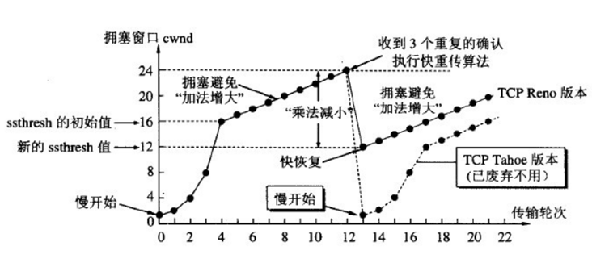

[TOC]

## 1 TCP/IP协议


#### 1.1 TCP协议和UDP协议的区别

+   TCP是面向连接的，UDP是面向非连接的。
+   TCP面向字节流，而UDP面向报文。
+   TCP是可靠的，UDP是不可靠的。


#### 1.2 常用端口号


#### 1.3 TCP三次握手


+   为什么需要三次握手

    为什么A在还需要发送最后一次ACK，这是为了防止已经失效的连接请求报文又传到了B，而产生错误。所谓**失效连接**指的是，在一次连接中，A先发送了一次报文，阻塞；于是又发送了一次，成功建立完成数据传输后关闭了连接；这时先前阻塞的报文又传递到B，B会误以为A试图建立连接并进行响应，这时候会白白浪费资源。而进行三次握手，A会不予响应，就解决这样的问题了。

+   如果A在第三次ACK响应时，报文丢失了怎么办

    A认为连接已经建立，当A尝试读写数据时，B会返回RST包响应。


#### 1.4 TCP四次挥手


+   为什么需要四次挥手

    因为TCP是全双工通信，一个客户端既能够发送信息，也够接收信息，如果需要关闭通信，我们需要拆掉每一个信道。

    

+ 为什么需要2MSL
    1.  为了保证A发送的最后一个ACK报文能够到达B。
    2.  防止已经失效的连接请求报文段。经过2MSL，那些在这个连接持续的时间内，产生的所有报文段就可以都从网络中消失。
    
    A并不知道B是否接到自己的ACK，A是这么想的： 
    
    1）如果B没有收到自己的ACK，会超时重传FiN，那么A再次接到重传的FIN，会再次发送ACK
    
    2）如果B收到自己的ACK，也不会再发任何消息，包括ACK
    
    无论是1还是2，A都需要等待，要取这两种情况等待时间的最大值，**以应对最坏的情况发生**，这个最坏情况是：
    
    去向ACK消息最大存活时间（MSL) + 来向FIN消息的最大存活时间(MSL)。
    
    这恰恰就是**2MSL( Maximum Segment Life)。**


+   如何应对高并发情况下，大量TIME_WAIT的问题

    服务器可以设置 SO_REUSEADDR 套接字选项来通知内核。


#### 1.5 为什么 TCP 叫数据流模式？ UDP 叫数据报模式？

-   所谓的**“流模式”**，是指**TCP发送端发送几次数据和接收端接收几次数据是没有必然联系的**，比如你通过 TCP连接给另一端发送数据，你只调用了一次 write，发送了100个字节，但是对方可以分10次收完，每次10个字节；你也可以调用10次write，每次10个字节，但是对方可以一次就收完。
-   **原因**：这是因为TCP是面向连接的，一个 socket 中收到的数据都是由同一台主机发出，且有序地到达，所以每次读取多少数据都可以。
-   所谓的**“数据报模式”**，是指**UDP发送端调用了几次 write，接收端必须用相同次数的 read 读完**。UDP是基于报文的，在接收的时候，每次最多只能读取一个报文，报文和报文是不会合并的，如果缓冲区小于报文长度，则多出的部分会被丢弃。
-   **原因**：这是因为UDP是无连接的，只要知道接收端的 IP 和端口，任何主机都可以向接收端发送数据。 这时候，如果一次能读取超过一个报文的数据， 则会乱套。


#### 1.6 TCP 如何保证可靠传输的？

TCP协议保证数据传输可靠性的方式主要有：

+ 超时重传

    发送方在发送完数据后等待一个时间，时间到达没有接收到ACK报文，那么对刚才发送的数据进行重新发送。

+ 流量控制

    TCP根据接收端对数据的处理能力，决定发送端的发送速度，这个机制就是流量控制。

+ 拥塞控制

    主要通过慢开始、拥塞避免、快重传（尽快进行重传）、快恢复（一旦收到3个重复确认，执行该算法）四种算法来实现。




**快重传算法**，发送方只要**一连收到三个重复确认就应当立即重传对方尚未收到的报文段**，而不必继续等待设置的重传计时器时间到期。由于不需要等待设置的重传计时器到期，能尽早重传未被确认的报文段，能提高整个网络的吞吐量。

**快速恢复算法**，当发送方连续收到三个重复确认时，就执行“乘法减小”算法，把 ssthresh 门限减半。 但是接下去并不执行慢开始算法。考虑到如果网络出现拥塞的话就不会收到好几个重复的确认，所以发送方现在认为网络可能没有出现拥塞。所以此时不执行慢开始算法，而是将 cwnd 设置为 ssthresh 的大小， 然后执行拥塞避免算法。

#### 1.7 TCP 粘包问题

TCP是传输层协议，通过数据流传输，不存在粘包一说。而粘包的问题是应用层协议出现的问题，问题关键在于如何正确的对数据进行解析。

发生粘包问题的原因在于：

+   发送方采用了Nagle算法，在收集多个分组和才进行发送。
+   接收方在收到数据后，应用层协议并不立即处理，这样会造成应用程序读取到多个首尾相粘到一起的包。

解决方法：

+   发送方：禁用Nagle算法
+   接收方：（1）对数据进行格式化处理（开始符、结束符）（2）设定数据的分组长度


#### 1.8 OSI各层基本数据单元

应用层——消息、报文（message）
传输层——数据段(segment)
网络层——分组、数据包（packet）
链路层——帧（frame）
物理层——比特流（bit）

#### 1.9 Socket套接字

scoket套接字就是ip地址加上端口号。


#### 1.10 UDP为什么是不可靠的

因为UDP不是面向连接的，发送方只要有数据发送，就会直接发送，而不管接收方的接收能力。


#### 1.11 TCP 的SYN泛洪攻击

在三次握手过程中，服务器在收到了客户端的 SYN 报文段后，会分配并初始化连接变量和缓存，并向客户端发送 SYN + ACK 报文段，这相当于是打开了一个“半开连接 (half-open connection)”，会消耗服务器资源。如果客户端正常返回了 ACK 报文段，那么双方可以正常建立连接，否则，服务器在等待一分钟后会终止这个“半开连接”并回收资源。这样的机制为 SYN洪泛攻击 (SYN flood attack)提供了机会，这是一种经典的 DoS攻击 (Denial of Service，拒绝服务攻击)，所谓的拒绝服务攻击就是通过进行攻击，使受害主机或网络不能提供良好的服务，从而间接达到攻击的目的。在 SYN 洪泛攻击中，攻击者发送大量的 SYN 报文段到服务器请求建立连接，但是却不进行第三次握手，这会导致服务器打开大量的半开连接，消耗大量的资源，最终无法进行正常的服务。

解决方法：SYN Cookies，现在大多数主流操作系统都有这种防御系统。SYN Cookies 是对 TCP 服务器端的三次握手做一些修改，专门用来防范 SYN 洪泛攻击的一种手段。它的原理是，在服务器接收到 SYN 报文段并返回 SYN + ACK 报文段时，不再打开一个半开连接，也不分配资源，而是根据这个 SYN 报文段的重要信息 (包括源和目的 IP 地址，端口号可一个秘密数)，利用特定散列函数计算出一个 cookie 值。这个 cookie 作为将要返回的SYN + ACK 报文段的初始序列号(ISN)。当客户端返回一个 ACK 报文段时，服务器根据首部字段信息计算 cookie，与返回的确认序号(初始序列号 + 1)进行对比，如果相同，则是一个正常连接，然后分配资源并建立连接，否则拒绝建立连接。

#### 1.12 如果已经建立了连接，但是客户端突然出现故障了怎么办

简而言之：通过定时器 + 超时重传机制，尝试获取确认，直到最后自动断开链接。

TCP还设有一个保活计时器，显然，客户端如果出现故障，服务器不能一直等下去，白白浪费资源。服务器每收到一次客户端的请求后都会重新复位这个计时器，时间通常是设置为2小时，若两小时还没有收到客户端的任何数据，服务器就会发送一个探测报文段，以后每隔75秒发送一次。若一连发送10个探测报文仍然没反应，服务器就认为客户端出了故障，接着就关闭连接。


#### 1.13 TIME-WAIT状态过多会产生什么后果？怎么处理？

从服务器来讲，短时间关闭了大量的Client连接或造成服务器商出现大量的TIME-WAIT连接，严重消耗服务器的资源。

从客户端来讲，客户端TIME-WAIT过多，会导致端口资源被占用，因为端口就65536个，被占满就会导致无法创建新的连接。

解决：服务器设置SO_REUSEADDR来重用套接字；调整系统内核参数，修改`/etc/sysctl.conf`文件，即修改`net.ipv4.tcp_tw_reuse`和`net.ipv4.tcp_tw_recycle`，分别表示重用和快速回收。


#### 1.14 http 100 状态码用过吗？

对于POST方法的请求，浏览器先发送header，服务器响应`100 continue`；浏览器再发送data，服务器响应`200 返回数据`。

而GET方法会将header和data一起发送出去，服务器响应`200 返回数据`。

PS：POST和GET方法最大的差异在于POST方法不具有幂等性，而GET具有；幂等性指的是一次和多次请求某一资源应该返回相同的结果。

## 2 HTTP协议

http就是超文本协议，表示客户端和服务端之间数据传输的格式规范。

#### 2.1 讲一讲http报文格式

+   **请求报文**

    
    
    请求报文包括：
    
        请求行：方法 + URL + 版本
        请求头：
        	Host: www.baidu.com
        	User-Agent: Mozilla/5.0 (Windows NT 6.1; WOW64)
        	Referer: # 代表当前访问的URL的上一个URL #
        	Cookie:
        	Accept: 客户端接受什么类型的信息
        请求体：GET方法没有请求体，POST中表单放在请求体中。
    
+   **响应报文**


​	响应报文包括：

```markdown
响应行：版本 + 状态 + 描述
响应头：Content-Type: text/html;charset=utf-8或者Content-Encoding响应实体的编码方式
响应体：json或者html文件之类
```


#### 2.2 说说HTTP包含哪些方法 八（种）

+   GET方法，意思是获取指定URL的资源，并返回实体主体。
+   POST方法，提交数据或信息（表单或者文件），请求服务器处理。
+   HEAD方法，类似于GET请求，只是返回的内容中没有响应体，用于获取报头。
+   PUT方法，用于向指定资源位置上传其最新内容，原来没有就上传，没有就覆盖。
+   DELETE方法，请求服务器删除Request-URI所标识的资源。
+   OPTIONS方法，允许客户端查看服务器的性能。
+   TRACE方法，回显服务器收到的请求，主要用于测试或诊断
+   CONNECT方法，HTTP1.1协议中预留能够将连接改为管道方式的代理服务器，通常用于SSL加密服务器的连接。


#### 2.3 说一说你知道哪些HTTP状态码吧

+   200客户端请求成功（**请求成功**）
+   301 资源已经被永久移动到其他URL（**客户端重定向**）
+   302重定向，临时性操作（**客户端重定向**）
+   403 服务器理解请求，但是拒绝执行（**客户端信息错误**）
+   404 资源不存在(**客户端信息错误**)
+   500 服务器内部错误（**服务器出错**）
+   502 网关错误（**服务器出错**）


#### 2.3 说说HTTP和HTTPS的区别

+   HTTP是80端口，HTTPS是443端口
+   HTTP是明文传送，HTTPS是加密传送
+   HTTP在应用层，HTTPS由于有安全机制，所以在传输层。


#### 2.4 说一说什么是HTTP无状态协议

无状态协议就是没有记忆能力，一次http请求结束就结束，第二次请求也取不回上次的数据。

如何解决：
+   前端用Cookies保存
+   后端用Session保存


#### 2.4 说一下 Cookies 和 Session

HTTP协议是无状态的协议。一旦数据交换完毕，客户端与服务器端的连接就会关闭，再次交换数据需要建立新的连接。这就意味着服务器无法从连接上跟踪会话。

1，session 在服务器端，cookie 在客户端（浏览器）
2，session 默认被存在在服务器的一个文件里（不是内存）
3，session 的运行依赖 session id，而 session id 是存在 cookie 中的，也就是说，如果浏览器禁用了 cookie ，同时 session 也会失效（但是可以通过其它方式实现，比如在 url 中传递 session_id）
4，session 可以放在 文件、数据库、或内存中都可以
5，用户验证这种场合一般会用 session
6，单个cookies的存储限制为3K

所以关键就在于session_id。

服务器在第一次创建session之后，会告诉客服端在Cookies中存放一个session_id，那么下次访问数据时，通过session_id就可以标识用户。如果cookies被禁用，那么通过url重写，加上sid标识用户。


#### 2.5 HTTP长连接和短连接

HTTP协议的长连接和短连接，实质上是TCP协议的长连接和短连接。

短连接：浏览器和服务器每进行一次HTTP操作，就建立一次连接，任务结束就中断连接。
长连接：当一个网页打开完成后，客户端和服务器之间用于传输HTTP数据的 TCP连接不会关闭，如果客户端再次访问这个服务器上的网页，会继续使用这一条已经建立的连接

短连接：多用于并发量大的项目。
长连接：多用于操作频繁，点对点的通信。


#### 2.6 HTTP各个版本的比较

+   HTTP 0.9 仅仅是一个 `GET /index.html`
+   HTTP 1.0 引入了一些新的字段，可以传输图像，并且增加了两个方法POST和HEAD；但是是**短连接**。
+   HTTP 1.1 使用可keep-alive，保持了长连接。但是这种长连接是顺序的，也就是一个请求完成后才能接着下一个。
+   HTTP 2
    +   完全采用了二进制协议。
    +   多工，复用了TCP连接，一个连接中，客户端和浏览器可以同时发送多个请求和回应，这样双向的、实时的通信称为多工。 
    +   采用数据流传输，为了避免不同的回应相互干扰，每个数据流都有一个独一无二的编号。
    +   头信息压缩，HTTP 2对头信息表进行压缩处理。
    +   允许服务器推送。


#### 2.7 讲讲证书

+   数字证书生成过程：
    1.  首先CA会事先生成一个密钥对（公钥和私钥），私钥自己藏起来，公钥公开。
    2.  将公钥和其他内容拼接成明文 `P`（用户的公钥、用户姓名、证书发布机构、证书有效期等）。
    3.  进行hash运算，得到哈希值 `H`。
    4.  利用私钥对哈希值进行加密，得到 `S`。
    5.  利用`P`和`S`加密生成数字证书。
+   证书验证过程，利用同样的Hash函数对P进行哈希，得到`H'`；同时利用公钥对`S`进行解密，得到`H`；比较`H`是否等于`H'`。

-1628474165687.png)

#### 2.8 负载均衡如何实现的？

+   负载均衡的算法：
    +   轮询法，将服务器按照顺序轮流分配到服务器上。
    +   随机法，随机选取一台。
    +   哈希法，通过IP地址哈希化来确定要选择的服务器编号。
    +   加权轮询，根据服务器的性能不同进行加权。

+   负载均衡分类

    +   基于内容分发的七层负载均衡，Nginx（工作在用户态），需要建立TCP连接，比如将 `/user/**` 的请求负载到单点登录服务器。
    +   四层负载均衡，LVS（工作在内核态），针对IP地址和端口上的数据进行同一的分发。

    

    

## 3. ARP协议

ARP是物理地址解析协议，ARP是解决**同一个局域网上**的主机或路由器的IP地址和硬件地址的映射问题。
如果是远程主机，那么需要通过网关将数据转发到目标主机上。


通俗一点的讲：网关就是要去别的网络的时候，把报文首先发送到的那台设备。稍微专业一点的术语，网关就是当前主机的默认路由。

[ARP协议](https://blog.csdn.net/qq_41901122/article/details/99712356)

-   工作过程

    

    -   第一步:首先，每个主机都会有自己的ARP缓存区中建立一个ARP列表，以表示IP地址和MAC地址之间的对应关系
    -   第二步:当源主机要发送数据时，首先检测ARP列表中是否对应IP地址的目的主机的MAC地址
        如果有，则直接发送数据。如果没有，就向本网段的所有主机发送ARP数据包，内容:我是IP地址，mac地址，谁是IP地址，mac?
    -   第三步:当本网络的所有主机收到该ARP数据包时，首先检查数据包中的IP地址是否是自己的IP地址，如果不是，则忽略该数据包。如果是，则首先从数据包中取出源主机的IP和mac地址写入到ARP列表中，如果以存在，则覆盖。然后将自己的mac地址写入arp响应包中，告诉源主机自己是它想要找的mac地址
    -   第四步:源主机收到ARP响应包后，将目的主机的IP和mac地址写入arp列表，并利用此信息发送数据
        如果源主机一直没有收到arp响应数据包，表示arp查询失败。

-   为什么要使用ARP协议

    -   OSI模型把网络工作分为七层，彼此不直接打交道，只通过接口（layer interface）。IP地址工作在第三层，MAC地址工作在第二层。当协议在发送数据包时，需要先封装第三层IP地址，第二层MAC地址的报头，但协议只知道目的节点的IP地址，不知道目的节点的MAC地址，又不能跨第二、三层，所以得用ARP协议服务，来帮助获取到目的节点的MAC地址。

-   ARP协议是第几层协议

    -   工作在二层，是三层协议。

-   ARP在生成环境产生的问题及解决办法：

    -   ARP病毒，ARP欺骗。
    -   高可用服务器对之间切换时要考虑ARP缓存的问题。
    -   路由器等设备无缝迁移时要考虑ARP缓存的问题，例如：更换办公室的路由器。


## 4. 面试

#### 从浏览器输入域名后会执行些什么

+   整体流程
    1.  输入URL网址
    
    2.  利用DNS获取对应IP地址
    
        
    
        1.  浏览器DNS缓存
        2.  本地DNS缓存
        3.  本地HOSTS文件
        4.  路由器DNS
        5.  ISP的DNS服务器缓存
        6.  根服务器
    
    3.  本机与远程IP机器建立TCP连接
    
    4.  数据传输（SSL/TLS安全机制处理）
    
+   DNS为什么使用UDP

    客户端向DNS服务器查询域名的时候，采用UDP。

    当进行区域传送，主域名服务器向辅域名服务器传送变化的那部分数据时，采用TCP。

+   TLS/SSL机制是怎么样的

    客户端首先会验证公钥是否有效，比如颁发机构，过期时间等等。

    涉及到两种加密算法，对称加密和非堆成加密

    服务器的公钥和私钥是非对称加密，本地客户端是对称加密。

    

    

#### RSA的公私钥生成过程


