[TOC]


## 1. 数据结构

#### 1.1 Redis基本数据结构

+   Redis数据结构分类:
    	一类是对外公开的数据结构：`set`，`hash`，`list`，`zset`，`string` 等
    	一类是内部数据结构：`quicklist`，`ziplist`，`skiplist`，`sds`，`dict` 等

+   Redis数据结构链条

-1628756621846.png)

其中，`set`，`hash`，`list`，`zset`，`string` 是由内部数据结构提供实现的，对应关系如下：

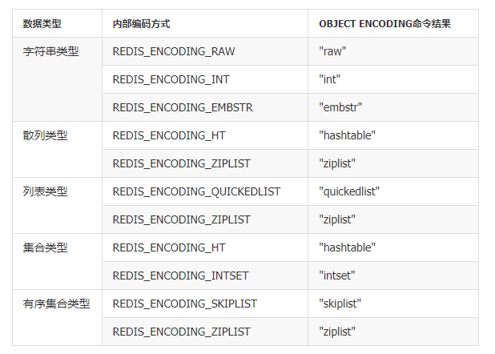


#### 1.2 ziplist & skipList & quicklist

+   **skipList** 

redis只在两个地方使用了跳跃表，一个是实现有序集合键，另一个是在集群节点中用作内部数据结构。

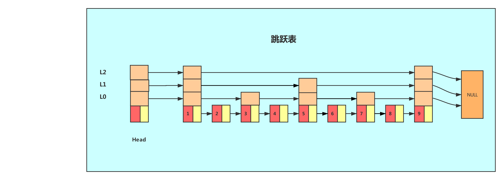

+   **ziplist**

**ziplist是一个经过特殊编码的双向链表，它的设计目标就是为了提高存储效率。**压缩列表本质上就是一个字节数组，是Redis为了节约内存而设计的一种线性数据结构，可以包含多个元素，每个元素可以是一个字节数组或一个整数。Redis的有序集合、散列和列表都直接或者间接使用了压缩列表。

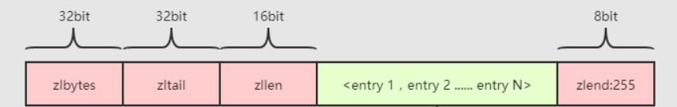

+   **quicklist**

当元素数量大于128个且所有元素长度大于64字节时，Redis使用快速链表（quicklist）数据结构存储，而快速链表就是双向链表与压缩列表的组合。

```c++
typedef struct quicklist{
	quicklistNode *head;
	quicklistNode *tail;
	unsigned long count;//快速列表中元素总数
	unsigned long len;//快速列表中Node（节点）个数
	int fill : 16;//每个quicklistNode中ziplist长度
}quicklist;
```


#### 1.3 Redis过期键删除策略

>   键删除策略

​    **定时删除**：在设置键的过期时间的同时，创建一个定时任务，当键达到过期时间时，立即执行对键的删除操作
​    **惰性删除**：放任键过期不管，但在每次从键空间获取键时，都检查取得的键是否过期，如果过期的话，就删除该键，如果没有过期，就返回该键
​    **定期删除**：每隔一点时间，程序就对数据库进行一次检查，删除里面的过期键，至于要删除多少过期键，以及要检查多少个数据库，则由算法决定。


>   redis过期时间的保存与判定

`redisDB`结构体中的`expires`属性保存数据库中所有键的过期时间, 过期时间用UNIX时间戳表示,且值为`long long`整数. 对于过期键的判断:

1.  检查给定键是否存在于`过期字典`，如果存在，取出键的过期时间。
2.  通过判断当前UNIX时间戳是否大于键的过期时间，是的话，键已过期，相反则键未过期

>惰性删除的策略

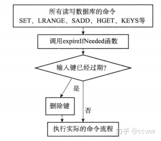

```c++
robj *lookupKeyRead(redisDb *db, robj *key) {
    robj *val;
    expireIfNeeded(db,key); /* 检查 key 是否过期，如果是的话，将它删除 */
    val = lookupKey(db,key); /* 查找 key ，并根据查找结果更新命中/不命中数 */
    return val;
}

/*
 * 如果 key 已经过期，那么将它删除，否则，不做动作。
 * key 没有过期时间、服务器正在载入或 key 未过期时，返回 0 
 * key 已过期，那么返回正数值
 */
int expireIfNeeded(redisDb *db, robj *key) {
    long long when = getExpire(db,key); /* 取出 key 的过期时间 */
    if (when < 0) return 0; /* 1. key 没有过期时间，直接返回 */
    if (server.loading) return 0; /* 2. 不要在服务器载入数据时执行过期 */
    if (mstime() <= when) return 0; /* 3. 未过期 */
    
    propagateExpire(db,key); /* 传播过期命令 */
    return dbDelete(db,key);
}
```

>   定期删除的策略

+ 先判断过期字典中位置的占用率
    + 如果占用率少于`%1`, 则等到`key`多一点再进行删除.
    + 否则, 对`expires[*]`检测, 随机挑出`W`个`key`检测:
         + 如果`key`超时, 删除`key`
         + 如果一轮中删除的`key`的数量超过`1/4`, 则循环该过程.
         + 如果`定期删除策略`的时间到期, 则结束当前过程.

```c++
/* 主动清除过期 key  */
void activeExpireCycle(void) {
    long long start = timelimit;
    // 这个函数可以使用的时长（毫秒）,定期删除策略的限制时长
    timelimit = 1000000*REDIS_EXPIRELOOKUPS_TIME_PERC/REDIS_HZ/100;
    
    for (j = 0; j < server.dbnum; j++) {
        do {
            // 过期字典里只有 %1 位置被占用，调用随机 key 的消耗比较高等key 多一点再来
            if (num && slots > DICT_HT_INITIAL_SIZE && (num*100/slots < 1)) break;

            // 从过期字典中随机取出 key ，检查它是否过期
            expired = 0;    /* 被删除 key 计数 */
            num = REDIS_EXPIRELOOKUPS_PER_CRON; /* 最多每次可查找的次数 */
            while (num--) {
                // 随机查找带有TTL的key, 看它是否过期, 如果数据库为空，跳出
                if ((de = dictGetRandomKey(db->expires)) == NULL) break;
                if (now > t) {...} /* 已过期,执行删除策略 */
            }
            /* 每次进行 16 次循环之后，检查时间是否超过，如果超过，则退出 */
            iteration++;
            if ((iteration & 0xf) == 0 && (ustime()-start) > timelimit) return;

        } while (expired > REDIS_EXPIRELOOKUPS_PER_CRON/4); /* 删除的键超过1/4,则继续循环*/
    }
}
```

#### 1.4 Redis 近似LRU策略

redis单个key和string的value值都限制为`512M`, 而Redis最大内存限制为物理内存的`75%`, 比如4G内存对应的是3G内存. 由于内存是有限的, 当内存到达上限之后, 如果新来数据, 就需要考虑淘汰策略.

通常的LRU利用双向指针需要额外存储存放next和prev指针，会牺牲掉比较大的存储空间，redis采用了一个`近似`的做法，**就是随机取出若干个key，然后从这N个键中选出最久没有使用的一个key进行淘汰**。

Redis主要分为两类策略，分别是`allkeys-lru` 和 `volatile-lru`，`allkeys`表示从所有的键中删除，而`volatile `表示从`expire`的键中选取。

```c++
/* volatile-lru and allkeys-lru policy */
// LRU 算法
if (server.maxmemory_policy == REDIS_MAXMEMORY_ALLKEYS_LRU)
{
    for (k = 0; k < server.maxmemory_samples; k++) {
        de = dictGetRandomKey(dict); /* 随机获取一个key */
        thiskey = dictGetKey(de);
        thisval = estimateObjectIdleTime(thiskey); /* 获取当前key的空闲时间 */

        if (bestkey == NULL || thisval > bestval) {
            bestkey = thiskey; // 最久没有使用的一个key
            bestval = thisval; // 对应的value
        }
    }
}

/* 后续进行删除 */
```

#### 1.5 Redis缩容和扩容

　　🍉 redis中，每次插入键值对时，都会检查是否需要扩容。如果满足扩容条件，则进行扩容。
　　当以下条件中任意一个被满足时，程序会自动开始对哈希表执行扩展操作：
　　1、服务器目前没有执行BGSAVE或BGREWRITEAOF命令，并且哈希表负载因子大于等于1。
　　2、服务器正在执行BGSAVE或BGREWRITEAOF命令，并且哈希表负载因子大于等于5。
　　区分这两种情况的目的在于，因为执行BGSAVE与BGREWRITEAOF过程中，Redis都需要创建子进程，而大多数操作系统都采用写时复制技术来优化子进程使用效率，所以在子进程存在期间，服务器会提高执行扩展操作所需的负载因子，从而尽可能避免在子进程存在期间进行哈希表扩展操作，这可以避免不必要的内存写入，最大限度的节约空间。

　　🍉 另一方面，当哈希表负载因子小于0.1时，程序自动开始对哈希表执行收缩操作。


## 2. 场景应用

#### 2.1 数据持久化

>   RDB数据持久化

将某个时间点的所有数据都存放到硬盘上, 可以将快照复制到其它服务器从而创建具有相同数据的服务器副本。如果系统发生故障，将会丢失最后一次创建快照之后的数据, 如果数据量很大，保存快照的时间会很长。

+   实操: 

    默认开启, shutdown会自动执行RDB持久化, 可以人为设置持久化文件的存储位置. 在`redis.conf`中, 可以配置 `dbfilename dump.rdb` 来设置持久化文件的位置. 也可以自行设置持久化的频率, `save 3600 1`, 表示在3600秒内有1个key发生变化就进行持久化.

+   实现原理

    Redus会单独创建(fork)一个子进程来进行持久化,会先将数据写入到一个临时文件,待持久化完成后,再用临时文件替换上次持久化好的文件. 容易发射数据丢失.

    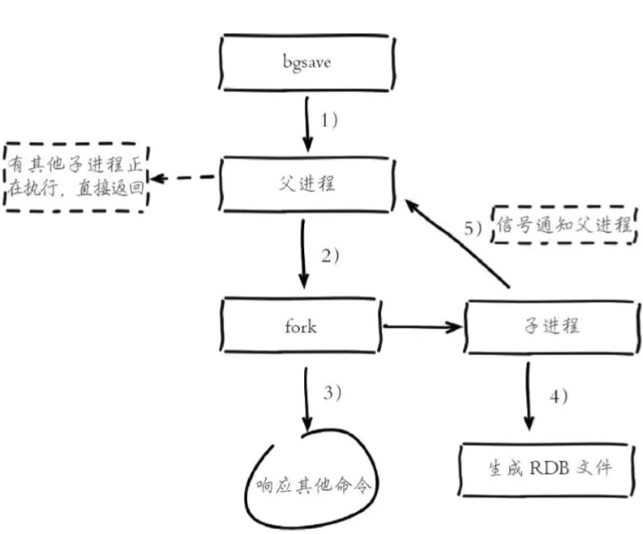

>   AOF数据持久化

以日志形式来记录每个写操作,将redis执行过的所有写指令记录下来(读指令不记录),只可以追加文件而不可以改写文件.

类似于mysql种的binlog，将写命令添加到AOF文件的末尾。**针对AOF的持久化需要设置同步选项**，从而确保写命令同步到磁盘文件上的时机 (always, everysec, no)，这是因为对文件进行写入并不会立马生效，而是由操作系统决定什么时候写入。

+   实操

    默认不开启, 需要再`redis.conf`中修改为`appendonly yes`

+   实现原理

    所有写入命令会追加到`aof_buf缓冲`中, AOF缓冲区根据对应的策略向硬盘做同步操作, 而随着AOF文件的膨胀, 需要对AOF进行重写, 比如用 `mset` 来替换 多条一次一次的 `set`.

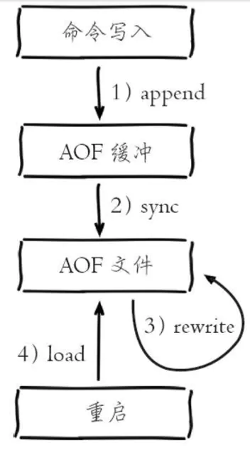

#### 2.2 Redis为什么通常设置为单线程

Redis是针对IO密集型而不是CPU密集型, Redis只需要通过单线程 + IO多路复用就可以实现大多数场景下数据的读取.

>   IO多路复用

一句话解释：单线程或单进程同时监测若干个文件描述符是否可以执行IO操作的能力。

>   CPU密集型和IO密集型

计算机资源的两个方面,一个是CPU计算资源, 一个是内存资源; CPU密集比如矩阵运算, IO密集比如大文件的下载.


这里的READ和WRITE表示的是对客户端数据的读写, 只要单线程IO多路复用判读数据是否读写完成, 然后执行对应的redis命令即可. 


#### 2.3 Redis 实现分布式锁

在分布式场景下，无法使用单机环境下的锁来对多个节点上的进程进行同步。可以使用 Redis 自带的 SETNX 命令实现分布式锁，除此之外，还可以使用Redisson来实现.

>   加锁

客户端加锁, 主要分为两个步骤
	判断锁是否存在, `exists myLock`
	判断当前客户端的`hash`值是否等于`redis-myLock`中的键

第一次加锁, 会得到下面的结果:

```json
myLock: {
    "8743c9c0-0795-4907-87fd-6c719a6b4586:1":1
}
```

代表 `8743c9c0-0795-4907-87fd-6c719a6b4586:1` 这个客户端对 `myLock` 这个锁完成了加锁, 接着会执行`pexpire myLock 30000`命令，设置`myLock`这个锁key的生存时间是30秒。

>   锁互斥机制

另外一个客户端, 执行了同样的Lua脚本, 执行流程如下:
	首先, 判断是否`exists myLock`, 发现这个锁已经存在了
	接着, 判断`myLock`锁的hash数据结构中是否包含客户端2的ID, 很明显不包含

所以，客户端2会获取到`pttl myLock`返回的一个数字，这个数字代表了myLock这个锁key的剩余生存时间。比如还剩15000毫秒的生存时间。此时客户端2会进入一个while循环，不停的尝试加锁。

>   watch dog 看门狗自动延期机制

客户端1加锁的锁key默认生存时间才30秒，如果超过了30秒，客户端1还想一直持有这把锁，怎么办呢？

简单！只要客户端1一旦加锁成功，就会启动一个watch dog看门狗，他是一个后台线程，会每隔10秒检查一下，如果客户端1还需要持有锁key，那么就会不断的延长锁key的生存时间。

>   可重入锁

如果客户端1已经拥有了`myLock`, 然后又重复加锁, 会发生什么, 比如:

```lua
RLock lock = redission.getLock("myLock");
lock.lock()
// 代码
lock.lock()
// 代码
lock.unlock()
// 代码
lock.unlock()
```

+   第一个if判断肯定不成立, `exists myLock`会显示锁已经存在了
+   第二个if判断会成立, 因为`myLock` 的hash数据结构中包含的`hash-ID`就是客户端1的编码.

此时会执行可重入加锁的逻辑, 会执行`incrby myLock`, 通过这个命令, 对客户端的加锁次数累加1,此时得到的结果:

```json
myLock: {
    "8743c9c0-0795-4907-87fd-6c719a6b4586:1":2
}
```

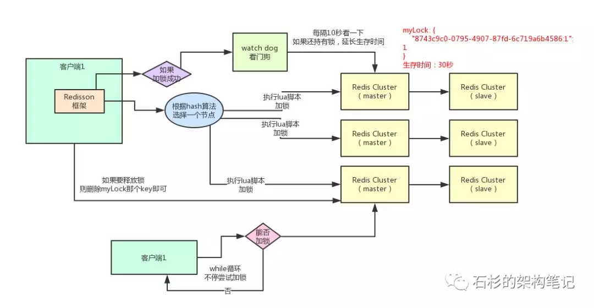

#### 2.4 缓存穿透

一般的缓存系统，都是按照key去缓存查询，如果不存在对应的value，就应该去后端系统查找（比如DB）。一些恶意的请求会故意查询不存在的key,请求量很大，就会对后端系统造成很大的压力。这就叫做缓存穿透。

+   对一定不存在的key进行过滤。可以把所有的可能存在的key放到一个大的Bitmap中，查询时通过该bitmap过滤。
+   对不存在的key也进行缓存


#### 2.5 缓冲雪崩

当缓存服务器重启或者大量缓存集中在某一个时间段失效，这样在失效的时候，会给后端系统带来很大压力。导致系统崩溃。

+   不同的key，设置不同的过期时间，让缓存失效的时间点尽量均匀。
+   做二级缓存，A1为原始缓存，A2为拷贝缓存，A1失效时，可以访问A2，A1缓存失效时间设置为短期，A2设置为长期


#### 2.6 Redis 主从 、哨兵和集群分片

>   主从复制

当读流量太大时, 可以采用读写分离, 将读流量分散到从服务器中.

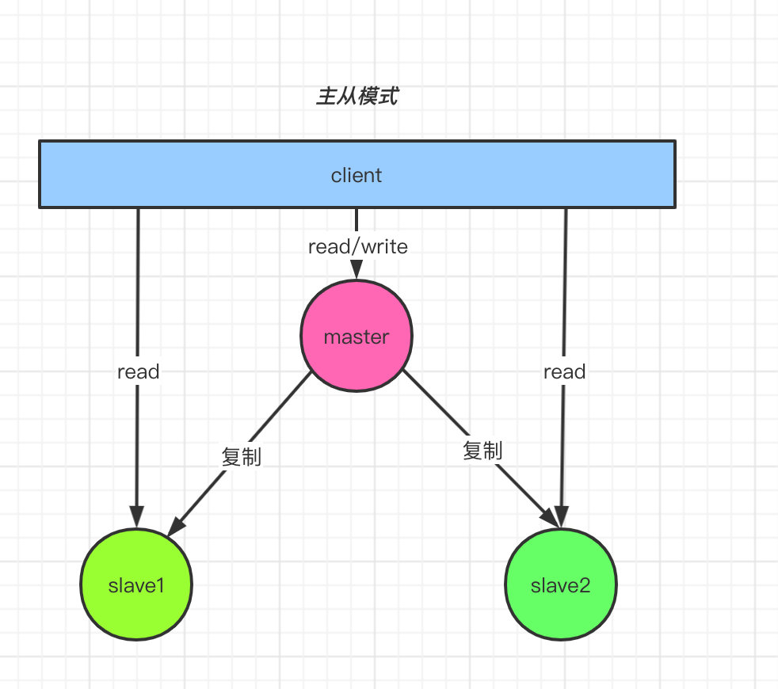

>   哨兵模式

如果主从复制模式下, 主服务器挂了, 系统应当能够进行处理. 这就引入了哨兵模式. 每个Sentinel以 每秒钟 一次的频率，向它**所有**的 **主服务器**、**从服务器** 以及其他Sentinel**实例** 发送一个PING 命令。

引入哨兵集群是因为哨兵也有可能宕机.

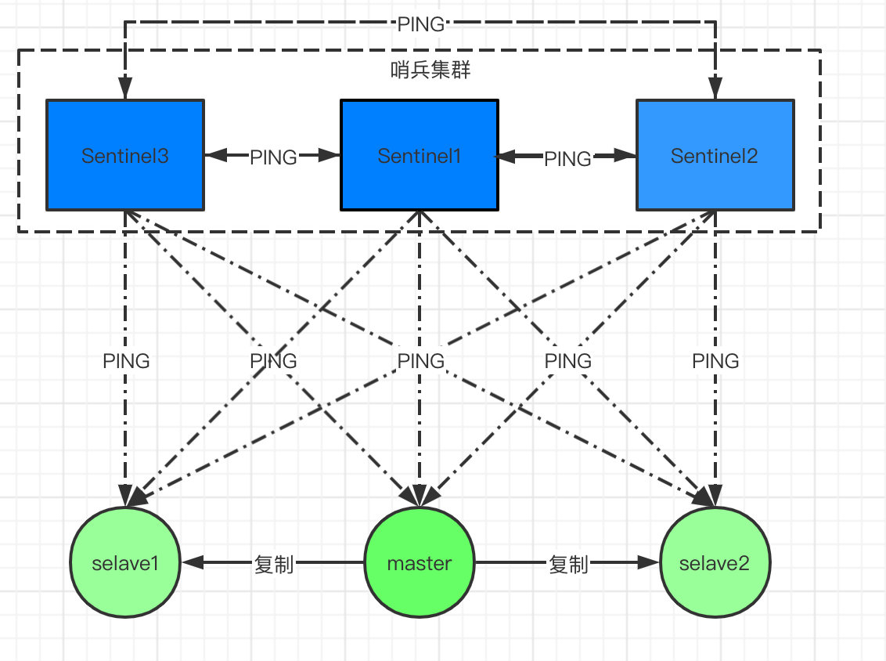

>   集群分片模式

对于`master` 节点而言, 数据并不是存放在一台机器上, 而是将数据分片存放在集群上构成一个`master`节点

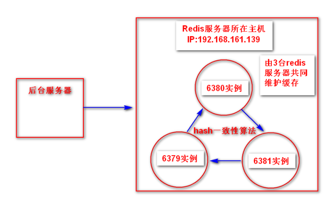

>   主从复制 + 哨兵 + 集群分片

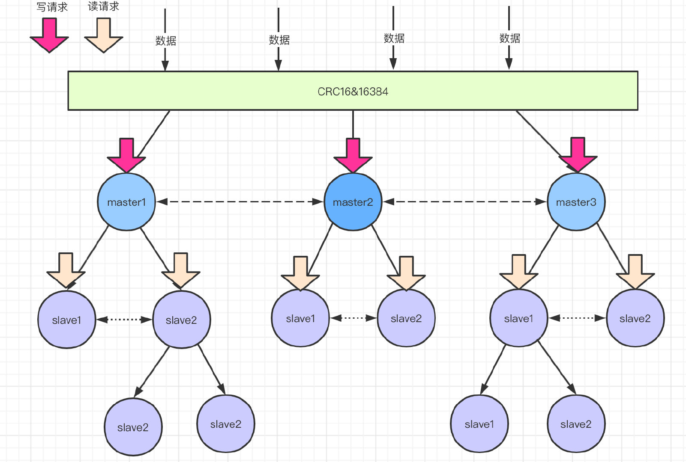

#### 2.7 一致性Hashing 和 哈希槽

>   一致性hashing

传统hash算法中, 当增加或者减少`hash-table`大小的时候, `rehash`的操作会浪费很多时间, 而这种浪费在分布式的环境下更加明显.

一致性哈希通过一致性哈希环的数据结构实现, 环的起点是$0$, 终点是$2^{32}-1$, 将`数据`和`服务器`都放置到同一个哈希环后, 在哈希环上利用二分法查找距离这个数据最近的服务器进行数据存储, 也就是`upper_bound`.


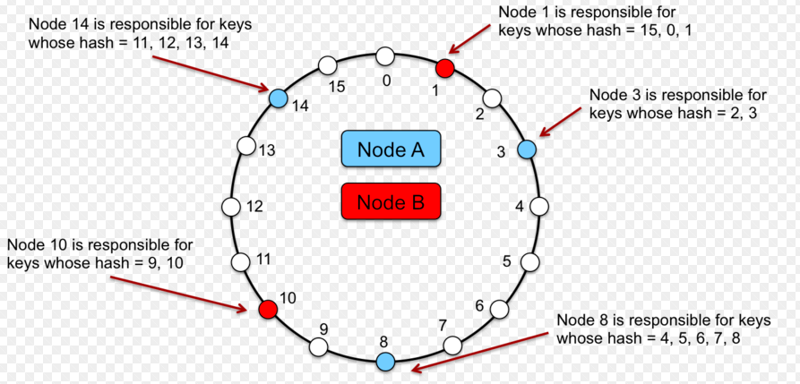

>   哈希槽

Redis集群（Cluster）并没有选用上面一致性哈希，而是采用了**哈希槽**（SLOT）的这种概念。主要的原因就是上面所说的，一致性哈希算法对于数据分布、节点位置的控制并不是很友好。

**哈希槽包含两个概念: 第一个是哈希算法, 第二个是槽位**. 其中哈希算法不是简单的`hash()`, 而是`crc16`算法, 是一种校验算法. 而槽位定义了空间分配的规则, `Redis Cluster` 的槽位是自定义分配的, 可以自定义大小自定义位置.

`Redis Cluster`包含了16384个哈希槽，每个`key`通过计算后都会落在具体一个槽位上，而这个槽位是属于哪个存储节点的，则由用户自己定义分配。例如机器硬盘小的，可以分配少一点槽位，硬盘大的可以分配多一点。如果节点硬盘都差不多则可以平均分配。所以哈希槽这种概念很好地解决了一致性哈希的弊端。

为什么选择16384个槽位, `redis`集群的节点数量一般不会超过1000，16384完全足够了, 同时可以降低通信过程中传输数据的大小，`16384//8=2048=2KB`. 

需要考虑的因素: `容错性`, `扩展性`,  `平衡性`


