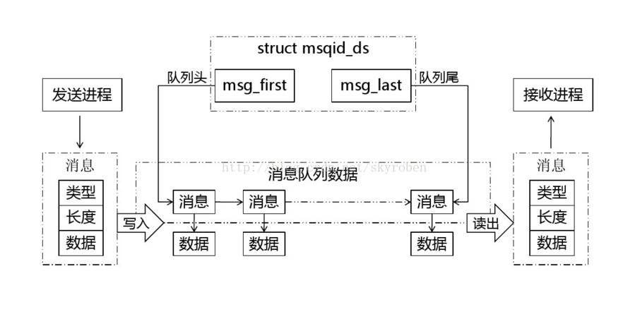
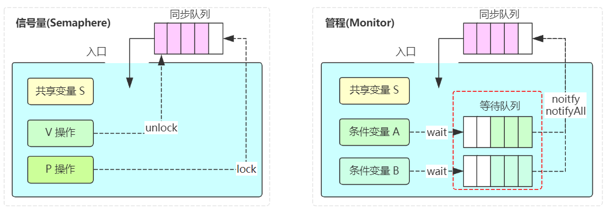
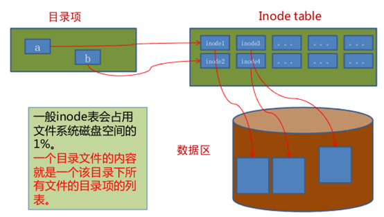
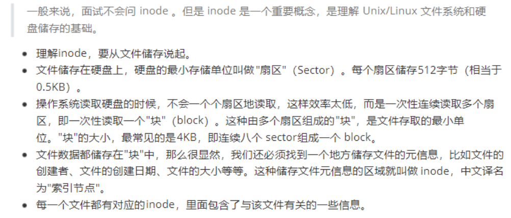
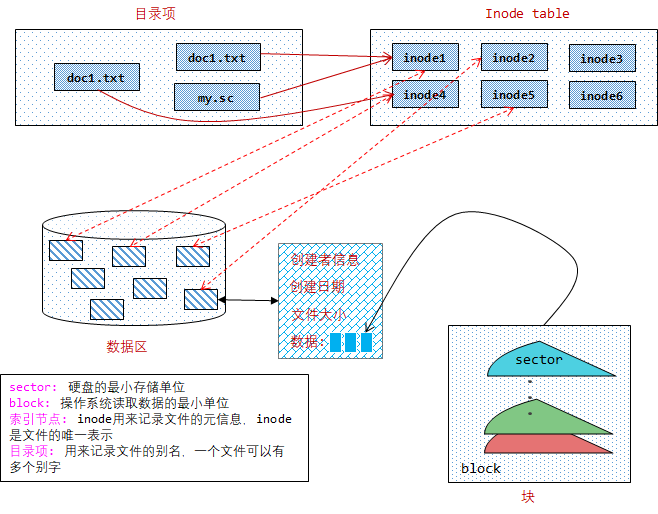
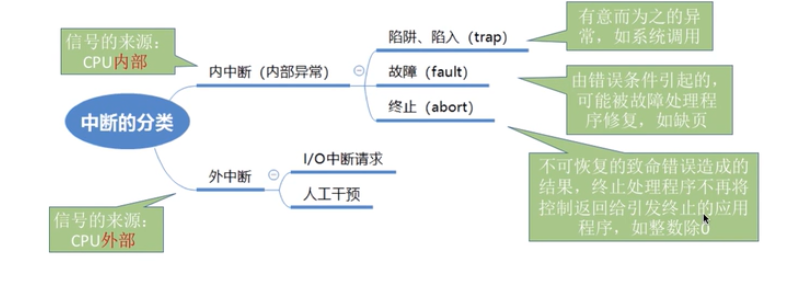

[TOC]


## 1. 进程管理


#### 1.1 进程与线程的区别

进程和线程都只独立的执行序列，区别在于进程运行在`隔离的内存空间`中，而线程运行在`共享的内存空间`中。

-1628837886906.png)

+   进程是资源分配的基本单位
    +   进程控制块PCB是描述进程的基本信息和运行状态，所谓创建进程和撤销进程是对PCB的操作。
+   线程是程序调度的基本单位
    +   线程对栈、寄存器以及程序计数器是私有的，而共享进程的PCB、数据段、程序段以及打开的文件。
+   **区别**
    +   进程是资源分配的最小单位，线程是程序执行的最小单位
    +   **存储上**：进程有自己的独立地址空间，每启动一个进程，系统就会为它分配地址空间，建立数据表来维护代码段和数据段。而线程是共享进程中的数据，会使用相同的地址空间，因此CPU切换一个线程的花费远比进程要小很多。
    +   **通信上：**线程之间的通信更方便，同一进程下的线程通过共享存储来实现通信；而进程之间需要通过IPC的方式进行通信。

#### 1.2 进程和线程的`通信`和`同步`

>   通信和同步

+   进程同步：控制多个进程按一定顺序执行
+   进程通信：进程间传输信息

>   进程通信

每个进程各自有不同的用户地址空间，任何一个进程的全局变量在另一个进程中都看不到，所以进程之间要交换数据必须通过内核，在内核中开辟一块缓冲区，进程A把数据从用户空间拷到内核缓冲区，进程B再从内核缓冲区把数据读走，内核提供的这种机制称为进程间通信。

1.  **管道**

管道是通过调用 `pipe `函数创建的，`fd[0] ` 用于读，`fd[1]` 用于写。

```c++
#include <unistd.h>
int pipe(int fd[2]);
```

+   具有以下限制

    +   只支持半双工通信，两边都可以发送和接收数据，但某一时刻只有一个可以发送；
    +   只能在父子进程或者兄弟进程中使用。

    

2.  **消息队列** 🍉

+   读进程可以根据消息类型有选择地接收消息；
+   消息存放在消息队列中。



3.  **信号量**

信号量（semaphore）与已经介绍过的 IPC 结构不同，它是一个计数器。信号量用于实现进程间的互斥与同步，而不是用于存储进程间通信数据。

4.  **共享内存** 🍉

允许多个进程共享一个给定的存储区。因为数据不需要在进程之间复制，所以这是最快的一种 IPC，需要使用信号量用来同步对共享存储的访问。

5.  **套接字**

与其它通信机制不同的是，它可用于不同机器间的进程通信。

>   同步

1.  临界区

    对临界资源进行访问的那段代码称为临界区。

2.  信号量

    信号量（Semaphore）是一个整型变量，可以对其执行 down 和 up 操作，也就是常见的 P 和 V 操作。

    -   **down** : 如果信号量大于 0 ，执行 -1 操作；如果信号量等于 0，进程睡眠，等待信号量大于 0；
    -   **up** ：对信号量执行 +1 操作，唤醒睡眠的进程让其完成 down 操作。

    down 和 up 操作需要被设计成原语，不可分割，通常的做法是在执行这些操作的时候屏蔽中断。


#### 1.3 进程 线程 协程 管程

+   进程

    是资源分配的最基本单位

+   线程

    是程序调度的最基本单位

+   协程

    英文翻译为 `coroutine`，协程是一种用户态的轻量级线程，协程的调度完全由用户控制，协程拥有自己的寄存器上下文和栈。协程调度切换时，将寄存器上下文和栈保存到其他地方，在切回来的时候，恢复先前保存的寄存器上下文和栈。比如Python的`yield`。

+   管程

    管程英文为 `monitor`，具体表现为`仅允许一个进程在管程内执行某个内部过程`。Java中的`synchronized` 实现的就是基于管程实现的。而与管程对应的一种锁机制方案为信号量，是操作系统提供的一种协调共享资源访问的方法。

    


#### 1.4 僵尸进程 、 孤儿进程 以及 init进程

+   僵尸进程：一个进程使用`fork`创建子进程，如果子进程退出，而父进程并没有调用`wait`或者`waitpid`获取子进程的状态信息，那么子进程的进程描述符等一系列信息还会保存在系统中。这种进程称之为僵死进程。
+   孤儿进程：父进程运行结束，但子进程还在运行的子进程就称为`孤儿进程`。孤儿进程最终会被 `init进程(进程号为1)` 所收养，因此 `init进程` 此时变成 `孤儿进程` 的 `父进程` ，并由 `init进程` 对它们完成状态收集工作。
+   init进程：它是内核启动的第一个用户级进程。`init进程`有许多很重要的任务，比如像启动`getty（用于用户登录）`、实现运行级别、以及处理孤立进程。

#### 1.5 进程调度算法

+   **先来先服务 first-come first-serverd（FCFS）**
+   **时间片轮转 round-robin（RR）**
+   **优先级调度**

#### 1.6 进程状态的切换


#### 1.7 Linux中的信号

| `SIGHUP`  | 1    | Hangup 终端连接断开信号                                      | SIGSTKFLT | 16   | Stack  fault.                                                |
| --------- | ---- | ------------------------------------------------------------ | --------- | ---- | ------------------------------------------------------------ |
| SIGINT    | 2    | Interrupt 中断信号，终端中输入ctrl+c，可中断前台进程         | SIGCHILD  | 17   | Child status has changed . 子进程终止或停止时，产生该信号，默认被忽略 |
| SIGQUIT   | 3    | Quit 退出信号，终端中输入ctrl+\，可退出前台进程，同时产生core文件 | SIGCONT   | 18   | Continue  让一个停止(stopped)的进程继续执行.                 |
| SIGILL    | 4    | Illegal instruction  非法指令信号                            | SIGSTOP   | 19   | Stop, unblockable 停止一个作业控制进程                       |
| SIGTRAP   | 5    | Trace  trap调试信号，当在程序中设置断点后，该信号使得调试程序获得控制权 | SIGTSTP   | 20   | ctrl+z产生该信号，该信号使得前台进程挂起                     |
| SIGABRT   | 6    | Abort 程序异常终止信号，abort函数产生该信号                  | SIGTTIN   | 21   | 当后台作业要从用户终端读数据时, 该作业中的所有进程会收到SIGTTIN信号. 缺省时这些进程会停止执行. |
| SIGBUS    | 7    | BUS error 程序访问不存在的内存区域时，产生该信号             | SIGTTOU   | 22   | Background write to tty  类似于SIGTTIN, 但在写终端(或修改终端模式)时收到. |
| SIGFPE    | 8    | Floating-point exception算术异常，如除以0                    | SIGURG    | 23   | 有”紧急”数据或out-of-band数据到达socket时产生.               |
| `SIGKILL` | 9    | Kill用来立即结束程序的运行, 本信号不能被阻塞、处理和忽略。   | `SIGXCPU` | 24   | 超过CPU时间资源限制.                                         |
| SIGUSR1   | 10   | 用户自定义                                                   | `SIGXFSZ` | 25   | 当进程企图扩大文件以至于超过文件大小资源限制。               |
| SIGSEGV   | 11   | Segmentation violation 试图访问未分配给自己的内存, 或试图往没有写权限的内存地址写数据. | SIGVTALRM | 26   | 虚拟时钟信号                                                 |
| SIGUSR2   | 12   | 用户自定义                                                   | SIGPROF   | 27   | 进程用的CPU时间以及系统调用的时间.                           |
| SIGPIPE   | 13   | Broken pipe  当管道读端已关闭，继续往管道中写，产生该信号    | SIGWINCH  | 28   | 窗口大小改变时发出                                           |
| SIGALRM   | 14   | Alarm clock  alarm 函数超时时产生该信号，默认动作是程序终止  | `SIGIO`   | 29   | 文件描述符准备就绪, 可以开始进行输入/输出操作.               |
| `SIGTERM` | 15   | Termination 终止程序信号，命令kill默认使用该参数             | `SIGPWR`  | 30   | Power failure, 没电了                                        |
| SIGSYS    | 31   | 非法的系统调用。                                             |           |      |                                                              |

## 2 内存管理

#### 2.1 什么是内存

+   概念

    内存是用于存放数据的硬件，`程序运行前需要放到内存中才可以被CPU处理`。

+   发展历史

    早期计算机中，运行一个程序，程序会被全部装入内存中，程序直接运行在内存上。会导致下面三个问题：

    +   🍜 进程与进程之间空间不隔离，造成安全问题
    +   🍜 内存使用效率低下，整体换入换出容易造成内存碎片
    +   🍜 地址空间不确定

    

#### 2.2 分段式数据存储

程序中访问的内存地址不再是时机的物理内存地址，而是一个虚拟地址，最后由操作系统将这个虚拟地址映射到适当的物理内存地址上。当创建一个进程时，操作系统会为该进程分配一个4GB大小的虚拟进程地址空间，整个 `地址空间` 分为 数据段、代码段等。


并且堆区分配一般从低地址到高地址分配，而栈区分配一般从高地址到低地址分配。

#### 2.3 分页式数据存储

分页的基本方法是将地址空间分成许多的页面，分页的思想就是程序运行时用到哪页就为哪页，没有用到的页暂时保留在硬盘上，当用到的页面在物理空间中时，将会触发`缺页中断`，利用页置换算法，将物理空间的页面置换到内存中。

>   分页地址映射

`虚拟地址`分成两部分：一部分 `存储页面号`，一部分 `存储偏移量`。
`页表-page table`：存储着页和页框的映射表。
`页框-page frame`：物理内存空间
`页-page`：程序地址空间
`页表项`：页表里面的值

.png)

>   内存地址转换

1.  把虚拟内存地址，切分成页号和偏移量的组合；
2.  从页表里面，查询出虚拟页号，对应的物理页号；
3.  直接拿物理页号，加上前面的偏移量，就得到了物理内存地址。

>   多级页表


和单级页表类似，多级页表的物理地址查询流程如下：

1.  先通过 4 级页表索引，找到 4 级页表里面对应的条目（Entry）。这个条目里存放的是一张 3 级页表所在的地址。4 级页面里面的每一个条目，都对应着一张 3 级页表，所以我们可能有多张 3 级页表。
2.  再根据 3 级页表索引，在 3 级页表中查找对应的 2 级页表地址。
3.  依次类推，直到 1 级页表。在最后一级页表中，保存虚拟地址对应的物理地址页号。

## 3. 文件管理

#### 3.1 磁盘管理

+   盘面：一个磁盘有多个盘面
+   磁道：盘面上的圆形带状区域，一个盘面可以有多个磁道
+   扇区：磁道上的一个弧段，是最小的物理存储单位，主要有512bytes和4k两种大小。
+   磁头：与盘面非常接近，能够将磁场转化为电信号（读），或者将电信号转化为磁场（写）。
+   制动手臂：用于移动磁头
+   主轴：使整个盘面转动


#### 3.2 文件存储



>   什么是 `inode`

文件索引节点，是 `文件基本信息的存放地` 和 `数据块指针存放地`  。

+   **索引节点**：`inode`用来记录文件的元信息，比如`inode编号`、`文件大小`、`访问权限`、`创建时间`、`修改时间`等，**`inode`是`文件`的唯一表示**，他们之间一一对应。
+   **目录项**：用来记录文件的名字、索引节点指针以及与其他目录项的层级关联关系。索引节点唯一表示一个文件，而目录项记录着文件的别名，所以目录项和索引节点的关系是多对一，也就是说一个文件可以有多个别字。

>   `inode` 的文件存储架构





## 4. 杂项

#### 4.1 死锁

>   死锁的四个必要条件

+   互斥：每个资源要么已经分配给了一个进程，要么就是可用的。
+   占有和等待：已经得到了某个资源的进程可以再请求新的资源。
+   不可中断：已经分配给一个进程的资源不能强制性地被抢占，它只能被占有它的进程显式地释放。
+   环路等待：有两个或者两个以上的进程组成一条环路，该环路中的每个进程都在等待下一个进程所占有的资源。

>   死锁的处理方法

+   检测，不试图阻止死锁，而是当检测到死锁发生时，采取措施进行恢复。

+   预防，在程序运行之前，破坏死锁成立的四个必要条件

+   避免，在程序运行之时，基于银行家算法避免发生死锁
    +   银行家算法

    ```text
    可用资源向量 available
    最大需求矩阵 max，记录每个进程对各类资源的最大需求量
    分配矩阵 allocation，记录每个进程对各类资源当前的占有量
    需求矩阵 need，记录每个进程对各类资源尚需要的数目
    请求向量 request，某个进程对各类资源的申请量
    ```

#### 4.2 中断

中断机制的引入：是为了实现`多道程序并发执行`而引入的技术，如果没有中断机制只能单线程，无法被中断。

性质：中断是CPU从`用户态`进入`核心态`的唯一途径

分类：主要分为内中断（也成为异常/陷入、故障、终止）和外中断（IO中断/人工干预）




