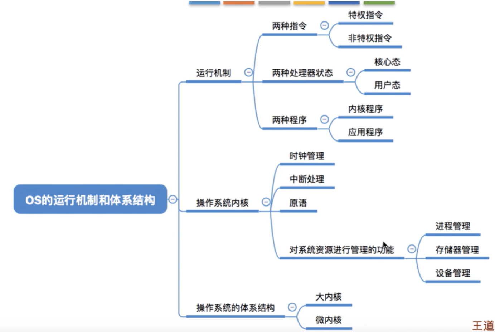

### 1. 基本特征 

1.  并发

并发是在一段时间内能同时与运行多个程序，而并行则指同一时刻能运行多个指令。

并行需要硬件支持，而并发是通过引入线程和进程来实现的。

2.  共享

共享值得是系统中的资源可以被多个并发进程共同使用，互斥共享（同步机制实现互斥访问）和同时共享。

3.  虚拟

虚拟技术把一个物理实体转化为多个逻辑实体。时分复用技术和空分复用技术。

并发使用了时分复用技术，每次只执行一个小时间片并快速切换；

虚拟内容用到了空分复用技术，物理内存抽象为地址空间。当使用到一个没有在物理内存的页时，执行页面置换算法，将页置换到内存中。

4.  **异步**

异步指的是进程不是一次性执行完毕，以不可知的速度向前推进

### 2. 基本功能

1.  进程管理

进程控制，进程同步，进程通信，死锁处理，处理机调度

2.  内存管理

内存分配，地址映射，内存保护与共享，虚拟内存

3.  文件管理

文件存储空间的管理，目录管理，文件读写管理和保护

4.  **设备管理**

完成用户的I/O请求，方便用户使用各种设备。

包括缓冲管理，设备分配，设备处理，虚拟设备

### 3. 系统调用

如果一个进程在用户态需要使用内核态的功能，就需要进行系统调用而陷入内核，由操作系统代为完成。

用户态和内核态的分析：https://blog.csdn.net/qq_39823627/article/details/78736650

### 4. 宏内核和微内核

1.  宏内核是将操作系统作为一个紧密整体放到内核，各个模块信息共享，高性能。
2.  微内核，操作系统被划分成小的，定义良好的模块，只有微内核（包括内存管理，CPU调度等）运行在内核态，其余模块均在用户态（文件系统）。需要频繁通信，存在性能损失。

### 5. 中断分类

1.  外部中断，比如I/O中断
2.  异常，非法操作码，地址越界等
3.  陷入，在用户程序中使用系统调用

