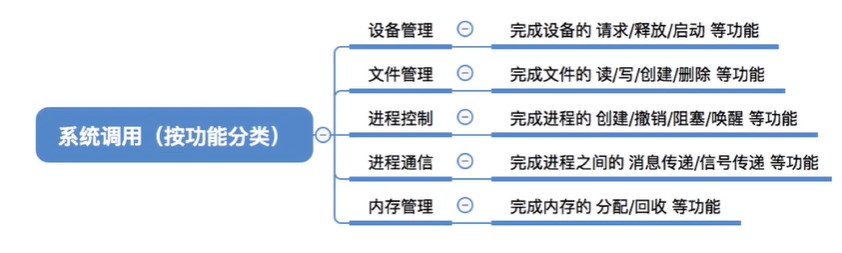
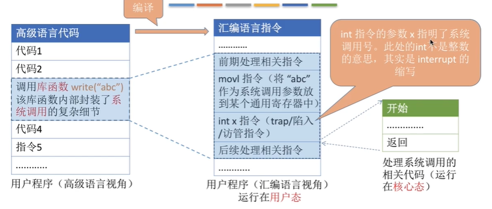

 ## 系统调用

#### 1.1 系统调用

系统调用是操作系统提供给应用程序使用的接口，可以理解为一种可供程序调用的特殊函数，应用程序可以发出系统调用请求来获得操作系统的服务。

应用程序通过**系统调用**请求操作系统的服务，系统中的各种共享资源由操作系统同意管理，这样可以保证系统的**稳定性和安全性，防止用户非法操作**。**需要在核心态下调用。**

#### 1.2 系统调用和函数的区别

系统调用是操作系统向上提供的功能。

库函数是编程语言对外部使用者提供的功能。`int`代表`interrupt`

陷入指令（int，包含后面所用的参数）是唯一一个只能在用户态下运行却不能在核心态下运行的指令。

