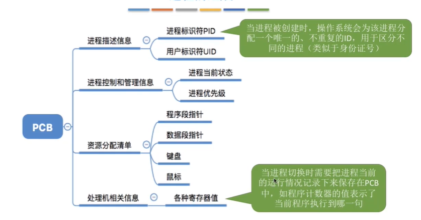
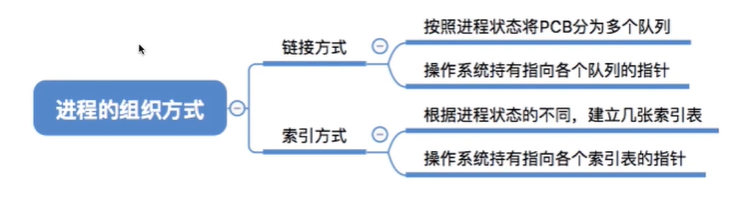
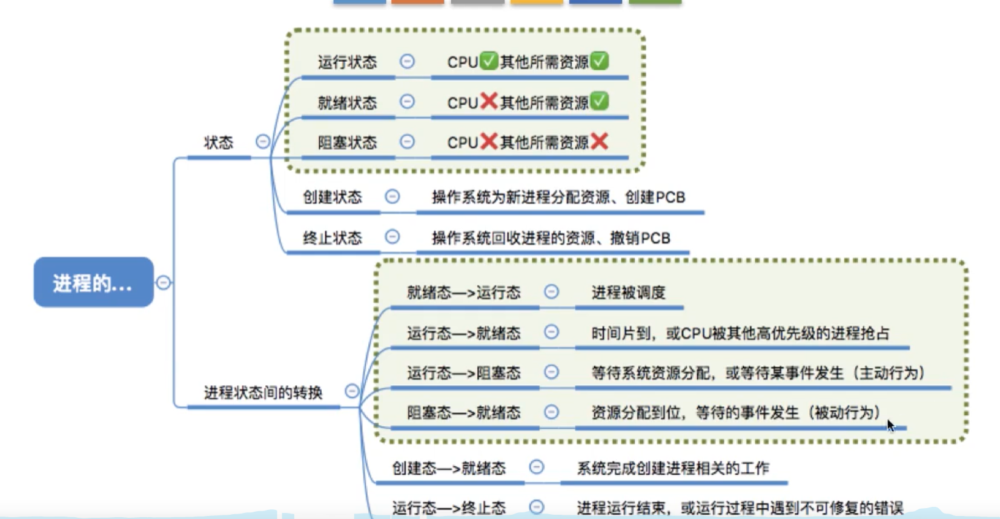
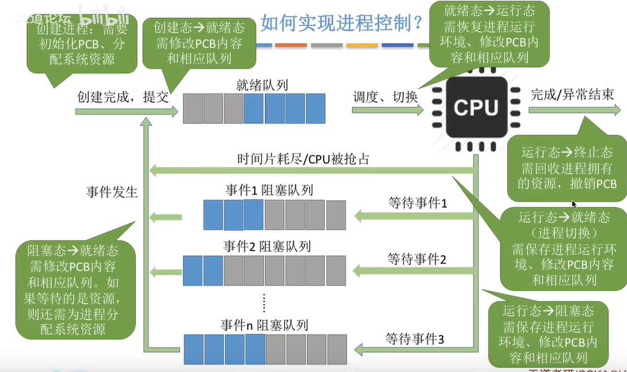
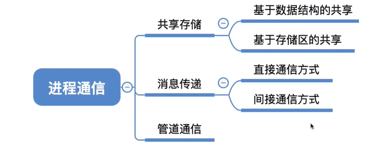
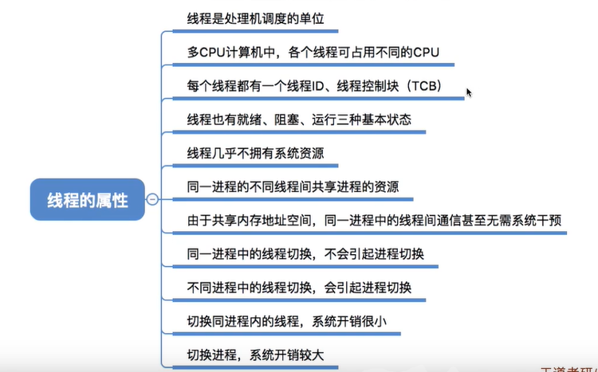
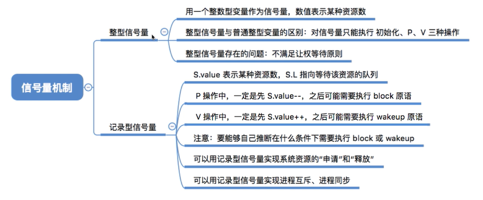
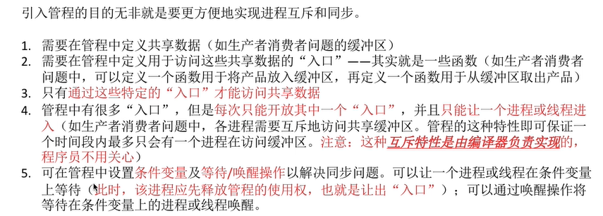

## 1. 进程

#### 1. 什么是进程

程序就是一个指令序列。

为了方便操作系统管理，完成各程序的变法执行，引入了进程、进程实体的概念。

**PCB、程序段、数据段**三部分构成了进程实体。PCB是进程的唯一标志。

+   进程的定义（强调动态性）：
    +   进程是程序的一次执行过程
    +   进程是一个程序及其数据在处机上顺序执行所发生的活动
    +   进程是具有独立功能的程序在数据集合上运行的过程，它是系统进行资源分配的一个独立单位。

+   程序段

    +   程序代码就放在这里

+ 数据段
    +   程序运行时使用、产生的运算数据就存放在数据段
    
+   PCB

    +   包含操作系统对进程管理的信息

    

#### 1.2 进程的组织方式

+   链接方式（链表）
+   索引方式（索引表）



#### 1.3 进程的状态


+   创建态
+   就绪态
+   运行态
+   阻塞态
+   结束态




#### 1.4 进程的控制



为了保证进程的安全，采用了原子操作：（1）关中断指令 （2）开中断指令

#### 1.5 进程的通信



+   共享存储 （多个进程对共享空间的访问必须是互斥的）
+   消息传递（消息缓冲队列）
+   管道通信 （半双工，同一时间段内只能单向通信，对管道的访问是互斥的）


## 2. 线程

#### 2.1 线程的定义

线程可以认为是轻量级进程。



#### 2.2 线程的实现方式

+   用户级线程 （用户能够看得见）

+   内核级线程 （操作系统看得见）


#### 2.3 多线程模型

+   多对一模型
+   一对多模型
+   多对多模型


#### 2.3 进程的同步与互斥

+   进程互斥

    我们把一个时间段内只运行一个进程使用的资源称为**临界资源**，许多物理设备都属于临界资源。

    ```c++
    do{
        entry section;      // 进入区，检查并上锁
        critical section;   // 临界区，访问资源
        exit section;       // 退出区，退出并解锁
        remainder section;  // 剩余区，其余代码
    }
    ```

+   遵守的原则

    +   空闲让进
    +   忙则等待
    +   有限等待
    +   让权等待

#### 2.4 进程互斥的软件实现方法

+   单标志法

+   双标志法先检查法

+   双标志法后检查法

+   Peterson算法 （先说自己想用，然后查看对方是否想用，双方都尝试孔融让梨）

    

#### 2.5 信号量机制



用户进程可以通过操作系统提供的一对原语来对信号量操作，从而方便地实现进程互斥、进程同步。

信号量就是一个变量，也可以是更复杂地记录型变量，可以用一个信号量来表示系统中某种资源的数量。

wait、signal原语简称为P、V操作（来自荷兰语）

+   整型信号量

    用一个整数型变量作为信号量，用来表示系统中某种资源的数量。

    ```c++
    void wait() {
        while (S <= 0);
        S -= 1;
    }
    
    void signla(int S) {
        S += 1;
    }
    
    // 调用
    wait(S); // 进入区
    // 使用打印机资源, 临界区
    signal(S); // 退出区
    ```

+   记录型信号量

    整型信号量存在忙等问题，因此人们提出记录型信号量。添加一个队列来完成相对应的操作。

    ```c++
    typedef struct {
        int value;
        struct process *L;
    } semaphore;
    ```

    

## 3. 死锁

#### 3.1 管程

类似于java中的 `Synchronized`



#### 3.2 死锁处理的测录

**死锁的四个条件和预防死锁：**

+   互斥条件（破坏互斥条件，实现共享）
+   不剥夺条件 （进程所获得得资源在未使用之前，不能由其他进程强行夺走，只能主动释放）
+   请求和保持条件（进程在运行前一次性申请完全部资源）
+   循环等待条件（顺序资源分配法，首先给系统中得资源编号，每个进程必须按照编号递增顺序请求资源）


**避免死锁：**


**检测和解除：**

