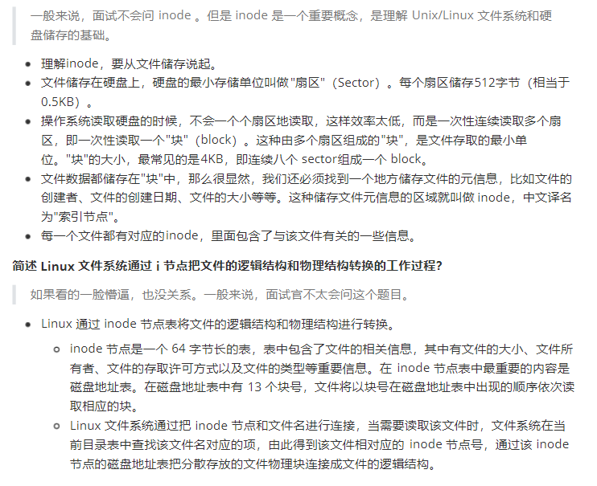

inode：称为文件索引节点，是`文件基本信息的存放地`和`数据块指针存放地`。


#### proc文件夹

虚拟文件目录，是系统内存的映射，可以直接访问这个目录来获取系统信息。

#### 什么是inode

+   索引节点：inode用来记录文件的元信息，比如inode编号、文件大小、访问权限、创建时间、修改时间等，inode是文件的唯一表示，他们之间一一对应。
+   目录项，用来记录文件的名字、索引节点指针以及与其他目录项的层级关联关系。索引节点唯一表示一个文件，而目录项记录着文件的别名，所以目录项和索引节点的关系是多对一，也就是说一个文件可以有多个别字。

```python
# 扇区 ---> 块（8个扇区） ---> 索引节点（存放文件的s）
```



