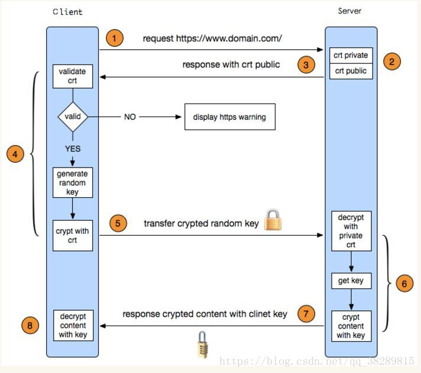

#### http协议

http协议是超文本传输协议的缩写，是一种基于TCP/IP协议来传输数据的协议，一般用于Browser/Server架构。

其中早期的http1.0是短链接（限制每次连接只处理一个请求，不利于保持会话，引入Cookie和Session），后续的http1.1是面向长连接的，每次建立的链接都会`keep-alive`；常用的方法包括：POST，GET，HEAD等。

#### 一次完整的web页面请求

+   首先从浏览器获取url链接
+   浏览器查找缓存
+   通过DNS获取url的IP地址
+   建立TCP链接
+   浏览器向web发送请求: GET /index.html
+   可选（根据https还是http，选择是否进行证书验证），这个可以参考下一节的https
+   服务器返回数据

#### https 就是http+ssl/tls (Secure Socket Layer/ Transport Layer Security)

#### 响应状态码

+   200 客户端请求成功
+   301资源重定向，被永久移到指定url
+   302临时性重定向，临时分配了url，后续仍然可能会改动
+   403 权限不足，拒绝访问
+   404 资源查找不到
+   500 服务器发生错误
+   502 网关发生错误

#### HTTPS常用的签名算法

+   加密与签名的区别，加密（AES，RSA）防止信息泄露，签名（MD5、SHA-1、SHA-256）是为了防止串改和伪造
+   对称加密（AES）、非对称加密（RSA）、摘要算法（MD5）
+   证书与CA机构

#### HTTP协议中的幂等性

幂等的 HTTP 方法，同样的请求被执行一次与连续执行多次的效果是一样的，服务器的状态也是一样的。换句话说就是，幂等方法不应该具有副作用（统计用途除外）。

在正确实现的条件下，GET，HEAD，PUT 和 DELETE 等方法都是幂等的，而 POST 方法不是。

#### 数字签名和数字证书 [数字签名](http://www.ruanyifeng.com/blog/2011/08/what_is_a_digital_signature.html)

#### http1.0 http1.1以及http2.0的差异

#### MD5、SHA-1、SHA-256比较

