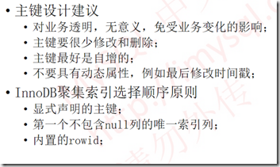

[TOC]

## 1. 存储引擎篇

#### 1.1 MyISAM和InnoDB存储引擎差异

1.  InnoDB支持事务，MyISAM不支持事务
2.  InnoDB是聚集索引，采用B+树索引，数据和索引存放在一起；MyISAM是非聚集索引，数据和索引分开。
3.  InnoDB支持行锁，粒度更小；MyISAM只支持表锁，不适应高并发。
4.  InnoDB支持崩溃恢复，利用`redo.log`实现；MyISAM不支持。
5.  InnoDB支持外键，MyISAM不支持外键
6.  InnoDB不保存行数，MyISAM保存行数


#### 1.2 undo.log、redo.log 以及 bin.log

+   redolog是持久化在磁盘上的日志文件，记录的是对物理磁盘上数据的修改。
+   undo log用来实现事务的原子性，在innnodb引擎中还用来实现事务的多版本并发控制
+   binlog是server层的日志，主要做mysql功能层的事情


#### 1.3 主从复制

+   原理：

    数据库中有个bin-log二进制文件，记录了所有的sql语句，从数据库所进行的工作就是在从数据库中再执行一遍即可。

    整体围绕三个线程展开：

    1.  主库的I/O线程，输出bin-log信息。
    2.  从库的I/O线程，库I/O线程读取主库的binlog输出线程发送的更新并拷贝这些更新到本地文件，其中包括relay log(中继日志)文件。
    3.  从库的SQL线程，这个线程读取从库I/O线程写到relay log的更新事件并执行。

## 2. 索引篇

#### 2.1 讲一讲聚集索引和非聚集索引

+   概念上

    **首先索引是一种数据接口，可以帮助我们查到数据库中的数据。**

    +   聚集索引表示数据行存储的物理位置和列值的逻辑顺序相同，只能有一个。
    +   非聚集索引表示索引的逻辑顺序和磁盘上的物理存储顺序不同，可以有多个。

+   原理上
    +   MySQL对于索引采用B+树实现，B+树是一种多路查找平衡树，他的叶子结点是通过链表串联在一起的，在区间查询中找到边界后就可以沿着链表进行查找，避免了**全表扫描**问题。
    +   聚集索引为了保证有序性，在每次插入数据时都需要调整B+树，聚集索引插入数据速度慢。


#### 2.2 回表查询和覆盖索引？

+   **回表查询：**针对 `InnoDB` 进行讨论，主键索引叶节点存放的是行记录，普通索引叶节点存放的是主键ID。在利用普通索引进行查询的时候，先找到主键ID，然后在主键索引中查找行记录。这就称为回表查询。

+   **覆盖索引：** 将被被查询的字段，建立到**联合索引**中。
比如对于一个数据表`(id,name,sex)`，`id`有主键，`name`有普通索引；那么`select (id,name)`可以直接命中，而`select (id,name,sex)`则不行。这时候，我们需要建立一个联合索引`(name,sex)`，就可以直接命中了。


#### 2.3 解释一下最左匹配规则

+   就是将最常用、筛选数据最多的字段放在左侧。比如对于 `(A,B,C)` 这样的数据，先匹配`A`，再匹配`B`，最后匹配`C`。
+   联合索引什么时候失效，关键点：画出数据结构（B+树，中间节点的结构）；判断查找规则是否满足二分查找的规律。


#### 2.4 插入数据的时机

有两种因素会影响最终结果：一个是索引的个数，一个是数据量的大小。
如果索引多、数据量大，那一定是先插入数据，后建立索引。


## 3. 事务篇

#### 3.1 讲讲事务吧

事务就是逻辑上的一组操作，要么全部执行，要么都不执行；有ACID四个特性。
**原子性：**主要依靠undo.log实现，事务要全部成功执行，要么失败回滚。
**一致性：**事务在执行前后数据库的状态都是一致的。
**隔离性：**多线程多事务之间相互作用产生了影响，为了避免这种影响，那就加锁。mysql中有行锁、表锁、间隙锁等等。**写写操作通过加锁实现隔离性**，**写读操作通过MVCC实现**。
**持久性：**通过redo.log实现。mysql持久化通过缓存提高效率，在select时，先查缓存、再查磁盘；再update的时候，先更新缓冲，再更新磁盘。但是缓存是易失去的，所以需要redo.log日志，在执行修改操作时，sql先回写入到redo.log，再写入缓存中，即使断电，也可以通过redo.log来保证数据不丢失。

#### 3.2 讲讲隔离级别吧


**脏读：**事务A读取了事务B更新的数据，然后B回滚操作，那么A读取到的数据是脏数据
**不可重复读：**事务 A 多次读取同一数据，事务 B 在事务A多次读取的过程中，对数据作了更新并提交，导致事务A多次读取同一数据时，结果 不一致。
**幻读：**系统管理员A将数据库中所有学生的成绩从具体分数改为ABCDE等级，但是系统管理员B就在这个时候插入了一条具体分数的记录，当系统管理员A改结束后发现还有一条记录没有改过来，就好像发生了幻觉一样，这就叫幻读。
**不可重复读侧重于修改**，**幻读侧重于新增或删除**。解决不可重复读的问题只需锁住满足条件的行，解决幻读需要锁表
**注意：**`Mysql`的`InnoDB`引擎，**REPEATABLE-READ已经可以避免幻读现象**，主要利用`行锁`和`间隙锁`联合构建成`next-key锁` 

## 4. 锁篇 [🔗](https://www.cnblogs.com/crazylqy/p/7611069.html)

#### 4.1 MVCC 多版本并发控制

MVCC实现了`并发读写的隔离性`，MVCC在读取数据时，根据`readview`和`版本链`，进行可见性判断。

+   版本链

    

    undo.log通过两个隐藏字段：`roll_pointer`和`trx_id`形成一条版本连。

+   readview中四个基本概念：
    +   m_ids表示在生产read_view时候，当前系统中活跃的读写事务id列表
    +   min_trx_id表示在生产read_view时，当前系统中活跃的读写事务中最小的事务id，也就是m_ids中最小的值
    +   max_trx_id表示在生产read_view时候，系统中活跃的读写事务中最大的事务id，也就是m_ids中最大的值
    +   creator_trx_id：表示生成该readview的事务的事务id；

    有了readview，在访问某条记录时：

    +   如果被访问版本的trx_id，与read_view的creator_trx_id值相同，表明当前事务在访问自己修改的记录，则该版本可见。

    +   如果被访问版本的trx_id，小于read_view中min_trx_id值，表明生成该版本的事务在当前事务生产的readview前已经提交，该版本可以被当前事务访问。

    +   如果被访问版本的trx_id，大于或等于read_view或中的max_trx_id，表明生成该版本的事务在当前事务生成的read_view之后才开启，该版本不可访问。

    +   如果访问版本的trx_id，值在的readview的min_trx_id和max_trx_id之间，就需要判断trx_id属性是不是在m_ids列表中

        +   如果在，说明创建read_view时，生成该版本的事务还是活跃的，该版本不可访问。
        +   如果不在，说明创建read_view时，生成该版本的事务是已经被提交，该版本可以访问。


#### 4.2 Mysql 有哪些锁


**意向锁：**
事务A锁住了表中的一行，让这一行只能读，不能写。之后，事务B申请整个表的写锁。如果事务B申请成功，那么理论上它就能修改表中的任意一行，这与A持有的行锁是冲突的。为了解决这个问题，引入了意向锁，申请意向锁的动作是数据库完成的，就是说，事务A申请一行的行锁的时候，数据库会自动先开始申请表的意向锁，不需要我们程序员使用代码来申请。

**更新锁：**
更新锁在的初始化阶段用来锁定可能要被修改的资源，这可以避免使用共享锁造成的死锁现象。例如，对于以下的update语句：`UPDATE accounts SET balance=900 WHERE id=1`。
更新操作需要分两步：先读取，再更新。
如果在第一步使用共享锁（读锁），再第二步把锁升级为独占锁（写锁），就可能出现死锁现象。例如：两个事务都获取了同一数据资源的共享锁，然后都要把锁升级为独占锁，但需要等待另一个事务解除共享锁才能升级为独占锁，这就造成了死锁。而更新锁解决了这种问题。


#### 4.3 讲讲记录锁、间隙锁和Next-key锁

**注意：InnoDB锁是针对索引的，而不是记录本身；如果一条sql没有走索引的话，会对整个表加上锁。**

InnoDB有三种行锁算法：

1. Record Lock: 单个记录上的锁,防止不可重复读。
2. Gap Lock：间隙锁，锁定一个范围，防止幻读。
3. Next-key Lock：1+2，锁定一个范围，并且锁定记录本身，防止幻读和不可重复读。

间隙锁的目的是为了防止幻读，其主要通过两个方面实现这个目的：
（1）防止间隙内有新数据被插入。
（2）防止已存在的数据，更新成间隙内的数（例如防止numer=3的记录通过update变成number=5）


#### 4.4 讲讲Mysql死锁

所谓死锁：是指两个或两个以上的进程在执行过程中,因争夺资源而造成的一种互相等待的现象,若无外力作用，它们都将无法推进下去.此时称系统处于死锁状态或系统产生了死锁，这些永远在互相等待的进程称为死锁进程。表级锁不会产生死锁.所以解决死锁主要还是针对于最常用的InnoDB。 

如何解决死锁：
1、设计超时策略
2、开始死锁检测

表级锁：开销小，加锁快；不会出现死锁；锁定粒度大，发生锁冲突的概率最高,并发度最低。
行级锁：开销大，加锁慢；会出现死锁；锁定粒度最小，发生锁冲突的概率最低,并发度也最高。
页面锁：开销和加锁时间界于表锁和行锁之间；会出现死锁；锁定粒度界于表锁和行锁之间，并发度一般 （BerkeleyDB）

## 5. 语言篇

#### 5.1 查询语句不同元素（where、jion、limit、group by、having等等）执行先后顺序？

人：

```mysql
SELECT
	<select_list>
FROM 
	<left_table> <join_type> JOIN <right_table> ON <join_condition>
WHERE
	<where_condition>
GROUP BY
	<group_by_list>
HAVING 
	<having_condition>
ORDER BY
	<order_by_condition>
LIMIT
	<offset>, <row count>
```

机器：


总结：


#### 5.2 聚合 Group

语法：

```sql
select t.sex, count(t.id) as cnt group by sex having cnt>2
select 查询字段, 聚合字段 group by 分组字段
```

查询中有三种字段：
	查询字段：在select中出现的表中的字段
	聚合字段：对表中的字段施加了聚合函数后形成的字段
	分组字段：group by后的字段


#### 5.3 多表查询 Join

join本质上就是对笛卡尔积的一个后处理，mysql中如果不指定on的字段，那么得到的就是笛卡尔积。

```mysql
select * from  writers as p inner join  books as q;
-- 或者
select * from  writers as p join  books as q;
```

当加上一些字段，改变一些聚合的方式，就是在对数据的一个过滤和筛选。

```mysql
select * from writers as p inner join books as q on p.author = q.author;
```

左外连接和右外连接就是当前表为基准，如果匹配成功则添加数据；否则，补充为null。

```mysql
select * from writers as p left join  books as q on p.author=q.author;
```

全连接需要利用full join（mysql中利用union）实现：

```mysql
(select * from  writers as p left join books as q on p.author=q.author)
union
(select * from writers as p right join books as q on p.author=q.author);
```


#### 5.4 having 和 where的区别

与`where`不同的是`having`在`group`后进行进行过滤，`where`在`group`前进行过滤其写在`group`关键字前，`having`后过滤的字段可以是分组字段或聚合字段。除此之外，where和group也存在以下区别：

+   一般情况下，WHERE 用于过滤数据行，而 HAVING 用于过滤分组。
+   WHERE 查询条件中不可以使用聚合函数，而 HAVING 查询条件中可以使用聚合函数。
+   WHERE 针对数据库文件进行过滤，而 HAVING 针对查询结果进行过滤。也就是说，**WHERE 根据数据表中的字段直接进行过滤，而 HAVING 是根据前面已经查询出的字段进行过滤。**
+   WHERE 查询条件中不可以使用字段别名，而 HAVING 查询条件中可以使用字段别名。

```mysql
select sex,age,GROUP_CONCAT(name),count(*) as "人员数量" from students group by sex,age HAVING age <= 22;

# 1. 在Having条件中使用聚合函数
select sex,age,GROUP_CONCAT(name),count(*) as "人员数量" from students group by sex,age HAVING count(*) >= 2;
```


#### 5.5 varchar和char的使用场景？

+   最大长度不同，char是一种固定长度的类型，varchar则是一种可变长度的类型（varchar需要一个长度来记录数据的长度）。
+   尾部空格是否保留不同，char不保留，varchar保留。
+   char长度固定， 即每条数据占用等长字节空间；适合用在身份证号码、手机号码等定。
+   varchar可变长度，可以设置最大长度；适合用在长度可变的属性。
+   text不设置长度， 当不知道属性的最大长度时，适合用text。
+   区分字节和字符


#### 5.6 DROP，DELETE，TRUNCATE 三种之间的关系

+   三个内容：内容、定义和空间、

+   执行速度：`drop-->delete-->truncate`
+   DROP 会删除内容和定义，**释放空间**。表结构和数据一同删除。
+   TRUNCATE 删除内容，**释放空间**，但不删除定义
+   DELETE 删除内容，不删除定义，也不**释放空间**


#### 5.7 Select 如何加锁

>    `select *** lock in share mode ` 和 `select *** for update` 

(1)`select * from table where num = 200`
不加任何锁，是快照读。
(2)`select * from table where num > 200`
不加任何锁，是快照读。
(3)`select * from table where num = 200 lock in share mode`
当num = 200，有两条记录。这两条记录对应的pId=2，7，因此在pId=2，7的聚簇索引上加行级S锁，采用当前读。
(4)`select * from table where num > 200 lock in share mode`
当num > 200，有一条记录。这条记录对应的pId=3，因此在pId=3的聚簇索引上加上行级S锁，采用当前读。
(5)`select * from table where num = 200 for update`
当num = 200，有两条记录。这两条记录对应的pId=2，7，因此在pId=2，7的聚簇索引上加行级X锁，采用当前读。
(6)`select * from table where num > 200 for update`
当num > 200，有一条记录。这条记录对应的pId=3，因此在pId=3的聚簇索引上加上行级X锁，采用当前读。


#### 5.8 数据库三范式

+   一范式：数据表的每一列都要保持它的原子特性，也就是列不能再被分割。
+   二范式：属性必须完全依赖于主键。
+   三范式：所有的非主属性不依赖于其他的非主属性


#### 5.9 MySql表设计需要注意什么？

[mysql设计表时注意事项](https://www.cnblogs.com/zhangwuji/p/8110916.html)

+   首先在表设计上，满足数据库三范式。

+   索引

首先设置一个与业务不相关的id做一个整形自增主键。

按照最左匹配原则，建立联合索引时尽可能将过滤性好的字段靠前。




+   注意事项

尽量不要使用`default null`，第一会导致索引失效；第二会造成默认的bug，比如count聚合函数时。

#### 5.10 Mysql 子查询的类型

把 `一个查询的结果` 在 `另一个查询中使用` 就叫做子查询。如果你想要使用一个表中的数据逐个和另一个表中的数据比较，这个时候可以使用相关子查询，就相当于二重for循环。

+   相关子查询

    >   ***相关子查询被用来做逐行的处理，子查询会为外部查询出来的每一行执行内部SQL。***

    1. 外部查询拿到所有行
    2. 内部查询使用外部查询出来的每一行来执行自己逻辑
    3. 内部查询有结果返回则当前外部行被保留最终返回否则继续执行下一行

```mysql
# 相当于双重循环，子查询需要未外部查询返回的每一行执行一次
SELECT * FROM t1
WHERE column1 IN (
    SELECT column1 FROM t2
    WHERE t2.column2 = t1.column2);
```

+   嵌套子查询

```mysql
SELECT * FROM t1
WHERE column1 IN (SELECT column1 FROM t2);
```

+   相关子查询和嵌套查询的区别
    +   执行顺序：相关子查询是由外部查询驱动内部查询。 而正常的嵌套查询中，内部查询首先被立即执行，返回的值被外部查询使用并执行外部查询。
    +   依赖性：相关子查询内部查询依赖于外部查询进行处理，而在嵌套查询中外部查询依赖于内部查询。
    +   性能：使用相关子查询会使性能降低，因为它执行的次数远远大于嵌套查询的次数

    `相关子查询`和`普通子查询`（也叫`非相关子查询`）的差别就在于这子查询中是否有对外部查询中涉及到的表的引用。


## 6 MySql架构

#### 6.1 MySql逻辑结构


+   **基本组件**
    +   Buffer Pool 是 MySQL 的一个非常重要的组件，因为针对数据库的增删改操作都是在 Buffer Pool 中完成的
    +   undo log 记录的是数据操作前的样子
    +   redo log 记录的是数据被操作后的样子（redo log 是 Innodb 存储引擎特有）
    +   bin log 记录的是整个操作记录（这个对于主从复制具有非常重要的意义）

+   **从准备更新一条数据到事务的提交的流程描述**

    1.首先执行器根据 MySQL 的执行计划来查询数据，先是从缓存池中查询数据，如果没有就会去数据库中查询，如果查询到了就将其放到缓存池中

    2.在数据被缓存到缓存池的同时，会写入 undo log 日志文件

    3.更新的动作是在 BufferPool 中完成的，同时会将更新后的数据添加到 redo log buffer 中

    4.完成以后就可以提交事务，在提交的同时会做以下三件事

    5.（第一件事）将redo log buffer中的数据刷入到redo log文件中

    6.（第二件事）将本次操作记录写入到 bin log文件中

    7.（第三件事）将bin log文件名字和更新内容在 bin log 中的位置记录到redo log中，同时在 redo log 最后添加 commit 标记至此表示整个更新事务已经完成

#### 6.2 执行顺序

1.  innodb存储引擎会在缓冲池中查找 `name=zhangsan` 数据是否存在，如果不存在，就回去磁盘中加载，并将其放到缓冲池中
2.  将当前数据写入到`undo.log`日志中，便于回滚
3.  基于当前的`sql`语句，对缓冲池中的数据进行操作
4.  将`sql`中的新操作写入到`redo log buffer`中
5.  同步将`redo log buffer`刷新到磁盘中
6.  将`sql`中的新操作，写入到`bin.log`日志中
7.  保证`redo.log`和`bin.log`一致性
8.  将缓冲池中数据写入磁盘文件


#### 6.3 MySql 数据结构

+   红黑树

缺点：本质是一个平衡二叉树，不论怎么调整，`树依然非常高`。

+   B-树

优点：本质是多路查找树，极大了降低了树的高度。

缺点：所有的树节点都存放了实际的数据，在进行范围查找时，需要递归返回，效率低。

+   B+树

优点：叶子节点采用链表链接在一起。


#### 6.4 存储结构

MyISAM包含的文件内容：`frm`、`MYI`和`MYD`文件，数据和索引分别查询。

InnoDB包含的文件内容：`frm`和`idb[包含数据和索引]`文件，数据和索引放在一起。

+   聚集索引

    数据和索引存放在一起，**数据必须用B+树来组织**。一般建议主键递增，否则需要进行节点调整，**耗时**。

+ 非聚集索引

  叶子存放的是主键的ID值。
  
+   `联合索引`的底层存储结构

    引伸出：回表查询和最佳左前缀原则。

    


#### 6.5 Buffer Pool

>   数据页

MySql将`每一页page`作为叶子节点，每个页的默认大小为16KB。


>   缓存池

free链表 + flush链表 + lru链表

+ free list：表示空闲缓冲区，管理free page；free 链表表示的是Buffer Pool中的空闲区域

+ flush list：表示需要刷新到磁盘的缓冲区，管理dirty page，内部page按修改时间排序。脏页即存在于flush链表，也在LRU链表中，但是两种互不影响，LRU链表负责管理page的可用性和释放，而flush链表负责管理脏页的刷盘操作。

+ lru list：表示正在使用的缓冲区，管理clean page和dirty page，缓冲区以
  midpoint为基点，前面链表称为new列表区，存放经常访问的数据，占63%；后
  面的链表称为old列表区，存放使用较少数据，占37%。（分为热数据区域和冷数据区域）

+ **innodb_buffer_pool_size**设置缓冲区域的大小，instance设置buffer pool的数量

  ```ini
  [server] 
  innodb_buffer_pool_size = 8589934592 
  innodb_buffer_pool_instances = 4
  # 上面利用参数 innodb_buffer_pool_size 来设置 Buffer Pool 的总大小为 8G，利用参数 
  # innodb_buffer_pool_instances 来设置一共有 4个 Buffer Pool 实例。
  # 那么就是说，MySQL 一共有 4个 Buffer Pool ，每个的大小为 2G。
  ```

  


## 7. 性能调优篇

#### 7.1 讲讲Mysql优化吧

**为什么慢：**

+   查询语句烂，过多子查询和join查询【产生过多的临时表】
+   索引失效：单值和符合
+   服务器调优（缓冲、线程数等）

**Mysql优化主要分为四个部分：**

+   数据库设计：存储引擎、字段类型等

+   功能上：是否采用索引、分区分表等

+   架构上：是否主从复制、读写分离

+   SQL本身的语言上：

    +   1.  SQL语句优化

        +   使用limit对查询结果进行限定
        +   避免使用select *
        +   差分大的delete语句

    +   2.  选择合适的索引列

        +   查询频繁的列，作为索引列
        +   离散度大的列放到联合索引的前面
        +   长度小的列、索引字段越小越好

    +   3.  Explain查询SQL执行计划

        +   TODO

    +   4.  PROCEDURE ANALYSE取得建议

    +   5.  开启慢查询检测

拒绝三大类型SQL：大SQL；大事务；大批量。


#### 7.2 讲讲Explain关键字吧

>   Explain能干吗？


+   Mysql会输出10列数据，如下：

    ```markdown
    +----+-------------+-------+-------+-------------------+---------+---------+-------+------+-------+
    | id | select_type | table | type  | possible_keys     | key     | key_len | ref   | rows | Extra |
    +----+-------------+-------+-------+-------------------+---------+---------+-------+------+-------+
    ```

+   **id** 确认的是 表的读取顺序

    id数字越大，越先执行。

+   **select_type**就是select类型

    +   SIMPLE，简单SELECT

        ```mysql
        mysql> explain select * from t3 where id=3952602;
        +----+-------------+-------+-------+-------------------+---------+---------+-------+------+-------+
        | id | select_type | table | type  | possible_keys     | key     | key_len | ref   | rows | Extra |
        +----+-------------+-------+-------+-------------------+---------+---------+-------+------+-------+
        |  1 | SIMPLE      | t3    | const | PRIMARY,idx_t3_id | PRIMARY | 4       | const |    1 |       |
        +----+-------------+-------+-------+-------------------+---------+---------+-------+------+-------+
        ```

    +   PRIMARY，最外层查询

        ```mysql
        mysql> explain select * from (select * from account) as a;
        +----+-------------+------------+------+---------------+------+---------+------+------+-------+
        | id | select_type | table      | type | possible_keys | key  | key_len | ref  | rows | Extra |
        +----+-------------+------------+------+---------------+------+---------+------+------+-------+
        |  1 | PRIMARY     | <derived2> | ALL  | NULL          | NULL | NULL    | NULL |    3 | NULL  |
        |  2 | DERIVED     | account    | ALL  | NULL          | NULL | NULL    | NULL |    3 | NULL  |
        +----+-------------+------------+------+---------------+------+---------+------+------+-------+
        ```

    +   UNION，UNION中的第二个或后面的SELECT语句

    +   DEPENDENT UNION，UNION中的第二个或后面的SELECT语句，取决于外面的查询

    +   SUBQUERY，子查询中的第一个SELECT.

    +   DERIVED，派生表的SELECT(FROM子句的子查询)

+   **table**显示这一行的数据是关于哪张表的

    ```mysql
    mysql> explain select * from (select * from account) as a;
    +----+-------------+------------+------+---------------+------+---------+------+------+-------+
    | id | select_type | table      | type | possible_keys | key  | key_len | ref  | rows | Extra |
    +----+-------------+------------+------+---------------+------+---------+------+------+-------+
    |  1 | PRIMARY     | <derived2> | ALL  | NULL          | NULL | NULL    | NULL |    3 | NULL  |
    |  2 | DERIVED     | account    | ALL  | NULL          | NULL | NULL    | NULL |    3 | NULL  |
    +----+-------------+------------+------+---------------+------+---------+------+------+-------+
    ```

+   **type**显示了查询使用了那种类别，有无使用索引，从最好到最差的连接类型为const、eq_reg、ref、range、index和

    常用的类型有： **ALL、index、range、 ref、eq_ref、const、system、NULL（从左到右，性能从差到好）**

    ALL：Full Table Scan， MySQL将遍历全表以找到匹配的行

    index: Full Index Scan，index与ALL区别为index类型只遍历索引树

    range:只检索给定范围的行，使用一个索引来选择行

    ref: 表示上述表的连接匹配条件，即哪些列或常量被用于查找索引列上的值

    eq_ref: 类似ref，区别就在使用的索引是唯一索引，对于每个索引键值，表中只有一条记录匹配，简单来说，就是多表连接中使用primary key或者 unique key作为关联条件

    const、system: 当MySQL对查询某部分进行优化，并转换为一个常量时，使用这些类型访问。如将主键置于where列表中，MySQL就能将该查询转换为一个常量，system是const类型的特例，当查询的表只有一行的情况下，使用system

    NULL: MySQL在优化过程中分解语句，执行时甚至不用访问表或索引，例如从一个索引列里选取最小值可以通过单独索引查找完成。

+   **Extra** ，该列包含MySQL解决查询的详细信息

    +   Distinct 一旦MYSQL找到了与行相联合匹配的行，就不再搜索了
    +   Using temporary
    +   Using where
    +   Using index


#### 7.3 面试方向


优化方向：

+   首先分析语句，看看是否load了额外的数据，可能是查询立刻多余的行并且抛弃掉了。

+   分析语句执行计划，获取器使用索引的情况，修改语句或者修改索引，使得语句尽可能命中索引。

+   如果对语句的优化已经无法进行，可以考虑分库分表。

    


什么是临时表，临时表什么时候删除?

一种是create temporary，一种是语句产生的临时表，临时表只对当前用户可见，当前会话结束的时候，该临时表会自动删除。


sql查询语句确定创建哪种类型的索引？如何优化查询？

有哪些锁（乐观锁悲观锁），select 时怎么加排它锁？

非关系型数据库和关系型数据库区别，优势比较？

数据库三范式，根据某个场景设计数据表？

数据库的读写分离、主从复制，主从复制分析的 7 个问题？

使用explain优化sql和索引？

MySQL慢查询怎么解决？

什么是 内连接、外连接、交叉连接、笛卡尔积等？

mysql都有什么锁，死锁判定原理和具体场景，死锁怎么解决？

mysql 高并发环境解决方案？

数据库崩溃时事务的恢复机制（REDO日志和UNDO日志）？


21条MySQL性能调优经验

+   为查询缓存优化你的查询

+   EXPLAIN你的SELECT查询

+   当只要一行数据时使用LIMIT 1

+   为搜索字段建索引

+   在Join表的时候使用相当类型的例，并将其索引

+   千万不要 ORDER BY RAND()

+   避免 SELECT *

+   永远为每张表设置一个 ID

+   使用 ENUM 而不是 VARCHAR

+   从 PROCEDURE ANALYSE() 取得建议

+   尽可能的使用 NOT NULL

+   Prepared Statements

+   无缓冲的查询

+   把 IP 地址存成 UNSIGNED INT

+   固定长度的表会更快

+   垂直分割

+   拆分大的 DELETE 或 INSERT 语句

+   越小的列会越快

+   选择正确的存储引擎

+   使用一个对象关系映射器(Object Relational Mapper)

+   小心永久链接
