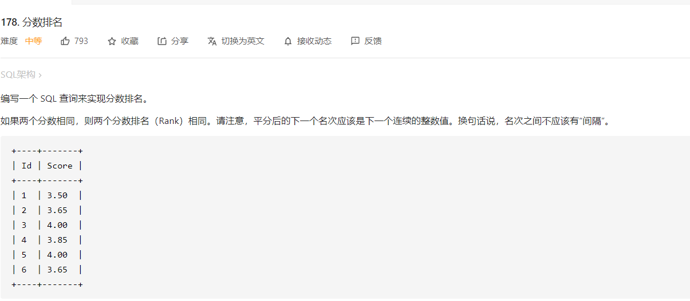
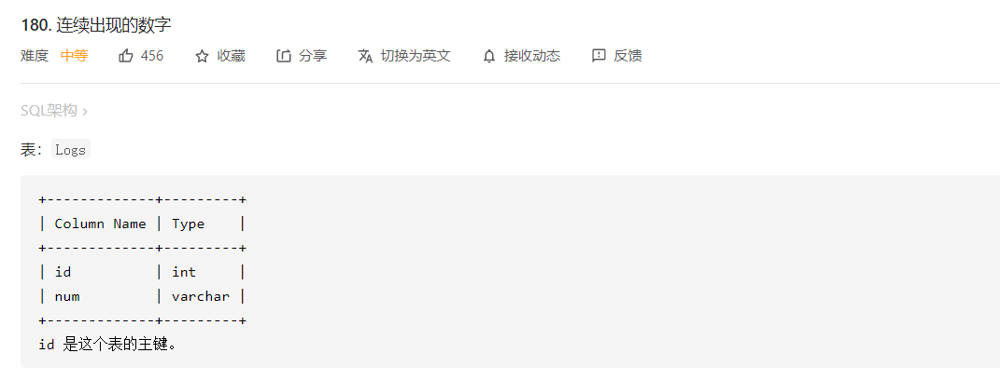
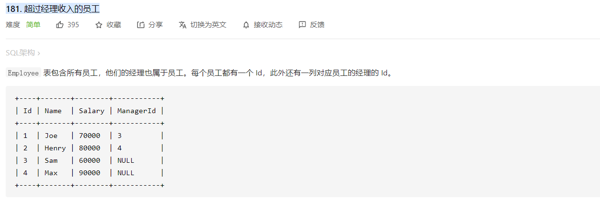
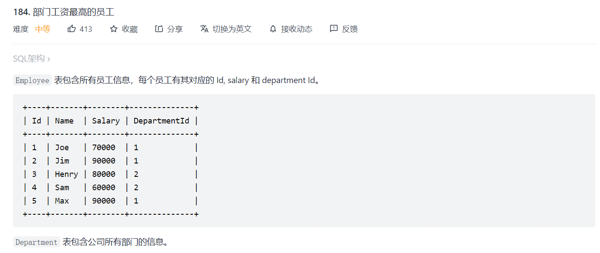

+   [175. 组合两个表](https://leetcode-cn.com/problems/combine-two-tables/)

```mysql
# Write your MySQL query statement below
SELECT p.FirstName as FirstName,p.LastName as LastName,a.City as City,a.State as State
FROM Person as p left join Address as a 
ON p.PersonId = a.PersonId;
```

+   [177. 第N高的薪水](https://leetcode-cn.com/problems/nth-highest-salary/)

```mysql
CREATE FUNCTION getNthHighestSalary(N INT) RETURNS INT
BEGIN
  set N=N-1;
  RETURN (
      # Write your MySQL query statement below.
      SELECT DISTINCT Salary 
      FROM Employee 
      ORDER BY Salary DESC
      LIMIT N,1
  );
END
```

+   178 分数排名

    >   

```mysql
select a.Score as Score, (select count(distinct b.Score) from Scores b where b.Score >= a.Score) as `Rank` from Scores a order by a.Score DESC;
```

+   180 连续出现的数字

    >   

```mysql
SELECT DISTINCT
    l1.Num AS ConsecutiveNums
FROM
    Logs l1,
    Logs l2,
    Logs l3
WHERE
    l1.Id = l2.Id - 1
    AND l2.Id = l3.Id - 1
    AND l1.Num = l2.Num
    AND l2.Num = l3.Num
```

+   CMX-001 删除重复的邮箱

    子查询和临时表的区别，子查询自己会建立临时表，但是子查询查到的结果，不能再外层进行删除操作。

    ```mysql
    explain DELETE FROM Person WHERE Id NOT IN (SELECT * FROM (SELECT max(Id) FROM Person as q GROUP BY Email) tmp);
    ```

+   181 超过经理收入的员工

    >   

```mysql
SELECT t1.Name as `Employee`
FROM Employee as t1,Employee as t2
WHERE t1.ManagerId=t2.Id AND t1.Salary > t2.Salary
```

+   嵌套子查询的分类，子查询也即是嵌套在其他查询中的查询 [🔗](https://blog.csdn.net/m0_38061639/article/details/82872705)

>   第一类

```mysql
SELECT cust_id FROM orders
WHERE order_num
IN (SELECT order_num FROM orderitems WHERE prod_id='TNT2');
```

>   第二类

```mysql
SELECT cust_name, cust_state,(SELECT COUNT(*) FROM orders WHERE orders.cust_id=customers.cust_id)
AS orders1
FROM customers
ORDER BY cust_name;
```

+   184 部门工资最高的员工

>   

```mysql
SELECT 
    d.Name as 'Department',
    e.Name as 'Employee',
    e.Salary as 'Salary'
FROM 
Employee as e Join Department as d ON e.DepartmentId=d.Id
WHERE 
    (e.DepartmentId,e.Salary) in (
        SELECT Employee.DepartmentId,MAX(Employee.Salary)
        FROM Employee 
        GROUP BY DepartmentId 
    )
;
```

+   185 部门工资前三高的所有员工 🍉

    对于分组内取前几名这种问题，可以先用 `group` 进行分组，然后用`having count()` 来筛选

    ```mysql
    SELECT P2.Name AS Department,P3.Name AS Employee,P3.Salary AS Salary
    FROM Employee AS P3 JOIN Department AS P2
    ON P2.Id=P3.DepartmentId 
    WHERE (
        SELECT COUNT(DISTINCT Salary)
        FROM Employee AS P4
        WHERE P3.DepartmentId = P4.DepartmentId
        AND P4.Salary >= P3.Salary
    ) <= 3
    ORDER BY DepartmentId,Salary DESC
    ```

    
