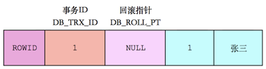

#### 事务的概念

事务是一种机制，一个操作序列，包含了一组数据库操作命令。事务将所有的命令作为一个整体一起向系统提交或撤销操作请求。也就是说这一组命令要么全部执行，要么都不执行，因此事务是一个不可分割的逻辑单元。

在数据库系统上执行并发操作时，**事务是作为最小的控制单元来使用的**，适合面向多用户同时操作的数据库系统。

事务有四个特性：ACID，原子性，一致性，隔离性，持久性。

原子性：事务内的所有数据库操作，要么全部成功执行，要么失败回滚。

一致性：TODO

隔离性：TODO 

持久性：TODO

原子性：主要依靠undo.log日志实现，即在事务失败时执行回滚。undo.log日志会记录事务执行的sql，当事务需要回滚时，通过反向补偿回滚数据库状态

持久性：主要依靠redo.log日志实现。首先，mysql持久化通过缓存来提高效率，即在select时先查缓存，再查磁盘；在update时先更新缓冲，再更新磁盘。以减少磁盘io次数，提高效率。但由于缓存断电就没了，所以需要redo.log日志。在执行修改操作时，sql会先写入到redo.log日志，再写入缓存中。这样即使断电，也能保证数据不丢失，达到持久性

隔离性：我的理解就是多线程时多事务之间互相产生了影响，要避免这个影响，那就加锁。mysql的锁有表锁，行锁，间隙锁,好像还有一个锁数据库的，叫全局锁还是什么来着。写写操作通过加锁实现隔离性，写读操作通过MVCC实现。

一致性：就是事务再执行的前和后数据库的状态都是正常的，表现为没有违反数据完整性，参照完整性和用户自定义完整性等等。而上面三种特性就是为了保证数据库的有一致性

#### Mysql执行事务的语法和流程

Mysql通过提供了两种引擎来支持事务：InnoDB和BDB，其中InnoDB存储引擎事务主要通过undo日志和redo日志实现，Myisam不支持事务。

为了维护Mysql服务器，经常需要在Mysql数据库中进行日志操作：

+   Undo日志：复制事务执行前的数据，用于在事务发生异常时进行回滚。
+   Redo日志：记录在事务执行中，每条sql语句对数据进行更新的操作，当事务提交该内容将被刷新到磁盘中。

#### 事务控制语句

+   事务的开始语句：BEGIN或者START TRANSACTION显式开启一个事务。
+   COMMIT用于提交事务，并使已对数据库进行的所有修改成为永久性操作。
+   ROLLBACK回滚会结束用户的事务，并撤销所有**未提交**的修改。
+   SAVEPOINT identifier，允许在事务中创建一个保存点，一个事务有多个保存点。
+   RELEASE SAVEPOINT identifier，删除一个事务的保存点
+   ROLLBACK TO identifier，回滚到某一个保存点，使用这个语句一定要`SET AUTOCOMMIT=0 禁止自动提交`。
+   SET TANSACTION 用来设置事务的隔离级别。 `set session transaction isolation level repeatable read;`

#### Mysql事务处理的两种方式

1.  用BEGIN，ROLLBACK和COMMIT实现

+   BEGIN 开始一个事务
+   ROLLBACK事务回滚
+   COMMIT事务确认

2.  直接用SET来改变MySQL自动提交模式

+   SET AUTOCOMMIT=0 禁止自动提交
+   SET AUTOCOMMIT=1 开启自动提交

#### Mysql 事务隔离级别 `这种概念的提出就是为了并发控制 `  [🔗](https://blog.csdn.net/qq_38538733/article/details/88902979)

**事务的并发问题：**

脏读：事务A读取了事务B更新的数据，然后B回滚操作，那么A读取到的数据是脏数据

不可重复读：事务 A 多次读取同一数据，事务 B 在事务A多次读取的过程中，对数据作了更新并提交，导致事务A多次读取同一数据时，结果 不一致。

幻读：系统管理员A将数据库中所有学生的成绩从具体分数改为ABCDE等级，但是系统管理员B就在这个时候插入了一条具体分数的记录，当系统管理员A改结束后发现还有一条记录没有改过来，就好像发生了幻觉一样，这就叫幻读。

不可重复读的和幻读很容易混淆，**不可重复读侧重于修改**，**幻读侧重于新增或删除**。解决不可重复读的问题只需锁住满足条件的行，解决幻读需要锁表

**事务的隔离级别：** 

实际对于`Mysql`的`InnoDB`引擎，**REPEATABLE-READ已经可以避免幻读现象**，主要利用`行锁`和`间隙锁`联合构建成`next-key锁` [🔗](https://blog.csdn.net/liqfyiyi/article/details/72771845)

**间隙锁的目的是为了防止幻读，其主要通过两个方面实现这个目的：** [🔗](https://www.cnblogs.com/crazylqy/p/7821481.html)
（1）防止间隙内有新数据被插入。
（2）防止已存在的数据，更新成间隙内的数

注意：seriablizable相当于将整张表锁住，其他事务无法进行任何增删改查操作。

#### Readview 与 Undo-log [🔗](https://database.51cto.com/art/202101/641019.htm)

readview中四个基本概念：

+   m_ids表示在生产read_view时候，当前系统中活跃的读写事务id列表
+   min_trx_id表示在生产read_view时，当前系统中活跃的读写事务中最小的事务id，也就是m_ids中最小的值
+   max_trx_id表示在生产read_view时候，系统中活跃的读写事务中最大的事务id，也就是m_ids中最大的值
+   creator_trx_id：表示生成该readview的事务的事务id；

有了readview，在访问某条记录时：

+   如果被访问版本的trx_id，与read_view的creator_trx_id值相同，表明当前事务在访问自己修改的记录，则该版本可见。

+   如果被访问版本的trx_id，小于read_view中min_trx_id值，表明生成该版本的事务在当前事务生产的readview前已经提交，该版本可以被当前事务访问。

+   如果被访问版本的trx_id，大于或等于read_view或中的max_trx_id，表明生成该版本的事务在当前事务生成的read_view之后才开启，该版本不可访问。

+   如果访问版本的trx_id，值在的readview的min_trx_id和max_trx_id之间，就需要判断trx_id属性是不是在m_ids列表中

    +   如果在，说明创建read_view时，生成该版本的事务还是活跃的，该版本不可访问。
    +   如果不在，说明创建read_view时，生成该版本的事务是已经被提交，该版本可以访问。

    

#### 回滚机制 TODO

为什么`auto_increment`不会进行回滚，因为`auto_increment`是存放在内存中的

#### 聚簇索引记录

对于`InnoDB`存储引擎的表而言，聚簇索引记录都包含两个必要的隐藏列（row_id并不是必要的，当我们创建的表中有主键或者非NULL唯一键时都不会包含row_id列）：

+   `trx_id`  事务ID，每次对某条聚簇索引记录进行改动，都会将对应的事务id赋值给trx_id隐藏列。
+   `roll_pointer`，回滚指针，每次对某条聚簇索引记录进行改动时，都会将旧版本写入到undo日志中，然后这个隐藏列就相当于一个指针，可以通过它来找到这条记录前的信息。

#### 关于MVCC 多版本并发控制 [🔗](https://blog.csdn.net/qq_38538733/article/details/88902979)

假设现在又两个事务：`TRX=100`，`TRX=200`对数据进行修改操作，流程如下：

每次对记录进行修改，都会记录一条undo日志，每条undo日志也都又一个roll_pointer属性，可以将这些undo日志连接起来，串联成一个链表，如下图：

对该记录每次更新后，都会将旧值放到undo日志中，就算是记录的一个旧版本，随着更新次数的增多，所有的版本都会被roll_pointer属性连接成一个链表，我们把这个链表称之为**版本链** ，版本链的头节点就是当前记录最新的值。

#### 主从复制

