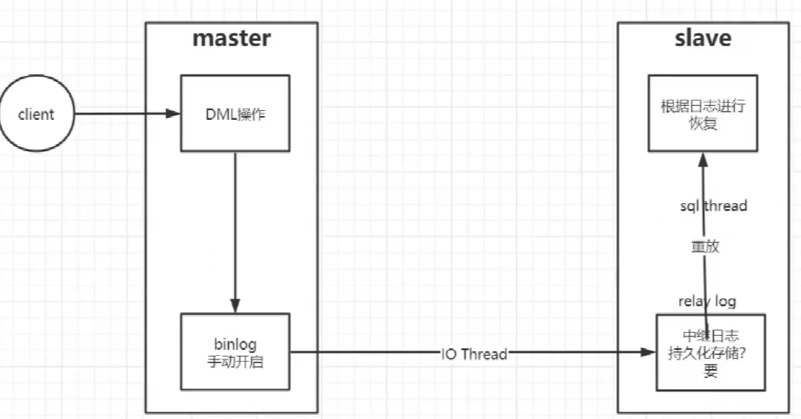

#### Mysql 备份类型

+   热备份
+   冷备份
+   温备份

MySQL 中进行不同方式的备份还要考虑存储引擎是否支持，如 **MyISAM 不支持热备，支持温备和冷备**。而 **InnoDB 支持热备、温备和冷备**。

一般情况下，我们需要备份的数据分为以下几种：

-   表数据
-   二进制日志、InnoDB 事务日志
-   代码（存储过程、存储函数、触发器、事件调度器）
-   服务器配置文件

#### 主从复制

**binlog** 和 **中继日志** 是主从复制的关键。

主从复制的作用：

+   做数据库的热备份
+   架构的扩展
+   读写分离

主从复制的原理：

+   Master IO线程
+   Slave IO线程
+   Slave Sql线程

从数据库的读的延迟问题了解吗？如何解决？ [🔗](https://blog.csdn.net/nlcexiyue/article/details/109099610)

+   产生所谓的主从延迟主要是看主库的写并发
+    分库/并行复制/让查询直连主库

做主从后主服务器挂了怎么办？

主库宕机：
(1)确保所有的relay log全部更新完毕，在每个从库上执行show processlist
(2)更新完毕后，登录所有从库查看master.info文件，对比选择pos最大的作为新的主库，
(3)然后登录这个新的主库，执行stop slave；进入主目录，删除master.Info和relay-log.info配置my.cnf文件开启log-bin文件
(4)创建用于同步的用户并授权slave
(5)登录另外一台从库，执行stop slave停止同步
(6)执行start slave
(7)修改新的master数据，测试slave是否同步更新

从库宕机：
(1)查看从库上mysql的错误日志，里面有记录主从挂掉时的binlog信息。
(2)有了binlog和postion信息后，只需要重新在从库上进行change master to配置即可。配置后开启slave状态，没有报错
(3)查看slave状态，发现slave已经正常了，开始进行延时数据恢复。

#### 优化

监控SQL

连接

数据库设计

索引

SQL语句

mysql的参数

分布式集群的设计
