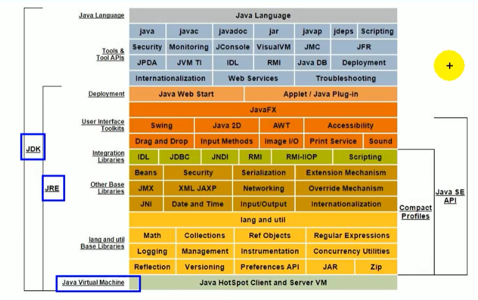

#### 学习路径

+   JVM - 内存与垃圾回收机制
+   字节码与类加载
+   性能监控与调优
+   面试


#### 为什么学习JVM

+   项目管理，调优
+   垃圾回收算法、JIT、底层原理
+   Java v.s. C++
    +   Java自动进行垃圾回收和内存分配
    +   C++由程序员自己分配


#### 字节码

我们平时说的java字节码，指的是用java语言编译成的字节码。准确的说任何能在jvm平台上执行的字节码格式都是一样的。所以应该统称为：jvm字节码。


#### 虚拟机

所谓虚拟机（Virtual Machine），就是一台虚拟的计算机。它是一款软件，用来执行一系列虚拟计算机指令。大体上，虚拟机可以分为系统虚拟机和程序虚拟机。

+   Visual Box，Mware就属于系统虚拟机
+   程序虚拟机的典型代表就是Java虚拟机

**Java虚拟机就是二进制字节码文件的运行环境。**


#### Java的体系结构

+   JDK，包含了一些编译器的工具



#### JVM整体结构

两次编译：

+   第一次：将Java代码编译成class文件
+   第二次：将class代码编译成机器指令


#### 基于`栈`和`寄存器`的指令集架构

基于栈式架构的特点

-   设计和实现更简单，适用于资源受限的系统；
-   避开了寄存器的分配难题：使用零地址指令方式分配。
-   指令流中的指令大部分是零地址指令，其执行过程依赖于操作栈。指令集更小，编译器容易实现。
-   不需要硬件支持，可移植性更好，更好实现跨平台

基于寄存器架构的特点

-   典型的应用是x86的二进制指令集：比如传统的PC以及Android的Davlik虚拟机。
-   指令集架构则完全依赖硬件，可移植性差
-   性能优秀和执行更高效
-   花费更少的指令去完成一项操作。
-   在大部分情况下，基于寄存器架构的指令集往往都以一地址指令、二地址指令和三地址指令为主，而基于栈式架构的指令集却是以零地址指令为主。


#### 反编译举例

+   java代码

```java
    public static void main(String[] args) {
        int i = 2 + 3;
    }
```

+   反编译后

```java
    Code:
      stack=1, locals=2, args_size=1
         0: iconst_5 # 一个常量5
         1: istore_1 # istore存放到栈中，1是操作数栈的索引
         2: return
      LineNumberTable:
        line 5: 0
        line 6: 2
```

+   跨平台性


#### JVM 生命周期

+   虚拟机的启动，Java虚拟机通过引导类类加载器创建一个初始类完成。
+   虚拟机的执行
+   虚拟机的退出
    -   程序正常执行结束
    -   程序在执行过程中遇到了异常或错误而异常终止
    -   由于操作系统用现错误而导致Java虚拟机进程终止
    -   某线程调用Runtime类或system类的exit方法，或Runtime类的halt方法，并且Java安全管理器也允许这次exit或halt操作。


#### 堆溢出和栈溢出

栈溢出，递归造成系统栈溢出：

```java
public class HelloTest {
    public static void main(String[] args) {
        int data = get_data(0);
    }
    public static int get_data(int i) {
        return get_data(i+1);
    }
}
```

堆溢出，系统堆空间溢出：

```java
int [] data = new int[1024*1024*1024];
```

