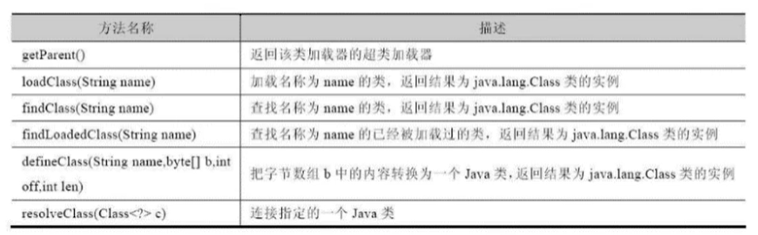
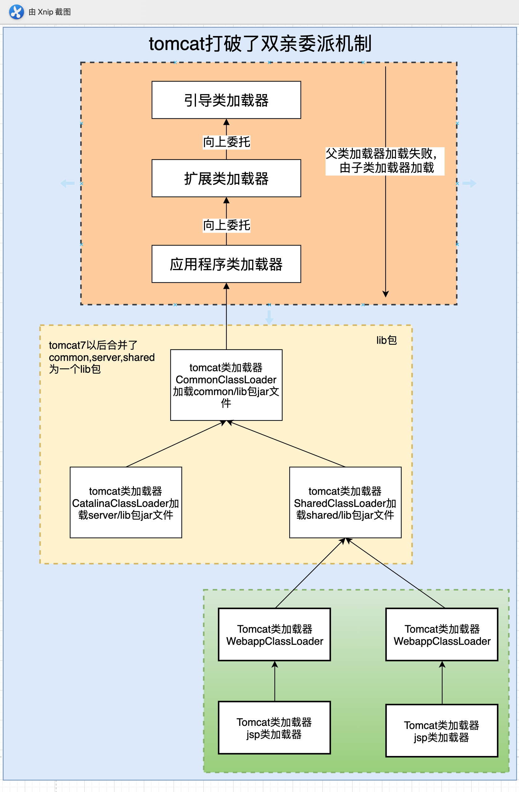

## 概述


## 类加载器和加载过程

#### 类加载子系统作用

+   负责从文件系统或者网络中加载Class文件，class文件在文件开头由特点的文件表示
+   ClassLoader只负责class文件的加载，是否可以运行，则由执行引擎决定。
+   分为三个过程
    +   加载
    +   链接
        +   验证
        +   准备
        +   解析
    +   初始化


#### 第一个环节 Loading ~ 类加载过程

+   通过一个类的全限定名获取定义此类的二进制字节流
+   将字节流所代表的静态存储结构转化为方法区的运行时数据结构
+   在内存中生成一个代表这个类的java.lang.Class对象，作为方法区这个类的各种数据的访问入口


#### 第二个环节 Linking ~ 类链接过程

+   验证 Verify，在于保证Class字节流中包含信息符合当前虚拟机要求，保证加载类的正确性，包括四种验证

    +   文件格式验证
    +   元数据验证
    +   字节码验证
    +   符号引用验证

+   准备 Prepare 

    +   为类变量分配内存并且设置该类变量的默认初始值，即零值。

        ```java
        public class HelloApp {
            private static int a = 1;  // 准备阶段为0，在下个阶段，也就是初始化的时候才是1
            public static void main(String[] args) {
                System.out.println(a);
            }
        }
        ```

    +   这里不包含用final修饰的static，这样的变量就是常量，因为final常量在编译的时候就会分配了，准备阶段会显式初始化；

    +   这里不会为实例变量分配初始化，类变量会分配在方法区中，而实例变量是会随着对象一起分配到Java堆中。

+   解析 Resovle

    +   符号引用就是一组符号来描述所引用的目标。符号引用的字面量形式明确定义在《java虚拟机规范》的class文件格式中。直接引用就是直接指向目标的指针、相对偏移量或一个间接定位到目标的句柄。


#### 第三个环节 Initialization ~ 类初始化过程

+   初始化阶段就是执行类构造器法`clinit()`的过程。

此方法不需定义，是javac编译器自动收集类中的所有类变量的赋值动作和**静态**代码块中的语句合并而来。

也就是说，当我们代码中包含static变量的时候，就会有clinit方法，必须是**静态变量**。

比如：

```java
public class HelloTest {
    static {
        num = 12;
    }
    private static int num = 1;
    public static void main(String[] args) {
        System.out.println(HelloTest.num);
    }
}

在对应的clinit方法中，之所以可以这么干，是因为num在准备阶段，已经定义为0了。
0 bipush 12
2 putstatic #3 <day12/HelloTest.num>
5 iconst_1
6 putstatic #3 <day12/HelloTest.num>
9 return

```

+   如果该类存在父类，那么JVM保证父类一定会先调用

```java
public class HelloTest {
    private int x;
    private int y;
    HelloTest(int x) {
        this.x = x;
    }

    HelloTest(int x,int y) {
        this.x = x;
        this.y = y;
    }

    public static void main(String[] args) {
        int num = 12;

        System.out.println(num);
    }
}


0 aload_0
1 invokespecial #1 <java/lang/Object.<init>> // 先调用父类
4 aload_0
5 iload_1
6 putfield #2 <day12/HelloTest.x>
9 return

```

+   一个类只能加载一次，虚拟机会保证类的`<clinit>()`方法在多线程下被同步加锁

```java
package day12;

public class DeanThreadTest {
    public static void main(String[] args) {
        Runnable r = () -> {
            System.out.println(Thread.currentThread().getName() + "开始");
            DeadTest dead = new DeadTest();
            System.out.println(Thread.currentThread().getName() + "结束");
        };

        Thread t1 = new Thread(r,"线程1");
        Thread t2 = new Thread(r,"线程2");

        t1.start();
        t2.start();

    }
}

class DeadTest {
    static {
        if(true) {
            System.out.println(Thread.currentThread().getName() + "初始化当前类");
            while (true) {

            }
        }
    }
}

```


## 类加载器

启动类加载器BootStrap只加载rt.jar，也就是jdk提供的相关java部分，扩展类加载器只加载java lib/ext扩展目录下的jar包，而用户类加载器App加载用户编写的代码所在目录（classpath）。


#### 类加载器分类

+   JVM支持两种类型的加载器

    

    +   引导类加载器 Bootstrap ClassLoader
    +   自定义类加载器 User-Defined ClassLoader （这里的自定义是从JVM的角度来看，JVM认为所有派生于抽象类ClassLoader的类加载器都划分为自定义类加载器。）

    ```java
    public class ClassLoaderTst {
        public static void main(String[] args) {
            // 1. 获取系统类加载器
            ClassLoader systemClassLoader = ClassLoader.getSystemClassLoader();
            System.out.println(systemClassLoader);
    
            // 2. 获取扩展类加载器
            ClassLoader extclassloader = systemClassLoader.getParent();
            System.out.println(extclassloader);
    
            // 3. 获取器上层，Bootstrap引导类，用C/C++语言编写
            ClassLoader parent = extclassloader.getParent();
            System.out.println(parent);
    
            // 3. 对于用户自定义类来说，默认采用系统类加载器进行加载
            System.out.println(ClassLoaderTst.class.getClassLoader());
    
            // 1. String类使用引导类加载器及逆行加载， ---> Java的核心类库使用引导类加载器及逆行加载
            System.out.println(String.class.getClassLoader());
        }
    }
    
    ```

    

#### 启动类加载器

+   这个类加载使用C/C++语言实现，嵌套在JVM内部
+   它用来加载来自Java的核心库，JAVA_HOME/jre/lib/rt.jar，用于提供JVM自身所需要的类
+   并不继承自java.lang.ClassLoader，没有父加载器
+   处于安全考虑，只加载包名位java,javax,sun等开头的类

```java
   // 1. 引导类加载器能加载的类
    URL[] urLs = Launcher.getBootstrapClassPath().getURLs();
    for (URL url:urLs) {
        System.out.println(url);
    }
    System.out.println(Provider.class.getClassLoader());

```


#### 扩展类加载器

-   Java语言编写，由sun.misc.Launcher$ExtClassLoader实现。
-   派生于ClassLoader类
-   父类加载器为启动类加载器
-   从java.ext.dirs系统属性所指定的目录中加载类库，或从JDK的安装目录的jre/1ib/ext子目录（扩展目录）下加载类库。如果用户创建的JAR放在此目录下，也会自动由扩展类加载器加载

```java
public static void main(String[] args) {

    // 2. 拓展类加载器能加载的类
    String property = System.getProperty("java.ext.dirs");
    for (String path: property.split(";")) {
        System.out.println(path);
    }
    System.out.println(CurveDB.class.getClassLoader());
}
```


####  应用程序类加载器（系统类加载器，AppClassLoader）

-   javI语言编写，由sun.misc.LaunchersAppClassLoader实现
-   派生于ClassLoader类
-   父类加载器为扩展类加载器
-   它负责加载环境变量classpath或系统属性java.class.path指定路径下的类库
-   该类加载是程序中默认的类加载器，一般来说，Java应用的类都是由它来完成加载
-   通过classLoader#getSystemclassLoader（）方法可以获取到该类加载


#### 用户自定义加载类

+   为什么需要使用
    +   隔离加载类
    +   修改类加载的方式
    +   扩展加载源
    +   防止源码泄露

+   例子

    ```java
    public class CustomClassLoader extends ClassLoader{
        @Override
        protected Class<?> findClass(String name) throws ClassNotFoundException {
            try {
                byte [] result = getClassFromCustomPath(name);
                if(result == null) {
                    throw new FileNotFoundException();
                } else{
                    return defineClass(name,result,0,result.length);
                }
            } catch (FileNotFoundException e) {
                e.printStackTrace();
            }
    
            throw new ClassNotFoundException(name);
        }
    
        private byte[] getClassFromCustomPath(String name) {
            return null;
        }
    }
    ```

    

#### ClassLoader 类

+   ClassLoader类，它是一个抽象类，其后所有的类加载器都继承自ClassLoader（不包括启动类加载器）



+   Class类的继承关系


+   sun.misc.Launcher 它是一个java虚拟机的入口应用

+   如何获取ClassLoader

    +   ```java
        // 通过getClassLoader 获取，Bootstrap类加载器
        System.out.println(ClassLoader.class.getClassLoader());
        ```

    +   ```java
        // 通过getContextClassLoader 获取App系统类加载器
        System.out.println(Thread.currentThread().getContextClassLoader());
        ```

    +   ```java
        // 通过getSystemClassLoader 获取 获取拓展类加载器
        System.out.println(ClassLoader.getSystemClassLoader().getParent());
        ```


#### 双亲委派机制


+   工作机制
    +   如果一个类加载器收到了类加载器请求，它并不会自己先去加载，而是将这个请求委托给父亲的加载区执行
    +   如果父类加载器还存在其父类加载器，则进一步向上委托，依次递归，请求最终将到达顶层的启动类加载器；
    +   如果父类加载器可以完成类加载任务，就成功返回，倘若父类加载器无法完成此加载任务，子加载器才会尝试自己去加载，这就是双亲委派模式。
+   优势
    +   避免类的`重复加载`
    +   保护`程序安全`


#### JDBC 破坏 双亲委派机制

通过上边便已初见端倪，因为JDBC的DriverManager是由Bootstrap类加载器去加载的，调用的方法也是JDBC的方法，但是真正的驱动JDBC里根本没有，所以在这样的机制下Bootstrap类加载器不会向下委培自然也就加载不到了，所以要让用户程序类加载器来加载真正的驱动就需要打破这种机制。

对应JDBC例子就是，调用方是rt.jar包下DriverManager，而具体Driver实现方在三方jar包下（如mysql-connector-java.jar），`Bootstrap Class Loader加载的类`在加载过程中要使用`Application Class Loader才能加载的类`，在双亲加载模型是不能做到的。所以这里出现打破双亲加载机制。


#### 沙箱安全机制 [🔗](https://blog.csdn.net/chdhust/article/details/42343473)

自定义string类，但是在加载自定义String类的时候会率先使用引导类加载器加载，而引导类加载器在加载的过程中会先加载jdk自带的文件（rt.jar包中java\lang\String.class），报错信息说没有main方法，就是因为加载的是rt.jar包中的string类。这样可以保证对java核心源代码的保护，这就是沙箱安全机制。

## 其他

#### 如何判断两个类是否相同

在JVM中表示两个class对象是否为同一个类存在两个必要条件：

+   类名必须完全一致，包括包名
+   加载这个类的ClassLoader必须一致

JVM必须知道一个类型是由启动加载器加载的还是由用户类加载器加载的。如果一个类型是由用户类加载器加载的，那么JVM会将这个类加载器的一个引用作为类型信息的一部分保存在方法区中。当解析一个类型到另一个类型的引用的时候，JVM需要保证这两个类型的类加载器是相同的。

####  类的主动使用和被动使用

Java程序对类的使用方式分为：王动使用和被动使用。 主动使用，又分为七种情况：

-   创建类的实例
-   访问某个类或接口的静态变量，或者对该静态变量赋值
-   调用类的静态方法I
-   反射（比如：Class.forName（"com.atguigu.Test"））
-   初始化一个类的子类
-   Java虚拟机启动时被标明为启动类的类
-   JDK7开始提供的动态语言支持：
-   java.lang.invoke.MethodHandle实例的解析结果REF getStatic、REF putStatic、REF invokeStatic句柄对应的类没有初始化，则初始化

除了以上七种情况，其他使用Java类的方式都被看作是对类的被动使用，都不会导致类的初始化。

#### Tomcat 破坏双亲加载机制



**每个Tomcat的webappClassLoader加载自己的目录下的class文件，不会传递给父类加载器。**

