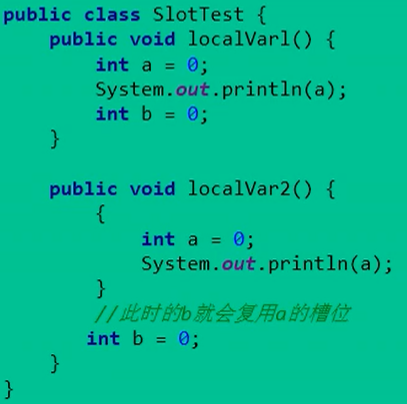
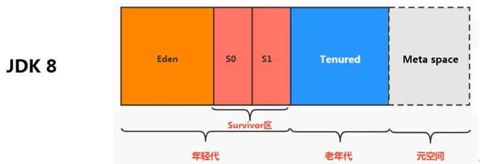
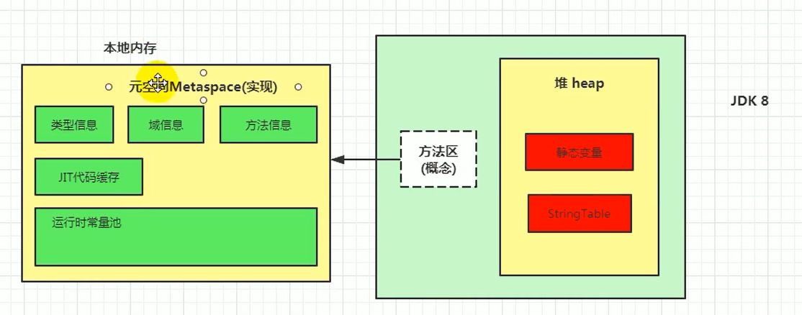

## 概述


+   多个线程共享：堆、堆外内存（元空间或者永久区、代码缓存）
+   一个线程包含程序技术器、本地方法栈、虚拟机栈
+   一个JVM只有一个Runtime对象，一个单例对象


#### 内存在JVM中的角色

+   我们通过磁盘或者网络IO得到的数据，都需要先加载到内存中，然后CPU从内存中获取数据进行读取，也就是说内存充当了CPU和磁盘之间的桥梁。

+   内存是非常重要的系统资源，是硬盘和CPU的中间仓库及桥梁。　


#### JVM 线程

+   JVM分为两种线程：守护线程（垃圾回收线程）和普通线程，如果最后一个线程是守护线程，当当前线程结束后，那么JVM也会终止

+   线程是任务调度和执行的基本单元，**每个线程都与操作系统的本地线程直接映射**。


## 1、程序计数器（PC寄存器）

#### 介绍

+   JVM中PC寄存器是对物理PC寄存器的一**种抽象模拟**。

+   PC寄存器用来存储指向下一条指令的地址，由**执行引擎读取下一条指令**。
+   每个线程都有自己的程序计数器
+   它是程序控制流的指示器，分支、循环、跳转、异常处理都依赖于计数器


#### 面试题:为什么使用PC寄存器记录当前线程的执行位置

+   CPU需要不断切换线程,当前切换到当前线程时,我们需要知道应该执行哪一条命令.

#### 面试题:为什么PC寄存器需要设置成线程私有的?

+   为了能够准确地记录各个线程正在执行的当前字节码指令地址，最好的办法自然是为每一个线程都分配一个PC寄存器，这样一来各个线程之间便可以进行独立计算，从而不会出现相互干扰的情况。


# 2、虚拟机栈

#### 虚拟机栈概述

+   栈是运行时单位
+   堆是存储的单位,占据的内存空间较大,
+   每个线程在创建时都会创建一个虚拟机栈，其内部保存一个个的栈帧（Stack Frame），对应着一次次的Java方法调用。
+   利用`ss`控制`stack szie`
+   虚拟机栈的默认大小与操作系统有关，`Linux`、`Mac`、`Solaris`均为1MB；在window上，与计算机位数有关：` 320K/1MB [32bit/64bit])`。
+   设置栈的大小：`java -Xss 10m` 
+   动态链接（指向运行时常量池的一个地址）


#### 栈的存储单位

+   存放方法的局部变量(8种基本数据类型 , 对象的引用地址) , 部分结果

+   基本存储单位是:`栈帧`，一个栈帧对应`一个方法`

+   性质:线程私有

+   生命周期:和线程一致

+   栈是一种有效的分配存储方法,访问速度仅次于程序计数器

+   不同线程的所包含的栈帧是无法相互引用的

+   Java由两种返回函数的方式，一种是正常的函数返回，一种是抛出异常（未处理的异常throws），他们都会导致栈帧抛出。

+   JVM直接对Java栈的操作只有两个：**一个方法对应一个栈帧**

    +   每个方法执行，伴随着进栈（入栈、压栈）

    +   执行结束后的出栈工作

        

+   常见的异常

    +   StackOverflowError
    +   OOM

+   **栈帧的内部结构**

    +   **局部变量表 Local Variables**
    +   **操作数栈 Operand Stack**
    +   动态链接 Dynamic Linking
    +   方法返回地址 Return Address
    +   一些附加信息

    


#### 局部变量表

+   定义为一个数字数组，主要用于存储方法参数和定义在方法体内的局部变量，这些数据包括**基本数据类型、对象引用**，以及returnAddress类型
+   比如对于这样一段代码，对应的局部变量表：

```java
public static void main(String[] args) { // 1. 形参
    int a = 12; // 2. 局部变量
    int b = 14;
    StackErrorTest test = new StackErrorTest(); // 函数返回值
    test.test1(); 
}
```


+   slot 局部变量表的存储单元是Slot 变量槽

    +   栈帧中的局部变量表中的槽位是可以重用的，如果一个局部变量过了其作用域，那么在其作用域之后申明的新的局部变就很有可能会复用过期局部变量的槽位，从而达到节省资源的目的。下面的例子中，a除了`{}`作用域后就挂了。

    

+    静态变量与局部变量的对比
    -   按数据类型分：基本数据类型、引用数据类型
    -   按类中声明的位置分：成员变量（类变量，实例变量）、局部变量
        -   类变量：linking的paper阶段，给类变量默认赋值，init阶段给类变量显示赋值即静态代码块
        -   实例变量：随着对象创建，会在堆空间中分配实例变量空间，并进行默认赋值
        -   局部变量：在使用前必须进行显式赋值，不然编译不通过。
+   垃圾回收
    +   局部变量表中的变量也是重要的垃圾回收根节点，只要被局部变量表中直接或间接引用的对象都不会被回收。

#### 操作数栈

+   代码

```java
    public int add() {
        int x = 1;
        int y = 1;
        int z = x + y;
        return z;
    }
```

+   字节码

```java
      stack=2, locals=4, args_size=1
         0: iconst_1
         1: istore_1 // x = 1
         2: iconst_1
         3: istore_2 // y = 1
         4: iload_1 // 读出 y
         5: iload_2 // 读出 x
         6: iadd // 运算 x + y
         7: istore_3 // 存放到 z
         8: iload_3 // 加载 z
         9: ireturn  // 返回z

```

+   解释i++和++i

```java
    public int add() {
        int x = 1;
        int y = 1;
        int z = x++;
        int t = ++x;
        return x;
    }
```

```shell
 0 iconst_1
 1 istore_1
 2 iconst_1
 3 istore_2
 4 iload_1
 5 iinc 1 by 1
 8 istore_3
 9 iinc 1 by 1
12 iload_1
13 istore 4
15 iload_1
16 ireturn

```


#### 动态链接（指向运行时常量池的一个地址）

每一个栈帧内部都包含一个指向**运行时常量池**中该栈帧所属方法的引用包含这个引用的目的就是为了支持当前方法的代码能够实现动态链接（Dynamic Linking）。比如：invokedynamic指令

在Java源文件被编译到字节码文件中时，所有的变量和方法引用都作为符号引用（symbolic Reference）保存在class文件的常量池里。


#### 方法调用

+   静态链接和动态链接

静态链接：当一个字节码文件被装载进JVM内部时，如果被调用的目标方法在编译期可知，且运行期保持不变时，这种情况下，调用方法的符号引用转换为直接引用的过程称之为静态链接

动态链接：如果被调用的方法在编译期无法被确定下来，也就是说，只能够在程序运行期将调用的方法的符号转换为直接引用，由于这种引用转换过程具备动态性，因此也被称之为动态链接。

+   早期绑定和晚期绑定

早期绑定：早期绑定就是指被调用的目标方法如果在编译期可知，且运行期保持不变时，即可将这个方法与所属的类型进行绑定，这样一来，由于明确了被调用的目标方法究竟是哪一个，因此也就可以使用静态链接的方式将符号引用转换为直接引用

晚期绑定：如果被调用的方法在编译期无法被确定下来，只能够在程序运行期根据实际的类型绑定相关的方法，这种绑定方式也就被称之为晚期绑定。

+   虚方法和非虚方法

非虚方法：静态方法、私有方法、final方法、实例构造器、父类方法（显式通过super调用）都是非虚方法。

虚方法：其他的方法。


#### 四种方法调用指令

+   invokestatic和invokespecial指令调用的方法称为非虚方法，其余的invokevirtual（final修饰的除外）称为虚方法。

```java
    public void show() {
        //  invokestatic 非虚方法
        showStatic("atguigu.com");
        //  invokestatic 非虚方法
        super.showStatic("father");

        //  invokevirtual 虚方法
        showPrivate("hello");
        //  invokespecial 非虚方法
        super.showCommon(); //
        //  invokevirtual 非虚方法
        showFinal();
        //  invokespecial 非虚方法
        super.showFinal();
        //  invokevirtual 虚方法
        showCommon();
    }
```


```shell
 0 ldc #11 <atguigu.com>
 2 invokestatic #12 <day01/Son.showStatic>
 5 ldc #13 <father>
 7 invokestatic #14 <day01/Father.showStatic>
10 aload_0
11 ldc #15 <hello>
13 invokevirtual #16 <day01/Son.showPrivate>
16 aload_0
17 invokespecial #17 <day01/Father.showCommon>
20 aload_0
21 invokevirtual #18 <day01/Son.showFinal>
24 aload_0
25 invokespecial #19 <day01/Father.showFinal>
28 aload_0
29 invokevirtual #20 <day01/Son.showCommon>
32 return
```

+   invokedynamic

**静态类型语言是判断变量自身的类型信息**；**动态类型语言是判断变量值的类型信息**，变量没有类型信息，变量值才有类型信息，这是动态语言的一个重要特征。

```java
Java: String data = "123";  // 静态
Python: data = "123" // 动态
```

invokedynamic指导java8之后才直接被调用：

```java
Runnable r = () -> {
    System.out.println("Hello");
};
```

```shell
0 invokedynamic #10 <run, BootstrapMethods #0>
5 astore_2 
6 return
```

#### 方法重写的本质

-   找到操作数栈顶的第一个元素所执行的对象的实际类型，记作C。
-   如果在类型C中找到与常量中的描述符合简单名称都相符的方法，则进行访问权限校验，如果通过则返回这个方法的直接引用，查找过程结束；如果不通过，则返回java.1ang.I1legalAccessError 异常。
-   否则，按照继承关系从下往上依次对C的各个父类进行第2步的搜索和验证过程。
-   如果始终没有找到合适的方法，则抛出java.1ang.AbstractMethodsrror异常。

####  方法的调用：虚方法表

在面向对象的编程中，会很频繁的使用到动态分派，如果在每次动态分派的过程中都要重新在类的方法元数据中搜索合适的目标的话就可能影响到执行效率。因此，为了提高性能，JVM采用在类的方法区建立一个虚方法表 （virtual method table）（非虚方法不会出现在表中）来实现。使用索引表来代替查找。

每个类中都有一个虚方法表，表中存放着各个方法的实际入口。

虚方法表是什么时候被创建的呢？

虚方法表会在类加载的链接阶段被创建并开始初始化，类的变量初始值准备完成之后，JVM会把该类的方法表也初始化完毕。


#### 方法返回地址

+   存放调用该方法的pc寄存器的值。一个方法的结束，有两种方式：

    -   正常执行完成
    -   出现未处理的异常，非正常退出

    无论通过哪种方式退出，在方法退出后都返回到该方法被调用的位置。方法正常退出时，调用者的pc计数器的值作为返回地址，即调用该方法的指令的下一条指令的地址。而通过异常退出的，返回地址是要通过异常表来确定，栈帧中一般不会保存这部分信息。

+   方法退出

    本质上，方法的退出就是当前栈帧出栈的过程。此时，需要恢复上层方法的局部变量表、操作数栈、将返回值压入调用者栈帧的操作数栈、设置PC寄存器值等，让调用者方法继续执行下去。

## 面试题：5道面试题

#### 举例栈溢出的情况？（StackOverflowError）

通过 -Xss设置栈的大小

#### 调整栈大小，就能保证不出现溢出么？

不能保证不溢出

#### 分配的栈内存越大越好么？

不是，一定时间内降低了OOM概率，但是会挤占其它的线程空间，因为整个空间是有限的。

#### 垃圾回收是否涉及到虚拟机栈？

不会

#### 方法中定义的局部变量是否线程安全？

具体问题具体分析。

如果对象是在内部产生，并在内部消亡，没有返回到外部，那么它就是线程安全的，反之则是线程不安全的


#### 运行时数据区，是否存在Error和GC

| 运行时数据区 | 是否存在Error | 是否存在GC |
| :----------: | :-----------: | :--------: |
|  程序计数器  |      否       |     否     |
|   虚拟机栈   |      是       |     否     |
|  本地方法栈  |      是       |     否     |
|    方法区    |   是（OOM）   |     是     |
|      堆      |      是       |     是     |


## 本地方法接口

#### 什么是本地方法

一个Native Methodt是一个Java调用非Java代码的接囗

#### 为什么使用本地方法

Java使用起来非常方便，然而有些层次的任务用Java实现起来不容易，或者我们对程序的效率很在意时，问题就来了。

#### 例子

```java
public class IhaveNatives {
    public native void Native1(int x);
    native static public long Native2();
    native synchronized private float Native3(Object o);
    native void Natives(int[] ary) throws Exception;
}
```


## 本地方法栈

#### 什么是本地方法栈

Java虚拟机栈于管理Java方法的调用，而**本地方法栈用于管理本地方法的调用**。


当某个线程调用一个本地方法时，它就进入了一个全新的并且不再受虚拟机限制的世界。它和虚拟机拥有同样的权限。

-   本地方法可以通过本地方法接口来访问虚拟机内部的运行时数据区。
-   它甚至可以直接使用本地处理器中的寄存器
-   直接从本地内存的堆中分配任意数量的内存。


# **3、堆**

#### 堆的核心概念

一个进程对应一个JVM实例，一个进程对应一个运行时数据区，一个进程可以包含多个线程，他们共享方法区和堆空间。

+   堆内存的大小是可以调节的
+   “几乎”所有的对象实例都在这里分配内存。—从实际使用角度看的；因为还有一些对象是在栈上分配的。
+   在方法结束后，堆中的对象不会马上被移除，仅仅在**垃圾收集的时候才会被移除**。


#### 堆的核心概述：内存细分


+   Java 7之前，新生区、养老区、**永久区（看成是方法区的具体实现）**
+   Java 8之后，新生区、养老区、**元空间（看成是方法区的具体实现）**


#### 堆内存大小与OOM

-   “-Xms"用于表示堆区的起始内存，等价于-xx:InitialHeapSize
-   “-Xmx"则用于表示堆区的最大内存，等价于-XX:MaxHeapSize

默认情况下：

+   初始内存大小：`物理电脑内存大小/64，比如8G内存的电脑，大约为128M`
+   最大内存大小：`物理电脑内存大小/4，比如8G内存的电脑，大约为2G`

```java
public class HeapTest {
    public static void main(String[] args) {
        double initalMemory = Runtime.getRuntime().totalMemory() / 1024.0 / 1024.0;
        double maxMemory = Runtime.getRuntime().maxMemory() / 1024.0 / 1024.0;
        System.out.println("-Xms " + initalMemory + "m");
        System.out.println("-Xmx " + maxMemory + "m");
    }
}

/*
-Xms 9.5m
-Xmx 18.0m
*/
```

+   "-XX:+PrintGCDetails" 查看堆内存分配情况

```markdown
Heap
 PSYoungGen      total 2560K, used 707K [0x00000000ffd00000, 0x0000000100000000, 0x0000000100000000)
  eden space 2048K, 11% used [0x00000000ffd00000,0x00000000ffd38d08,0x00000000fff00000)
  from space 512K, 95% used [0x00000000fff00000,0x00000000fff7a020,0x00000000fff80000)
  to   space 512K, 0% used [0x00000000fff80000,0x00000000fff80000,0x0000000100000000)
 ParOldGen       total 7168K, used 4480K [0x00000000ff600000, 0x00000000ffd00000, 0x00000000ffd00000)
  object space 7168K, 62% used [0x00000000ff600000,0x00000000ffa60020,0x00000000ffd00000)
 Metaspace       used 3504K, capacity 4498K, committed 4864K, reserved 1056768K
  class space    used 387K, capacity 390K, committed 512K, reserved 1048576K
```

+   jps 查看pid, jstat -gc pid 查看堆内存分配情况


#### 新生代与老年代


+   `-XX:NewRatio=2`，用来设置新生代和老年代的内存比例为：`1:2`

+   `-XX:SurvivorRatio=8`，用来设置伊甸园区和幸存者区域的内存比例为：`8:1:1`


####  图解对象分配过程

图解过程：MinorGC或者YoungGC会去回收伊甸园区和幸存者区。-Xx:MaxTenuringThreshold= N设置阈值15。

+   1 新创建的对象一帮存放再Eden区，当Eden区满了之后，就会触发GC操作，一般称为YoungGC或者MinorGC操作，红色表示垃圾，绿色表示存活，同时我们给每个对象设置了一个年龄计数器，一次回收后就是1。

    

+ 2 同时Eden区继续存放对象，当Eden区再次存满的时候，又会触发一个MinorGC操作，此时GC将会把 Eden和Survivor From中的对象 进行一次收集，把存活的对象放到 Survivor To区，同时让年龄 


+ 我们继续不断的进行对象生成 和 垃圾回收，当Survivor中的对象的年龄达到15的时候，将会触发一次 Promotion晋升的操作，也就是将年轻代中的对象 晋升到 老年代中


+   一些总结
    -   new的对象先放伊甸园区。此区有大小限制。
    -   当伊甸园的空间填满时，程序又需要创建对象，JVM的垃圾回收器将对伊甸园区进行垃圾回收（MinorGC），将伊甸园区中的不再被其他对象所引用的对象进行销毁。再加载新的对象放到伊甸园区
    -   然后将伊甸园中的剩余对象移动到幸存者0区。
    -   如果再次触发垃圾回收，此时上次幸存下来的放到幸存者0区的，如果没有回收，就会放到幸存者1区。
    -   如果再次经历垃圾回收，此时会重新放回幸存者0区，接着再去幸存者1区。
    -   啥时候能去养老区呢？可以设置次数。默认是15次。
    -   在养老区，相对悠闲。当养老区内存不足时，再次触发GC：Major GC 或者 Full GC，进行养老区的内存清理
    -   若养老区执行了Major GC之后，发现依然无法进行对象的保存，就会产生OOM异常。

+   例子

```java
public class HeapInstanceTest {
    byte [] buffer = new byte[new Random().nextInt(1024 * 200)];
    public static void main(String[] args) throws InterruptedException {
        ArrayList<HeapInstanceTest> list = new ArrayList<>();
        while (true) {
            list.add(new HeapInstanceTest());
            Thread.sleep(10);
        }
    }
}
```

#### Minor GC、Major GC  和 Full GC

+   Minor GC 触发机制
    +   只会对年轻代的内存进行回收
    +   当年轻代空间不足时，就会触发MinorGC，这里的年轻代满指的是Eden代满，Survivor满不会引发GC。
    +   Minor GC会引发STW，暂停其它用户的线程，等垃圾回收结束，用户线程才恢复运行
    +   `Minior GC的原理` 第一次的minor gc会将找到的所有非垃圾对象放到Survivor1中，第二次minor gc会将找到的非垃圾对象放到Survivor2（这里的minor gc是包括Survivor1里存放的非垃圾对象），再依次进行minor gc，将非垃圾对象在Survivor1和Survivor2来回存放跳转；直到跳了15次，也就是对象头里的分代年龄达到15，就会把这个对象放到老年代区，当老年代也满了之后，就会进行一个full gc
    
+   Major GC触发机制
    +   一般只是老年代的圾收集。
    +   在老年代空间不足时，会先尝试触发MinorGC。如果之后空间还不足，则触发Major GC。
    +   Major GC的速度一般会比MinorGc慢1e倍以上，STW的时间更长，如果Major GC后，内存还不足，就报OOM了

+   FullGC
    +   System.gc()
    +   老年代`空间不足` 或者 `方法区空间不足`
    +   收集整个Java堆和方法区域的垃圾收集

####  堆空间分代思想

不分代完全可以，分代的唯一理由就是优化GC性能





#### 内存分配策略

+   优先分配到Eden
+   大对象直接分配到老年代
+   长期存活的对象分配到老年代
+   动态对象年龄判断
+   空间分配担保： -XX:HandlePromotionFailure
    +   也就是经过Minor GC后，所有的对象都存活，因为Survivor比较小，所以就需要将Survivor无法容纳的对象，存放到老年代中。

#### 内存分配 TLAB Thread Local Allocation Buffer

+   堆区是线程共享区域，任何线程都可以访问到堆区中的共享数据
+   线程不安全
+   如果使用加锁，效率大大下降

从内存模型而不是垃圾收集的角度，对Eden区域继续进行划分，JVM为每个线程分配了一个私有缓存区域，它包含在Eden空间内。


#### 堆空间的参数设置

-   -XX：+PrintFlagsInitial：查看所有的参数的默认初始值
-   -XX：+PrintFlagsFinal：查看所有的参数的最终值（可能会存在修改，不再是初始值）
-   -Xms：初始堆空间内存（默认为物理内存的1/64）
-   -Xmx：最大堆空间内存（默认为物理内存的1/4）
-   -Xmn：设置新生代的大小。（初始值及最大值）
-   -XX:NewRatio：配置新生代与老年代在堆结构的占比
-   -XX:SurvivorRatio：设置新生代中Eden和S0/S1空间的比例
-   -XX:MaxTenuringThreshold：设置新生代垃圾的最大年龄
-   -XX：+PrintGCDetails：输出详细的GC处理日志
    -   打印gc简要信息：①-Xx：+PrintGC ② - verbose:gc
-   -XX:HandlePromotionFalilure：是否设置空间分配担保

在发生Minor GC之前，虚拟机会检查老年代最大可用的连续空间是否大于新生代所有对象的总空间。

-   如果大于，则此次Minor GC是安全的
-   如果小于，则虚拟机会查看-xx:HandlePromotionFailure设置值是否允担保失败。
    -   如果HandlePromotionFailure=true，那么会继续检查老年代最大可用连续空间是否大于历次晋升到老年代的对象的平均大小。
        -   如果大于，则尝试进行一次Minor GC，但这次Minor GC依然是有风险的；
        -   如果小于，则改为进行一次FullGC。
    -   如果HandlePromotionFailure=false，则改为进行一次Full GC。

JDK 7之后，默认设置为 `HandlePromotionFailure=true`

####  堆是分配对象的唯一选择么

##### 逃逸分析

有一种特殊情况，那就是如果经过逃逸分析（Escape Analysis）后发现，一个对象并没有逃逸出方法的话，那么就可能被优化成栈上分配。这样就无需在堆上分配内存，也无须进行垃圾回收了。这也是最常见的堆外存储技术。

例子：判断当前区域的变量是否有可能在方法外被调用。

```java
public void my_method() {
    V v = new V();
    // use v
    // ....
    v = null;
}
```

##### 参数设置

```java
选项“-xx：+DoEscapeAnalysis"显式开启逃逸分析
通过选项“-xx：+PrintEscapeAnalysis"查看逃逸分析的筛选结果
```

#####  结论

需要额外CPU资源，一般在服务器上开启。

开发中能使用局部变量的，就不要使用在方法外定义。

使用逃逸分析，编译器可以对代码做如下优化：

-   `栈上分配`：将堆分配转化为栈分配。如果一个对象在子程序中被分配，要使指向该对象的指针永远不会发生逃逸，对象可能是栈上分配的候选，而不是堆上分配；**栈上分配的场景：分别是给成员变量赋值、方法返回值、实例引用传递**

-   `同步省略`：如果一个对象被发现只有一个线程被访问到，那么对于这个对象的操作可以不考虑同步。

-   `分离对象或标量替换`：有的对象可能不需要作为一个连续的内存结构存在也可以被访问到，那么对象的部分（或全部）可以不存储在内存，而是存储在CPU寄存器中。

    例子：标量（scalar）是指一个无法再分解成更小的数据的数据。Java中的原始数据类型就是标量。相对的，那些还可以分解的数据叫做聚合量（Aggregate），Java中的对象就是聚合量，因为他可以分解成其他聚合量和标量。在JIT阶段，如果经过逃逸分析，发现一个对象不会被外界访问的话，那么经过JIT优化，就会把这个对象拆解成若干个其中包含的若干个成员变量来代替。这个过程就是标量替换。

    ```java
    public static void main(String args[]) {
        alloc();
    }
    class Point {
        private int x;
        private int y;
    }
    private static void alloc() {
        Point point = new Point(1,2);
        System.out.println("point.x" + point.x + ";point.y" + point.y);
    }
    
    
    // --->
    
    private static void alloc() {
        int x = 1;
        int y = 2;
        System.out.println("point.x = " + x + "; point.y=" + y);
    }
    ```

    

# 4、方法区


+   堆、栈、方法区三者的联系

    ```java
    Person person = new Person()
    // Person：存放在元空间，也可以说方法区
    // person：存放在Java栈的局部变量表中
    // new Person()：存放在Java堆中
    ```


#### 方法区的理解

+   方法区和Java堆一样，是各个线程共享的内存区域
+   方法区在JVM启动的时候被创建，并且它的实际的物理内存空间中和Java堆区一样都可以是不连续的【**进行类的加载**】
+   方法区的大小决定了系统可以保存多少个类，类定义太多，虚拟机也会报内存溢出错误
+   关闭JVM就会释放这个区域的内存


#### 元空间和永久代的区别

+   设置元空间的大小：`-XX:MetaspaceSize=10m -XX:MaxMetaspaceSize=10m`
+   元空间与永久代最大的区别在于：元空间不在虚拟机设置的内存中，而是使用本地内存
+   OOM相对不容易出现


#### 如何解决OOM

-   要解决OOM异常或heap space的异常，一般的手段是首先通过内存映像分析工具（如Ec1ipse Memory Analyzer）对dump出来的堆转储快照进行分析，重点是确认内存中的对象是否是必要的，也就是要先分清楚到底是出现了内存泄漏（Memory Leak）还是内存溢出（Memory Overflow）
    -   内存泄漏就是 有大量的引用指向某些对象，但是这些对象以后不会使用了，但是因为它们还和GC ROOT有关联，所以导致以后这些对象也不会被回收，这就是内存泄漏的问题
-   如果是内存泄漏，可进一步通过工具查看泄漏对象到GC Roots的引用链。于是就能找到泄漏对象是通过怎样的路径与GCRoots相关联并导致垃圾收集器无法自动回收它们的。掌握了泄漏对象的类型信息，以及GCRoots引用链的信息，就可以比较准确地定位出泄漏代码的位置。
-   如果不存在内存泄漏，换句话说就是内存中的对象确实都还必须存活着，那就应当检查虚拟机的堆参数（-Xmx与-Xms），与机器物理内存对比看是否还可以调大，从代码上检查是否存在某些对象生命周期过长、持有状态时间过长的情况，尝试减少程序运行期的内存消耗。


#### 方法区内部结构

它用于存储已被虚拟机加载的**类型信息**、**常量**、**静态变量**、**即时编译器编译后的代码缓存**等。


+   类型信息 （域信息、方法信息）
+   运行时常量池
+   静态变量
+   JIT代码缓存


#### 类型信息

对每个加载的类型（类class、接口interface、枚举enum、注解annotation），JVm必须在方法区中存储以下类型信息：

-   这个类型的完整有效名称（全名=包名.类名）
-   这个类型直接父类的完整有效名（对于interface或是java.lang.object，都没有父类）
-   这个类型的修饰符（public，abstract，final的某个子集）
-   这个类型直接接口的一个有序列表

#### 域信息

JVM必须在方法区中保存类型的所有域的相关信息以及域的声明顺序。

域的相关信息包括：域名称、域类型、域修饰符（public，private，protected，static，final，volatile，transient的某个子集）

#### 方法（Method）信息

JVM必须保存所有方法的以下信息，同域信息一样包括声明顺序：

-   方法名称
-   方法的返回类型（或void）
-   方法参数的数量和类型（按顺序）
-   方法的修饰符（public，private，protected，static，final，synchronized，native，abstract的一个子集）
-   方法的字节码（bytecodes）、操作数栈、局部变量表及大小（abstract和native方法除外）
-   异常表（abstract和native方法除外）

#### non-final的static类变量

+   final + static称为全局常量，在编译阶段就已经被赋值了。

```java
public class MethodAreaTest {
    public static void main(String[] args) {
        Order order = null; // 静态成员（方法）没有实例化对象，也可以调用
        order.hello();
        System.out.println(order.count);
    }
}
class Order {
    public static int count = 1;
    public static final int number = 2;
    public static void hello() {
        System.out.println("hello!");
    }
}
```

#### .class字节码文件中的`常量池` 和 方法区中的`运行时常量池` [🔗](https://blog.csdn.net/qq_26222859/article/details/73135660)


+   为什么需要class常量池

    一个java源文件中的类、接口，编译后产生一个字节码文件。而Java中的字节码需要数据支持，通常这种数据会很大以至于**不能直接存到字节码里**，换另一种方式，可以存到常量池，这个字节码包含了指向常量池的引用。在动态链接的时候会用到运行时常量池，之前有介绍。

+   class常量池包含

    +   数量值
    +   字符串值
    +   类引用
    +   字段引用
    +   方法引用

+ 运行时常量池

  +   运行时常量池（Runtime Constant Pool）是方法区的一部分。
  +   常量池表（Constant Pool Table）是Class文件的一部分，用于存放编译期生成的各种字面量与符号引用，这部分内容将在类加载后存放到方法区的运行时常量池中。
  +   运行时常量池，在加载类和接口到虚拟机后，就会创建对应的运行时常量池。
  +   运行时常量池，相对于Class文件常量池的另一重要特征是：具备**动态性**。
  
    

#### 方法区的变化

| JDK1.6及以前 | 有永久代，静态变量存储在永久代上                             |
| ------------ | ------------------------------------------------------------ |
| JDK1.7       | 有永久代，但已经逐步 “去永久代”；字符串常量池，静态变量移除，保存在堆中 |
| JDK1.8       | 无永久代，类型信息，字段，方法，常量保存在本地内存的元空间，但**字符串常量池、静态变量**仍然在堆中。 |





