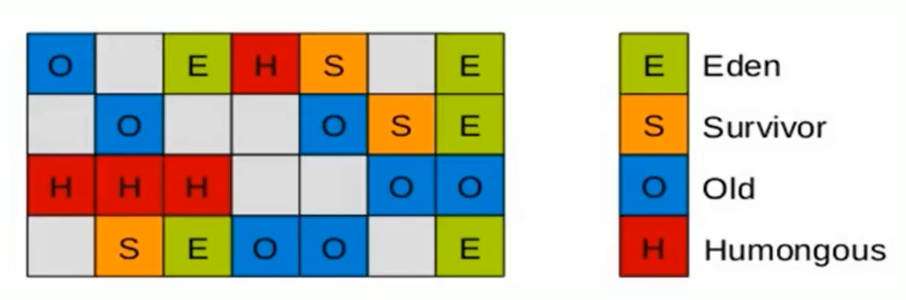
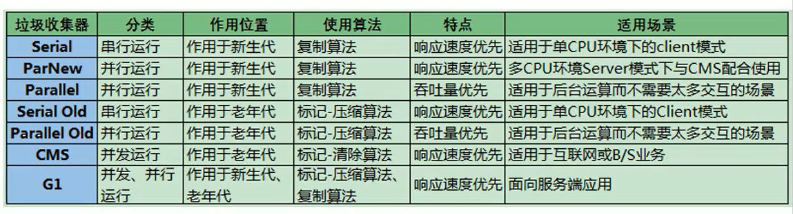

## 1. 垃圾回收概述


垃圾回收分为两个步骤，一个是垃圾标志和垃圾清楚，这是两个不同的阶段，不要混淆。

#### 1.1 引用计数算法


#### 1.2 标记清除算法（GC-Roots、可达性分析算法）

在GC的时候，需要STW，将用户线程挂起。

基本步骤：

+   可达性分析算法是以根对象集合（GCRoots）为起始点，按照从上至下的方式搜索被根对象集合所连接的目标对象是否可达。
- 使用可达性分析算法后，内存中的存活对象都会被根对象集合直接或间接连接着，搜索所走过的路径称为引用链（Reference Chain）
- 如果目标对象没有任何引用链相连，则是不可达的，就意味着该对象己经死亡，可以标记为垃圾对象。
- 在可达性分析算法中，只有能够被根对象集合直接或者间接连接的对象才是存活对象。


+   GC Roots可以是哪些对象

    -   **`Class`** - 由系统类加载器(system class loader)加载的对象，这些类是不能够被回收的，他们可以以静态字段的方式保存持有其它对象。我们需要注意的一点就是，通过用户自定义的类加载器加载的类，除非相应的`java.lang.Class`实例以其它的某种（或多种）方式成为roots，否则它们并不是roots，.
    -   **`Thread`** - 活着的线程
    -   **`Stack Local`** - Java方法的local变量或参数
    -   **`JNI Local`** - JNI方法的local变量或参数
    -   **`Monitor Used`** - 用于同步的监控对象
    -   **`Held by JVM`** - 用于JVM特殊目的由GC保留的对象，但实际上这个与JVM的实现是有关的。可能已知的一些类型是：系统类加载器、一些JVM知道的重要的异常类、一些用于处理异常的预分配对象以及一些自定义的类加载器等。**然而，JVM并没有为这些对象提供其它的信息，因此就只有留给分析分员去确定哪些是属于"JVM持有"的了。**

    

#### 1.3 对象的finalization机制

Java语言提供了对象终止（finalization）机制来允许开发人员提供对象被销毁之前的自定义处理逻辑。

当垃圾回收器发现没有引用指向一个对象，即：垃圾回收此对象之前，总会先调用这个对象的finalize()方法。

finalize() 方法允许在子类中被重写，用于在对象被回收时进行资源释放。通常在这个方法中进行一些资源释放和清理的工作，比如关闭文件、套接字和数据库连接等。

**注意：**

从功能上来说，finalize（）方法与c++中的析构函数比较相似，但是Java采用的是基于垃圾回收器的自动内存管理机制，所以finalize（）方法在本质上不同于C++中的析构函数。


#### 1.4 虚拟机中对象的三种状态

-   可触及的：从根节点开始，可以到达这个对象。
-   可复活的：对象的所有引用都被释放，但是对象有可能在finalize（）中复活。
-   不可触及的：对象的finalize（）被调用，并且没有复活，那么就会进入不可触及状态。不可触及的对象不可能被复活，因为**finalize()只会被调用一次**。


#### 1.5 一个简单例子

```java
public class FinalizeTest {
    public static Object obj;

    @Override
    protected void finalize() throws Throwable {
        super.finalize();
        System.out.println("调用当前类的finaliza方法");
        obj = this; // 复活
    }

    @Test
    public void t1() throws InterruptedException {
        obj = new FinalizeTest();
        FinalizeTest.obj = null;

        System.out.println("第1次gc");
        System.gc(); // 优先级较低，先将主线程挂起
        Thread.sleep(2000);
        if(obj == null) {
            System.out.println("obj对象已经死亡");
        } else {
            System.out.println("obj对象依然存活");
        }

        System.out.println("第2次gc");
        obj = null;
        System.gc();
        Thread.sleep(2000);
        if(obj == null) {
            System.out.println("obj对象已经死亡");
        } else {
            System.out.println("obj对象依然存活");
        }
    }
}

```


## 2. 常用垃圾回收算法

####  2.1. 标记清除算法

**标记**：Collector从引用根节点开始遍历，**标记所有被引用的对象**。一般是在对象的Header中记录为可达对象。
**清除**：Collector对堆内存从头到尾进行线性的遍历，如果发现某个对象在其Header中没有标记为可达对象，则将其回收

+   缺点
    +   标记清除算法的效率不算高
    - 在进行GC的时候，需要停止整个应用程序，用户体验较差
    - 这种方式清理出来的空闲内存是不连续的，产生内碎片，需要维护一个空闲列表


####  2.2. 复制算法

将活着的内存空间分为两块，每次只使用其中一块，在垃圾回收时将正在使用的内存中的存活对象复制到未被使用的内存块中，之后清除正在使用的内存块中的所有对象，交换两个内存的角色，最后完成垃圾回

+   优点
    +   没有标记和清除过程，实现简单，运行高效
    +   复制过去以后保证空间的连续性，不会出现“碎片”问题。

+   缺点
    +   此算法的缺点也是很明显的，就是需要两倍的内存空间。
    +   对于G1这种分拆成为大量region的GC，复制而不是移动，意味着GC需要维护region之间对象引用关系，不管是内存占用或者时间开销也不小

#### 2.3. 标记压缩算法

第一阶段和标记清除算法一样，从根节点开始标记所有被引用对象
第二阶段将所有的存活对象压缩到内存的一端，按顺序排放。之后，清理边界外所有的空间。


#### 2.4 分代收集算法

- 年轻代（Young Gen）

年轻代特点：区域相对老年代较小，对象生命周期短、存活率低，回收频繁。

这种情况复制算法的回收整理，速度是最快的。复制算法的效率只和当前存活对象大小有关，因此很适用于年轻代的回收。而复制算法内存利用率不高的问题，通过hotspot中的两个survivor的设计得到缓解。

- 老年代（Tenured Gen）

老年代特点：区域较大，对象生命周期长、存活率高，回收不及年轻代频繁。

这种情况存在大量存活率高的对象，复制算法明显变得不合适。一般是由标记-清除或者是标记-清除与标记-整理的混合实现。


#### 2.5 增量收集算法

**增量算法也是并发垃圾回收器中比较常用的算法思路。**

上述现有的算法，在垃圾回收过程中，应用软件将处于一种stop the World的状态。在stop the World状态下，应用程序所有的线程都会挂起，暂停一切正常的工作，等待垃圾回收的完成。如果垃圾回收时间过长，应用程序会被挂起很久，将严重影响用户体验或者系统的稳定性。为了解决这个问题，即对实时垃圾收集算法的研究直接导致了增量收集（Incremental Collecting）算法的诞生。

如果一次性将所有的垃圾进行处理，需要造成系统长时间的停顿，那么就可以让垃圾收集线程和应用程序线程交替执行。每次，垃圾收集线程只收集一小片区域的内存空间，接着切换到应用程序线程。依次反复，直到垃圾收集完成。

+   缺点
使用这种方式，由于在垃圾回收过程中，间断性地还执行了应用程序代码，所以能减少系统的停顿时间。但是，因为线程切换和上下文转换的消耗，会使得垃圾回收的总体成本上升，造成系统吞吐量的下降。


#### 2.6 分区算法

堆空间越大，一次GC时所需要的时间就越长，GC停顿的时间就越长。为了减少停顿时间，分区算法的思想是将一块大的内哦村区域分割成多个小块，根据目标的`停顿时间`，每次合理地回收若干个小区间，而不是整堆空间。


## 3. 垃圾回收相关概念

#### System.gc()

+   在默认情况下，通过system.gc() 者Runtime.getRuntime().gc() 的调用，会显式触发FullGC，同时对老年代和新生代进行回收，尝试释放被丢弃对象占用的内存。
+   然而system.gc() )调用附带一个免责声明，无法保证对垃圾收集器的调用。(不能确保立即生效)
+   System.gc都只是`建议`JVM去回收垃圾。

```java
public class GCTest {
    public static void main(String[] args) {
        new GCTest();
        System.gc(); // 不一定会调用finalize
    }

    @Override
    protected void finalize() throws Throwable {
        super.finalize();
        System.out.println("GCTest重写了finalize方法，并调用");
    }
}
```


#### 内存溢出和泄露

内存溢出：没有空闲内存，并且垃圾收集器也无法提供更多内存（也存在意外情况，分配的超大对象超过了堆的最大值）。

内存泄露：只有对象不会再被程序用到了，但是GC又不能回收他们时，才叫内存泄露。


单例对象：如果单例对象持有对外部对象的引用时，那么这个外部对象是无法被释放的，造成内存泄露。
未close的资源：数据库连接、网络连接等资源没有关闭，造成内存泄露。


#### Stop The World

GC事件发生过程中，会产生应用程序的停顿，没有任何响应。


#### 垃圾回收的并行和并发

+   **程序**

    程序并发：在一个**时间段**当中，有几个程序都处于已启动运行到运行完毕之间,。
    程序并行:   在一个**时刻**，有多个程序都在运行。

+   **垃圾回收并行与并发**

    并行:   指多条垃圾收集线程并行工作,但此时用户线程处于等待状态. (ParNew、Parallel Scavenge、Parallel old)
    串行:   相较于并行的概念，单线程执行。
    
    并发:   同一个时间段内,用户线程与垃圾收集线程同时执行. CMS、G1


#### 安全点和安全区域

程序并不是在所有的地方都可以停顿下来进行GC,只有在特定的位置才可以停顿下来开始GC,这些点称为安全点. 安全点的选取标准:**是否具有让程序长时间执行的特征.**

GC时,检查所有线程都跑断安全点:(1)抢先式中断 (2)主动式中断

**安全区域**是指在一段代码片段中，对象的引用关系不会发生变化，在这个区域中的任何位置开始Gc都是安全的。我们也可以把Safe Region看做是被扩展了的Safepoint

一般会在如下几个位置选择安全点：
    1、循环的末尾
    2、方法临返回前
    3、调用方法之后
    4、抛异常的位置

#### 引用

我们希望能描述这样一类对象：当内存空间还足够时，则能保留在内存中；如果内存空间在进行垃圾收集后还是很紧张，则可以抛弃这些对象。**类似于缓存**

+   强引用、软引用、弱引用、虚引用有什么区别？具体使用场景是什么？**假设引用都还在**
    +   强引用(StrongReference)：最传统的**引用**的定义，是指在程序代码之中普遍存在的引用赋值，即类似`object obj=new Object()`  这种引用关系。无论任何情况下，**只要强引用关系还存在，垃圾收集器就永远不会回收掉被引用的对象**。
    +   软引用: 内存不足即回收, 内存若足就不回收.
    +   弱引用: 只要垃圾收集器工作时, 内存就回收.
    +   虚引用: 一个对象是否有虚引用的存在，完全不会对其生存时间构成影响, 主要对对象**回收进行跟踪.**


#### 强引用

比如: `StringBuffer sb = new StringBuffer("hello");`

只有对象不可达, 才会进行回收.


#### 软引用

>   一句话概括：当内存足够时，不会回收软引用可达的对象。内存不够时，会回收软引用的可达对象

软引用是用来描述一些还有用，但非必需的对象。只被软引用关联着的对象，在系统将要发生内存溢出异常前，会把这些对象列进回收范围之中进行第二次回收，如果这次回收还没有足够的内存，才会抛出内存溢出异常。比如：**高速缓存**.


#### 弱引用

>   只被弱引用关联的对象只能生存到下一次垃圾回收发生为止. 


#### 虚引用

>   对象回收跟踪

它不能单独使用，也无法通过虚引用来获取被引用的对象。当试图通过虚引用的 `get()` 方法取得对象时，总是null

为一个对象设置虚引用关联的唯一目的在于**跟踪垃圾回收过程**。比如：能在这个对象被收集器回收时收到一个系统通知。


## 4. 垃圾回收器

#### 4.1 垃圾回收概述

+   分类
    +   按照线程数:(1) 串行回收器 (2) 并发回收器
    +   按照工作模式: (1) 独占式垃圾回收 (2) 并发式垃圾回收
    +   按碎片处理方式: (1) 压缩式垃圾回收 (2) 非压缩式垃圾回收
    +   按照工作区间: (1) 年轻代垃圾回收 (2) 老年代垃圾回收

+   GC的评价指标
    +   `吞吐量: `运行用户代码的时间占总运行时间的比例 (总运行时间=程序运行时间+内存回收时间)
    +   `暂停时间: `执行垃圾收集时,程序的工作线程被暂停的时间
    +   `内存占用: `Java堆区所占内存的大小
+   **吞吐量 （吞吐量高，一次的暂停时间长）**


+   **暂停时间 （吞吐量低，一次的暂停时间短）**

    

+   发展方向：在可控的暂停时间前提下，尽可能提高吞吐量。


#### 4.2 垃圾回收器概述

串行回收器：Serial（新生代）、Serial Old（老年代）

并行回收器：ParNew（新生代）、Parallel Savage（新生代）、Parallel Old（老年代）

并发回收期：G1（整堆）、CMS（老年代）


垃圾回收器的组合关系（黑线是当前版本）：


虽然我们会对各个收集器进行比较，但并非为了挑选一个最好的收集器出来。没有一种放之四海皆准、任何场景下都适用的完美收集器存在，更加没有万能的收集器。所以我们选择的只是对具体应用最合适的收集器。


#### 4.3 Serial 回收器

Serial收集器针对新生代回收，采用复制算法，串行回收和STW机制方式执行内存回收。

Serial Old收集器针对老年代回收，采用标记-压缩算法，串行回收和STW机制执行内存回收。

一般在客户端使用

命令使用：

```java
/*
* -XX:+PrintCommandLineFlags
* -XX:+UseSerialGC ---> 新生代用Serial GC，老年代使用Serial Old GC
*
* */
```

#### 4.4 ParNew 回收器

针对新生代的垃圾回收器。

命令使用：

```java
/**
* -XX:+UseParNewGC 
*
* Java HotSpot(TM) 64-Bit Server VM warning: Using the ParNew young collector with the Serial old collector is deprecated and will likely be removed in a future release
*/

```


#### 4.5 Parallel 回收器 (多个GC线程，但是还是要STW)

**吞吐量优先**

+   为什么有了Parallel New还要这个？
    +   和ParNew收集器不同（只追求并行），ParallelScavenge收集器的目标则是达到一个可控制的吞吐量（Throughput），它也被称为吞吐量优先的垃圾收集器。
    +   自适应调节策略

+   Parallel Old收集器采用了标记-压缩算法，基于并行回收和StopTheWorld回收

+   相关命令

    ```java
    /**
    * -XX:+UseParallelGC -XX:+UseParallelOldGC -XX:+PrintCommandLineFlags
    *
    */
    ```


#### 4.6 CMS 回收器


`Concurrent-Mark-Swep:` 并发回收器，**低延迟**优先。

+   工作原理
    1.  `初始标记` **仅仅标记出GC-Roots能够关联到的对象** **STW**
    2.  `并发标记` **从GC-Root的直接关联对象开始遍历整个对象图的过程**
    3.  `重新标记 `**因用户程序继续运行而导致标记产生变动的那一部分对象的标记记录**
    4.  `并发清除` **清理删除标记阶段判断的已经死亡的对象，释放空间**

+   CMS的优缺点

    **优点：**最花费时间的标记和清除节点都没有暂停工作，所以整体是低延迟的。**并发收集+低延迟**

    **缺点：** CMS不能等到内存满了才去回收，而是当堆内存使用率达到某一阈值时便开始回收。 

    +   产生内存碎片
    +   CMS收集器堆CPU资源敏感，会导致吞吐量降低
    +   CMS无法处理浮动垃圾

+   **为什么不用标记压缩算法**

    因为要保证用户线程继续运行，`不能改变他们的地址`。


#### 4.7 G1回收器 （区域分代化）

G1设定的目标是在**延迟可控**的情况下获得**尽可能高的吞吐量**，所以才担当起“全功能收集器”的重任与期望。

+   **定义**

    G1是一个并发性回收器，它将堆内存分割为很多不相关的区域（物理上不连续）。

+   **原理** 
	
	+ GC有计划地避免在整个Java堆中进行全区域的垃圾收集。G1跟踪各个Region里面的垃圾堆积的价值大小（**回收所获得的空间大小以及回收所需时间**的经验值），在后台维护一个优先列表，每次根据允许的收集时间，优先回收价值最大的Region。
	+ 由于这种方式的侧重点在于回收垃圾最大量的区间（Region），所以我们给G1一个名字：垃圾优先（Garbage First）。
	+ G1（Garbage-First）是一款**面向服务端应用**的垃圾收集器，主要针对配备**多核CPU及大容量内存**的机器，以极高概率满足GC停顿时间的同时，还兼具高吞吐量的性能特征。
	
+   **优点和缺点**

    +   并行与并发

    +   分代收集：它将堆空间分为若干个区域，这些区域包含了逻辑上的年轻代和老年代。

        

    +   空间整合：针对碎片化问题，G1内存划分式一个个的region，内存的回收是以region作为基本单位的。region之间是复制算法的，整体上是标记压缩算法。

    +   可预测的停顿时间模型（soft real time） :维护一个优先列表，每次根据允许的收集时间，优先回收价值最大的Region
    
    +   每个region都是按照指针碰撞来实现内存分配

#### 4.8 GC 垃圾回收过程

主要回收过程包括下面三个环节：

+   流程
    +   年轻代GC
    +   老年代并发标记过程
    +   混合回收


#### 4.9  记忆集 Remember Set

+   问题
    +   一个对象被不同区域引用的问题（年轻代可能被老年代引用）
    +   一个Region不可能是孤立的，一个Region中的对象可能被其他任意Region中对象引用，判断对象存活时，是否需要扫描整个Java堆才能保证准确？

+   解决方法
    +   无论G1还是其他分代收集器，**JVM都是使用Remembered Set来避免全局扫描：**
    +   每个Region都有一个对应的Remembered Set；每次Reference类型数据写操作时，都会产生一个**Write Barrier (写屏障)**暂时中断操作；
    +   然后检查将要写入的引用指向的对象是否和该Reference类型数据在不同的Region（其他收集器：检查老年代对象是否引用了新生代对象）；如果不同，通过cardTable把相关引用信息记录到引用指向对象的所在Region对应的Remembered Set中；当进行垃圾收集时，在GC根节点的枚举范围加入Remembered Set；就可以保证不进行全局扫描，也不会有遗漏。

#### 4.10 GC 垃圾回收的具体过程

>   年轻代GC

幸存者区域是被动的被回收，不会主动回收垃圾。

然后开始如下回收过程：

-   第一阶段，扫描根

根是指static变量指向的对象，正在执行的方法调用链条上的局部变量等。根引用连同RSet记录的外部引用作为扫描存活对象的入口。

-   第二阶段，更新RSet （使用队列而不是直接更新，性能更好）

处理dirty card queue（见备注）中的card，更新RSet。此阶段完成后，RSet可以准确的反映老年代对所在的内存分段中对象的引用。

-   第三阶段，处理RSet

识别被老年代对象指向的Eden中的对象，这些被指向的Eden中的对象被认为是存活的对象。

-   第四阶段，复制对象。

此阶段，对象树被遍历，Eden区内存段中存活的对象会被复制到Survivor区中空的内存分段，Survivor区内存段中存活的对象如果年龄未达阈值，年龄会加1，达到阀值会被会被复制到o1d区中空的内存分段。如果Survivor空间不够，Eden空间的部分数据会直接晋升到老年代空间。

-   第五阶段，处理引用

处理Soft，Weak，Phantom，Final，JNI Weak 等引用。最终Eden空间的数据为空，GC停止工作，而目标内存中的对象都是连续存储的，没有碎片，所以复制过程可以达到内存整理的效果，减少碎片。

>    G1回收过程-并发标记过程

-   初始标记阶段：标记从根节点直接可达的对象。这个阶段是sTw的，并且会触发一次年轻代GC。
-   根区域扫描（Root Region Scanning）：G1 Gc扫描survivor区直接可达的老年代区域对象，并标记被引用的对象。这一过程必须在youngGC之前完成。
-   并发标记（Concurrent Marking）：在整个堆中进行并发标记（和应用程序并发执行），此过程可能被youngGC中断。在并发标记阶段，若发现区域对象中的所有对象都是垃圾，那这个区域会被立即回收。同时，并发标记过程中，会计算每个区域的对象活性（区域中存活对象的比例）。
-   再次标记（Remark）：由于应用程序持续进行，需要修正上一次的标记结果。是STW的。G1中采用了比CMS更快的初始快照算法：snapshot-at-the-beginning（SATB）。
-   独占清理（cleanup，STW）：计算各个区域的存活对象和GC回收比例，并进行排序，识别可以混合回收的区域。为下阶段做铺垫。是sTw的。这个阶段并不会实际上去做垃圾的收集
-   并发清理阶段：识别并清理完全空闲的区域。

>   混合回收

当越来越多的对象晋升到老年代o1d region时，为了避免堆内存被耗尽，虚拟机会触发一个混合的垃圾收集器，即Mixed GC，该算法并不是一个old GC，除了回收整个Young Region，还会回收一部分的old Region。这里需要注意：**是一部分老年代，而不是全部老年代**

>   追求低延迟，可以尝试G1；追求吞吐量，G1没有什么优化。


>   Humongous 巨大的 

G1垃圾收集器还增加了一种新的内存区域，叫做Humongous内存区域，如图中的H块。主要用于存储大对象，如果超过1.5个region，就放到H。

#### 4.11 垃圾回收器总结




#### 4.12 ZGC革命性的垃圾回收器

+   目标：在尽可能对吞吐量影响不大的前提下，实现在任意堆内存大小下都可以把垃圾收集的停止时间限制在十毫秒以内的低延迟。
+   原理：使用**读屏障（更新Remember Set）、染色指针和内存多重映射**等技术实现并发的标记压缩算法，以**低延迟**为首要目标。ZGC工作过程可以分为4个阶段，**并发标记 - 并发预备重分配 - 并发重分配 - 并发重映射**，除了初始标记是STW的，其他的都是并发标记。


-   **并发标记（Concurrent Mark）**：与G1、Shenandoah一样，并发标记是遍历对象图做可达性分析的阶段，它的初始标记和最终标记也会出现短暂的停顿，整个标记阶段只会更新染色指针中的Marked 0、Marked 1标志位。
-   **并发预备重分配（Concurrent Prepare for Relocate）：**这个阶段需要根据特定的查询条件统计得出本次收集过程要清理哪些Region，将这些Region组成重分配集（Relocation Set）。ZGC每次回收都会扫描所有的Region，用范围更大的扫描成本换取省去G1中记忆集的维护成本。
-   **并发重分配（Concurrent Relocate）：**重分配是ZGC执行过程中的核心阶段，这个过程要把重分配集中的存活对象复制到新的Region上，并为重分配集中的每个Region维护一个转发表（Forward Table），记录从旧对象到新对象的转向关系。ZGC收集器能仅从引用上就明确得知一个对象是否处于重分配集之中，如果用户线程此时并发访问了位于重分配集中的对象，这次访问将会被预置的内存屏障所截获，然后立即根据Region上的转发表记录将访问转发到新复制的对象上，并同时修正更新该引用的值，使其直接指向新对象，ZGC将这种行为称为指针的“自愈”（Self-Healing）能力。
-   **并发重映射（Concurrent Remap）：**重映射所做的就是修正整个堆中指向重分配集中旧对象的所有引用，但是ZGC中对象引用存在“自愈”功能，所以这个重映射操作并不是很迫切。ZGC很巧妙地把并发重映射阶段要做的工作，合并到了下一次垃圾收集循环中的并发标记阶段里去完成，反正它们都是要遍历所有对象的，这样合并就节省了一次遍历对象图的开销。

#### 5.1 GC-Roots可以是哪些元素？

+   虚拟机栈中的元素 
+   本地方法栈中的元素
+   方法区中类静态属性
+   字符串常量池的引用
+   **同步锁持有的对象** monitor used
+   Java虚拟机内部的引用，比如系统类加载器


#### 5.2 内存分配策略有哪些？

+   指针碰撞，对于规整的内存
+   空闲列表，对于零散的内存


说起大对象的分配，我们不得不谈谈对象的分配策略。它分为3个阶段

1.  TLAB(Thread Local Allocation Buffer)线程本地分配缓冲区

2.  Eden区中分配

3.  Humongous区分配

    

#### 5.3 垃圾回收算法 ？如何判断一个对象是否可回收？


#### 5.4 垃圾收集器工作的基本流程

标记 清除。
