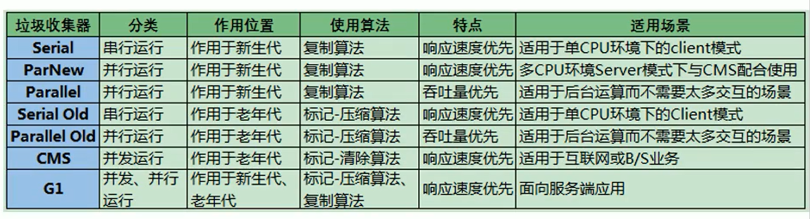

#### 蚂蚁金服

-   你知道哪几种垃圾回收器，各自的优缺点，重点讲一下cms和G1？
-   JVM GC算法有哪些，目前的JDK版本采用什么回收算法？
-   G1回收器讲下回收过程GC是什么？为什么要有GC？
-   GC的两种判定方法？CMS收集器与G1收集器的特点

#### 百度

-   说一下GC算法，分代回收说下
-   垃圾收集策略和算法

#### 天猫

-   JVM GC原理，JVM怎么回收内存
-   CMS特点，垃圾回收算法有哪些？各自的优缺点，他们共同的缺点是什么？

#### 滴滴

Java的垃圾回收器都有哪些，说下g1的应用场景，平时你是如何搭配使用垃圾回收器的

#### 京东

-   你知道哪几种垃圾收集器，各自的优缺点，重点讲下cms和G1，
-   包括原理，流程，优缺点。垃圾回收算法的实现原理

#### 阿里

-   讲一讲垃圾回收算法。
-   什么情况下触发垃圾回收？
-   如何选择合适的垃圾收集算法？
-   JVM有哪三种垃圾回收器？

#### 字节跳动

-   常见的垃圾回收器算法有哪些，各有什么优劣？
-   System.gc（）和Runtime.gc（）会做什么事情？
-   Java GC机制？GC Roots有哪些？
-   Java对象的回收方式，回收算法。
-   CMS和G1了解么，CMS解决什么问题，说一下回收的过程。
-   CMS回收停顿了几次，为什么要停顿两次?

#### 总结

+   说一下各个垃圾回收器的优缺点

CMS：

+   优点：并发收集，低延迟
+   缺点：产生内存碎片（标记清除算法）；无法处理浮动垃圾；

G1：

+   优点：采用分区回收算法，效率更高；空间连续，不会产生内存碎片；
+   缺点：并发程序，对性能要求高。

