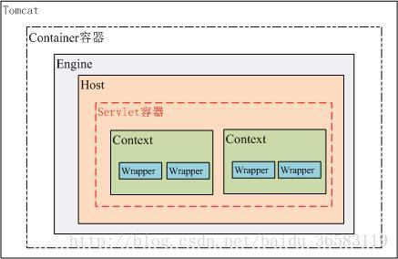
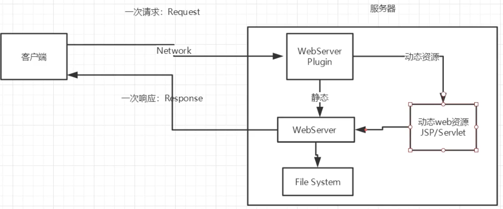
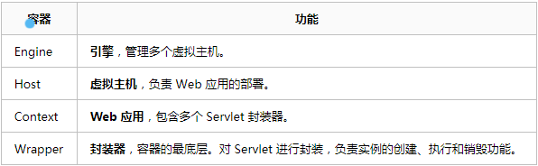
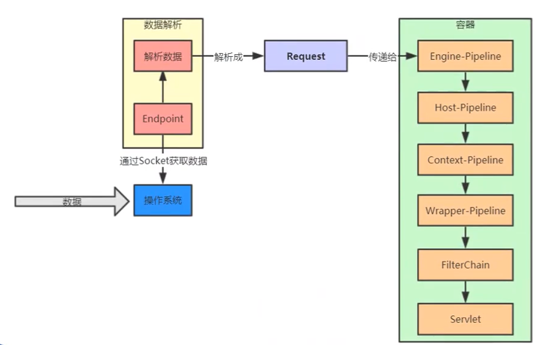
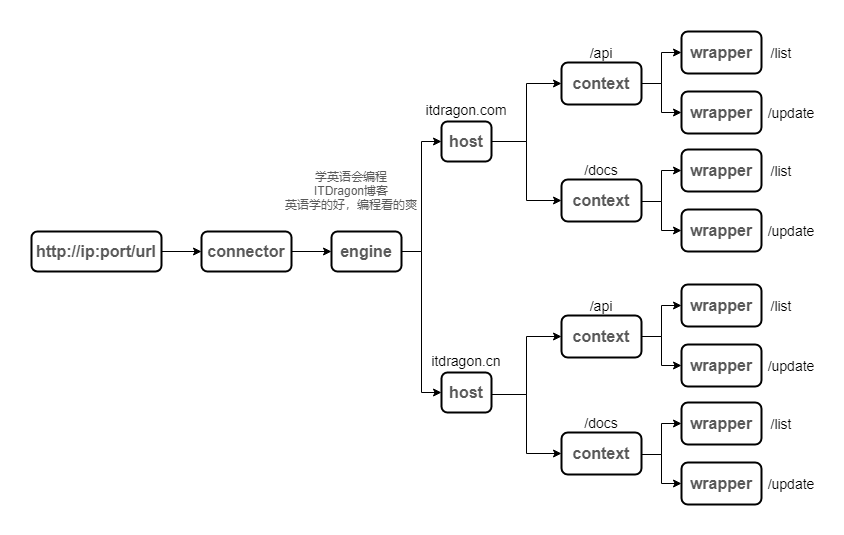
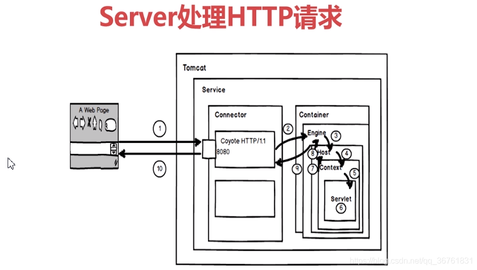

#### JavaWeb的概念

+   基于请求响应的格式

#### Web资源

+   静态资源：html，jpg等

+   动态资源asp，jsp，servlet等

    

    

#### 动态访问

#### Tomcat有四个容器

#### Tomcat架构平视图

+   第一步，通过Connector构建Request。具体表现：
    1.  在Connector类中调用`setProtocol`来设置对应的传输协议，从而加载 `org.apache.coyote.http11.Http11Protocol`。
    2.  在`Http11Protocol`中，初始化构建`EndPoint`，建立socket通信，获取、解析并返回数据。
    3.  Connector类利用解析的数据，抵用`createRequest`创建`request`。
+   第二步骤，通过四个容器类（Engine、Host、Context和Wrapper），对Request进行处理，最后找到指定的Servlet进行执行。

#### Tomcat如何处理一个请求

#### SpringBoot如何启动Tomcat

主要通过`refreshContext`函数，刷新上下文来创建服务器。

.png)

