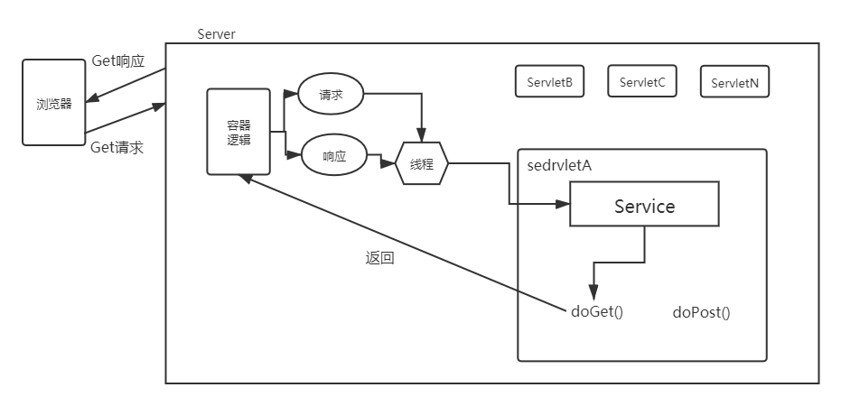
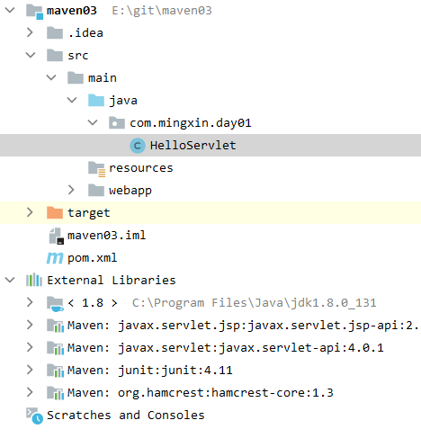
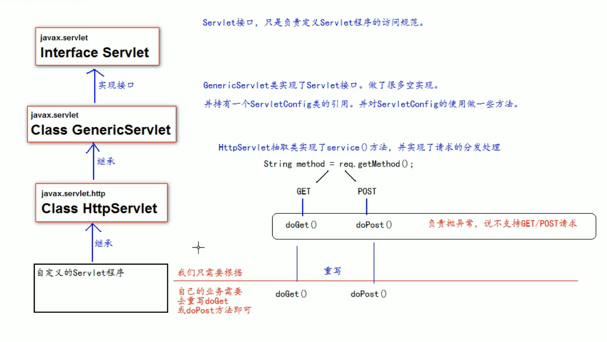
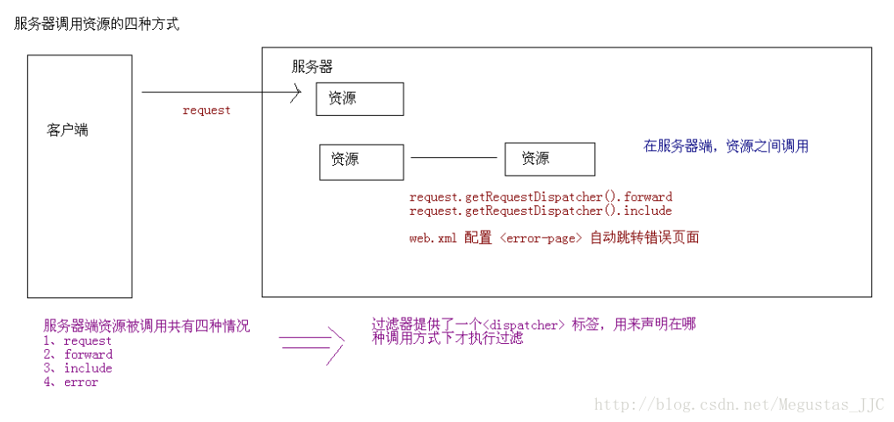
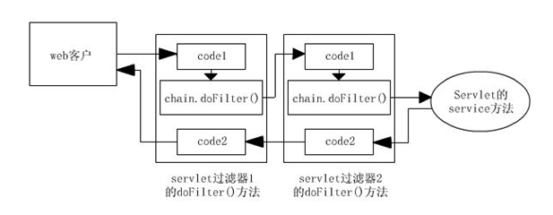

#### Servlet 简介

+   概念

    +   Servlet是java规范之一，规范就是接口
    +   Servlet是JavabWeb三大组件之一，三大分别是：Servlet程序、Filter过滤器、Listener监听器
    +   Servlet是运行再服务器上的一个小程序，用于接收客服端发送的请求。
    +   Java Servlet 是运行在 Web 服务器或应用服务器上的程序，它是作为来自 Web 浏览器或其他 HTTP 客户端的请求和 HTTP 服务器上的数据库或应用程序之间的中间层。

    

+   实现步骤
    +   编写一个类，实现Servlet接口
    +   将写好的Java部署到web服务器中

+   笔记
    +   新建一个java文件夹，一个resources

        

    +   在java文件夹中建立自己的Servlet文件

        ```java
        package com.mingxin.day01;
        
        import javax.servlet.ServletException;
        import javax.servlet.http.HttpServlet;
        import javax.servlet.http.HttpServletRequest;
        import javax.servlet.http.HttpServletResponse;
        import java.io.IOException;
        import java.io.PrintWriter;
        
        public class HelloServlet extends HttpServlet {
            @Override
            protected void doPost(HttpServletRequest req, HttpServletResponse resp) throws ServletException, IOException {
                PrintWriter writer = resp.getWriter();
                writer.println("Hello from China!");
        
            }
        
            @Override
            protected void doGet(HttpServletRequest req, HttpServletResponse resp) throws ServletException, IOException {
                PrintWriter writer = resp.getWriter();
                writer.println("Hello from China!");
            }
        }
        ```

    +   在web.xml中配置servlet

        ```java
        <?xml version="1.0" encoding="UTF-8"?>
        <web-app xmlns="http://xmlns.jcp.org/xml/ns/javaee"
                 xmlns:xsi="http://www.w3.org/2001/XMLSchema-instance"
                 xsi:schemaLocation="http://xmlns.jcp.org/xml/ns/javaee http://xmlns.jcp.org/xml/ns/javaee/web-app_3_1.xsd"
                 version="3.1">
            <servlet>
                <servlet-name>hello</servlet-name>
                <servlet-class>com.mingxin.day01.HelloServlet</servlet-class>
            </servlet>
            <servlet-mapping>
                <servlet-name>hello</servlet-name>
                <url-pattern>/hello</url-pattern>
            </servlet-mapping>
        </web-app>
        ```

    +   访问服务

        ```java
        http://localhost:8081/test/hello
        ```

    

#### Servlet 生命周期

+   基本周期


    +   1 构造器创建Servlet对象
    +   2 Servlet 初始化后调用 init () 方法
    +   3 Servlet 调用 service() 方法来处理客户端的请求。
    +   4 Servlet 销毁前调用 destroy() 方法。
    +   5 最后，Servlet 是由 JVM 的垃圾回收器进行垃圾回收的。

+  动图展示


+ UML图展示


#### Servelt 类的继承体系



#### ServeletConfig类机制

+   作用
    +   获取Servlet程序的别名，servlet-name的值得
    +   获取初始化参数 init-param
    +   获取ServletContext


#### ServletContext

+   ServletContext是一个接口，他表示Servlet上下文
+   一个web工程，只有一个ServletContext对象
+   ServletContext对象是一个域对象

+   作用
    +   获取web.xml中配置的上下文参数 context-param
    +   获取当前工程路径
    +   获取工程部署后再服务器硬盘上的绝对路径
    +   像Map一样存取数据

#### Filter 过滤器 [🔗](https://www.cnblogs.com/zhangyanran/p/10082187.html)

+   创建过程

    要编写一个过滤器必须实现Filter接口。实现其接口规定的方法。 

    +   实现javax.servlet.Filter接口 
    +   实现init方法，读取过滤器的初始化参数
    +   实现doFilter方法，完成对请求或响应的过滤
    +   调用FilterChain接口对象的doFilter方法，向后续的过滤器传递请求或响应

+   应用场景

    +   通过控制对chain.doFilter的方法的调用，来决定是否需要访问目标资源。
    +   通过在调用chain.doFilter方法之前，做些处理来达到某些目的。（比如，解决中文乱码的问题等等。）

+   Filter生命周期

    +   和Servlet一样Filter的创建和销毁也是由WEB服务器负责。不过与Servlet区别的是，

        +   1 在应用启动的时候就进行装载Filter类
        +   2 容器创建好Filter对象实例后，调用init()方法。接着被Web容器保存进应用级的集合容器中去了等待着，用户访问资源。
        +   3 当用户访问的资源正好被Filter的url-pattern拦截时，容器会取出Filter类调用doFilter方法，下次或多次访问被拦截的资源时，Web容器会直接取出指定Filter对象实例调用doFilter方法(Filter对象常驻留Web容器了)
        +   4 当应用服务被停止或重新装载了，则会执行Filter的destroy方法，Filter对象销毁。

    +   Filter什么时候被调用

        

        此时直接访问hello.jsp，由于REQUEST的设置，会执行过滤，同理，直接访问forward.jsp也会执行过滤（执行doFilter），因为FORWARD在forward转发时执行过滤（**可以同时添加多个对过滤方式进行设置**）。

        -   REQUEST：当用户直接访问页面时，Web容器将会调用过滤器。如果目标资源是通过RequestDispatcher的include()或forward()方法访问时，那么该过滤器就不会被调用。
        -   INCLUDE：如果目标资源是通过RequestDispatcher的`include()`方法访问时，那么该过滤器将被调用。除此之外，该过滤器不会被调用。
        -   FORWARD：如果目标资源是通过RequestDispatcher的`forward()`方法访问时，那么该过滤器将被调用，除此之外，该过滤器不会被调用。
        -   ERROR：如果目标资源是通过**声明式异常处理机制**调用时，那么该过滤器将被调用。除此之外，过滤器不会被调用。

        **如果想让过滤器执行，必须满足过滤方式 ！！！！ 如果forward、include 、error跳转时执行过滤 必须配置 dispatcher。**
        
        +   filter的执行方式
        
        

#### Servlet 注解 [Tomcat源代码](https://www.jb51.net/article/211196.htm)

+   Servlet3.0是Java EE6规范的一部分，Servlet3.0提供了注解(annotation)，使得不再需要在web.xml文件中进行Servlet的部署描述，简化开发流程。


#### Server处理HTTP请求 [🔗](https://blog.csdn.net/qq_36761831/article/details/89393203)


1.用户在浏览器中输入该网址，请求被发送到本机端口8080，被在那里监听的Coyote HTTP/1.1 Connector获得；

2.Connector把该请求交给它所在的Service的Engine（Container）来处理，并等待Engine的回应；

3.Engine获得请求localhost/test/index.jsp，匹配所有的虚拟主机Host；

4.Engine匹配到名为localhost的Host（即使匹配不到也把请求交给该Host处理，因为该Host被定义为该Engine的默认主机），名为localhost的Host获得请求/test/index.jsp，匹配它所拥有的所有Context。Host匹配到路径为/test的Context（如果匹配不到就把该请求交给路径名为“ ”的Context去处理）；

5.path=“/test”的Context获得请求/index.jsp，在它的mapping table中寻找出对应的Servlet。Context匹配到URL Pattern为*.jsp的Servlet，对应于JspServlet类；

6.构造HttpServletRequest对象和HttpServletResponse对象，作为参数调用JspServlet的doGet()或doPost(),执行业务逻辑、数据存储等；

7.Context把执行完之后的HttpServletResponse对象返回给Host；

8.Host把HttpServletResponse对象返回给Engine；

9.Engine把HttpServletResponse对象返回Connector；

10.Connector把HttpServletResponse对象返回给客户Browser。


#### 面试题，说出Servlet的声明周期

Servlet对象是用户第一次访问时创建，对象创建之后就驻留在内存里面了，响应后续的请求。Servlet对象一旦被创建，init()方法就会被执行，客户端的每次请求导致service()方法被执行，Servlet对象被摧毁时(Web服务器停止后或者Web应用从服务器里删除时)，destory()方法就会被执行。

#### 面试题，说说Servlet和Jsp的区别

Servlet

-   一种服务器端的Java应用程序
-   由 Web 容器加载和管理
-   用于生成动态 Web 内容
-   负责处理客户端请求

Jsp

-   是 Servlet 的扩展，本质上还是 Servlet
-   每个 Jsp 页面就是一个 Servlet 实例
-   Jsp 页面会被 Web 容器编译成 Servlet，Servlet 再负责响应用户请求

区别

-   Servlet 适合动态输出 Web 数据和业务逻辑处理，对于 html 页面内容的修改非常不方便；Jsp 是在 Html 代码中嵌入 Java 代码，适合页面的显示

-   内置对象不同，获取内置对象的方式不同

-   Servlet和JSP最主要的不同点在于，Servlet的应用逻辑是在Java文件中，并且完全从表示层中的HTML里分离开

    来。而JSP是Java和HTML组合成一个扩展名为.jsp的文件。

#### 面试题，页面间传递对象的方法

+   request，session，application，cookie等

#### 面试题， 四种会话跟踪技术

会话作用域ServletsJSP 页面描述

1）page否是代表与一个页面相关的对象和属性。一个页面由一个编译好的 Java servlet 类（可以带有任何的 include 指令，但是没有 include 动作）表示。这既包括 servlet 又包括被编译成 servlet 的 JSP 页面

2）request是是代表与 Web 客户机发出的一个请求相关的对象和属性。一个请求可能跨越多个页面，涉及多个 Web 组件（由于 forward 指令和 include 动作的关系）

3）session是是代表与用于某个 Web 客户机的一个用户体验相关的对象和属性。一个 Web 会话可以也经常会跨越多个客户机请求

4）application是是代表与整个 Web 应用程序相关的对象和属性。这实质上是跨越整个 Web 应用程序，包括多个页面、请求和会话的一个全局作用域

#### 面试题，Servlet如何维持会话 [🔗](https://blog.csdn.net/gavin_john/article/details/51355292)

 当浏览器第一次访问服务器时，服务器会创建session对象(该对象有一个唯一的id,一般称之为sessionId),接下来服务器会将sessionId以cookie的方式发送给浏览器。

#### 面试题，Servlet如何通信

当我们想从servlet服务方法中调用另一个servlet时，我们使用servlet间通信机制。 我们可以使用RequestDispatcher forward（）和include（）方法调用另一个servlet，并在请求中提供其他属性以供其他servlet使用。