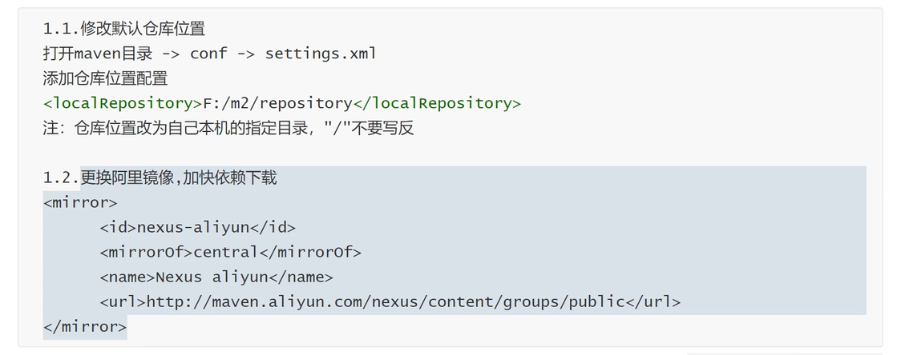

#### Maven 修改镜像和仓库




#### IDEA 配置


#### Maven的四大特性

+   依赖管理系统
+   多模块构建
+   一致的项目结构
+   一致的构建模型和插件机制

 

#### Maven 的目录结构

```markdown
---basedir
      |-----pom.xml
      |-----src
             |-----main
                    |-----java
                    |-----resources
      		|-----test
                    |-----java
                    |-----resources
```


#### Maven 普通项目的编译和运行

+   编译

    ```java
    mvn compile
    ```

+   运行

    ```java
    mvn exec:java -D exec.mainClass="com.mingxin.day01.Hello"
    ```


#### Maven Web-App项目

+   修改java jdk版本

```xml
  <properties>
    <project.build.sourceEncoding>UTF-8</project.build.sourceEncoding>
    <maven.compiler.source>1.8</maven.compiler.source>
    <maven.compiler.target>1.8</maven.compiler.target>
  </properties>
```

+   修改junit依赖项

    ```xml
      <dependencies>
        <dependency>
          <groupId>junit</groupId>
          <artifactId>junit</artifactId>
          <version>4.11</version>
          <scope>test</scope>
        </dependency>
      </dependencies>
    ```

+   tomcat和jetty插件

```xml
  <build>
    <finalName>maven03</finalName>
    <plugins>
      <plugin>
        <groupId>org.mortbay.jetty</groupId>
        <artifactId>maven-jetty-plugin</artifactId>
        <version>6.1.25</version>
        <configuration>
          <scanIntervalSeconds>5</scanIntervalSeconds>
          <contextPath>/maven03</contextPath>
          <connectors>
            <connector implementation="org.mortbay.jetty.nio.SelectChannelConnector">
              <port>9090</port>
            </connector>
          </connectors>
        </configuration>
      </plugin>

      <plugin>
        <groupId>org.apache.tomcat.maven</groupId>
        <artifactId>tomcat7-maven-plugin</artifactId>
        <version>2.1</version>
        <configuration>
          <port>8081</port>
          <path>/test</path>
          <uriEncoding>UTF-8</uriEncoding>
          <server>tomcat7</server>
        </configuration>
      </plugin>
    </plugins>
</build>
```


#### Maven 依赖和插件的区别

依赖：相当于python编写时候的库函数，这对程序编写直接相关。

插件：用于运行任务的jar文件。

**Plugin** is a tool you use at the execution of your maven build

**Dependency** means kind of any library which you will use in your code

