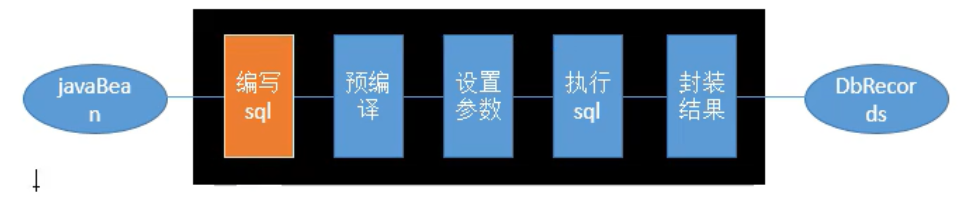
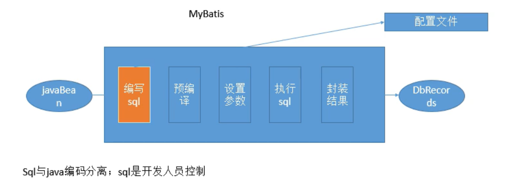
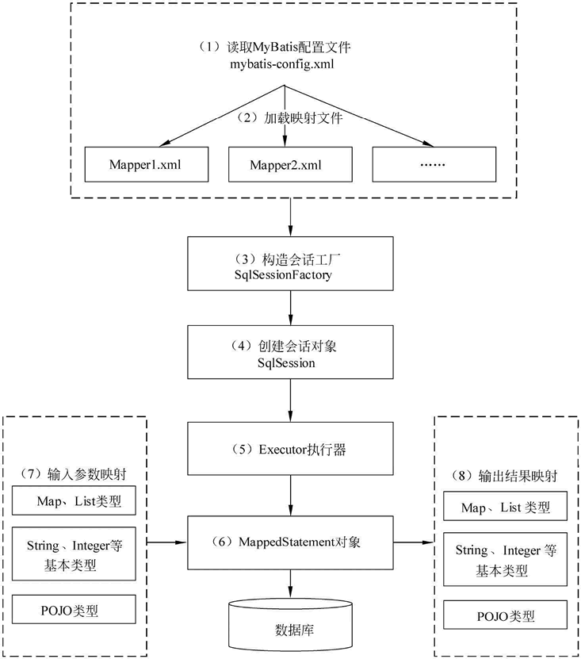

## 1. 简介

#### 1.1 Mybatis 概念

+   **持久层**框架
+   支持自定义SQL

#### 1.2持久化

数据持久化

+   持久化就是将层序的数据放在持久状态和瞬时状态转化的过程
+   内存：断电即失
+   数据库：文件持久化

为什么需要持久化

+   有一些对象，不想失去
+   内存太贵

#### 1.3 持久层

Dao层、Service层、Controller层

+   完成持久化工作的代码块

#### 1.4 为什么需要MyBatis

+   方便
+   传统JDBC太复杂，简化；
+   不用MyBatis也可以

#### 1.5 ORM

对象关系映射，旨在消除sql。



希望，sql是由程序员操作。

Mybatis是半自动框架，是通过引入配置文件，来完成sql的编写



#### 1.6 helloword 例子

**xml文件全部放在resource文件下**

+   创建一个`mybatis-config.xml`文件

```xml
<?xml version="1.0" encoding="utf-8"?>
<!DOCTYPE configuration PUBLIC "-//mybatis.org//DTD Config 3.0//EN"
        "http://mybatis.org/dtd/mybatis-3-config.dtd">
<configuration>
    <environments default="development">
        <environment id="development">
            <!-- 使用JDBC的事务管理 -->
            <transactionManager type="JDBC" />
            <dataSource type="POOLED">
                <!-- MySQL数据库驱动 -->
                <property name="driver" value="com.mysql.jdbc.Driver" />
                <!-- 连接数据库的URL -->
                <property name="url"
                          value="jdbc:mysql://localhost:3306/w3cshool?characterEncoding=utf8" />
                <property name="username" value="root" />
                <property name="password" value="123" />
            </dataSource>
        </environment>
    </environments>
    <!-- 将mapper文件加入到配置文件中 -->
    <mappers>
        <mapper resource="AccountantMapper.xml" />
    </mappers>
</configuration>
```

+   创建一个`AccountantMapper.xml`

```xml
<?xml version="1.0" encoding="UTF-8"?>
<!DOCTYPE mapper
        PUBLIC "-//mybatis.org//DTD Mapper 3.0//EN"
        "http://mybatis.org/dtd/mybatis-3-mapper.dtd">
        <mapper namespace="AccountantMapper">          <!-- 命名空间 -->
        <!-- 根据uid查询一个用户信息 -->
        <select id="selectAccountantById" parameterType="String"  resultType="mybatis.Accountant">
                select * from accountant where id = #{id}
        </select>

</mapper>
```

+   测试

```java
    @Test
    public void test11() throws IOException {
        String resource = "mybatis-config.xml";
        // 1. 根据xml文件，创建一个SqlSessionFactory对象
        InputStream inputStream = Resources.getResourceAsStream(resource);
        SqlSessionFactory sqlSessionFactory = new SqlSessionFactoryBuilder().build(inputStream);
        // 2. 获取SqlSession对象
        SqlSession sqlSession = sqlSessionFactory.openSession();
        // 3. 查询sql
        Accountant accountant = sqlSession.selectOne("AccountantMapper.selectAccountantById","1001");
        System.out.println(accountant);
        sqlSession.close();

    }
```


**更多的操作例子：**
+ Mapper 文件
```xml
<?xml version="1.0" encoding="UTF-8"?>
<!DOCTYPE mapper
        PUBLIC "-//mybatis.org//DTD Mapper 3.0//EN"
        "http://mybatis.org/dtd/mybatis-3-mapper.dtd">
        <mapper namespace="dao.AccountantMapper">
        <!-- 根据uid查询一个用户信息 -->
        <select id="selectAccountantById" parameterType="String"  resultType="acc">
                select * from accountant where id = #{id}
        </select>
        <select id="selectAccountants" resultType="acc">
                select * from accountant;
        </select>
            <!-- 注意这个标签 -->
        <insert id="insertAccountant" parameterType="mybatis.Accountant" >
                insert into accountant(id,name,money) values(#{id},#{name},#{money})
        </insert>

        <update id="updateAccountant" parameterType="mybatis.Accountant" >
                update accountant set name=#{name},money=#{money} where id=#{id};
        </update>

</mapper>
```

+ 测试
```java
    @Test
    public void test11() throws IOException {
        String resource = "mybatis-config.xml";
        // 1. 根据xml文件，创建一个SqlSessionFactory对象
        InputStream inputStream = Resources.getResourceAsStream(resource);
        SqlSessionFactory sqlSessionFactory = new SqlSessionFactoryBuilder().build(inputStream);
        // 2. 获取SqlSession对象，默认是关闭事务自动提交的
        SqlSession sqlSession = sqlSessionFactory.openSession();
        // 3. 增删改查一个数据 sql
        // 查询
        Accountant accountant = sqlSession.selectOne("AccountantMapper.selectAccountantById","1001");
        System.out.println(accountant);

        // 查询所有数据
        List<Accountant> objects = sqlSession.selectList("AccountantMapper.selectAccountants");
        for (Accountant object : objects) {
            System.out.println(object);
        }


        // 增加
        Accountant addAcountant = new Accountant();
        addAcountant.setId("1003");
        addAcountant.setName("Trump");
        addAcountant.setMoney(9023.0);
        int insert = sqlSession.insert("AccountantMapper.insertAccountant", addAcountant);
        System.out.println("insert result:" + insert);

        // 修改
        Accountant updateAcountant = new Accountant();
        updateAcountant.setId("1003");
        updateAcountant.setName("Biden");
        updateAcountant.setMoney(45.0);
        int update = sqlSession.insert("AccountantMapper.updateAccountant", updateAcountant);
        System.out.println("update result:" + update);

        sqlSession.commit();
        sqlSession.close();
    }
```

#### 1.7 MyBatis实现映射器的两种方式

+   xml文件形式

用 XML 定义映射器分为两个部分：接口和 XML。先定义一个映射器接口，如下所示。

```xml
package com.mybatis.mapper;
import com.mybatis.po.Role;
public interface RoleMapper {
    public Role getRole(Long id);
}
```

在用 XML 方式创建 mybatis 的配置文件中有这样一段代码：

```xml
<mapper resource="com/mybatis/mapper/RoleMapper.xml" />
```

用xml创建映射器

```xml
<?xml version="1.0" encoding="UTF-8"?>
<!DOCTYPE mapper
PUBLIC "-//mybatis.org//DTD Mapper 3.0//EN"
"http://mybatis.org/dtd/mybatis-3-mapper.dtd">
<mapper namespace="com.mybatis.mapper.RoleMapper">
    <select id="getRole" parameterType="long" resultType="role">
        SELECT id,role_name as roleName,note FROM role WHERE id =#{id}
    </select>
</mapper>
```

select 元素表明这是一条查询语句，而属性 id 标识了这条 SQL，属性 parameterType="long" 说明传递给 SQL 的是一个 long 型的参数，而 resultType="role" 表示返回的是一个 role 类型的返回值。而 role 是之前配置文件 mybatis-config.xml 配置的别名，指代的是 com.mybatis.po.Role

这条 SQL 中的 #{id} 表示传递进去的参数。
注意，我们并没有配置 SQL 执行后和 role 的对应关系，它是如何映射的呢？
其实这里采用的是一种被称为自动映射的功能，MyBatis 在默认情况下提供自动映射，只要 SQL 返回的列名能和 POJO 对应起来即可。
这里 SQL 返回的列名 id 和 note 是可以和之前定义的 POJO 的属性对应起来的，而表里的列 role_name 通过 SQL 别名的改写，使其成为 roleName，也是和 POJO 对应起来的，所以此时 MyBatis 就可以把 SQL 查询的结果通过自动映射的功能映射成为一个 POJO。

+   注解方式

```java
package com.mybatis.mapper;
import org.apache.ibatis.annotations.Select;
import com.mybatis.po.Role;
public interface RoleMapper2 {
    @Select("select id,role_name as roleName,note from t_role where id=#{id}")
    public Role getRole(Long id);
}
```


## 2. Mybatis配置文件

配置文件，基本元素如下：

```xml
<?xml version="1.0" encoding="utf-8"?>
<!DOCTYPE configuration PUBLIC "-//mybatis.org//DTD Config 3.0//EN"
"http://mybatis.org/dtd/mybatis-3-config.dtd">
<configuration><!-- 配置 -->
    <properties /><!-- 属性 -->
    <settings /><!-- 设置 -->
    <typeAliases /><!-- 类型命名 -->
    <typeHandlers /><!-- 类型处理器 -->
    <objectFactory /><!-- 对象工厂 -->
    <plugins /><!-- 插件 -->
    <environments><!-- 配置环境 -->
        <environment><!-- 环境变量 -->
            <transactionManager /><!-- 事务管理器 -->
            <dataSource /><!-- 数据源 -->
        </environment>
    </environments>
    <databaseIdProvider /><!-- 数据库厂商标识 -->
    <mappers /><!-- 映射器 -->
</configuration>
```


#### 2.1  properties

属性文件放置数据库的配置信息。


#### 2.2 setttings

放置一些设置文件，比如将下划线转成驼峰。

```xml
<settings>
        <setting name="mapUnderscoreToCamelCase" value="true"/>
</settings>
```


#### 2.3 typeAlias

别名

```xml
    <typeAliases>
        <typeAlias type="mybatis.Accountant" alias="acc"/>
    </typeAliases>
```


#### 2.4 typeHandler

架起java对象和数据库对象的桥梁。可以自型注册一些类型handler。


#### 2.5 插件

插件可以拦截到

+   Executor
+   ParameterHandler
+   ResultSetHandler
+   StatementHandler


#### 2.6 environment

必须包含两个标签：transactionManager，dataSource

transactionManager有两种，一种是JDBC（按照JDBC的方式进行事务管理），一种是MANAGER（按照j2ee服务器的方式进行事务管理）

dataSource支持三种，POOLED、UNPOOLED以及JDNI三种方式，是否连接池。


#### 2.7 mapper

注册一个sql映射。


## 3. Mybatis 各组件声明周期



我们已经掌握了 MyBatis 组件的创建及其基本应用，但这是远远不够的，还需要讨论其生命周期。

生命周期是组件的重要问题，尤其是在多线程的环境中，比如互联网应用、Socket 请求等，而 MyBatis 也常用于多线程的环境中，错误使用会造成严重的多线程并发问题，为了正确编写 MyBatis 的应用程序，我们需要掌握 MyBatis 组件的生命周期。

所谓生命周期就是每一个对象应该存活的时间，比如一些对象一次用完后就要关闭，使它们被 [Java](http://c.biancheng.net/java/) 虚拟机（JVM）销毁，以避免继续占用资源，所以我们会根据每一个组件的作用去确定其生命周期。

#### SqlSessionFactoryBuilder

SqlSessionFactoryBuilder 的作用在于创建 SqlSessionFactory，创建成功后，SqlSessionFactoryBuilder 就失去了作用，所以它只能存在于创建 SqlSessionFactory 的方法中，而不要让其长期存在。因此 SqlSessionFactoryBuilder 实例的最佳作用域是方法作用域（也就是局部方法变量）。

#### SqlSessionFactory

SqlSessionFactory 可以被认为是一个数据库连接池，它的作用是创建 SqlSession 接口对象。因为 MyBatis 的本质就是 Java 对数据库的操作，所以 SqlSessionFactory 的生命周期存在于整个 MyBatis 的应用之中，所以一旦创建了 SqlSessionFactory，就要长期保存它，直至不再使用 MyBatis 应用，所以可以认为 SqlSessionFactory 的生命周期就等同于 MyBatis 的应用周期。

由于 SqlSessionFactory 是一个对数据库的连接池，所以它占据着数据库的连接资源。如果创建多个 SqlSessionFactory，那么就存在多个数据库连接池，这样不利于对数据库资源的控制，也会导致数据库连接资源被消耗光，出现系统宕机等情况，所以尽量避免发生这样的情况。

因此在一般的应用中我们往往希望 SqlSessionFactory 作为一个单例，让它在应用中被共享。所以说 SqlSessionFactory 的最佳作用域是应用作用域。

#### SqlSession

如果说 SqlSessionFactory 相当于数据库连接池，那么 SqlSession 就相当于一个数据库连接（Connection 对象），你可以在一个事务里面执行多条 SQL，然后通过它的 commit、rollback 等方法，提交或者回滚事务。

所以它应该存活在一个业务请求中，处理完整个请求后，应该关闭这条连接，让它归还给 SqlSessionFactory，否则数据库资源就很快被耗费精光，系统就会瘫痪，所以用 try...catch...finally... 语句来保证其正确关闭。

所以 SqlSession 的最佳的作用域是请求或方法作用域。

#### Mapper

Mapper 是一个接口，它由 SqlSession 所创建，所以它的最大生命周期至多和 SqlSession 保持一致，尽管它很好用，但是由于 SqlSession 的关闭，它的数据库连接资源也会消失，所以它的生命周期应该小于等于 SqlSession 的生命周期。Mapper 代表的是一个请求中的业务处理，所以它应该在一个请求中，一旦处理完了相关的业务，就应该废弃它


#### **1.#{}和${}的区别是什么？**

${}是Properties文件中的变量占位符，它可以用于标签属性值和sql内部，属于静态文本替换，比如${driver}会被静态替换为com.mysql.jdbc.Driver。

\#{}是sql的参数占位符，Mybatis会将sql中的#{}替换为?号，在sql执行前会使用PreparedStatement的参数设置方法，按序给sql的?号占位符设置参数值，比如ps.setInt(0, parameterValue)，#{item.name}的取值方式为使用反射从参数对象中获取item对象的name属性值，相当于param.getItem().getName()。

[](javascript:void(0);)

```
#{}是预编译处理，${}是字符串替换。

Mybatis在处理#{}时，会将sql中的#{}替换为?号，调用PreparedStatement的set方法来赋值；

Mybatis在处理${}时，就是把${}替换成变量的值。

使用#{}可以有效的防止SQL注入，提高系统安全性。
一般能用#的就别用$
$方式一般用于传入数据库对象，例如传入表名.
```

[](javascript:void(0);)

用法

```
select * from user where name = #{name}; 
select * from user where name = '${name}'; 
必须加单引号
```

#### **2.为什么说Mybatis是半自动ORM映射工具？它与全自动的区别在哪里？**

Hibernate属于全自动ORM映射工具，使用Hibernate查询关联对象或者关联集合对象时，可以根据对象关系模型直接获取，所以它是全自动的。

而Mybatis在查询关联对象或关联集合对象时，需要手动编写sql来完成，所以，称之为半自动ORM映射工具。

（2）Mybatis直接编写原生态sql，可以严格控制sql执行性能，灵活度高，非常适合对关系数据模型要求不高的软件开发，因为这类软件需求变化频繁，一但需求变化要求迅速输出成果。但是灵活的前提是mybatis无法做到数据库无关性，如果需要实现支持多种数据库的软件，则需要自定义多套sql映射文件，工作量大。 

（3）Hibernate对象/关系映射能力强，数据库无关性好，对于关系模型要求高的软件，如果用hibernate开发可以节省很多代码，提高效率。 
**3.mybatis的优点缺点。**

Mybaits的优点：

（1）基于SQL语句编程，相当灵活，不会对应用程序或者数据库的现有设计造成任何影响，SQL写在XML里，解除sql与程序代码的耦合，便于统一管理；提供XML标签，支持编写动态SQL语句，并可重用。

（2）与JDBC相比，减少了50%以上的代码量，消除了JDBC大量冗余的代码，不需要手动开关连接；

（3）很好的与各种数据库兼容（因为MyBatis使用JDBC来连接数据库，所以只要JDBC支持的数据库MyBatis都支持）。

（4）能够与Spring很好的集成；

（5）提供映射标签，支持对象与数据库的ORM字段关系映射；提供对象关系映射标签，支持对象关系组件维护。

MyBatis框架的缺点：

（1）SQL语句的编写工作量较大，尤其当字段多、关联表多时，对开发人员编写SQL语句的功底有一定要求。

（2）SQL语句依赖于数据库，导致数据库移植性差，不能随意更换数据库。

MyBatis框架适用场合：

（1）MyBatis专注于SQL本身，是一个足够灵活的DAO层解决方案。

（2）对性能的要求很高，或者需求变化较多的项目，如互联网项目，MyBatis将是不错的选择。

#### 4、Xml映射文件中，除了常见的select|insert|updae|delete标签之外，还有哪些标签？

答：还有很多其他的标签，<resultMap>、<parameterMap>、<sql>、<include>、<selectKey>，加上动态sql的9个标签，trim|where|set|foreach|if|choose|when|otherwise|bind等，其中<sql>为sql片段标签，通过<include>标签引入sql片段，<selectKey>为不支持自增的主键生成策略标签。

#### 5、最佳实践中，通常一个Xml映射文件，都会写一个Dao接口与之对应，请问，这个Dao接口的工作原理是什么？Dao接口里的方法，参数不同时，方法能重载吗？

Dao接口，就是人们常说的Mapper接口，接口的全限名，就是映射文件中的namespace的值，接口的方法名，就是映射文件中MappedStatement的id值，接口方法内的参数，就是传递给sql的参数。Mapper接口是没有实现类的，当调用接口方法时，接口全限名+方法名拼接字符串作为key值，可唯一定位一个MappedStatement

com.mybatis3.mappers.StudentDao.findStudentById，可以唯一找到namespace为com.mybatis3.mappers.StudentDao下面id = findStudentById的MappedStatement。在Mybatis中，每一个<select>、<insert>、<update>、<delete>标签，都会被解析为一个MappedStatement对象。

Dao接口里的方法，是不能重载的，因为是全限名+方法名的保存和寻找策略。

Dao接口的工作原理是JDK动态代理，Mybatis运行时会使用JDK动态代理为Dao接口生成代理proxy对象，代理对象proxy会拦截接口方法，转而执行MappedStatement所代表的sql，然后将sql执行结果返回。

#### 6、Mybatis是如何进行分页的？分页插件的原理是什么？

Mybatis使用RowBounds对象进行分页，它是针对ResultSet结果集执行的内存分页，而非物理分页，可以在sql内直接书写带有物理分页的参数来完成物理分页功能，也可以使用分页插件来完成物理分页。

分页插件的基本原理是使用Mybatis提供的插件接口，实现自定义插件，在插件的拦截方法内拦截待执行的sql，然后重写sql，根据dialect方言，添加对应的物理分页语句和物理分页参数。

举例：select * from student，拦截sql后重写为：select t.* from （select * from student）t limit 0，10

详见：[mybatis的两种分页方式:RowBounds和PageHelper](https://www.cnblogs.com/lukelook/p/11099382.html)

[](javascript:void(0);)

```
 //引入分页查询，使用PageHelper分页功能
    //在查询之前传入当前页，然后多少记录
    PageHelper.offsetPage(2, 2);
    
     //startPage后紧跟的这个查询就是分页查询    

    List<Honor> honors = studentMapper.getHonorList();
```

[](javascript:void(0);)

#### 7、Mybatis执行批量插入，能返回数据库主键列表吗？

能，JDBC都能，Mybatis当然也能。

1、对于支持生成自增主键的数据库：增加 useGenerateKeys和keyProperty ，<insert>标签属性。

2、不支持生成自增主键的数据库：使用<selectKey>。

[](javascript:void(0);)

```
<insert id="insertAuthor" useGeneratedKeys="true"
    keyProperty="id">
  insert into Author (username, password, email, bio) values
  <foreach item="item" collection="list" separator=",">
    (#{item.username}, #{item.password}, #{item.email}, #{item.bio})
  </foreach>
</insert>
```

[](javascript:void(0);)

从官网资料可以看出Mybatis是支持批量插入时返回自增主键的。

但是在本地测试的时候使用上述方式确实不能返回自增id，而且还报错（不认识keyProperty中指定的Id属性），然后在网上找相关资料。终于在Stackoverflow上面找到了一些信息。

解决办法：

1、升级Mybatis版本到3.3.1。官方在这个版本中加入了批量新增返回主键id的功能

2、在Dao中不能使用@param注解。

3、Mapper.xml中使用list变量（parameterType="[Java](http://lib.csdn.net/base/java).util.List"）接受Dao中的参数集合。

下面是具体代码过程，可供参考

[](javascript:void(0);)

```
<!-- 批量新增 -->  
    <insert id="batchInsert" parameterType="java.util.List" useGeneratedKeys="true" keyProperty="id" >  
        INSERT INTO  
        <include refid="t_shop_resource" />  
        (relation_id, summary_id, relation_type)  
        VALUES  
        <foreach collection="list" index="index" item="shopResource" separator=",">  
            (  
                #{shopResource.relationId}, #{shopResource.summaryId}, #{shopResource.relationType}  
            )  
        </foreach>  
    </insert>  
```

[](javascript:void(0);)

```
public List<ShopResource> batchinsertCallId(List<ShopResource> shopResourceList){  
        this.getSqlSession().insert(getStatement(SQL_BATCH_INSERT_CALL_ID), shopResourceList);  
        return shopResourceList;// 重点介绍  
    }  
```

为什么最后返回的参数不是挑用mybatis后的insert的返回值呢，细心的话可以发现，如果使用debug模式观察，会看到调用mybatis后insert的返回值是[]，也就是空集合元素.

在mybatis3.3.1中，虽然加入了批量新增返回主键id的功能，但是它是这样运行的，在需要新增插入新元素集合对象时，它会需要参数对象，当执行完插入操作后，给之前的参数对象设置id值，也就是改变了需要插入对象集合中的元素的属性id值， *所以接收返回时，返回方法形参参数即可，同样的地址引用改变了内容，返回后的集合也是改变后的集合。*

#### 8、Mybatis动态sql是做什么的？都有哪些动态sql？能简述一下动态sql的执行原理不？

答：Mybatis动态sql可以让我们在Xml映射文件内，以标签的形式编写动态sql，完成逻辑判断和动态拼接sql的功能，Mybatis提供了9种动态sql标签trim|where|set|foreach|if|choose|when|otherwise|bind。

其执行原理为，使用OGNL从sql参数对象中计算表达式的值，根据表达式的值动态拼接sql，以此来完成动态sql的功能。

#### 9、Mybatis是否支持延迟加载？如果支持，它的实现原理是什么？

Mybatis仅支持association关联对象和collection关联集合对象的延迟加载，association指的就是一对一，collection指的就是一对多查询。在Mybatis配置文件中，可以配置是否启用延迟加载lazyLoadingEnabled=true|false。

它的原理是，使用CGLIB创建目标对象的代理对象，当调用目标方法时，进入拦截器方法，比如调用a.getB().getName()，拦截器invoke()方法发现a.getB()是null值，那么就会单独发送事先保存好的查询关联B对象的sql，把B查询上来，然后调用a.setB(b)，于是a的对象b属性就有值了，接着完成a.getB().getName()方法的调用。这就是延迟加载的基本原理。

当然了，不光是Mybatis，几乎所有的包括Hibernate，支持延迟加载的原理都是一样的。

#### 10、Mybatis的Xml映射文件中，不同的Xml映射文件，id是否可以重复？

答：不同的Xml映射文件，如果配置了namespace，那么id可以重复；如果没有配置namespace，那么id不能重复；毕竟namespace不是必须的，只是最佳实践而已。

原因就是namespace+id是作为Map<String, MappedStatement>的key使用的，如果没有namespace，就剩下id，那么，id重复会导致数据互相覆盖。有了namespace，自然id就可以重复，namespace不同，namespace+id自然也就不同。

#### 11、Mybatis映射文件中，如果A标签通过include引用了B标签的内容，请问，B标签能否定义在A标签的后面，还是说必须定义在A标签的前面？

答：虽然Mybatis解析Xml映射文件是按照顺序解析的，但是，被引用的B标签依然可以定义在任何地方，Mybatis都可以正确识别。

原理是，Mybatis解析A标签，发现A标签引用了B标签，但是B标签尚未解析到，尚不存在，此时，Mybatis会将A标签标记为未解析状态，然后继续解析余下的标签，包含B标签，待所有标签解析完毕，Mybatis会重新解析那些被标记为未解析的标签，此时再解析A标签时，B标签已经存在，A标签也就可以正常解析完成了。

**12.当实体类中的属性名和表中的字段名不一样 ，怎么办 ？**

**第1种： 通过在查询的sql语句中定义字段名的别名，让字段名的别名和实体类的属性名一致。**

```
    <select id=”selectorder” parametertype=”int” resultetype=”me.gacl.domain.order”>
       select order_id id, order_no orderno ,order_price price form orders where order_id=#{id};
    </select>
```

第2种： 通过<resultMap>来映射字段名和实体类属性名的一一对应的关系。

 

13、Mybatis都有哪些Executor执行器？它们之间的区别是什么？

答：Mybatis有三种基本的Executor执行器，**SimpleExecutor、ReuseExecutor、BatchExecutor。**

**SimpleExecutor：**每执行一次update或select，就开启一个Statement对象，用完立刻关闭Statement对象。

**ReuseExecutor：**执行update或select，以sql作为key查找Statement对象，存在就使用，不存在就创建，用完后，不关闭Statement对象，而是放置于Map<String, Statement>内，供下一次使用。简言之，就是重复使用Statement对象。

**BatchExecutor：**执行update（没有select，JDBC批处理不支持select），将所有sql都添加到批处理中（addBatch()），等待统一执行（executeBatch()），它缓存了多个Statement对象，每个Statement对象都是addBatch()完毕后，等待逐一执行executeBatch()批处理。与JDBC批处理相同。

作用范围：Executor的这些特点，都严格限制在SqlSession生命周期范围内。

14。

、Mybatis的一级、二级缓存:

1）一级缓存: 基于 PerpetualCache 的 HashMap 本地缓存，其存储作用域为 Session，当 Session flush 或 close 之后，该 Session 中的所有 Cache 就将清空，默认打开一级缓存。

2）二级缓存与一级缓存其机制相同，默认也是采用 PerpetualCache，HashMap 存储，不同在于其存储作用域为 Mapper(Namespace)，并且可自定义存储源，如 Ehcache。默认不打开二级缓存，要开启二级缓存，使用二级缓存属性类需要实现Serializable序列化接口(可用来保存对象的状态),可在它的映射文件中配置<cache/> ；

3）对于缓存数据更新机制，当某一个作用域(一级缓存 Session/二级缓存Namespaces)的进行了C/U/D 操作后，默认该作用域下所有 select 中的缓存将被 clear。

15、使用MyBatis的mapper接口调用时有哪些要求？

① Mapper接口方法名和mapper.xml中定义的每个sql的id相同；
② Mapper接口方法的输入参数类型和mapper.xml中定义的每个sql 的parameterType的类型相同；
③ Mapper接口方法的输出参数类型和mapper.xml中定义的每个sql的resultType的类型相同；
④ Mapper.xml文件中的namespace即是mapper接口的类路径。

16、简述Mybatis的插件运行原理，以及如何编写一个插件。

答：Mybatis仅可以编写针对ParameterHandler、ResultSetHandler、StatementHandler、Executor这4种接口的插件，Mybatis使用JDK的动态代理，为需要拦截的接口生成代理对象以实现接口方法拦截功能，每当执行这4种接口对象的方法时，就会进入拦截方法，具体就是InvocationHandler的invoke()方法，当然，只会拦截那些你指定需要拦截的方法。

编写插件：实现Mybatis的Interceptor接口并复写intercept()方法，然后在给插件编写注解，指定要拦截哪一个接口的哪些方法即可，记住，别忘了在配置文件中配置你编写的插件。
