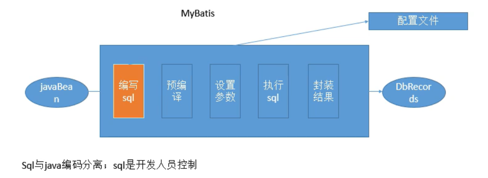

[🔗](十道常见的mybatis面试题 - java架构的文章 - 知乎 https://zhuanlan.zhihu.com/p/61432692)

#### MyBatis 面试

+ #{}和${}的区别是什么？

    #{}是预编译处理，${}是字符串替换。

    Mybatis在处理#{}时，会将sql中的#{}替换为?号，调用PreparedStatement的set方法来赋值；

    Mybatis在处理${}时，就是把${}替换成变量的值。

    使用#{}可以有效的防止SQL注入，提高系统安全性。
    一般能用#的就别用$
    $方式一般用于传入数据库对象，例如传入表名.

+ 为什么说Mybatis是半自动ORM映射工具？它与全自动的区别在哪里？

    

    1. Hibernate属于全自动ORM映射工具，使用Hibernate查询关联对象或者关联集合对象时，可以根据对象关系模型直接获取，所以它是全自动的。

    2. 而Mybatis在查询关联对象或关联集合对象时，需要手动编写sql来完成，所以，称之为半自动ORM映射工具。

    3. Mybatis直接编写原生态sql，可以严格控制sql执行性能，灵活度高，非常适合对关系数据模型要求不高的软件开发，因为这类软件需求变化频繁，一但需求变化要求迅速输出成果。但是灵活的前提是mybatis无法做到数据库无关性，如果需要实现支持多种数据库的软件，则需要自定义多套sql映射文件，工作量大。 

    4. Hibernate对象/关系映射能力强，数据库无关性好，对于关系模型要求高的软件，如果用hibernate开发可以节省很多代码，提高效率。