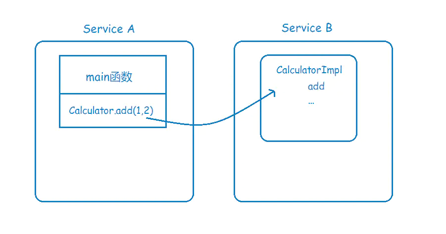
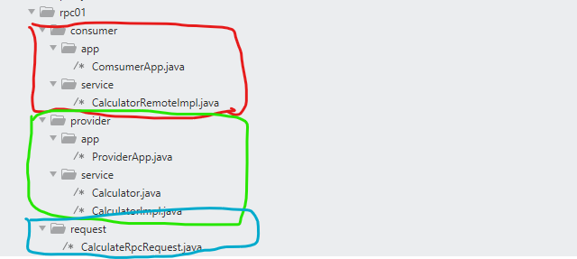

#### RPC简介

>   RPC也就是远程过程调用，他是一个计算机通信协议，允许像调用本地服务一样调用远程服务。

RPC主要为了解决两个问题：

+   解决分布式系统中，服务之间的调用问题。
+   远程调用时，要能够像本地调用一样方便，让调用者不知道远程调用的逻辑。




#### 实例

+   架构



+   服务提供方：首先定义 `Service` 中包含的服务，也就是 `Calculator.java`

    ```java
    package rpc01.provider.service;
    
    public interface Calculator {
        int add(int a,int b);
    }
    ```

    同时定义一个对应的实现类，以便服务器提供服务：

    ```java
    package rpc01.provider.service;
    
    import java.util.Random;
    import java.util.concurrent.TimeUnit;
    
    public class CalculatorImpl implements Calculator{
        @Override
        public int add(int a, int b) {
            int i = 0;
            for (int j = 0; j < b; j++) {
                i += j;
            }
    
            try {
                TimeUnit.SECONDS.sleep(new Random().nextInt(5));
            } catch (InterruptedException e) {
                e.printStackTrace();
            }
            return i;
        }
    }
    ```

    最后在App中开启服务监控，基于socket进行通信。

    ```java
    public class ProviderApp {
        private Calculator calculator = new CalculatorImpl();
        public static void main(String[] args) throws IOException {
            new ProviderApp().run();
        }
    
        private void run() throws IOEDxception {
            ServerSocket listener = new ServerSocket(9090);
            try {
                while (true) {
                    Socket socket = listener.accept();
                    try {
                        ObjectInputStream objectInputStream = new ObjectInputStream(socket.getInputStream());
                        Object object = objectInputStream.readObject();
                        int result = 0;
                        if(object instanceof CalculateRpcRequest) {
                            CalculateRpcRequest calculateRpcRequest = (CalculateRpcRequest) object;
    
                            if("add".equals(calculateRpcRequest.getMethod())) {
                                result = calculator.add(calculateRpcRequest.getA(),calculateRpcRequest.getB());
                            } else {
                                throw new UnsupportedOperationException();
                            }
                        }
    
                        // 返回结果
                        ObjectOutputStream objectOutputStream = new ObjectOutputStream(socket.getOutputStream());
                        objectOutputStream.writeObject(new Integer(result));
                    } catch (ClassNotFoundException e) {
                        e.printStackTrace();
                    } finally {
                        socket.close();
                    }
                }
            } finally {
                listener.close();
            }
        }
    
    }
    ```

+   应用方，首先继承 `Calculator` 并实现自己的 `CalculatorRemoteImpl`

```java

public class CalculatorRemoteImpl implements Calculator {
    public static final int PORT = 9090;
//    private static Logger log = LoggerFactory.getLogger(CalculatorRemoteImpl.class);

    @Override
    public int add(int a, int b) {
//        System.out.println("remote print");
        List<String> addressList = lookupProviders("Calculater.add");
        String address = chooseTarget(addressList);
        try {
                Socket socket = new Socket(address, PORT);

                // 将请求序列化
                CalculateRpcRequest calculateRpcRequest = generateRequest(a, b);

                // 将请求发送服务提供方
                ObjectOutputStream objectOutputStream = new ObjectOutputStream(socket.getOutputStream());
                objectOutputStream.writeObject(calculateRpcRequest);

                ObjectInputStream objectInputStream = new ObjectInputStream(socket.getInputStream());
                Object response = objectInputStream.readObject();

                if(response instanceof Integer) {
                    return (Integer) response;
                } else {
                    throw new InternalError();
                }
        } catch (Exception e) {
            e.printStackTrace();
            throw new InternalError();
        }
    }

    private CalculateRpcRequest generateRequest(int a, int b) {
        CalculateRpcRequest calculateRpcRequest = new CalculateRpcRequest();
        calculateRpcRequest.setA(a);
        calculateRpcRequest.setB(b);
        calculateRpcRequest.setMethod("add");
        return calculateRpcRequest;
    }


    private String chooseTarget(List<String> providers) {
        if (null == providers || providers.size() == 0) {
            throw new IllegalArgumentException();
        }
        return providers.get(0);
    }

    public static List<String> lookupProviders(String name) {
        List<String> strings = new ArrayList();
        strings.add("127.0.0.1");
        return strings;
    }
}

```

然后基于多线程调用：

```java
public class ComsumerApp {
    public static void main(String[] args) {
        Calculator calculator = new CalculatorRemoteImpl();

        for (int i = 0; i < 1000; i++) {
            int j = i;
            new Thread(()-> {
                int result = calculator.add(j, j+1);
                System.out.println(result);
            }).start();
        }
    }
}
```

+   序列化 `CalculateRpcRequest`

```java
public class CalculateRpcRequest implements Serializable {
    private static final long serialVersionUID = 7503710091945320739L;

    private String method;
    private int a;
    private int b;

    public String getMethod() {
        return method;
    }

    public void setMethod(String method) {
        this.method = method;
    }

    public int getA() {
        return a;
    }

    public int getB() {
        return b;
    }

    public void setA(int a) {
        this.a = a;
    }

    public void setB(int b) {
        this.b = b;
    }

    @Override
    public String toString() {
        return "CalculateRpcRequest{" +
                "method='" + method + '\'' +
                ", a=" + a +
                ", b=" + b +
                '}';
    }
}

```


