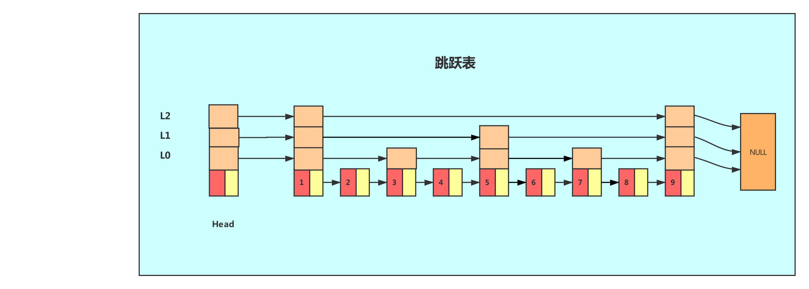

## 1. NoSql数据库概述

#### 1.1 技术发展

NoSql本质是为了解决性能而提出了一种工具。

解决的问题：
+   解决CPU和内存压力（将<key,val>）存放到NoSql数据库中，直接内存保存。
+   解决IO压力（缓存数据库）。


#### 1.2 NoSql 概念

NoSql意为不仅仅是SQL，泛指非关系型数据库，不依赖业务逻辑方式存储，而以简单的key-value模式存储。

+   不遵循SQL标准
+   不支持ACID
+   远超SQL的性能

适应的场景：高并发和海量数据场景

不适应的场景：需要事务的场景。


#### 1.3 Redis相关知识

+   启动操作

    前台启动，直接运行redis-server

    后台启动：

    ```shell
    1. 将redis.conf复制到/etc下，然后修改 daemonize yes
    2. redis-server /etc/redis.conf
    ```

默认端口号是：6379

提供16个数据库，默认使用0号库

Memcanched：
+ 串行vs多线程+锁
+ 不支持持久化
+ 不支持多数据类型


Redis
+ 单线程+多路IO复用
+ 支持持久化
+ 支持多数据类型


## 2. Redis数据类型

#### 2.1 Key 数据

+   加入数据

    ```shell
    # set <key> <value>
    set k1 lucy
    ```

+   常用命令

```shell
keys * 查看当前库的所有key
exists key 判断某个key是否存在
type key 查看key的数据类型
del key 删除指定的key数据
unlink key 非阻塞的删除（异步删除，并不立即删除数据，而是在未来的某个时刻删除）
expire key 设置过期时间
ttl key 查看还有多少秒过期（-1表示永不过期，-2表示已过期）

select 命令切换数据库
dbsize 查看当前数据库的key的数量
flushdb 清空当前库
flushall 通杀全部库
```

#### 2.2 String 数据

String是redis最基本的类型，一个key对应一个val，一个redis中字符串最多512M。

+   常用命令

    ```shell
    set k1 v100 # 设置key值
    append k1 abc # 向value中追加值
    strlen k1 # 获取k1中value的长度
    setnx k3 v300 # 只有当key不存在时才可以设置成功，否者失败
    incr k1 # 将key对应的value加一，针对数字
    decr k1 # 将key对应的value减一，针对数字
    incrby k1 10# 将key对应的value加10，针对数字
    decrny k1 10# 将key对应的value减10，针对数字
    mset k1 v100 k2 v200 k3 v300 # 同时设置多个k-v值
    mget k1 k2 k3 # 同时获取多个k的值
    getrange k1 0 3 # 获取value中从下标0到下标3（包含的数据）
    setrange k1 0 3 # 设置value中从下标0到下标3（包含的数据）
    ```

+   Redis是一个单线程的，所以操作具有原子性

#### 2.3 List 列表

底层本质上是一个**双向链表**，底层的数据结构是一个quickList。

+ 如果只有少量数据，会将这些数据存放到zipList，zipList是连续空间的数据；
+ 如果有大量数据，会将多个zipList连接在一起，构成quickList。

节省了大量的next和prev指针。

+   常用命令

```shell
lpush k1 100 101 102 # 得到 102 --> 101 --> 100
lpop k1 # 从左边pop出来
rpush k2 100 101 102 # 得到 100 --> 101 --> 102
rpop k2 # 从右边pop出来
rpoplpush k1 k2 # 将k1右边pop出来，放到k2的左边
lrange k1 0 -1 # 列出所有元素
lindex k1 0 # 列出下标为0的数据
llen k1 # 获取长度
linsert k2 after pivot value # 从左边开始设置数据
lrem <key> <n> <value> # 从左到右删除n个值为value的元素
```


#### 2.4 Set 集合

底层就是一个value值为null的Hash表。

+   基本命令

    ```shell
    sadd k1 100 101 1002 # 创建一个set
    smembers k1 # 返回set中的元素
    sismember k1 100 # 判断100是否是集合中的成员
    spop k1 # 随机弹出一个元素
    srandmember k1 2 # # 随机返回2个元素
    smove k1 k2 103 # 将k1的103添加到k2中
    sinter k1 k2 # 求两个set的交集
    sunion k1 k2 # 求两个set的并集
    sdiff k1 k2 # 求k1-k2的差集
    sdiff k2 k1 # 求k2-k1的差集
    ```

    

#### 2.5 Hash 类型

就是一个字典类型。

```markdo
reids {
    k1: {name:chenmingxin,age:13}
    k2: {name:wangwu,age:14}
    k3: {name:lisan,age:15}
}
```

Hash类型对应的数据结构是两种：zipList和hashtable数据表：

    +   当field-value长度较短且个数较少，采用zipList
    +   当filed-value长度较长且个数较多，采用hashtable


+   基本操作

    ```shell
    # 设置Hash表
    HSET k1 name chenmingxin age 13
    HSET k2 name wangwu age 14
    HSET k3 name lisan age 15
    
    # 获取一个key的所有元素
    HGETALL k1
    
    # 获取一个key的特定元素
    HGET k1 <field>
    
    # 获取一个key的特定元素
    HGET k1 <field>
    
    # 设置一个key的特定元素
    HSET k1 name zhang
    ```

    


#### 2.6 Zset 有序集合

zset和普通集合很相似，是一个没有重复元素的字符串集合。

不同的是有序集合的每个成员都关联一个评分，这个评分被用来按照从低分到最高分方式排序集合中的成员。

+   常用命令

```shell
# 添加命令 zadd <key> <score> <value> <score> <value> <score> <value>
zadd topn 100 python 200 java 3000 mysql 50 php

zrange topn 0 -1 # 按照升序输出zset集合
zrange topn 0 -1 WITHSCORES # 按照升序输出zset集合，并打印分数

zrevrange topn 0 -1 # 按照降序输出zset集合
zrevrange topn 0 -1 WITHSCORES # 按照降序输出zset集合，并打印分数

zrangebyscore topn 300 500 withscores # 输出指定范围的zset集合
zrevrangebyscore topn 500 300 withscores # 逆序输出指定范围的zset集合

zincrby topn 100 java # 为java增加100的分数

zrem topn java # 删除java元素

zcount topn 100 400 # 输出分数在100到400的元素数量

zrank topn python # 输出python在zset的序号，下标从0开始
```

+   底层原理 [🔗](https://blog.csdn.net/weichi7549/article/details/107335133)

    采用了两个数据结构，**这和LRU_CACHE中，用一个字典+双向链表一样**。dict用来查询数据到分数的对应关系，而skiplist用来根据分数查询数据（可能是范围查找）。Java中的TreeSet也是有序的，只不过利用是红黑树实现。

    ```c
    typedef struct zset{
         //跳跃表，根据情况采用不同的数据结构
         zskiplist *zsl; 
         //字典
         dict *dice;
    } zset;
    ```
    
    
    
    （1）hash，hash表的作用就是关联元素value和权重score，保证元素的唯一性，可以通过元素value找到相应的score值
    
    （2）zipList/跳跃表，跳跃表在于对value进行排序。比红黑树更加高效。



+   zipList于skipList的选择

当满足下面条件时，使用zipList：

```python
1. 保存的元素少于128个
2. 保存的所有元素大小都小于64字节
```

不满足这两个条件则使用skiplist。

#### 为什么使用skiplist而不使用红黑树/B+树之类的

+   skiplist可以快速进行范围查找
+   内存上，skiplist更加节省空间
+   算法实现难度上，skiplist更加简单。

## 3. 发布与订阅

+   客户端一

    ```shell
    SUBSCRIBE channel1
    ```

+   客户端二

    ```shell
    publish channel1 hello
    ```


## 4. Redis新类型

#### 4.1 Bitmap 

+   常用命令

    ```shell
    setbit user:2021 1 1
    setbit user:2021 12 1
    setbit user:2021 15 1
    
    getbit user:2021 15 # --> 1
    
    bitcount user:2021  # --> 3
    
    bitop and result user:2021 user:2022 # 将user:2021 user:2022两个key进行求交操作
    ```


#### 4.2 HypeLogLog

Redis HyperLogLog 是用来做基数统计的算法，HyperLogLog 的优点是，在输入元素的数量或者体积非常非常大时，计算基数所需的空间总是固定 的、并且是很小的。
在 Redis 里面，每个 HyperLogLog 键只需要花费 12 KB 内存，就可以计算接近 2^64 个不同元素的基 数。这和计算基数时，元素越多耗费内存就越多的集合形成鲜明对比。
但是，因为 HyperLogLog 只会根据输入元素来计算基数，而不会储存输入元素本身，所以 HyperLogLog 不能像集合那样，返回输入的各个元素。

+   常见命令

    ```shell
    pfadd prog java # 添加元素
    pfcount prog # 得到数量
    pfmerge target k1 k2 # 将k1和k2两个HypeLogLog进行合并
    ```

    

#### 4.3 GeoSpatial

+   常见命令

    ```shell
    geoadd china 103.42 31.43 chongqing
    geoadd china 105.34 32.53 shanghai
    
    getpos china chongqing 
    # --->
    # 1) 1) "103.42000097036361694"
    #    2) "31.43000121283547088"
    
    
    # 计算两个城市的距离
    geodist china chongqing shanghai km
    ```


