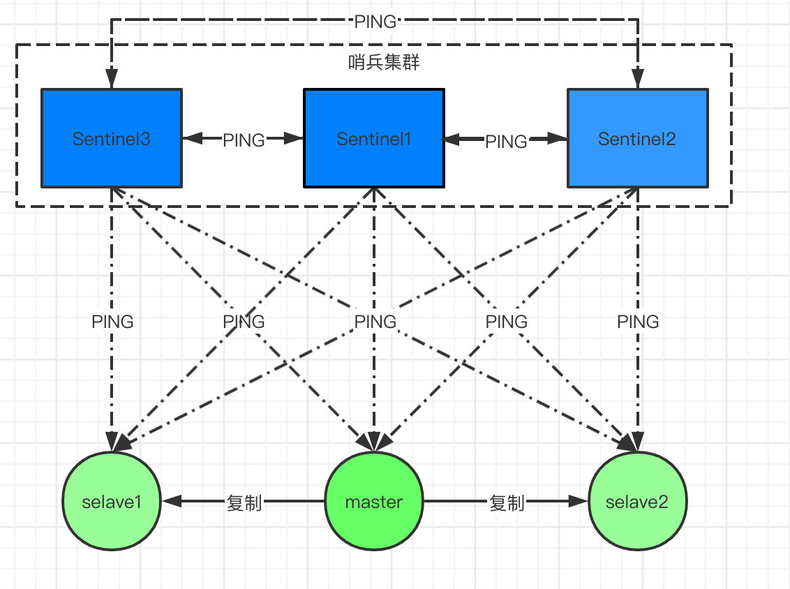

#### Redis支持的Java的客户端


#### Redis 存储原理

+   全局哈希表


+   一个dictEntry的数据内容

    

+   dict的value的数据类型


## Redis 基本数据结构

#### 概述

+   第一个层面，是从使用者的角度。比如：
    +   string
    +   list
    +   hash
    +   set
    +   sorted set

这一层面也是Redis暴露给外部的调用接口。

+   第二个层面，是从内部实现的角度，属于更底层的实现。比如：

    +   dict 字典

        +   OBJ_ENCODING_HT: 表示成dict。

    +   sds ~ `simple dynamic string`

        +   OBJ_ENCODING_EMBSTR: 表示成一种特殊的嵌入式的sds。

    +   ziplist 

        +   OBJ_ENCODING_ZIPLIST: 表示成ziplist。

    +   **quicklist**  

        +   OBJ_ENCODING_QUICKLIST: 表示成quicklist。用于list数据结构。

    +   skiplist

        +   OBJ_ENCODING_SKIPLIST: 表示成skiplist。用于sorted set数据结构。

        

#### Redis数据存储的关注重点

+   **存储效率**。Redis是专用于存储数据的，它对于计算机资源的主要消耗就在于内存，因此节省内存是它非常非常重要的一个方面。这意味着Redis一定是非常精细地考虑了压缩数据、减少内存碎片等问题。

+   **快速响应时间**。快速响应时间相对的，是高吞吐量（high throughput）。Redis是用于提供在线访问的，对于单个请求的响应时间要求很高，因此，快速响应时间是比高吞吐量更重要的目标。有时候，这两个目标是矛盾的。

+   **单线程**。Redis的性能瓶颈不在于CPU资源，而在于内存访问和网络IO，在处理客户端请求时，是单线程场景下，但是在读写数据的时候，还是有可能创建子线程进行多线程运行的。在单线程下，redis是这么处理的，命令是一条一条处理的，由于redis是IO密集型而不是计算密集型，因此单线程对整体影响不大。【Redis在持久化的时候也是会采用多线程】

    

    这里的READ和WRITE表示的是对客户端数据的读写。而redis 6.0之后的读写操作也指的是这些读写操作的读写。

    

    

#### ziplist & skipList & quicklist

+   skipList 

    redis只在两个地方使用了跳跃表，一个是实现有序集合键，另一个是在集群节点中用作内部数据结构。

+   ziplist

>   翻译一下就是说：ziplist是一个经过特殊编码的双向链表，它的设计目标就是为了提高存储效率。ziplist可以用于存储字符串或整数，其中整数是按真正的二进制表示进行编码的，而不是编码成字符串序列。它能以O(1)的时间复杂度在表的两端提供`push`和`pop`操作。

**ziplist是一个经过特殊编码的双向链表，它的设计目标就是为了提高存储效率。**压缩列表本质上就是一个字节数组，是Redis为了节约内存而设计的一种线性数据结构，可以包含多个元素，每个元素可以是一个字节数组或一个整数。Redis的有序集合、散列和列表都直接或者间接使用了压缩列表。

+   quicklist

当元素数量大于128个且所有元素长度大于64字节时，Redis使用快速链表（quicklist）数据结构存储，而快速链表就是双向链表与压缩列表的组合。

```c++
typedef struct quicklist{
	quicklistNode *head;
	quicklistNode *tail;
	unsigned long count;//快速列表中元素总数
	unsigned long len;//快速列表中Node（节点）个数
	int fill : 16;//每个quicklistNode中ziplist长度
}quicklist;
```


#### Redis 三种过期策略

+ a.定时删除

​    含义：**在设置key的过期时间的同时，为该key创建一个定时器，让定时器在key的过期时间来临时，对key进行删除**

​    优点：**保证内存被尽快释放**

​    缺点：若过期key很多，**删除这些key会占用很多的CPU时间**，在CPU时间紧张的情况下，CPU不能把所有的时间用来做要紧的事儿，还需要去花时间删除这些key定时器的创建耗时，若**为每一个设置过期时间的key创建一个定时器（将会有大量的定时器产生），性能影响严重**

+ b.懒汉式删除

​    含义：**key过期的时候不删除，每次通过key获取值的时候去检查是否过期，若过期，则删除，返回null（用的时候再检查           删除）**。

​    优点：删除操作**只发生在通过key取值的时候发生**，而且只删除当前key，所以**对CPU时间的占用是比较少**的，而且此时的删除是已经到了非做不可的地步（如果此时还不删除的话，我们就会获取到了已经过期的key了）

​    缺点：若**大量的key在超出超时时间**后，很久一段时间内，都**没有被获取过，那么可能发生内存泄露（无用的垃圾占用了大量的内存）**

+ c.定期删除

​    含义：**每隔一段时间执行一次删除过期key操作**

​    优点：**通过限制删除操作的时长和频率，来减少删除操作对CPU时间的占用--处理"定时删除"的缺点定期删除过期key--处理"懒汉式删除"的缺点**
​    缺点：**在内存友好方面，不如"定时删除"（会造成一定的内存占用，但是没有懒汉式那么占用内存）**
 **在CPU时间友好方面，不如"懒汉式删除"（会定期的去进行比较和删除操作，cpu方面不如懒汉式，但是比定时好）**
​    难点：**合理设置删除操作的执行时长（每次删除执行多长时间）和执行频率（每隔多长时间做一次删除）（这个要根据服务器运行情况来定了），每次执行时间太长，或者执行频率太高对cpu都是一种压力**。每次**进行定期删除操作执行之后**，需要**记录遍历循环到了哪个标志位**，以便下一次定期时间来时，从上次位置开始进行循环遍历


## Redis使用场景

#### 缓存

将热点数据放到内存中，设置内存的最大使用量，并且可以为Redis每个键设置过期时间，当键过期时，会自动删除该键。。

查找表和缓存的区别在于，查找表不可以失效，而缓存可以失效。


#### 分布式锁实现

在分布式场景下，无法使用单机环境下的锁来对多个节点上的进程进行同步。

可以使用 Redis 自带的 SETNX 命令实现分布式锁，除此之外，还可以使用官方提供的 RedLock 分布式锁实现。

>   加锁

加锁实际上就是在redis中，给Key键设置一个值，为避免死锁，并给定一个过期时间。

```shell
SET lock_key random_value NX PX 5000 # 表示毫秒
```

>   解锁

解锁的过程就是将Key键删除。但也不能乱删，不能说客户端1的请求将客户端2的锁给删除掉。这时候`random_value`的作用就体现出来。


#### Redis 与 Memcached

+   数据类型，redis支持5种数据类型，而memcached只支持字符串类型。
+   redis支持数据持久化，而Memcached不支持
+   redis cluster 支持分布式，而Memcached不支持


#### 数据淘汰策略

| 策略            | 描述                                                 |
| --------------- | ---------------------------------------------------- |
| volatile-lru    | 从已设置过期时间的数据集中挑选最近最少使用的数据淘汰 |
| volatile-ttl    | 从已设置过期时间的数据集中挑选将要过期的数据淘汰     |
| volatile-random | 从已设置过期时间的数据集中任意选择数据淘汰           |
| allkeys-lru     | 从所有数据集中挑选最近最少使用的数据淘汰             |
| allkeys-random  | 从所有数据集中任意选择数据进行淘汰                   |
| no-eviction     | 禁止驱逐数据                                         |


## 数据持久化

#### RDB 持久化

将某个时间点的所有数据都存放到硬盘上。

可以将快照复制到其它服务器从而创建具有相同数据的服务器副本。

如果系统发生故障，将会丢失最后一次创建快照之后的数据。

如果数据量很大，保存快照的时间会很长。

#### AOF 持久化

类似于mysql种的binlog，将写命令添加到AOF文件的末尾。（Append Only File）

**针对AOF的持久化需要设置同步选项**，从而确保写命令同步到磁盘文件上的时机，这是因为对文件进行写入并不会立马生效，而是由操作系统决定什么时候写入。

| 选项     | 同步频率                 |
| -------- | ------------------------ |
| always   | 每个写命令都同步         |
| everysec | 每秒同步一次             |
| no       | 让操作系统来决定何时同步 |


#### redis事务

redis事务用multi开启，加入命令则入队，最后用exec进行执行。

单个 Redis 命令的执行是原子性的，但 Redis 没有在事务上增加任何维持原子性的机制，所以 Redis 事务的执行并不是原子性的。

也就是说，如果在 set b bbb 处失败，set a 已成功不会回滚，set c 还会继续执行。

```python
redis 127.0.0.1:7000> multi
OK
redis 127.0.0.1:7000> set a aaa
QUEUED
redis 127.0.0.1:7000> setnx a bbb
QUEUED
redis 127.0.0.1:7000> set c ccc
QUEUED
redis 127.0.0.1:7000> exec
1) OK
2) 0
3) OK
```

主要目的是：**事务中的多个命令被一次性发送给服务器，而不是一条一条发送，这种方式被称为流水线，它可以减少客户端与服务器之间的网络通信次数从而提升性能。**


## Redis业务场景

#### 为什么是单线程的？

+   采用单线程，避免了不必要的上下文切换和竞争条件，也不存在多进程或者多线程导致的切换而消耗 CPU，不用去考虑各种锁的问题，不存在加锁释放锁操作，没有因为可能出现死锁而导致的性能消耗；

+   使用多路I/O复用模型，非阻塞IO；

    +   **这里“多路”指的是多个网络连接，“复用”指的是复用同一个线程。**采用多路 I/O 复用技术可以让单个线程高效的处理多个连接请求（尽量减少网络 IO 的时间消耗），且 Redis 在内存中操作数据的速度非常快，也就是说内存内的操作不会成为影响Redis性能的瓶颈，主要由以上几点造就了 Redis 具有很高的吞吐量。

    +   多路I/O复用模型是利用 select、poll、epoll 可以同时监察多个流的 I/O 事件的能力，在空闲的时候，会把当前线程阻塞掉，当有一个或多个流有 I/O 事件时，就从阻塞态中唤醒，于是程序就会轮询一遍所有的流（epoll 是只轮询那些真正发出了事件的流），并且只依次顺序的处理就绪的流，这种做法就避免了大量的无用操作。


#### 什么是CAP定理

-   Consistency 一致性
-   Availability 可用性
-   Partition tolerance 分区容错性


#### 什么是缓存穿透

一般的缓存系统，都是按照key去缓存查询，如果不存在对应的value，就应该去后端系统查找（比如DB）。一些恶意的请求会故意查询不存在的key,请求量很大，就会对后端系统造成很大的压力。这就叫做缓存穿透。

+   对一定不存在的key进行过滤。可以把所有的可能存在的key放到一个大的Bitmap中，查询时通过该bitmap过滤。
+   对不存在的key也进行缓存


#### 什么是缓存雪崩

当缓存服务器重启或者大量缓存集中在某一个时间段失效，这样在失效的时候，会给后端系统带来很大压力。导致系统崩溃。

+   不同的key，设置不同的过期时间，让缓存失效的时间点尽量均匀。
+   做二级缓存，A1为原始缓存，A2为拷贝缓存，A1失效时，可以访问A2，A1缓存失效时间设置为短期，A2设置为长期


#### Redis 主从 、哨兵和集群分片

[一文读懂Redis的四种模式，单机、主从、哨兵、集群](https://www.cnblogs.com/zhonglongbo/p/13128955.html)

集群分片 比如 5主5从，也就是说 数据过来之后会均匀的分配到5台服务器上面，5台服务器上面的数据是不同的，但是每个服务器都有一个从服务器，上面的数据跟这一台主服务器的数据是一样的；

也就是说，对于这5对服务器总体来说，这就是集群分片模式，而对于这5对服务器的每一对，都是一个主从模式

关于哨兵模式，就类似于zookeeper的选举模式一样，5个服务器需要一个管理的主机，他们需要选举出来，这就是哨兵模式

**主从模式：**


**哨兵模式：**

每个Sentinel以 每秒钟 一次的频率，向它**所有**的 **主服务器**、**从服务器** 以及其他Sentinel**实例** 发送一个PING 命令。



**集群分片模式：**

`ps`:`CRC16`算法产生的hash值有16bit，该算法可以产生2^16-=65536个值。换句话说，值是分布在0~65535之间。那作者在做`mod`运算的时候，为什么不`mod`65536，而选择`mod`16384？

redis集群的节点数量一般不会超过1000，16384完全足够了, 降低通信过程中传输数据的大小，`16384//8=2048=2KB`


**利用三者实现一个高可用的+高性能的读写分离的机构：**


或者：


#### Reids 常见命令


#### Redis单线程原理

首先必须明确，Redis单线程指的是网络请求模块使用了一个线程（，其他模块仍用了多个线程。并不是一个线程完成了所有功能。原理上，其采用了利用epoll的多路复用特性，因此可以采用单线程处理其网络请求。

#### Redis数据类型

String：字符串类型，最简单的类型 Hash：类似于Map的一种结构。List：有序列表。Set:无序集合。ZSet：带权值的无序集合，即每个ZSet元素还另有一个数字代表权值，集合通过权值进行[排序](https://www.nowcoder.com/jump/super-jump/word?word=排序)。

#### 什么情况下使用[redis](https://www.nowcoder.com/jump/super-jump/word?word=redis)

1.  针对热点数据进行缓存
2.  对于特定限时数据的存放
3.  针对带热点权值数据的[排序](https://www.nowcoder.com/jump/super-jump/word?word=排序)list
4.  分布式锁


#### [redis](https://www.nowcoder.com/jump/super-jump/word?word=redis)与memcache的区别

1.  [redis](https://www.nowcoder.com/jump/super-jump/word?word=redis)处理网络请求采用单线程模型，而memcache采用多线程异步IO的方式
2.  [redis](https://www.nowcoder.com/jump/super-jump/word?word=redis)支持数据持久化，memcache不支持
3.  [redis](https://www.nowcoder.com/jump/super-jump/word?word=redis)支持的数据格式比memcache更多

#### 简述缓存雪崩

缓存雪崩指缓存中一大批数据到过期时间，而从缓存中删除。但该批数据查询数据量巨大，查询全部走数据库，造成数据库压力过大。

#### 简述缓存雪崩的避免方式

1.  缓存数据设置随机过期时间，防止同一时间大量数据过期。
2.  设置热点数据永远不过期。
3.  对于集群部署的情况，将热点数据均与分布在不同缓存中。
