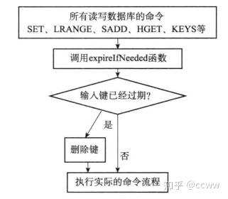
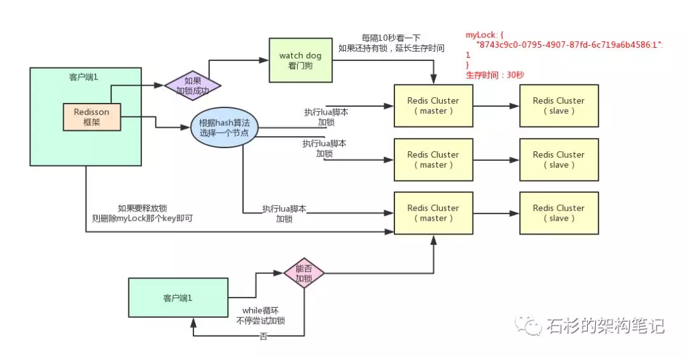

#### redisDb 数据库结构

```c
/*
 * 数据库结构
 */
typedef struct redisDb {
    // key space，包括键值对象
    dict *dict;                 /* The keyspace for this DB */
    
    // 保存 key 的过期时间
    dict *expires;              /* Timeout of keys with a timeout set */
    
    // 正因为某个/某些 key 而被阻塞的客户端
    dict *blocking_keys;        /* Keys with clients waiting for data (BLPOP) */
    
    // 某个/某些接收到 PUSH 命令的阻塞 key
    dict *ready_keys;           /* Blocked keys that received a PUSH */
    
    // 正在监视某个/某些 key 的所有客户端
    dict *watched_keys;         /* WATCHED keys for MULTI/EXEC CAS */
    
    // 数据库的号码
    int id;
} redisDb;
```

其中：
`dict`：**dict字典用来保存数据库中的所有键值对**
`expires`: **保存数据库中所有键的过期时间，过期时间用UNIX时间戳表示，且值为long long整数**

>   过期时间的保存与判定

1.  检查给定键是否存在于`过期字典`，如果存在，取出键的过期时间。
2.  通过判断当前UNIX时间戳是否大于键的过期时间，是的话，键已过期，相反则键未过期。

>   过期键的删除策略

1.  **定时删除**：在设置键的过期时间的同时，创建一个定时任务，当键达到过期时间时，立即执行对键的删除操作

2.  **惰性删除**：放任键过期不管，但在每次从键空间获取键时，都检查取得的键是否过期，如果过期的话，就删除该键，如果没有过期，就返回该键

    

    ```c
    robj *lookupKeyRead(redisDb *db, robj *key) {
        robj *val;
    
        // 检查 key 是否过期，如果是的话，将它删除
        expireIfNeeded(db,key); // <--------
    
        // 查找 key ，并根据查找结果更新命中/不命中数
        val = lookupKey(db,key);
        if (val == NULL)
            server.stat_keyspace_misses++;
        else
            server.stat_keyspace_hits++;
    
        // 返回 key 的值
        return val;
    }
    
    
    /*
     * 如果 key 已经过期，那么将它删除，否则，不做动作。
     *
     * key 没有过期时间、服务器正在载入或 key 未过期时，返回 0 
     * key 已过期，那么返回正数值
     */
    int expireIfNeeded(redisDb *db, robj *key) {
        // 取出 key 的过期时间
        long long when = getExpire(db,key);
    
        // key 没有过期时间，直接返回
        if (when < 0) return 0; /* No expire for this key */
    
        /* Don't expire anything while loading. It will be done later. */
        // 不要在服务器载入数据时执行过期
        if (server.loading) return 0;
    
        /* If we are running in the context of a slave, return ASAP:
         * the slave key expiration is controlled by the master that will
         * send us synthesized DEL operations for expired keys.
         *
         * Still we try to return the right information to the caller, 
         * that is, 0 if we think the key should be still valid, 1 if
         * we think the key is expired at this time. */
        // 如果服务器作为附属节点运行，那么直接返回
        // 因为附属节点的过期是由主节点通过发送 DEL 命令来删除的
        // 不必自主删除
        if (server.masterhost != NULL) {
            // 返回一个理论上正确的值，但不执行实际的删除操作
            return mstime() > when;
        }
    
        /* Return when this key has not expired */
        // 未过期
        if (mstime() <= when) return 0;
    
        /* Delete the key */
        server.stat_expiredkeys++;
    
        // 传播过期命令
        propagateExpire(db,key);
    
        // 从数据库中删除 key
        return dbDelete(db,key);
    }
    ```

    

3.  **定期删除**：每隔一点时间，程序就对数据库进行一次检查，删除里面的过期键，至于要删除多少过期键，以及要检查多少个数据库，则由算法决定。[🔗](https://github.com/huangz1990/annotated_redis_source/blob/67758fdfe196d96ddc8a83784fa48f22226a3818/src/redis.c)

```c
/*
 * 主动清除过期 key 
 */
void activeExpireCycle(void) {
    int j, iteration = 0;
    long long start = ustime(), timelimit;

    /* We can use at max REDIS_EXPIRELOOKUPS_TIME_PERC percentage of CPU time
     * per iteration. Since this function gets called with a frequency of
     * REDIS_HZ times per second, the following is the max amount of
     * microseconds we can spend in this function. */
    // 这个函数可以使用的时长（毫秒）
    timelimit = 1000000*REDIS_EXPIRELOOKUPS_TIME_PERC/REDIS_HZ/100;
    if (timelimit <= 0) timelimit = 1;

    for (j = 0; j < server.dbnum; j++) {
        int expired;
        redisDb *db = server.db+j;

        /* Continue to expire if at the end of the cycle more than 25%
         * of the keys were expired. */
        do {
            unsigned long num = dictSize(db->expires);
            unsigned long slots = dictSlots(db->expires);
            long long now = mstime();

            /* When there are less than 1% filled slots getting random
             * keys is expensive, so stop here waiting for better times...
             * The dictionary will be resized asap. */
            // 过期字典里只有 %1 位置被占用，调用随机 key 的消耗比较高
            // 等 key 多一点再来
            if (num && slots > DICT_HT_INITIAL_SIZE &&
                (num*100/slots < 1)) break;

            /* The main collection cycle. Sample random keys among keys
             * with an expire set, checking for expired ones. */
            // 从过期字典中随机取出 key ，检查它是否过期
            expired = 0;    // 被删除 key 计数
            if (num > REDIS_EXPIRELOOKUPS_PER_CRON) // 最多每次可查找的次数
                num = REDIS_EXPIRELOOKUPS_PER_CRON;
            while (num--) {
                dictEntry *de;
                long long t;

                // 随机查找带有 TTL 的 key ，看它是否过期
                // 如果数据库为空，跳出
                if ((de = dictGetRandomKey(db->expires)) == NULL) break;

                t = dictGetSignedIntegerVal(de);
                if (now > t) {
                    // 已过期
                    sds key = dictGetKey(de);
                    robj *keyobj = createStringObject(key,sdslen(key));

                    propagateExpire(db,keyobj);
                    dbDelete(db,keyobj);
                    decrRefCount(keyobj);
                    expired++;
                    server.stat_expiredkeys++;
                }
            }
            /* We can't block forever here even if there are many keys to
             * expire. So after a given amount of milliseconds return to the
             * caller waiting for the other active expire cycle. */
            // 每次进行 16 次循环之后，检查时间是否超过，如果超过，则退出
            iteration++;
            if ((iteration & 0xf) == 0 && /* check once every 16 cycles. */
                (ustime()-start) > timelimit) return;

        } while (expired > REDIS_EXPIRELOOKUPS_PER_CRON/4);
    }
}

```

>   针对持久化（AOF和RDB的操作）

+   RDB

程序会数据库中的键进行检查，已过期的键不会保存到新创建的RDB文件中

+   AOF

AOF文件写入：当过期键被删除后，会在AOF文件增加一条DEL命令，来显式地记录该键已被删除。
AOF重写：已过期的键不会保存到重写的AOF文件中，**重写类似于指令重排。**


#### Redis LRU操作

[Redis的LRU算法](https://www.cnblogs.com/hapjin/archive/2019/06/07/10933405.html)

Java中按照HashMap和双向链表实现LRU，需要额外存储存放next和prev指针，会牺牲掉比较大的存储空间，redis采用了一个近似的做法，**就是随机取出若干个key，然后按照访问时间排序后，淘汰掉最不经常使用的**。

Redis主要分为两类策略，分别是`allkeys-lru` 和 `volatile-lru`，`allkeys`表示从所有的键中删除，而`volatile `表示从`expire`的键中选取。

[/src/redis.c](https://github.com/huangz1990/annotated_redis_source/blob/67758fdfe196d96ddc8a83784fa48f22226a3818/src/redis.c)

```python
/* volatile-lru and allkeys-lru policy */
// LRU 算法
else if (server.maxmemory_policy == REDIS_MAXMEMORY_ALLKEYS_LRU ||
         server.maxmemory_policy == REDIS_MAXMEMORY_VOLATILE_LRU)
{
    for (k = 0; k < server.maxmemory_samples; k++) {
        sds thiskey;
        long thisval;
        robj *o;

        de = dictGetRandomKey(dict);
        thiskey = dictGetKey(de);
        /* When policy is volatile-lru we need an additional lookup
        * to locate the real key, as dict is set to db->expires. */
        if (server.maxmemory_policy == REDIS_MAXMEMORY_VOLATILE_LRU)
        de = dictFind(db->dict, thiskey);
        o = dictGetVal(de);
        thisval = estimateObjectIdleTime(o);

        /* Higher idle time is better candidate for deletion */
        if (bestkey == NULL || thisval > bestval) {
            bestkey = thiskey;
            bestval = thisval;
        }
    }
}
```

#### Redis是如何实现分布式锁的？

[拜托，面试请不要再问我Redis分布式锁的实现原理【石杉的架构笔记】](https://mp.weixin.qq.com/s?__biz=MzU0OTk3ODQ3Ng==&mid=2247483893&idx=1&sn=32e7051116ab60e41f72e6c6e29876d9)



>   加锁机制

主要分为两个步骤：
+   判断锁是否存在：`exists myLock`。
+   判断当前客户端的hash值是否等于redis中的键。

第一次加锁，会得到下面的结果：


代表`8743c9c0-0795-4907-87fd-6c719a6b4586:1`这个客户端对`myLock`这个锁key完成了加锁。

接着会执行`pexpire myLock 30000`命令，设置`myLock`这个锁key的生存时间是30秒。

>   锁互斥机制

那么在这个时候，如果客户端2来尝试加锁，执行了同样的一段lua脚本，会咋样呢？

很简单:

+   第一个if判断会执行`exists myLock`，发现myLock这个锁key已经存在了。
+   接着第二个if判断，判断一下，myLock锁key的hash数据结构中，是否包含客户端2的ID，但是明显不是的，因为那里包含的是客户端1的ID。

所以，客户端2会获取到`pttl myLock`返回的一个数字，这个数字代表了myLock这个锁key的剩余生存时间。比如还剩15000毫秒的生存时间。此时客户端2会进入一个while循环，不停的尝试加锁。

>   watch dog自动延期机制

客户端1加锁的锁key默认生存时间才30秒，如果超过了30秒，客户端1还想一直持有这把锁，怎么办呢？

简单！只要客户端1一旦加锁成功，就会启动一个watch dog看门狗，他是一个后台线程，会每隔10秒检查一下，如果客户端1还持有锁key，那么就会不断的延长锁key的生存时间。

>   可重入加锁机制

那如果客户端1都已经持有了这把锁了，结果可重入的加锁会怎么样呢？

比如下面这种代码：


+ 第一个if判断肯定不成立，“exists myLock”会显示锁key已经存在了。
+ 第二个if判断会成立，因为myLock的hash数据结构中包含的那个ID，就是客户端1的那个ID，也就是“8743c9c0-0795-4907-87fd-6c719a6b4586:1”

此时就会执行可重入加锁的逻辑，他会用：incrby myLock

通过这个命令，对客户端1的加锁次数，累加1。此时myLock数据结构变为下面这样：


 


