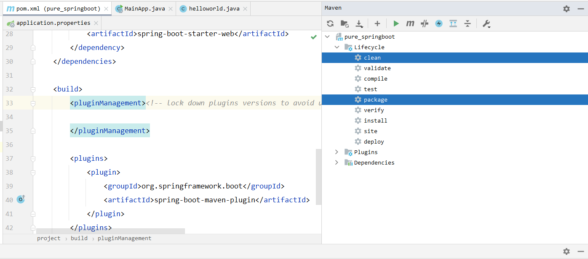

#### 1. 首先配置 `pom.xml` 文件

```xml
    <groupId>com.mingxin</groupId>
    <artifactId>pure_springboot</artifactId>
    <version>1.0-SNAPSHOT</version>
    <packaging>jar</packaging>

    <parent>
        <groupId>org.springframework.boot</groupId>
        <artifactId>spring-boot-starter-parent</artifactId>
        <version>2.3.4.RELEASE</version>
    </parent>

    <properties>
        <project.build.sourceEncoding>UTF-8</project.build.sourceEncoding>
        <maven.compiler.source>1.8</maven.compiler.source>
        <maven.compiler.target>1.8</maven.compiler.target>
    </properties>


    <dependencies>
        <dependency>
            <groupId>org.springframework.boot</groupId>
            <artifactId>spring-boot-starter-web</artifactId>
        </dependency>
    </dependencies>

    <build>
        <pluginManagement><!-- lock down plugins versions to avoid using Maven defaults (may be moved to parent pom) -->

        </pluginManagement>
    </build>
```

#### 2. 撰写 主程序类

```java
@SpringBootApplication
public class MainApp {
    public static void main(String[] args) {
        SpringApplication.run(MainApp.class,args);
    }
}
```

#### 3. 撰写业务类

```java
@Controller
@ResponseBody
public class helloworld {
    @RequestMapping("/hello.do")
    public String Hello() {
        return "spring boot2!";
    }
}
```

#### 4. 配置 `application.properties` 属性

```properties
server.port=8888
```

#### 5. 打包成可执行 `jar` 文件



然后利用命令，直接启动对应的项目：

```shell
java -jar pure_springboot-1.0-SNAPSHOT.jar
```

