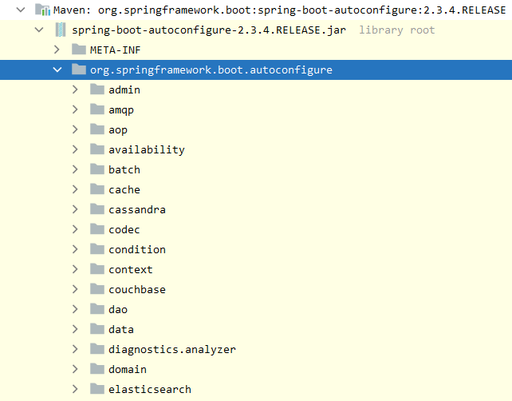

## 1. 依赖管理

#### 1.1 依赖管理

```xml
# 主项目用于 `依赖管理`
<parent>
     <groupId>org.springframework.boot</groupId>
     <artifactId>spring-boot-starter-parent</artifactId>
     <version>2.3.4.RELEASE</version>
</parent>
```

#### 1.2 自动依赖版本号

```xml
<properties>
    <mysql.version>5.1.43</mysql.version> # 配置mysql版本号
    <project.build.sourceEncoding>UTF-8</project.build.sourceEncoding>
    <maven.compiler.source>1.8</maven.compiler.source>
    <maven.compiler.target>1.8</maven.compiler.target>
</properties>
```


## 2. 自动装配


#### 2.1 场景启动器

```xml
<dependencies>
    <dependency>
        <groupId>org.springframework.boot</groupId>
        <artifactId>spring-boot-starter-web</artifactId>
    </dependency>
</dependencies>
```


+   引入了Tomcat  `spring-boot-starter-tomcat`
+   引入了SpringMVC  `spring-webmvc`
+   引入常见包 比如 `json` 包等
+   引入了默认的包扫描
    +   **主程序所在的包以及对应的自包都会被自动扫描。**
    +   需要想要扫描指定包的路径，可以在`@SpringBootApplication(scanBasePackages="com.mingxin")`中设置

+   SpringBoot的自动配置全部在  `spring-boot-autoconfigure` 包下

    